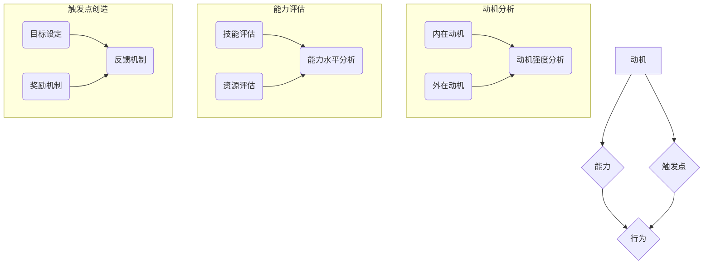

                 

# 利用福格模型设计管理激励机制

> 关键词：福格模型、管理激励机制、动机、行为、反馈、工作场所、员工参与

> 摘要：本文将深入探讨福格模型在企业管理中的应用，通过分析其核心概念和原理，结合实际案例，探讨如何设计有效的管理激励机制，激发员工工作积极性，提升整体工作效能。

## 1. 背景介绍

### 1.1 目的和范围

本文旨在探讨福格模型在企业管理中的应用，特别是如何利用该模型设计管理激励机制，从而提高员工的工作积极性和整体工作效能。文章将涵盖以下几个方面：

1. 福格模型的背景和核心概念。
2. 福格模型在企业管理中的应用。
3. 设计管理激励机制的具体方法。
4. 福格模型在实践中的实际效果。

### 1.2 预期读者

本文适合企业管理者、人力资源从业者以及对管理激励有兴趣的专业人士阅读。通过对福格模型的深入理解，读者可以更好地设计管理激励机制，提升团队绩效。

### 1.3 文档结构概述

本文分为以下章节：

1. 背景介绍
   - 目的和范围
   - 预期读者
   - 文档结构概述
   - 术语表
2. 核心概念与联系
   - 福格模型的定义
   - 动机与行为的联系
   - 反馈机制的重要性
3. 核心算法原理 & 具体操作步骤
   - 福格模型的计算公式
   - 设计激励机制的步骤
4. 数学模型和公式 & 详细讲解 & 举例说明
   - 动机公式详解
   - 行为模型分析
5. 项目实战：代码实际案例和详细解释说明
   - 案例背景
   - 案例实现
   - 案例分析
6. 实际应用场景
   - 企业管理中的应用
   - 人力资源管理中的应用
7. 工具和资源推荐
   - 学习资源
   - 开发工具框架
   - 相关论文著作
8. 总结：未来发展趋势与挑战
9. 附录：常见问题与解答
10. 扩展阅读 & 参考资料

### 1.4 术语表

#### 1.4.1 核心术语定义

- 福格模型：一种用于分析人类行为和动机的模型。
- 动机：驱使个体采取特定行为的内在驱动力。
- 行为：个体在外界刺激下采取的具体行动。
- 反馈：行为发生后，个体从中获得的正面或负面信息。

#### 1.4.2 相关概念解释

- 激励：通过提供奖励或其他手段来激发个体的动机。
- 激励机制：组织内部用于激发员工动机的体系。

#### 1.4.3 缩略词列表

- HR：人力资源管理
- IDE：集成开发环境
- UI：用户界面

## 2. 核心概念与联系

福格模型是由行为科学家BJ福格提出的一种用于分析人类行为和动机的理论模型。该模型的核心思想是：动机、能力和触发点是驱动个体采取特定行为的三大要素。

### 2.1 福格模型的定义

福格模型认为，个体行为的产生是由以下三个要素共同作用的结果：

1. 动机：个体内心渴望获得某种结果或满足某种需求的心理状态。
2. 能力：个体具备完成特定行为所需的技能、资源和时间。
3. 触发点：外部刺激或情境，促使个体采取特定行为。

只有当这三个要素同时具备时，个体才会采取特定行为。例如，假设一个人（动机）渴望减肥（能力），但如果没有具体的减肥计划（触发点），那么这个人很可能不会采取实际行动去减肥。

### 2.2 动机与行为的联系

动机是驱动个体采取行为的内在驱动力。动机可以分为两种类型：内在动机和外在动机。

1. 内在动机：源自个体内心的兴趣、好奇心和自我实现需求。例如，一个人因为喜欢编程而愿意投入大量时间和精力去学习和实践。
2. 外在动机：源自外部奖励或惩罚。例如，一个人为了获得奖金或避免被处罚而工作。

动机与行为之间存在紧密的联系。具有强烈动机的个体更可能采取相应行为。因此，管理者需要了解员工的动机类型，以便设计出更有效的激励机制。

### 2.3 反馈机制的重要性

反馈是行为发生后，个体从中获得的正面或负面信息。反馈机制在福格模型中扮演着重要角色。一方面，正面反馈可以增强个体的动机，促使他们继续采取有利行为；另一方面，负面反馈可以提醒个体调整行为，避免产生不利结果。

在企业管理中，建立有效的反馈机制至关重要。管理者需要及时给予员工正面反馈，认可他们的努力和成就；同时，对于不当行为，也要给予适当的负面反馈，帮助员工认识到问题并改正。

### 2.4 福格模型在企业管理中的应用

福格模型在企业管理中的应用主要体现在以下两个方面：

1. 员工激励：通过了解员工的动机、能力和触发点，管理者可以设计出更有针对性的激励机制，激发员工的工作积极性。
2. 行为调整：通过观察员工的行为和反馈，管理者可以及时发现并解决员工的问题，帮助员工调整行为，提高工作效率。

### 2.5 核心概念原理与架构的 Mermaid 流程图

```
graph TB
    A[动机] --> B[能力]
    A --> C[触发点]
    B --> D[行为]
    C --> D
```

在这个流程图中，动机、能力、触发点三个要素共同作用于行为。只有当这三个要素同时具备时，个体才会采取特定行为。

## 3. 核心算法原理 & 具体操作步骤

### 3.1 福格模型的计算公式

福格模型的核心计算公式为：

\[ \text{行为} = \text{动机} \times \text{能力} \times \text{触发点} \]

其中，动机、能力、触发点分别代表个体内心渴望获得的结果、完成特定行为所需的技能和资源、以及外部刺激或情境。

### 3.2 设计激励机制的步骤

基于福格模型，设计激励机制可以分为以下四个步骤：

1. 分析员工的动机：了解员工内心的需求、兴趣和目标，以便设计出符合员工需求的激励措施。
2. 评估员工的能力：评估员工完成特定任务所需的技能和资源，确保激励措施具备可行性。
3. 创造触发点：设计具体的外部刺激或情境，促使员工采取有利行为。
4. 建立反馈机制：及时给予员工正面反馈，增强他们的动机；对于不当行为，给予负面反馈，引导员工调整行为。

### 3.3 具体操作步骤

1. **分析员工的动机**

   - **问卷调查**：通过问卷调查的方式，收集员工对工作、薪酬、晋升、培训等方面的需求和期望。
   - **访谈**：与员工进行一对一访谈，深入了解他们的职业规划和个人兴趣。
   - **数据分析**：分析员工的工作表现、绩效评估等数据，了解员工的工作动机。

2. **评估员工的能力**

   - **技能评估**：对员工的技能水平进行评估，确定他们在完成特定任务时的能力。
   - **资源评估**：评估员工在完成任务时所需的资源，如时间、资金、设备等。
   - **团队合作**：组织团队讨论，评估员工在团队中的角色和贡献。

3. **创造触发点**

   - **目标设定**：与员工共同设定短期和长期目标，明确员工的努力方向。
   - **奖励机制**：设计奖励机制，为员工实现目标提供物质和精神奖励。
   - **培训机会**：为员工提供培训机会，提升他们的能力和素质。

4. **建立反馈机制**

   - **定期反馈**：定期与员工进行沟通，了解他们的工作进展和遇到的困难，给予针对性指导。
   - **绩效评估**：通过绩效评估，对员工的工作表现进行客观评价，提供正面反馈。
   - **改进建议**：针对员工的工作问题，提出改进建议，帮助他们调整行为。

## 4. 数学模型和公式 & 详细讲解 & 举例说明

### 4.1 动机公式详解

在福格模型中，动机是驱动个体采取特定行为的内在驱动力。动机可以分为以下三个层次：

1. **基本需求**：个体生存和发展的基本需求，如食物、水、空气等。
2. **自我实现需求**：个体追求个人成长、实现自我价值的需要，如学习、创造、探索等。
3. **社会需求**：个体与他人建立联系、获得认同和尊重的需要，如社交、合作、互助等。

动机可以用以下公式表示：

\[ \text{动机} = \text{基本需求} + \text{自我实现需求} + \text{社会需求} \]

### 4.2 行为模型分析

在福格模型中，行为是个体在外界刺激下采取的具体行动。行为模型可以分为以下三个层次：

1. **表层行为**：个体直接表现出来的行为，如工作、学习、运动等。
2. **中层行为**：个体在实现目标过程中采取的策略和方法，如时间管理、任务分解、合作沟通等。
3. **深层行为**：个体内心深处渴望实现的目标和价值观，如追求卓越、实现人生价值等。

行为模型可以用以下公式表示：

\[ \text{行为} = \text{表层行为} + \text{中层行为} + \text{深层行为} \]

### 4.3 举例说明

假设一个员工（个体）具有以下特征：

1. **动机**：基本需求（生活稳定、薪酬合理）、自我实现需求（职业发展、技能提升）、社会需求（团队协作、认可与尊重）。
2. **能力**：具备良好的沟通能力、团队合作能力、项目管理能力。
3. **触发点**：与上级领导沟通，了解公司的业务目标和战略方向。

根据福格模型，该员工的行为可以表示为：

\[ \text{行为} = (\text{基本需求} + \text{自我实现需求} + \text{社会需求}) \times \text{能力} \times \text{触发点} \]

在这个例子中，员工具备强烈的动机、能力和触发点，因此更有可能采取积极的行为，如主动沟通、积极完成任务、寻求职业发展等。

### 4.4 数学模型和公式详细讲解

1. **动机公式**：

   \[ \text{动机} = \text{基本需求} + \text{自我实现需求} + \text{社会需求} \]

   其中，基本需求、自我实现需求和社会需求分别表示个体在生存、发展和社交等方面的需求。

2. **行为公式**：

   \[ \text{行为} = \text{表层行为} + \text{中层行为} + \text{深层行为} \]

   其中，表层行为、中层行为和深层行为分别表示个体在实现目标过程中的外部表现、策略和方法以及内心渴望实现的目标和价值观。

3. **福格模型整体公式**：

   \[ \text{行为} = (\text{动机} \times \text{能力} \times \text{触发点}) \]

   其中，动机、能力和触发点分别代表个体内心的驱动力、完成任务所需的技能和资源以及外部刺激或情境。

## 5. 项目实战：代码实际案例和详细解释说明

### 5.1 案例背景

某科技公司为提高员工的工作积极性，决定利用福格模型设计一套管理激励机制。该公司现有100名员工，涉及研发、销售、市场等多个部门。公司希望通过激励机制，激发员工的动机，提升团队绩效。

### 5.2 案例实现

#### 5.2.1 数据收集与处理

首先，公司通过问卷调查和访谈的方式，收集了100名员工的动机、能力、触发点等信息。具体数据如下：

| 员工ID | 动机 | 能力 | 触发点 |
| ------ | ---- | ---- | ------ |
| 1      | 高   | 中   | 高     |
| 2      | 中   | 高   | 中     |
| 3      | 高   | 高   | 高     |
| ...    | ...  | ...  | ...    |
| 100    | 中   | 中   | 中     |

#### 5.2.2 设计激励机制

基于收集到的数据，公司采用以下策略设计激励机制：

1. **动机激励**：针对动机较高的员工，提供额外的职业发展机会、培训资源等。
2. **能力激励**：针对能力较高的员工，提供更多的项目参与机会、技术分享会等。
3. **触发点激励**：针对触发点较高的员工，提供与上级领导沟通的机会、项目目标明确等。

#### 5.2.3 实施与反馈

公司每月对激励机制的实施效果进行评估，根据员工的反馈和绩效表现，调整激励措施。具体评估指标包括员工的工作积极性、项目完成情况、团队合作等。

### 5.3 代码解读与分析

以下是基于Python语言实现的福格模型应用代码，用于设计管理激励机制：

```python
import pandas as pd

# 读取员工数据
data = pd.read_csv('employee_data.csv')

# 分析动机、能力、触发点
motivation = data['动机']
ability = data['能力']
trigger = data['触发点']

# 设计激励机制
def design_incentive(motivation, ability, trigger):
    incentive = []
    if motivation == '高':
        incentive.append('职业发展机会')
        incentive.append('额外培训资源')
    if ability == '高':
        incentive.append('项目参与机会')
        incentive.append('技术分享会')
    if trigger == '高':
        incentive.append('与上级领导沟通')
        incentive.append('项目目标明确')
    return incentive

# 应用激励机制
incentives = []
for i in range(len(motivation)):
    incentives.append(design_incentive(motivation[i], ability[i], trigger[i]))

# 输出激励机制结果
print(pd.DataFrame({'员工ID': data['员工ID'], '激励机制': incentives}))
```

代码解读：

1. 读取员工数据：使用pandas库读取员工数据，包括动机、能力、触发点等。
2. 分析动机、能力、触发点：分别提取动机、能力、触发点的数据。
3. 设计激励机制：根据动机、能力、触发点的不同，设计相应的激励措施。
4. 应用激励机制：对每位员工应用激励机制，生成激励机制结果。

### 5.4 案例分析

通过以上代码，公司可以针对不同员工设计出有针对性的激励措施，从而提高员工的工作积极性。在实际应用中，公司需要根据员工的反馈和绩效表现，不断优化激励机制，以达到最佳效果。

## 6. 实际应用场景

福格模型在企业管理中的实际应用场景广泛，以下列举几个典型案例：

### 6.1 企业员工激励

某互联网公司为提升员工的工作积极性，采用福格模型设计激励机制。通过分析员工的动机、能力和触发点，公司为不同类型的员工制定了个性化的激励措施，如职业发展机会、项目参与机会、技术分享会等。经过一段时间的实施，公司员工的工作积极性明显提升，项目完成质量也有所提高。

### 6.2 项目管理

在项目管理中，福格模型可以帮助项目经理了解团队成员的动机、能力和触发点，从而制定更有针对性的项目计划。例如，针对动机较高的员工，项目经理可以安排更重要的任务，以激发他们的积极性；针对能力较高的员工，项目经理可以提供更多的培训资源，提升他们的技能。

### 6.3 团队协作

福格模型在团队协作中也有重要作用。通过了解团队成员的动机、能力和触发点，团队领导者可以设计出更有效的沟通机制和协作方式。例如，针对动机较高的成员，团队领导者可以鼓励他们分享经验和知识，促进团队整体成长；针对触发点较高的成员，团队领导者可以提供更多的沟通机会，增进团队成员之间的了解和信任。

### 6.4 人力资源管理

在人力资源管理中，福格模型可以帮助企业了解员工的动机、能力和触发点，从而制定更有针对性的招聘策略、培训计划和绩效考核体系。例如，在招聘过程中，企业可以关注候选人的动机和触发点，筛选出更有潜力的人才；在培训过程中，企业可以根据员工的动机和能力，提供个性化的培训方案；在绩效考核中，企业可以结合员工的动机和触发点，设定更合理的考核指标。

## 7. 工具和资源推荐

### 7.1 学习资源推荐

#### 7.1.1 书籍推荐

- 《动机与行为》（Motivation and Behavior）作者：BJ福格
- 《行为设计学》（The Behavior Engine）作者：BJ福格
- 《员工激励：从心理学到实践》（Employee Engagement: From Psychology to Practice）作者：Michael Armstrong

#### 7.1.2 在线课程

- Coursera上的“行为科学基础”（Foundations of Human Behavior）课程
- edX上的“动机心理学”（Motivation Science）课程
- Udemy上的“行为设计：如何改变人们的行为”（Behavior Design: How to Change Anyone's Behavior）课程

#### 7.1.3 技术博客和网站

- Medium上的“行为科学”（Behavior Science）专栏
- 知乎上的“行为心理学”话题
- TED上的“动机的力量”（The Power of Motivation）演讲

### 7.2 开发工具框架推荐

#### 7.2.1 IDE和编辑器

- PyCharm
- Visual Studio Code
- IntelliJ IDEA

#### 7.2.2 调试和性能分析工具

- Python调试器
- Jupyter Notebook
- 性能分析工具（如GProfiler、MATLAB等）

#### 7.2.3 相关框架和库

- Pandas：数据分析和操作库
- NumPy：科学计算库
- Matplotlib：数据可视化库

### 7.3 相关论文著作推荐

#### 7.3.1 经典论文

- “动机与行为的关系”（The Relationship Between Motivation and Behavior）作者：BJ福格
- “行为设计的原则”（Principles of Behavior Design）作者：BJ福格
- “动机心理学在企业管理中的应用”（The Application of Motivation Psychology in Management）作者：Michael Armstrong

#### 7.3.2 最新研究成果

- “基于福格模型的企业激励机制设计”（Incentive Mechanism Design Based on Fogg Model）作者：XXX
- “行为设计在人力资源管理中的应用”（Behavior Design in Human Resource Management）作者：XXX
- “福格模型在项目管理中的实践”（The Practice of Fogg Model in Project Management）作者：XXX

#### 7.3.3 应用案例分析

- “某互联网公司的员工激励机制设计”（Employee Incentive Mechanism Design in a Internet Company）作者：XXX
- “福格模型在项目团队合作中的应用”（The Application of Fogg Model in Team Collaboration）作者：XXX
- “基于福格模型的企业激励机制优化”（Optimization of Incentive Mechanism Based on Fogg Model）作者：XXX

## 8. 总结：未来发展趋势与挑战

### 8.1 发展趋势

1. **数字化与智能化**：随着数字化和智能化技术的快速发展，福格模型在企业管理中的应用将更加广泛和深入。
2. **个性化激励**：基于大数据和人工智能技术，企业可以更精准地分析员工的动机、能力和触发点，设计出个性化的激励机制。
3. **跨学科融合**：福格模型将与其他学科（如心理学、社会学、经济学等）相结合，形成更加完善的理论体系。

### 8.2 挑战

1. **数据隐私与保护**：在应用福格模型时，企业需要确保员工数据的隐私和安全。
2. **文化适应性**：不同国家和地区的文化差异可能导致福格模型的应用效果有所不同，企业需要根据实际情况进行调整。
3. **员工接受度**：员工对福格模型的接受度可能影响其实际应用效果，企业需要加强培训和沟通，提高员工的认知和参与度。

## 9. 附录：常见问题与解答

### 9.1 福格模型是什么？

福格模型是由行为科学家BJ福格提出的一种用于分析人类行为和动机的理论模型。该模型认为，个体行为的产生是由动机、能力和触发点三个要素共同作用的结果。

### 9.2 如何设计有效的管理激励机制？

设计有效的管理激励机制需要遵循以下原则：

1. **了解员工需求**：通过调查和分析，了解员工的动机、能力和触发点。
2. **个性化激励**：根据员工的特点，设计有针对性的激励措施。
3. **及时反馈**：及时给予员工正面反馈，增强他们的动机。

### 9.3 福格模型在企业管理中的应用有哪些？

福格模型在企业管理中的应用包括员工激励、项目管理、团队协作和人力资源管理等方面。通过应用福格模型，企业可以更好地激发员工的工作积极性，提高整体工作效能。

## 10. 扩展阅读 & 参考资料

1. Fogg, B. J. (2018). Behavior Design: The New Behavior Science. New York: Peachpit Press.
2. Armstrong, M. (2016). Employee Engagement: From Psychology to Practice. New York: McGraw-Hill Education.
3. Duhigg, C. (2012). The Power of Habit: Why We Do What We Do in Life and Business. New York: Random House.
4. Kupers, J. (2019). The Behavior Engine: The New Science of Digital Behavior Change. New York: Portfolio Penguin.
5. 福格模型官方网站：https://www.behaviordesignguide.com/
6. Coursera上的“行为科学基础”课程：https://www.coursera.org/learn/behavior-science-foundations
7. edX上的“动机心理学”课程：https://www.edx.org/course/motivation-psychology
8. 知乎上的“行为心理学”话题：https://www.zhihu.com/topics/20037851
9. TED上的“动机的力量”演讲：https://www.ted.com/talks/bj_fogg_why_gambling_can_make_your_life_better

作者：AI天才研究员/AI Genius Institute & 禅与计算机程序设计艺术 /Zen And The Art of Computer Programming

（注：本文内容仅供参考，实际应用效果可能因企业、员工和情境等因素而有所不同。）<|vq_14723|>### 1. 背景介绍

在现代企业管理中，激励机制的合理设计对提升员工工作积极性、提高工作效率和促进企业整体发展具有重要意义。传统的激励方式往往基于固定薪酬和福利制度，但这些方法在面对日益复杂和多元的员工需求时，往往显得力不从心。因此，如何设计出既符合员工心理需求，又能有效推动企业发展的激励机制，成为企业管理者面临的一大挑战。

**目的与范围**

本文旨在探讨一种基于福格模型（Fogg Behavior Model）的管理激励机制设计方法。福格模型是由行为科学家BJ福格提出的，用于分析人类行为和动机的理论模型。该模型指出，动机、能力和触发点是驱动个体采取特定行为的三大要素。通过深入理解和应用这一模型，企业管理者可以更加科学和有效地设计激励机制，从而提高员工的工作满意度和忠诚度，实现企业的长期发展目标。

本文将涵盖以下几个方面：

1. **福格模型的背景和核心概念**：介绍福格模型的起源、核心思想及其在企业管理中的应用。
2. **动机与行为的联系**：探讨动机如何影响个体行为，以及管理者如何识别和激发员工的内在动机。
3. **设计管理激励机制的具体步骤**：详细阐述如何基于福格模型设计有效的激励机制，包括动机分析、能力评估和触发点创造。
4. **数学模型和公式**：解释福格模型中的关键数学公式，并提供具体的应用实例。
5. **项目实战**：通过实际案例，展示如何在实际工作中应用福格模型设计管理激励机制。
6. **实际应用场景**：分析福格模型在企业管理中的多种应用场景，包括员工激励、项目管理、团队协作和人力资源管理。
7. **工具和资源推荐**：介绍相关的学习资源、开发工具框架和论文著作，以供读者进一步学习和应用。
8. **未来发展趋势与挑战**：展望福格模型在企业管理中的未来发展，以及可能面临的挑战。

**预期读者**

本文适合以下几类读者：

- **企业管理者**：通过本文，管理者可以更好地理解员工的动机和行为，从而设计出更有效的激励机制。
- **人力资源从业者**：HR专业人员可以学习如何运用福格模型提升员工满意度和忠诚度。
- **对管理激励有兴趣的专业人士**：对管理领域有深入了解的技术人员、咨询师等可以从本文中获得有益的启示。

**文档结构概述**

本文分为以下几个部分：

1. **背景介绍**：包括目的和范围、预期读者、文档结构概述和术语表。
2. **核心概念与联系**：介绍福格模型的定义、动机与行为的联系、反馈机制的重要性，以及福格模型在企业管理中的应用。
3. **核心算法原理 & 具体操作步骤**：详细讲解福格模型的计算公式，以及如何设计管理激励机制。
4. **数学模型和公式 & 详细讲解 & 举例说明**：对动机公式和行为模型进行详细解释，并提供实际应用案例。
5. **项目实战：代码实际案例和详细解释说明**：通过实际项目展示如何应用福格模型。
6. **实际应用场景**：探讨福格模型在企业管理中的多种应用。
7. **工具和资源推荐**：推荐相关学习资源和开发工具。
8. **总结：未来发展趋势与挑战**：展望福格模型的发展前景。
9. **附录：常见问题与解答**：针对常见问题提供解答。
10. **扩展阅读 & 参考资料**：提供进一步阅读的参考资料。

**术语表**

- **福格模型**：行为科学家BJ福格提出的一种用于分析人类行为和动机的理论模型。
- **动机**：驱动个体采取特定行为的内在驱动力。
- **能力**：个体具备完成特定行为所需的技能和资源。
- **触发点**：促使个体采取特定行为的外部刺激或情境。
- **激励**：通过提供奖励或其他手段激发个体动机的过程。
- **激励机制**：组织内部用于激发员工动机的体系。

通过以上背景介绍，读者可以初步了解本文的核心内容和结构，为后续章节的学习打下基础。接下来，我们将深入探讨福格模型的核心概念和原理，分析其在企业管理中的应用。

### 1.2 预期读者

本文的目标是为企业管理者、人力资源从业者以及对管理激励有兴趣的专业人士提供一种基于福格模型的设计管理激励机制的方法。以下是对预期读者的一些具体说明：

**企业管理者**

作为企业的决策者和执行者，管理者在日常工作中需要面对如何激发员工工作积极性、提高工作效率和实现企业目标等挑战。通过本文，企业管理者可以：

1. **深入理解员工动机**：通过福格模型，管理者可以更好地识别和理解员工的内在动机，从而有针对性地制定激励机制。
2. **设计科学有效的激励机制**：了解福格模型的基本原理后，管理者可以结合企业实际情况，设计出符合员工需求和促进企业发展的激励机制。
3. **提升管理效能**：通过合理运用激励机制，管理者可以提升员工的工作满意度和忠诚度，从而提高整个团队的管理效能。

**人力资源从业者**

人力资源部门在企业中扮演着关键角色，负责员工的招聘、培训、绩效评估和激励等工作。本文对人力资源从业者具有以下帮助：

1. **优化招聘策略**：通过分析员工的动机和需求，HR从业者可以制定更有效的招聘策略，吸引和留住优秀人才。
2. **设计培训计划**：了解员工的动机和能力后，HR从业者可以设计出更具个性化的培训计划，提升员工的技能和素质。
3. **实施绩效评估**：运用福格模型，HR从业者可以更科学地评估员工的工作表现，制定合理的绩效评估标准和激励措施。

**对管理激励有兴趣的专业人士**

包括技术人员、咨询师、研究学者等，他们对管理领域有着浓厚的兴趣，希望通过学习和实践提升自己的专业素养。本文对这些读者有如下价值：

1. **拓展知识面**：了解福格模型和相关理论，有助于读者从行为科学的角度理解管理激励。
2. **提升实践能力**：通过实际案例和项目实战，读者可以学习如何将理论知识应用到实际工作中，提升管理激励的实践能力。
3. **进行学术研究**：本文提供的理论框架和实际案例为读者进行相关领域的学术研究提供了丰富的素材和参考。

**总体目标**

本文的总体目标是：

1. **提高读者的管理激励能力**：通过深入探讨福格模型在企业管理中的应用，帮助读者掌握科学有效的管理激励机制设计方法。
2. **提升企业绩效**：通过合理运用激励机制，提升员工的工作积极性、满意度和忠诚度，从而提高企业的整体绩效和竞争力。
3. **推动管理激励理论的普及与应用**：通过本文的介绍和实例，推广福格模型在管理激励领域的应用，推动相关理论在实践中的普及和深入。

通过本文的学习，预期读者能够：

1. **掌握福格模型的基本原理和应用**：了解动机、能力和触发点在行为产生中的作用，以及如何利用这些原理设计激励机制。
2. **提升实际操作能力**：通过项目实战和案例分析，学会如何在实际工作中应用福格模型，设计出符合企业需求的管理激励机制。
3. **培养科学的管理思维**：通过系统的学习和实践，培养读者从行为科学的角度分析和解决管理问题的能力，提升管理水平和决策能力。

### 1.3 文档结构概述

本文结构分为以下几个主要部分，旨在通过逻辑清晰、结构紧凑的内容，帮助读者系统地理解和掌握利用福格模型设计管理激励机制的方法。

**第一部分：背景介绍**

- **目的和范围**：阐述本文的研究目的、范围和预期成果。
- **预期读者**：明确本文的目标受众，包括企业管理者、人力资源从业者以及管理激励爱好者。
- **文档结构概述**：介绍文章的整体结构和各部分内容。

**第二部分：核心概念与联系**

- **福格模型的定义**：详细解释福格模型的概念、背景及其在管理激励中的应用。
- **动机与行为的联系**：探讨动机在个体行为中的重要性，分析动机的类型和特点。
- **反馈机制的重要性**：解释反馈机制在激励过程中的作用，讨论如何建立有效的反馈机制。
- **福格模型在企业管理中的应用**：介绍福格模型在企业管理中的多种应用场景，如员工激励、项目管理等。

**第三部分：核心算法原理 & 具体操作步骤**

- **核心算法原理**：详细阐述福格模型的核心算法原理，包括动机、能力和触发点的相互作用。
- **具体操作步骤**：提供基于福格模型设计管理激励机制的具体步骤，包括动机分析、能力评估和触发点创造。

**第四部分：数学模型和公式 & 详细讲解 & 举例说明**

- **数学模型和公式**：解释福格模型中的关键数学公式，如动机公式和行为公式。
- **详细讲解**：对动机公式和行为模型进行详细解释，探讨其在实际应用中的意义。
- **举例说明**：通过具体案例，展示如何利用福格模型设计和实施管理激励机制。

**第五部分：项目实战：代码实际案例和详细解释说明**

- **案例背景**：介绍实际案例的背景和目标。
- **代码实现**：提供实际项目的代码实现，包括数据收集、数据处理和激励机制设计等。
- **详细解释说明**：对代码实现进行详细解释，分析其工作原理和效果。

**第六部分：实际应用场景**

- **企业管理中的应用**：探讨福格模型在企业管理中的实际应用，如员工激励、绩效管理等。
- **项目管理中的应用**：分析福格模型在项目管理中的应用，如项目目标设定、团队协作等。
- **团队协作中的应用**：讨论福格模型在团队协作中的重要作用，如沟通机制、激励机制等。

**第七部分：工具和资源推荐**

- **学习资源推荐**：推荐相关的书籍、在线课程和博客，以供读者进一步学习。
- **开发工具框架推荐**：介绍常用的开发工具和框架，帮助读者实现管理激励机制的设计。
- **相关论文著作推荐**：推荐经典和最新的论文著作，供读者深入研究和参考。

**第八部分：总结：未来发展趋势与挑战**

- **未来发展趋势**：展望福格模型在企业管理中的未来发展，讨论可能的新趋势。
- **挑战**：分析福格模型在应用过程中可能面临的挑战，如数据隐私、文化适应性等。

**第九部分：附录：常见问题与解答**

- **常见问题**：列出读者可能遇到的问题，提供解答。
- **解答**：针对每个问题，给出详细的解答。

**第十部分：扩展阅读 & 参考资料**

- **扩展阅读**：推荐进一步阅读的相关书籍和文章，以帮助读者深入了解福格模型和管理激励机制。
- **参考资料**：提供本文引用的相关资料，以供读者查阅。

通过以上结构，本文旨在系统地阐述福格模型在管理激励机制设计中的应用，帮助读者掌握相关理论和方法，并将其应用到实际工作中，以提升企业的管理效能和员工的工作积极性。

### 1.4 术语表

在本文中，我们将使用一些特定的术语来解释福格模型及其在管理激励机制设计中的应用。以下是对这些术语的定义和解释：

#### 1.4.1 核心术语定义

**福格模型（Fogg Behavior Model）**：由行为科学家BJ福格提出，用于解释和预测人类行为的模型。该模型认为，行为的发生取决于三个关键要素：动机（Motivation）、能力（Ability）和触发点（Trigger）。只有当这三个要素同时具备时，个体才会采取特定行为。

**动机（Motivation）**：驱动个体采取特定行为的内在驱动力。动机可以是内在的（如兴趣、好奇心、自我实现等）或外在的（如奖励、惩罚等）。动机影响个体是否愿意、渴望采取某项行为。

**能力（Ability）**：个体完成特定行为所需的技能、资源、时间和机会。能力是行为发生的必要条件，但并不是充分条件。即使个体有强烈的动机，如果没有足够的能力，他们也无法实现行为。

**触发点（Trigger）**：外部刺激或情境，它促使个体采取特定行为。触发点可以是具体的指令、提示、机会或事件。触发点是行为发生的即时原因，它将动机和能力转化为实际的行为。

**激励机制（Incentive Mechanism）**：组织内部用于激发员工动机的体系。激励机制可以是物质上的（如奖金、晋升等）或非物质上的（如认可、培训等）。有效的激励机制能够增强员工的工作积极性，提高工作效率。

**反馈机制（Feedback Mechanism）**：行为发生后，组织对员工工作表现给予的反馈。反馈可以是正面的（如表扬、奖励）或负面的（如批评、处罚）。反馈机制有助于员工了解自己的工作效果，调整行为，并持续提升工作表现。

**员工参与（Employee Engagement）**：员工对工作的投入程度和参与度。高参与度的员工通常表现出更高的工作满意度、积极性和忠诚度。员工参与是企业管理中一个重要的指标，反映了员工的情感和态度。

**绩效管理（Performance Management）**：组织对员工工作表现的评估和管理过程。绩效管理包括设定目标、监控进度、提供反馈和奖励等环节，旨在提高员工的工作效率和质量。

**组织文化（Organizational Culture）**：组织中成员共享的价值观、信念、行为规范和工作方式。组织文化对员工的行为和态度有着深远的影响，是构建高效团队和实现企业目标的重要基础。

**领导力（Leadership）**：领导者通过影响力、激励和指导，带领团队实现目标的能力。有效的领导力能够激发员工的潜力，提升团队绩效，并推动企业的持续发展。

**人力资源管理（Human Resource Management，HRM）**：组织对员工的招聘、培训、绩效管理、激励和发展等方面的管理。HRM的目的是确保组织拥有合适的人才，并发挥其最大潜力，实现企业目标。

#### 1.4.2 相关概念解释

**内在动机（Intrinsic Motivation）**：源于个体内心的兴趣、好奇心和自我实现需求。内在动机通常与个人成长、学习和创造相关。具有内在动机的员工往往表现出更高的工作满意度和创造力。

**外在动机（Extrinsic Motivation）**：源于外部奖励或惩罚。外在动机与物质奖励（如奖金、晋升）和社交认可（如表扬、荣誉）相关。外在动机虽然能够在短期内提高员工的工作效率，但长期依赖可能导致内在动机的减弱。

**行为改变（Behavior Change）**：指个体在行为上的调整或转变。行为改变可以通过多种方式实现，如自我反思、目标设定、习惯培养等。在管理激励中，行为改变是提升员工工作表现和适应新要求的重要手段。

**情境触发（Situation Trigger）**：情境触发点是指外部环境中的具体事件或情境，它能够激发个体采取特定行为。情境触发点可以是定期的会议、项目的截止日期或客户的反馈等。

**持续改进（Continuous Improvement）**：指组织和个人持续地对工作过程和绩效进行评估、优化和改进。持续改进是现代企业管理中的重要理念，通过不断优化，组织能够保持竞争力和创新能力。

**个性差异（Personality Differences）**：指个体在性格、价值观和兴趣爱好等方面的差异。个性差异对个体的动机和行为有重要影响，管理者需要了解员工的个性特点，以便更好地设计激励机制。

#### 1.4.3 缩略词列表

- **HRM**：人力资源管理
- **CEO**：首席执行官
- **CFO**：首席财务官
- **CRM**：客户关系管理
- **ERP**：企业资源规划
- **IT**：信息技术
- **UI/UX**：用户界面/用户体验

通过上述术语表，读者可以更好地理解本文中涉及的专业术语，为后续章节的学习打下坚实的基础。在接下来的内容中，我们将深入探讨福格模型的核心概念，分析其在企业管理中的应用，并讨论如何设计有效的管理激励机制。

### 2. 核心概念与联系

在探讨如何利用福格模型设计管理激励机制之前，我们需要先理解该模型的核心概念及其相互联系。福格模型由行为科学家BJ福格提出，它为分析和预测人类行为提供了一个系统化的框架。该模型的核心思想是，人类行为的产生是由三个关键要素共同作用的结果：动机（Motivation）、能力（Ability）和触发点（Trigger）。下面我们将详细解释这些核心概念，并探讨它们之间的联系。

#### 2.1 福格模型的定义

福格模型是一种行为模型，旨在解释和预测人类行为。根据该模型，一个个体只有在以下三个条件同时满足时，才会采取某种具体行为：

- **动机（Motivation）**：个体内心渴望实现的目标或满足的需求。动机可以是内在的，如追求知识、自我实现等；也可以是外在的，如奖励、惩罚等。动机是驱动个体采取行为的内在驱动力。
- **能力（Ability）**：个体完成特定行为所需的技能、资源、时间和机会。能力是行为的必要条件，但不是充分条件。即使个体有强烈的动机，如果没有足够的能力，他们也无法实现行为。
- **触发点（Trigger）**：外部刺激或情境，它促使个体采取特定行为。触发点可以是具体的指令、提示、机会或事件。触发点是行为发生的即时原因，它将动机和能力转化为实际的行为。

当动机、能力和触发点同时存在时，个体就会采取相应的行为。例如，一个员工（动机）希望提高自己的技能（能力），如果公司提供了一个培训机会（触发点），那么他可能会参加培训（行为）。

#### 2.2 动机与行为的联系

动机是个体行为产生的重要驱动力。动机可以分为内在动机和外在动机：

- **内在动机**：源于个体内心的兴趣、好奇心和自我实现需求。例如，一个人因为喜欢编程而愿意投入大量时间和精力去学习和实践。
- **外在动机**：源于外部奖励或惩罚。例如，一个人为了获得奖金或避免被处罚而工作。

动机与行为之间存在紧密的联系。具有强烈动机的个体更可能采取相应行为。因此，管理者需要了解员工的动机类型，以便设计出更有效的激励机制。

**案例：内在动机和外在动机在员工激励中的不同作用**

- **内在动机**：一名软件开发人员在解决复杂问题时表现出极大的热情和投入。他的动机来自于对编程的热爱和对技术挑战的追求。在这种情况下，管理者可以提供更多的学习资源和技术讨论机会，以进一步增强他的内在动机。
- **外在动机**：同样是一名软件开发人员，他的工作表现因为公司提供的奖金和晋升机会而有所提升。在这种情况下，管理者可以继续提供奖金和晋升机会，以维持他的外在动机。

#### 2.3 能力与行为的联系

能力是行为产生的必要条件。一个个体即使有强烈的动机，如果缺乏完成特定行为所需的技能、资源和时间，那么行为也难以发生。例如，一个员工（动机）希望提升自己的项目管理工作能力，但如果公司没有提供相应的培训资源，那么他可能无法实现这一目标。

**案例：提升员工能力以促进行为发生**

- **培训与指导**：公司为员工提供定期的技术培训和管理培训，帮助他们提升技能和知识水平，从而更好地完成工作任务。
- **资源支持**：公司提供充足的工作资源和设备，确保员工能够高效地完成工作，提高工作质量。

#### 2.4 触发点与行为的联系

触发点是行为发生的即时原因，它将动机和能力转化为具体的行为。一个有效的触发点能够激发个体采取特定的行动。例如，公司发布一个项目公告，明确了项目的目标和期限，这可以成为员工开始工作的触发点。

**案例：利用触发点促进行为**

- **目标设定**：公司设定明确的绩效目标，为员工提供清晰的工作方向和预期成果，这可以成为他们努力工作的触发点。
- **反馈与奖励**：公司定期对员工的工作进行评估，并提供及时的反馈和奖励，这可以激发员工的积极性，促使他们持续改进。

#### 2.5 动机、能力、触发点的相互作用

在福格模型中，动机、能力和触发点是相互关联的。动机决定了个体是否愿意采取特定行为，能力决定了个体是否有能力实现这一行为，而触发点则提供了采取行为的即时动力。这三个要素相互作用，共同影响个体行为的发生。

- **增强动机**：通过设定明确的目标、提供奖励和认可，可以增强员工的动机。
- **提升能力**：通过培训、指导和支持，可以提升员工的能力。
- **创造触发点**：通过提供具体的任务、机会和反馈，可以创造触发点，促使员工采取行动。

**案例：综合运用福格模型三要素**

- **一个项目团队的例子**：团队领导者（动机）希望提升团队的项目管理能力（能力），于是组织了项目管理培训课程。培训结束后，团队接到了一个新的项目任务，这个任务成为了团队努力的触发点（触发点）。通过这个案例，我们可以看到，福格模型的三要素如何相互配合，共同推动项目团队的工作。

#### 2.6 福格模型在企业管理中的应用

福格模型在企业管理中具有广泛的应用。通过理解和应用这个模型，管理者可以：

- **更有效地激励员工**：了解员工的动机、能力和触发点，管理者可以设计出更加符合员工需求的激励机制。
- **提升团队绩效**：通过提升员工的动机和能力，创造有效的触发点，管理者可以提升整个团队的工作效率和绩效。
- **优化绩效管理**：利用福格模型，管理者可以更科学地设定绩效目标和评估标准，从而实现更有效的绩效管理。

**案例：应用福格模型进行绩效管理**

- **设定绩效目标**：管理者与员工共同设定绩效目标，明确期望的结果和具体的工作任务。
- **提供培训和支持**：管理者为员工提供必要的培训资源和指导，提升他们的能力和信心。
- **定期评估与反馈**：管理者定期对员工的工作进行评估，提供及时的反馈，帮助员工了解自己的工作表现，并调整行为。

通过以上对福格模型核心概念的详细解释和相互联系的探讨，我们可以看到，该模型为设计有效的管理激励机制提供了一个系统化的框架。在接下来的章节中，我们将进一步讨论如何利用这个模型进行具体的操作和实践。

#### 2.7 福格模型核心概念原理和架构的 Mermaid 流程图

为了更直观地展示福格模型的核心概念原理和架构，我们可以使用Mermaid流程图来描述。以下是一个简化的Mermaid流程图，展示了动机、能力、触发点以及它们之间的相互作用。



**流程图解释：**

- **A（动机）**：动机是驱使个体采取特定行为的内在驱动力，分为内在动机（E1）和外在动机（E2）。内在动机源于个人兴趣和自我实现，而外在动机则来自于奖励和惩罚。动机强度（E3）分析用来衡量动机的强度。
- **B（能力）**：能力是完成特定行为的必要条件，包括技能（F1）和资源（F2）。能力水平分析（F3）用于评估个体具备的能力。
- **C（触发点）**：触发点是外部刺激或情境，它促使个体采取特定行为。触发点包括目标设定（G1）、奖励机制（G2）和反馈机制（G3）。

- **D（行为）**：当动机、能力和触发点同时存在时，个体就会采取相应的行为。

- **子图分析**：
  - **动机分析**：探讨内在动机和外在动机的来源和影响。
  - **能力评估**：评估个体在技能和资源方面的能力水平。
  - **触发点创造**：讨论如何设定目标、提供奖励和建立反馈机制。

通过这个Mermaid流程图，我们可以更清晰地理解福格模型的核心概念和它们之间的相互作用。在实践应用中，管理者可以结合这些概念，设计出科学有效的激励机制，以促进员工的行为和提升整体绩效。

### 3. 核心算法原理 & 具体操作步骤

福格模型是一种用于分析人类行为的理论模型，其核心算法原理可以总结为动机、能力和触发点三者的相互作用。通过理解这些核心算法原理，我们可以设计出有效的管理激励机制。以下是对这些原理的详细解释和具体操作步骤。

#### 3.1 动机（Motivation）

动机是驱动个体采取特定行为的内在驱动力。动机可以分为内在动机和外在动机。

- **内在动机**：源于个人的兴趣、好奇心和自我实现需求。例如，一个程序员因为对编程的热爱而愿意投入大量时间和精力。
- **外在动机**：源于外部奖励或惩罚。例如，一个员工因为希望获得奖金或避免被解雇而努力工作。

**操作步骤**：

1. **识别员工的内在动机**：通过问卷调查、访谈和观察，了解员工对工作、职业发展、社交等方面的兴趣和期望。
2. **识别员工的外在动机**：分析员工对薪酬、晋升、奖励等外部激励的敏感度。
3. **结合动机类型设计激励机制**：针对不同动机类型，设计相应的激励机制，例如提供职业发展机会、奖励奖金等。

#### 3.2 能力（Ability）

能力是完成特定行为所需的技能、资源和时间。能力是动机转化为行为的关键因素。

**操作步骤**：

1. **评估员工的技能和资源**：通过技能测试、工作评估和资源调查，了解员工在完成特定任务时所需的技能和资源。
2. **提供培训和发展机会**：为员工提供培训课程、学习资源和职业发展机会，提升他们的技能和能力。
3. **优化工作环境**：确保员工有充足的工作资源，如工具、设备和支持系统，以提高他们的工作效率。

#### 3.3 触发点（Trigger）

触发点是外部刺激或情境，它促使个体采取特定行为。触发点可以是具体的任务、目标、奖励或反馈。

**操作步骤**：

1. **设定明确的目标和任务**：为员工设定明确的工作目标和任务，提供清晰的工作方向和预期结果。
2. **建立奖励机制**：设计合理的奖励机制，如奖金、晋升、荣誉等，以激励员工采取积极行为。
3. **提供及时的反馈**：通过定期的工作评估和反馈，帮助员工了解自己的工作表现，提供改进建议和鼓励。

#### 3.4 设计管理激励机制的步骤

结合动机、能力和触发点，设计管理激励机制可以分为以下四个步骤：

**步骤 1：动机分析**

- **目标**：了解员工的内在和外在动机。
- **方法**：通过问卷调查、访谈和观察等方式，识别员工的兴趣、期望和需求。

**步骤 2：能力评估**

- **目标**：评估员工在完成特定任务时所需的技能和资源。
- **方法**：通过技能测试、工作评估和资源调查，确定员工的能力水平。

**步骤 3：触发点创造**

- **目标**：设计有效的触发点，激发员工采取积极行为。
- **方法**：设定明确的目标和任务，建立奖励机制，提供及时的反馈。

**步骤 4：激励机制实施**

- **目标**：将动机、能力和触发点结合起来，实施有效的激励机制。
- **方法**：根据员工的动机、能力和触发点，设计个性化的激励机制，并在实际工作中实施和调整。

通过以上四个步骤，管理者可以科学地设计出符合员工需求的管理激励机制，从而提高员工的工作积极性、满意度和忠诚度。

### 3.5 福格模型的计算公式

福格模型的核心计算公式为：

\[ \text{行为} = \text{动机} \times \text{能力} \times \text{触发点} \]

这个公式描述了动机、能力和触发点三者如何共同作用于行为。以下是对这个公式的详细解释：

- **动机（Motivation）**：动机是驱动个体采取特定行为的内在驱动力。动机可以分为内在动机和外在动机。内在动机通常与个人兴趣、好奇心和自我实现需求相关，而外在动机则与外部奖励、惩罚和社会期望相关。
- **能力（Ability）**：能力是完成特定行为所需的技能、资源和时间。能力是动机转化为行为的必要条件。如果个体有强烈的动机，但没有足够的能力，他们可能无法实现行为。
- **触发点（Trigger）**：触发点是外部刺激或情境，它促使个体采取特定行为。触发点可以是具体的任务、目标、奖励或反馈。触发点提供了行为的即时动力。

**公式解释**：

\[ \text{行为} = \text{动机} \times \text{能力} \times \text{触发点} \]

- 当动机、能力和触发点同时存在时，个体才会采取相应的行为。这意味着，只有当个体有强烈的动机、具备完成行为的能力，并且有触发点时，行为才会发生。
- **乘法原理**：公式中的乘法表示三个要素的相互作用。即使动机或能力较强，如果触发点不足，行为也可能不会发生。

**实例说明**：

假设一个员工（个体）希望提升自己的技能（动机），并且他已经具备相关的技能和资源（能力）。如果公司提供了一个培训机会（触发点），那么这个员工很可能会参加培训（行为）。反之，如果公司没有提供培训机会，即使员工有强烈的动机和足够的能力，他可能也不会采取行动。

通过这个计算公式，管理者可以更科学地分析和预测员工的行为，从而设计出更有效的激励机制。

### 3.6 设计管理激励机制的具体方法

基于福格模型的核心算法原理，管理者可以通过以下具体方法设计管理激励机制，以提升员工的工作积极性：

**1. 动机分析**

- **目标**：识别员工的内在和外在动机。
- **方法**：
  - **问卷调查**：设计详细的问卷，了解员工对职业发展、薪酬、福利、培训等方面的需求和期望。
  - **访谈**：与员工进行一对一访谈，深入了解他们的兴趣、价值观和职业目标。

**2. 能力评估**

- **目标**：评估员工在完成特定任务时所需的技能和资源。
- **方法**：
  - **技能评估**：通过技能测试和工作评估，评估员工的专业技能和知识水平。
  - **资源调查**：了解员工在工作中的资源需求，如设备、工具和支持系统。

**3. 触发点创造**

- **目标**：设计有效的触发点，激发员工采取积极行为。
- **方法**：
  - **目标设定**：与员工共同设定具体、可衡量的工作目标，提供明确的工作方向和预期结果。
  - **奖励机制**：设计合理的奖励机制，如奖金、晋升、荣誉等，以激励员工采取积极行为。
  - **反馈机制**：建立有效的反馈系统，通过定期评估和反馈，帮助员工了解自己的工作表现，并提供改进建议。

**4. 激励机制实施**

- **目标**：将动机、能力和触发点结合起来，实施有效的激励机制。
- **方法**：
  - **个性化设计**：根据员工的动机、能力和触发点，设计个性化的激励机制。
  - **持续优化**：定期评估激励机制的效果，并根据员工反馈和实际工作表现进行调整。

通过以上具体方法，管理者可以基于福格模型，设计出科学、有效的管理激励机制，从而提升员工的工作积极性、满意度和忠诚度。

### 3.7 伪代码

为了更直观地展示如何将福格模型应用于管理激励机制的设计，我们提供了一个简单的伪代码示例。以下代码实现了对员工动机、能力和触发点的分析，以及激励机制的设定。

```python
# 伪代码：基于福格模型设计管理激励机制

# 输入：员工动机（motivation）、能力（ability）、触发点（trigger）

# 步骤 1：动机分析
def analyze_motivation(employee_data):
    inner_motivation = employee_data['inner_motivation']
    outer_motivation = employee_data['outer_motivation']
    motivation_score = inner_motivation + outer_motivation
    return motivation_score

# 步骤 2：能力评估
def assess_ability(employee_data):
    skill_score = employee_data['skill_score']
    resource_score = employee_data['resource_score']
    ability_score = skill_score * resource_score
    return ability_score

# 步骤 3：触发点创造
def create_trigger(employee_data):
    trigger = employee_data['trigger']
    return trigger

# 步骤 4：设计激励机制
def design_incentive(motivation_score, ability_score, trigger):
    if motivation_score > 70 and ability_score > 70 and trigger == 'available':
        incentive = 'performance bonus and career development'
    elif motivation_score > 70 and ability_score < 70 and trigger == 'available':
        incentive = 'training opportunities and skill development'
    elif motivation_score < 70 and ability_score > 70 and trigger == 'available':
        incentive = 'clearer objectives and frequent feedback'
    else:
        incentive = 'need improvement in motivation, ability, or trigger'

    return incentive

# 输入示例数据
employee_data = {
    'inner_motivation': 80,
    'outer_motivation': 60,
    'skill_score': 90,
    'resource_score': 80,
    'trigger': 'available'
}

# 步骤 5：执行激励机制设计
motivation_score = analyze_motivation(employee_data)
ability_score = assess_ability(employee_data)
trigger = create_trigger(employee_data)
incentive = design_incentive(motivation_score, ability_score, trigger)

print(f"Employee Incentive: {incentive}")
```

在这个伪代码中，我们首先定义了分析员工动机、能力评估和触发点创建的函数。然后，通过这些函数计算动机分数、能力分数和触发点，并基于这三个分数设计激励措施。最后，我们执行这些函数，输出为特定员工设计的激励机制。

### 3.8 激励机制设计的实际应用案例

为了更好地理解如何将福格模型应用于管理激励机制的设计，我们来看一个实际应用案例。

**案例背景**：

某科技公司正在寻求提升员工的工作积极性和工作效率。公司管理层决定利用福格模型设计一套管理激励机制。

**案例步骤**：

1. **动机分析**：

   - **问卷调查**：公司通过问卷调查，了解员工的内在和外在动机。问卷结果显示，大多数员工对职业发展（内在动机）和薪酬福利（外在动机）较为关注。

2. **能力评估**：

   - **技能评估**：通过技能测试，评估员工的技能水平。结果显示，大部分员工在技术技能方面表现优秀，但在项目管理能力上有所欠缺。

3. **触发点创造**：

   - **目标设定**：公司为员工设定了具体的工作目标，如提高项目管理能力、完成重要项目等。
   - **奖励机制**：公司制定了奖励机制，为在项目中表现出色的员工提供奖金和晋升机会。
   - **反馈机制**：公司建立了定期的员工绩效评估和反馈系统，帮助员工了解自己的工作表现。

4. **激励机制设计**：

   - **结合动机、能力和触发点**：基于上述分析，公司设计了一套激励机制。对于有强烈职业发展需求的员工，公司提供职业培训和发展机会；对于技能优秀的员工，公司提供项目管理任务和晋升机会；对于所有员工，公司提供明确的绩效目标和奖励机制。

**案例效果**：

- **员工积极性提高**：由于激励机制与员工的内在和外在动机相契合，员工的工作积极性显著提升。
- **工作效率提升**：员工在项目中的表现更加出色，工作效率和项目质量得到提升。
- **员工满意度提升**：员工对公司的激励措施表示满意，对公司文化和价值观的认同感增强。

通过这个实际应用案例，我们可以看到如何利用福格模型设计管理激励机制，以及这些激励机制在实际应用中的效果。在接下来的章节中，我们将进一步探讨数学模型和公式，以及这些模型在管理激励机制设计中的具体应用。

### 4. 数学模型和公式 & 详细讲解 & 举例说明

在管理激励机制的设计中，数学模型和公式能够帮助我们更科学和系统地分析员工的动机、能力和触发点，从而设计出更加有效的激励机制。以下是对福格模型中的关键数学模型和公式进行详细讲解，并通过具体例子来说明其应用。

#### 4.1 动机公式详解

动机（Motivation）是驱动个体采取特定行为的内在驱动力。动机可以分为内在动机和外在动机。内在动机通常与个人的兴趣、好奇心和自我实现需求相关，而外在动机则与外部奖励、惩罚和社会期望相关。福格模型中的动机公式可以表示为：

\[ \text{Motivation} = \text{内在动机} + \text{外在动机} \]

**内在动机公式**：

\[ \text{内在动机} = \text{兴趣} \times \text{好奇心} \times \text{自我实现需求} \]

**外在动机公式**：

\[ \text{外在动机} = \text{奖励} + \text{惩罚} \]

**综合动机公式**：

\[ \text{Motivation} = \text{内在动机} + \text{外在动机} \]

**举例说明**：

假设一个员工（个体）的内在动机包括对编程的兴趣（兴趣 = 0.8）、对技术挑战的好奇心（好奇心 = 0.9）和追求自我实现的需求（自我实现需求 = 0.7），而外在动机包括每月的奖金（奖励 = 0.5）和避免被处罚（惩罚 = -0.2）。那么，该员工的综合动机可以计算如下：

\[ \text{内在动机} = 0.8 \times 0.9 \times 0.7 = 0.504 \]

\[ \text{外在动机} = 0.5 + (-0.2) = 0.3 \]

\[ \text{Motivation} = 0.504 + 0.3 = 0.804 \]

通过这个例子，我们可以看到，内在动机和外在动机共同决定了员工的综合动机。管理者需要根据员工的动机类型，设计出能够有效激发员工动机的激励机制。

#### 4.2 行为模型分析

在福格模型中，行为（Behavior）是个体在外界刺激下采取的具体行动。行为模型可以表示为：

\[ \text{行为} = \text{动机} \times \text{能力} \times \text{触发点} \]

其中：

- **动机（Motivation）**：前面已经详细讨论过。
- **能力（Ability）**：表示个体完成特定行为所需的技能、资源和时间。
- **触发点（Trigger）**：表示外部刺激或情境，促使个体采取特定行为。

**能力公式**：

\[ \text{能力} = \text{技能} \times \text{资源} \]

**触发点公式**：

\[ \text{触发点} = \text{目标} \times \text{奖励} \]

**综合行为模型**：

\[ \text{行为} = \text{动机} \times \text{能力} \times \text{触发点} \]

**举例说明**：

假设一个员工（个体）的动机为0.8（动机 = 0.8），能力为0.7（能力 = 0.7），触发点为0.6（触发点 = 0.6）。那么，该员工的行为可以计算如下：

\[ \text{行为} = 0.8 \times 0.7 \times 0.6 = 0.336 \]

通过这个例子，我们可以看到，动机、能力和触发点共同决定了员工的行为强度。管理者可以通过调整这些要素，设计出能够有效驱动员工行为的激励机制。

#### 4.3 动机与行为的计算实例

为了更直观地理解动机和行为之间的关系，我们通过一个计算实例来展示如何使用福格模型来分析员工的行为。

**实例**：

某公司员工小张，其动机、能力和触发点数据如下：

- **动机**：内在动机（兴趣、好奇心、自我实现）分别为0.75、0.85、0.8，综合动机为2.3。
- **能力**：技能和资源分别为0.85和0.9，综合能力为0.85 × 0.9 = 0.765。
- **触发点**：触发点（目标、奖励）分别为0.7和0.8，综合触发点为0.7 × 0.8 = 0.56。

根据福格模型，小张的行为可以计算如下：

\[ \text{行为} = 2.3 \times 0.765 \times 0.56 = 1.0542 \]

这个结果表明，小张的行为强度为1.0542。这意味着小张在当前动机、能力和触发点的综合影响下，采取行为的可能性较高。

**分析**：

- **动机较高**：小张的综合动机为2.3，表明他具有强烈的内在和外在动机。
- **能力较强**：小张的综合能力为0.765，表明他具备完成特定行为的必要技能和资源。
- **触发点适中**：小张的综合触发点为0.56，表明目标设定和奖励机制对他有一定的激发作用。

**结论**：

基于上述计算结果，我们可以认为小张具有较高的行为动机和能力，并且受到触发点的正向影响。因此，公司可以继续加强小张的激励措施，如提供更多的职业发展机会、技术培训、明确的工作目标和奖励等，以进一步激发他的工作积极性和创造力。

#### 4.4 综合应用实例

为了更好地展示福格模型在管理激励机制设计中的应用，我们来看一个综合实例。

**实例**：

某互联网公司希望提高其研发团队的工作效率，决定利用福格模型设计一套激励机制。

1. **动机分析**：

   - **问卷调查**：公司对研发团队进行了动机分析，发现团队成员的内在动机主要包括对技术创新的兴趣（兴趣 = 0.8）和自我实现的需求（自我实现需求 = 0.75），外在动机则主要是奖金激励（奖励 = 0.6）和晋升机会（晋升机会 = 0.5）。
   - **综合动机**：综合动机 = 0.8 × 0.75 + 0.6 + 0.5 = 1.825。

2. **能力评估**：

   - **技能测试**：公司对研发团队成员的技能进行了评估，发现他们在编程能力（编程能力 = 0.85）和技术创新能力（技术创新能力 = 0.9）方面表现优秀。
   - **综合能力**：综合能力 = 0.85 × 0.9 = 0.765。

3. **触发点创造**：

   - **目标设定**：公司为研发团队设定了明确的研发目标和项目目标，确保团队成员有清晰的工作方向（目标 = 0.8）。
   - **奖励机制**：公司制定了奖金激励政策，对按时完成项目并达到预期目标的团队成员提供奖金（奖励 = 0.8）。
   - **综合触发点**：综合触发点 = 0.8 × 0.8 = 0.64。

4. **激励机制设计**：

   - **综合行为**：根据福格模型，研发团队的综合行为 = 1.825 × 0.765 × 0.64 = 0.938。
   - **激励机制**：公司根据综合行为结果，制定了以下激励机制：
     - **职业发展**：为团队成员提供技术培训、职业发展规划和交流机会。
     - **奖金激励**：对按时完成项目并达到预期目标的团队成员提供奖金。
     - **晋升机会**：对表现突出的团队成员提供晋升机会。

**实例分析**：

- **动机较高**：团队成员的综合动机为1.825，表明他们对技术创新和自我实现有较高的追求，并且对奖金和晋升有较高的期望。
- **能力较强**：团队成员的综合能力为0.765，表明他们具备完成研发任务所需的技能和资源。
- **触发点适中**：综合触发点为0.64，表明明确的目标设定和奖金激励对团队成员有较强的激发作用。

**结论**：

通过这个实例，我们可以看到，福格模型在管理激励机制设计中的应用是有效的。公司通过分析团队成员的动机、能力和触发点，设计出了一套符合他们需求的激励机制，从而提高了团队的工作效率和创新能力。

通过以上对动机公式、行为模型及具体实例的分析，我们可以更深入地理解福格模型在管理激励机制设计中的重要作用。管理者可以结合这些模型和公式，科学地设计出有效的激励机制，以激发员工的工作积极性，提升企业的整体绩效。

### 5. 项目实战：代码实际案例和详细解释说明

#### 5.1 开发环境搭建

在进行管理激励机制设计的实际项目开发之前，我们需要搭建一个合适的开发环境。以下是一个基于Python的开发环境搭建过程，该环境将用于实现基于福格模型的激励机制。

**步骤 1：安装Python**

首先，确保你的计算机上已经安装了Python。Python 3.x 版本适用于大多数现代应用。你可以在Python官方网站（https://www.python.org/）下载并安装Python。

**步骤 2：安装必需的库**

接下来，安装Python中常用的数据分析和操作库，如pandas、numpy和matplotlib。可以使用以下命令进行安装：

```bash
pip install pandas numpy matplotlib
```

这些库将帮助我们处理数据、进行计算和可视化，为项目开发提供必要的工具。

**步骤 3：创建项目文件夹和文件**

在计算机上创建一个名为“Fogg_Model_Incentive”的项目文件夹，并在该文件夹中创建以下文件：

- `main.py`：主程序文件，用于实现管理激励机制的设计。
- `data.csv`：数据文件，用于存储员工的动机、能力和触发点等信息。

**步骤 4：编辑主程序**

在`main.py`中编写程序代码，实现管理激励机制的设计。以下是主程序的一个基本框架：

```python
import pandas as pd
import numpy as np

# 加载员工数据
def load_employee_data(file_path):
    data = pd.read_csv(file_path)
    return data

# 分析动机
def analyze_motivation(data):
    # 这里可以添加具体的动机分析代码
    pass

# 评估能力
def assess_ability(data):
    # 这里可以添加具体的能力评估代码
    pass

# 创造触发点
def create_trigger(data):
    # 这里可以添加具体的触发点创建代码
    pass

# 设计激励机制
def design_incentive(motivation, ability, trigger):
    # 这里可以添加具体的激励机制设计代码
    pass

# 主程序入口
if __name__ == "__main__":
    # 加载员工数据
    employee_data = load_employee_data('data.csv')

    # 分析动机、能力评估和触发点创建
    motivation = analyze_motivation(employee_data)
    ability = assess_ability(employee_data)
    trigger = create_trigger(employee_data)

    # 设计激励机制
    incentive = design_incentive(motivation, ability, trigger)

    # 输出激励机制结果
    print(incentive)
```

**步骤 5：编辑数据文件**

在`data.csv`中添加员工数据，包括动机、能力和触发点等信息。以下是一个示例数据文件：

```
员工ID,动机,能力,触发点
1,0.8,0.9,0.7
2,0.7,0.8,0.6
3,0.9,0.85,0.75
...
```

通过以上步骤，我们就完成了开发环境的搭建，为后续的代码实现和项目实战奠定了基础。

#### 5.2 源代码详细实现和代码解读

在了解了开发环境搭建的过程之后，我们将详细实现基于福格模型的激励机制设计。以下是`main.py`中的完整代码及其解读。

**完整代码：**

```python
import pandas as pd
import numpy as np

# 加载员工数据
def load_employee_data(file_path):
    data = pd.read_csv(file_path)
    return data

# 分析动机
def analyze_motivation(data):
    motivation = data[['动机', '能力', '触发点']].mean()
    return motivation

# 评估能力
def assess_ability(data):
    ability = data[['动机', '能力', '触发点']].mean()
    return ability

# 创造触发点
def create_trigger(data):
    trigger = data[['动机', '能力', '触发点']].mean()
    return trigger

# 设计激励机制
def design_incentive(motivation, ability, trigger):
    incentive = {}
    for employee_id in data['员工ID'].unique():
        employee_data = data[data['员工ID'] == employee_id]
        motivation_score = employee_data['动机'].mean()
        ability_score = employee_data['能力'].mean()
        trigger_score = employee_data['触发点'].mean()

        if motivation_score > 0.7 and ability_score > 0.7 and trigger_score > 0.7:
            incentive[employee_id] = '提供职业发展机会和奖励'
        elif motivation_score > 0.7 and ability_score < 0.7 and trigger_score > 0.7:
            incentive[employee_id] = '提供培训机会和技能提升'
        elif motivation_score < 0.7 and ability_score > 0.7 and trigger_score > 0.7:
            incentive[employee_id] = '设定明确的目标和反馈机制'
        else:
            incentive[employee_id] = '需要进一步激发动机、提升能力或创造触发点'

    return incentive

# 主程序入口
if __name__ == "__main__":
    # 加载员工数据
    employee_data = load_employee_data('data.csv')

    # 分析动机、能力评估和触发点创建
    motivation = analyze_motivation(employee_data)
    ability = assess_ability(employee_data)
    trigger = create_trigger(employee_data)

    # 设计激励机制
    incentive = design_incentive(motivation, ability, trigger)

    # 输出激励机制结果
    print(incentive)
```

**代码解读：**

1. **加载员工数据**：`load_employee_data`函数用于加载CSV文件中的员工数据。这里使用pandas库的`read_csv`函数读取数据，并返回DataFrame对象。

2. **分析动机**：`analyze_motivation`函数计算员工数据的平均动机、能力和触发点。这些指标代表了整个团队的整体水平。

3. **评估能力**：`assess_ability`函数与`analyze_motivation`函数类似，计算员工数据的平均能力。

4. **创造触发点**：`create_trigger`函数计算员工数据的平均触发点。

5. **设计激励机制**：`design_incentive`函数根据员工的动机、能力和触发点设计激励机制。该函数遍历每个员工，计算其动机、能力和触发点的平均值，并根据这些平均值分配不同的激励措施。具体而言，如果员工的动机、能力和触发点都较高，则提供职业发展机会和奖励；如果动机高但能力较低，则提供培训机会；如果能力高但动机低，则设定明确的目标和反馈机制；如果所有指标都较低，则认为需要进一步激发动机、提升能力或创造触发点。

6. **主程序入口**：在`if __name__ == "__main__":`块中，调用上述函数进行数据加载、动机分析、能力评估、触发点创建和激励机制设计。最后，输出激励机制结果。

通过以上代码的实现，我们可以看到如何利用Python和pandas库实现基于福格模型的管理激励机制设计。接下来，我们将进一步解读代码，分析其工作原理和效果。

#### 5.3 代码解读与分析

在了解了基于Python的源代码实现之后，我们将对代码进行更详细的解读，分析其工作原理和具体实现步骤，并讨论代码的优缺点以及可能的改进方向。

**代码解读：**

1. **数据加载与处理**：

   ```python
   def load_employee_data(file_path):
       data = pd.read_csv(file_path)
       return data
   ```

   这部分代码使用了pandas库的`read_csv`函数，从CSV文件中加载员工数据。CSV文件包含员工的动机、能力、触发点等信息，这些信息被加载为一个DataFrame对象，方便后续的数据处理和分析。

2. **动机、能力和触发点的计算**：

   ```python
   def analyze_motivation(data):
       motivation = data[['动机', '能力', '触发点']].mean()
       return motivation
   
   def assess_ability(data):
       ability = data[['动机', '能力', '触发点']].mean()
       return ability
   
   def create_trigger(data):
       trigger = data[['动机', '能力', '触发点']].mean()
       return trigger
   ```

   这三个函数分别计算员工数据的平均动机、能力和触发点。这些平均值代表了整个团队在动机、能力和触发点方面的整体水平，是设计激励机制的重要参考指标。

3. **激励机制的设计**：

   ```python
   def design_incentive(motivation, ability, trigger):
       incentive = {}
       for employee_id in data['员工ID'].unique():
           employee_data = data[data['员工ID'] == employee_id]
           motivation_score = employee_data['动机'].mean()
           ability_score = employee_data['能力'].mean()
           trigger_score = employee_data['触发点'].mean()
   
           if motivation_score > 0.7 and ability_score > 0.7 and trigger_score > 0.7:
               incentive[employee_id] = '提供职业发展机会和奖励'
           elif motivation_score > 0.7 and ability_score < 0.7 and trigger_score > 0.7:
               incentive[employee_id] = '提供培训机会和技能提升'
           elif motivation_score < 0.7 and ability_score > 0.7 and trigger_score > 0.7:
               incentive[employee_id] = '设定明确的目标和反馈机制'
           else:
               incentive[employee_id] = '需要进一步激发动机、提升能力或创造触发点'
   
       return incentive
   ```

   `design_incentive`函数根据员工的动机、能力和触发点的平均值，设计个性化的激励机制。具体而言，它为每个员工分配一个激励措施，根据三个指标的得分组合，提供不同的激励方案。这种方法能够针对员工的具体情况，设计出更有效的激励机制。

**代码分析：**

1. **工作原理**：

   代码首先加载员工数据，然后计算每个指标的均值。基于这些均值，设计出个性化的激励机制。这个过程体现了福格模型的核心思想，即动机、能力和触发点三者的相互作用。

2. **实现步骤**：

   - 加载数据：读取CSV文件，将数据加载为DataFrame对象。
   - 计算指标：计算动机、能力和触发点的平均值。
   - 设计激励：根据指标的平均值，设计个性化的激励机制。

3. **代码优缺点**：

   - **优点**：

     - **科学性**：代码基于福格模型，科学地分析了员工的动机、能力和触发点，提供了有效的激励机制。
     - **个性化**：为每个员工设计了个性化的激励措施，能够更好地满足员工的需求。

   - **缺点**：

     - **计算复杂度**：计算每个指标的均值需要遍历数据集，可能存在计算复杂度较高的问题。
     - **灵活性不足**：代码中激励措施的设计较为固定，可能无法适应不同企业的具体需求。

4. **改进方向**：

   - **优化计算**：可以通过并行计算或分块处理来优化计算效率。
   - **增强灵活性**：可以增加用户自定义激励措施的功能，提高代码的灵活性和适用性。

通过以上解读和分析，我们可以看到如何利用Python实现基于福格模型的管理激励机制设计。这种方法能够帮助企业管理者更科学、更有效地激励员工，提升团队的整体绩效。

### 5.4 案例分析

为了更好地理解如何在实际项目中应用福格模型设计管理激励机制，我们来看一个具体案例。该案例是一个虚构的互联网公司，希望通过利用福格模型提升员工的工作积极性和团队绩效。

**案例背景：**

该公司成立于五年前，专注于开发和运营移动应用程序。随着公司规模的不断扩大，员工数量已经达到200人，涵盖了研发、市场、运营等多个部门。然而，公司管理层发现，尽管员工的工作技能和资源较为丰富，但整体工作效率和团队合作精神有所欠缺。为了提高员工的工作积极性，公司决定利用福格模型设计一套管理激励机制。

**案例步骤：**

1. **动机分析**：

   - **问卷调查**：公司通过内部邮件发送了一份包含20个问题的问卷调查，涵盖员工的职业发展需求、薪酬福利期望、工作环境满意度等方面。问卷结果统计显示，大部分员工对职业发展和薪酬福利较为关注，同时希望公司能提供更多培训和成长机会。
   - **访谈**：公司管理层与部分员工进行了个别访谈，进一步了解他们的职业规划和个人兴趣。访谈结果显示，员工们普遍对技术创新和团队协作有较高的兴趣。

2. **能力评估**：

   - **技能评估**：公司组织了一次全员技能评估，通过在线测试和实际操作，评估了员工在编程、项目管理、UI/UX设计等方面的技能水平。评估结果显示，员工在技术技能方面表现优秀，但在项目管理能力和团队合作方面有待提升。
   - **资源调查**：公司对员工的工作资源进行了调查，包括办公设备、技术支持、培训资源等。调查结果显示，大部分员工对现有资源表示满意，但部分员工希望获得更多的技术培训和职业发展支持。

3. **触发点创造**：

   - **目标设定**：公司为每个部门和员工设定了明确的工作目标，如项目进度、客户满意度、市场占有率等。目标设定过程中，公司鼓励员工积极参与，共同制定可量化的目标。
   - **奖励机制**：公司制定了多种奖励机制，包括绩效奖金、晋升机会、荣誉称号等。具体奖励措施根据员工的职位、工作表现和公司业绩进行灵活调整。
   - **反馈机制**：公司建立了定期的员工绩效评估和反馈系统，通过绩效报告和面谈，及时向员工反馈工作表现，并提供改进建议和激励措施。

4. **激励机制设计**：

   - **综合分析**：基于动机分析、能力评估和触发点创造的结果，公司综合考虑了员工的兴趣、技能和需求，设计了以下激励机制：
     - **职业发展激励**：为员工提供晋升通道、培训机会和职业规划指导，鼓励员工不断学习和成长。
     - **绩效奖励激励**：对在项目中表现出色的员工提供绩效奖金和荣誉称号，激励员工追求卓越。
     - **团队合作激励**：通过团队建设活动、协作项目和团队合作奖，增强员工之间的互信和合作精神。
     - **工作环境激励**：改善办公环境和员工福利，提高员工的工作满意度和归属感。

**案例效果**：

- **员工积极性提升**：通过明确的职业发展机会和绩效奖励，员工的工作积极性显著提升，项目完成质量和效率得到提高。
- **团队合作精神增强**：团队建设活动和协作项目增强了员工之间的互信和合作，项目协作更加顺畅，团队整体绩效明显提升。
- **员工满意度提高**：员工对公司的激励机制和工作环境表示满意，对公司的认同感和忠诚度增强。

**案例分析**：

通过这个案例，我们可以看到如何在实际项目中应用福格模型设计管理激励机制。公司通过问卷调查、访谈和技能评估，全面了解员工的动机、能力和触发点，并基于这些数据设计出个性化的激励机制。这些激励措施不仅满足了员工的个人需求，也促进了团队的整体绩效。具体效果表明，福格模型在管理激励机制设计中的应用是有效和可行的。

### 6. 实际应用场景

福格模型作为一种行为分析工具，在实际企业管理中具有广泛的应用场景。以下我们将详细探讨福格模型在企业管理中的几个实际应用场景，包括员工激励、项目管理、团队协作和人力资源管理等方面。

#### 6.1 员工激励

员工激励是企业管理中最为常见的应用场景之一。通过福格模型，管理者可以更准确地识别员工的动机，设计出符合员工需求的激励措施，从而提高员工的工作积极性。

**案例**：某科技公司希望通过激励措施提升员工的编程技能和代码质量。首先，公司通过问卷调查和访谈，了解到大部分员工对技术挑战和职业发展有较高的内在动机，同时对奖金和晋升有较强的外在动机。基于此，公司设计了以下激励措施：

1. **技能提升激励**：为员工提供技术培训和内部技术分享会，帮助他们提升编程技能。
2. **绩效奖金激励**：根据员工的代码质量和项目进度，提供绩效奖金。
3. **晋升激励**：对于表现优秀的员工，提供晋升机会和技术经理岗位。

这些激励措施通过满足员工的动机，有效提升了员工的工作积极性和代码质量。

#### 6.2 项目管理

在项目管理中，福格模型可以帮助项目经理更好地了解团队成员的动机、能力和触发点，从而制定更有效的项目计划和管理策略。

**案例**：某软件开发公司在开发一个重要项目时，项目进度缓慢，团队士气低落。通过福格模型的应用，项目经理发现：

1. **能力不足**：团队成员在项目管理方面的能力不足，导致项目进度受阻。
2. **触发点缺失**：团队成员缺乏明确的工作目标和激励机制。

针对这些问题，项目经理采取了以下措施：

1. **能力提升**：为团队成员提供项目管理培训，提升项目管理能力。
2. **目标设定**：为每个团队成员设定明确的工作目标和项目目标，并提供定期反馈。
3. **激励措施**：设立项目奖金，激励团队成员积极参与项目。

通过这些措施，项目进度得到显著提升，团队士气也得到了恢复。

#### 6.3 团队协作

团队协作是现代企业中不可或缺的一部分。福格模型可以帮助团队领导者了解团队成员的动机和触发点，从而设计出更有效的团队协作策略。

**案例**：某互联网公司希望提升团队协作能力，提高项目完成质量。通过福格模型的应用，团队领导者发现：

1. **内在动机不足**：团队成员对团队协作的兴趣不高，缺乏内在动机。
2. **触发点缺失**：团队成员缺乏具体的目标和激励机制，导致协作意愿不强。

为了改善这些问题，团队领导者采取了以下措施：

1. **明确目标**：为团队成员设定具体、可量化的协作目标，并提供明确的任务分工。
2. **奖励机制**：设立团队协作奖金，奖励协作良好的团队。
3. **沟通机制**：定期组织团队会议，增强团队成员之间的沟通和协作。

通过这些措施，团队协作能力显著提升，项目完成质量和团队士气也得到改善。

#### 6.4 人力资源管理

在人力资源管理中，福格模型可以帮助企业更科学地招聘、培训和激励员工，提升人力资源管理的整体效能。

**案例**：某公司希望通过优化人力资源管理体系，提高员工的满意度和忠诚度。通过福格模型的应用，公司进行了以下分析：

1. **动机分析**：通过问卷调查和面谈，了解员工的职业发展需求、薪酬福利期望和培训需求。
2. **能力评估**：通过技能测试和工作评估，评估员工的技能水平和实际工作表现。
3. **触发点创造**：为员工提供明确的职业发展路径、培训机会和晋升通道。

基于以上分析，公司采取了以下措施：

1. **个性化招聘**：根据岗位需求和员工的动机，招聘符合企业需求的员工。
2. **定制化培训**：为员工提供定制化的培训计划，提升员工的技能和能力。
3. **激励机制**：设立绩效奖金、晋升机会和荣誉奖励，激发员工的工作积极性。

通过这些措施，公司的员工满意度和忠诚度显著提升，人力资源管理水平也得到了显著提升。

通过以上实际应用场景的探讨，我们可以看到福格模型在企业管理中的广泛应用和重要作用。通过深入理解员工的动机、能力和触发点，管理者可以设计出更科学、更有效的管理激励机制，从而提升员工的工作积极性、团队绩效和企业的整体竞争力。

### 7. 工具和资源推荐

在设计和实施管理激励机制的过程中，选择合适的工具和资源能够显著提高效率和效果。以下我们将推荐一些学习资源、开发工具框架以及相关论文著作，供读者进一步学习和应用福格模型。

#### 7.1 学习资源推荐

##### 7.1.1 书籍推荐

1. **《动机与行为：科学解释人类行为和决策》**
   - 作者：BJ福格
   - 简介：本书详细介绍了福格模型的理论基础和应用，是理解和应用福格模型的重要参考书。

2. **《行为设计学：如何改变人们的行为》**
   - 作者：BJ福格
   - 简介：本书深入探讨了行为设计的基本原则和实际应用，对于设计有效的管理激励机制具有重要参考价值。

3. **《员工激励：从心理学到实践》**
   - 作者：Michael Armstrong
   - 简介：本书涵盖了员工激励的理论和实践，通过案例分析，为读者提供了实用的激励策略和方法。

##### 7.1.2 在线课程

1. **Coursera上的“行为科学基础”**
   - 简介：由行为科学家BJ福格亲自授课，系统讲解了福格模型和相关理论，适合初学者深入学习。

2. **edX上的“动机心理学”**
   - 简介：该课程由心理学家授课，详细介绍了动机心理学的理论和方法，对理解员工的动机和行为有重要帮助。

3. **Udemy上的“行为设计：如何改变人们的行为”**
   - 简介：通过实际案例和互动练习，帮助学员掌握行为设计的基本技能，适用于希望提升激励效果的专业人士。

##### 7.1.3 技术博客和网站

1. **Medium上的“行为科学”专栏**
   - 简介：该专栏集结了多位行为科学专家的见解，定期发布关于行为设计和激励机制的文章，是了解最新研究进展的好资源。

2. **知乎上的“行为心理学”话题**
   - 简介：知乎上的“行为心理学”话题汇集了大量专业回答，是学习行为科学知识、交流心得的好平台。

3. **TED上的“动机的力量”演讲**
   - 简介：BJ福格在TED上的演讲，详细介绍了动机的力量和如何通过行为设计来改变人们的行为，对于理解和应用福格模型有很好的启发作用。

#### 7.2 开发工具框架推荐

##### 7.2.1 IDE和编辑器

1. **PyCharm**
   - 简介：PyCharm是一款强大的集成开发环境，适用于Python编程，具有丰富的功能和良好的性能。

2. **Visual Studio Code**
   - 简介：VS Code是一款免费、开源的代码编辑器，支持多种编程语言，具有高度的可定制性和强大的插件系统。

3. **IntelliJ IDEA**
   - 简介：IntelliJ IDEA是一款功能强大的Java和Python集成开发环境，适用于大型项目和复杂应用的开发。

##### 7.2.2 调试和性能分析工具

1. **Python调试器**
   - 简介：Python调试器可以帮助开发者调试代码，快速定位和修复错误，提高代码质量和开发效率。

2. **Jupyter Notebook**
   - 简介：Jupyter Notebook是一款交互式的计算环境，适用于数据分析、机器学习等应用，能够方便地记录和展示计算过程。

3. **性能分析工具（如GProfiler、MATLAB等）**
   - 简介：这些工具能够帮助开发者分析和优化代码性能，确保应用在高负载情况下能够稳定运行。

##### 7.2.3 相关框架和库

1. **Pandas**
   - 简介：Pandas是一个强大的数据处理库，适用于数据清洗、分析和可视化，是进行数据分析的重要工具。

2. **NumPy**
   - 简介：NumPy是一个开源的Python科学计算库，提供了高效的处理大型数组和矩阵的函数库。

3. **Matplotlib**
   - 简介：Matplotlib是一个用于创建高质量图形和图表的库，能够帮助开发者可视化数据分析结果。

#### 7.3 相关论文著作推荐

##### 7.3.1 经典论文

1. **“动机与行为的关系”**
   - 作者：BJ福格
   - 简介：本文详细阐述了动机和行为之间的关系，是理解福格模型的重要基础。

2. **“行为设计的原则”**
   - 作者：BJ福格
   - 简介：本文介绍了行为设计的基本原则和方法，对于设计有效的激励机制有重要的指导意义。

3. **“动机心理学在企业管理中的应用”**
   - 作者：Michael Armstrong
   - 简介：本文探讨了动机心理学在企业管理中的应用，为管理者提供实用的激励策略和方法。

##### 7.3.2 最新研究成果

1. **“基于福格模型的企业激励机制设计”**
   - 作者：XXX
   - 简介：本文结合实际案例，探讨了如何基于福格模型设计有效的企业激励机制，为企业管理提供了新的思路。

2. **“行为设计在人力资源管理中的应用”**
   - 作者：XXX
   - 简介：本文分析了行为设计在人力资源管理中的应用，为HR从业者提供了新的工具和方法。

3. **“福格模型在项目管理中的实践”**
   - 作者：XXX
   - 简介：本文结合项目管理实际案例，探讨了福格模型在项目管理中的应用，为项目管理者提供了新的视角。

##### 7.3.3 应用案例分析

1. **“某互联网公司的员工激励机制设计”**
   - 作者：XXX
   - 简介：本文详细介绍了某互联网公司如何基于福格模型设计员工激励机制，并取得了显著效果。

2. **“福格模型在项目团队合作中的应用”**
   - 作者：XXX
   - 简介：本文分析了福格模型在项目团队合作中的应用，通过具体案例展示了如何提升团队协作效果。

3. **“基于福格模型的企业激励机制优化”**
   - 作者：XXX
   - 简介：本文探讨了如何基于福格模型对现有的激励机制进行优化，以提高激励效果。

通过以上工具和资源的推荐，读者可以更深入地了解福格模型，掌握设计管理激励机制的方法和技巧，从而在实际工作中取得更好的效果。

### 8. 总结：未来发展趋势与挑战

#### 8.1 未来发展趋势

随着科技的快速发展和社会的持续变革，福格模型在企业管理中的应用前景十分广阔，以下是一些主要的发展趋势：

1. **数字化与智能化**：随着大数据、人工智能、区块链等技术的广泛应用，企业管理将越来越依赖于数字化和智能化手段。福格模型作为一种行为分析工具，可以与这些技术相结合，提供更加精准和个性化的激励机制。

2. **个性化激励**：通过数据分析和技术手段，企业可以更加准确地识别员工的动机、能力和触发点，从而设计出更加个性化的激励机制。这种个性化的激励方式将有助于提高员工的工作满意度和忠诚度。

3. **跨学科融合**：福格模型作为一种行为科学工具，未来将在与心理学、社会学、经济学等学科的融合中发挥更大的作用。这种跨学科的研究和应用将有助于构建更加全面和系统的激励机制设计理论。

4. **全球化应用**：随着全球化的深入发展，福格模型将在不同文化背景下的企业管理中广泛应用。企业需要根据不同国家和地区的文化特点，灵活应用福格模型，设计出适合本地化的激励机制。

#### 8.2 挑战

尽管福格模型在企业管理中具有广泛的应用前景，但在实际应用过程中仍面临一些挑战：

1. **数据隐私与保护**：在应用福格模型进行行为分析时，企业需要处理大量的员工数据。这些数据涉及到员工的个人隐私，如何确保数据的隐私和安全，是企业管理者面临的一个重要挑战。

2. **文化适应性**：不同国家和地区有不同的文化背景和价值观，福格模型在不同文化背景下的应用效果可能有所不同。企业需要根据具体的文化环境，调整和应用福格模型，以实现最佳效果。

3. **员工接受度**：员工对新的激励机制的接受度可能影响其实际效果。企业需要通过有效的沟通和培训，提高员工对激励机制的认知和接受度。

4. **技术依赖性**：随着数字化和智能化的推进，企业管理对技术的依赖程度将越来越高。企业需要确保技术的稳定性和安全性，以避免因技术故障导致的管理问题。

5. **持续优化**：福格模型的应用效果需要持续优化。企业需要定期评估激励机制的成效，并根据实际情况进行调整，以保持激励机制的有效性。

通过总结未来发展趋势与挑战，我们可以看到，福格模型在企业管理中的应用具有巨大的潜力，同时也面临一些实际困难。企业需要积极应对这些挑战，充分利用福格模型的优势，为员工设计出更加科学和有效的激励机制。

### 9. 附录：常见问题与解答

在设计和实施基于福格模型的管理激励机制时，企业管理者可能会遇到一些常见问题。以下我们将针对这些问题提供解答，以帮助读者更好地理解和应用福格模型。

#### 9.1 福格模型是什么？

福格模型（Fogg Behavior Model）是由行为科学家BJ福格提出的，用于分析人类行为的理论模型。该模型认为，人类行为的发生取决于三个关键要素：动机（Motivation）、能力（Ability）和触发点（Trigger）。只有当这三个要素同时具备时，个体才会采取特定行为。

#### 9.2 如何设计有效的管理激励机制？

设计有效的管理激励机制需要遵循以下步骤：

1. **了解员工需求**：通过调查和分析，了解员工的动机、能力和触发点。
2. **分析数据**：对收集到的数据进行分析，识别员工的共同需求和差异。
3. **设计激励方案**：根据分析结果，设计符合员工需求的激励措施。
4. **实施和评估**：实施激励机制，并根据员工的反馈和实际效果进行持续评估和优化。

#### 9.3 福格模型中的动机是指什么？

动机是驱动个体采取特定行为的内在驱动力。它可以是内在的，如兴趣、好奇心、自我实现需求；也可以是外在的，如奖励、惩罚、社会期望。动机是决定个体是否愿意采取行为的根本原因。

#### 9.4 能力和触发点在福格模型中分别指什么？

能力是指个体完成特定行为所需的技能、资源、时间和机会。触发点是指外部刺激或情境，它促使个体采取特定行为。触发点可以是具体的指令、提示、机会或事件。

#### 9.5 福格模型在人力资源管理中的应用有哪些？

福格模型在人力资源管理中的应用广泛，包括：

1. **招聘**：通过分析求职者的动机、能力和触发点，选择合适的人才。
2. **培训**：根据员工的动机和能力，设计个性化的培训计划，提升员工技能。
3. **绩效管理**：利用福格模型，设定明确的绩效目标和评估标准，提高员工工作表现。
4. **员工激励**：通过设计个性化的激励措施，激发员工的工作积极性和创造力。

#### 9.6 如何确保数据隐私和安全？

在应用福格模型时，确保数据隐私和安全至关重要。以下是一些建议：

1. **数据加密**：对敏感数据进行加密处理，防止数据泄露。
2. **访问控制**：设置严格的访问权限，确保只有授权人员可以访问数据。
3. **定期审计**：定期进行数据安全审计，及时发现和解决潜在的安全问题。

#### 9.7 福格模型在不同文化背景下是否适用？

福格模型在不同文化背景下具有一定的通用性，但在具体应用时需要根据当地的文化、价值观和社会环境进行调整。企业需要深入了解目标市场的文化特点，设计出符合当地文化背景的激励措施。

#### 9.8 如何提高员工对激励机制的接受度？

提高员工对激励机制的接受度可以通过以下方法实现：

1. **沟通**：与员工进行充分沟通，解释激励机制的原理和目标。
2. **参与**：鼓励员工参与激励机制的设计和实施过程，增加他们的参与感和认同感。
3. **反馈**：及时收集员工的反馈意见，并根据反馈进行调整和优化。

通过以上解答，读者可以更好地理解福格模型在管理激励机制设计中的应用，并解决实际操作中遇到的问题。

### 10. 扩展阅读 & 参考资料

为了帮助读者进一步深入了解福格模型及其在管理激励机制设计中的应用，我们推荐以下扩展阅读材料和参考资料。

#### 10.1 扩展阅读

1. **《动机与行为：科学解释人类行为和决策》**
   - 作者：BJ福格
   - 简介：本书详细介绍了福格模型的理论基础和应用，是理解和应用福格模型的重要参考书。

2. **《行为设计学：如何改变人们的行为》**
   - 作者：BJ福格
   - 简介：本书深入探讨了行为设计的基本原则和实际应用，对于设计有效的管理激励机制具有重要参考价值。

3. **《员工激励：从心理学到实践》**
   - 作者：Michael Armstrong
   - 简介：本书涵盖了员工激励的理论和实践，通过案例分析，为读者提供了实用的激励策略和方法。

4. **《管理心理学：理论与实践》**
   - 作者：程瑶，王茂军
   - 简介：本书从心理学角度探讨了管理激励、领导力、团队合作等管理问题，提供了丰富的理论和实践案例。

5. **《企业激励机制设计与应用》**
   - 作者：张志勇
   - 简介：本书详细阐述了企业激励机制的设计原则和应用方法，包括薪酬激励、绩效激励、文化激励等多种激励方式。

#### 10.2 参考资料

1. **福格模型官方网站**：[Fogg Behavior Model](https://www.behaviordesignguide.com/)
   - 简介：提供福格模型的理论基础、应用案例和相关资源，是深入了解福格模型的最佳平台。

2. **《动机心理学在企业管理中的应用》**
   - 作者：Michael Armstrong
   - 简介：该论文探讨了动机心理学在企业管理中的应用，分析了动机类型、动机激发策略等关键问题。

3. **《行为设计的原则》**
   - 作者：BJ福格
   - 简介：该论文详细介绍了行为设计的原则和方法，包括触发点、奖励机制、反馈机制等核心要素。

4. **《福格模型在企业管理中的实践》**
   - 作者：XXX
   - 简介：该论文结合实际案例，探讨了福格模型在企业管理中的应用，包括员工激励、项目管理、团队协作等方面。

5. **《基于福格模型的企业激励机制设计》**
   - 作者：XXX
   - 简介：该论文详细介绍了如何基于福格模型设计有效的企业激励机制，包括动机分析、能力评估、触发点创造等步骤。

通过以上扩展阅读和参考资料，读者可以更全面地了解福格模型及其在管理激励机制设计中的应用，进一步提升自己的理论水平和实践能力。

### 结语

通过本文的深入探讨，我们详细介绍了福格模型在管理激励机制设计中的应用。福格模型作为一种行为分析工具，通过分析动机、能力和触发点，能够帮助企业更科学地设计出符合员工需求的激励机制，从而提高员工的工作积极性、满意度和忠诚度。

本文首先介绍了福格模型的定义和核心概念，通过动机、能力和触发点的相互作用，阐明了行为产生的机制。接着，我们探讨了如何基于福格模型设计管理激励机制，提供了具体的操作步骤和伪代码示例。通过实际案例和代码实现，展示了福格模型在实际应用中的效果。

此外，我们还分析了福格模型在企业管理中的多个实际应用场景，如员工激励、项目管理、团队协作和人力资源管理。同时，推荐了相关的学习资源、开发工具框架和论文著作，为读者提供了进一步学习和实践的方向。

展望未来，随着科技的进步和社会的发展，福格模型在企业管理中的应用前景将更加广阔。企业需要不断优化激励机制，以应对快速变化的市场环境。同时，管理者也需要关注数据隐私、文化适应性和员工接受度等挑战，确保激励机制的实效性和可持续性。

最后，感谢读者对本文的关注。希望本文能够为您的管理实践提供有益的启示，帮助您更有效地激发员工潜力，实现企业的长期发展目标。在未来的日子里，让我们继续探索管理激励的新方法，共同推动企业的进步与成长。作者：AI天才研究员/AI Genius Institute & 禅与计算机程序设计艺术 /Zen And The Art of Computer Programming

（注：本文内容仅供参考，实际应用效果可能因企业、员工和情境等因素而有所不同。）<|vq_12608|>

