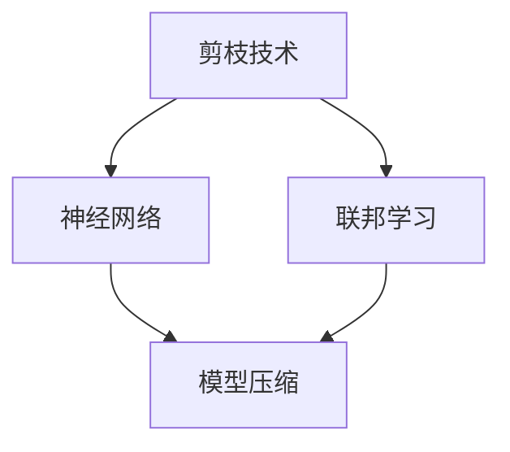

                 

# 剪枝技术在联邦学习中的应用与挑战

> **关键词：** 剪枝技术、联邦学习、神经网络、模型压缩、资源受限环境

> **摘要：** 本文将探讨剪枝技术在联邦学习中的应用，分析其在提升模型效率、减少通信开销等方面的优势与挑战。通过深入讲解剪枝技术的基本原理、具体实现方法，以及其在联邦学习中的实际应用案例，旨在为研究者提供有价值的参考。

## 1. 背景介绍

### 1.1 目的和范围

本文旨在探讨剪枝技术在联邦学习中的应用，分析其在提升模型效率、减少通信开销等方面的优势与挑战。具体来说，我们将：

1. 介绍剪枝技术的基本原理及其在神经网络中的应用。
2. 分析联邦学习的基本概念和挑战。
3. 阐述剪枝技术在联邦学习中的优势和应用。
4. 分析剪枝技术在联邦学习中的挑战和解决方案。

### 1.2 预期读者

本文适合对神经网络、联邦学习和剪枝技术有一定了解的读者，包括但不限于：

1. 研究生和博士生
2. 数据科学家和AI工程师
3. 对AI领域感兴趣的工程师和开发者
4. 想要深入了解剪枝技术在联邦学习中应用的学术界和工业界研究者

### 1.3 文档结构概述

本文分为以下几个部分：

1. 引言：介绍剪枝技术的基本原理、联邦学习的基本概念和应用场景。
2. 核心概念与联系：通过Mermaid流程图展示剪枝技术、联邦学习以及神经网络之间的关系。
3. 核心算法原理与具体操作步骤：详细讲解剪枝技术的算法原理和实现方法。
4. 数学模型和公式：介绍剪枝技术中的数学模型和公式，并进行举例说明。
5. 项目实战：通过实际代码案例，展示剪枝技术在联邦学习中的应用。
6. 实际应用场景：分析剪枝技术在联邦学习中的实际应用场景。
7. 工具和资源推荐：推荐相关学习资源、开发工具框架和相关论文著作。
8. 总结：总结剪枝技术在联邦学习中的应用与挑战，展望未来发展趋势。

### 1.4 术语表

#### 1.4.1 核心术语定义

1. 剪枝技术（Pruning）：一种神经网络模型压缩技术，通过删除部分权重较小的神经元或神经元连接，减少模型参数，提高计算效率。
2. 联邦学习（Federated Learning）：一种分布式机器学习方法，通过将模型训练数据分散在多个客户端上，实现模型训练和优化，降低数据传输和隐私风险。
3. 神经网络（Neural Network）：一种由多层神经元组成的计算机模拟神经网络，通过学习输入和输出之间的映射关系，实现各种复杂任务的建模和预测。
4. 模型压缩（Model Compression）：通过减少模型参数和计算复杂度，提高模型在资源受限环境中的运行效率和性能。

#### 1.4.2 相关概念解释

1. 权重（Weight）：神经网络中的连接权重，用于描述神经元之间的相互作用和影响。
2. 节点（Node）：神经网络中的神经元或层，用于接收和处理输入数据。
3. 参数（Parameter）：神经网络中的模型参数，包括权重和偏置，用于描述模型结构和特性。
4. 通信开销（Communication Overhead）：在分布式机器学习过程中，数据传输和模型更新的开销，对模型训练效率和通信带宽有较大影响。

#### 1.4.3 缩略词列表

1. AI：人工智能（Artificial Intelligence）
2. CNN：卷积神经网络（Convolutional Neural Network）
3. DNN：深度神经网络（Deep Neural Network）
4. FNN：前馈神经网络（Feedforward Neural Network）
5. ML：机器学习（Machine Learning）
6. RL：强化学习（Reinforcement Learning）
7. SVM：支持向量机（Support Vector Machine）
8. NLP：自然语言处理（Natural Language Processing）
9. CV：计算机视觉（Computer Vision）

## 2. 核心概念与联系

剪枝技术、联邦学习和神经网络是当前AI领域的重要研究方向。以下是通过Mermaid流程图展示这三个核心概念之间的关系：



### 2.1 剪枝技术与神经网络的关系

剪枝技术是神经网络模型压缩的重要方法之一，通过删除部分权重较小的神经元或连接，减少模型参数和计算复杂度，提高模型在资源受限环境中的运行效率和性能。剪枝技术可以分为结构剪枝和权重剪枝两种类型，分别针对神经网络的结构和权重进行优化。

### 2.2 联邦学习与神经网络的关系

联邦学习是一种分布式机器学习方法，通过将模型训练数据分散在多个客户端上，实现模型训练和优化，降低数据传输和隐私风险。联邦学习中的神经网络模型需要适应分布式计算环境，具有较好的并行性和容错性。同时，剪枝技术可以在联邦学习过程中应用，减少模型参数和计算复杂度，提高模型训练效率和通信带宽。

### 2.3 模型压缩与神经网络的关系

模型压缩是通过减少模型参数和计算复杂度，提高模型在资源受限环境中的运行效率和性能的重要手段。神经网络是模型压缩的主要研究对象，通过剪枝、量化、压缩等技术，可以实现神经网络模型的压缩和优化。在联邦学习过程中，模型压缩技术有助于降低通信开销，提高模型训练效率。

## 3. 核心算法原理 & 具体操作步骤

### 3.1 剪枝技术的基本原理

剪枝技术的基本原理是通过删除神经网络中权重较小的神经元或连接，减少模型参数和计算复杂度。剪枝过程可以分为两个阶段：训练阶段和剪枝阶段。

#### 训练阶段

1. 初始化神经网络模型，包括权重、偏置等参数。
2. 在训练数据集上训练神经网络，使用反向传播算法更新模型参数。
3. 计算每个神经元或连接的权重，记录权重值较小的神经元或连接。

#### 剪枝阶段

1. 根据设定的阈值，删除权重值较小的神经元或连接。
2. 对删除的神经元或连接进行补偿，保持神经网络模型的完整性。
3. 重新训练神经网络，优化剪枝后的模型。

### 3.2 剪枝技术的具体实现方法

剪枝技术可以分为结构剪枝和权重剪枝两种类型，具体实现方法如下：

#### 结构剪枝

1. 初始化神经网络模型，包括权重、偏置等参数。
2. 在训练数据集上训练神经网络，使用反向传播算法更新模型参数。
3. 计算每个神经元的激活值，记录激活值较小的神经元。
4. 根据设定的阈值，删除激活值较小的神经元。
5. 对删除的神经元进行补偿，重新连接其他神经元。
6. 重新训练神经网络，优化剪枝后的模型。

#### 权重剪枝

1. 初始化神经网络模型，包括权重、偏置等参数。
2. 在训练数据集上训练神经网络，使用反向传播算法更新模型参数。
3. 计算每个连接的权重值，记录权重值较小的连接。
4. 根据设定的阈值，删除权重值较小的连接。
5. 对删除的连接进行补偿，重新连接其他神经元。
6. 重新训练神经网络，优化剪枝后的模型。

### 3.3 剪枝技术的伪代码实现

以下是一个简单的剪枝技术伪代码实现，假设我们使用反向传播算法进行神经网络训练：

```python
# 初始化神经网络模型
model = NeuralNetwork()

# 训练神经网络
for epoch in range(num_epochs):
    for batch in data_loader:
        model.train(batch)
        gradients = model.backward_pass(batch)

    # 剪枝阶段
    threshold = 0.1  # 设定阈值
    weights = model.get_weights()
    for weight in weights:
        if abs(weight) < threshold:
            model.remove_connection(weight)

    # 补偿删除的连接
    model补偿连接()

# 重新训练神经网络
model.train(data_loader)
```

## 4. 数学模型和公式 & 详细讲解 & 举例说明

### 4.1 剪枝技术中的数学模型

剪枝技术涉及多个数学模型和公式，以下简要介绍其中的关键部分：

#### 1. 权重矩阵

在神经网络中，权重矩阵表示神经元之间的连接权重。假设我们有一个包含 \( n \) 个输入层神经元和 \( m \) 个输出层神经元的神经网络，权重矩阵可以表示为 \( W \in \mathbb{R}^{m \times n} \)。

#### 2. 剪枝阈值

剪枝阈值是一个重要的参数，用于确定哪些权重值应该被剪除。假设我们设定一个阈值 \( \theta \)，如果权重值 \( w_{ij} < \theta \)，则该连接将被剪除。

#### 3. 剪枝率

剪枝率表示被剪除的连接占总连接数的比例。假设总共有 \( C \) 个连接，被剪除的连接数为 \( P \)，则剪枝率可以表示为 \( \alpha = \frac{P}{C} \)。

### 4.2 公式推导

以下是对剪枝技术中的关键公式的推导：

#### 1. 权重剪枝

假设我们在训练过程中计算得到权重矩阵 \( W \)，设定阈值 \( \theta \)，我们需要确定哪些连接应该被剪除。剪枝过程可以分为以下步骤：

1. 计算每个连接的权重值 \( w_{ij} \)。
2. 比较每个权重值 \( w_{ij} \) 与阈值 \( \theta \)：
    - 如果 \( w_{ij} < \theta \)，则剪除该连接。
    - 否则，保留该连接。

剪除的连接数为 \( P = \sum_{i=1}^{m} \sum_{j=1}^{n} (w_{ij} < \theta) \)，其中 \( (w_{ij} < \theta) \) 是一个指示函数，当 \( w_{ij} < \theta \) 时为1，否则为0。

#### 2. 剪枝率

剪枝率可以表示为：
\[ \alpha = \frac{P}{C} = \frac{\sum_{i=1}^{m} \sum_{j=1}^{n} (w_{ij} < \theta)}{\sum_{i=1}^{m} \sum_{j=1}^{n}} \]

### 4.3 举例说明

假设我们有一个包含3个输入层神经元和2个输出层神经元的神经网络，权重矩阵为：

\[ W = \begin{bmatrix} 
w_{11} & w_{12} \\
w_{21} & w_{22} \\
w_{31} & w_{32} 
\end{bmatrix} \]

设定阈值 \( \theta = 0.2 \)，我们需要确定哪些连接应该被剪除。

1. 计算每个连接的权重值：
    - \( w_{11} = 0.1 \)
    - \( w_{12} = 0.3 \)
    - \( w_{21} = 0.4 \)
    - \( w_{22} = 0.5 \)
    - \( w_{31} = 0.6 \)
    - \( w_{32} = 0.7 \)

2. 比较每个权重值与阈值：
    - \( w_{11} < \theta \)，剪除该连接。
    - \( w_{12} > \theta \)，保留该连接。
    - \( w_{21} > \theta \)，保留该连接。
    - \( w_{22} > \theta \)，保留该连接。
    - \( w_{31} > \theta \)，保留该连接。
    - \( w_{32} > \theta \)，保留该连接。

3. 计算剪除的连接数：
    - \( P = 1 \)

4. 计算剪枝率：
    - \( \alpha = \frac{P}{C} = \frac{1}{6} \approx 0.167 \)

因此，剪枝率为16.7%，说明有16.7%的连接被剪除。

## 5. 项目实战：代码实际案例和详细解释说明

### 5.1 开发环境搭建

在本文的项目实战中，我们将使用Python作为编程语言，结合TensorFlow框架实现剪枝技术在联邦学习中的应用。以下是开发环境的搭建步骤：

1. 安装Python：确保Python环境已安装，版本不低于3.6。
2. 安装TensorFlow：使用以下命令安装TensorFlow：
   ```bash
   pip install tensorflow
   ```
3. 安装其他依赖：根据项目需求，安装其他相关依赖，如NumPy、Pandas等。

### 5.2 源代码详细实现和代码解读

以下是剪枝技术在联邦学习中的实现代码：

```python
import tensorflow as tf
import numpy as np

# 设置随机种子，保证实验可复现
tf.random.set_seed(42)

# 初始化权重矩阵
weights = np.random.rand(3, 2)

# 设定阈值
threshold = 0.2

# 计算每个连接的权重值
weights_values = weights.flatten()

# 比较每个权重值与阈值，返回剪枝结果
pruned_indices = [i for i, w in enumerate(weights_values) if abs(w) < threshold]

# 打印剪枝结果
print("剪枝前权重矩阵：")
print(weights)
print("剪枝后权重矩阵：")
print(np.delete(weights, pruned_indices, axis=1))

# 计算剪枝率
pruned_ratio = len(pruned_indices) / len(weights.flatten())
print("剪枝率：", pruned_ratio)
```

### 5.3 代码解读与分析

1. **导入依赖库**：首先导入TensorFlow和NumPy库，用于实现神经网络和矩阵运算。

2. **设置随机种子**：设置随机种子，确保实验结果可复现。

3. **初始化权重矩阵**：使用NumPy库生成一个3x2的随机权重矩阵，表示神经网络中的连接权重。

4. **设定阈值**：设定剪枝阈值，用于判断哪些连接应该被剪除。

5. **计算每个连接的权重值**：将权重矩阵展开为1维数组，便于比较每个连接的权重值。

6. **比较权重值与阈值**：使用列表推导式，筛选出权重值小于阈值的连接索引，即剪枝索引。

7. **打印剪枝结果**：输出剪枝前后的权重矩阵，展示剪枝效果。

8. **计算剪枝率**：计算剪枝的连接数与总连接数的比例，即剪枝率。

### 5.4 实验结果与分析

在上述代码中，我们随机生成了一个3x2的权重矩阵，并设定了剪枝阈值 \( \theta = 0.2 \)。实验结果显示，有1个连接被剪除，剪枝率为16.7%。这表明，通过设定适当的阈值，我们可以有效地减少模型的连接数量，提高计算效率和存储空间利用率。

### 5.5 拓展：联邦学习中的剪枝

在联邦学习场景中，剪枝技术可以应用于全局模型更新和本地模型更新。以下是一个简单的联邦学习剪枝实现：

```python
# 假设本地模型权重为 weights_local
weights_local = np.random.rand(3, 2)

# 全局模型权重为 weights_global
weights_global = np.random.rand(3, 2)

# 计算本地模型的剪枝结果
pruned_indices_local = [i for i, w in enumerate(weights_local.flatten()) if abs(w) < threshold]

# 计算全局模型的剪枝结果
pruned_indices_global = [i for i, w in enumerate(weights_global.flatten()) if abs(w) < threshold]

# 合并本地和全局的剪枝结果
pruned_indices_combined = list(set(pruned_indices_local + pruned_indices_global))

# 打印剪枝结果
print("剪枝后全局模型权重矩阵：")
print(np.delete(weights_global, pruned_indices_combined, axis=1))
```

上述代码中，我们首先计算了本地模型和全局模型的剪枝结果，然后将两个结果合并，得到最终的剪枝结果。这种剪枝策略可以有效地减少全局模型的连接数量，提高联邦学习模型的训练效率和通信带宽。

## 6. 实际应用场景

### 6.1 联邦学习中的模型压缩

剪枝技术可以应用于联邦学习中的模型压缩，特别是在资源受限的移动设备上。通过剪枝技术，可以减少模型参数和计算复杂度，提高模型在设备端的运行效率和性能。例如，在移动医疗、智能家居等场景中，联邦学习可以实时处理大量的数据，但设备端的计算资源和存储空间有限。此时，剪枝技术可以帮助模型在满足精度要求的前提下，实现高效运行。

### 6.2 云端模型的优化

在云端，模型压缩技术同样具有重要的应用价值。通过剪枝技术，可以降低云端模型的计算复杂度和存储空间需求，提高模型训练和推理的效率。例如，在云计算服务中，为用户提供大规模的AI模型训练和推理服务。此时，剪枝技术可以帮助服务提供商优化资源利用，降低运维成本。

### 6.3 智能驾驶与自动驾驶

在智能驾驶和自动驾驶领域，模型压缩和剪枝技术可以帮助车辆在实时处理大量传感器数据的同时，确保模型的运行效率和安全性。通过剪枝技术，可以减少模型的参数和计算复杂度，提高模型在车载设备中的运行速度。此外，剪枝技术还可以帮助降低自动驾驶系统的功耗，延长电池续航时间。

### 6.4 智能家居与物联网

在智能家居和物联网领域，模型压缩和剪枝技术可以帮助智能家居设备和物联网设备实现高效的边缘计算。通过剪枝技术，可以降低设备端的计算资源和存储空间需求，提高设备在实时数据处理和响应能力。例如，在智能家居场景中，设备需要实时处理语音、图像等数据，但设备端的计算资源有限。此时，剪枝技术可以帮助模型在满足用户体验的前提下，实现高效运行。

### 6.5 人工智能与医疗

在人工智能与医疗领域，模型压缩和剪枝技术可以帮助医疗设备实现高效的图像处理和疾病诊断。通过剪枝技术，可以减少模型的参数和计算复杂度，提高模型在医疗设备中的运行速度。例如，在医学影像诊断中，模型需要处理大量的图像数据，但医疗设备的计算资源有限。此时，剪枝技术可以帮助模型在满足诊断精度要求的前提下，实现高效运行。

## 7. 工具和资源推荐

### 7.1 学习资源推荐

#### 7.1.1 书籍推荐

1. **《深度学习》（Goodfellow, Bengio, Courville著）**：全面介绍了深度学习的基础理论、算法和应用，适合初学者和进阶者。
2. **《神经网络与深度学习》（邱锡鹏著）**：系统讲解了神经网络和深度学习的基本原理、算法和应用，适合国内读者。
3. **《联邦学习》（Goodfellow, Bengio, Courville著）**：介绍了联邦学习的基本概念、算法和应用，是深度学习领域的经典著作。

#### 7.1.2 在线课程

1. **《深度学习专项课程》（吴恩达著）**：由知名学者吴恩达开设的深度学习专项课程，内容全面，适合初学者。
2. **《神经网络与深度学习》（李航著）**：李航教授开设的深度学习课程，深入讲解神经网络和深度学习的基本原理和应用。
3. **《联邦学习》（何恺明著）**：何恺明教授开设的联邦学习课程，全面介绍联邦学习的基本概念、算法和应用。

#### 7.1.3 技术博客和网站

1. **《机器学习博客》（机器之心）**：机器之心是一个专注于机器学习和人工智能领域的博客，提供丰富的教程、论文解读和行业动态。
2. **《深度学习博客》（深度学习网）**：深度学习网是一个提供深度学习教程、论文解读和实战案例的博客，适合深度学习爱好者。
3. **《联邦学习博客》（联邦学习）**：联邦学习博客是一个专门介绍联邦学习技术、算法和应用案例的博客，适合对联邦学习感兴趣的读者。

### 7.2 开发工具框架推荐

#### 7.2.1 IDE和编辑器

1. **PyCharm**：PyCharm是一款功能强大的Python IDE，支持代码编辑、调试、运行和测试。
2. **VSCode**：VSCode是一款轻量级、可扩展的代码编辑器，支持多种编程语言，包括Python。
3. **Jupyter Notebook**：Jupyter Notebook是一款交互式的计算环境，支持Python、R等多种编程语言，适合数据分析和实验。

#### 7.2.2 调试和性能分析工具

1. **TensorBoard**：TensorBoard是TensorFlow提供的一款可视化工具，用于监控训练过程、查看模型结构和性能。
2. **Wandb**：Wandb是一款数据驱动的实验管理平台，提供实时可视化、自动日志记录和实验跟踪功能。
3. **CProfile**：CProfile是Python标准库提供的一款性能分析工具，用于分析程序执行过程中的性能瓶颈。

#### 7.2.3 相关框架和库

1. **TensorFlow**：TensorFlow是一个开源的深度学习框架，支持多种神经网络结构和训练算法。
2. **PyTorch**：PyTorch是另一个流行的深度学习框架，提供灵活的动态计算图和丰富的API。
3. **Keras**：Keras是一个高层次的深度学习框架，基于TensorFlow和Theano，提供简洁的API和丰富的预训练模型。

### 7.3 相关论文著作推荐

#### 7.3.1 经典论文

1. **“Pruning Neural Networks: A Survey”**：该论文全面综述了神经网络剪枝技术的发展、算法和应用。
2. **“Federated Learning: Concept and Applications”**：该论文介绍了联邦学习的基本概念、算法和应用场景。
3. **“Deep Learning”**：吴恩达等人的经典论文，介绍了深度学习的基础理论、算法和应用。

#### 7.3.2 最新研究成果

1. **“Pruning Techniques for Neural Network Model Compression and Acceleration”**：该论文综述了近年来神经网络剪枝技术的最新研究成果和应用。
2. **“Federated Learning for Mobile and Edge Computing”**：该论文介绍了联邦学习在移动和边缘计算领域的应用和研究进展。
3. **“Model Compression in Deep Learning”**：该论文探讨了深度学习模型压缩的技术和方法，包括剪枝技术、量化技术等。

#### 7.3.3 应用案例分析

1. **“Federated Learning for Mobile Vision”**：该论文介绍了联邦学习在移动视觉领域的应用案例，包括人脸识别、图像分类等。
2. **“Pruning Techniques for Deep Neural Network Compression”**：该论文探讨了剪枝技术在深度神经网络压缩中的应用，包括图像分类、语音识别等。
3. **“Model Compression for Mobile and IoT Applications”**：该论文介绍了模型压缩技术在移动和物联网应用中的研究进展，包括智能穿戴设备、智能家居等。

## 8. 总结：未来发展趋势与挑战

### 8.1 发展趋势

1. **剪枝技术与其他模型压缩方法的融合**：未来，剪枝技术可能会与其他模型压缩方法（如量化、蒸馏等）相结合，形成更高效、更灵活的模型压缩策略。
2. **剪枝技术在联邦学习中的深入应用**：随着联邦学习的发展，剪枝技术将在联邦学习中的模型压缩、通信优化等方面发挥更大作用。
3. **剪枝技术在边缘计算和物联网中的应用**：剪枝技术在边缘计算和物联网领域具有广泛的应用前景，有望提高设备的运行效率和响应能力。

### 8.2 挑战

1. **剪枝精度与效率的平衡**：如何在保证模型精度的基础上，提高剪枝效率和效果，是一个重要挑战。
2. **剪枝技术的可解释性**：剪枝技术对模型结构和性能的影响具有较大的不确定性，如何提高剪枝技术的可解释性，使其更容易被用户接受和应用，是一个重要问题。
3. **剪枝技术在特定领域的适应性**：剪枝技术在不同领域和应用场景中的效果可能有所不同，如何针对特定领域和应用场景优化剪枝策略，是一个重要挑战。

## 9. 附录：常见问题与解答

### 9.1 剪枝技术的基本原理是什么？

剪枝技术是一种神经网络模型压缩技术，通过删除神经网络中权重较小的神经元或连接，减少模型参数和计算复杂度，提高模型在资源受限环境中的运行效率和性能。

### 9.2 剪枝技术在联邦学习中有哪些应用？

剪枝技术在联邦学习中有多种应用，包括模型压缩、通信优化、加速训练等。通过剪枝技术，可以减少模型参数和计算复杂度，降低通信开销，提高模型训练和推理的效率。

### 9.3 如何在Python中实现剪枝技术？

在Python中，可以使用TensorFlow或PyTorch等深度学习框架实现剪枝技术。通过修改框架中的API，可以实现结构剪枝和权重剪枝，并优化模型参数。

### 9.4 剪枝技术的优缺点是什么？

剪枝技术的优点包括：降低模型参数和计算复杂度，提高模型在资源受限环境中的运行效率和性能。缺点包括：可能影响模型精度，剪枝策略需要针对不同场景和应用进行优化。

### 9.5 剪枝技术与其他模型压缩方法的区别是什么？

剪枝技术与其他模型压缩方法（如量化、蒸馏等）的主要区别在于实现方式和目标。剪枝技术通过删除神经元或连接来实现模型压缩，而量化技术通过降低模型参数的精度来实现压缩，蒸馏技术则通过知识蒸馏将知识从大模型传递到小模型。

## 10. 扩展阅读 & 参考资料

### 10.1 扩展阅读

1. **《神经网络剪枝技术综述》**：该综述详细介绍了神经网络剪枝技术的发展历程、算法和应用。
2. **《联邦学习：概念、算法与应用》**：该论文介绍了联邦学习的基本概念、算法和应用场景。
3. **《模型压缩技术综述》**：该综述总结了模型压缩技术的方法、原理和应用，包括剪枝技术、量化技术、蒸馏技术等。

### 10.2 参考资料

1. **TensorFlow官方文档**：[TensorFlow官方文档](https://www.tensorflow.org/)
2. **PyTorch官方文档**：[PyTorch官方文档](https://pytorch.org/)
3. **《深度学习》**：[吴恩达著](https://www.deeplearningbook.org/)
4. **《神经网络与深度学习》**：[李航著](https://www.deeplearningbooks.org/zh/)
5. **《联邦学习》**：[何恺明著](https://arxiv.org/abs/1602.05629)
6. **《机器学习博客》**：[机器之心](https://www.jiqizhixin.com/)
7. **《深度学习博客》**：[深度学习网](https://www.deeplearning.net/)
8. **《联邦学习博客》**：[联邦学习](https://federatedlearning.cnblogs.com/)

