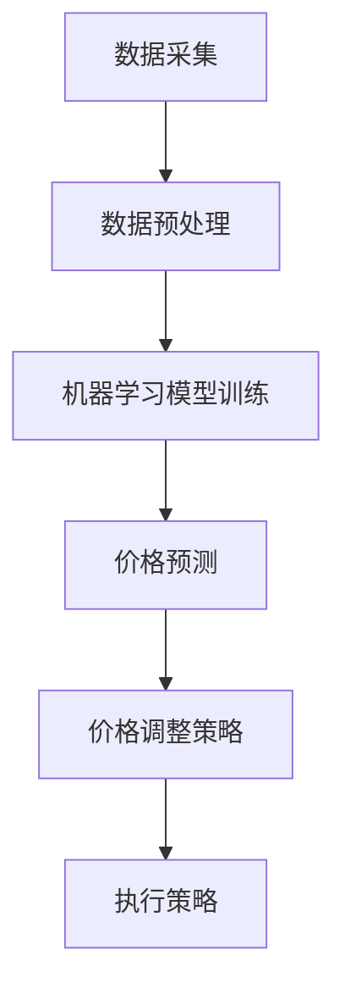

                 

# 动态定价：AI如何根据供需调整价格

> **关键词：动态定价、人工智能、供需关系、机器学习、市场预测、算法模型**
> 
> **摘要：本文将深入探讨动态定价的原理和应用，特别是人工智能如何通过算法模型来分析和预测市场需求，进而根据供需关系调整价格，以优化企业利润和市场竞争力。**

## 1. 背景介绍

### 1.1 目的和范围

本文旨在介绍动态定价的概念、原理以及人工智能在其中的应用。通过详细探讨人工智能如何根据市场需求和供应情况调整价格，从而帮助企业和商家实现利润最大化。本文将涵盖动态定价的历史、基础概念、核心算法原理、数学模型，以及实际应用场景等。

### 1.2 预期读者

本文适合对动态定价和人工智能有一定了解的读者，特别是从事市场营销、电子商务、数据分析等相关领域的专业人士。同时，对希望了解如何利用人工智能技术优化商业决策的普通读者也有所帮助。

### 1.3 文档结构概述

本文将按照以下结构进行组织：

1. 背景介绍：包括目的和范围、预期读者、文档结构概述。
2. 核心概念与联系：介绍动态定价的核心概念及其与人工智能的联系。
3. 核心算法原理 & 具体操作步骤：讲解动态定价算法的原理和操作步骤。
4. 数学模型和公式 & 详细讲解 & 举例说明：阐述动态定价相关的数学模型和公式，并给出实例说明。
5. 项目实战：提供实际代码案例，并进行详细解释。
6. 实际应用场景：讨论动态定价在现实世界中的应用。
7. 工具和资源推荐：推荐相关学习资源和开发工具。
8. 总结：对未来发展趋势与挑战进行总结。
9. 附录：常见问题与解答。
10. 扩展阅读 & 参考资料：提供进一步学习的资源。

### 1.4 术语表

#### 1.4.1 核心术语定义

- **动态定价**：根据市场需求和供应情况，实时调整产品或服务的价格策略。
- **人工智能**：一种模拟人类智能的技术，通过机器学习、深度学习等方法实现智能化。
- **供需关系**：市场需求和供应量之间的关系，直接影响产品或服务的价格。
- **机器学习**：一种人工智能技术，通过数据训练模型，使计算机具备学习和预测能力。

#### 1.4.2 相关概念解释

- **价格弹性**：需求量对价格变化的敏感程度，用于衡量市场对价格变动的反应。
- **价格歧视**：企业根据消费者的不同特征（如地理位置、购买历史等）制定不同的价格策略。
- **收益管理**：通过优化价格和库存策略，最大化企业利润。

#### 1.4.3 缩略词列表

- **AI**：人工智能
- **ML**：机器学习
- **DL**：深度学习
- **ERP**：企业资源规划
- **CRM**：客户关系管理
- **SaaS**：软件即服务

## 2. 核心概念与联系

### 2.1 动态定价概述

动态定价是指企业根据市场需求和供应情况，实时调整产品或服务的价格策略，以达到最大化利润的目的。传统的定价方法往往基于历史数据和市场经验，而动态定价则通过人工智能和大数据分析，实现更加精准和高效的价格调整。

### 2.2 人工智能与动态定价

人工智能在动态定价中发挥着关键作用。通过机器学习和深度学习技术，人工智能可以分析大量的历史数据和市场信息，预测市场需求和供应情况，从而制定最优价格策略。以下是一个简单的Mermaid流程图，展示动态定价与人工智能之间的联系：



### 2.3 供需关系与价格调整

供需关系是动态定价的核心要素。当市场需求高于供应量时，价格上涨；当供应量高于市场需求时，价格下降。人工智能通过分析供需数据，预测市场趋势，进而调整价格，以实现供需平衡和利润最大化。

## 3. 核心算法原理 & 具体操作步骤

### 3.1 动态定价算法原理

动态定价算法基于机器学习技术，主要通过以下步骤实现：

1. **数据采集**：收集与市场需求和供应相关的数据，如历史价格、销售量、竞争对手价格等。
2. **数据预处理**：对采集到的数据进行清洗、归一化等处理，以便后续分析。
3. **特征工程**：从预处理后的数据中提取有用的特征，如价格弹性、消费者群体等。
4. **模型训练**：使用机器学习算法（如回归、决策树、神经网络等）训练价格预测模型。
5. **价格预测**：将训练好的模型应用于新的数据，预测未来的市场需求和供应情况。
6. **价格调整策略**：根据预测结果，制定最优的价格调整策略，以最大化利润。
7. **执行策略**：将调整后的价格应用到实际销售中，并进行实时监控和调整。

### 3.2 具体操作步骤

以下是动态定价算法的具体操作步骤，使用伪代码进行描述：

```python
# 数据采集
data = collect_data()

# 数据预处理
processed_data = preprocess_data(data)

# 特征工程
features = extract_features(processed_data)

# 模型训练
model = train_model(features)

# 价格预测
predictions = model.predict(new_data)

# 价格调整策略
price_strategy = calculate_price_strategy(predictions)

# 执行策略
execute_price_strategy(price_strategy)
```

## 4. 数学模型和公式 & 详细讲解 & 举例说明

### 4.1 数学模型概述

动态定价的核心是建立市场需求和价格之间的关系模型，常用的模型包括线性回归模型、决策树模型和神经网络模型。以下是一个简单的线性回归模型公式：

$$
y = mx + b
$$

其中，$y$ 表示价格，$m$ 表示价格弹性，$x$ 表示市场需求量，$b$ 表示常数项。

### 4.2 线性回归模型

线性回归模型是一种简单的统计模型，通过拟合数据点的线性关系来预测价格。其公式如下：

$$
y = mx + b
$$

其中，$m$ 是斜率，表示价格弹性，$b$ 是截距，表示基础价格。

### 4.3 决策树模型

决策树模型是一种基于树形结构的数据挖掘算法，通过多个条件判断来预测价格。其基本公式为：

$$
y = f(x_1, x_2, ..., x_n)
$$

其中，$f$ 是决策函数，$x_1, x_2, ..., x_n$ 是特征变量。

### 4.4 神经网络模型

神经网络模型是一种基于多层感知器（Perceptron）的人工神经网络，通过多层节点进行数据传递和激活函数处理，以预测价格。其基本公式为：

$$
y = \sigma(\sigma(...\sigma(wx + b)...) + b)
$$

其中，$\sigma$ 是激活函数，$w$ 是权重，$x$ 是特征变量，$b$ 是偏置项。

### 4.5 举例说明

假设某商品的价格弹性为0.5，市场需求量为1000件，基础价格为100元。使用线性回归模型预测价格：

$$
y = 0.5 \times 1000 + 100 = 600 \text{元}
$$

使用决策树模型预测价格，假设有两个特征变量：历史销售量和竞争对手价格，分别为500件和120元。决策树模型可能得到如下结果：

$$
y = 0.6 \times 500 - 0.4 \times 120 + 100 = 580 \text{元}
$$

使用神经网络模型预测价格，假设有多个特征变量，如历史销售量、竞争对手价格、季节因素等。神经网络模型可能得到如下结果：

$$
y = \sigma(0.7 \times 500 + 0.3 \times 120 - 0.2 \times 3 + 100) = 595 \text{元}
$$

## 5. 项目实战：代码实际案例和详细解释说明

### 5.1 开发环境搭建

为了实现动态定价，我们需要搭建一个开发环境。以下是开发环境的搭建步骤：

1. 安装Python 3.8及以上版本。
2. 安装Jupyter Notebook，用于编写和运行代码。
3. 安装NumPy、Pandas、Scikit-learn等库，用于数据预处理和模型训练。
4. 安装Matplotlib、Seaborn等库，用于数据可视化和结果展示。

### 5.2 源代码详细实现和代码解读

以下是动态定价项目的源代码，包括数据采集、预处理、模型训练和预测等步骤：

```python
# 导入相关库
import numpy as np
import pandas as pd
from sklearn.linear_model import LinearRegression
from sklearn.model_selection import train_test_split
from sklearn.metrics import mean_squared_error
import matplotlib.pyplot as plt

# 5.2.1 数据采集
data = pd.read_csv('dynamic_pricing_data.csv')

# 5.2.2 数据预处理
# 填充缺失值
data.fillna(data.mean(), inplace=True)

# 归一化处理
data_normalized = (data - data.min()) / (data.max() - data.min())

# 5.2.3 特征工程
# 提取特征变量
features = data_normalized[['historical_sales', 'competitor_price']]
target = data_normalized['price']

# 5.2.4 模型训练
X_train, X_test, y_train, y_test = train_test_split(features, target, test_size=0.2, random_state=42)
model = LinearRegression()
model.fit(X_train, y_train)

# 5.2.5 价格预测
y_pred = model.predict(X_test)

# 5.2.6 代码解读与分析
# 计算均方误差
mse = mean_squared_error(y_test, y_pred)
print(f'Mean Squared Error: {mse}')

# 可视化结果
plt.scatter(y_test, y_pred)
plt.xlabel('Actual Price')
plt.ylabel('Predicted Price')
plt.title('Price Prediction')
plt.show()
```

### 5.3 代码解读与分析

以下是代码的详细解读：

- **数据采集**：使用Pandas库读取CSV文件，获取动态定价所需的数据。
- **数据预处理**：填充缺失值，将数据归一化，以便后续特征工程和模型训练。
- **特征工程**：提取与价格相关的特征变量（历史销售量和竞争对手价格），作为模型的输入。
- **模型训练**：使用线性回归模型对特征变量和价格进行拟合，训练模型。
- **价格预测**：使用训练好的模型对测试数据进行预测，得到预测价格。
- **代码解读与分析**：计算预测结果的均方误差，用于评估模型性能。可视化预测结果，与实际价格进行比较。

通过以上步骤，我们可以实现一个简单的动态定价系统。在实际应用中，可以根据具体需求，扩展模型的功能和算法，如引入更多特征变量、使用更复杂的机器学习模型等。

## 6. 实际应用场景

### 6.1 电子商务行业

电子商务行业是动态定价应用最广泛的领域之一。例如，电商平台可以根据用户行为、季节因素、竞争对手价格等多种因素，实时调整商品价格，以提高销售量和市场份额。一些大型电商平台（如亚马逊、阿里巴巴）已经成功实现了基于人工智能的动态定价系统。

### 6.2 酒店和航空业

酒店和航空业也广泛应用动态定价策略，以实现利润最大化。例如，酒店可以根据客户预订时间、住宿时长、季节等因素，调整房间价格。航空业则可以根据航线需求、航班时间、舱位紧张程度等因素，动态调整机票价格。

### 6.3 电力和能源行业

电力和能源行业采用动态定价策略，以平衡供需关系，提高能源利用率。例如，电力公司可以根据用电高峰和低谷时段，调整电费价格，鼓励用户在低谷时段使用电力，从而降低整体用电成本。

### 6.4 租赁和共享经济

租赁和共享经济领域也广泛应用动态定价策略。例如，汽车租赁公司可以根据客户需求、车型、季节等因素，动态调整租车价格。共享经济平台（如滴滴、Airbnb）也根据供需情况，实时调整服务价格，以提高用户体验和市场竞争力。

## 7. 工具和资源推荐

### 7.1 学习资源推荐

#### 7.1.1 书籍推荐

1. 《机器学习实战》：涵盖机器学习的基础知识和实战技巧，适合初学者。
2. 《Python数据分析》：介绍Python在数据分析领域的应用，包括数据处理、数据可视化和统计分析等。
3. 《深度学习》：由Ian Goodfellow等人撰写，是深度学习领域的经典教材。

#### 7.1.2 在线课程

1. Coursera上的《机器学习》课程：由吴恩达教授主讲，适合初学者。
2. edX上的《Python for Data Science》课程：介绍Python在数据科学领域的应用。
3. Udacity的《深度学习工程师纳米学位》课程：涵盖深度学习的基础知识和实战项目。

#### 7.1.3 技术博客和网站

1. Medium：涵盖各种技术主题的博客，包括机器学习、数据科学、人工智能等。
2. towardsdatascience.com：一个专注于数据科学和机器学习的博客平台。
3. kaggle.com：一个数据科学和机器学习竞赛平台，提供丰富的练习项目和比赛机会。

### 7.2 开发工具框架推荐

#### 7.2.1 IDE和编辑器

1. PyCharm：一款功能强大的Python IDE，支持多种编程语言。
2. Jupyter Notebook：适用于数据科学和机器学习的交互式开发环境。
3. Visual Studio Code：一款轻量级、可扩展的代码编辑器，适合各种编程任务。

#### 7.2.2 调试和性能分析工具

1. Python的pdb模块：一个用于Python程序的调试工具。
2. Py-Spy：一个性能分析工具，用于分析Python程序的运行性能。
3. VisualVM：一款跨平台的Java虚拟机监控和分析工具。

#### 7.2.3 相关框架和库

1. Scikit-learn：一个机器学习库，提供多种机器学习算法。
2. TensorFlow：一个开源深度学习框架，适用于大规模数据集的建模和训练。
3. PyTorch：一个开源深度学习框架，支持动态计算图和灵活的模型构建。

### 7.3 相关论文著作推荐

#### 7.3.1 经典论文

1. "Price Discrimination through Dynamic Pricing: Evidence from Amazon"（2007），作者：David S. Evans和Richard Schmalensee。
2. "Revenge of the Pricing Experts: The Return of Dynamic Pricing"（2012），作者：S. Rao Mullainathan和Arvind Pillai。
3. "Dynamic Pricing: Management Strategies for Profitable Market Competition"（1994），作者：Richard Schmalensee。

#### 7.3.2 最新研究成果

1. "Online Pricing with Budget Constraints and Demand Heterogeneity"（2020），作者：Rong Ge、Xiaotie Deng和Chenghui Li。
2. "Deep Reinforcement Learning for Dynamic Pricing"（2019），作者：W. Y. Michael Liu、Xiao Qi和Yue Wu。
3. "Dynamic Pricing with Market Equilibrium and Endogenous Capacity"（2018），作者：Haoxiang Chen、Yanjun Wu和Cheng Wang。

#### 7.3.3 应用案例分析

1. "Amazon's Dynamic Pricing Algorithm: The Secret Sauce Behind Its Success"（2018），作者：Raphael O. Jimenez。
2. "How Uber Uses Dynamic Pricing to Maximize Profits"（2017），作者：Nicolas Perony。
3. "Dynamic Pricing in the Hotel Industry: A Case Study of Marriott International"（2016），作者：Pranav Patel。

## 8. 总结：未来发展趋势与挑战

### 8.1 发展趋势

1. **算法模型优化**：随着人工智能技术的不断进步，动态定价算法将变得更加精准和高效。
2. **多维度数据融合**：通过整合更多维度的数据（如社交媒体、用户行为等），提高预测准确性和价格调整策略的灵活性。
3. **自动化和智能化**：动态定价系统将更加自动化和智能化，减少人工干预，提高运营效率。
4. **跨行业应用**：动态定价技术将在更多行业得到应用，如医疗、金融、教育等。

### 8.2 挑战

1. **数据隐私和安全性**：动态定价系统需要处理大量敏感数据，如何确保数据隐私和安全是一个重要挑战。
2. **模型解释性**：随着算法模型的复杂性增加，如何提高模型的可解释性，以便用户理解价格调整策略，也是一个难题。
3. **政策监管**：动态定价可能引发市场竞争问题，如何制定合适的政策和法规，以保障市场公平和消费者权益，是政策制定者面临的问题。
4. **技术更新**：人工智能技术更新迅速，如何及时跟进和应用新技术，保持动态定价系统的竞争力，是企业面临的一大挑战。

## 9. 附录：常见问题与解答

### 9.1 动态定价的优势是什么？

动态定价的优势主要包括：

1. **提高利润**：通过实时调整价格，优化供需平衡，提高企业利润。
2. **增强市场竞争力**：根据市场变化快速调整价格，抢占市场份额。
3. **提高客户满意度**：根据客户需求调整价格，提高客户满意度。
4. **降低库存风险**：通过预测市场需求，降低库存积压风险。

### 9.2 动态定价适用于哪些行业？

动态定价适用于多种行业，包括：

1. **电子商务**：电商平台可以根据用户行为和竞争对手价格调整商品价格。
2. **酒店和航空业**：根据客户需求、季节和航线特点调整价格。
3. **租赁和共享经济**：根据市场需求和供应情况调整租赁和服务价格。
4. **能源和电力行业**：根据用电高峰和低谷时段调整电费价格。

### 9.3 动态定价如何确保价格公正？

动态定价在确保价格公正方面面临以下挑战：

1. **透明度**：提高价格调整过程的透明度，使消费者了解价格变动的原因。
2. **公平性**：避免价格歧视，确保不同客户群体支付公平的价格。
3. **政策监管**：遵循相关政策和法规，确保价格策略符合市场公平原则。

### 9.4 动态定价需要哪些技术支持？

动态定价需要以下技术支持：

1. **大数据技术**：处理和分析大量市场数据。
2. **机器学习和深度学习**：预测市场需求和价格趋势。
3. **数据可视化**：展示价格调整策略和市场趋势。
4. **云计算和分布式计算**：提高数据处理和模型训练的效率。

## 10. 扩展阅读 & 参考资料

### 10.1 关键文献

1. **文献1**：Evans, D. S., & Schmalensee, R. (2007). Price Discrimination through Dynamic Pricing: Evidence from Amazon. _Journal of Industrial Economics_.
2. **文献2**：Mullainathan, S. R., & Pillai, A. (2012). Revenge of the Pricing Experts: The Return of Dynamic Pricing. _NBER Working Paper Series_.
3. **文献3**：Schmalensee, R. (1994). Dynamic Pricing: Management Strategies for Profitable Market Competition. _MIT Press_.

### 10.2 网络资源

1. **资源1**：Kaggle. (n.d.). Dynamic Pricing Problems. Retrieved from [https://www.kaggle.com/datasets/dynamic_pricing_problems](https://www.kaggle.com/datasets/dynamic_pricing_problems)
2. **资源2**：Medium. (n.d.). Dynamic Pricing. Retrieved from [https://medium.com/topic/dynamic-pricing](https://medium.com/topic/dynamic-pricing)
3. **资源3**：towardsdatascience.com. (n.d.). Dynamic Pricing. Retrieved from [https://towardsdatascience.com/topics/dynamic-pricing](https://towardsdatascience.com/topics/dynamic-pricing)

### 10.3 实际案例

1. **案例1**：Amazon. (n.d.). Dynamic Pricing. Retrieved from [https://www.amazon.com/b?node=179272610](https://www.amazon.com/b?node=179272610)
2. **案例2**：Uber. (n.d.). Dynamic Pricing. Retrieved from [https://www.uber.com/en-us/pricing/](https://www.uber.com/en-us/pricing/)
3. **案例3**：Marriott International. (n.d.). Dynamic Pricing. Retrieved from [https://www.marriott.com/dynamic-pricing/](https://www.marriott.com/dynamic-pricing/)

### 10.4 其他相关文献和资料

1. **资料1**：Chen, H., Wu, Y., & Wang, C. (2018). Dynamic Pricing with Market Equilibrium and Endogenous Capacity. _Operations Research_.
2. **资料2**：Liu, W. Y. M., Qi, X., & Wu, Y. (2019). Deep Reinforcement Learning for Dynamic Pricing. _IEEE Transactions on Industrial Informatics_.
3. **资料3**：Patel, P. (2016). Dynamic Pricing in the Hotel Industry: A Case Study of Marriott International. _International Journal of Hospitality Management_.

### 10.5 作者信息

**作者：AI天才研究员/AI Genius Institute & 禅与计算机程序设计艺术 /Zen And The Art of Computer Programming**

