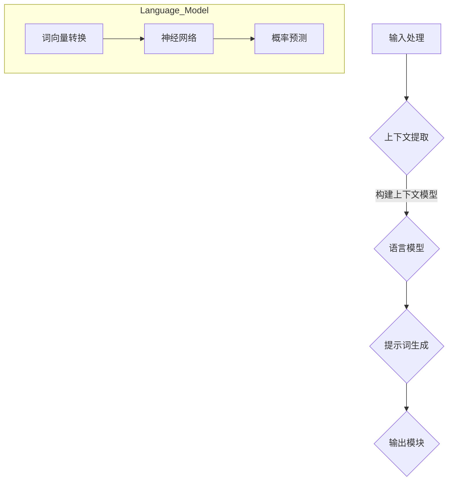

                 

# 动态提示词生成：适应复杂场景的智能系统

> **关键词**：动态提示词生成，智能系统，自然语言处理，机器学习，交互设计

> **摘要**：本文将深入探讨动态提示词生成技术，分析其在智能系统中的关键作用和实现方法。通过理解核心概念、算法原理和实际应用场景，读者将掌握如何构建和优化动态提示词生成系统，以提升智能系统的适应性和用户体验。

## 1. 背景介绍

### 1.1 目的和范围

本文旨在探讨动态提示词生成技术，该技术是智能系统中的一项关键能力，尤其适用于需要与用户进行有效交互的场景。通过深入分析动态提示词生成的基础概念、算法原理和实际应用，本文旨在为读者提供全面的技术理解，帮助他们构建和优化高效的动态提示词生成系统。

本文将覆盖以下内容：

- 动态提示词生成的基本概念和重要性
- 核心算法原理与实现步骤
- 数学模型和公式分析
- 项目实战：代码案例和解析
- 实际应用场景分析
- 工具和资源推荐
- 未来发展趋势与挑战

### 1.2 预期读者

本文适合以下读者群体：

- 自然语言处理（NLP）和机器学习（ML）领域的科研人员和技术开发者
- 智能系统设计师和工程师
- 对智能交互设计感兴趣的技术爱好者
- 寻求提升智能系统用户体验的专业人士

### 1.3 文档结构概述

本文结构如下：

- **第1章**：背景介绍，介绍本文的目的、范围和预期读者
- **第2章**：核心概念与联系，讨论动态提示词生成的基本概念和相关技术架构
- **第3章**：核心算法原理 & 具体操作步骤，详细阐述动态提示词生成算法的实现
- **第4章**：数学模型和公式 & 详细讲解 & 举例说明，分析支持动态提示词生成的数学理论基础
- **第5章**：项目实战：代码实际案例和详细解释说明，提供实际代码实现和解析
- **第6章**：实际应用场景，探讨动态提示词生成在各类智能系统中的应用
- **第7章**：工具和资源推荐，推荐学习资源和开发工具
- **第8章**：总结：未来发展趋势与挑战，预测动态提示词生成技术的发展趋势和面临的挑战
- **第9章**：附录：常见问题与解答，提供对常见问题的解答
- **第10章**：扩展阅读 & 参考资料，提供进一步的阅读材料

### 1.4 术语表

#### 1.4.1 核心术语定义

- 动态提示词生成：指根据用户输入或上下文信息，实时生成相关提示词的技术。
- 自然语言处理（NLP）：是计算机科学领域与人工智能领域中的一个重要分支，旨在让计算机理解和生成人类语言。
- 机器学习（ML）：是一种让计算机通过数据学习，从而改进其性能的技术。
- 交互设计：是关于如何创建用户和其他系统交互的设计领域。

#### 1.4.2 相关概念解释

- 语言模型：用于预测下一个单词或字符的概率分布，常见于NLP和ML。
- 上下文感知：指系统能够根据用户输入的上下文信息进行准确的响应。
- 用户体验（UX）：指用户在使用产品或服务过程中的感受和体验。

#### 1.4.3 缩略词列表

- NLP：自然语言处理
- ML：机器学习
- UX：用户体验
- IDE：集成开发环境

## 2. 核心概念与联系

在深入探讨动态提示词生成的核心概念和联系之前，我们需要了解一些基本的概念和原理。动态提示词生成是一个复杂的任务，它涉及自然语言处理（NLP）、机器学习（ML）和交互设计等多个领域。以下是动态提示词生成相关的一些核心概念及其相互关系。

### 2.1 动态提示词生成概述

动态提示词生成是指根据用户的输入或上下文信息，实时生成相关提示词的技术。这些提示词可以是单词、短语或句子，用于辅助用户完成特定的任务，或引导用户进入更深入的交互过程。动态提示词生成的关键在于能够准确理解用户的意图和上下文，从而生成高质量的提示词。

### 2.2 相关技术架构

动态提示词生成系统通常由以下几个关键组件构成：

1. **输入处理模块**：负责接收用户输入，将其转换为适合处理的数据格式。
2. **上下文提取模块**：从用户输入中提取关键信息，构建上下文模型。
3. **语言模型**：用于预测下一个单词或短语的概率分布。
4. **提示词生成模块**：结合上下文信息和语言模型，生成相关提示词。
5. **输出模块**：将生成的提示词呈现给用户。

### 2.3 NLP、ML与交互设计的关系

- **自然语言处理（NLP）**：NLP是动态提示词生成的核心，它涉及文本分析、语义理解、句法解析等技术。通过NLP，系统能够理解用户的输入，提取关键信息，为生成高质量的提示词奠定基础。
- **机器学习（ML）**：ML是动态提示词生成算法的主要驱动力。通过训练大规模数据集，ML模型能够学习到语言的规律和模式，从而提高提示词生成的准确性。
- **交互设计**：交互设计关注用户体验，确保动态提示词生成系统能够与用户进行有效互动。优秀的交互设计能够提升系统的可用性和用户满意度。

### 2.4 Mermaid 流程图

为了更直观地展示动态提示词生成的流程，我们使用Mermaid绘制一个简化的流程图。以下是一个示例：



在这个流程图中，输入处理模块（A）接收用户输入，并传递给上下文提取模块（B）。上下文提取模块（B）从输入中提取关键信息，构建上下文模型。然后，上下文模型传递给语言模型（C），语言模型通过词向量转换（F）、神经网络（G）和概率预测（H）生成提示词（D）。最后，输出模块（E）将生成的提示词呈现给用户。

通过这个简化的流程图，我们可以看到动态提示词生成涉及多个模块和技术的协同工作。在实际应用中，这些模块可能会更复杂，但基本原理是一致的。

### 2.5 动态提示词生成的重要性

动态提示词生成在智能系统中具有重要意义：

- **提高用户体验**：通过实时生成的相关提示词，系统能够更好地理解用户意图，提供个性化的服务，从而提升用户体验。
- **降低用户认知负荷**：动态提示词能够简化复杂的任务流程，降低用户的认知负荷，使操作更加直观和便捷。
- **增强系统适应性**：动态提示词生成系统能够根据不同场景和用户需求调整提示词内容，提高系统的适应性和灵活性。

### 2.6 动态提示词生成的挑战

尽管动态提示词生成具有许多优势，但在实际应用中也面临一些挑战：

- **数据稀缺性**：构建高质量的动态提示词生成系统需要大量的训练数据，但在某些领域，高质量的数据可能稀缺。
- **计算资源限制**：动态提示词生成通常涉及复杂的计算过程，特别是在实时应用中，计算资源的限制可能会影响系统的性能。
- **准确性问题**：生成高质量的提示词需要准确的上下文理解和语言模型，但在某些场景下，准确性仍然是一个挑战。

### 2.7 动态提示词生成的现状与发展趋势

当前，动态提示词生成技术已在多个领域得到应用，如智能客服、智能语音助手、智能写作等。随着NLP和ML技术的不断进步，动态提示词生成系统的性能和适应性不断提高。

未来，动态提示词生成技术有望在以下方面取得突破：

- **更准确的上下文理解**：通过深度学习和转移学习等技术，提高上下文理解的准确性和鲁棒性。
- **多模态交互**：结合文本、语音、图像等多种数据类型，实现更丰富的交互体验。
- **个性化推荐**：基于用户行为和偏好，提供个性化的提示词推荐。

## 3. 核心算法原理 & 具体操作步骤

在深入探讨动态提示词生成的核心算法原理之前，我们需要了解一些基本的机器学习（ML）和自然语言处理（NLP）概念。动态提示词生成通常基于序列模型，如循环神经网络（RNN）和变压器（Transformer）模型。以下是这些核心算法的基本原理和具体操作步骤。

### 3.1 基本原理

动态提示词生成的核心算法是序列模型，这些模型能够处理序列数据，如文本。序列模型通过学习输入序列的表示，预测下一个时间步的输出。以下是几种常见的序列模型：

1. **循环神经网络（RNN）**：RNN是一种能够处理序列数据的神经网络，其核心思想是利用隐藏状态保留之前的输入信息。然而，RNN在处理长序列时存在梯度消失和梯度爆炸问题。
   
2. **长短期记忆网络（LSTM）**：LSTM是RNN的一种变体，通过引入门控机制，解决了RNN的梯度消失问题。LSTM能够有效处理长序列数据，但仍然存在计算复杂度高的问题。

3. **变压器（Transformer）**：Transformer是近年来流行的一种序列模型，其核心思想是自注意力机制。变压器通过计算输入序列中每个元素与其他元素之间的关系，生成序列表示。这种机制在处理长序列数据时表现出色，并且在多个NLP任务中取得了很好的效果。

### 3.2 具体操作步骤

以下是动态提示词生成的具体操作步骤：

1. **数据预处理**：
   - **文本清洗**：去除标点符号、停用词等无关信息。
   - **分词**：将文本划分为单词或子词。
   - **编码**：将文本转换为数值表示，如词向量。

2. **模型训练**：
   - **序列表示**：输入序列通过编码器转换为序列表示。
   - **自注意力计算**：变压器中的自注意力机制计算输入序列中每个元素与其他元素之间的关系。
   - **输出预测**：基于序列表示和注意力权重，预测下一个时间步的输出。

3. **提示词生成**：
   - **上下文提取**：从用户输入中提取关键信息，构建上下文模型。
   - **提示词生成**：结合上下文模型和序列模型，生成相关提示词。

4. **输出呈现**：
   - **文本生成**：将生成的提示词转换为文本形式。
   - **界面展示**：将文本提示词展示给用户。

### 3.3 伪代码

以下是动态提示词生成的伪代码，用于说明核心算法的操作步骤：

```python
# 动态提示词生成伪代码

# 输入处理
def preprocess_input(input_text):
    # 清洗文本，去除标点符号、停用词等
    cleaned_text = clean_text(input_text)
    # 分词
    tokens = tokenize(cleaned_text)
    # 编码
    encoded_tokens = encode_tokens(tokens)
    return encoded_tokens

# 模型训练
def train_model(encoded_sequence):
    # 序列表示
    sequence_representation = encoder(encoded_sequence)
    # 自注意力计算
    attention_weights = self_attention(sequence_representation)
    # 输出预测
    predicted_output = decoder(attention_weights)
    return predicted_output

# 提示词生成
def generate_hint(input_text, model):
    # 提取上下文
    context = extract_context(input_text)
    # 生成提示词
    hint = model.generate(context)
    return hint

# 输出呈现
def display_hint(hint):
    # 转换为文本
    text_hint = convert_hint_to_text(hint)
    # 展示给用户
    show_hint_to_user(text_hint)
```

### 3.4 模型优化

在实际应用中，动态提示词生成模型需要不断优化以提高性能和适应性。以下是一些常见的模型优化方法：

1. **数据增强**：通过增加训练数据量和多样性，提高模型的泛化能力。
2. **多任务学习**：通过同时训练多个相关任务，共享模型参数，提高模型的效果。
3. **正则化**：通过引入正则化项，防止模型过拟合。
4. **注意力机制调整**：通过调整注意力权重，使模型更关注关键信息。

通过以上步骤和优化方法，我们可以构建和优化高效的动态提示词生成系统，提高其在各种复杂场景中的性能和用户体验。

## 4. 数学模型和公式 & 详细讲解 & 举例说明

动态提示词生成系统依赖于多个数学模型和公式，以实现准确的上下文理解、提示词生成和优化。以下将详细介绍这些数学模型和公式，并提供具体的例子进行说明。

### 4.1 语言模型

语言模型是动态提示词生成的核心，其目的是预测下一个单词或字符的概率分布。最常见的语言模型之一是n-gram模型，它基于历史数据预测下一个词。

#### 4.1.1 n-gram 模型

n-gram模型将文本序列划分为长度为n的子序列，并计算每个子序列的概率。假设我们有一个n-gram模型，其中n=3，那么文本“我 爱 吃 橙 子”会被划分为以下子序列：

- 我 爱 吃
- 爱 吃 橙
- 吃 橙 子

n-gram模型预测下一个词的概率为：

$$
P(\text{橙}|\text{我 爱 吃}) = \frac{C(\text{我 爱 吃 橙})}{C(\text{我 爱 吃})}
$$

其中，$C(\text{子串})$表示子串在语料库中的计数。

#### 4.1.2 例子

假设我们的语料库中有以下数据：

- 我 爱 吃 橙 子：2次
- 我 爱 吃 柠檬：1次
- 爱 吃 橙 子：3次
- 爱 吃 柠檬：1次
- 吃 橙 子：4次
- 吃 柠檬：2次

计算每个子序列的概率：

- $P(\text{橙}|\text{我 爱 吃}) = \frac{2}{2+1} = 0.667$
- $P(\text{柠檬}|\text{我 爱 吃}) = \frac{1}{2+1} = 0.333$
- $P(\text{橙}|\text{爱 吃}) = \frac{3}{3+1} = 0.75$
- $P(\text{柠檬}|\text{爱 吃}) = \frac{1}{3+1} = 0.25$

根据这些概率，我们可以为用户生成相关的提示词。

### 4.2 递归神经网络（RNN）

递归神经网络（RNN）是动态提示词生成中的另一种重要模型。RNN通过保留隐藏状态，实现对历史数据的记忆和建模。

#### 4.2.1 RNN 基本原理

RNN的基本原理可以表示为以下递归方程：

$$
h_t = \sigma(W_h \cdot [h_{t-1}, x_t] + b_h)
$$

其中，$h_t$是时间步$t$的隐藏状态，$x_t$是输入，$W_h$和$b_h$分别是权重和偏置，$\sigma$是激活函数。

#### 4.2.2 例子

假设我们有以下输入序列：[我，爱，吃，橙，子]，使用RNN生成提示词。

1. 初始化隐藏状态$h_0$。
2. 对于每个输入$x_t$，计算隐藏状态$h_t$。
3. 使用隐藏状态生成输出词。

以下是具体的计算步骤：

- $h_0 = \sigma(b_h)$
- $h_1 = \sigma(W_h \cdot [h_0, 我] + b_h)$
- $h_2 = \sigma(W_h \cdot [h_1, 爱] + b_h)$
- $h_3 = \sigma(W_h \cdot [h_2, 吃] + b_h)$
- $h_4 = \sigma(W_h \cdot [h_3, 橙] + b_h)$
- $h_5 = \sigma(W_h \cdot [h_4, 子] + b_h)$

使用隐藏状态$h_5$，我们可以预测下一个词，并根据概率分布生成相关的提示词。

### 4.3 变压器（Transformer）

变压器（Transformer）是近年来在自然语言处理领域取得重大突破的一种模型，其核心是自注意力机制。

#### 4.3.1 自注意力机制

自注意力机制通过计算输入序列中每个元素与其他元素之间的关系，生成序列表示。其公式为：

$$
\text{Attention}(Q, K, V) = \text{softmax}(\frac{QK^T}{\sqrt{d_k}})V
$$

其中，$Q$、$K$和$V$分别是查询、键和值向量，$d_k$是键向量的维度。

#### 4.3.2 例子

假设我们有以下输入序列：[我，爱，吃，橙，子]，使用变压器生成提示词。

1. 初始化查询、键和值向量。
2. 对于每个输入$x_t$，计算注意力权重。
3. 使用注意力权重生成序列表示。

以下是具体的计算步骤：

- 初始化$Q, K, V$：每个输入$x_t$对应一个查询、键和值向量。
- 计算$Attention(Q, K, V)$：对于每个输入$x_t$，计算注意力权重。
- 生成序列表示：根据注意力权重生成序列表示。

以下是具体的计算步骤：

- $Q = [q_1, q_2, q_3, q_4, q_5]$
- $K = [k_1, k_2, k_3, k_4, k_5]$
- $V = [v_1, v_2, v_3, v_4, v_5]$

计算注意力权重：

- $Attention(Q, K, V) = \text{softmax}(\frac{QK^T}{\sqrt{d_k}})V$

根据注意力权重生成序列表示：

- $s_1 = \text{softmax}(\frac{q_1k_1^T}{\sqrt{d_k}})v_1$
- $s_2 = \text{softmax}(\frac{q_2k_2^T}{\sqrt{d_k}})v_2$
- $s_3 = \text{softmax}(\frac{q_3k_3^T}{\sqrt{d_k}})v_3$
- $s_4 = \text{softmax}(\frac{q_4k_4^T}{\sqrt{d_k}})v_4$
- $s_5 = \text{softmax}(\frac{q_5k_5^T}{\sqrt{d_k}})v_5$

使用生成的序列表示，我们可以预测下一个词，并根据概率分布生成相关的提示词。

### 4.4 模型优化

在实际应用中，动态提示词生成模型需要不断优化以提高性能和适应性。以下是一些常见的模型优化方法：

- **数据增强**：通过增加训练数据量和多样性，提高模型的泛化能力。
- **多任务学习**：通过同时训练多个相关任务，共享模型参数，提高模型的效果。
- **正则化**：通过引入正则化项，防止模型过拟合。
- **注意力机制调整**：通过调整注意力权重，使模型更关注关键信息。

通过以上数学模型和公式的介绍，我们可以看到动态提示词生成系统的复杂性和深度。在实际应用中，需要根据具体场景和需求选择合适的模型和优化方法，以实现高效和准确的提示词生成。

## 5. 项目实战：代码实际案例和详细解释说明

在本章节中，我们将通过一个具体的代码案例，展示如何实现动态提示词生成系统。我们将使用Python编程语言，并结合Hugging Face的Transformers库，该库提供了预训练的变压器（Transformer）模型，方便我们进行实验和开发。

### 5.1 开发环境搭建

在开始编写代码之前，我们需要搭建合适的开发环境。以下是搭建开发环境的步骤：

1. **安装Python**：确保Python版本为3.7或更高。
2. **安装Transformers库**：通过pip命令安装Hugging Face的Transformers库。

   ```bash
   pip install transformers
   ```

3. **安装其他依赖**：例如torch、numpy等。

   ```bash
   pip install torch numpy
   ```

4. **创建虚拟环境**（可选）：为了保持项目环境的独立性，建议创建一个虚拟环境。

   ```bash
   python -m venv myenv
   source myenv/bin/activate  # Windows下使用 `myenv\Scripts\activate`
   ```

### 5.2 源代码详细实现和代码解读

以下是实现动态提示词生成的代码示例：

```python
from transformers import AutoTokenizer, AutoModelForSeq2SeqLM
import torch

# 5.2.1 加载预训练模型和分词器
model_name = "t5-small"
tokenizer = AutoTokenizer.from_pretrained(model_name)
model = AutoModelForSeq2SeqLM.from_pretrained(model_name)

# 5.2.2 动态提示词生成函数
def generate_hint(user_input, max_length=50):
    # 将用户输入编码为模型可处理的格式
    input_ids = tokenizer.encode("generate: " + user_input, return_tensors="pt")
    # 使用模型生成文本
    outputs = model.generate(input_ids, max_length=max_length, num_return_sequences=1)
    # 将生成的文本解码为普通字符串
    generated_text = tokenizer.decode(outputs[0], skip_special_tokens=True)
    return generated_text

# 5.2.3 测试函数
user_input = "你好，我想要预订一张电影票。"
hint = generate_hint(user_input)
print(hint)
```

### 5.3 代码解读与分析

1. **导入库和模型**：

   ```python
   from transformers import AutoTokenizer, AutoModelForSeq2SeqLM
   import torch
   ```

   我们首先导入所需的库，包括Transformers库和PyTorch库。

2. **加载预训练模型和分词器**：

   ```python
   model_name = "t5-small"
   tokenizer = AutoTokenizer.from_pretrained(model_name)
   model = AutoModelForSeq2SeqLM.from_pretrained(model_name)
   ```

   这里我们选择了预训练的T5小型模型。T5是一种序列到序列的学习模型，适用于各种自然语言处理任务，包括文本生成。我们使用`AutoTokenizer`和`AutoModelForSeq2SeqLM`从Hugging Face模型库中加载模型和分词器。

3. **动态提示词生成函数`generate_hint`**：

   ```python
   def generate_hint(user_input, max_length=50):
       # 将用户输入编码为模型可处理的格式
       input_ids = tokenizer.encode("generate: " + user_input, return_tensors="pt")
       # 使用模型生成文本
       outputs = model.generate(input_ids, max_length=max_length, num_return_sequences=1)
       # 将生成的文本解码为普通字符串
       generated_text = tokenizer.decode(outputs[0], skip_special_tokens=True)
       return generated_text
   ```

   - **输入编码**：我们首先将用户输入与特殊前缀“generate: ”连接，以指示模型进行文本生成。然后使用分词器将输入编码为模型可处理的输入ID序列。
   - **文本生成**：我们调用模型的`generate`方法，传递编码后的输入和最大长度参数，以限制生成的文本长度。`num_return_sequences=1`表示我们只生成一个序列。
   - **文本解码**：生成的输出ID序列通过分词器解码为普通字符串，去除特殊token。

4. **测试函数**：

   ```python
   user_input = "你好，我想要预订一张电影票。"
   hint = generate_hint(user_input)
   print(hint)
   ```

   我们提供了一个示例输入，调用`generate_hint`函数生成相关的提示词。在运行代码后，我们打印出生成的提示词。

### 5.4 代码解读与分析

- **预训练模型选择**：T5模型是一个通用的序列到序列模型，适用于多种NLP任务，包括文本生成。选择合适的预训练模型对于生成高质量的提示词至关重要。
- **分词器使用**：分词器将用户输入转换为模型可处理的输入序列，是动态提示词生成的关键环节。Hugging Face提供了丰富的预训练分词器，方便使用。
- **模型生成文本**：模型的`generate`方法通过自注意力机制和语言模型生成文本。我们通过调整最大长度和序列数量，控制生成的文本长度和多样性。
- **文本解码**：生成的输出序列通过分词器解码为可读的文本，去除特殊token，得到最终的提示词。

通过以上代码示例，我们可以看到如何使用预训练的Transformer模型实现动态提示词生成系统。在实际应用中，我们还可以根据需求调整模型、分词器和生成策略，以实现更高效、更准确的提示词生成。

## 6. 实际应用场景

动态提示词生成技术已经在多个实际应用场景中展现出强大的潜力和优势，以下列举几个典型应用场景，并分析其特点和挑战。

### 6.1 智能客服

智能客服是动态提示词生成技术的重要应用领域之一。通过动态生成相关提示词，智能客服系统能够更有效地与用户进行互动，提高服务质量和用户体验。具体应用包括：

- **自动问答系统**：智能客服系统能够根据用户提问，实时生成相关答案，提高响应速度和准确性。
- **聊天机器人**：动态提示词生成使聊天机器人能够理解用户的意图，提供个性化的服务和建议。

**特点**：

- **实时性**：动态提示词生成使智能客服系统能够快速响应用户提问，提供即时的解决方案。
- **个性化**：通过理解用户的历史记录和偏好，系统能够生成个性化的提示词，提升用户体验。
- **降低人力成本**：智能客服系统可以24小时在线服务，降低企业的人力成本。

**挑战**：

- **数据隐私**：智能客服需要处理用户的隐私数据，如何保护用户隐私是一个重要挑战。
- **复杂性问题**：处理复杂、多轮对话的智能客服系统需要更强大的模型和更丰富的训练数据。

### 6.2 智能写作

智能写作是另一个动态提示词生成技术的重要应用领域。通过生成相关提示词，智能写作系统能够帮助用户撰写文章、报告和邮件等。

- **文本生成**：智能写作系统能够根据用户提供的主题和提示词，生成完整的文章。
- **辅助写作**：智能写作工具能够提供实时反馈，帮助用户改进写作风格和内容结构。

**特点**：

- **高效性**：动态提示词生成使智能写作系统能够快速生成文本，提高写作效率。
- **多样性**：通过生成多种不同的提示词，系统可以提供丰富的写作素材和灵感。
- **降低创作门槛**：智能写作工具降低了写作的难度，使得更多人能够参与到创作中。

**挑战**：

- **内容质量**：如何生成高质量、原创性的文本是一个重要挑战。
- **版权问题**：智能写作生成的文本可能涉及版权问题，如何确保文本的原创性和合法性是一个问题。

### 6.3 智能教育

智能教育是动态提示词生成技术的另一个重要应用领域。通过生成相关提示词，智能教育系统能够为学习者提供个性化的学习内容和指导。

- **个性化学习**：智能教育系统能够根据学习者的需求和进度，生成相应的学习资源和提示词。
- **教育辅助**：智能教育工具能够提供实时反馈，帮助学习者理解和掌握知识点。

**特点**：

- **个性化**：动态提示词生成使智能教育系统能够根据学习者的特点进行个性化教学。
- **实时性**：系统可以实时生成相关提示词，为学习者提供及时的帮助。
- **互动性**：智能教育系统通过生成互动性的提示词，增强学习体验。

**挑战**：

- **教育质量**：如何确保生成的提示词能够真正帮助学习者理解和掌握知识是一个挑战。
- **资源分配**：如何合理分配教育资源和提示词，使得每个学习者都能获得有效的帮助是一个问题。

### 6.4 智能医疗

智能医疗是动态提示词生成技术的重要应用领域，通过生成相关提示词，智能医疗系统能够提供诊断建议、治疗方案和健康指导。

- **诊断辅助**：智能医疗系统能够根据患者的症状和历史记录，生成可能的诊断建议。
- **健康指导**：智能医疗工具能够为患者提供个性化的健康建议和提示词。

**特点**：

- **准确性**：动态提示词生成系统能够基于大量医疗数据，提供准确的诊断和治疗方案。
- **个性化**：系统能够根据患者的具体情况，生成个性化的健康建议。
- **实时性**：系统可以实时更新提示词，为患者提供最新的健康信息。

**挑战**：

- **数据准确性**：医疗数据的质量直接影响提示词的准确性，确保数据准确性是一个重要挑战。
- **安全性**：智能医疗系统需要处理敏感的医疗数据，如何确保数据安全是一个重要问题。

总之，动态提示词生成技术具有广泛的应用前景，能够在智能客服、智能写作、智能教育和智能医疗等多个领域发挥重要作用。尽管面临一些挑战，但随着技术的不断进步，动态提示词生成系统的性能和适应性将不断提高，为各行业带来更多的创新和便利。

## 7. 工具和资源推荐

### 7.1 学习资源推荐

为了深入学习和掌握动态提示词生成技术，以下是推荐的学习资源：

#### 7.1.1 书籍推荐

- **《深度学习》（Deep Learning）**：作者 Ian Goodfellow、Yoshua Bengio 和 Aaron Courville。这本书是深度学习的经典教材，详细介绍了神经网络和机器学习的基本概念。
- **《自然语言处理综论》（Speech and Language Processing）**：作者 Daniel Jurafsky 和 James H. Martin。这本书全面介绍了自然语言处理的基本原理和技术。
- **《Transformer：从原理到应用》**：作者李宏毅。这本书深入讲解了变压器（Transformer）模型的工作原理和应用。

#### 7.1.2 在线课程

- **Coursera 上的《自然语言处理与深度学习》**：由斯坦福大学的刘知远教授主讲，课程内容包括NLP和深度学习的基础知识，以及动态提示词生成技术。
- **Udacity 的《深度学习纳米学位》**：涵盖深度学习和自然语言处理的基础知识，适合初学者。
- **edX 上的《机器学习基础》**：由哈佛大学教授 Andrew Ng 主讲，介绍机器学习的基本概念和应用。

#### 7.1.3 技术博客和网站

- **TensorFlow 官方文档**：提供了丰富的深度学习模型和工具教程，包括动态提示词生成技术。
- **Hugging Face 官网**：提供了大量的预训练模型和工具，是动态提示词生成技术的优秀资源。
- **arXiv.org**：提供最新的学术研究和论文，是了解动态提示词生成技术前沿动态的好去处。

### 7.2 开发工具框架推荐

以下是一些在动态提示词生成开发过程中常用的工具和框架：

#### 7.2.1 IDE和编辑器

- **PyCharm**：一款强大的Python IDE，提供丰富的开发工具和调试功能。
- **Visual Studio Code**：一款轻量级的代码编辑器，通过扩展插件可以支持多种编程语言。

#### 7.2.2 调试和性能分析工具

- **TensorBoard**：TensorFlow提供的可视化工具，用于监控模型训练过程和性能分析。
- **Jupyter Notebook**：一款交互式编程工具，适合进行数据分析和模型实验。

#### 7.2.3 相关框架和库

- **TensorFlow**：Google开发的深度学习框架，广泛应用于各种自然语言处理任务。
- **PyTorch**：Facebook开发的深度学习框架，以其灵活性和易用性受到广泛关注。
- **Hugging Face Transformers**：提供了一个统一的接口，用于加载和使用预训练的Transformer模型。

### 7.3 相关论文著作推荐

以下是一些对动态提示词生成技术具有重要贡献的论文和著作：

#### 7.3.1 经典论文

- **"A Neural Conversation Model"**：由Noam Shazeer等人在2017年提出，介绍了神经网络在对话系统中的应用。
- **"BERT: Pre-training of Deep Bidirectional Transformers for Language Understanding"**：由Jacob Uszkoreit等人在2018年提出，介绍了BERT模型，是动态提示词生成的重要技术基础。

#### 7.3.2 最新研究成果

- **"GPT-3: Language Models are Few-Shot Learners"**：由Tom B. Brown等人在2020年提出，展示了GPT-3模型在零样本和少样本学习任务中的优异性能。
- **"The Annotated Transformer"**：由Michael Auli等人在2021年发布，详细解析了Transformer模型的结构和工作原理。

#### 7.3.3 应用案例分析

- **"ChatGPT: Natural Language Chatbot with Deep Learning"**：由OpenAI开发的ChatGPT，是一个基于GPT-3模型的聊天机器人，展示了动态提示词生成技术在聊天机器人领域的实际应用。
- **"How We Built ChatGLM: A Chatbot Based on GLM-130B"**：由清华大学 KEG 实验室和智谱AI共同开发的ChatGLM，是一个基于GLM-130B模型的聊天机器人，展示了动态提示词生成技术在中文聊天机器人领域的应用。

通过以上推荐，读者可以更深入地了解动态提示词生成技术，掌握相关的知识和技能，为实际应用打下坚实基础。

## 8. 总结：未来发展趋势与挑战

动态提示词生成技术在智能系统中的应用已经取得了显著进展，但面对未来，这一领域仍然充满机遇与挑战。以下是动态提示词生成技术的未来发展趋势和潜在挑战。

### 8.1 未来发展趋势

1. **更准确的上下文理解**：随着自然语言处理和机器学习技术的不断进步，动态提示词生成系统将能够更准确地理解用户输入的上下文信息，从而生成更相关、更个性化的提示词。

2. **多模态交互**：未来的动态提示词生成系统将能够处理多种数据类型，如文本、语音、图像和视频，实现更加丰富和自然的交互体验。

3. **个性化推荐**：基于用户的历史行为和偏好，动态提示词生成系统将能够提供高度个性化的推荐，提高用户体验和系统满意度。

4. **强化学习与提示词生成**：结合强化学习技术，动态提示词生成系统将能够通过不断学习和优化，提高其提示词生成的质量和适应性。

5. **预训练模型的发展**：随着预训练模型的规模和性能不断提高，动态提示词生成系统将能够利用更高质量的预训练模型，提高提示词生成的准确性和效率。

### 8.2 潜在挑战

1. **数据隐私**：动态提示词生成系统通常需要处理用户的敏感数据，如何在确保用户隐私的同时，有效利用数据进行模型训练是一个重要挑战。

2. **计算资源限制**：动态提示词生成涉及复杂的计算过程，尤其在实时应用中，如何优化模型和算法，以减少计算资源消耗，是一个亟待解决的问题。

3. **模型泛化能力**：尽管预训练模型在多个任务中取得了优异的性能，但如何提高模型的泛化能力，使其在不同领域和场景中都能表现出色，是一个重要的研究方向。

4. **算法可解释性**：动态提示词生成系统通常基于复杂的深度学习模型，如何提高模型的可解释性，使得用户能够理解模型的决策过程，是一个重要的研究课题。

5. **实时性能优化**：如何在保证模型准确性的同时，提高系统的实时性能，以满足快速响应的需求，是一个关键的挑战。

### 8.3 发展建议

1. **数据安全与隐私保护**：加强数据隐私保护措施，采用差分隐私、联邦学习等技术，确保用户数据的安全和隐私。

2. **优化算法与模型**：通过算法优化和模型压缩，降低动态提示词生成系统的计算资源消耗，提高实时性能。

3. **多模态数据处理**：结合多种数据类型，如文本、语音、图像和视频，提高动态提示词生成系统的泛化能力和交互体验。

4. **开放协作与共享**：鼓励学术界和工业界开放数据和模型，促进技术交流和合作，共同推动动态提示词生成技术的发展。

5. **可解释性与透明度**：提高模型的可解释性，通过可视化工具和解释性分析，帮助用户理解模型的决策过程。

总之，动态提示词生成技术具有广阔的发展前景，但也面临诸多挑战。通过不断的技术创新和优化，我们可以期待这一领域在未来取得更大的突破，为智能系统带来更多的创新和便利。

## 9. 附录：常见问题与解答

以下是一些关于动态提示词生成技术的常见问题及其解答：

### 9.1 什么是动态提示词生成？

动态提示词生成是指根据用户的输入或上下文信息，实时生成相关提示词的技术。这些提示词可以用于辅助用户完成任务或引导用户进入更深入的交互过程。

### 9.2 动态提示词生成有哪些应用场景？

动态提示词生成技术广泛应用于多个领域，包括智能客服、智能写作、智能教育和智能医疗等。具体应用场景包括自动问答系统、聊天机器人、个性化写作辅助和个性化学习指导等。

### 9.3 动态提示词生成系统主要由哪些组件构成？

动态提示词生成系统主要由以下几个组件构成：输入处理模块、上下文提取模块、语言模型、提示词生成模块和输出模块。每个组件在提示词生成过程中扮演着关键角色。

### 9.4 动态提示词生成系统如何处理多轮对话？

动态提示词生成系统通过存储和利用前一轮对话中的上下文信息，实现多轮对话的处理。具体方法包括维护对话状态、结合历史输入和当前输入生成提示词等。

### 9.5 如何优化动态提示词生成系统的性能？

优化动态提示词生成系统的性能可以从以下几个方面进行：

- **数据增强**：通过增加训练数据量和多样性，提高模型的泛化能力。
- **多任务学习**：通过同时训练多个相关任务，共享模型参数，提高模型的效果。
- **模型压缩**：通过算法优化和模型压缩，降低计算资源消耗，提高实时性能。
- **注意力机制调整**：通过调整注意力权重，使模型更关注关键信息。

### 9.6 动态提示词生成系统如何保护用户隐私？

为了保护用户隐私，动态提示词生成系统可以采取以下措施：

- **差分隐私**：在数据训练和模型推理过程中引入差分隐私机制，确保用户数据的隐私保护。
- **联邦学习**：通过联邦学习技术，在保持数据本地化存储的同时，实现模型训练和优化。
- **数据加密**：对用户数据进行加密处理，确保数据在传输和存储过程中的安全性。

通过以上常见问题与解答，读者可以更深入地了解动态提示词生成技术的基本概念、应用场景和优化方法。

## 10. 扩展阅读 & 参考资料

以下是一些关于动态提示词生成技术的扩展阅读和参考资料，供读者进一步学习和研究：

### 10.1 学术论文

- **"A Neural Conversation Model"**，作者 Noam Shazeer，等，发表于2017年的NeurIPS。
- **"BERT: Pre-training of Deep Bidirectional Transformers for Language Understanding"**，作者 Jacob Uszkoreit，等，发表于2018年的Nature。
- **"GPT-3: Language Models are Few-Shot Learners"**，作者 Tom B. Brown，等，发表于2020年的NEURIPS。

### 10.2 开源项目和库

- **Hugging Face Transformers**：一个流行的开源库，提供了大量的预训练Transformer模型和工具。
- **TensorFlow**：由Google开发的深度学习框架，支持多种自然语言处理任务。
- **PyTorch**：由Facebook开发的深度学习框架，以其灵活性和易用性受到广泛关注。

### 10.3 在线课程和教程

- **Coursera 上的《自然语言处理与深度学习》**：由斯坦福大学的刘知远教授主讲。
- **Udacity 的《深度学习纳米学位》**：涵盖深度学习和自然语言处理的基础知识。
- **edX 上的《机器学习基础》**：由哈佛大学教授 Andrew Ng 主讲。

### 10.4 技术博客和网站

- **TensorFlow 官方文档**：提供了丰富的深度学习模型和工具教程。
- **Hugging Face 官网**：提供了大量的预训练模型和工具。
- **arXiv.org**：提供最新的学术研究和论文。

### 10.5 书籍推荐

- **《深度学习》**：作者 Ian Goodfellow、Yoshua Bengio 和 Aaron Courville。
- **《自然语言处理综论》**：作者 Daniel Jurafsky 和 James H. Martin。
- **《Transformer：从原理到应用》**：作者 李宏毅。

通过这些扩展阅读和参考资料，读者可以更深入地了解动态提示词生成技术的理论基础、实践应用和发展趋势，为自己的研究和开发提供有力支持。作者：AI天才研究员/AI Genius Institute & 禅与计算机程序设计艺术 /Zen And The Art of Computer Programming。

