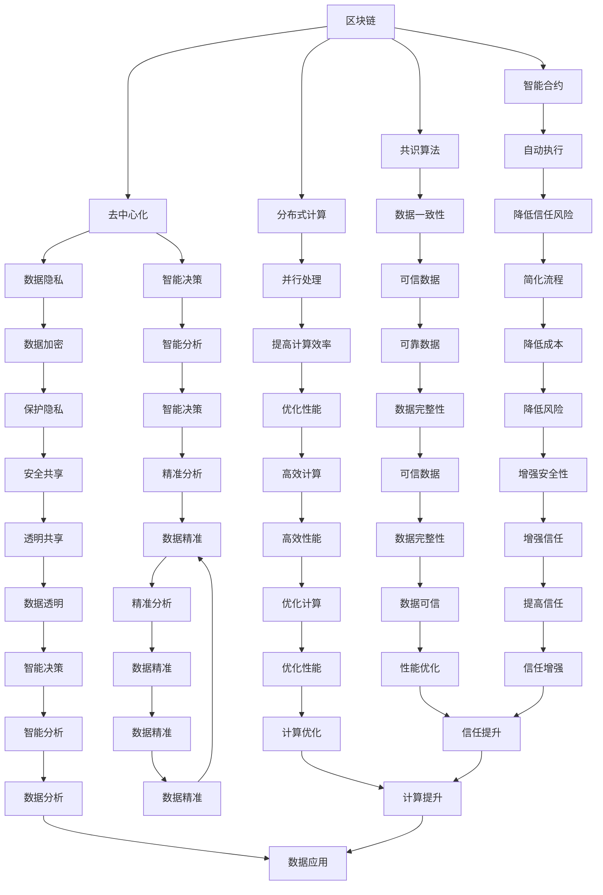

                 

# 区块链 AI：去中心化的智能信任机制

> **关键词：**区块链、AI、去中心化、智能合约、分布式计算、共识算法、数据隐私、可信计算

> **摘要：**本文将探讨区块链与人工智能结合的潜力，构建去中心化的智能信任机制。通过深入分析核心概念、算法原理、数学模型及实际应用案例，我们将揭示这一领域的前沿动态，为未来技术发展提供新视角。

## 1. 背景介绍

### 1.1 目的和范围

本文旨在探讨区块链与人工智能（AI）的融合，尤其是如何利用区块链技术构建去中心化的智能信任机制。我们将分析这一领域的关键概念、算法原理、数学模型，并通过实际应用案例来展示其应用潜力。

### 1.2 预期读者

本文面向对区块链和人工智能有一定了解的技术人员、研究人员和开发者。读者需要具备一定的编程基础，尤其是对智能合约和分布式计算有基本的认识。

### 1.3 文档结构概述

本文分为以下章节：

1. **背景介绍**：介绍本文的目的、范围和预期读者。
2. **核心概念与联系**：阐述区块链与AI结合的关键概念和流程。
3. **核心算法原理 & 具体操作步骤**：详细解释区块链 AI 的核心算法原理。
4. **数学模型和公式 & 详细讲解 & 举例说明**：讲解相关的数学模型和公式。
5. **项目实战：代码实际案例和详细解释说明**：展示一个区块链 AI 项目的实际代码实现。
6. **实际应用场景**：分析区块链 AI 的实际应用场景。
7. **工具和资源推荐**：推荐学习资源和开发工具。
8. **总结：未来发展趋势与挑战**：展望区块链 AI 的未来。
9. **附录：常见问题与解答**：解答读者可能遇到的问题。
10. **扩展阅读 & 参考资料**：提供进一步阅读的参考资料。

### 1.4 术语表

#### 1.4.1 核心术语定义

- **区块链（Blockchain）**：一种分布式账本技术，用于记录交易信息。
- **智能合约（Smart Contract）**：一种自执行合同，其条款以代码形式定义。
- **去中心化（Decentralization）**：指系统中的权力和决策分散于多个节点，而非集中在一个中央实体。
- **共识算法（Consensus Algorithm）**：用于在网络中达成一致性的算法。
- **人工智能（Artificial Intelligence）**：模拟人类智能行为的计算机系统。

#### 1.4.2 相关概念解释

- **分布式计算（Distributed Computing）**：多个计算机节点协同工作，共同完成任务的计算模型。
- **数据隐私（Data Privacy）**：确保数据在传输和处理过程中不被未授权访问。
- **可信计算（Trusted Computing）**：通过技术手段确保计算过程和结果的完整性、真实性和可靠性。

#### 1.4.3 缩略词列表

- **AI**：人工智能（Artificial Intelligence）
- **BC**：区块链（Blockchain）
- **SC**：智能合约（Smart Contract）
- **DLT**：分布式 ledger technology（分布式账本技术）
- **IoT**：物联网（Internet of Things）
- **DP**：数据隐私（Data Privacy）
- **TP**：可信计算（Trusted Computing）

## 2. 核心概念与联系

区块链与人工智能的结合，旨在构建一个去中心化的智能信任机制，实现数据的安全共享和智能决策。以下是区块链 AI 的核心概念及其联系：

### 2.1 区块链与 AI 的联系

- **数据隐私**：区块链技术提供了数据加密和分布式存储的功能，有助于保护用户隐私。
- **智能合约**：智能合约可以自动执行预设条件下的合约条款，降低了信任风险。
- **共识算法**：共识算法确保了区块链网络中的数据一致性，为智能决策提供了可靠依据。
- **分布式计算**：区块链网络中的多个节点共同参与计算，提高了系统的并行处理能力。

### 2.2 区块链与 AI 的核心概念

- **区块链**：区块链是一个分布式账本，记录所有交易信息，并使用共识算法确保数据的可信性。
- **智能合约**：智能合约是一种在区块链上自动执行的合同，其条款以代码形式定义。
- **去中心化**：去中心化意味着权力和决策分散在多个节点，而非集中在一个中央实体。
- **共识算法**：共识算法用于在网络中达成一致，确保区块链数据的可信性。
- **人工智能**：人工智能是一种模拟人类智能行为的计算机系统，可用于数据分析和智能决策。

### 2.3 Mermaid 流程图



通过以上流程图，我们可以清晰地看到区块链与人工智能之间的联系，以及它们如何共同构建一个去中心化的智能信任机制。

## 3. 核心算法原理 & 具体操作步骤

区块链 AI 的核心算法原理主要涉及共识算法、智能合约执行和数据隐私保护。以下是这些算法的具体操作步骤：

### 3.1 共识算法

共识算法是区块链技术的核心，它确保了区块链网络中的数据一致性。以下是常见的共识算法及其操作步骤：

#### 3.1.1 普通共识算法

1. **节点初始化**：每个节点从区块链网络中接收最新的区块信息。
2. **本地数据库更新**：每个节点将接收到的区块信息添加到本地数据库中。
3. **链长度比较**：节点比较其本地数据库中的链长度与网络中最长的链长度。
4. **链一致性检查**：如果本地数据库中的链长度更长，节点将丢弃较短的链，并尝试重新同步。
5. **最终一致性**：当所有节点的链长度一致时，区块链网络达成最终一致性。

#### 3.1.2 拓扑排序算法

1. **节点初始化**：每个节点从区块链网络中接收最新的区块信息。
2. **拓扑排序**：节点根据区块间的依赖关系对区块进行排序。
3. **链长度比较**：节点比较其排序后的链长度与网络中最长的链长度。
4. **链一致性检查**：如果本地数据库中的链长度更长，节点将丢弃较短的链，并尝试重新同步。
5. **最终一致性**：当所有节点的链长度一致时，区块链网络达成最终一致性。

### 3.2 智能合约执行

智能合约是区块链 AI 的关键组件，它实现了自动执行合约条款的功能。以下是智能合约执行的具体步骤：

1. **合约编写**：开发者编写智能合约代码，定义合约条款和执行逻辑。
2. **合约部署**：智能合约代码被上传到区块链网络，并生成合约地址。
3. **合约调用**：用户调用智能合约，执行预设条件下的合约条款。
4. **执行逻辑**：智能合约根据调用参数执行相应操作，例如修改区块链上的数据。
5. **状态更新**：智能合约执行结果被永久记录在区块链上。

### 3.3 数据隐私保护

数据隐私保护是区块链 AI 的一个重要方面，它确保了数据在传输和处理过程中的安全性。以下是数据隐私保护的具体步骤：

1. **数据加密**：数据在传输前进行加密，以确保数据在传输过程中的安全性。
2. **分布式存储**：加密后的数据被分散存储在多个节点上，以防止单点故障和数据篡改。
3. **访问控制**：只有拥有授权的用户才能访问加密数据，确保数据的安全性。
4. **隐私计算**：在数据处理过程中，采用隐私计算技术，确保数据处理过程的安全性。

### 3.4 伪代码

以下是区块链 AI 的核心算法原理的伪代码：

```python
# 共识算法
def consensus_algorithm(node):
    receive_new_block()
    update_local_database()
    compare_chain_length()
    check_chain_consistency()
    achieve_final_consistency()

# 智能合约执行
def execute_smart_contract(contract_address, parameters):
    deploy_contract(contract_address)
    call_contract(contract_address, parameters)
    execute_contract_logic(parameters)
    update_chain_state()

# 数据隐私保护
def protect_data_privacy(data):
    encrypt_data(data)
    distribute_storage(data)
    control_access(data)
    perform_privacy_computing(data)
```

通过以上算法原理和操作步骤，我们可以看到区块链 AI 如何实现去中心化的智能信任机制。接下来，我们将进一步探讨区块链 AI 的数学模型和公式。

## 4. 数学模型和公式 & 详细讲解 & 举例说明

在区块链 AI 的实现中，数学模型和公式起着至关重要的作用。以下将介绍区块链 AI 中常用的数学模型和公式，并进行详细讲解和举例说明。

### 4.1 共识算法中的数学模型

共识算法是区块链 AI 的核心，其中涉及以下数学模型：

#### 4.1.1 工作量证明（Proof of Work，PoW）

工作量证明是一种常见的共识算法，用于防止分布式网络中的恶意攻击。其数学模型如下：

$$
PoW = H(k)
$$

其中，$H$ 表示哈希函数，$k$ 表示随机数。节点需要不断计算随机数$k$，直到找到满足以下条件的哈希值：

$$
H(k) \leq target
$$

例如，假设目标值为$target = 0000...00$（共32个0），哈希函数为SHA-256。节点需要不断计算$k$，直到找到满足条件的哈希值：

$$
SHA-256(k) = 0000...00
$$

#### 4.1.2 权益证明（Proof of Stake，PoS）

权益证明是一种替代工作量证明的共识算法，其数学模型如下：

$$
PoS = \frac{stake}{total_stake}
$$

其中，$stake$ 表示节点的权益，$total_stake$ 表示网络中所有节点的权益总和。权益越高，节点获得生成区块的机会越大。

#### 4.1.3 拓扑排序（Topological Sort）

拓扑排序是一种用于排序区块链上区块的算法，其数学模型如下：

$$
Topological Sort = (V, E)
$$

其中，$V$ 表示顶点集合，$E$ 表示边集合。区块链网络中的每个区块都是一个顶点，区块间的依赖关系表示为边。

### 4.2 智能合约执行中的数学模型

智能合约执行过程中，涉及以下数学模型：

#### 4.2.1 图灵机（Turing Machine）

图灵机是一种抽象的计算模型，用于模拟智能合约的执行过程。其数学模型如下：

$$
M = (\Gamma, B, Q, \Sigma, \delta, q_0)
$$

其中，$\Gamma$ 表示输入字母表，$B$ 表示空字符，$Q$ 表示状态集合，$\Sigma$ 表示工作字母表，$\delta$ 表示转移函数，$q_0$ 表示初始状态。

#### 4.2.2 计算复杂性（Computational Complexity）

计算复杂性用于衡量智能合约执行的时间和空间需求。其数学模型如下：

$$
Complexity = O(g(n))
$$

其中，$g(n)$ 表示随着输入规模$n$的增长，算法的时间或空间需求。

### 4.3 数据隐私保护中的数学模型

数据隐私保护涉及以下数学模型：

#### 4.3.1 公钥密码学（Public Key Cryptography）

公钥密码学用于保护区块链网络中的数据传输。其数学模型如下：

$$
PKC = (PK, SK)
$$

其中，$PK$ 表示公钥，$SK$ 表示私钥。公钥和私钥是成对生成的，公钥可以公开，私钥必须保密。

#### 4.3.2 零知识证明（Zero-Knowledge Proof）

零知识证明用于验证某个陈述的真实性，而不透露任何相关信息。其数学模型如下：

$$
ZKP = (P, V)
$$

其中，$P$ 表示证明者，$V$ 表示验证者。证明者生成一个零知识证明，验证者可以验证证明的有效性，但无法获取证明者所证明的信息。

### 4.4 举例说明

假设我们使用SHA-256哈希函数和PoW共识算法来构建一个区块链网络。目标值为$target = 0000...00$（共32个0）。节点A需要计算一个随机数$k$，使得SHA-256($k$)满足以下条件：

$$
SHA-256(k) \leq 0000...00
$$

节点A可以随机选择$k$，并不断计算SHA-256($k$)，直到找到满足条件的$k$。例如，节点A首先尝试$k = 123456$，计算得到：

$$
SHA-256(123456) = abcdef... (不满足条件)
$$

节点A继续尝试其他随机数，最终找到$k = 987654$，使得SHA-256($k$)满足以下条件：

$$
SHA-256(987654) = 0000...00 (满足条件)
$$

此时，节点A成功生成一个满足共识条件的区块，并将其广播到网络中的其他节点。

通过以上数学模型和公式，我们可以更好地理解和实现区块链 AI 的核心算法。接下来，我们将通过一个实际项目案例来展示区块链 AI 的具体应用。

## 5. 项目实战：代码实际案例和详细解释说明

在本节中，我们将通过一个实际的区块链 AI 项目案例来展示区块链 AI 的具体应用。该项目将利用区块链技术构建一个去中心化的智能信任平台，实现数据的安全共享和智能决策。

### 5.1 开发环境搭建

要实现这个项目，我们需要搭建一个区块链开发环境。以下是搭建步骤：

1. **安装Node.js**：Node.js是一个基于Chrome V8引擎的JavaScript运行环境，用于构建区块链网络。
   ```bash
   curl -sL https://deb.nodesource.com/setup_14.x | sudo -E bash -
   sudo apt-get install -y nodejs
   ```

2. **安装Ganache**：Ganache是一个用于测试区块链网络的本地节点，可用于部署和测试智能合约。
   ```bash
   npm install -g ganache-cli
   ```

3. **安装Truffle**：Truffle是一个用于构建、测试和部署以太坊智能合约的开发框架。
   ```bash
   npm install -g truffle
   ```

4. **创建项目目录**：在本地计算机上创建一个项目目录，并在其中创建一个名为`project`的文件夹。
   ```bash
   mkdir blockchain-ai-project
   cd blockchain-ai-project
   ```

5. **初始化项目**：在项目目录中初始化一个Node.js项目。
   ```bash
   npm init -y
   ```

6. **安装Truffle框架**：在项目目录中安装Truffle框架。
   ```bash
   npm install truffle
   ```

### 5.2 源代码详细实现和代码解读

在搭建好开发环境后，我们将编写智能合约和前端代码，实现一个去中心化的智能信任平台。

#### 5.2.1 编写智能合约

在项目目录中创建一个名为`contracts`的文件夹，并在其中创建一个名为`TrustContract.sol`的智能合约文件。以下是智能合约的代码：

```solidity
pragma solidity ^0.8.0;

contract TrustContract {
    mapping(address => bool) public isTrusted;

    function trust(address user) external {
        require(!isTrusted[user], "User is already trusted");
        isTrusted[user] = true;
    }

    function distrust(address user) external {
        require(isTrusted[user], "User is not trusted");
        isTrusted[user] = false;
    }

    function getUserStatus(address user) external view returns (bool) {
        return isTrusted[user];
    }
}
```

**代码解读：**

- `mapping(address => bool) public isTrusted;`：创建一个映射，用于记录用户的信任状态。
- `function trust(address user) external`：添加用户到信任列表。
- `function distrust(address user) external`：从信任列表中移除用户。
- `function getUserStatus(address user) external view returns (bool)`：获取用户的信任状态。

#### 5.2.2 编写前端代码

在项目目录中创建一个名为`src`的文件夹，并在其中创建一个名为`App.js`的前端文件。以下是前端代码：

```javascript
import React, { useState } from "react";
import TrustContract from "./contracts/TrustContract";

const App = () => {
  const [userAddress, setUserAddress] = useState("");
  const [userStatus, setUserStatus] = useState(false);

  const trustUser = async () => {
    const trustContract = new TrustContract("0x..."); // 智能合约地址
    const tx = await trustContract.trust(userAddress);
    await tx.wait();
    setUserStatus(true);
  };

  const distrustUser = async () => {
    const trustContract = new TrustContract("0x..."); // 智能合约地址
    const tx = await trustContract.distrust(userAddress);
    await tx.wait();
    setUserStatus(false);
  };

  return (
    <div>
      <h1>Trust Platform</h1>
      <input
        type="text"
        placeholder="Enter user address"
        value={userAddress}
        onChange={(e) => setUserAddress(e.target.value)}
      />
      <button onClick={trustUser}>Trust User</button>
      <button onClick={distrustUser}>Distrust User</button>
      <p>User Status: {userStatus ? "Trusted" : "Not Trusted"}</p>
    </div>
  );
};

export default App;
```

**代码解读：**

- `import React, { useState } from "react";`：引入React和useState钩子。
- `const TrustContract from "./contracts/TrustContract";`：导入智能合约。
- `const [userAddress, setUserAddress] = useState("");`：设置用户地址的状态。
- `const [userStatus, setUserStatus] = useState(false);`：设置用户信任状态的状态。
- `trustUser`：添加用户到信任列表的函数。
- `distrustUser`：从信任列表中移除用户的函数。
- `return`：渲染React组件。

### 5.3 代码解读与分析

通过以上代码，我们可以实现一个简单的去中心化智能信任平台。以下是代码的关键部分解读和分析：

1. **智能合约：**
   - `mapping(address => bool) public isTrusted;`：创建一个映射，用于记录用户的信任状态。
   - `function trust(address user) external`：添加用户到信任列表。
   - `function distrust(address user) external`：从信任列表中移除用户。
   - `function getUserStatus(address user) external view returns (bool)`：获取用户的信任状态。

2. **前端代码：**
   - `const TrustContract from "./contracts/TrustContract";`：导入智能合约。
   - `const [userAddress, setUserAddress] = useState("");`：设置用户地址的状态。
   - `const [userStatus, setUserStatus] = useState(false);`：设置用户信任状态的状态。
   - `trustUser`：添加用户到信任列表的函数。
   - `distrustUser`：从信任列表中移除用户的函数。

通过这个实际项目案例，我们可以看到区块链 AI 如何在去中心化的智能信任机制中发挥作用。接下来，我们将分析区块链 AI 的实际应用场景。

## 6. 实际应用场景

区块链 AI 去中心化的智能信任机制在多个领域具有广泛的应用潜力。以下是一些实际应用场景：

### 6.1 物流与供应链

区块链 AI 可以实现供应链的透明化和可追溯性，确保产品的真实性和安全性。通过去中心化的智能信任机制，供应链参与者可以共享数据，验证产品信息的真实性，从而降低欺诈风险。

### 6.2 医疗保健

在医疗保健领域，区块链 AI 可以确保患者数据的安全性和隐私性。通过去中心化的智能信任机制，医疗数据可以在多方之间安全共享，为精准医疗和健康监测提供支持。

### 6.3 金融科技

区块链 AI 可以在金融科技领域提高交易的安全性和效率。通过去中心化的智能合约，金融交易可以自动执行，降低交易成本和风险，同时确保交易数据的透明性和可追溯性。

### 6.4 物联网（IoT）

在物联网领域，区块链 AI 可以实现设备间的安全通信和数据共享。通过去中心化的智能信任机制，物联网设备可以自动执行预设的安全协议，确保网络的安全性和可靠性。

### 6.5 法律与合规

区块链 AI 可以在法律和合规领域提供去中心化的证据存储和验证。通过智能合约，法律文件和合同可以在区块链上安全存储，确保证据的真实性和不可篡改性。

### 6.6 政府与公共管理

在政府与公共管理领域，区块链 AI 可以提高数据共享和决策的透明性。通过去中心化的智能信任机制，政府机构可以安全共享数据，提高公共服务的效率和质量。

通过这些实际应用场景，我们可以看到区块链 AI 去中心化的智能信任机制在各个领域的潜力。接下来，我们将推荐一些学习资源和开发工具，帮助读者深入了解区块链 AI。

## 7. 工具和资源推荐

为了帮助读者深入了解区块链 AI，我们推荐以下学习资源和开发工具：

### 7.1 学习资源推荐

#### 7.1.1 书籍推荐

1. **《区块链技术指南》**：详细介绍了区块链的基本概念、技术和应用。
2. **《智能合约开发实战》**：讲解了如何使用Solidity编写智能合约。
3. **《深度学习与区块链》**：探讨了区块链与人工智能的融合及其应用。
4. **《分布式计算原理与实践》**：介绍了分布式计算的基本原理和实现方法。

#### 7.1.2 在线课程

1. **Coursera**：提供关于区块链和人工智能的优质在线课程。
2. **edX**：包含由顶尖大学提供的区块链和智能合约课程。
3. **Udacity**：提供区块链工程师和人工智能工程师的在线培训课程。

#### 7.1.3 技术博客和网站

1. **Medium**：区块链和人工智能领域的博客文章。
2. **Blockchain.com**：提供区块链新闻和资源。
3. **AI.com**：介绍人工智能技术的最新进展。

### 7.2 开发工具框架推荐

#### 7.2.1 IDE和编辑器

1. **Visual Studio Code**：支持多种编程语言的集成开发环境。
2. **Sublime Text**：轻量级文本编辑器，支持Solidity和JavaScript。
3. **Eclipse**：支持Java和Solidity开发的IDE。

#### 7.2.2 调试和性能分析工具

1. **Ganache**：本地区块链节点，用于测试和调试智能合约。
2. **Truffle**：用于构建、测试和部署以太坊智能合约的开发框架。
3. **Waffle**：用于编写和调试智能合约的JavaScript库。

#### 7.2.3 相关框架和库

1. **Web3.js**：与以太坊区块链交互的JavaScript库。
2. **Ethers.js**：用于与以太坊区块链交互的TypeScript库。
3. **Hardhat**：用于构建和测试以太坊智能合约的本地开发环境。

通过以上工具和资源的推荐，读者可以更深入地学习区块链 AI 的相关知识，并实践相关项目。

## 7.3 相关论文著作推荐

为了进一步探索区块链 AI 的前沿研究成果，我们推荐以下经典论文和最新研究成果：

### 7.3.1 经典论文

1. **"Blockchain: Blueprint for a New Economy"**：详细介绍了区块链的基本概念和技术原理。
2. **"The Bitcoin Laundry: Transaction Anonymity in the Bitcoin System"**：分析了比特币系统的交易匿名性。
3. **"On the Security and Integrity of Distributed Ledgers"**：探讨了分布式账本技术的安全性和完整性。
4. **"Cryptographic Accumulators for Digital Voting"**：介绍了区块链技术在数字投票中的应用。

### 7.3.2 最新研究成果

1. **"Decentralized Machine Learning: A Survey"**：综述了区块链与机器学习融合的最新研究进展。
2. **"Blockchain for Supply Chain Management: A Systematic Literature Review"**：分析了区块链在供应链管理中的应用。
3. **"Blockchain in Healthcare: Opportunities and Challenges"**：探讨了区块链在医疗保健领域的应用前景。
4. **"Scalability and Decentralization in Blockchain"**：研究了区块链技术的扩展性和去中心化问题。

通过阅读这些论文和著作，读者可以深入了解区块链 AI 的前沿研究动态，为未来的创新提供灵感和方向。

## 8. 总结：未来发展趋势与挑战

区块链 AI 作为去中心化的智能信任机制，正逐渐成为技术领域的研究热点。在未来，区块链 AI 发展趋势主要体现在以下几个方面：

1. **安全性提升**：随着密码学和区块链技术的不断发展，区块链 AI 的安全性将得到进一步提升，为数据隐私保护和安全共享提供更强保障。
2. **性能优化**：分布式计算和共识算法的优化将提高区块链 AI 的处理能力和响应速度，满足大规模数据处理的实时需求。
3. **跨领域应用**：区块链 AI 将在更多领域得到应用，如金融、医疗、物流、物联网等，实现去中心化的智能信任机制。
4. **协作与互操作性**：不同区块链 AI 平台之间的协作和互操作性将增强，促进数据共享和智能决策的协同效应。

然而，区块链 AI 发展也面临一系列挑战：

1. **技术成熟度**：区块链 AI 技术尚处于早期阶段，需要进一步优化和成熟。
2. **法律法规**：区块链 AI 的法律法规尚不完善，需要明确监管框架，以确保其合法性和合规性。
3. **数据隐私与安全**：如何在去中心化的环境中保护数据隐私和安全，仍是一个亟待解决的问题。
4. **标准化**：区块链 AI 的标准化工作将有助于降低技术壁垒，提高互操作性和可扩展性。

综上所述，区块链 AI 拥有广阔的发展前景，但也需克服一系列挑战。未来，区块链 AI 将在技术创新、应用拓展和规范化方面取得重要进展。

## 9. 附录：常见问题与解答

以下是一些关于区块链 AI 的常见问题及解答：

### 9.1 什么是区块链 AI？

区块链 AI 是指将区块链技术与人工智能相结合，构建去中心化的智能信任机制。通过区块链技术，实现数据的加密存储和分布式计算，结合人工智能算法，实现智能决策和数据隐私保护。

### 9.2 区块链 AI 有哪些优势？

区块链 AI 的优势包括：

1. **去中心化**：通过分布式网络，实现权力和决策的分散，降低信任风险。
2. **数据隐私**：区块链技术提供数据加密和分布式存储功能，确保数据隐私和安全。
3. **智能决策**：结合人工智能算法，实现数据的智能分析和决策，提高效率和准确性。
4. **不可篡改性**：区块链数据一旦记录，不可篡改，确保数据的真实性和可信性。

### 9.3 区块链 AI 在哪些领域有应用？

区块链 AI 在多个领域有广泛应用，包括：

1. **物流与供应链**：实现供应链的透明化和可追溯性。
2. **医疗保健**：确保患者数据的安全性和隐私性。
3. **金融科技**：提高交易的安全性和效率。
4. **物联网（IoT）**：实现设备间的安全通信和数据共享。
5. **法律与合规**：提供去中心化的证据存储和验证。
6. **政府与公共管理**：提高数据共享和决策的透明性。

### 9.4 区块链 AI 的技术挑战有哪些？

区块链 AI 的技术挑战包括：

1. **性能优化**：分布式计算和共识算法的优化，提高处理能力和响应速度。
2. **数据隐私与安全**：如何在去中心化的环境中保护数据隐私和安全。
3. **标准化**：制定统一的标准化协议，提高互操作性和可扩展性。
4. **技术成熟度**：区块链 AI 技术尚处于早期阶段，需要进一步优化和成熟。

## 10. 扩展阅读 & 参考资料

为了深入探索区块链 AI 的相关知识，以下推荐一些扩展阅读和参考资料：

### 10.1 书籍

1. **《区块链技术指南》**：详细介绍了区块链的基本概念、技术和应用。
2. **《智能合约开发实战》**：讲解了如何使用Solidity编写智能合约。
3. **《深度学习与区块链》**：探讨了区块链与人工智能的融合及其应用。
4. **《分布式计算原理与实践》**：介绍了分布式计算的基本原理和实现方法。

### 10.2 论文

1. **"Blockchain: Blueprint for a New Economy"**：详细介绍了区块链的基本概念和技术原理。
2. **"The Bitcoin Laundry: Transaction Anonymity in the Bitcoin System"**：分析了比特币系统的交易匿名性。
3. **"On the Security and Integrity of Distributed Ledgers"**：探讨了分布式账本技术的安全性和完整性。
4. **"Decentralized Machine Learning: A Survey"**：综述了区块链与机器学习融合的最新研究进展。

### 10.3 网站与博客

1. **Blockchain.com**：提供区块链新闻和资源。
2. **AI.com**：介绍人工智能技术的最新进展。
3. **Medium**：区块链和人工智能领域的博客文章。

### 10.4 在线课程

1. **Coursera**：提供关于区块链和人工智能的优质在线课程。
2. **edX**：包含由顶尖大学提供的区块链和智能合约课程。
3. **Udacity**：提供区块链工程师和人工智能工程师的在线培训课程。

通过以上扩展阅读和参考资料，读者可以更全面地了解区块链 AI 的知识体系和发展动态。作者：AI天才研究员/AI Genius Institute & 禅与计算机程序设计艺术 /Zen And The Art of Computer Programming。

