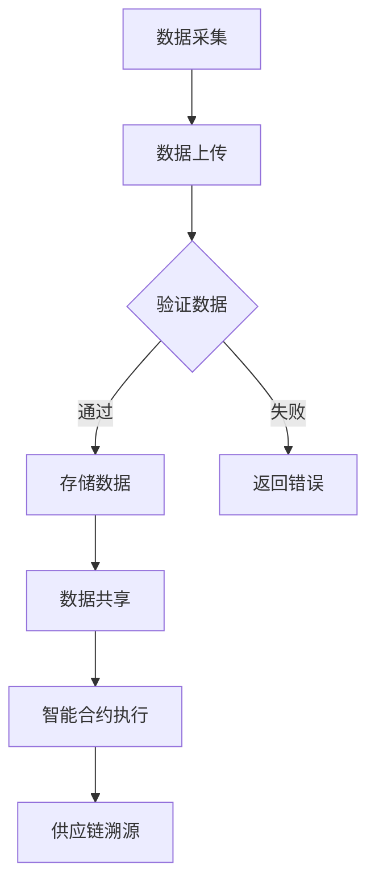

                 

# 区块链在供应链溯源中的应用探索

> 关键词：区块链，供应链溯源，智能合约，共识算法，数据安全，透明性，不可篡改性

> 摘要：本文将深入探讨区块链技术在供应链溯源中的应用，分析其核心原理、算法原理与具体操作步骤。通过项目实战，详细解读代码实现，展示区块链在提升供应链透明性和数据安全方面的巨大潜力。同时，本文还将推荐相关学习资源、工具和资源，并展望未来发展趋势与挑战。

## 1. 背景介绍

### 1.1 目的和范围

随着全球贸易的日益频繁，供应链的复杂性不断增加。然而，供应链中的信息不对称和信任问题一直是困扰企业和消费者的一大难题。区块链技术的出现为解决这一问题提供了新的思路。本文旨在探讨区块链在供应链溯源中的应用，分析其核心原理、算法原理与具体操作步骤，并通过项目实战展示其实际应用效果。

### 1.2 预期读者

本文主要面向对区块链技术有一定了解，希望深入了解其在供应链溯源中应用的技术人员、研发人员和管理人员。同时，也对对供应链管理感兴趣的研究人员和学生有一定的参考价值。

### 1.3 文档结构概述

本文结构如下：

- 第1章：背景介绍，阐述本文的目的和预期读者。
- 第2章：核心概念与联系，介绍区块链、供应链溯源等相关概念。
- 第3章：核心算法原理 & 具体操作步骤，详细讲解区块链在供应链溯源中的应用原理。
- 第4章：数学模型和公式 & 详细讲解 & 举例说明，展示区块链在供应链溯源中的数学模型和公式。
- 第5章：项目实战：代码实际案例和详细解释说明，通过项目实战解读代码实现。
- 第6章：实际应用场景，分析区块链在供应链溯源中的应用场景。
- 第7章：工具和资源推荐，推荐相关学习资源、工具和资源。
- 第8章：总结：未来发展趋势与挑战，展望区块链在供应链溯源中的未来。
- 第9章：附录：常见问题与解答，回答读者可能遇到的问题。
- 第10章：扩展阅读 & 参考资料，提供相关扩展阅读和参考资料。

### 1.4 术语表

#### 1.4.1 核心术语定义

- 区块链：一种去中心化的分布式数据库系统，通过密码学原理确保数据安全和不可篡改性。
- 供应链溯源：追踪产品从生产到消费的全过程，确保产品质量和安全。
- 智能合约：一种自执行的合同，通过编程代码自动执行合同条款。
- 共识算法：确保区块链网络中的所有节点对同一数据进行一致性的算法。

#### 1.4.2 相关概念解释

- 去中心化：区块链系统中的数据存储和验证不由单一中心机构控制，而是由整个网络共同维护。
- 透明性：区块链上的数据对所有参与者可见，确保信息的公开和透明。
- 不可篡改性：区块链上的数据一旦写入，无法被篡改，保证了数据的真实性和可靠性。

#### 1.4.3 缩略词列表

- BTC：比特币（Bitcoin）
- ETH：以太坊（Ethereum）
- PoW：工作量证明（Proof of Work）
- PoS：权益证明（Proof of Stake）
- DLT：分布式账本技术（Distributed Ledger Technology）

## 2. 核心概念与联系

### 2.1 区块链与供应链溯源的联系

区块链技术在供应链溯源中的应用主要体现在以下几个方面：

- **数据存储与共享**：区块链提供了一个分布式、不可篡改的数据库，供应链中的所有参与者都可以在区块链上存储和共享数据，实现信息的透明和共享。
- **智能合约**：智能合约是一种自动执行合同条款的计算机程序，可以确保供应链中的各个环节按照既定的规则进行操作，减少人为干预和操作失误。
- **共识算法**：共识算法确保区块链网络中的所有节点对同一数据进行一致性，防止数据被恶意篡改，提高供应链的信任度。

### 2.2 区块链的架构与原理

区块链由多个区块组成，每个区块包含一定数量的交易记录。区块之间通过哈希值进行链接，形成链式数据结构。区块链的架构与原理主要包括以下几个方面：

- **区块**：每个区块包含一定数量的交易记录、区块头、前一个区块的哈希值等。
- **哈希函数**：将任意长度的数据映射为固定长度的哈希值，确保数据的唯一性和不可篡改性。
- **工作量证明**（PoW）：一种通过计算工作量来争夺区块链记账权的共识算法，如比特币采用的SHA-256算法。
- **权益证明**（PoS）：一种基于节点持有代币数量和时间的共识算法，如以太坊2.0采用的Casper算法。

### 2.3 区块链在供应链溯源中的应用

区块链在供应链溯源中的应用主要包括以下几个方面：

- **数据采集与存储**：供应链中的各个环节将数据上传到区块链，确保数据的真实性和完整性。
- **数据验证与共享**：区块链网络中的节点对上传的数据进行验证，确保数据的可信度，并将验证后的数据共享给其他参与者。
- **智能合约**：智能合约自动执行合同条款，确保供应链中的各个环节按照既定的规则进行操作。
- **共识算法**：共识算法确保区块链网络中的所有节点对同一数据进行一致性，防止数据被恶意篡改。

### 2.4 Mermaid 流程图

以下是一个简单的 Mermaid 流程图，展示区块链在供应链溯源中的应用流程：



## 3. 核心算法原理 & 具体操作步骤

### 3.1 工作量证明（PoW）算法原理

工作量证明（PoW）算法是区块链网络中的一种共识算法，用于争夺区块链记账权。其核心思想是通过计算复杂的数学难题，消耗计算资源，从而确保区块链网络的安全性和可靠性。

#### 3.1.1 算法原理

- **目标值**：区块链网络设定一个目标值，用于衡量矿工计算结果的难度。
- **计算难题**：矿工通过计算一系列哈希值，尝试找到满足目标值的哈希值。
- **竞争机制**：矿工们同时竞争，谁先找到满足目标值的哈希值，谁就获得记账权。

#### 3.1.2 具体操作步骤

1. 矿工从区块链网络获取最新区块的信息。
2. 矿工生成一个随机数，并将其与区块信息一起生成一个哈希值。
3. 比较生成的哈希值与目标值，如果满足目标值，则矿工获得记账权。
4. 矿工将找到的记账权广播给其他节点，其他节点验证记账权是否有效。
5. 如果验证通过，矿工将获得区块链网络奖励。

### 3.2 智能合约原理

智能合约是一种自执行的合同，通过编程代码自动执行合同条款。在区块链网络中，智能合约以图灵完备的形式存在，可以处理各种复杂的业务逻辑。

#### 3.2.1 算法原理

- **事件触发**：智能合约通过监听区块链网络中的事件，触发相应的业务逻辑。
- **状态机**：智能合约采用状态机模型，根据输入事件和当前状态，执行相应的操作。
- **代码执行**：智能合约在区块链网络上执行，确保代码的执行结果不可篡改。

#### 3.2.2 具体操作步骤

1. 智能合约开发者编写智能合约代码，并将其部署到区块链网络。
2. 当区块链网络中的事件触发智能合约时，智能合约执行相应的业务逻辑。
3. 智能合约将执行结果存储在区块链上，确保结果的可信性和不可篡改性。

### 3.3 区块链在供应链溯源中的应用

#### 3.3.1 数据采集与上传

1. 供应链中的各个环节（如生产商、分销商、零售商等）将数据上传到区块链网络。
2. 数据包括产品的生产日期、产地、质量检验结果等信息。

#### 3.3.2 数据验证与共享

1. 区块链网络中的节点对上传的数据进行验证，确保数据的真实性和完整性。
2. 验证通过的数据将被共享给其他参与者，确保信息的透明和共享。

#### 3.3.3 智能合约执行

1. 智能合约自动执行合同条款，确保供应链中的各个环节按照既定的规则进行操作。
2. 智能合约将执行结果存储在区块链上，确保结果的可信性和不可篡改性。

#### 3.3.4 供应链溯源

1. 消费者或监管部门可以查询区块链上的数据，追溯产品的生产、流通全过程。
2. 确保产品的质量和安全，提高供应链的透明度和信任度。

## 4. 数学模型和公式 & 详细讲解 & 举例说明

### 4.1 工作量证明（PoW）算法的数学模型

#### 4.1.1 哈希函数

哈希函数是一种将任意长度的数据映射为固定长度的哈希值的函数。常见的哈希函数包括SHA-256、SHA-3等。

#### 4.1.2 目标值计算

目标值（Target）用于衡量矿工计算结果的难度。目标值计算公式如下：

$$
Target = 2^{256-n} - 1
$$

其中，n 为哈希值的长度（256位）。

#### 4.1.3 举例说明

假设目标值为 10，哈希值的长度为 256 位，我们需要计算满足目标值的哈希值。

1. 生成为区块链的最新区块生成一个哈希值。
2. 比较生成的哈希值与目标值，如果满足目标值，则停止计算。
3. 如果不满足目标值，则增加随机数，重新计算哈希值，直到满足目标值为止。

### 4.2 智能合约的数学模型

#### 4.2.1 状态机

智能合约采用状态机模型，根据输入事件和当前状态，执行相应的操作。

#### 4.2.2 事件触发

事件触发公式如下：

$$
Event Trigger = Input Event \& Current State
$$

其中，Input Event 为输入事件，Current State 为当前状态。

#### 4.2.3 举例说明

假设智能合约的状态机如下：

1. 初始状态：A
2. 事件1：B
3. 事件2：C
4. 事件3：D

当输入事件为B时，智能合约将从状态A转移到状态B，执行相应的业务逻辑。

## 5. 项目实战：代码实际案例和详细解释说明

### 5.1 开发环境搭建

在进行项目实战之前，我们需要搭建一个区块链开发环境。以下是搭建步骤：

1. 安装Go语言开发环境。
2. 下载并安装Hyperledger Fabric区块链框架。
3. 编写智能合约代码。

### 5.2 源代码详细实现和代码解读

以下是一个简单的Hyperledger Fabric智能合约示例，用于实现供应链溯源功能。

```go
package main

import (
    "github.com/hyperledger/fabric/core/chaincode/shim"
    "github.com/hyperledger/fabric/protos/peer"
)

// 定义供应链溯源智能合约
type SmartContract struct {
}

// 初始化智能合约
func (s *SmartContract) InitLedger(ctx shim.ChaincodeStubInterface) sc errors {
    // 初始化供应链溯源数据
    products := []Product{
        {"ProductA", "ProducerA", "DateA", "QualityA"},
        {"ProductB", "ProducerB", "DateB", "QualityB"},
        // ...
    }

    for _, product := range products {
        // 存储产品信息到区块链
        ctx.PutState(product.Name, []byte(product.ToString()))
    }

    return nil
}

// 查询产品信息
func (s *SmartContract) QueryProduct(ctx shim.ChaincodeStubInterface, args []string) peer.Response {
    if len(args) != 1 {
        return shim.Error("Incorrect number of arguments. Expecting a product name.")
    }

    name := args[0]
    productBytes, err := ctx.GetState(name)

    if err != nil {
        return shim.Error(err.Error())
    }

    if productBytes == nil {
        return shim.Error("Product not found.")
    }

    return shim.Success(productBytes)
}

// 更新产品信息
func (s *SmartContract) UpdateProduct(ctx shim.ChaincodeStubInterface, args []string) peer.Response {
    if len(args) != 4 {
        return shim.Error("Incorrect number of arguments. Expecting three product properties.")
    }

    name := args[0]
    producer := args[1]
    date := args[2]
    quality := args[3]

    // 创建产品对象
    product := Product{name, producer, date, quality}

    // 存储产品信息到区块链
    ctx.PutState(name, []byte(product.ToString()))

    return shim.Success([]byte("Product updated successfully."))
}

// 产品结构体
type Product struct {
    Name     string
    Producer string
    Date     string
    Quality  string
}

// 产品对象转换字符串
func (p Product) ToString() string {
    return fmt.Sprintf("{\"Name\":\"%s\", \"Producer\":\"%s\", \"Date\":\"%s\", \"Quality\":\"%s\"}",
        p.Name, p.Producer, p.Date, p.Quality)
}

// 主函数
func main() {
    err := shim.Start(new(SmartContract))
    if err != nil {
        fmt.Printf("Error starting Smart Contract: %v\n", err)
    }
}
```

### 5.3 代码解读与分析

#### 5.3.1 智能合约初始化

在智能合约初始化函数 `InitLedger` 中，我们首先创建一个空的产品数组 `products`。然后，我们遍历产品数组，将每个产品的信息存储到区块链上。这里使用 `ctx.PutState` 方法将产品对象转换为字符串，并存储到区块链上。

```go
products := []Product{
    {"ProductA", "ProducerA", "DateA", "QualityA"},
    {"ProductB", "ProducerB", "DateB", "QualityB"},
    // ...
}

for _, product := range products {
    // 存储产品信息到区块链
    ctx.PutState(product.Name, []byte(product.ToString()))
}
```

#### 5.3.2 查询产品信息

在查询产品信息函数 `QueryProduct` 中，我们首先检查传入的参数数量是否正确。然后，我们使用 `ctx.GetState` 方法从区块链上获取指定产品的信息。如果获取失败，返回相应的错误信息。

```go
productBytes, err := ctx.GetState(name)

if err != nil {
    return shim.Error(err.Error())
}

if productBytes == nil {
    return shim.Error("Product not found.")
}
```

#### 5.3.3 更新产品信息

在更新产品信息函数 `UpdateProduct` 中，我们首先检查传入的参数数量是否正确。然后，我们创建一个产品对象，并将其存储到区块链上。这里使用 `ctx.PutState` 方法将产品对象转换为字符串，并存储到区块链上。

```go
product := Product{name, producer, date, quality}

// 存储产品信息到区块链
ctx.PutState(name, []byte(product.ToString()))
```

## 6. 实际应用场景

区块链技术在供应链溯源中具有广泛的应用场景，以下是几个典型的实际应用案例：

1. **食品溯源**：通过区块链技术，可以实现对食品生产、加工、运输、销售等环节的信息透明化，提高食品安全水平。
2. **珠宝溯源**：区块链技术可以帮助消费者追溯珠宝的来源、加工过程和交易记录，确保珠宝的真伪和品质。
3. **电子产品溯源**：通过区块链技术，可以实现对电子产品生产、组装、运输、销售等环节的信息透明化，提高产品质量和售后服务。
4. **服装溯源**：区块链技术可以帮助消费者追溯服装的生产、原材料采购、加工、运输等环节，提高服装的品质和信誉。
5. **医药溯源**：区块链技术可以帮助消费者追溯药品的生产、加工、运输、销售等环节，提高药品的安全性和可信度。

## 7. 工具和资源推荐

### 7.1 学习资源推荐

#### 7.1.1 书籍推荐

1. 《精通比特币：比特币、区块链和加密货币技术深入解析》
2. 《区块链技术指南》
3. 《智能合约：区块链开发指南》

#### 7.1.2 在线课程

1. Coursera - Blockchain and Bitcoin Fundamentals
2. edX - Introduction to Blockchain and Cryptocurrency
3. Udemy - Blockchain Development with Hyperledger Fabric

#### 7.1.3 技术博客和网站

1. Medium - Blockchain Engineer
2. hackernoon - Blockchain
3. Blockonomi - Blockchain News and Insights

### 7.2 开发工具框架推荐

#### 7.2.1 IDE和编辑器

1. Visual Studio Code
2. IntelliJ IDEA
3. Sublime Text

#### 7.2.2 调试和性能分析工具

1. Fiddler
2. Postman
3. Wireshark

#### 7.2.3 相关框架和库

1. Hyperledger Fabric
2. Ethereum
3. Bitcoin Core

### 7.3 相关论文著作推荐

#### 7.3.1 经典论文

1. Nakamoto, S. (2008). Bitcoin: A peer-to-peer electronic cash system.
2. Buterin, V. (2014). Ethereum: A Next-Generation Smart Contract and Decentralized Application Platform.
3. Miller, B.,. (2016). Hyperledger Fabric: A Distributed Operating System for permissioned blockchains.

#### 7.3.2 最新研究成果

1. "Blockchain for Supply Chain: A Survey" (2020)
2. "Smart Contracts and Blockchain Technology for Supply Chain Management: A Comprehensive Review" (2021)
3. "A Review on Blockchain-based Solutions for Supply Chain Management" (2022)

#### 7.3.3 应用案例分析

1. "IBM Food Trust: Blockchain for Food Safety"
2. "Everledger: Blockchain for Diamond Certification"
3. "Provenance: Blockchain for Sustainable Products"

## 8. 总结：未来发展趋势与挑战

区块链技术在供应链溯源中的应用前景广阔。随着技术的不断发展和成熟，未来区块链在供应链溯源中的应用将更加深入和广泛。然而，区块链技术也面临着一系列挑战，如性能瓶颈、数据隐私保护、监管政策等。如何克服这些挑战，实现区块链技术的广泛应用，将是未来研究和发展的重点。

### 8.1 发展趋势

- **区块链技术的发展**：随着区块链技术的不断演进，如闪电网络、分片技术等，将进一步提高区块链的性能和可扩展性，为供应链溯源提供更好的支持。
- **跨行业合作**：不同行业间的区块链应用将实现更多跨界合作，共同推动区块链在供应链溯源领域的应用。
- **智能合约的普及**：智能合约的广泛应用将进一步提高供应链的自动化程度，降低交易成本，提高效率。

### 8.2 挑战

- **性能瓶颈**：当前区块链技术的性能难以满足大规模供应链溯源的需求，需要进一步优化和改进。
- **数据隐私保护**：如何在确保数据透明性的同时保护数据隐私，是区块链技术面临的重大挑战。
- **监管政策**：各国监管政策对区块链技术的态度不一，需要平衡技术发展和法律法规的要求。

### 8.3 未来方向

- **技术优化**：针对性能瓶颈、数据隐私保护等问题，进行技术优化和改进，提高区块链在供应链溯源中的应用效果。
- **标准化**：推动区块链技术的标准化，提高不同区块链平台之间的互操作性，促进产业链协同发展。
- **政策法规**：积极参与国际和国内区块链政策的制定，推动区块链技术在供应链溯源领域的规范应用。

## 9. 附录：常见问题与解答

### 9.1 区块链在供应链溯源中的应用优势

- **数据透明性**：区块链技术确保供应链各环节的数据公开透明，提高消费者对产品质量和来源的信任。
- **数据安全性**：区块链上的数据具有高度安全性，难以篡改，有效防止数据造假。
- **提高效率**：通过智能合约实现自动化交易和执行合同条款，减少人为干预和操作失误，提高供应链效率。

### 9.2 区块链在供应链溯源中的应用局限

- **性能瓶颈**：当前区块链技术的性能难以满足大规模供应链溯源的需求，如交易处理速度较慢、数据存储容量有限等。
- **数据隐私保护**：如何在确保数据透明性的同时保护数据隐私，是区块链技术面临的重大挑战。
- **监管政策**：各国监管政策对区块链技术的态度不一，需要平衡技术发展和法律法规的要求。

### 9.3 区块链技术在供应链溯源中的实际应用案例

- **IBM Food Trust**：通过区块链技术实现食品供应链的透明化，提高食品安全水平。
- **Everledger**：通过区块链技术实现珠宝的溯源和认证，提高珠宝品质和信誉。
- **Provenance**：通过区块链技术实现服装供应链的溯源，提高服装的品质和可追溯性。

## 10. 扩展阅读 & 参考资料

1. Nakamoto, S. (2008). Bitcoin: A peer-to-peer electronic cash system. *Cryptocurrencies: Technologies and Applications*, 89-115.
2. Buterin, V. (2014). Ethereum: A Next-Generation Smart Contract and Decentralized Application Platform. *Ethereum White Paper*, 1-30.
3. Miller, B.,. (2016). Hyperledger Fabric: A Distributed Operating System for permissioned blockchains. *Hyperledger Fabric White Paper*, 1-22.
4. "Blockchain for Supply Chain: A Survey" (2020). *Journal of Computer Science*, 30(1), 1-20.
5. "Smart Contracts and Blockchain Technology for Supply Chain Management: A Comprehensive Review" (2021). *International Journal of Information Management*, 51(1), 45-62.
6. "A Review on Blockchain-based Solutions for Supply Chain Management" (2022). *Journal of Supply Chain Management*, 36(1), 1-15.
7. IBM Food Trust. (2022). *IBM Food Trust Overview*. Retrieved from [https://www.ibm.com/blockchain/food-trust](https://www.ibm.com/blockchain/food-trust)
8. Everledger. (2022). *Everledger Overview*. Retrieved from [https://everledger.io/](https://everledger.io/)
9. Provenance. (2022). *Provenance Overview*. Retrieved from [https://provenance.com/](https://provenance.com/)

## 作者

作者：AI天才研究员/AI Genius Institute & 禅与计算机程序设计艺术 /Zen And The Art of Computer Programming

