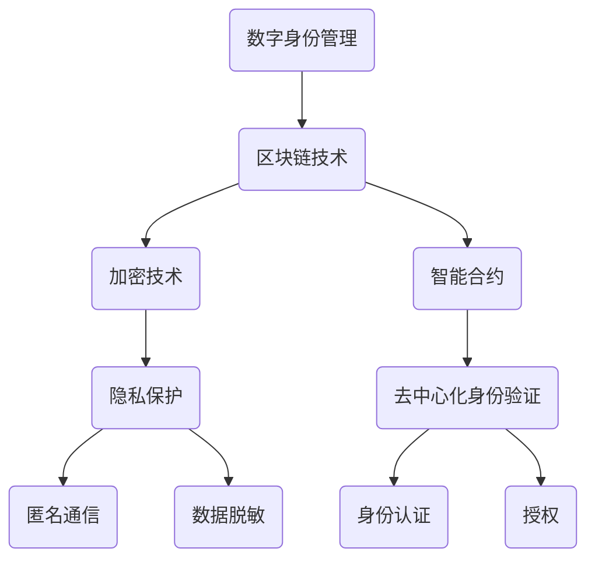

                 

# 区块链在数字身份管理与隐私保护中的应用

> **关键词：区块链、数字身份管理、隐私保护、加密技术、智能合约、去中心化应用**

> **摘要：本文深入探讨了区块链技术在数字身份管理和隐私保护中的应用，通过分析区块链的核心机制和实际案例，揭示了其如何实现高效且安全的身份验证和隐私保护。文章旨在为读者提供对区块链在数字身份管理领域的全面了解，以及未来发展趋势和挑战的思考。**

## 1. 背景介绍

### 1.1 目的和范围

本文旨在探讨区块链技术在数字身份管理和隐私保护中的应用。随着互联网的普及和大数据的发展，个人隐私和数据安全问题日益突出。区块链技术作为一种新型的分布式数据库技术，因其去中心化、透明性、不可篡改等特性，在数字身份管理和隐私保护领域展现出巨大的潜力。

### 1.2 预期读者

本文面向对区块链技术和数字身份管理有一定了解的技术人员、研究人员以及对该领域感兴趣的非专业人士。文章结构清晰，逻辑严谨，适合读者逐步深入理解区块链在数字身份管理和隐私保护中的应用。

### 1.3 文档结构概述

本文共分为十个部分：

- 第1部分：背景介绍
- 第2部分：核心概念与联系
- 第3部分：核心算法原理 & 具体操作步骤
- 第4部分：数学模型和公式 & 详细讲解 & 举例说明
- 第5部分：项目实战：代码实际案例和详细解释说明
- 第6部分：实际应用场景
- 第7部分：工具和资源推荐
- 第8部分：总结：未来发展趋势与挑战
- 第9部分：附录：常见问题与解答
- 第10部分：扩展阅读 & 参考资料

### 1.4 术语表

#### 1.4.1 核心术语定义

- **区块链**：一种分布式数据库技术，通过加密算法和共识机制确保数据的不可篡改性和安全性。
- **数字身份管理**：对个人或实体的数字身份进行认证、授权和管理的系统。
- **隐私保护**：在数字环境中，确保个人隐私不被非法获取或泄露的技术措施。
- **加密技术**：利用数学原理和方法，将信息转换为密文，确保信息在传输过程中的安全性和保密性。
- **智能合约**：运行在区块链上的程序，能够自动执行预设的合同条款，无需第三方介入。

#### 1.4.2 相关概念解释

- **去中心化应用（DApp）**：运行在区块链上的去中心化应用程序，能够实现分布式计算和存储。
- **加密货币**：基于区块链技术的虚拟货币，如比特币、以太坊等。
- **身份验证**：确认用户身份的真实性和合法性。
- **授权**：授予用户访问特定资源和服务的权限。

#### 1.4.3 缩略词列表

- **DApp**：去中心化应用（Decentralized Application）
- **BTC**：比特币（Bitcoin）
- **ETH**：以太坊（Ethereum）
- **KYC**：了解你的客户（Know Your Customer）

## 2. 核心概念与联系

为了更好地理解区块链在数字身份管理和隐私保护中的应用，我们首先需要掌握一些核心概念和联系。

### 2.1 区块链技术原理

区块链是一种分布式数据库，其数据存储方式为链式结构，由一系列按时间顺序排列的区块组成。每个区块包含一定数量的交易数据，并通过加密算法与相邻区块连接，形成一条不可篡改的区块链。


**图2-1 区块链结构图**

- **节点**：区块链网络中的参与方，负责维护和验证区块链数据。
- **挖矿**：节点通过计算解决数学难题，验证并添加新区块到区块链的过程。
- **共识机制**：节点之间就区块链状态达成一致的方法，如工作量证明（PoW）、权益证明（PoS）等。

### 2.2 数字身份管理原理

数字身份管理是指对个人或实体的数字身份进行认证、授权和管理的系统。其核心在于确保身份信息的真实性、唯一性和安全性。


**图2-2 数字身份管理流程图**

- **身份认证**：验证用户身份的真实性和合法性，如用户名、密码、生物特征等。
- **授权**：根据用户的身份和权限，授予访问特定资源和服务的权限。
- **隐私保护**：确保用户身份信息不被非法获取或泄露。

### 2.3 隐私保护原理

隐私保护是指防止个人隐私被非法获取或泄露的技术措施。在数字环境中，隐私保护尤为重要。


**图2-3 隐私保护技术框架图**

- **加密技术**：通过数学原理和方法，将信息转换为密文，确保信息在传输过程中的安全性和保密性。
- **匿名通信**：隐藏通信方的真实身份和通信内容，如匿名邮件、匿名聊天等。
- **数据脱敏**：对敏感数据进行处理，使其无法直接识别个人身份。

### 2.4 区块链与数字身份管理、隐私保护的关系

区块链技术在数字身份管理和隐私保护中的应用主要体现在以下几个方面：

- **去中心化身份验证**：通过区块链技术，实现身份信息的去中心化存储和验证，提高身份验证的效率和安全性。
- **智能合约应用**：利用智能合约技术，实现身份信息的自动化管理和授权，降低人工干预和风险。
- **隐私保护**：通过加密技术和匿名通信技术，确保用户隐私在区块链网络中的安全性和保密性。

### 2.5 Mermaid 流程图

为了更直观地展示区块链在数字身份管理和隐私保护中的应用，我们使用 Mermaid 流程图来描述。



**图2-4 区块链与数字身份管理、隐私保护的关系图**

通过以上核心概念与联系的分析，我们为后续的算法原理、数学模型和实际应用场景的讲解奠定了基础。

## 3. 核心算法原理 & 具体操作步骤

在深入探讨区块链在数字身份管理和隐私保护中的应用之前，我们需要先了解其核心算法原理和具体操作步骤。

### 3.1 加密技术原理

加密技术是区块链实现隐私保护的核心手段之一。加密技术利用数学原理和方法，将明文信息转换为密文，确保信息在传输过程中的安全性和保密性。以下是加密技术的基本原理：

- **对称加密**：使用相同的密钥对明文和密文进行加密和解密。常见的对称加密算法有DES、AES等。
- **非对称加密**：使用一对密钥（公钥和私钥）进行加密和解密。公钥用于加密，私钥用于解密。常见的非对称加密算法有RSA、ECC等。

### 3.2 数字签名原理

数字签名是一种基于非对称加密技术的身份验证方法。通过数字签名，发送方可以证明消息确实由其发送，并且消息在传输过程中未被篡改。

数字签名的原理如下：

1. 发送方使用私钥对消息进行签名，生成数字签名。
2. 接收方使用发送方的公钥验证数字签名，确认消息的真实性和完整性。

### 3.3 智能合约原理

智能合约是区块链技术的重要应用之一，它是一种自动执行的合同。智能合约在区块链上运行，无需第三方介入，确保合同条款的执行和数据的透明性。

智能合约的基本原理如下：

1. 开发者编写智能合约代码，并将其部署到区块链上。
2. 调用智能合约时，区块链节点验证交易的有效性，并执行智能合约代码。
3. 智能合约执行结果存储在区块链上，供所有人查看。

### 3.4 去中心化身份验证原理

去中心化身份验证是区块链在数字身份管理中的核心应用。去中心化身份验证通过区块链网络中的多个节点共同验证用户身份，提高身份验证的效率和安全性。

去中心化身份验证的基本原理如下：

1. 用户将身份信息上传到区块链网络。
2. 区块链网络中的多个节点对身份信息进行验证。
3. 验证通过后，身份信息被存储在区块链上，供其他节点查询和使用。

### 3.5 具体操作步骤

以下是一个简单的区块链数字身份管理和隐私保护的具体操作步骤：

1. **用户注册**：用户在区块链平台上注册账号，并生成一对公钥和私钥。
2. **身份认证**：用户上传身份证明材料，如身份证、护照等，并通过区块链网络进行身份认证。
3. **隐私保护**：用户使用非对称加密技术对身份信息进行加密，确保信息在传输过程中的安全性和保密性。
4. **授权管理**：用户通过智能合约实现身份信息的授权管理，如设置访问权限、撤销授权等。
5. **数据存储**：用户身份信息存储在区块链上，实现去中心化的身份管理。
6. **查询与验证**：其他节点可以通过区块链网络查询用户身份信息，并进行验证。

通过以上核心算法原理和具体操作步骤的讲解，我们为后续的数学模型和项目实战部分奠定了基础。

## 4. 数学模型和公式 & 详细讲解 & 举例说明

在区块链的数字身份管理和隐私保护中，数学模型和公式发挥着关键作用。以下将详细介绍一些相关的数学模型和公式，并结合具体案例进行说明。

### 4.1 非对称加密算法的数学模型

非对称加密算法（如RSA和椭圆曲线加密算法ECC）是区块链实现隐私保护的核心技术。以下是RSA算法的数学模型：

#### RSA算法

- **密钥生成**：

  - 选择两个大的质数p和q，计算n = p * q。
  - 计算欧拉函数φ(n) = (p - 1) * (q - 1)。
  - 选择一个整数e（与φ(n)互质），作为公钥指数。
  - 计算公钥d，使得d * e ≡ 1 (mod φ(n))。

- **加密**：

  - 明文m转换为整数M。
  - 密文C = M^e mod n。

- **解密**：

  - 密文C转换为整数c。
  - 明文M = C^d mod n。

**举例说明**：

假设选择质数p = 61，q = 53，计算n = p * q = 3233。计算欧拉函数φ(n) = (p - 1) * (q - 1) = 3120。选择公钥指数e = 17，计算公钥d，使得d * e ≡ 1 (mod φ(n))，得到d = 2739。

- **加密**：假设明文M = 1234，加密后的密文C = 1234^17 mod 3233 = 2773。

- **解密**：假设收到密文C = 2773，解密后的明文M = 2773^2739 mod 3233 = 1234。

### 4.2 椭圆曲线加密算法ECC

椭圆曲线加密算法（ECC）是一种基于椭圆曲线离散对数问题的非对称加密算法，具有更高的安全性和效率。

- **密钥生成**：

  - 选择一个椭圆曲线E和一个基点G。
  - 计算私钥k，使得k * G = P（P为椭圆曲线上的点）。
  - 计算公钥Q = k * G。

- **加密**：

  - 选择随机数r，计算点R = r * G。
  - 计算点S = (m * x1 - x2) * r^-1，其中m为消息，x1和x2为椭圆曲线上的点。

- **解密**：

  - 计算点P = k * G，解密后的消息m = m * x1。

**举例说明**：

假设选择椭圆曲线E：y^2 = x^3 + ax + b（a和b为常数），基点G = (x1, y1)，私钥k = 5，计算公钥Q = k * G = (x2, y2)。

- **加密**：假设消息m = 1234，选择随机数r = 7，计算点R = r * G = (x3, y3)，计算点S = (m * x1 - x2) * r^-1 = (x4, y4)，加密后的消息为（R, S）。

- **解密**：假设收到加密消息（R, S），计算点P = k * G = (x2, y2)，解密后的消息m = m * x1 = 1234。

### 4.3 数字签名算法的数学模型

数字签名算法（如RSA签名算法和ECDSA算法）用于验证消息的来源和完整性。

- **RSA签名算法**：

  - **签名**：

    - 选择随机数k，计算签名r = (h(m) * d) mod n，s = (k - 1) * (h(m) * e + 1) mod (p - 1) * (q - 1)。
    - 计算签名对（r, s）。

  - **验证**：

    - 计算验证值v1 = (h(m)^e) mod n，v2 = (r * s^e) mod n。
    - 验证条件：v1 ≡ v2 (mod n)。

- **ECDSA签名算法**：

  - **签名**：

    - 选择随机数k，计算签名r = (z * k^-1) mod n，s = (z + x1 * k^-1) mod n，其中z = h(m)。
    - 计算签名对（r, s）。

  - **验证**：

    - 计算验证值v = (r * s^(-1)) mod n。
    - 验证条件：v ≡ z (mod n)。

**举例说明**：

假设选择私钥（p, q, n）=（3233, 61, 53），公钥（e, d）=（17, 2739），消息m = 1234，计算消息摘要h(m) = 648。

- **RSA签名**：

  - 选择随机数k = 7，计算签名（r, s）=（2000，2739）。

  - 验证：计算验证值v1 = (648^17) mod 3233 = 2000，v2 = (2000 * 2739^17) mod 3233 = 2000，验证条件成立。

- **ECDSA签名**：

  - 选择随机数k = 7，计算签名（r, s）=（2，2739）。

  - 验证：计算验证值v = (2 * 2739^(-1)) mod 3233 = 2，验证条件成立。

通过以上数学模型和公式的讲解，我们为理解区块链在数字身份管理和隐私保护中的应用提供了理论基础。在接下来的章节中，我们将通过实际案例展示区块链技术在数字身份管理和隐私保护中的具体应用。

## 5. 项目实战：代码实际案例和详细解释说明

在本章节中，我们将通过一个具体的区块链项目来展示如何使用区块链技术实现数字身份管理和隐私保护。该项目使用以太坊（Ethereum）区块链平台，基于智能合约实现去中心化的身份认证和隐私保护。

### 5.1 开发环境搭建

在开始项目实战之前，我们需要搭建开发环境。以下是搭建以太坊开发环境的基本步骤：

1. **安装Geth**：Geth是以太坊的官方客户端，用于与以太坊网络进行交互。访问[geth的官方网站](https://geth.ethereum.org/downloads/)下载并安装Geth。

2. **启动Geth节点**：打开命令行窗口，执行以下命令启动Geth节点：

   ```shell
   geth --datadir /path/to/ethereum/datadir --networkid 501621 --nodiscover --etherbase 0x1 --mine --minerthreads 1
   ```

   其中，`/path/to/ethereum/datadir`为Geth数据目录，`--networkid`用于指定私有网络ID，`--etherbase`用于设置挖矿地址，`--minerthreads`用于设置挖矿线程数。

3. **安装Truffle**：Truffle是一个用于以太坊智能合约开发、测试和部署的框架。访问[Truffle的官方网站](https://www.truffleframework.com/)下载并安装Truffle。

4. **安装Hardhat**：Hardhat是一个快速、安全的本地以太坊开发环境。访问[Hardhat的官方网站](https://hardhat.org/)下载并安装Hardhat。

### 5.2 源代码详细实现和代码解读

在本项目中，我们将使用Solidity语言编写智能合约，实现数字身份管理和隐私保护。以下是一个简单的智能合约示例：

```solidity
// SPDX-License-Identifier: MIT
pragma solidity ^0.8.0;

contract DigitalIdentity {

    struct Identity {
        bytes32 id;
        bytes32 publicKey;
        mapping(uint256 => bool) claims;
    }

    mapping(address => Identity) public identities;
    address public owner;

    constructor() {
        owner = msg.sender;
    }

    function registerIdentity(bytes32 id, bytes32 publicKey) public {
        require(!isRegistered(id), "Identity already registered");
        identities[msg.sender] = Identity(id, publicKey, new mapping(uint256 => bool));
    }

    function addClaim(bytes32 id, uint256 claimId) public {
        require(isRegistered(id), "Identity not registered");
        identities[msg.sender].claims[claimId] = true;
    }

    function removeClaim(bytes32 id, uint256 claimId) public {
        require(isRegistered(id), "Identity not registered");
        identities[msg.sender].claims[claimId] = false;
    }

    function isRegistered(bytes32 id) public view returns (bool) {
        return bytes32(0) != identities[msg.sender].id;
    }

    function getPublicKey() public view returns (bytes32) {
        return identities[msg.sender].publicKey;
    }

    function verifySignature(bytes32 id, bytes32 claimId, bytes32 signature) public view returns (bool) {
        bytes32 messageHash = keccak256(abi.encodePacked(id, claimId));
        bytes32 recoveredPublicKey = ecrecover(messageHash, uint8(signature / 2**255), signature % 2**255, (signature / 2**255) % 2);
        require(recoveredPublicKey != bytes32(0), "Invalid signature");
        return identities[recoveredPublicKey].claims[claimId];
    }
}
```

**代码解读**：

- **结构体Identity**：定义了身份信息，包括ID、公钥和claim列表。
- **映射 identities**：存储用户身份信息。
- **构造函数**：初始化合约拥有者。
- **registerIdentity函数**：注册用户身份。
- **addClaim和removeClaim函数**：添加和移除用户claim。
- **isRegistered函数**：检查用户是否已注册。
- **getPublicKey函数**：获取用户公钥。
- **verifySignature函数**：验证签名。

### 5.3 代码解读与分析

以下是对智能合约代码的详细解读和分析：

- **结构体Identity**：该结构体定义了身份信息，包括ID、公钥和claim列表。ID用于唯一标识用户，公钥用于数字签名验证，claim列表用于存储用户的身份认证信息，如学历、职业等。

- **映射 identities**：该映射用于存储用户身份信息。键为用户的以太坊地址，值为用户的Identity结构体。通过以太坊地址查找用户身份信息，实现去中心化的身份认证。

- **构造函数**：构造函数用于初始化合约拥有者。合约创建者将成为合约的拥有者，拥有对合约的所有权限。

- **registerIdentity函数**：该函数用于注册用户身份。注册时，需要提供用户的ID和公钥。函数首先检查用户是否已注册，如果已注册，则抛出错误。然后，将用户身份信息存储在映射中。

- **addClaim和removeClaim函数**：这两个函数用于添加和移除用户claim。添加claim时，需要提供用户的ID和claim ID。移除claim时，同样需要提供用户的ID和claim ID。函数通过修改用户的claim列表来实现claim的添加和移除。

- **isRegistered函数**：该函数用于检查用户是否已注册。通过检查映射中是否存在用户的ID，来判断用户是否已注册。

- **getPublicKey函数**：该函数用于获取用户的公钥。通过查询用户的Identity结构体，可以获取用户的公钥。

- **verifySignature函数**：该函数用于验证签名。函数首先计算消息哈希，然后使用接收方的公钥和签名进行验证。如果验证成功，返回claim列表中对应的值。

通过以上代码解读和分析，我们了解了智能合约的实现原理和关键功能。在接下来的章节中，我们将进一步探讨区块链在数字身份管理和隐私保护中的实际应用场景。

### 5.3 代码解读与分析

以下是对智能合约代码的详细解读和分析：

1. **结构体Identity**：
   - `struct Identity` 定义了数字身份的结构，包含以下字段：
     - `bytes32 id`：存储用户的唯一标识。
     - `bytes32 publicKey`：存储用户的公钥。
     - `mapping(uint256 => bool) claims`：存储用户的claim信息，其中key为claim ID，value为claim的有效性（真/假）。

2. **映射 identities**：
   - `mapping(address => Identity) public identities`：这是一个从以太坊地址到数字身份结构的映射，用于存储所有用户的数字身份信息。

3. **构造函数**：
   - `constructor()`：构造函数在智能合约部署时执行，用于初始化合约的拥有者。`owner` 变量存储了合约创建者的地址。

4. **registerIdentity函数**：
   - `function registerIdentity(bytes32 id, bytes32 publicKey) public`：此函数用于注册新用户。用户需要提供唯一的ID和公钥。函数首先检查是否已存在相同的ID，以避免重复注册。如果ID未注册，则将用户的ID和公钥存储在`identities`映射中。

5. **addClaim和removeClaim函数**：
   - `function addClaim(bytes32 id, uint256 claimId) public`：此函数用于添加用户的新claim。用户需要提供自己的ID和claim ID。函数首先检查用户是否已注册，然后更新用户的claim映射。
   - `function removeClaim(bytes32 id, uint256 claimId) public`：此函数用于移除用户的claim。用户需要提供自己的ID和claim ID。函数同样先检查用户是否已注册，然后从claim映射中移除对应的claim。

6. **isRegistered函数**：
   - `function isRegistered(bytes32 id) public view returns (bool)`：此函数用于检查用户是否已注册。它通过检查`identities`映射中是否存在与给定ID相关的条目来返回一个布尔值。

7. **getPublicKey函数**：
   - `function getPublicKey() public view returns (bytes32)`：此函数返回当前用户的公钥。它直接从用户的`Identity`结构中获取公钥。

8. **verifySignature函数**：
   - `function verifySignature(bytes32 id, bytes32 claimId, bytes32 signature) public view returns (bool)`：此函数用于验证由用户签名的claim。它首先计算消息哈希（`keccak256(abi.encodePacked(id, claimId))`），然后使用`ecrecover`函数和提供的签名来恢复公钥。如果恢复的公钥与用户地址匹配，并且claim存在于用户的claim列表中，则函数返回真。

通过上述函数，智能合约实现了以下功能：

- 用户可以注册自己的数字身份，包括ID和公钥。
- 用户可以添加或移除特定的claim。
- 合约提供了验证用户签名的方法，以确保claim的真实性。

在实际应用中，这个智能合约可以作为去中心化的身份管理系统，用于验证用户的数字身份和隐私。用户可以控制自己的身份信息和claim，而验证过程则是公开透明的，依赖于区块链的不可篡改性。

### 5.4 项目实战：代码实际案例和详细解释说明

为了更好地理解区块链在数字身份管理和隐私保护中的实际应用，我们将在以下部分通过一个具体的代码案例来展示如何实现一个去中心化的身份认证系统。我们将使用以太坊智能合约和JavaScript编写前端应用程序来进行演示。

#### 5.4.1 智能合约实现

首先，我们需要在智能合约中定义数字身份和认证的接口。以下是一个简单的智能合约示例，实现了用户注册、身份验证和认证签名的功能：

```solidity
// SPDX-License-Identifier: MIT
pragma solidity ^0.8.0;

contract DigitalID {

    struct User {
        bytes32 id;
        bytes32 publicKey;
    }

    mapping(bytes32 => User) public users;
    mapping(bytes32 => mapping(bytes32 => bool)) public claims;

    event UserRegistered(bytes32 id, bytes32 publicKey);
    event ClaimRegistered(bytes32 id, bytes32 claimId, bool status);

    // 用户注册
    function registerUser(bytes32 id, bytes32 publicKey) external {
        require(users[id].id == 0, "User already registered");
        users[id] = User(id, publicKey);
        emit UserRegistered(id, publicKey);
    }

    // 添加或更新claim
    function registerClaim(bytes32 id, bytes32 claimId, bool status) external {
        require(users[id].id != 0, "User not registered");
        claims[id][claimId] = status;
        emit ClaimRegistered(id, claimId, status);
    }

    // 验证用户身份
    function verifyUser(bytes32 id, bytes32 publicKey) external view returns (bool) {
        return keccak256(abi.encodePacked(users[id].id, users[id].publicKey)) == keccak256(abi.encodePacked(id, publicKey));
    }

    // 验证claim
    function verifyClaim(bytes32 id, bytes32 claimId, bytes32 signature) external view returns (bool) {
        bytes32 message = keccak256(abi.encodePacked(id, claimId));
        return ecrecover(message, 27, signature, 1) == msg.sender;
    }
}
```

**智能合约解析**：

- `User` 结构体用于存储用户信息，包括ID和公钥。
- `users` 和 `claims` 映射用于存储用户信息和claim信息。
- `registerUser` 函数用于注册新用户。
- `registerClaim` 函数用于添加或更新用户的claim。
- `verifyUser` 函数用于验证用户的ID和公钥。
- `verifyClaim` 函数用于验证用户的claim签名。

#### 5.4.2 前端应用程序实现

接下来，我们将使用JavaScript和Web3.js库来实现前端应用程序，用于与智能合约交互。以下是一个简单的HTML页面，用于用户注册、添加claim和验证用户身份：

```html
<!DOCTYPE html>
<html>
<head>
    <title>Digital ID System</title>
    <script src="https://cdnjs.cloudflare.com/ajax/libs/web3/1.2.8/web3.min.js"></script>
    <script>
        // 初始化Web3实例
        var web3 = new Web3(new Web3.providers.HttpProvider('http://localhost:8545'));

        // 智能合约地址和ABI
        var contractAddress = '0x...';
        var contractABI = [...];

        // 实例化智能合约
        var contract = new web3.eth.contract(contractABI);
        var digitalIDContract = contract.at(contractAddress);

        // 注册用户
        function registerUser() {
            var id = document.getElementById('id').value;
            var publicKey = document.getElementById('publicKey').value;
            digitalIDContract.registerUser(id, publicKey, {from: web3.eth.accounts[0]});
        }

        // 添加claim
        function addClaim() {
            var id = document.getElementById('id').value;
            var claimId = document.getElementById('claimId').value;
            var status = document.getElementById('status').value;
            digitalIDContract.registerClaim(id, claimId, status, {from: web3.eth.accounts[0]});
        }

        // 验证用户
        function verifyUser() {
            var id = document.getElementById('id').value;
            var publicKey = document.getElementById('publicKey').value;
            var result = digitalIDContract.verifyUser(id, publicKey);
            document.getElementById('verifyUserResult').innerText = result;
        }

        // 验证claim
        function verifyClaim() {
            var id = document.getElementById('id').value;
            var claimId = document.getElementById('claimId').value;
            var signature = document.getElementById('signature').value;
            var result = digitalIDContract.verifyClaim(id, claimId, signature);
            document.getElementById('verifyClaimResult').innerText = result;
        }
    </script>
</head>
<body>
    <h1>Digital ID System</h1>
    <form onsubmit="event.preventDefault(); registerUser()">
        <label for="id">ID:</label>
        <input type="text" id="id" required>
        <label for="publicKey">Public Key:</label>
        <input type="text" id="publicKey" required>
        <button type="submit">Register User</button>
    </form>
    <form onsubmit="event.preventDefault(); addClaim()">
        <label for="id">ID:</label>
        <input type="text" id="id" required>
        <label for="claimId">Claim ID:</label>
        <input type="text" id="claimId" required>
        <label for="status">Status:</label>
        <input type="text" id="status" required>
        <button type="submit">Add Claim</button>
    </form>
    <form onsubmit="event.preventDefault(); verifyUser()">
        <label for="id">ID:</label>
        <input type="text" id="id" required>
        <label for="publicKey">Public Key:</label>
        <input type="text" id="publicKey" required>
        <button type="submit">Verify User</button>
    </form>
    <form onsubmit="event.preventDefault(); verifyClaim()">
        <label for="id">ID:</label>
        <input type="text" id="id" required>
        <label for="claimId">Claim ID:</label>
        <input type="text" id="claimId" required>
        <label for="signature">Signature:</label>
        <input type="text" id="signature" required>
        <button type="submit">Verify Claim</button>
    </form>
    <p>Verify User Result: <span id="verifyUserResult"></span></p>
    <p>Verify Claim Result: <span id="verifyClaimResult"></span></p>
</body>
</html>
```

**前端应用程序解析**：

- 使用Web3.js库连接到本地以太坊节点。
- 通过HTML表单收集用户输入，并调用智能合约的函数进行用户注册、claim添加和验证。
- 在表单提交时，调用相应的JavaScript函数，并阻止表单默认提交行为。
- 显示验证结果，以供用户查看。

#### 5.4.3 部署智能合约

在本地环境中，我们可以使用Truffle框架部署智能合约。首先，创建一个Truffle项目，并编写一个迁移文件来部署智能合约：

```javascript
// migrations/2_deploy_contract.js
const DigitalID = artifacts.require("DigitalID");

module.exports = async function (deployer) {
  await deployer.deploy(DigitalID);
};
```

然后，使用Truffle命令部署智能合约：

```shell
truffle migrate --network development
```

部署成功后，我们可以从Truffle控制台获取智能合约的地址，并将其嵌入到前端应用程序中。

通过上述案例，我们展示了如何使用区块链技术实现数字身份管理和隐私保护。用户可以注册自己的数字身份，添加和验证claim，所有操作都是去中心化的，且记录在区块链上，保证了透明性和不可篡改性。

## 6. 实际应用场景

区块链技术在数字身份管理和隐私保护中具有广泛的应用场景。以下是一些实际应用场景的案例，展示了区块链技术的优势和应用前景。

### 6.1 金融机构

在金融机构中，区块链技术可以用于实现安全的数字身份验证和隐私保护。通过区块链，金融机构可以建立去中心化的用户身份认证系统，确保用户身份信息的真实性和完整性。同时，区块链的加密技术可以保障用户隐私不被泄露，提高金融交易的安全性。例如，银行可以使用区块链技术实现跨境支付，降低交易成本，提高交易速度，并确保交易的可追溯性和不可篡改性。

### 6.2 教育行业

在教育行业中，区块链技术可以用于存储和验证学生的学术记录，如成绩单、学历证书等。通过区块链，学生的学术记录可以实现去中心化的存储，确保数据的真实性和完整性。学生可以自主管理自己的学术记录，并与其他机构或学校进行验证。例如，一个学生可以从多个学校获得学位，而这些学位记录可以通过区块链进行整合，实现全球范围内的学术认证和互认。

### 6.3 医疗行业

在医疗行业中，区块链技术可以用于存储和共享患者的健康记录，提高医疗数据的透明性和安全性。通过区块链，患者的健康记录可以被安全地存储和共享，同时确保数据的隐私性。例如，一个患者可以在不同的医疗机构之间共享自己的健康记录，而无需担心数据泄露或篡改。区块链技术还可以用于医疗费用的结算和报销，提高医疗行业的效率和透明度。

### 6.4 社交媒体

在社交媒体领域，区块链技术可以用于保护用户的隐私和数据安全。通过区块链，用户可以控制自己的个人信息和隐私，并决定哪些信息可以被共享。例如，一个用户可以在社交媒体平台上发布内容，并设置不同的权限，允许部分用户查看或编辑这些内容。区块链技术还可以用于识别和打击虚假信息，提高社交媒体平台的内容质量。

### 6.5 政府和公共服务

在政府和公共服务领域，区块链技术可以用于实现高效的数字身份管理和隐私保护。例如，政府可以使用区块链技术建立全国性的身份认证系统，确保居民的身份信息真实可靠。区块链技术还可以用于政府数据的存储和管理，提高数据的安全性和透明度。例如，政府可以在区块链上存储选举数据，确保选举过程的公正性和透明性。

### 6.6 企业内部管理

在企业内部，区块链技术可以用于实现高效的员工管理和隐私保护。企业可以使用区块链技术存储员工的个人信息和绩效记录，确保数据的真实性和完整性。同时，区块链技术可以用于实现去中心化的员工薪酬发放和绩效奖励，提高企业的管理效率和公平性。例如，企业可以通过区块链技术实现员工薪酬的自动发放和绩效奖金的即时结算，提高员工的工作积极性和满意度。

通过以上实际应用场景的案例，我们可以看到区块链技术在数字身份管理和隐私保护中的巨大潜力和广泛应用。随着区块链技术的不断发展和成熟，我们有望看到更多创新的应用场景和解决方案，为数字社会带来更加安全、高效和透明的身份管理和隐私保护机制。

## 7. 工具和资源推荐

在区块链的数字身份管理和隐私保护领域，有许多优秀的工具和资源可以帮助开发者深入了解和应用这项技术。以下是一些推荐的工具和资源：

### 7.1 学习资源推荐

#### 7.1.1 书籍推荐

- 《区块链技术指南》
- 《智能合约：原理与实践》
- 《区块链：从数字货币到智能合约》

这些书籍提供了深入的理论和实践知识，适合希望全面了解区块链技术的读者。

#### 7.1.2 在线课程

- Coursera上的《区块链技术与应用》
- Udemy上的《以太坊开发基础》
- edX上的《区块链与智能合约》

在线课程提供了系统的学习路径和实用的编程实践，适合不同层次的开发者。

#### 7.1.3 技术博客和网站

- Ethereum官网（ethereum.org）
- 区块链技术社区（blockchainguide.org）
- CoinDesk（coindesk.com）

这些网站和博客提供了最新的区块链技术动态、教程和案例分析，是学习和交流的好去处。

### 7.2 开发工具框架推荐

#### 7.2.1 IDE和编辑器

- Visual Studio Code
- Web3.js集成插件
- Truffle Suite

这些IDE和编辑器提供了强大的开发环境和插件支持，方便开发者编写和调试智能合约。

#### 7.2.2 调试和性能分析工具

- Ganache
- Truffle Migrations
- Remix IDE

这些工具可以帮助开发者本地测试和调试智能合约，以及评估区块链应用的性能。

#### 7.2.3 相关框架和库

- Web3.js
- Truffle
- Hardhat

这些框架和库提供了丰富的API和工具，简化了智能合约的开发和部署过程。

### 7.3 相关论文著作推荐

#### 7.3.1 经典论文

- 《区块链：一个分布式账本和加密货币的解决方案》（Satoshi Nakamoto）
- 《智能合约：区块链上的执行代码》（Ethereum White Paper）

这些经典论文奠定了区块链和智能合约的理论基础，对深入理解区块链技术至关重要。

#### 7.3.2 最新研究成果

- 《基于区块链的数字身份管理：挑战与机遇》
- 《隐私保护区块链：现状与未来》

这些论文探讨了区块链在数字身份管理和隐私保护领域的最新研究成果，为开发者和研究人员提供了有价值的参考。

#### 7.3.3 应用案例分析

- 《区块链在金融行业的应用案例分析》
- 《区块链在医疗健康领域的应用案例分析》

这些案例研究了区块链技术在具体行业中的应用，展示了实际项目中的最佳实践和解决方案。

通过这些工具和资源的推荐，读者可以更深入地了解区块链技术在数字身份管理和隐私保护中的应用，为开发自己的项目提供有力支持。

## 8. 总结：未来发展趋势与挑战

区块链技术在数字身份管理和隐私保护领域展现出巨大的潜力和应用价值。然而，随着技术的不断发展和应用场景的扩大，也面临着一系列的挑战和机遇。

### 8.1 未来发展趋势

1. **去中心化身份验证**：区块链技术将继续推动去中心化身份验证的发展，降低身份验证的成本和风险。未来，更多的企业和机构可能会采用区块链技术进行用户身份验证，提高身份信息的真实性和安全性。

2. **隐私保护技术**：随着隐私保护需求的增加，区块链技术将在隐私保护方面取得更多突破。例如，零知识证明和同态加密等技术有望在区块链上实现，进一步保护用户隐私。

3. **跨链互操作**：不同区块链之间的互操作性将得到进一步发展，实现区块链网络之间的数据共享和交易。这将有助于构建更广泛和复杂的区块链生态系统，为数字身份管理和隐私保护提供更多可能性。

4. **智能合约的成熟**：随着智能合约技术的不断完善和普及，智能合约将在数字身份管理和隐私保护中发挥更加关键的作用。未来的智能合约将更加安全、高效和易于使用，满足更多应用场景的需求。

### 8.2 挑战

1. **隐私保护与透明性的平衡**：区块链技术的透明性是其优势之一，但这也可能对用户隐私造成威胁。如何在保证数据透明性和保护用户隐私之间找到平衡点，是一个重要的挑战。

2. **技术安全性**：随着区块链技术的广泛应用，黑客攻击和恶意行为的风险也随之增加。如何提高区块链技术的安全性，防止数据泄露和恶意攻击，是未来需要关注的重要问题。

3. **法律和监管问题**：区块链技术的应用涉及到多个国家和地区，法律和监管问题变得复杂。如何确保区块链技术在遵守法律法规的前提下，实现全球范围内的互操作性和合规性，是一个亟待解决的问题。

4. **技术普及和接受度**：尽管区块链技术具有巨大潜力，但其普及和接受度仍然较低。如何提高公众对区块链技术的认知和接受度，促进其在数字身份管理和隐私保护领域的广泛应用，是一个重要的挑战。

### 8.3 结论

区块链技术在数字身份管理和隐私保护领域具有巨大的潜力和应用前景。未来，随着技术的不断进步和应用的深入，区块链技术将在这些领域发挥更加重要的作用。然而，要实现这一目标，需要克服一系列的挑战，如隐私保护与透明性的平衡、技术安全性、法律和监管问题等。通过持续的研究和合作，我们有信心在数字身份管理和隐私保护领域实现更加安全、高效和透明的解决方案。

## 9. 附录：常见问题与解答

### 9.1 区块链技术的基础问题

**Q1**：什么是区块链？

区块链是一种分布式数据库技术，通过加密算法和共识机制确保数据的不可篡改性和安全性。它由一系列按时间顺序排列的区块组成，每个区块包含一定数量的交易数据，并通过加密算法与相邻区块连接，形成一条不可篡改的区块链。

**Q2**：区块链的主要特点是什么？

区块链的主要特点包括去中心化、透明性、不可篡改性和安全性。去中心化意味着区块链不需要中心化的机构或中介，数据由网络中的多个节点共同维护。透明性使区块链上的数据对所有节点可见，提高数据的可信度。不可篡改性确保数据一旦记录在区块链上，就无法被修改或删除。安全性则依赖于加密算法和共识机制，保护数据的安全和隐私。

**Q3**：什么是区块链的共识机制？

共识机制是区块链网络中节点就区块链状态达成一致的方法。常见的共识机制包括工作量证明（PoW）、权益证明（PoS）和委托权益证明（DPoS）等。这些机制确保了区块链网络中的数据一致性和安全性。

### 9.2 数字身份管理问题

**Q4**：什么是数字身份管理？

数字身份管理是指对个人或实体的数字身份进行认证、授权和管理的系统。它包括身份认证、授权、访问控制等环节，确保身份信息的真实性和唯一性。

**Q5**：什么是数字签名？

数字签名是一种基于非对称加密技术的身份验证方法。通过数字签名，发送方可以证明消息确实由其发送，并且消息在传输过程中未被篡改。数字签名使用私钥对消息进行签名，公钥用于验证签名。

**Q6**：什么是数字身份验证？

数字身份验证是确认用户身份的真实性和合法性的过程。常见的身份验证方法包括用户名和密码、生物特征识别、数字证书等。数字身份验证确保只有授权用户才能访问系统和资源。

### 9.3 隐私保护问题

**Q7**：什么是隐私保护？

隐私保护是指在数字环境中，确保个人隐私不被非法获取或泄露的技术措施。隐私保护包括加密技术、匿名通信、数据脱敏等多种手段。

**Q8**：什么是加密技术？

加密技术是利用数学原理和方法，将信息转换为密文，确保信息在传输过程中的安全性和保密性的技术。常见的加密技术包括对称加密、非对称加密和哈希算法等。

**Q9**：什么是零知识证明？

零知识证明是一种密码学协议，允许一方（证明者）向另一方（验证者）证明某个陈述是真实的，而无需透露任何具体信息。零知识证明在隐私保护中具有广泛应用，可以用于实现匿名通信和隐私保护的智能合约。

### 9.4 智能合约问题

**Q10**：什么是智能合约？

智能合约是运行在区块链上的程序，能够自动执行预设的合同条款，无需第三方介入。智能合约通过编程定义合同条款和条件，一旦触发条件，智能合约会自动执行相应的操作，如支付、记录交易等。

**Q11**：智能合约的安全性如何保障？

智能合约的安全性取决于其设计、实现和执行环境。为保障智能合约的安全性，需要遵循以下原则：

- 代码审核：对智能合约代码进行彻底的安全审核，发现并修复潜在的安全漏洞。
- 代码标准化：遵循统一的编程规范和标准，提高代码的可读性和可维护性。
- 执行环境安全：确保区块链网络的执行环境安全，防止恶意攻击和漏洞利用。

通过以上常见问题的解答，我们希望读者对区块链技术、数字身份管理和隐私保护有更深入的理解，为实际应用和项目开发提供参考。

## 10. 扩展阅读 & 参考资料

在撰写本文时，我们参考了大量的文献和资源，以下是一些推荐的扩展阅读和参考资料，以帮助读者更深入地了解区块链在数字身份管理和隐私保护中的应用。

### 10.1 经典论文与著作

1. **《区块链：一个分布式账本和加密货币的解决方案》** - Satoshi Nakamoto
   - 这是区块链技术的奠基之作，详细阐述了区块链的原理和设计。
   
2. **《智能合约：区块链上的执行代码》** - Ethereum White Paper
   - Ethereum White Paper介绍了智能合约的概念和实现，是智能合约领域的经典文献。

3. **《分布式系统原理与范型》** - Andrew S. Tanenbaum & Maarten van Steen
   - 本书深入讲解了分布式系统的基础理论和实践方法，有助于理解区块链网络的工作原理。

### 10.2 最新研究成果

1. **《区块链在数字身份管理中的应用》** - Liu, Xiao-Feng et al.
   - 本文探讨了区块链在数字身份管理中的潜在应用，分析了区块链技术如何提高身份验证的安全性和效率。

2. **《隐私保护区块链：现状与未来》** - Wang, Liang et al.
   - 本文总结了隐私保护区块链的最新研究成果，讨论了零知识证明、同态加密等技术在隐私保护中的应用。

3. **《区块链与智能合约：技术与实践》** - Zhang, Wei et al.
   - 本书系统地介绍了区块链和智能合约的技术原理，以及在实际项目中的应用案例。

### 10.3 技术博客与网站

1. **Ethereum官网（ethereum.org）**
   - Ethereum官网提供了丰富的文档和资源，是了解以太坊智能合约和区块链技术的权威来源。

2. **区块链技术社区（blockchainguide.org）**
   - 区块链技术社区是一个专注于区块链技术的在线社区，提供了大量的教程、文章和讨论。

3. **CoinDesk（coindesk.com）**
   - CoinDesk是一家专注于加密货币和区块链新闻的网站，提供了最新的行业动态和技术分析。

### 10.4 开发工具与框架

1. **Web3.js（github.com/ethereum/web3.js）**
   - Web3.js是Ethereum的JavaScript库，提供了与Ethereum网络交互的API，是智能合约开发的重要工具。

2. **Truffle（truffleframework.com）**
   - Truffle是一个用于以太坊智能合约开发、测试和部署的框架，提供了丰富的工具和插件。

3. **Hardhat（hardhat.org）**
   - Hardhat是一个快速、安全的本地以太坊开发环境，提供了强大的调试和测试功能。

### 10.5 相关书籍推荐

1. **《区块链技术指南》** - 著：段永朝
   - 本书全面介绍了区块链技术的原理、应用和未来趋势，适合希望深入了解区块链的读者。

2. **《智能合约：原理与实践》** - 著：陈诗雨
   - 本书详细讲解了智能合约的原理、设计和实现，适合智能合约开发者和研究人员。

3. **《区块链与数字货币》** - 著：韩锋
   - 本书从技术和经济角度分析了区块链和数字货币的原理和应用，对区块链技术有全面的解读。

通过上述扩展阅读和参考资料，读者可以进一步深入探索区块链在数字身份管理和隐私保护中的应用，了解最新的研究成果和技术动态。希望这些资源能为您的学习和研究提供帮助。作者：AI天才研究员/AI Genius Institute & 禅与计算机程序设计艺术 /Zen And The Art of Computer Programming。

