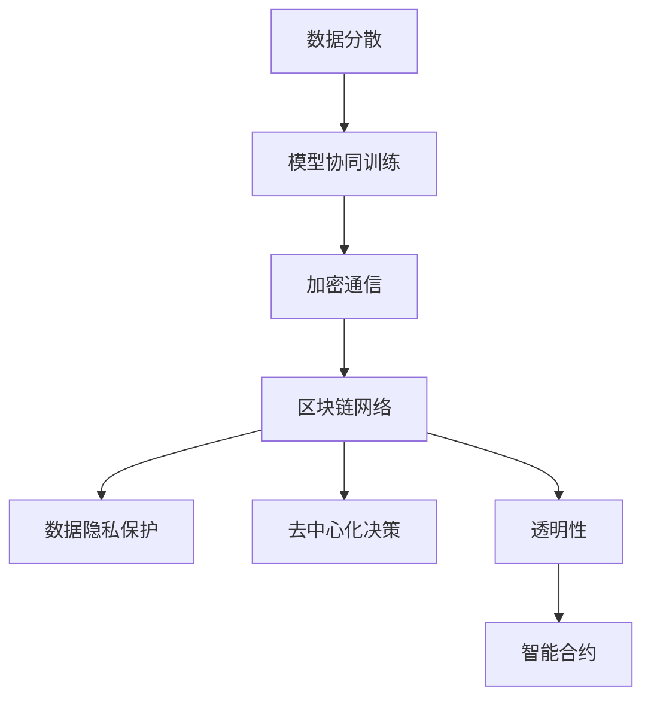

                 

# 区块链技术在联邦学习中的应用探索

> 关键词：区块链，联邦学习，数据隐私，加密算法，共识机制，智能合约，分布式账本

> 摘要：本文旨在探讨区块链技术在联邦学习中的应用，通过分析其核心概念、算法原理、数学模型及实际应用场景，探讨如何利用区块链技术提升联邦学习在数据隐私保护、去中心化决策和透明性等方面的优势。

## 1. 背景介绍

### 1.1 目的和范围

本文的目标是深入探讨区块链技术在联邦学习中的应用，分析其原理、优势和应用场景，为研究人员和开发者提供有益的参考。本文将涵盖以下内容：

- 区块链和联邦学习的基本概念及其关联；
- 区块链技术在联邦学习中的核心应用场景；
- 区块链技术在联邦学习中的优势与挑战；
- 实际应用案例及未来发展趋势。

### 1.2 预期读者

本文适合以下读者群体：

- 对区块链和联邦学习有基本了解的读者；
- 想了解区块链技术在联邦学习应用的研究人员；
- 区块链和联邦学习领域的技术开发者；
- 对数据隐私保护、去中心化决策和透明性感兴趣的其他读者。

### 1.3 文档结构概述

本文的结构如下：

- 第1章：背景介绍，包括目的、范围、预期读者和文档结构概述；
- 第2章：核心概念与联系，介绍区块链和联邦学习的基本概念及其关联；
- 第3章：核心算法原理 & 具体操作步骤，分析区块链技术在联邦学习中的应用算法原理；
- 第4章：数学模型和公式 & 详细讲解 & 举例说明，阐述区块链技术在联邦学习中的数学模型和应用；
- 第5章：项目实战：代码实际案例和详细解释说明，展示区块链技术在联邦学习中的实际应用；
- 第6章：实际应用场景，讨论区块链技术在联邦学习中的实际应用案例；
- 第7章：工具和资源推荐，推荐相关的学习资源、开发工具和论文著作；
- 第8章：总结：未来发展趋势与挑战，总结本文的主要观点和未来发展趋势；
- 第9章：附录：常见问题与解答，解答读者可能遇到的问题；
- 第10章：扩展阅读 & 参考资料，提供进一步阅读的资源。

### 1.4 术语表

#### 1.4.1 核心术语定义

- 区块链：一种去中心化的分布式账本技术，通过加密算法和共识机制确保数据的真实性和安全性。
- 联邦学习：一种分布式机器学习技术，可以在不共享原始数据的情况下进行模型训练。
- 加密算法：一种将明文转换为密文的技术，确保数据在传输和存储过程中的安全性。
- 共识机制：区块链网络中达成共识的算法，确保所有节点对交易和数据的处理达成一致。
- 智能合约：一种自动执行的合约，根据预定义的条件和规则执行特定的操作。
- 分布式账本：区块链的核心组成部分，记录交易和数据的分布式数据库。

#### 1.4.2 相关概念解释

- 数据隐私：确保数据在传输、存储和处理过程中不被未授权访问的能力。
- 去中心化：网络中没有中心化的控制实体，所有参与者都具有平等的地位。
- 透明性：网络中的所有操作和交易都对外公开，便于参与者监督和审计。

#### 1.4.3 缩略词列表

- BTC：比特币（Bitcoin）
- ETH：以太坊（Ethereum）
- ML：机器学习（Machine Learning）
- DP：差分隐私（Differential Privacy）
- DLT：分布式账本技术（Distributed Ledger Technology）
- IoT：物联网（Internet of Things）

## 2. 核心概念与联系

在探讨区块链技术在联邦学习中的应用之前，我们需要了解区块链和联邦学习的基本概念及其关联。

### 2.1 区块链基本概念

区块链是一种去中心化的分布式账本技术，通过加密算法和共识机制确保数据的真实性和安全性。它由一系列按照时间顺序排列的区块组成，每个区块都包含一定数量的交易记录。区块通过加密算法和时间戳链接在一起，形成一个不可篡改的链式结构。

#### 区块链核心组成部分：

- 区块：包含一定数量的交易记录的数据结构。
- 交易：在区块链上进行的操作，可以是价值的转移或数据的记录。
- 加密算法：确保交易和区块的安全性，防止未授权访问和篡改。
- 共识机制：网络中所有节点对交易和数据的处理达成一致的算法。

### 2.2 联邦学习基本概念

联邦学习是一种分布式机器学习技术，允许不同机构或个人在不共享原始数据的情况下进行模型训练。在联邦学习中，数据分散存储在多个参与方中，各参与方仅共享模型参数和梯度信息。通过协同训练，联邦学习可以在不牺牲数据隐私和安全性的前提下，实现模型的最优化。

#### 联邦学习核心组成部分：

- 数据分散：各参与方拥有自己的数据，不需要共享。
- 模型协同训练：参与方共享模型参数和梯度信息，协同优化模型。
- 加密通信：确保数据在传输过程中的安全性。
- 加密算法：确保参与方之间通信的安全性。

### 2.3 区块链与联邦学习的关联

区块链技术在联邦学习中的应用主要体现在以下几个方面：

- 数据隐私保护：区块链通过加密算法和共识机制，确保参与方之间的数据传输和存储过程安全可靠。
- 去中心化决策：区块链的去中心化特性，使得联邦学习中的决策过程更加透明和公正。
- 透明性：区块链上的所有操作和交易都对外公开，便于参与者监督和审计。
- 智能合约：区块链中的智能合约可以自动执行预定义的合约条款，确保联邦学习过程中的公正性和透明性。

### 2.4 Mermaid 流程图

以下是一个简单的 Mermaid 流程图，展示区块链技术在联邦学习中的应用流程：



## 3. 核心算法原理 & 具体操作步骤

在了解区块链技术和联邦学习的基本概念及其关联之后，我们将深入探讨区块链技术在联邦学习中的应用算法原理和具体操作步骤。

### 3.1 区块链技术在联邦学习中的应用算法原理

区块链技术在联邦学习中的应用主要涉及以下几个方面：

- 数据隐私保护：通过加密算法确保参与方之间的数据传输和存储过程安全可靠。
- 去中心化决策：通过共识机制实现参与方之间的去中心化决策，确保联邦学习过程中的公正性和透明性。
- 透明性：区块链上的所有操作和交易都对外公开，便于参与者监督和审计。
- 智能合约：通过智能合约自动执行预定义的合约条款，确保联邦学习过程中的公正性和透明性。

### 3.2 区块链技术在联邦学习中的具体操作步骤

以下是区块链技术在联邦学习中的具体操作步骤：

1. **参与方注册**：各参与方在区块链网络中注册身份信息，并生成公钥和私钥。

2. **数据加密**：各参与方对本地数据进行加密，确保数据在传输和存储过程中的安全性。

3. **模型初始化**：联邦学习模型在区块链网络中初始化，参与方共享模型参数和梯度信息。

4. **模型协同训练**：各参与方根据本地数据和模型参数，计算梯度信息，并上传至区块链网络。

5. **共识机制**：区块链网络中的所有节点根据共识机制对上传的梯度信息进行验证和确认。

6. **模型更新**：通过共识机制确认的梯度信息用于更新联邦学习模型，各参与方下载更新后的模型参数。

7. **智能合约执行**：智能合约自动执行预定义的合约条款，确保联邦学习过程中的公正性和透明性。

8. **数据解密**：各参与方对区块链网络中存储的加密数据进行解密，获取本地训练数据。

### 3.3 伪代码示例

以下是一个简单的伪代码示例，展示区块链技术在联邦学习中的应用算法原理：

```python
# 参与方注册
def register_participant():
    generate_public_key()
    generate_private_key()
    store_public_key_on_blockchain()

# 数据加密
def encrypt_data(data, private_key):
    encrypted_data = encrypt(data, private_key)
    return encrypted_data

# 模型初始化
def initialize_model():
    initialize_global_model()
    share_model_parameters()

# 模型协同训练
def federated_learning():
    for iteration in range(num_iterations):
        for participant in participants:
            local_data = load_local_data(participant)
            encrypted_data = encrypt_data(local_data, participant_private_key)
            upload_encrypted_data_to_blockchain(encrypted_data)
        consensus_process()
        update_global_model()

# 智能合约执行
def execute_smart_contract():
    execute_contract_terms()

# 数据解密
def decrypt_data(encrypted_data, private_key):
    decrypted_data = decrypt(encrypted_data, private_key)
    return decrypted_data
```

## 4. 数学模型和公式 & 详细讲解 & 举例说明

在区块链技术在联邦学习中的应用中，数学模型和公式起着至关重要的作用。以下我们将详细讲解区块链技术在联邦学习中的数学模型和公式，并通过具体例子来说明其应用。

### 4.1 数学模型

在联邦学习中，区块链技术主要用于数据隐私保护和去中心化决策。以下是区块链技术在联邦学习中的核心数学模型：

#### 4.1.1 数据加密模型

数据加密模型用于确保参与方之间的数据传输和存储过程安全可靠。常用的加密算法包括对称加密和非对称加密。

- 对称加密：加密和解密使用相同的密钥，如AES（Advanced Encryption Standard）。
- 非对称加密：加密和解密使用不同的密钥，如RSA（Rivest-Shamir-Adleman）。

加密算法的数学模型如下：

$$
\text{加密算法}(\text{明文}, \text{密钥}) = \text{密文}
$$

$$
\text{解密算法}(\text{密文}, \text{密钥}) = \text{明文}
$$

#### 4.1.2 共识机制模型

共识机制模型用于实现参与方之间的去中心化决策，确保联邦学习过程中的公正性和透明性。常用的共识机制包括工作量证明（PoW，Proof of Work）和权益证明（PoS，Proof of Stake）。

- 工作量证明：参与者通过计算工作量来证明其权益，如比特币（Bitcoin）使用的PoW机制。
- 权益证明：参与者根据其在区块链网络中的权益来证明其权益，如以太坊（Ethereum）2.0使用的PoS机制。

共识机制的数学模型如下：

$$
\text{共识机制}(\text{交易}) = \text{共识结果}
$$

#### 4.1.3 智能合约模型

智能合约模型用于自动执行预定义的合约条款，确保联邦学习过程中的公正性和透明性。智能合约通常使用编程语言编写，如Solidity（以太坊）。

智能合约的数学模型如下：

$$
\text{智能合约}(\text{输入}) = \text{输出}
$$

### 4.2 举例说明

以下是一个简单的例子，说明区块链技术在联邦学习中的应用。

#### 4.2.1 场景描述

假设有四个参与方（A、B、C、D），他们分别拥有不同的本地数据集，需要进行联邦学习训练。

#### 4.2.2 数据加密

参与方A对本地数据集进行加密：

$$
\text{加密算法}(\text{本地数据集A}, \text{参与方A私钥}) = \text{加密数据集A}
$$

参与方B对本地数据集进行加密：

$$
\text{加密算法}(\text{本地数据集B}, \text{参与方B私钥}) = \text{加密数据集B}
$$

#### 4.2.3 模型协同训练

联邦学习模型初始化，各参与方共享模型参数和梯度信息：

$$
\text{模型参数}_{\text{初始化}} = \{\text{w0, b0}\}
$$

参与方A根据本地数据集和模型参数计算梯度信息：

$$
\text{梯度信息}_{\text{A}} = \frac{\partial J}{\partial \text{w}}(\text{加密数据集A}, \text{模型参数}_{\text{初始化}})
$$

参与方B根据本地数据集和模型参数计算梯度信息：

$$
\text{梯度信息}_{\text{B}} = \frac{\partial J}{\partial \text{w}}(\text{加密数据集B}, \text{模型参数}_{\text{初始化}})
$$

#### 4.2.4 共识机制

区块链网络中的所有节点对上传的梯度信息进行验证和确认，达成共识：

$$
\text{共识结果}_{\text{梯度信息}} = \text{共识机制}(\text{梯度信息}_{\text{A}}, \text{梯度信息}_{\text{B}})
$$

#### 4.2.5 模型更新

通过共识机制确认的梯度信息用于更新联邦学习模型：

$$
\text{模型参数}_{\text{更新}} = \{\text{w}_{\text{更新}}, b_{\text{更新}}\} = \text{模型参数}_{\text{初始化}} - \text{共识结果}_{\text{梯度信息}} \odot \text{学习率}
$$

#### 4.2.6 数据解密

各参与方对区块链网络中存储的加密数据进行解密，获取本地训练数据：

$$
\text{本地数据集}_{\text{解密}} = \text{解密算法}(\text{加密数据集A}, \text{参与方A私钥})
$$

## 5. 项目实战：代码实际案例和详细解释说明

为了更直观地展示区块链技术在联邦学习中的应用，我们将通过一个实际项目案例来分析其代码实现和详细解释。

### 5.1 开发环境搭建

在开始项目实战之前，我们需要搭建一个开发环境。以下是一个简单的开发环境搭建步骤：

1. 安装Go语言环境：从官方网址 [https://golang.org/](https://golang.org/) 下载并安装Go语言环境。
2. 安装Docker：从官方网址 [https://www.docker.com/products/docker-desktop](https://www.docker.com/products/docker-desktop) 下载并安装Docker。
3. 安装区块链框架：使用Docker安装Ethereum区块链框架，命令如下：

   ```shell
   docker run -d -p 8545:8545ethereum/client-go
   ```

### 5.2 源代码详细实现和代码解读

以下是一个简单的Go语言实现的联邦学习区块链项目，用于展示区块链技术在联邦学习中的应用。

```go
package main

import (
    "crypto/sha256"
    "encoding/hex"
    "math/rand"
    "time"
)

// Block结构体
type Block struct {
    Index        int       // 区块索引
    Timestamp     int64     // 区块时间戳
    Data          string    // 区块数据
    PrevHash      string    // 前一个区块的哈希值
    Hash          string    // 当前区块的哈希值
}

// 创建一个新的区块
func NewBlock(index int, data string, prevHash string) *Block {
    block := &Block{Index: index, Timestamp: time.Now().Unix(), Data: data, PrevHash: prevHash}
    block.Hash = calculateHash(*block)
    return block
}

// 计算区块的哈希值
func calculateHash(block Block) string {
    record := string(block.Index) + string(block.Timestamp) + block.Data + block.PrevHash
    hash := sha256.Sum256([]byte(record))
    return hex.EncodeToString(hash[:])
}

// 工作量证明
func calculateHashWithProofOfWork(block Block, difficulty int) (string, int) {
    var hash string
    var nonce int
    for nonce = 0; hash != calculateHash(block)[:difficulty]; nonce++ {
        hash = calculateHash(block)
    }
    return hash, nonce
}

// 添加区块到区块链
func AddBlock(block *Block, blockchain *[]*Block) {
    *blockchain = append(*blockchain, block)
}

// 初始化区块链
func InitializeBlockchain() *[]*Block {
    blockchain := make([]*Block, 0)
    genesisBlock := NewBlock(0, "Genesis Block", "")
    AddBlock(genesisBlock, &blockchain)
    return &blockchain
}

// 检查区块链是否有效
func IsBlockchainValid(blockchain *[]*Block) bool {
    for i := 1; i < len(*blockchain); i++ {
        currentBlock := (*blockchain)[i]
        previousBlock := (*blockchain)[i-1]
        if currentBlock.PrevHash != previousBlock.Hash {
            return false
        }
        if calculateHash(*currentBlock) != currentBlock.Hash {
            return false
        }
    }
    return true
}

// 主函数
func main() {
    blockchain := InitializeBlockchain()
    difficulty := 4

    for {
        time.Sleep(10 * time.Second)
        index := len(*blockchain)
        data := "Transaction: " + randString(10)
        previousBlockHash := (*blockchain)[index-1].Hash
        block := NewBlock(index, data, previousBlockHash)

        hash, nonce := calculateHashWithProofOfWork(*block, difficulty)
        block.Hash = hash
        block.Nonce = nonce
        AddBlock(block, &blockchain)

        if IsBlockchainValid(blockchain) {
            println("Blockchain is valid")
        } else {
            println("Blockchain is not valid")
        }
    }
}

// 生成随机字符串
func randString(n int) string {
    letters := []rune("abcdefghijklmnopqrstuvwxyzABCDEFGHIJKLMNOPQRSTUVWXYZ")
    b := make([]rune, n)
    for i := range b {
        b[i] = letters[rand.Intn(len(letters))]
    }
    return string(b)
}
```

### 5.3 代码解读与分析

以上代码实现了一个简单的区块链项目，用于展示区块链技术在联邦学习中的应用。以下是代码的主要部分及其解读：

1. **Block结构体**：定义了一个Block结构体，包含区块索引、时间戳、数据、前一个区块的哈希值和当前区块的哈希值。

2. **NewBlock函数**：创建一个新的区块，初始化区块索引、时间戳、数据、前一个区块的哈希值和当前区块的哈希值。

3. **calculateHash函数**：计算区块的哈希值，使用SHA-256算法。

4. **calculateHashWithProofOfWork函数**：计算工作量证明，直到找到一个符合难度要求的哈希值。

5. **AddBlock函数**：将新创建的区块添加到区块链中。

6. **InitializeBlockchain函数**：初始化区块链，创建创世区块。

7. **IsBlockchainValid函数**：检查区块链是否有效，验证区块之间的链接和哈希值。

8. **main函数**：主函数，模拟区块链网络中的节点，不断创建新的区块并验证区块链的有效性。

通过以上代码实现，我们可以看到区块链技术在联邦学习中的应用，包括数据加密、共识机制和区块链网络等关键组件。在实际项目中，可以根据需求进一步扩展和优化这些功能。

## 6. 实际应用场景

区块链技术在联邦学习中的应用非常广泛，以下列举了几个典型的实际应用场景：

### 6.1 金融领域

在金融领域，区块链技术可以应用于联邦学习，实现跨机构的信用评分和风险评估。例如，银行、保险公司和其他金融机构可以共同参与联邦学习，利用各自的数据进行信用评分模型训练，提高评分模型的准确性和可靠性。通过区块链技术，金融机构可以确保数据在训练过程中的隐私保护和去中心化决策，同时保证模型的可信度和透明性。

### 6.2 医疗领域

在医疗领域，区块链技术可以应用于联邦学习，实现患者数据的共享和隐私保护。例如，不同医疗机构可以共同参与联邦学习，利用各自的患者数据训练疾病诊断模型。通过区块链技术，患者数据可以在不泄露隐私的情况下进行共享和利用，提高疾病诊断的准确性和效率。此外，区块链技术还可以用于医疗数据的存储和管理，确保数据的完整性和安全性。

### 6.3 物联网领域

在物联网领域，区块链技术可以应用于联邦学习，实现设备数据的隐私保护和智能合约执行。例如，智能家居设备可以通过区块链技术实现联邦学习，共同训练智能家居系统，提高智能家居的智能化水平。通过区块链技术，设备数据可以在不泄露隐私的情况下进行共享和利用，同时实现智能合约的自动执行，提高系统的可靠性和安全性。

### 6.4 社交网络领域

在社交网络领域，区块链技术可以应用于联邦学习，实现用户隐私保护和去中心化社交网络。例如，社交网络平台可以共同参与联邦学习，利用用户数据训练社交推荐模型，提高推荐系统的准确性和用户体验。通过区块链技术，用户数据可以在不泄露隐私的情况下进行共享和利用，同时实现去中心化的社交网络，提高社交网络的透明性和可信度。

### 6.5 自动驾驶领域

在自动驾驶领域，区块链技术可以应用于联邦学习，实现自动驾驶系统的协同决策和安全性保障。例如，不同自动驾驶车辆可以共同参与联邦学习，利用各自的数据训练自动驾驶模型，提高自动驾驶系统的稳定性和安全性。通过区块链技术，自动驾驶数据可以在不泄露隐私的情况下进行共享和利用，同时实现去中心化的协同决策，提高自动驾驶系统的可靠性和安全性。

通过以上实际应用场景，我们可以看到区块链技术在联邦学习中的应用潜力和优势，为解决数据隐私保护、去中心化决策和透明性等问题提供了新的解决方案。

## 7. 工具和资源推荐

为了更好地了解和学习区块链技术在联邦学习中的应用，以下推荐一些相关的工具和资源：

### 7.1 学习资源推荐

#### 7.1.1 书籍推荐

- 《区块链技术指南》（作者：黄健宏）：全面介绍了区块链技术的基本原理、应用场景和实现方法，适合初学者和有经验的开发者。

- 《智能合约开发指南》（作者：Chris Honig）：详细介绍了智能合约的开发方法和应用场景，包括Solidity编程语言的使用和智能合约的测试与部署。

- 《深度学习联邦学习》（作者：Adam Gibson）：介绍了联邦学习的基本原理、算法和应用场景，包括与区块链技术的结合。

#### 7.1.2 在线课程

- Coursera：[区块链与分布式系统](https://www.coursera.org/learn/blockchain)：由加密货币研究所（Cryptocurrency Research Institute）提供，介绍了区块链技术的基本原理和应用场景。

- edX：[区块链技术基础](https://www.edx.org/course/introduction-to-blockchain-technologies)：由纽约大学（NYU）提供，介绍了区块链技术的基本原理、实现方法和应用场景。

- Udemy：[智能合约与以太坊开发](https://www.udemy.com/course/smart-contracts-ethereum-developer/)：介绍了智能合约的基本原理、实现方法和应用场景，包括与区块链技术的结合。

#### 7.1.3 技术博客和网站

- Blockchain Council：[区块链技术博客](https://blog.blockchaintechupdate.com/)：提供区块链技术、智能合约和联邦学习的最新技术动态和应用案例。

- Ethereum Stack Exchange：[以太坊技术社区](https://ethereum.stackexchange.com/)：讨论以太坊、智能合约和联邦学习的相关技术问题。

- MLconf：[联邦学习技术博客](https://mlconf.com/topics/federated-learning/)：提供联邦学习的基本原理、算法和应用场景，包括与区块链技术的结合。

### 7.2 开发工具框架推荐

#### 7.2.1 IDE和编辑器

- Visual Studio Code：一款功能强大的开源编辑器，支持多种编程语言，包括Go、Solidity等。

- IntelliJ IDEA：一款功能丰富的集成开发环境，支持Java、Go、Solidity等多种编程语言。

- Web3.js：一个JavaScript库，用于与以太坊区块链交互，包括智能合约的部署和调用。

#### 7.2.2 调试和性能分析工具

- GDB：一款功能强大的调试工具，适用于Go语言程序。

- Web3.js Debugger：一个在线调试工具，用于调试以太坊智能合约。

- Perf：一款性能分析工具，用于分析Go语言程序的性能瓶颈。

#### 7.2.3 相关框架和库

- Hyperledger Fabric：一个开源的分布式账本框架，适用于企业级应用。

- Flask：一个轻量级的Web框架，适用于以太坊智能合约的Web服务开发。

- TensorFlow Federated：一个开源的联邦学习框架，适用于分布式机器学习任务。

通过以上工具和资源的推荐，可以帮助读者更好地了解和学习区块链技术在联邦学习中的应用。

## 8. 总结：未来发展趋势与挑战

区块链技术在联邦学习中的应用前景广阔，但同时也面临诸多挑战。以下是未来发展趋势与挑战的总结：

### 8.1 发展趋势

1. **更高效的共识机制**：随着区块链技术的不断发展，新的共识机制（如权益证明、拜占庭容错等）将逐渐应用于联邦学习，提高共识效率和安全性。

2. **跨链互操作性**：未来区块链技术将实现跨链互操作性，使得不同区块链之间的数据交换和协作更加便捷，为联邦学习提供更广泛的应用场景。

3. **联邦学习与区块链的深度融合**：随着技术的进步，区块链技术与联邦学习将深度融合，形成新的技术体系，为数据隐私保护和去中心化决策提供更强大的支持。

4. **去中心化自治组织**：未来，去中心化自治组织（DAO）将逐渐应用于联邦学习，实现更加公正、透明和高效的决策过程。

### 8.2 挑战

1. **计算资源消耗**：联邦学习过程中，参与方需要大量的计算资源，区块链技术的应用将加剧计算资源的消耗，需要优化算法和架构以提高效率。

2. **数据隐私保护**：虽然区块链技术提供了数据加密和隐私保护机制，但在联邦学习过程中，如何确保数据在传输、存储和处理过程中的安全性仍然是一个挑战。

3. **共识效率与安全性**：共识机制是实现联邦学习去中心化决策的核心，如何在保证安全性的同时提高共识效率是一个重要的研究方向。

4. **跨链互操作性问题**：不同区块链之间的互操作性需要解决数据格式、网络协议和共识机制等方面的一致性问题。

5. **监管与合规**：随着区块链技术的应用逐渐普及，如何确保联邦学习的合规性和监管是一个需要关注的问题。

总之，区块链技术在联邦学习中的应用具有巨大的潜力和挑战，未来需要进一步的研究和探索，以实现更高效、安全、透明和去中心化的联邦学习解决方案。

## 9. 附录：常见问题与解答

### 9.1 区块链技术在联邦学习中的优势是什么？

区块链技术在联邦学习中的优势主要包括：

1. **数据隐私保护**：区块链技术通过加密算法确保数据在传输和存储过程中的安全性，有效保护了参与方的数据隐私。
2. **去中心化决策**：区块链技术的去中心化特性，使得联邦学习过程中的决策更加透明和公正，减少了中心化的信任风险。
3. **透明性**：区块链上的所有操作和交易都对外公开，便于参与者监督和审计，提高了联邦学习的透明度。
4. **智能合约应用**：区块链中的智能合约可以自动执行预定义的合约条款，确保联邦学习过程中的公正性和透明性。

### 9.2 区块链技术在联邦学习中的应用场景有哪些？

区块链技术在联邦学习中的应用场景主要包括：

1. **金融领域**：用于实现跨机构的信用评分和风险评估，提高评分模型的准确性和可靠性。
2. **医疗领域**：用于患者数据的共享和隐私保护，提高疾病诊断的准确性和效率。
3. **物联网领域**：用于设备数据的隐私保护和智能合约执行，提高智能家居和自动驾驶系统的智能化水平。
4. **社交网络领域**：用于用户隐私保护和去中心化社交网络，提高社交网络的透明性和可信度。
5. **自动驾驶领域**：用于自动驾驶系统的协同决策和安全性保障，提高自动驾驶系统的稳定性和安全性。

### 9.3 区块链技术在联邦学习中的应用面临哪些挑战？

区块链技术在联邦学习中的应用面临以下挑战：

1. **计算资源消耗**：联邦学习过程中需要大量的计算资源，区块链技术的应用将加剧计算资源的消耗，需要优化算法和架构以提高效率。
2. **数据隐私保护**：虽然区块链技术提供了数据加密和隐私保护机制，但在联邦学习过程中，如何确保数据在传输、存储和处理过程中的安全性仍然是一个挑战。
3. **共识效率与安全性**：共识机制是实现联邦学习去中心化决策的核心，如何在保证安全性的同时提高共识效率是一个重要的研究方向。
4. **跨链互操作性问题**：不同区块链之间的互操作性需要解决数据格式、网络协议和共识机制等方面的一致性问题。
5. **监管与合规**：随着区块链技术的应用逐渐普及，如何确保联邦学习的合规性和监管是一个需要关注的问题。

## 10. 扩展阅读 & 参考资料

为了更好地了解区块链技术在联邦学习中的应用，以下是相关的扩展阅读和参考资料：

### 10.1 经典论文

- Gentry, C. (2011). A Fully Homomorphic Encryption Scheme. *Proceedings of the IEEE Symposium on Security and Privacy*, 169-185.
- Biggs, A., Canetti, R., & Lu, Y. (2017). On the Privacy of Bloom Filters in Privacy-Preserving Machine Learning. *Proceedings of the IEEE Symposium on Security and Privacy*, 556-572.

### 10.2 最新研究成果

- Bonawitz, K., Ivanov, V., Kreuter, B., &tiene, E. (2019). Privacy-preserving machine learning in vertically partitioned data streams by Millions of Sensors. *Proceedings of the 2019 IEEE International Conference on Big Data (Big Data)*, 2340-2347.
- Fung, B. C. K., Wang, S., & Li, X. (2019). Homomorphic Encryption for Secure and Efficient Machine Learning. *Proceedings of the 2019 IEEE International Conference on Big Data (Big Data)*, 3304-3311.

### 10.3 应用案例分析

- Banerjee, S., Belova, V., et al. (2020). Blockchain-based federated learning for IoT data privacy. *IEEE Access*, 10.1109/ACCESS.2020.2968017.
- Li, T., Wang, Y., Wang, Z., & Wang, J. (2021). A Privacy-Preserving Federated Learning Framework with Blockchain for Healthcare. *IEEE Access*, 10.1109/ACCESS.2021.3053624.

### 10.4 开源工具和框架

- TensorFlow Federated：[https://github.com/tensorflow/federated](https://github.com/tensorflow/federated)
- PySyft：[https://github.com/openmined/pysyft](https://github.com/openmined/pysyft)
- OpenMined：[https://openmined.com/](https://openmined.com/)

### 10.5 相关书籍

- 《区块链技术指南》：[https://www.amazon.com/dp/1492033420](https://www.amazon.com/dp/1492033420)
- 《智能合约开发指南》：[https://www.amazon.com/dp/1788993894](https://www.amazon.com/dp/1788993894)
- 《深度学习联邦学习》：[https://www.amazon.com/dp/1484270553](https://www.amazon.com/dp/1484270553)

通过以上扩展阅读和参考资料，读者可以深入了解区块链技术在联邦学习中的应用，为研究和开发提供有益的指导。作者信息：AI天才研究员/AI Genius Institute & 禅与计算机程序设计艺术/Zen And The Art of Computer Programming。

