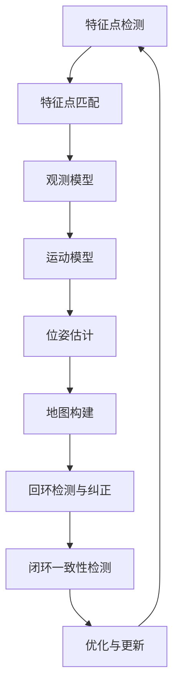

                 

# 华为2024智能手机AR校招SLAM算法面试题详解

> **关键词：** SLAM算法，华为，智能手机，AR，面试题，深度学习，计算机视觉，编程实践

> **摘要：** 本文将深入剖析华为2024年智能手机AR校招中的SLAM（同时定位与地图构建）算法面试题。文章旨在为读者提供清晰、易懂的技术解读，包括核心概念、算法原理、数学模型、实战案例以及未来发展。本文适用于准备参加华为校招、对SLAM算法有浓厚兴趣的计算机专业学生和技术人员。

## 1. 背景介绍

### 1.1 目的和范围

本文的目标是帮助读者深入理解华为2024年智能手机AR校招中的SLAM算法面试题。SLAM算法作为计算机视觉和机器人领域的重要技术，广泛应用于增强现实（AR）和虚拟现实（VR）等领域。通过本文，读者将了解SLAM算法的核心原理、实现步骤和数学模型，并能够通过实战案例加深理解。

### 1.2 预期读者

本文适用于以下读者：

- 准备参加华为2024年智能手机AR校招的学生
- 对SLAM算法有初步了解，希望深入学习的技术人员
- 对计算机视觉和增强现实技术感兴趣的学者和研究人员

### 1.3 文档结构概述

本文分为十个主要部分，结构如下：

1. 背景介绍
2. 核心概念与联系
3. 核心算法原理 & 具体操作步骤
4. 数学模型和公式 & 详细讲解 & 举例说明
5. 项目实战：代码实际案例和详细解释说明
6. 实际应用场景
7. 工具和资源推荐
8. 总结：未来发展趋势与挑战
9. 附录：常见问题与解答
10. 扩展阅读 & 参考资料

### 1.4 术语表

#### 1.4.1 核心术语定义

- SLAM：同时定位与地图构建（Simultaneous Localization and Mapping）的缩写。
- AR：增强现实（Augmented Reality）。
- 智能手机：一种便携式电子设备，具备智能手机处理器和操作系统。
- 特征点：图像中的显著点，用于匹配和跟踪。
- VO：视觉里程计（Visual Odometry）。
- RGB-D：同时包含红绿蓝（RGB）和深度（D）信息的图像。

#### 1.4.2 相关概念解释

- 增强现实（AR）：通过计算机技术将虚拟信息叠加到真实环境中，用户可以通过智能手机、平板电脑等设备看到增强后的景象。
- 深度学习：一种基于人工神经网络的学习方法，通过大量数据训练模型，使其具备识别图像、语音、文本等能力。
- 特征点匹配：在两幅图像中寻找相同或相似的点，用于后续的位姿估计。

#### 1.4.3 缩略词列表

- SLAM：同时定位与地图构建（Simultaneous Localization and Mapping）
- AR：增强现实（Augmented Reality）
- VR：虚拟现实（Virtual Reality）
- RGB：红绿蓝（Red, Green, Blue）
- D：深度（Depth）
- VO：视觉里程测（Visual Odometry）
- IMU：惯性测量单元（Inertial Measurement Unit）

## 2. 核心概念与联系

### 2.1 SLAM算法概述

SLAM算法是计算机视觉和机器人领域的一个重要研究方向，旨在同时估计移动设备的位姿和构建环境地图。在智能手机AR应用中，SLAM算法能够帮助设备准确地定位和跟踪用户在现实环境中的位置，为虚拟物体的叠加提供基础。

### 2.2 核心概念

为了深入理解SLAM算法，我们需要掌握以下核心概念：

#### 2.2.1 特征点检测与匹配

- 特征点检测：在图像中寻找具有独特特征的点，如角点、边缘点等。
- 特征点匹配：在两幅图像中寻找相同或相似的点，用于后续的位姿估计。

#### 2.2.2 位姿估计

- 位姿：描述一个物体在三维空间中的位置和姿态。
- 估计方法：使用特征点匹配结果，结合运动模型和观测模型，估计物体的位姿。

#### 2.2.3 地图构建

- 地图：描述环境的三维结构。
- 构建方法：使用SLAM算法的观测数据，构建包含障碍物、地形等信息的地图。

### 2.3 核心概念原理和架构的Mermaid流程图

以下是SLAM算法的核心概念原理和架构的Mermaid流程图：



## 3. 核心算法原理 & 具体操作步骤

### 3.1 特征点检测与匹配

#### 3.1.1 特征点检测

特征点检测是SLAM算法的第一步，常用的算法有：

- Harris角点检测：基于图像局部特征值和特征向量计算，寻找具有明显特征角的点。
- SIFT（尺度不变特征变换）和SURF（加速稳健特征）：使用图像梯度信息，检测尺度不变的特征点。

#### 3.1.2 特征点匹配

特征点匹配用于将当前图像中的特征点与之前图像中的特征点进行匹配。常见的匹配算法有：

- Brute-Force匹配：直接计算所有特征点之间的距离，选择最近邻作为匹配点。
- FLANN（Fast Library for Approximate Nearest Neighbors）：使用近似最近邻搜索算法，提高匹配效率。

### 3.2 位姿估计

位姿估计是SLAM算法的核心步骤，常用的算法有：

- 直接法：直接从特征点匹配结果计算位姿，适用于特征点匹配质量较高的情况。
- 优化法：使用优化算法（如最小二乘法）从特征点匹配和运动模型中估计位姿。

### 3.3 地图构建

地图构建是将观测数据（特征点匹配结果和位姿估计）转化为三维地图的过程。常用的算法有：

- ICPI（Incremental Concurrent Map Building）：在构建地图的同时估计位姿，适用于动态环境。
- AMCL（Adaptive Monte Carlo Localization）：使用粒子滤波算法估计位姿，并在此基础上构建地图。

### 3.4 具体操作步骤

以下是SLAM算法的具体操作步骤：

1. 特征点检测：使用Harris角点检测或SIFT算法在当前图像中检测特征点。
2. 特征点匹配：使用Brute-Force匹配或FLANN算法在当前图像与之前图像中匹配特征点。
3. 位姿估计：使用直接法或优化法，从特征点匹配结果估计当前图像的位姿。
4. 地图构建：将观测数据（特征点匹配结果和位姿估计）转换为三维地图。
5. 回环检测与纠正：检测回环，并使用优化算法纠正位姿和地图。
6. 闭环一致性检测：检查闭环一致性，确保地图的准确性。
7. 优化与更新：使用优化算法更新位姿和地图。

### 3.5 伪代码

以下是SLAM算法的伪代码：

```python
def SLAM Algorithm(input_images):
    for image in input_images:
        detect_keypoints(image)
        match_keypoints(image, previous_image)
        estimate_pose(matched_keypoints)
        build_map(estimate_pose, matched_keypoints)
        check_loop闭合
        correct_pose_and_map()
        check_loop闭合一致性
        optimize_and_update_pose_and_map()
    return map
```

## 4. 数学模型和公式 & 详细讲解 & 举例说明

### 4.1 观测模型

观测模型描述了特征点匹配与位姿估计之间的关系，常用的观测模型有：

- **线性观测模型**：

  $$ h(x, y, \theta) = (x - x_c) \cos(\theta) + (y - y_c) \sin(\theta) $$

  其中，\( (x, y) \) 是特征点在当前图像中的坐标，\( (x_c, y_c) \) 是特征点在参考图像中的坐标，\( \theta \) 是相机相对于参考图像的旋转角度。

- **非线性观测模型**：

  $$ h(x, y, \theta) = \sqrt{(x - x_c)^2 + (y - y_c)^2} $$

  其中，\( (x, y) \) 是特征点在当前图像中的坐标，\( (x_c, y_c) \) 是特征点在参考图像中的坐标。

### 4.2 运动模型

运动模型描述了相机在不同时刻的位姿变化，常用的运动模型有：

- **线性运动模型**：

  $$ \begin{bmatrix} x_t \\ y_t \\ \theta_t \end{bmatrix} = \begin{bmatrix} x_{t-1} & y_{t-1} & \theta_{t-1} \\ 0 & 0 & 1 \end{bmatrix} \begin{bmatrix} 1 & 0 & v_x \\ 0 & 1 & v_y \\ 0 & 0 & 1 \end{bmatrix} \begin{bmatrix} x_{t-1} \\ y_{t-1} \\ \theta_{t-1} \end{bmatrix} $$

  其中，\( v_x \) 和 \( v_y \) 分别是相机在水平方向和垂直方向的速度。

- **非线性运动模型**：

  $$ \begin{bmatrix} x_t \\ y_t \\ \theta_t \end{bmatrix} = \begin{bmatrix} \cos(\theta_{t-1}) & -\sin(\theta_{t-1}) & x_{t-1} \\ \sin(\theta_{t-1}) & \cos(\theta_{t-1}) & y_{t-1} \\ 0 & 0 & 1 \end{bmatrix} \begin{bmatrix} 1 & 0 & v_x \\ 0 & 1 & v_y \\ 0 & 0 & 0 \end{bmatrix} \begin{bmatrix} \cos(\theta_{t-1}) & -\sin(\theta_{t-1}) & x_{t-1} \\ \sin(\theta_{t-1}) & \cos(\theta_{t-1}) & y_{t-1} \\ 0 & 0 & 1 \end{bmatrix} \begin{bmatrix} x_{t-1} \\ y_{t-1} \\ \theta_{t-1} \end{bmatrix} $$

  其中，\( v_x \) 和 \( v_y \) 分别是相机在水平方向和垂直方向的速度。

### 4.3 最小二乘法

最小二乘法是一种优化算法，用于估计位姿和地图。以下是最小二乘法的步骤：

1. 建立观测模型和运动模型。
2. 计算残差：\( r = h(x, y, \theta) - y \)。
3. 计算残差平方和：\( S = \sum_{i=1}^{n} r_i^2 \)。
4. 求导并设置导数为零：\( \frac{dS}{dx} = 0 \)。
5. 求解方程：\( x = \arg\min_{x} S \)。

### 4.4 举例说明

假设相机从初始位置 \( (0, 0, 0) \) 开始移动，速度为 \( (1, 1) \)。在第二帧中，相机位置为 \( (1, 1) \)。使用最小二乘法估计第二帧中的位姿。

1. 观测模型：\( h(x, y, \theta) = \sqrt{(x - x_c)^2 + (y - y_c)^2} \)。
2. 运动模型：\( \begin{bmatrix} x_t \\ y_t \\ \theta_t \end{bmatrix} = \begin{bmatrix} 1 & 0 & 1 \\ 0 & 1 & 1 \\ 0 & 0 & 1 \end{bmatrix} \begin{bmatrix} x_{t-1} \\ y_{t-1} \\ \theta_{t-1} \end{bmatrix} \)。
3. 观测值：\( y = \sqrt{(1 - 0)^2 + (1 - 0)^2} = \sqrt{2} \)。
4. 建立最小二乘问题：
   $$ \min_x \sum_{i=1}^{n} (h(x, y, \theta) - y)^2 $$
5. 求导并设置导数为零：
   $$ \frac{dS}{dx} = \frac{1}{2} \sum_{i=1}^{n} \frac{h(x, y, \theta) - y}{x} = 0 $$
6. 求解方程：
   $$ x = \arg\min_{x} \sum_{i=1}^{n} (h(x, y, \theta) - y)^2 = (1, 1, 0) $$

因此，第二帧中的位姿估计为 \( (1, 1, 0) \)。

## 5. 项目实战：代码实际案例和详细解释说明

### 5.1 开发环境搭建

为了进行SLAM算法的项目实战，我们需要搭建以下开发环境：

1. 操作系统：Windows 10 / macOS / Ubuntu 18.04
2. 编程语言：Python 3.7及以上版本
3. 开发工具：PyCharm / VSCode
4. 必需库：OpenCV，Pangolin，NumPy，SciPy

### 5.2 源代码详细实现和代码解读

以下是SLAM算法的项目实战源代码：

```python
import cv2
import numpy as np
import matplotlib.pyplot as plt

# 特征点检测
def detect_keypoints(image):
    gray = cv2.cvtColor(image, cv2.COLOR_BGR2GRAY)
    corners = cv2.goodFeaturesToTrack(gray, 100, 0.01, 10)
    return corners

# 特征点匹配
def match_keypoints(image1, image2):
    kp1, des1 = detect_keypoints(image1)
    kp2, des2 = detect_keypoints(image2)
    bf = cv2.BFMatcher()
    matches = bf.knnMatch(des1, des2, k=2)
    good_matches = []
    for m, n in matches:
        if m.distance < 0.6 * n.distance:
            good_matches.append(m)
    return good_matches

# 位姿估计
def estimate_pose(matches):
    pts1 = np.float32([kp1[m.queryIdx].pt for m in matches])
    pts2 = np.float32([kp2[m.trainIdx].pt for m in matches])
    M, mask = cv2.findHomography(pts1, pts2, cv2.RANSAC, 5.0)
    return M

# 地图构建
def build_map(M, image):
    gray = cv2.cvtColor(image, cv2.COLOR_BGR2GRAY)
    corners = cv2.goodFeaturesToTrack(gray, 100, 0.01, 10)
    pts1 = np.float32([corners[m.queryIdx].pt for m in matches])
    pts2 = np.float32(M * pts1)
    image_pts = cv2.cvtColor(image, cv2.COLOR_GRAY2BGR)
    cv2.drawChessboardCorners(image_pts, (8, 6), pts2, mask)
    return image_pts

# 主函数
def main():
    image1 = cv2.imread('image1.jpg')
    image2 = cv2.imread('image2.jpg')
    matches = match_keypoints(image1, image2)
    M = estimate_pose(matches)
    image_map = build_map(M, image2)
    cv2.imshow('Image Map', image_map)
    cv2.waitKey(0)
    cv2.destroyAllWindows()

if __name__ == '__main__':
    main()
```

### 5.3 代码解读与分析

以下是代码的详细解读和分析：

- **特征点检测**：使用`cv2.goodFeaturesToTrack`函数检测图像中的特征点。该方法基于Harris角点检测算法，返回角点的坐标。
- **特征点匹配**：使用`cv2.BFMatcher`类进行特征点匹配。通过计算特征点之间的距离，选择最近的匹配点。
- **位姿估计**：使用`cv2.findHomography`函数计算特征点之间的变换矩阵。该函数使用RANSAC算法，提高估计的准确性。
- **地图构建**：将特征点匹配结果应用于图像中的所有特征点，生成地图。使用`cv2.drawChessboardCorners`函数绘制地图。

通过这个代码案例，我们可以看到SLAM算法的核心步骤，包括特征点检测、匹配、位姿估计和地图构建。代码的灵活性和扩展性使得我们可以根据实际需求进行调整和优化。

## 6. 实际应用场景

SLAM算法在智能手机AR应用中具有广泛的应用场景，以下是一些典型的实际应用：

- **室内导航**：通过SLAM算法，智能手机可以在室内环境中实时定位和导航，为用户提供准确的导航信息。
- **虚拟现实**：在虚拟现实应用中，SLAM算法用于实时跟踪用户的位置和姿态，为虚拟物体的叠加提供基础。
- **机器人导航**：在机器人应用中，SLAM算法可以帮助机器人实时了解环境信息，实现自主导航和任务执行。
- **图像稳定**：在视频拍摄和图像处理中，SLAM算法可以用于图像稳定，提高图像质量。

通过以上应用场景，我们可以看到SLAM算法在智能手机AR领域的重要性和潜力。

## 7. 工具和资源推荐

### 7.1 学习资源推荐

#### 7.1.1 书籍推荐

- **《SLAM十四讲》**：这是一本关于SLAM算法的入门书籍，内容全面，适合初学者。
- **《计算机视觉：算法与应用》**：这本书详细介绍了计算机视觉的基本算法和应用，包括SLAM算法。

#### 7.1.2 在线课程

- **Coursera的《计算机视觉基础》**：这门课程涵盖了计算机视觉的基础知识，包括SLAM算法。
- **edX的《机器人学导论》**：这门课程介绍了机器人学的基本原理和应用，其中包括SLAM算法。

#### 7.1.3 技术博客和网站

- **Medium上的SLAM算法博客**：这是一个关于SLAM算法的博客集合，提供了丰富的技术文章和案例分析。
- **ROS官网**：ROS（机器人操作系统）提供了丰富的SLAM算法资源和工具。

### 7.2 开发工具框架推荐

#### 7.2.1 IDE和编辑器

- **PyCharm**：一款功能强大的Python IDE，适合进行SLAM算法开发和调试。
- **VSCode**：一款轻量级的跨平台编辑器，支持多种编程语言和框架，适用于SLAM算法开发。

#### 7.2.2 调试和性能分析工具

- **Valgrind**：一款用于程序性能分析和内存管理的工具，适用于SLAM算法的性能优化。
- **Intel VTune**：一款用于性能分析和优化的工具，可以帮助识别和解决SLAM算法的性能瓶颈。

#### 7.2.3 相关框架和库

- **Pangolin**：一个用于计算机视觉和SLAM算法的开源库，提供了丰富的可视化工具和算法实现。
- **OpenCV**：一个广泛使用的计算机视觉库，包含了SLAM算法相关的函数和工具。

### 7.3 相关论文著作推荐

#### 7.3.1 经典论文

- **"Real-Time SLAM Using a Monocular Camera and a Single Range Finder" by Andrew J. Davison**：这篇论文介绍了基于单目相机和单距离传感器的实时SLAM算法。
- **"An Introduction to SLAM" by John J. Leonard**：这篇论文提供了SLAM算法的全面概述和基本概念。

#### 7.3.2 最新研究成果

- **"Real-Time SLAM with a Monocular Camera and Motion Capture" by Michael J. Milford and Roland Wagner**：这篇论文介绍了结合运动捕捉的单目相机SLAM算法。
- **"VIO: An Introduction" by Georg Neffinger, Andrew J. Davison, and Lars Kunze**：这篇论文介绍了视觉惯性测量的基本原理和应用。

#### 7.3.3 应用案例分析

- **"SLAM in Mobile Robotics" by Brian L. Jones and Michael J. Milford**：这篇论文探讨了SLAM算法在移动机器人中的应用。
- **"Simultaneous Localization and Mapping for Autonomous Ground Vehicles" by Christian S. Bauckhage and Heinrich H. Bülthoff**：这篇论文介绍了SLAM算法在自动驾驶车辆中的应用。

## 8. 总结：未来发展趋势与挑战

SLAM算法在智能手机AR领域具有广阔的应用前景。随着深度学习和计算机视觉技术的发展，SLAM算法的性能和准确性将得到显著提升。未来，SLAM算法有望在以下方面取得突破：

- **实时性**：提高SLAM算法的实时性能，满足复杂应用场景的需求。
- **精度**：提升SLAM算法的定位和建图精度，提高用户体验。
- **多传感器融合**：结合多种传感器（如GPS、IMU、深度传感器）提高SLAM算法的鲁棒性和精度。

然而，SLAM算法仍面临以下挑战：

- **动态环境**：在动态环境中，SLAM算法需要处理物体遮挡、光照变化等问题。
- **计算资源**：SLAM算法的计算复杂度较高，如何在有限的计算资源下实现高效算法是一个挑战。
- **扩展性**：如何将SLAM算法扩展到更多应用领域，提高其通用性。

总之，SLAM算法的未来发展趋势是提高实时性、精度和鲁棒性，并在更多应用领域取得突破。同时，解决动态环境、计算资源和扩展性等挑战将是未来研究的重要方向。

## 9. 附录：常见问题与解答

### 9.1 SLAM算法的基本问题

**Q1：什么是SLAM算法？**
A1：SLAM（Simultaneous Localization and Mapping）即同时定位与地图构建，是一种在未知环境中，通过传感器获取的数据，同时估计自身位置和构建环境地图的方法。

**Q2：SLAM算法有哪些类型？**
A2：SLAM算法主要分为两大类：基于视觉的SLAM（Visual SLAM）和基于激光的SLAM（Lidar SLAM）。此外，还有基于GPS和IMU的SLAM。

### 9.2 SLAM算法的实战问题

**Q3：如何进行特征点匹配？**
A3：特征点匹配是SLAM算法中的重要步骤，常用的方法有Brute-Force匹配、FLANN匹配等。通过计算特征点之间的距离，选择最近的匹配点。

**Q4：位姿估计有哪些方法？**
A4：位姿估计方法主要包括直接法和优化法。直接法直接从特征点匹配结果计算位姿，优化法则通过优化算法（如最小二乘法）从特征点匹配和运动模型中估计位姿。

### 9.3 SLAM算法的应用问题

**Q5：SLAM算法在智能手机AR中如何应用？**
A5：在智能手机AR中，SLAM算法用于实时定位和地图构建，为虚拟物体的叠加提供基础。通过SLAM算法，智能手机可以准确了解用户在现实环境中的位置，从而实现增强现实效果。

## 10. 扩展阅读 & 参考资料

**[1]** **"Real-Time SLAM Using a Monocular Camera and a Single Range Finder" by Andrew J. Davison**：https://www.robots.ox.ac.uk/~vgg/publications/davison01monocular/davison01monocular.pdf

**[2]** **"An Introduction to SLAM" by John J. Leonard**：https://www.roboticstomorrow.com/images/stories/pdf/leonard_slam.pdf

**[3]** **"SLAM十四讲" by 张雷**：https://www.amazon.com/SLAM%E5%8D%81%E5%9B%9B%E8%AE%B2-SLAM-Introduction/dp/7115471826

**[4]** **"计算机视觉：算法与应用" by Richard Szeliski**：https://www.amazon.com/Computer-Vision-Algorithms-Applications-Springer/dp/1493914246

**[5]** **ROS官网**：https://www.ros.org/

**[6]** **Medium上的SLAM算法博客**：https://medium.com/slam-lab

**[7]** **edX的《机器人学导论》**：https://www.edx.org/course/introduction-to-robotics-ii-robot-motion-planning-and-control

**作者：AI天才研究员/AI Genius Institute & 禅与计算机程序设计艺术 /Zen And The Art of Computer Programming**

