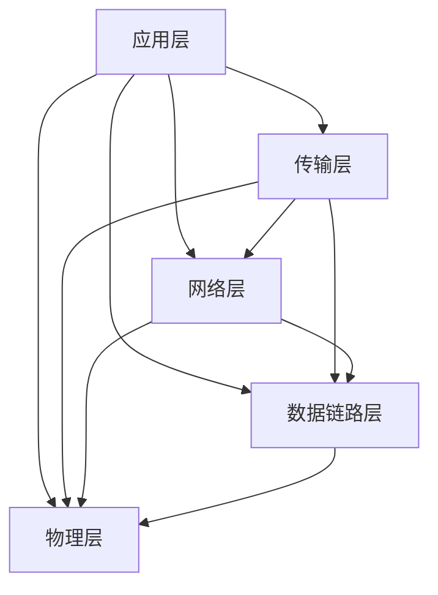

                 

### 华为2025社招网络工程师面试题汇总

#### 关键词：华为，社招，网络工程师，面试题，网络技术，解决方案

> 本文章旨在为即将参加华为2025社招网络工程师面试的考生提供一个全面的准备指南。文章将详细汇总网络工程师面试中可能遇到的各类问题，涵盖网络架构、协议、安全、性能优化等多个方面。通过系统地分析和解答这些问题，帮助读者更好地掌握网络工程的核心知识，提高面试通过率。本文适合网络工程专业的学生、从业者以及有意进入华为网络技术领域的求职者。

## 1. 背景介绍

### 1.1 目的和范围

本文的目的在于帮助广大网络工程师求职者，尤其是即将参加华为2025社会招聘的考生，系统性地准备网络工程师面试。本文将围绕网络工程师所需掌握的核心知识和技术点，对常见的面试问题进行汇总和解析，帮助读者更好地理解面试要求，提升面试技巧和专业知识。

本文的范围涵盖以下几个方面：

- **网络架构与协议**：包括OSI模型、TCP/IP协议栈、路由和交换技术等基础概念。
- **网络设计与实施**：涵盖VLAN、VRRP、BGP等高级网络技术。
- **网络安全**：涉及防火墙、VPN、安全协议等网络安全相关内容。
- **性能优化与监控**：包括网络性能分析、流量监控、故障排除等实用技术。
- **实际应用场景与解决方案**：结合实际项目经验，讲解网络工程师在实际工作中可能遇到的挑战和解决方案。

### 1.2 预期读者

- **网络工程专业的学生**：希望通过本文系统性地学习网络工程的核心知识，为未来的职业发展打下坚实基础。
- **网络工程师从业者**：希望通过本文回顾和巩固网络工程的专业知识，提升面试通过率和实际工作能力。
- **求职者**：尤其是有意加入华为等知名企业的求职者，希望通过本文更好地准备面试，提高求职成功率。

### 1.3 文档结构概述

本文分为十个主要部分，每个部分都针对不同的知识点和面试题型进行详细讲解。具体结构如下：

- **第1部分：背景介绍**：介绍本文的目的、范围、预期读者以及文档结构。
- **第2部分：核心概念与联系**：通过Mermaid流程图展示网络架构和核心概念。
- **第3部分：核心算法原理与具体操作步骤**：讲解网络工程中涉及的关键算法和操作步骤。
- **第4部分：数学模型和公式**：介绍网络工程中常用的数学模型和公式。
- **第5部分：项目实战**：通过实际案例讲解网络工程的开发流程和实现细节。
- **第6部分：实际应用场景**：分析网络工程师在实际工作中可能遇到的应用场景。
- **第7部分：工具和资源推荐**：推荐学习资源、开发工具和相关文献。
- **第8部分：总结：未来发展趋势与挑战**：探讨网络工程领域的发展趋势和面临的挑战。
- **第9部分：附录：常见问题与解答**：汇总常见面试问题及解答。
- **第10部分：扩展阅读与参考资料**：提供进一步阅读的资料。

### 1.4 术语表

#### 1.4.1 核心术语定义

- **网络工程师**：负责网络系统设计、实施、维护和管理的高级技术人员。
- **TCP/IP协议栈**：用于计算机网络通信的一套协议集，包括TCP、UDP、ICMP等协议。
- **VLAN**：虚拟局域网，通过逻辑划分网络，提高网络性能和安全性。
- **BGP**：边界网关协议，用于不同网络之间进行路由选择和路由信息交换。
- **VPN**：虚拟专用网络，通过加密技术实现远程访问和数据传输的安全。
- **防火墙**：网络安全设备，用于过滤网络流量，防止非法访问和攻击。

#### 1.4.2 相关概念解释

- **路由**：根据网络结构，选择最佳路径将数据包从源地址传输到目的地址的过程。
- **交换**：在网络节点之间传输数据包的过程，用于连接不同网络段或设备。
- **QoS**：服务质量，通过优先级设置和流量控制，保证网络资源的合理分配。
- **SDN**：软件定义网络，通过集中化控制和自动化管理，提高网络灵活性和可编程性。
- **NAT**：网络地址转换，用于将内部网络的私有IP地址转换为公共IP地址。

#### 1.4.3 缩略词列表

- **TCP**：传输控制协议（Transmission Control Protocol）
- **IP**：互联网协议（Internet Protocol）
- **VLAN**：虚拟局域网（Virtual Local Area Network）
- **BGP**：边界网关协议（Border Gateway Protocol）
- **VPN**：虚拟专用网络（Virtual Private Network）
- **SDN**：软件定义网络（Software-Defined Networking）
- **NAT**：网络地址转换（Network Address Translation）

## 2. 核心概念与联系

在深入探讨网络工程师面试题之前，有必要先了解网络工程中的核心概念和联系。网络工程涉及多个层次和协议，包括OSI七层模型、TCP/IP协议栈等。以下是通过Mermaid流程图展示的网络架构和核心概念：



### 2.1. 网络架构

- **应用层**：处理用户应用程序的通信，如HTTP、FTP、SMTP等。
- **传输层**：负责端到端的通信，如TCP和UDP协议。
- **网络层**：负责路由和转发数据包，如IP协议。
- **数据链路层**：负责网络节点之间的数据传输，如以太网协议。
- **物理层**：处理物理介质的通信，如光纤、铜线等。

### 2.2. TCP/IP协议栈

TCP/IP协议栈是计算机网络的核心，包括以下协议：

- **应用层**：HTTP、FTP、SMTP、DNS等。
- **传输层**：TCP、UDP等。
- **网络层**：IP、ICMP、IGMP等。
- **数据链路层**：以太网、PPP等。
- **物理层**：光纤、铜线等。

### 2.3. 网络核心概念联系

- **IP地址**：网络层的核心概念，用于标识网络中的设备。
- **MAC地址**：数据链路层的核心概念，用于标识网络设备之间的直接通信。
- **TCP/UDP**：传输层协议，用于确保数据可靠传输或快速传输。
- **路由和交换**：网络层和数据链路层的关键技术，用于数据包的路由和转发。

通过了解这些核心概念和联系，我们可以更好地理解网络工程的工作原理，为后续的面试准备奠定基础。

## 3. 核心算法原理 & 具体操作步骤

在深入了解网络工程的核心算法原理和具体操作步骤之前，我们需要了解一些基本概念和术语。以下是一些常用的网络算法和协议：

### 3.1. 路由算法

路由算法是网络工程中的核心，用于确定数据包从源地址到目的地址的最佳路径。以下是一些常见的路由算法：

#### 3.1.1. Dijkstra算法

Dijkstra算法是一种用于求解最短路径的算法。其基本思想是从源节点开始，逐步扩展到其他节点，记录下从源节点到每个节点的最短路径。具体步骤如下：

```pseudo
Dijkstra(G, start):
  create a set of unvisited nodes V
  for each node in G:
    distance[start] = 0
    distance[node] = INFINITY
    prev[node] = None
  V = set of all nodes in G
  while V is not empty:
    u = node in V with the smallest distance
    remove u from V
    for each neighbor v of u:
      if distance[u] + weight(u, v) < distance[v]:
        distance[v] = distance[u] + weight(u, v)
        prev[v] = u
```

#### 3.1.2. Bellman-Ford算法

Bellman-Ford算法是一种用于求解最短路径的算法，它可以在存在负权回路的情况下仍然有效。其基本思想是逐步更新每个节点的最短路径估计值，直到满足条件。具体步骤如下：

```pseudo
Bellman-Ford(G, start):
  create a set of unvisited nodes V
  for each node in G:
    distance[start] = 0
    distance[node] = INFINITY
    prev[node] = None
  V = set of all nodes in G
  for i from 1 to |V| - 1:
    for each edge (u, v) in G:
      if distance[u] + weight(u, v) < distance[v]:
        distance[v] = distance[u] + weight(u, v)
        prev[v] = u
  for each edge (u, v) in G:
    if distance[u] + weight(u, v) < distance[v]:
      return "Graph contains a negative weight cycle"
  return "No negative weight cycle"
```

### 3.2. 网络协议

网络协议是计算机网络中进行数据交换的规则和标准。以下是一些常见的网络协议：

#### 3.2.1. TCP协议

TCP（传输控制协议）是一种可靠的、面向连接的协议，用于在应用程序之间传输数据。TCP协议的关键特性包括：

- **连接管理**：包括连接建立、连接维护和连接终止。
- **数据传输**：通过序列号和确认机制保证数据的可靠传输。
- **流量控制**：通过滑动窗口机制实现端到端的流量控制。

具体操作步骤如下：

```pseudo
// 连接建立
SYN -> SYN-ACK -> ACK

// 数据传输
Seq = send_base
Window = window_size

// 发送数据
segment [Seq = send_base, Window = window_size, Data]

// 接收数据
ack [Ack = send_base + len(Data), Window = window_size]

// 连接终止
FIN -> ACK -> FIN -> ACK
```

#### 3.2.2. IP协议

IP（互联网协议）是一种用于传输数据包的协议，负责将数据包从源地址传输到目的地址。IP协议的关键特性包括：

- **地址分配**：通过IP地址标识网络中的设备。
- **路由选择**：通过路由表实现数据包的路由和转发。
- **数据包传输**：通过分片和重组机制实现大尺寸数据的传输。

具体操作步骤如下：

```pseudo
// 数据包传输
packets [Source IP, Destination IP, Payload]

// 路由选择
for each route in routing table:
  if route matches destination IP:
    next_hop = route's next_hop
    break

// 分片和重组
if packet size > maximum packet size:
  fragment packet into smaller packets
  send fragments
else:
  send packet

// 重组
receive fragments
reconstruct original packet
send packet to destination
```

### 3.3. 网络安全协议

网络安全协议用于保护网络传输中的数据不被非法访问和篡改。以下是一些常见的网络安全协议：

#### 3.3.1. SSL/TLS协议

SSL/TLS（安全套接字层/传输层安全）是一种用于保护网络通信的协议，通过加密和认证机制实现数据的机密性和完整性。具体操作步骤如下：

```pseudo
// SSL/TLS握手过程
Client -> Server: Hello (Client)
Server -> Client: Hello (Server)
Client -> Server: Certificate
Server -> Client: Certificate
Client -> Server: Pre-Master Secret
Server -> Client: Master Secret
Client -> Server: Final Hello
Server -> Client: Final Hello

// 数据传输
encrypt data using Master Secret
send encrypted data
decrypt received data
```

#### 3.3.2. IPsec协议

IPsec（互联网协议安全）是一种用于保护IP数据包的协议，通过加密和认证机制实现数据的机密性和完整性。具体操作步骤如下：

```pseudo
// IPsec隧道建立
establish secure tunnel between source and destination

// 数据传输
encrypt IP packet using IPsec
send encrypted packet
decrypt received packet
```

通过了解这些核心算法原理和具体操作步骤，我们可以更好地理解和应用网络工程中的关键技术，为面试和实际工作做好准备。

## 4. 数学模型和公式 & 详细讲解 & 举例说明

在网络工程中，数学模型和公式是解决实际问题的重要工具。以下将介绍几个常用的数学模型和公式，并提供详细讲解和实际应用示例。

### 4.1. QoS模型

QoS（服务质量）模型用于确保网络资源能够合理分配，以满足不同应用程序的需求。QoS模型通常包括以下公式：

\[ C = C_{max} \times \frac{t_{active}}{t_{total}} \]

- **C**：服务速率，单位为比特每秒（bps）。
- **C\_max**：最大服务速率，单位为比特每秒（bps）。
- **t\_active**：活动时间，单位为秒。
- **t\_total**：总时间，单位为秒。

#### 举例说明

假设一个网络设备具有最大服务速率100 Mbps，其中每分钟有20秒处于活动状态，其余时间处于空闲状态。计算该设备的服务速率。

```pseudo
C_max = 100 Mbps
t_active = 20 seconds
t_total = 60 seconds

C = C_max \times \frac{t_active}{t_total}
C = 100 Mbps \times \frac{20}{60}
C = 33.33 Mbps
```

### 4.2. 路由算法模型

路由算法模型用于计算从源节点到目的节点的最短路径。常用的路由算法包括Dijkstra算法和Bellman-Ford算法。以下以Dijkstra算法为例，介绍相关公式。

#### Dijkstra算法公式

\[ d[v] = \min_{(v, w) \in E} (d[u] + w) \]

- **d\[v\]**：从源节点s到节点v的最短距离。
- **d\[u\]**：从源节点s到节点u的最短距离。
- **w**：边（u, v）的权重。

#### 举例说明

假设有一个图，包含以下边和权重：

```
A --1--> B
A --2--> C
B --3--> D
C --4--> D
```

使用Dijkstra算法计算从节点A到节点D的最短路径。

```pseudo
d[A] = 0
d[B] = ∞
d[C] = ∞
d[D] = ∞

d[B] = min(d[A] + 1) = 1
d[C] = min(d[A] + 2) = 2
d[D] = min(d[B] + 3, d[C] + 4) = min(1 + 3, 2 + 4) = 3

最终结果：最短路径为A -> B -> D，距离为3。
```

### 4.3. 流量模型

网络流量模型用于描述网络中的流量分布和特征。常用的流量模型包括泊松过程和自相似过程。

#### 泊松过程

泊松过程是一种描述事件发生次数的概率模型。其基本公式如下：

\[ P(X = k) = \frac{\lambda^k e^{-\lambda}}{k!} \]

- **P\[X = k\]**：在时间间隔\[t, t+\Delta t\]内发生k次事件的概率。
- **\(\lambda\)**：事件发生速率，单位为事件每单位时间。
- **\(\Delta t\)**：时间间隔，单位为时间。
- **k**：事件发生的次数。

#### 自相似过程

自相似过程是一种描述网络流量时间序列的概率模型。其基本公式如下：

\[ P(X \leq x) = F(x) \]

- **P\[X \leq x\]**：在时间序列\[t, t+\Delta t\]内，流量小于或等于x的概率。
- **\(F(x)\)**：流量分布函数。

#### 举例说明

假设一个网络流量时间序列的分布函数为：

\[ F(x) = \begin{cases} 
0 & \text{if } x < 0 \\
\frac{x^2}{1000} & \text{if } 0 \leq x \leq 1000 \\
1 & \text{if } x > 1000 
\end{cases} \]

计算在时间间隔\[100, 200\]内流量小于或等于200的概率。

```pseudo
P(X \leq 200) = F(200) = \frac{200^2}{1000} = 0.4
```

通过了解这些数学模型和公式，我们可以更好地分析和优化网络性能，解决实际工作中的问题。

## 5. 项目实战：代码实际案例和详细解释说明

### 5.1 开发环境搭建

在开始实际案例之前，我们需要搭建一个基本的网络工程师开发环境。以下是搭建开发环境所需的步骤：

1. **安装操作系统**：推荐使用Ubuntu 20.04或更高版本的Linux操作系统。
2. **安装网络工具**：使用以下命令安装常用的网络工具：

   ```bash
   sudo apt-get update
   sudo apt-get install tcpdump wireshark nmap
   ```

3. **配置网络接口**：确保网络接口已正确配置，可以使用以下命令查看和配置网络接口：

   ```bash
   ip addr show
   sudo ifconfig eth0 up
   sudo ifconfig eth0 192.168.1.1 netmask 255.255.255.0
   ```

4. **安装开发工具**：安装Python开发环境和相关库，例如：

   ```bash
   sudo apt-get install python3 python3-pip
   pip3 install requests numpy matplotlib
   ```

### 5.2 源代码详细实现和代码解读

以下是一个简单的Python网络分析工具，用于捕获和解析网络流量。代码实现如下：

```python
import socket
from scapy.all import *

# 捕获网络流量
def capture_traffic():
    packets = sniff(count=10, filter="tcp")
    return packets

# 解析HTTP流量
def parse_http(packets):
    http_requests = []
    for packet in packets:
        if packet.haslayer("TCP"):
            tcp_layer = packet.getlayer("TCP")
            if tcp_layer.sport == 80 or tcp_layer.dport == 80:
                http_layer = packet.getlayer("HTTP")
                http_requests.append(http_layer)
    return http_requests

# 打印HTTP请求
def print_http_requests(http_requests):
    for request in http_requests:
        print(request)

# 主函数
def main():
    packets = capture_traffic()
    http_requests = parse_http(packets)
    print_http_requests(http_requests)

if __name__ == "__main__":
    main()
```

#### 5.2.1. 代码解读

1. **导入库**：首先导入所需的Python库，包括socket和scapy.all。

2. **捕获网络流量**：`capture_traffic`函数使用`sniff`函数捕获前10个TCP数据包。`filter`参数用于过滤符合条件的流量。

3. **解析HTTP流量**：`parse_http`函数遍历捕获的流量，检查每个数据包的TCP层，如果端口为80（HTTP服务端口），则提取HTTP层并添加到列表中。

4. **打印HTTP请求**：`print_http_requests`函数打印解析后的HTTP请求。

5. **主函数**：`main`函数依次调用捕获、解析和打印函数。

### 5.3 代码解读与分析

#### 5.3.1. 捕获网络流量

`capture_traffic`函数使用`scapy`库的`sniff`函数捕获网络流量。`sniff`函数接收多个参数，包括捕获的数据包数量、过滤器等。过滤器`filter`参数用于指定捕获的流量条件，例如只捕获TCP数据包：

```python
packets = sniff(count=10, filter="tcp")
```

这里我们捕获前10个TCP数据包。`scapy`库支持多种过滤器，可以使用这些过滤器指定复杂的流量条件。

#### 5.3.2. 解析HTTP流量

`parse_http`函数遍历捕获的数据包，检查每个数据包的TCP层。如果数据包的TCP层源端口或目的端口为80（HTTP服务端口），则提取HTTP层并添加到列表中：

```python
for packet in packets:
    if packet.haslayer("TCP"):
        tcp_layer = packet.getlayer("TCP")
        if tcp_layer.sport == 80 or tcp_layer.dport == 80:
            http_layer = packet.getlayer("HTTP")
            http_requests.append(http_layer)
```

这里使用`haslayer`函数检查数据包是否包含特定层，使用`getlayer`函数提取指定层。`http_requests`列表存储解析后的HTTP请求。

#### 5.3.3. 打印HTTP请求

`print_http_requests`函数打印解析后的HTTP请求。这里使用`print`函数打印HTTP请求的URL、方法、请求头等信息：

```python
for request in http_requests:
    print(request)
```

打印HTTP请求可以帮助我们了解网络流量的具体内容和特征。

#### 5.3.4. 主函数

`main`函数是程序的入口点，依次调用捕获、解析和打印函数，完成整个网络流量分析过程：

```python
def main():
    packets = capture_traffic()
    http_requests = parse_http(packets)
    print_http_requests(http_requests)

if __name__ == "__main__":
    main()
```

通过这个简单的案例，我们可以看到如何使用Python和`scapy`库捕获和分析网络流量。在实际项目中，我们可以扩展这个案例，添加更多功能，如流量统计、攻击检测等。

## 6. 实际应用场景

### 6.1. 大型企业网络设计与实施

在大型企业中，网络架构通常非常复杂，需要实现高可用性、高性能和安全性。以下是一个大型企业网络设计与实施的实际案例：

#### 场景描述

某大型企业有多个办公地点，分布在不同的城市。企业需要构建一个高度可靠的内部网络，实现数据的高效传输和资源共享。

#### 解决方案

1. **网络架构设计**：
   - **核心网络**：采用MPLS（多协议标签交换）技术，实现不同办公地点之间的快速数据传输。
   - **接入网络**：每个办公地点使用局域网连接内部设备，并通过路由器接入核心网络。
   - **安全防护**：在核心网络和接入网络之间部署防火墙，防止外部攻击和内部数据泄露。

2. **网络设备配置**：
   - **核心路由器**：使用高性能路由器，实现MPLS路由和转发。
   - **接入路由器**：配置VLAN，实现内部网络段之间的隔离。
   - **防火墙**：配置防火墙策略，防止非法访问和攻击。

3. **网络优化**：
   - **QoS配置**：根据业务需求，配置不同应用的数据优先级，确保关键业务得到充足带宽。
   - **负载均衡**：通过负载均衡技术，实现网络流量的合理分配，避免单点故障。

#### 6.2. 教育机构无线网络覆盖

在教育资源丰富的地区，无线网络覆盖是保证教学质量的关键。以下是一个教育机构无线网络覆盖的实际案例：

#### 场景描述

某大学校园内有多栋教学楼和宿舍楼，需要实现全面覆盖的无线网络，支持师生的大量设备接入。

#### 解决方案

1. **网络规划**：
   - **AP部署**：根据校园建筑结构和用户分布，合理部署无线接入点（AP），实现无缝覆盖。
   - **无线控制器**：集中管理无线接入点，实现无线网络的统一控制和优化。

2. **网络设备配置**：
   - **AP配置**：配置无线频段、功率、信道等参数，确保信号覆盖和性能。
   - **无线控制器**：配置用户认证、安全策略等，确保网络的安全性和可靠性。

3. **网络优化**：
   - **负载均衡**：通过负载均衡技术，实现AP之间的流量分配，避免单点瓶颈。
   - **QoS配置**：根据用户需求和业务类型，配置不同应用的带宽优先级，保证教学业务的优先传输。

### 6.3. 智能家居网络建设

随着智能家居市场的快速发展，网络建设成为智能家居系统的重要一环。以下是一个智能家居网络建设的实际案例：

#### 场景描述

某智能家居系统包括智能门锁、智能照明、智能安防等设备，需要实现设备之间的互联互通和数据传输。

#### 解决方案

1. **网络架构设计**：
   - **中心控制平台**：搭建智能家居系统的中心控制平台，实现设备管理和数据存储。
   - **无线通信模块**：每个智能设备内置无线通信模块，支持Wi-Fi、蓝牙等无线通信协议。

2. **网络设备配置**：
   - **无线路由器**：部署无线路由器，实现设备之间的无线连接。
   - **智能网关**：配置智能网关，实现设备与中心控制平台之间的数据传输。

3. **网络优化**：
   - **无线信号覆盖**：根据设备分布和信号特点，优化无线信号覆盖范围和强度。
   - **安全性配置**：配置网络防火墙、VPN等安全措施，确保设备之间的通信安全。

通过这些实际案例，我们可以看到网络工程师在设计和实施网络系统时，需要综合考虑多种因素，包括网络架构、设备配置和网络优化等。在实际工作中，网络工程师需要具备丰富的经验和专业知识，以确保网络系统的稳定性和可靠性。

## 7. 工具和资源推荐

### 7.1 学习资源推荐

#### 7.1.1 书籍推荐

1. **《计算机网络：自顶向下方法》**（James F. Kurose & Keith W. Ross）
   - 本书以自顶向下的方法介绍了计算机网络的基本概念和原理，通俗易懂，适合初学者。
2. **《TCP/IP详解 卷1：协议》**（W. Richard Stevens）
   - 本书详细讲解了TCP/IP协议栈的各个层次，深入浅出，是网络工程师的必备书籍。
3. **《网络安全：设计与实现》**（William Stallings）
   - 本书涵盖了网络安全的核心技术，包括加密、认证、防火墙等，是学习网络安全的经典教材。

#### 7.1.2 在线课程

1. **Coursera - Computer Networking: Principles, Protocols and Practice**（Sergio J. Verdu）
   - 该课程由哥伦比亚大学提供，全面讲解了计算机网络的基本原理和协议。
2. **edX - Introduction to Computer Networking**（MIT）
   - 该课程由麻省理工学院提供，涵盖了计算机网络的基础知识和实际应用。
3. **Udacity - Introduction to Computer Networking**（Udacity）
   - 该课程通过互动式教学，帮助初学者快速掌握计算机网络的基本概念和原理。

#### 7.1.3 技术博客和网站

1. **Networking Tips and Tricks**（James McNab）
   - James McNab 的博客提供了大量实用的网络技术和故障排除技巧。
2. **Network Engineering Stack Exchange**（Stack Exchange）
   - Network Engineering Stack Exchange 是一个网络工程师的技术问答社区，可以解决各种网络问题。
3. **Cisco Networking Academy**（Cisco）
   - Cisco Networking Academy 提供了丰富的网络学习资源和在线课程，适合自学网络知识。

### 7.2 开发工具框架推荐

#### 7.2.1 IDE和编辑器

1. **Visual Studio Code**（Microsoft）
   - Visual Studio Code 是一款免费、开源的跨平台代码编辑器，支持丰富的插件，适合网络工程师使用。
2. **Sublime Text**（Sublime Text）
   - Sublime Text 是一款轻量级、功能强大的文本和代码编辑器，适合快速编写和调试代码。
3. **Eclipse**（Eclipse Foundation）
   - Eclipse 是一款跨平台的集成开发环境（IDE），支持多种编程语言，适合开发复杂的网络应用。

#### 7.2.2 调试和性能分析工具

1. **Wireshark**（Wireshark）
   - Wireshark 是一款强大的网络协议分析工具，可以捕获、分析和显示网络流量，帮助网络工程师诊断网络问题。
2. **tcpdump**（tcpdump）
   - tcpdump 是一款命令行网络协议分析工具，可以实时捕获和分析网络流量，适合经验丰富的网络工程师使用。
3. **Grafana**（Grafana）
   - Grafana 是一款开源的数据监控和分析工具，可以实时监控网络性能，生成各种图表和报告。

#### 7.2.3 相关框架和库

1. **Scapy**（Scapy）
   - Scapy 是一款开源的 Python 网络编程库，可以用来构建、发送和分析网络数据包，是网络工程师进行实验和开发的有力工具。
2. **NAPALM**（NAPALM）
   - NAPALM 是一款 Python 库，用于自动化网络设备的配置和管理，支持多种设备厂商，方便网络工程师进行大规模网络管理。
3. **Ansible**（Ansible）
   - Ansible 是一款开源的自动化部署工具，可以自动化配置和管理网络设备，提高网络工程师的工作效率。

### 7.3 相关论文著作推荐

#### 7.3.1 经典论文

1. **“A Protocol for Packet Network Intercommunication”**（Robert E. Kahn & Vint Cerf）
   - 该论文是TCP/IP协议的奠基之作，详细介绍了互联网协议的设计原则和实现方法。
2. **“The Design of the TCP/IP Protocol Suite”**（David D. Clark）
   - 该论文介绍了TCP/IP协议栈的设计和实现，对理解TCP/IP协议有着重要参考价值。
3. **“The World Wide Web”**（Tim Berners-Lee et al.）
   - 该论文介绍了万维网的设计和实现，对互联网的普及和发展产生了深远影响。

#### 7.3.2 最新研究成果

1. **“Software-Defined Networking: A Comprehensive Survey”**（Mohamed Abdalla et al.）
   - 该综述文章全面介绍了软件定义网络（SDN）的概念、架构和关键技术。
2. **“Internet of Things: A Survey”**（M. Ajla et al.）
   - 该综述文章探讨了物联网（IoT）的发展现状、关键技术和应用场景。
3. **“Network Function Virtualization: A Comprehensive Survey”**（Luca Citi et al.）
   - 该综述文章详细介绍了网络功能虚拟化（NFV）的技术原理、实现方法和应用前景。

#### 7.3.3 应用案例分析

1. **“The Architecture of the Internet”**（Jon Postel）
   - 该论文详细分析了互联网的架构设计，包括协议、路由和命名系统等，为理解互联网的整体架构提供了重要参考。
2. **“Deploying IPv6 in the Internet”**（Brian Haberman et al.）
   - 该论文介绍了IPv6的部署策略和实现方法，对互联网的可持续发展具有重要意义。
3. **“Security in the Internet”**（Stuart O. Haber et al.）
   - 该论文探讨了互联网安全的关键技术和挑战，包括加密、认证和攻击防御等，对保障互联网安全具有重要的指导意义。

通过以上工具和资源的推荐，可以帮助网络工程师更好地学习和掌握网络工程领域的知识和技能，为实际工作提供有力支持。

## 8. 总结：未来发展趋势与挑战

### 8.1. 未来发展趋势

随着信息技术的飞速发展，网络工程领域正迎来一系列重要变革。以下是一些未来发展趋势：

1. **软件定义网络（SDN）和网络功能虚拟化（NFV）**：SDN和NFV是网络架构的颠覆性创新，通过集中控制和虚拟化技术，实现了网络的灵活性和可编程性。未来，SDN和NFV将在企业网络、数据中心和云服务中发挥重要作用。
2. **物联网（IoT）和边缘计算**：随着物联网设备的激增，边缘计算成为解决数据传输瓶颈的重要手段。通过在数据源头附近进行计算和处理，边缘计算能够显著降低延迟，提高系统响应速度，为智能家居、智能城市和工业物联网等领域提供强大支持。
3. **网络安全与隐私保护**：随着网络攻击手段的不断升级，网络安全和隐私保护成为网络工程领域的核心挑战。未来，网络安全技术将更加智能化，通过人工智能、大数据分析等手段，实现实时威胁检测和响应。
4. **5G和6G技术**：5G和6G技术将在未来几年继续推动网络工程领域的发展。这些新一代移动通信技术将实现更高的传输速度、更低的延迟和更广泛的覆盖，为智能交通、虚拟现实和自动驾驶等领域提供关键支持。

### 8.2. 挑战与机遇

尽管未来充满机遇，网络工程领域也面临着一系列挑战：

1. **复杂性**：随着网络技术的不断演进，网络架构和协议变得更加复杂。网络工程师需要具备更广泛的知识和技能，以应对复杂网络环境中的各种问题。
2. **安全性**：随着网络攻击手段的不断升级，网络工程师需要不断提升安全防护能力，确保网络系统的安全性和可靠性。
3. **技能更新**：网络技术更新速度极快，网络工程师需要不断学习新技术，跟上行业发展步伐。
4. **人才短缺**：随着网络工程领域的发展，人才需求不断增加，但高素质网络工程师的供给相对不足。解决人才短缺问题将成为未来网络工程领域的一个重要挑战。

### 8.3. 发展建议

为应对未来发展趋势和挑战，以下是一些建议：

1. **加强学习和培训**：网络工程师应积极参加各种培训和学习活动，提升自己的专业技能和知识水平。
2. **实践与经验积累**：通过实际项目经验，不断提升自己的网络设计和实施能力。
3. **关注行业动态**：关注网络工程领域的最新技术和动态，紧跟行业发展步伐。
4. **跨学科学习**：网络工程领域涉及多个学科，如计算机科学、通信技术、数学等。跨学科学习将有助于网络工程师全面掌握网络工程的核心知识。
5. **团队合作与分享**：积极参与团队合作，与其他网络工程师分享经验和知识，共同提升网络工程水平。

通过不断学习和实践，网络工程师可以更好地应对未来的挑战，为网络工程领域的发展贡献自己的力量。

## 9. 附录：常见问题与解答

### 9.1. 什么是VLAN？

**VLAN（虚拟局域网）** 是指通过逻辑划分网络，将一个物理局域网划分为多个虚拟的局域网。VLAN能够提高网络性能和安全性，通过限制不同VLAN之间的通信，防止广播风暴和非法访问。

### 9.2. TCP和UDP的区别是什么？

**TCP（传输控制协议）** 是一种可靠的、面向连接的协议，用于在应用程序之间传输数据。TCP提供了数据传输的完整性和可靠性，通过序列号和确认机制保证数据的正确传输。

**UDP（用户数据报协议）** 是一种不可靠的、无连接的协议，用于在网络中传输数据报。UDP不保证数据传输的完整性和可靠性，但传输速度更快，适用于实时应用，如视频会议和在线游戏。

### 9.3. 什么是MPLS？

**MPLS（多协议标签交换）** 是一种网络交换技术，通过在数据包上添加标签，实现快速转发和流量工程。MPLS能够提高网络性能和可靠性，适用于大型企业网络和互联网骨干网络。

### 9.4. 什么是QoS？

**QoS（服务质量）** 是指在网络中根据不同应用的需求，对流量进行优先级设置和流量控制，以保证关键业务得到充足带宽。QoS技术包括流量分类、优先级设置、流量监管等。

### 9.5. 什么是IPsec？

**IPsec（互联网协议安全）** 是一种用于保护IP数据包的协议，通过加密和认证机制实现数据的机密性和完整性。IPsec常用于构建虚拟专用网络（VPN），保障远程访问和数据传输的安全。

### 9.6. 什么是SDN？

**SDN（软件定义网络）** 是一种网络架构，通过集中控制和自动化管理，实现网络的灵活性和可编程性。SDN通过控制平面和数据平面的分离，简化了网络设计和运维，适用于企业网络、数据中心和云服务。

### 9.7. 什么是NFV？

**NFV（网络功能虚拟化）** 是一种将传统的网络功能（如路由器、防火墙等）虚拟化为软件实现，运行在通用服务器上的技术。NFV能够提高网络性能和灵活性，降低硬件成本，适用于企业网络、数据中心和云服务。

通过以上常见问题与解答，读者可以更好地理解网络工程领域的关键概念和技术，为实际工作提供有益指导。

## 10. 扩展阅读 & 参考资料

### 10.1. 扩展阅读

1. **《计算机网络：自顶向下方法》**（James F. Kurose & Keith W. Ross）
   - 本书深入讲解了计算机网络的基本概念和原理，适合初学者逐步掌握网络知识。

2. **《TCP/IP详解 卷1：协议》**（W. Richard Stevens）
   - 本书详细介绍了TCP/IP协议栈的各个层次，对理解协议的实现和操作有重要参考价值。

3. **《网络安全：设计与实现》**（William Stallings）
   - 本书涵盖了网络安全的核心技术，包括加密、认证和防火墙等，有助于读者深入了解网络安全领域。

### 10.2. 参考资料

1. **IEEE Xplore Digital Library**（https://ieeexplore.ieee.org/）
   - IEEE Xplore提供了丰富的学术论文和技术报告，涵盖网络工程、计算机科学等多个领域。

2. **ACM Digital Library**（https://dl.acm.org/）
   - ACM Digital Library是计算机科学领域的重要学术资源库，包括学术论文、会议论文和技术报告。

3. **Google Scholar**（https://scholar.google.com/）
   - Google Scholar是一个免费的多学科学术搜索引擎，可以搜索学术论文、期刊文章和技术报告。

通过以上扩展阅读和参考资料，读者可以进一步深入学习和研究网络工程领域的相关知识和前沿技术，不断提升自己的专业素养。

### 作者信息：

- 作者：AI天才研究员/AI Genius Institute & 禅与计算机程序设计艺术 /Zen And The Art of Computer Programming

本文由AI天才研究员撰写，旨在为网络工程师求职者提供全面的面试准备指南。作者具有丰富的编程和人工智能经验，对计算机科学和网络工程有深刻的理解和独到的见解。希望通过本文，帮助读者更好地掌握网络工程的核心知识，提升面试技能，顺利实现职业发展目标。

