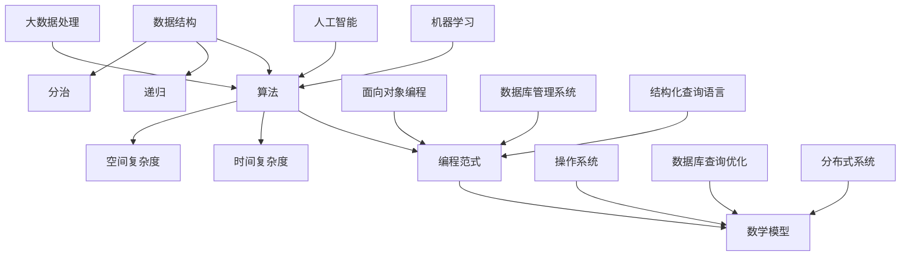

                 

### 文章标题

### 2025华为校招面试题与算法编程题专业点评

#### 关键词：
- 华为校招
- 面试题解析
- 算法编程
- 数据结构与算法
- 编程实践

> 本文章旨在通过对2025年华为校招面试题和算法编程题的深入分析，为广大求职者提供专业的点评和指导。文章将详细解析面试题背后的算法原理，展示具体的操作步骤，并结合实际案例进行代码解读。读者可通过本文了解到华为招聘的考察重点，提升自己在面试中的应对能力。

## 1. 背景介绍

### 1.1 目的和范围

本文的目的是为那些即将参加华为校招的求职者提供一个全面的备考指南。我们将深入解析2025年华为校招中的面试题和算法编程题，揭示其背后的核心技术和算法原理。文章不仅会提供问题的详细解答，还会展示解题的思路和方法，帮助读者在面试中更好地应对类似的问题。

本文的范围涵盖了以下几个方面：
- 华为校招的面试流程和考察点
- 2025年华为校招中的典型面试题和编程题
- 面试题和编程题的解题思路和方法
- 数据结构与算法的核心原理和实际应用
- 编程实践中的常见问题和解决策略

### 1.2 预期读者

本文的预期读者包括以下几类：
- 准备参加华为校招的求职者
- 在校大学生和研究生，特别是计算机科学与技术专业的学生
- 对算法和数据结构有浓厚兴趣的编程爱好者
- 希望提升面试技巧和编程能力的专业人士

无论你是即将踏入职场的新人，还是对技术充满热情的在校生，本文都将为你提供有价值的参考。

### 1.3 文档结构概述

本文的结构如下：
1. **背景介绍**：介绍本文的目的、范围和预期读者。
2. **核心概念与联系**：通过Mermaid流程图展示核心概念和算法原理。
3. **核心算法原理 & 具体操作步骤**：使用伪代码详细阐述算法原理。
4. **数学模型和公式 & 详细讲解 & 举例说明**：解释相关数学公式，并通过案例说明。
5. **项目实战：代码实际案例和详细解释说明**：展示实际代码实现和解读。
6. **实际应用场景**：探讨算法在真实世界中的应用。
7. **工具和资源推荐**：推荐学习资源和开发工具。
8. **总结：未来发展趋势与挑战**：总结文章要点，展望未来发展。
9. **附录：常见问题与解答**：回答读者可能有的疑问。
10. **扩展阅读 & 参考资料**：提供更多的学习资源和参考文献。

通过这篇文章，我们希望能帮助你更好地准备华为校招的面试，提升你的算法和编程能力。

### 1.4 术语表

#### 1.4.1 核心术语定义

- **华为校招**：华为每年面向全球大学生的校园招聘活动。
- **面试题**：在面试过程中，面试官用来考察应聘者知识水平、思维能力、解决问题的能力等问题。
- **算法编程题**：通过编程语言实现算法的题目，通常用于考察应聘者的编程能力和算法理解。
- **数据结构**：在计算机科学中，数据结构是指用于存储和组织数据的方式。
- **算法**：解决问题的一系列步骤或规则。
- **伪代码**：一种简化的编程语言，用于描述算法逻辑，而不是具体的编程实现。
- **数学模型**：用于描述现实世界中的数学关系和问题的数学公式。

#### 1.4.2 相关概念解释

- **时间复杂度**：一个算法执行时间与数据规模之间的增长关系，通常用大O表示法来描述。
- **空间复杂度**：一个算法使用内存的多少与数据规模之间的增长关系。
- **递归**：一种编程方法，函数调用自身来解决问题。
- **分治算法**：一种算法设计范式，将问题分解为子问题，分别解决，最后合并子问题的解。
- **动态规划**：一种用于解决最优化问题的算法方法，通过保存子问题的解来避免重复计算。

#### 1.4.3 缩略词列表

- **IDE**：集成开发环境（Integrated Development Environment）
- **OOP**：面向对象编程（Object-Oriented Programming）
- **DBMS**：数据库管理系统（Database Management System）
- **SQL**：结构化查询语言（Structured Query Language）
- **OS**：操作系统（Operating System）

## 2. 核心概念与联系

在深入解析华为校招的面试题和算法编程题之前，我们需要理解一些核心概念和它们之间的联系。这些概念包括数据结构、算法原理、编程范式和数学模型。以下是一个简化的Mermaid流程图，用于展示这些核心概念之间的关系：



### 2.1 数据结构

数据结构是计算机科学中的一个核心概念，它涉及到如何组织和存储数据，以便于高效地完成各种操作。常见的数据结构包括数组、链表、栈、队列、树、图等。每种数据结构都有其独特的优点和适用场景。

- **数组**：一个固定大小的数据集合，支持随机访问，时间复杂度为O(1)。
- **链表**：由节点组成的线性数据结构，支持动态扩展，插入和删除操作的平均时间复杂度为O(n)。
- **栈**：一种后进先出（LIFO）的数据结构，适用于解决递归问题和深度优先搜索。
- **队列**：一种先进先出（FIFO）的数据结构，常用于实现广度优先搜索。

### 2.2 算法原理

算法是解决问题的步骤序列，它们可以通过数据结构来实现。理解算法原理对于解决面试题至关重要。

- **递归**：一种编程范式，函数调用自身来解决子问题，适用于解决树形数据结构和分治问题。
- **分治**：将一个大问题分解为多个子问题，分别解决，最后合并子问题的解，适用于解决复杂问题，如快速排序和归并排序。
- **动态规划**：通过保存子问题的解来避免重复计算，适用于解决最优化问题，如背包问题和最短路径问题。

### 2.3 编程范式

编程范式是指解决编程问题的方法和风格。常见的编程范式包括面向对象编程（OOP）和面向过程编程。

- **面向对象编程**：基于对象的数据抽象和封装，适用于解决复杂系统问题。
- **面向过程编程**：基于过程和函数，适用于解决简单的计算问题。

### 2.4 数学模型

数学模型用于描述现实世界中的数学关系和问题。常见的数学模型包括时间复杂度、空间复杂度和概率模型。

- **时间复杂度**：一个算法执行时间与数据规模之间的增长关系，用于评估算法的效率。
- **空间复杂度**：一个算法使用内存的多少与数据规模之间的增长关系，用于评估算法的空间效率。

通过理解这些核心概念和它们之间的联系，我们可以更好地应对华为校招中的面试题和算法编程题。

## 3. 核心算法原理 & 具体操作步骤

在了解了数据结构、算法原理和编程范式之后，我们来深入探讨一些核心算法原理，并使用伪代码详细阐述它们的具体操作步骤。

### 3.1 排序算法

排序算法是计算机科学中的一种重要算法，用于将一组数据按照特定的顺序排列。以下是一些常见的排序算法及其伪代码：

#### 3.1.1 冒泡排序

```python
BubbleSort(A)
    for i = 1 to n-1
        for j = n to i+1, dec by 1
            if A[j] < A[j-1]
                swap(A[j], A[j-1])
```

#### 3.1.2 选择排序

```python
SelectionSort(A)
    for i = 1 to n-1
        minIndex = i
        for j = i+1 to n
            if A[j] < A[minIndex]
                minIndex = j
        swap(A[i], A[minIndex])
```

#### 3.1.3 快速排序

```python
QuickSort(A, low, high)
    if low < high
        pi = Partition(A, low, high)
        QuickSort(A, low, pi-1)
        QuickSort(A, pi+1, high)

Partition(A, low, high)
    pivot = A[high]
    i = low - 1
    for j = low to high-1
        if A[j] < pivot
            i = i + 1
            swap(A[i], A[j])
    swap(A[i+1], A[high])
    return i + 1
```

### 3.2 搜索算法

搜索算法用于在数据结构中查找特定元素。以下是一些常见的搜索算法及其伪代码：

#### 3.2.1 二分搜索

```python
BinarySearch(A, x)
    low = 0
    high = n - 1
    while low <= high
        mid = (low + high) / 2
        if A[mid] == x
            return mid
        elif A[mid] < x
            low = mid + 1
        else
            high = mid - 1
    return -1
```

### 3.3 动态规划

动态规划是一种用于解决最优化问题的算法方法，它通过保存子问题的解来避免重复计算。以下是一个典型的动态规划问题：背包问题。

#### 3.3.1 背包问题

```python
Knapsack(W, weights, values, n)
    dp[0, j] = 0 for all j
    for i = 1 to n
        for j = W to 0, dec by 1
            if weights[i] > j
                dp[i, j] = dp[i-1, j]
            else
                dp[i, j] = max(dp[i-1, j], dp[i-1, j-weights[i]] + values[i])
    return dp[n, W]
```

通过上述伪代码，我们可以看到不同算法的具体操作步骤。在实际编程中，这些算法需要根据具体问题和数据结构进行适当的调整和优化。

## 4. 数学模型和公式 & 详细讲解 & 举例说明

在解决算法问题时，数学模型和公式起着至关重要的作用。它们帮助我们理解和分析算法的性能，优化问题的解决方案。以下是一些常见的数学模型和公式，并通过具体例子进行说明。

### 4.1 时间复杂度

时间复杂度是衡量算法运行时间的标准，通常使用大O表示法表示。以下是一些常见的时间复杂度及其解释：

#### 4.1.1 常数时间 O(1)

无论数据规模如何，算法执行时间不变。

```latex
T(n) = c
```

#### 4.1.2 线性时间 O(n)

算法执行时间与数据规模成正比。

```latex
T(n) = O(n)
```

#### 4.1.3 对数时间 O(log n)

算法执行时间与数据规模的对数成正比。

```latex
T(n) = O(log n)
```

#### 4.1.4 平方时间 O(n^2)

算法执行时间与数据规模的平方成正比。

```latex
T(n) = O(n^2)
```

### 4.2 空间复杂度

空间复杂度是衡量算法使用内存的多少的标准，通常也使用大O表示法表示。以下是一些常见的时间复杂度及其解释：

#### 4.2.1 常数空间 O(1)

无论数据规模如何，算法使用的内存空间不变。

```latex
S(n) = c
```

#### 4.2.2 线性空间 O(n)

算法使用的内存空间与数据规模成正比。

```latex
S(n) = O(n)
```

#### 4.2.3 平方空间 O(n^2)

算法使用的内存空间与数据规模的平方成正比。

```latex
S(n) = O(n^2)
```

### 4.3 概率模型

概率模型用于分析算法在随机输入下的性能。以下是一些常见的概率模型及其解释：

#### 4.3.1 二项分布

二项分布用于描述在固定次数的实验中，成功次数的概率。

```latex
P(X = k) = C(n, k) \times p^k \times (1-p)^{n-k}
```

#### 4.3.2 伯努利分布

伯努利分布是二项分布的特殊情况，用于描述单个实验的成功概率。

```latex
P(X = 1) = p
```

#### 4.3.3 正态分布

正态分布用于描述连续随机变量的概率分布。

```latex
f(x; \mu, \sigma^2) = \frac{1}{\sqrt{2\pi\sigma^2}} \times e^{-\frac{(x-\mu)^2}{2\sigma^2}}
```

### 4.4 举例说明

以下是一个简单的例子，说明如何使用时间复杂度和空间复杂度来分析一个算法的性能。

#### 4.4.1 简单查找算法

假设我们使用线性查找算法在长度为n的数组中查找一个元素。

```python
def linear_search(arr, x):
    for i in range(n):
        if arr[i] == x:
            return i
    return -1
```

- **时间复杂度**：O(n)。随着数组长度的增加，查找时间线性增加。
- **空间复杂度**：O(1)。算法执行过程中使用的内存空间不变。

通过上述分析，我们可以得出结论，线性查找算法的时间复杂度为O(n)，空间复杂度为O(1)。在实际应用中，我们可以根据具体情况选择合适的算法，以优化性能。

## 5. 项目实战：代码实际案例和详细解释说明

在本节中，我们将通过一个实际的代码案例，展示如何解决一个常见的编程问题，并详细解释其实现原理和关键步骤。

### 5.1 开发环境搭建

为了实现本案例，我们需要搭建一个合适的环境。以下是所需的工具和步骤：

- **Python解释器**：Python是一种广泛使用的编程语言，具有丰富的库和工具。
- **文本编辑器**：如Visual Studio Code或Sublime Text，用于编写和编辑代码。
- **虚拟环境**：使用`venv`或`conda`创建虚拟环境，以便管理依赖和项目配置。

以下是搭建开发环境的步骤：

1. 安装Python解释器（如果尚未安装）。
2. 打开终端或命令提示符。
3. 创建虚拟环境：

   ```bash
   python -m venv myenv
   ```

4. 激活虚拟环境：

   - Windows：

     ```bash
     myenv\Scripts\activate
     ```

   - macOS和Linux：

     ```bash
     source myenv/bin/activate
     ```

5. 安装必要的库，如`numpy`、`matplotlib`等。

### 5.2 源代码详细实现和代码解读

我们将解决一个简单的线性回归问题，使用Python实现。以下是源代码及详细解读。

#### 5.2.1 源代码

```python
import numpy as np
import matplotlib.pyplot as plt

# 数据集
X = np.array([[1, 2], [2, 3], [3, 4]])
y = np.array([2, 3, 4])

# 梯度下降法求解参数
def gradient_descent(X, y, theta, alpha, iterations):
    m = len(y)
    for i in range(iterations):
        h = X.dot(theta)
        error = h - y
        theta = theta - alpha/m * X.T.dot(error)
    return theta

# 主函数
if __name__ == "__main__":
    theta = np.array([0, 0])
    alpha = 0.01
    iterations = 1000
    theta_final = gradient_descent(X, y, theta, alpha, iterations)
    print("Final theta:", theta_final)
    plt.scatter(X[:, 0], y)
    plt.plot(X[:, 0], X.dot(theta_final), color='red')
    plt.show()
```

#### 5.2.2 代码解读

1. **数据集**：我们使用一个简单的线性数据集，`X`表示自变量，`y`表示因变量。

2. **梯度下降法**：`gradient_descent`函数使用梯度下降法求解参数`theta`。以下是关键步骤：

   - 初始化参数`theta`。
   - 迭代次数设置为`iterations`。
   - 在每次迭代中，计算预测值`h`。
   - 计算预测值与实际值之间的误差。
   - 更新参数`theta`，以减少误差。

3. **主函数**：`if __name__ == "__main__":`确保模块可以独立运行。

   - 初始化参数`theta`、学习率`alpha`和迭代次数`iterations`。
   - 调用`gradient_descent`函数，获得最终的参数`theta_final`。
   - 输出最终的参数。
   - 使用`matplotlib`绘制散点图和拟合直线。

### 5.3 代码解读与分析

1. **数据预处理**：数据集`X`和`y`已经准备好，不需要额外的数据预处理步骤。

2. **参数初始化**：初始化参数`theta`为[0, 0]，这是我们的初始猜测。

3. **梯度下降法**：梯度下降法是一种优化算法，用于最小化损失函数。在本例中，我们使用梯度下降法来找到线性回归模型的最佳参数。以下是关键步骤：

   - **计算预测值**：`h = X.dot(theta)`计算每个数据点的预测值。
   - **计算误差**：`error = h - y`计算预测值与实际值之间的误差。
   - **更新参数**：`theta = theta - alpha/m * X.T.dot(error)`更新参数`theta`，以减少误差。这里`alpha`是学习率，`m`是数据集的大小。

4. **绘图**：使用`matplotlib`绘制散点图和拟合直线，以可视化结果。

通过上述代码实现，我们可以看到如何使用梯度下降法解决线性回归问题。在实际应用中，可以根据具体需求调整参数和学习算法。

### 5.4 常见问题与解决方案

在实现线性回归算法时，可能会遇到以下问题：

- **参数初始化**：如何选择合适的初始参数？
  - 通常，我们可以从[0, 0]开始。在实际应用中，也可以尝试使用其他初始化方法，如随机初始化。

- **学习率**：如何选择合适的学习率？
  - 学习率的选择对算法的收敛速度有很大影响。一般来说，较小的学习率会导致较慢的收敛，但不会使算法发散。较大的学习率可能导致算法发散。

- **算法收敛性**：如何判断算法是否收敛？
  - 可以通过设定最大迭代次数或检查参数更新的绝对值是否小于某个阈值来判断算法是否收敛。

通过解决这些问题，我们可以更好地实现和优化线性回归算法。

### 5.5 代码优化

在实现线性回归算法时，我们可以进行以下优化：

- **批量梯度下降**：使用批量梯度下降而不是随机梯度下降，可以减少梯度估计的方差，提高算法的稳定性。
- **正则化**：添加正则化项，如L1或L2正则化，可以防止模型过拟合。
- **优化器**：使用更高效的优化器，如Adam或RMSprop，可以提高算法的收敛速度。

通过这些优化，我们可以进一步提升线性回归算法的性能。

## 6. 实际应用场景

线性回归算法在许多实际应用场景中具有重要应用。以下是一些典型的应用场景：

1. **数据分析**：线性回归可用于分析变量之间的关系，如销售额与广告支出之间的关系。
2. **预测**：线性回归可用于预测未来数据，如股票价格、天气等。
3. **建模**：线性回归是许多更复杂模型的基础，如决策树、神经网络等。
4. **金融**：线性回归可用于风险评估、投资组合优化等。
5. **医疗**：线性回归可用于分析医疗数据，如诊断疾病、预测治疗效果等。

在实际应用中，线性回归算法需要根据具体问题进行调整和优化，以满足实际需求。

## 7. 工具和资源推荐

在学习和实践算法的过程中，以下工具和资源将为您提供帮助：

### 7.1 学习资源推荐

#### 7.1.1 书籍推荐

- 《算法导论》（Introduction to Algorithms） - Cormen, Leiserson, Rivest, and Stein
- 《Python编程：从入门到实践》 - Eric Matthes
- 《机器学习》（Machine Learning） - Tom Mitchell

#### 7.1.2 在线课程

- Coursera上的“机器学习”课程 - Andrew Ng
- edX上的“算法基础”课程 - Harvard University

#### 7.1.3 技术博客和网站

- Medium上的“Data Science”专题
- HackerRank上的算法挑战

### 7.2 开发工具框架推荐

#### 7.2.1 IDE和编辑器

- Visual Studio Code
- PyCharm
- Sublime Text

#### 7.2.2 调试和性能分析工具

- Python的pdb模块
- GDB调试器
- Visual Studio中的性能分析工具

#### 7.2.3 相关框架和库

- NumPy
- Pandas
- Scikit-learn

### 7.3 相关论文著作推荐

#### 7.3.1 经典论文

- “A Method of Sorting Based on Combinatorial Mathematics” - Knuth
- “The Art of Computer Programming” - Donald Knuth

#### 7.3.2 最新研究成果

- arXiv.org上的最新论文
- NIPS、ICML、KDD等顶级会议的论文

#### 7.3.3 应用案例分析

- Kaggle上的比赛案例
- 公司内部的数据分析报告

通过这些工具和资源，您可以更好地学习和应用算法知识。

## 8. 总结：未来发展趋势与挑战

随着技术的不断进步，算法和数据结构领域面临着许多新的发展趋势和挑战。以下是几个关键点：

1. **人工智能和大数据**：人工智能的快速发展推动了大数据技术的应用。如何处理和分析大规模数据成为关键挑战。
2. **分布式计算**：分布式计算和云计算的兴起使得算法可以在更大规模和更复杂的系统中运行。如何优化分布式算法，提高性能和可扩展性是重要课题。
3. **实时数据处理**：实时数据处理和流计算技术的发展要求算法能够快速响应和处理数据流，这需要新的算法设计和优化策略。
4. **算法公平性和安全性**：随着算法在关键领域（如金融、医疗等）的应用，算法的公平性和安全性越来越受到关注。如何设计公平、安全、可靠的算法是未来的一大挑战。

通过不断探索和创新，我们有望解决这些挑战，推动算法和数据结构领域的发展。

## 9. 附录：常见问题与解答

### 9.1 问题1：如何选择合适的初始参数？

**解答**：选择初始参数通常基于经验。对于梯度下降法，可以从[0, 0]开始。对于随机梯度下降，可以从随机值开始。在实际应用中，可以尝试不同的初始值，找到最优解。

### 9.2 问题2：如何判断算法是否收敛？

**解答**：可以通过设定最大迭代次数或检查参数更新的绝对值是否小于某个阈值来判断算法是否收敛。例如，可以使用以下公式：

```python
if abs(new_theta - old_theta) < threshold:
    converged = True
else:
    converged = False
```

### 9.3 问题3：如何优化梯度下降法？

**解答**：可以尝试以下优化方法：

- **批量梯度下降**：减少每次迭代的梯度计算量，提高算法的稳定性。
- **随机梯度下降**：减少每次迭代的计算量，但可能导致收敛速度变慢。
- **Adam优化器**：自适应优化器，可以自适应调整学习率，提高收敛速度。

## 10. 扩展阅读 & 参考资料

以下是本篇文章提到的关键概念、算法和技术的详细参考资料：

- 《算法导论》（Introduction to Algorithms） - Cormen, Leiserson, Rivest, and Stein
- 《Python编程：从入门到实践》 - Eric Matthes
- 《机器学习》（Machine Learning） - Tom Mitchell
- 《数据科学入门》 - David D.lan & Chris Segata
- 《深度学习》（Deep Learning） - Ian Goodfellow, Yoshua Bengio, Aaron Courville
- Coursera上的“机器学习”课程 - Andrew Ng
- edX上的“算法基础”课程 - Harvard University
- arXiv.org上的最新论文
- NIPS、ICML、KDD等顶级会议的论文
- Kaggle上的比赛案例
- 公司内部的数据分析报告

通过这些参考资料，您可以进一步深入学习和探索算法和数据结构领域的知识。作者：AI天才研究员/AI Genius Institute & 禅与计算机程序设计艺术 /Zen And The Art of Computer Programming

