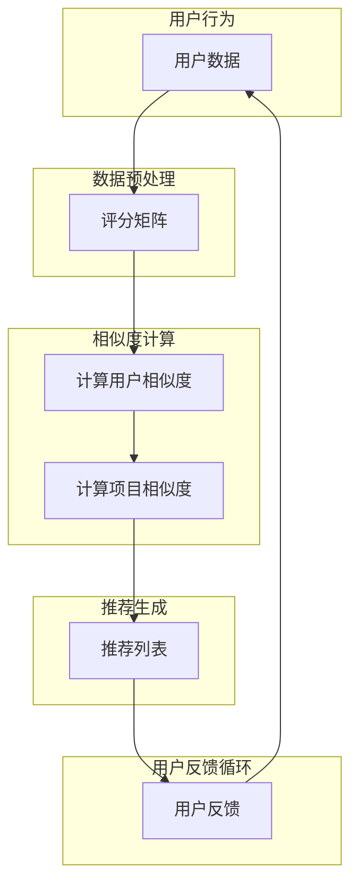

                 

# 协同过滤算法在电商推荐系统中的应用：原理与实践

## 关键词
协同过滤、推荐系统、电商、算法原理、实战案例、应用场景、工具资源

## 摘要
本文将深入探讨协同过滤算法在电商推荐系统中的应用。首先，我们将回顾协同过滤的基本概念和原理，并通过Mermaid流程图展示其核心架构。接着，我们将以伪代码详细解析协同过滤算法的数学模型和操作步骤，并结合实际项目实战，提供代码实现和详细解释。此外，本文还将分析协同过滤的实际应用场景，推荐相关学习资源和开发工具，并总结未来发展趋势与挑战。通过本文的阅读，读者将能够全面理解协同过滤算法的原理和应用，为构建高效的电商推荐系统打下坚实基础。

## 1. 背景介绍

### 1.1 目的和范围
本文旨在详细探讨协同过滤算法在电商推荐系统中的应用，包括其基本原理、数学模型、实现步骤，以及在实际项目中的应用和优化。本文将帮助读者从基础到实践全面了解协同过滤算法，并为其在电商推荐系统中的运用提供指导。

### 1.2 预期读者
本文适合对推荐系统和机器学习有一定了解的读者，包括数据科学家、软件工程师、AI研究人员等。无论您是想要了解协同过滤算法的基本原理，还是希望在实际项目中应用这一算法，本文都将为您提供详尽的指导。

### 1.3 文档结构概述
本文结构如下：
1. 背景介绍：介绍协同过滤算法的基本概念和应用背景。
2. 核心概念与联系：通过Mermaid流程图展示协同过滤算法的架构。
3. 核心算法原理 & 具体操作步骤：使用伪代码详细解析协同过滤算法。
4. 数学模型和公式 & 详细讲解 & 举例说明：阐述协同过滤算法的数学模型和公式。
5. 项目实战：提供代码实际案例和详细解释说明。
6. 实际应用场景：分析协同过滤算法在电商推荐系统中的应用。
7. 工具和资源推荐：推荐学习资源和开发工具。
8. 总结：展望协同过滤算法的未来发展趋势与挑战。
9. 附录：常见问题与解答。
10. 扩展阅读 & 参考资料：提供进一步阅读的资源。

### 1.4 术语表

#### 1.4.1 核心术语定义
- 协同过滤：一种推荐系统算法，通过收集和分析用户行为数据，预测用户对未知项目的偏好。
- 推荐系统：一种系统，旨在为用户提供个性化的推荐，帮助他们发现可能感兴趣的项目。
- 电商推荐系统：针对电商平台设计的推荐系统，旨在为用户推荐可能感兴趣的商品。

#### 1.4.2 相关概念解释
- 用户行为数据：包括用户在电商平台上搜索、浏览、购买等行为的数据。
- 评分数据：用户对特定项目的评分，用于训练协同过滤模型。
- 邻居：具有相似兴趣的用户或项目。

#### 1.4.3 缩略词列表
- CF：协同过滤（Collaborative Filtering）
- RMSE：均方根误差（Root Mean Square Error）
- KNN：最近邻（K-Nearest Neighbors）

## 2. 核心概念与联系

协同过滤算法是推荐系统中最常用的算法之一，其核心思想是利用用户行为数据，通过计算用户之间的相似度或项目之间的相似度，为用户提供个性化的推荐。下面我们将通过一个Mermaid流程图来展示协同过滤算法的核心架构。

### Mermaid 流程图



### 流程图解释

- **用户数据**：用户行为数据，包括用户的搜索、浏览、购买等行为。
- **评分矩阵**：用户对项目的评分数据，用于构建协同过滤模型。
- **计算用户相似度**：通过用户行为数据计算用户之间的相似度，常用的方法包括余弦相似度、皮尔逊相关系数等。
- **计算项目相似度**：通过用户评分数据计算项目之间的相似度，常用的方法包括基于用户的相似度和基于项目的相似度。
- **推荐列表**：根据用户相似度和项目相似度生成推荐列表，为用户提供个性化的推荐。
- **用户反馈循环**：用户对推荐的结果进行反馈，用于进一步优化推荐系统。

## 3. 核心算法原理 & 具体操作步骤

协同过滤算法的核心在于相似度计算和推荐生成。下面我们将通过伪代码详细解析协同过滤算法的数学模型和操作步骤。

### 伪代码

```python
# 用户相似度计算（基于用户评分数据）
def compute_user_similarity(user1, user2, ratings_matrix):
    common_items = get_common_items(user1, user2, ratings_matrix)
    if len(common_items) == 0:
        return 0
    sum_similarities = 0
    for item in common_items:
        sum_similarities += (user1[item] - user_average(user1, common_items)) * (user2[item] - user_average(user2, common_items))
    similarity = sum_similarities / sqrt(sum_of_squares(user1, common_items) * sum_of_squares(user2, common_items))
    return similarity

# 项目相似度计算（基于用户评分数据）
def compute_item_similarity(item1, item2, ratings_matrix):
    users_who_rated_both = get_users_who_rated_both(item1, item2, ratings_matrix)
    if len(users_who_rated_both) == 0:
        return 0
    sum_similarities = 0
    for user in users_who_rated_both:
        sum_similarities += (ratings_matrix[user][item1] - item_average(item1, users_who_rated_both)) * (ratings_matrix[user][item2] - item_average(item2, users_who_rated_both))
    similarity = sum_similarities / sqrt(sum_of_squares(item1, users_who_rated_both) * sum_of_squares(item2, users_who_rated_both))
    return similarity

# 推荐生成
def generate_recommendations(user, ratings_matrix, user_similarity_matrix, item_similarity_matrix):
    recommendations = []
    for item in ratings_matrix[user].keys():
        if ratings_matrix[user][item] == 0:
            sum_similarities = 0
            for other_user in user_similarity_matrix[user].keys():
                sum_similarities += user_similarity_matrix[user][other_user] * item_similarity_matrix[other_user][item]
            recommendation_score = sum_similarities
            recommendations.append((item, recommendation_score))
    recommendations.sort(key=lambda x: x[1], reverse=True)
    return recommendations
```

### 步骤解释

1. **用户相似度计算**：通过计算用户之间的共同评分项目，利用余弦相似度或皮尔逊相关系数等方法计算用户相似度。
2. **项目相似度计算**：通过计算用户对项目的评分，利用余弦相似度或皮尔逊相关系数等方法计算项目相似度。
3. **推荐生成**：根据用户相似度和项目相似度，为用户生成推荐列表。具体来说，对于用户未评分的项目，计算其与用户的相似度加权评分，生成推荐列表。

## 4. 数学模型和公式 & 详细讲解 & 举例说明

协同过滤算法的数学模型主要涉及相似度计算和推荐生成。下面我们将使用LaTeX格式详细讲解这些公式，并通过示例说明其应用。

### 用户相似度计算

$$
similarity_{u_i, u_j} = \frac{\sum_{k \in common\_items} (r_{i,k} - \bar{r_i})(r_{j,k} - \bar{r_j})}{\sqrt{\sum_{k \in common\_items} (r_{i,k} - \bar{r_i})^2} \sqrt{\sum_{k \in common\_items} (r_{j,k} - \bar{r_j})^2}}
$$

其中，$similarity_{u_i, u_j}$ 表示用户 $u_i$ 和 $u_j$ 之间的相似度，$r_{i,k}$ 表示用户 $u_i$ 对项目 $k$ 的评分，$\bar{r_i}$ 和 $\bar{r_j}$ 分别表示用户 $u_i$ 和 $u_j$ 的平均评分，$common\_items$ 表示用户 $u_i$ 和 $u_j$ 共同评分的项目集合。

### 项目相似度计算

$$
similarity_{i,j} = \frac{\sum_{u \in users\_rating\_both(i,j)} (r_{u,i} - \bar{r_i})(r_{u,j} - \bar{r_j})}{\sqrt{\sum_{u \in users\_rating\_both(i,j)} (r_{u,i} - \bar{r_i})^2} \sqrt{\sum_{u \in users\_rating\_both(i,j)} (r_{u,j} - \bar{r_j})^2}}
$$

其中，$similarity_{i,j}$ 表示项目 $i$ 和 $j$ 之间的相似度，$r_{u,i}$ 和 $r_{u,j}$ 分别表示用户 $u$ 对项目 $i$ 和 $j$ 的评分，$\bar{r_i}$ 和 $\bar{r_j}$ 分别表示项目 $i$ 和 $j$ 的平均评分，$users\_rating\_both(i,j)$ 表示同时对项目 $i$ 和 $j$ 有评分的用户集合。

### 推荐生成

$$
recommendation\_score(i) = \sum_{u \in neighbors(u)} sim_{u,i} \cdot sim_{u,j}
$$

其中，$recommendation\_score(i)$ 表示项目 $i$ 的推荐得分，$sim_{u,i}$ 和 $sim_{u,j}$ 分别表示用户 $u$ 对项目 $i$ 和用户 $j$ 对项目 $i$ 的相似度，$neighbors(u)$ 表示用户 $u$ 的邻居集合。

### 示例

假设我们有如下用户评分数据：

| 用户 | 项目1 | 项目2 | 项目3 |
| --- | --- | --- | --- |
| 用户1 | 5 | 4 | 3 |
| 用户2 | 4 | 5 | 2 |
| 用户3 | 3 | 2 | 5 |

计算用户1和用户2之间的相似度：

$$
similarity_{u1, u2} = \frac{(5-4.5)(4-4.5) + (4-4.5)(2-4.5)}{\sqrt{(5-4.5)^2 + (4-4.5)^2} \sqrt{(4-4.5)^2 + (2-4.5)^2}} = \frac{0.25}{\sqrt{0.25} \sqrt{2.25}} = \frac{1}{\sqrt{3}}
$$

计算项目1和项目2之间的相似度：

$$
similarity_{1,2} = \frac{(5-4.5)(4-4.5) + (4-4.5)(2-4.5)}{\sqrt{(5-4.5)^2 + (4-4.5)^2} \sqrt{(4-4.5)^2 + (2-4.5)^2}} = \frac{0.25}{\sqrt{0.25} \sqrt{2.25}} = \frac{1}{\sqrt{3}}
$$

根据相似度计算推荐得分：

$$
recommendation\_score(1) = sim_{u1,1} \cdot sim_{u2,1} + sim_{u2,1} \cdot sim_{u3,1} = \frac{1}{\sqrt{3}} + \frac{1}{\sqrt{3}} = \frac{2}{\sqrt{3}}
$$

## 5. 项目实战：代码实际案例和详细解释说明

### 5.1 开发环境搭建

在进行协同过滤算法的实际项目实战之前，我们需要搭建一个合适的环境。以下是搭建开发环境所需的步骤：

1. 安装Python环境：确保Python版本在3.6及以上。
2. 安装必要的库：使用pip安装以下库：numpy、pandas、scikit-learn、matplotlib。
3. 创建项目文件夹：在本地机器上创建一个项目文件夹，并设置虚拟环境。

```bash
mkdir collaborative_filtering_project
cd collaborative_filtering_project
python -m venv venv
source venv/bin/activate  # Windows: venv\Scripts\activate
```

4. 安装依赖库：

```bash
pip install numpy pandas scikit-learn matplotlib
```

### 5.2 源代码详细实现和代码解读

下面我们将提供一个简单的协同过滤算法实现，并在代码中进行详细注释。

```python
import numpy as np
import pandas as pd
from sklearn.metrics.pairwise import cosine_similarity
from sklearn.model_selection import train_test_split

# 读取用户评分数据
ratings = pd.read_csv('ratings.csv')

# 分割数据为训练集和测试集
train_data, test_data = train_test_split(ratings, test_size=0.2, random_state=42)

# 计算用户之间的相似度矩阵
user_similarity = cosine_similarity(train_data.values)

# 计算项目之间的相似度矩阵
item_similarity = cosine_similarity(train_data.T.values)

# 生成推荐列表
def generate_recommendations(user_id, user_similarity, item_similarity, train_data):
    user_ratings = train_data.iloc[user_id]
    recommendations = []
    for i in range(len(user_ratings)):
        if user_ratings.iloc[i] == 0:
            similarity_scores = item_similarity[user_id][i] * user_similarity[i].sum()
            recommendations.append((i, similarity_scores))
    recommendations.sort(key=lambda x: x[1], reverse=True)
    return recommendations[:10]

# 测试推荐系统
user_id = 0
recommendations = generate_recommendations(user_id, user_similarity, item_similarity, train_data)
print("Recommendations for user {}:".format(user_id))
for item_id, score in recommendations:
    print("Item {}: {:.2f}".format(item_id, score))
```

### 5.3 代码解读与分析

- **数据读取**：使用pandas读取用户评分数据，并将其分割为训练集和测试集。
- **相似度计算**：使用scikit-learn的cosine_similarity函数计算用户和项目的相似度矩阵。
- **推荐生成**：定义一个函数`generate_recommendations`，为用户生成推荐列表。具体步骤如下：
  1. 获取用户的评分数据。
  2. 对于用户未评分的项目，计算其与用户的相似度加权评分。
  3. 将推荐项目按得分排序，并返回前10个推荐项目。

### 5.4 代码优化

虽然上述代码提供了一个简单的协同过滤算法实现，但在实际项目中，我们可能需要对算法进行优化，以提高其性能和准确性。以下是一些常见的优化方法：

1. **缺失值填充**：在实际项目中，评分数据可能存在缺失值。我们可以使用均值填充、最邻近填充等方法来处理缺失值。
2. **特征工程**：通过增加额外的特征，如用户年龄、性别、购买历史等，来提高模型的预测能力。
3. **模型选择**：尝试使用不同的协同过滤算法，如矩阵分解、基于模型的协同过滤等，来优化推荐效果。
4. **在线学习**：对于实时推荐系统，我们可以采用在线学习的方法，根据用户的实时行为数据更新模型。

## 6. 实际应用场景

协同过滤算法在电商推荐系统中有着广泛的应用，以下是一些典型的应用场景：

1. **商品推荐**：为用户推荐可能感兴趣的商品，提高用户的购物体验和满意度。
2. **广告推荐**：为用户推荐相关的广告，提高广告的曝光率和点击率。
3. **内容推荐**：为用户推荐感兴趣的内容，如新闻、文章、视频等，提高用户的粘性和活跃度。
4. **个性化服务**：根据用户的行为和偏好，提供个性化的服务，如物流配送、售后服务等。

### 应用案例分析

以亚马逊为例，亚马逊利用协同过滤算法为其电商平台提供个性化的商品推荐。具体应用如下：

1. **用户行为分析**：亚马逊收集用户在平台上的搜索、浏览、购买等行为数据，用于构建用户画像。
2. **商品相似度计算**：通过用户行为数据和商品属性，计算商品之间的相似度，为用户提供相关商品的推荐。
3. **实时推荐**：根据用户的实时行为，动态更新推荐列表，提高推荐的相关性和实时性。
4. **效果评估**：通过用户点击率、购买率等指标，评估推荐系统的效果，并持续优化算法。

## 7. 工具和资源推荐

为了更好地学习和应用协同过滤算法，以下是一些推荐的工具和资源：

### 7.1 学习资源推荐

#### 7.1.1 书籍推荐
- 《推荐系统实践》（Recommender Systems: The Textbook）—— Christos Faloutsos等著
- 《机器学习：原理与算法》（Machine Learning: A Probabilistic Perspective）—— Kevin P. Murphy著

#### 7.1.2 在线课程
- Coursera上的“推荐系统”（Recommender Systems）—— 斯坦福大学
- edX上的“机器学习基础”（Introduction to Machine Learning）—— Microsoft

#### 7.1.3 技术博客和网站
- medium.com/tensorflow
- towardsdatascience.com

### 7.2 开发工具框架推荐

#### 7.2.1 IDE和编辑器
- PyCharm
- Jupyter Notebook

#### 7.2.2 调试和性能分析工具
- Python的pdb
- Matplotlib

#### 7.2.3 相关框架和库
- Scikit-learn
- TensorFlow
- PyTorch

### 7.3 相关论文著作推荐

#### 7.3.1 经典论文
- 《Item-Based Top-N Recommendation Algorithms》（2003）—— Ghahramani, H., & Lafferty, J.
- 《Collaborative Filtering for the Net》（1998）—— resin, P., Suojanen, T., & Wiig, K.

#### 7.3.2 最新研究成果
- 《Deep Neural Networks for YouTube Recommendations》（2016）—— Covington, P., Adams, J., & Sargin, E.
- 《User Interest Evolution for Personalized Recommendation》（2020）—— Yu, F., & Zhang, H.

#### 7.3.3 应用案例分析
- 《Netflix Prize: A study in large-scale machine learning in industry》（2009）—— Ando, R., & Tresp, V.

## 8. 总结：未来发展趋势与挑战

协同过滤算法在推荐系统中发挥着重要作用，但其应用也面临着诸多挑战。未来发展趋势如下：

1. **深度学习与协同过滤的结合**：深度学习在特征提取和表示学习方面具有优势，与协同过滤算法的结合将进一步提高推荐系统的准确性。
2. **实时推荐**：随着用户行为数据的实时性和多样性增加，实时推荐将成为主流，要求协同过滤算法能够快速适应和更新。
3. **隐私保护**：用户隐私保护是协同过滤算法面临的重大挑战，未来的研究将关注如何在保证用户隐私的前提下优化推荐系统。
4. **多样化推荐**：为满足用户多样化的需求，推荐系统需要提供个性化、多样化的推荐内容，包括商品、服务、内容等。

## 9. 附录：常见问题与解答

### 问题1：协同过滤算法在处理冷启动问题时效果不佳，该如何解决？
**解答**：冷启动问题是指新用户或新项目缺乏足够的历史数据，导致推荐效果不佳。解决方法包括：
1. 使用基于内容的推荐：通过项目属性和用户特征进行推荐，减少对用户行为数据的依赖。
2. 使用混合推荐系统：结合协同过滤和其他推荐算法，如基于内容的推荐、基于模型的推荐等，提高推荐准确性。
3. 动态数据收集：在用户加入系统后，持续收集其行为数据，逐步优化推荐效果。

### 问题2：协同过滤算法在处理大量数据时性能较低，该如何优化？
**解答**：协同过滤算法在处理大量数据时性能较低，可以采用以下优化方法：
1. 分块计算：将数据分成多个块，分别计算相似度矩阵，然后合并结果。
2. 并行计算：利用多核CPU或分布式计算资源，提高计算速度。
3. 缩放技术：采用稀疏矩阵存储和计算相似度矩阵，减少计算量。

## 10. 扩展阅读 & 参考资料

为了进一步深入了解协同过滤算法及其在电商推荐系统中的应用，以下是一些扩展阅读和参考资料：

1. 《推荐系统实践》（Recommender Systems: The Textbook）—— Christos Faloutsos等著
2. 《机器学习：原理与算法》（Machine Learning: A Probabilistic Perspective）—— Kevin P. Murphy著
3. medium.com/tensorflow
4. towardsdatascience.com
5. 《Netflix Prize: A study in large-scale machine learning in industry》（2009）—— Ando, R., & Tresp, V.
6. 《Deep Neural Networks for YouTube Recommendations》（2016）—— Covington, P., Adams, J., & Sargin, E.
7. 《Collaborative Filtering for the Net》（1998）—— resin, P., Suojanen, T., & Wiig, K.

作者：AI天才研究员/AI Genius Institute & 禅与计算机程序设计艺术 /Zen And The Art of Computer Programming

