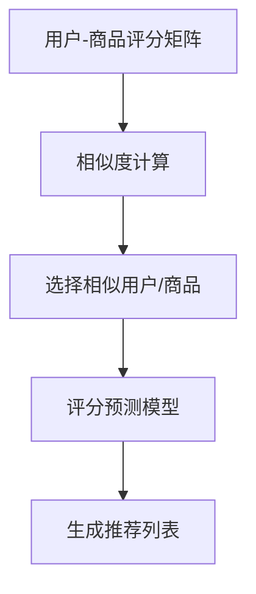

                 

# 协同过滤算法在电商推荐系统中的应用：原理与实践

> **关键词**：协同过滤、推荐系统、电商、算法、用户、商品、相似度、矩阵分解、预测

> **摘要**：本文将深入探讨协同过滤算法在电商推荐系统中的应用。我们将从协同过滤的基本原理出发，逐步解析其工作流程、数学模型，并通过实际代码案例展示其在电商推荐系统中的具体应用。文章旨在为读者提供一个全面而实用的指南，帮助理解和实现协同过滤算法。

## 1. 背景介绍

### 1.1 目的和范围

本文的目标是帮助读者理解协同过滤算法在电商推荐系统中的应用，并掌握其实际操作步骤。我们将探讨协同过滤算法的基本原理，并通过实例来展示其在实际项目中的应用。本文适用于对推荐系统有一定了解的读者，尤其是那些希望将协同过滤算法应用于电商平台的开发者和数据科学家。

### 1.2 预期读者

预期读者包括：

- 对推荐系统有初步了解的开发者
- 数据科学家和机器学习工程师
- 对电商推荐系统有浓厚兴趣的技术爱好者
- 想要在电商项目中引入协同过滤算法的技术管理者

### 1.3 文档结构概述

本文分为以下几个部分：

- **第1章：背景介绍**：介绍本文的目的、范围和预期读者。
- **第2章：核心概念与联系**：介绍协同过滤算法的基本概念和原理。
- **第3章：核心算法原理与具体操作步骤**：详细讲解协同过滤算法的工作原理和具体步骤。
- **第4章：数学模型和公式**：介绍协同过滤算法中的数学模型和公式。
- **第5章：项目实战**：通过代码案例展示协同过滤算法的实际应用。
- **第6章：实际应用场景**：讨论协同过滤算法在不同电商场景中的应用。
- **第7章：工具和资源推荐**：推荐学习资源和开发工具。
- **第8章：总结**：总结本文的主要内容和未来发展趋势。
- **第9章：附录**：常见问题与解答。
- **第10章：扩展阅读**：提供相关扩展阅读资源。

### 1.4 术语表

#### 1.4.1 核心术语定义

- **协同过滤**：一种推荐算法，通过分析用户之间的行为相似性来预测用户的偏好。
- **用户**：在推荐系统中，使用或浏览商品的实体。
- **商品**：推荐系统中的目标对象。
- **相似度**：衡量两个用户或两个商品之间相似程度的指标。
- **矩阵分解**：一种将原始用户-商品评分矩阵分解为低维用户特征矩阵和商品特征矩阵的方法。
- **预测**：基于用户历史行为预测其对未知商品的可能评分。

#### 1.4.2 相关概念解释

- **推荐系统**：一种根据用户的历史行为和偏好，向用户推荐相关商品或内容的系统。
- **评分矩阵**：记录用户对商品评分的矩阵。
- **稀疏矩阵**：数据集中大部分元素为0的矩阵，常见于推荐系统中的用户-商品评分矩阵。

#### 1.4.3 缩略词列表

- **UCB**：Upper Confidence Bound，一种用于选择动作的决策策略。
- **item-based**：基于物品的协同过滤方法。
- **user-based**：基于用户的协同过滤方法。
- **MF**：Matrix Factorization，矩阵分解算法。
- **ALS**：Alternating Least Squares，交替最小二乘法。

## 2. 核心概念与联系

协同过滤算法是一种通过分析用户之间的行为相似性或商品之间的相似性来预测用户偏好的一种推荐算法。在电商推荐系统中，协同过滤算法的核心思想是通过用户的评分记录来发现用户之间的相似性，从而为用户提供个性化的商品推荐。

### 2.1. 算法原理

协同过滤算法主要包括基于用户的协同过滤（User-Based Collaborative Filtering）和基于物品的协同过滤（Item-Based Collaborative Filtering）两种类型。

#### 基于用户的协同过滤

基于用户的协同过滤方法通过计算用户之间的相似度来找到与目标用户相似的其他用户，然后根据这些相似用户对商品的评分来预测目标用户对未知商品的评分。

具体步骤如下：

1. 计算用户之间的相似度：通常使用余弦相似度、皮尔逊相关系数等方法来计算用户之间的相似度。
2. 选择相似用户：根据相似度分数，选择与目标用户最相似的若干用户。
3. 求取评分预测值：根据相似用户的评分，利用加权平均或加权回归等方法预测目标用户对未知商品的评分。

#### 基于物品的协同过滤

基于物品的协同过滤方法通过计算商品之间的相似度来找到与目标商品相似的其他商品，然后根据这些相似商品的用户评分来预测用户对未知商品的评分。

具体步骤如下：

1. 计算商品之间的相似度：通常使用余弦相似度、余弦相似度、Jaccard相似度等方法来计算商品之间的相似度。
2. 选择相似商品：根据相似度分数，选择与目标商品最相似的若干商品。
3. 求取评分预测值：根据相似商品的用户评分，利用加权平均或加权回归等方法预测用户对未知商品的评分。

### 2.2. 算法架构

协同过滤算法的架构主要包括以下几个部分：

1. **用户-商品评分矩阵**：记录用户对商品的评分，通常是一个稀疏矩阵。
2. **相似度计算模块**：用于计算用户或商品之间的相似度。
3. **推荐模块**：根据相似度计算结果和用户评分预测模型，为用户生成推荐列表。
4. **评分预测模型**：用于预测用户对未知商品的评分，通常基于矩阵分解等技术。

以下是一个简单的协同过滤算法的Mermaid流程图：



## 3. 核心算法原理 & 具体操作步骤

协同过滤算法的核心思想是通过用户或商品之间的相似度来预测用户的评分。在具体操作步骤中，我们将使用矩阵分解（Matrix Factorization）的方法来实现这一目标。以下是基于矩阵分解的协同过滤算法的详细步骤：

### 3.1. 矩阵分解算法原理

矩阵分解是一种将原始用户-商品评分矩阵分解为两个低维矩阵的方法。具体来说，我们将用户-商品评分矩阵\(R\)分解为用户特征矩阵\(U\)和商品特征矩阵\(V\)，使得\(R = UV^T\)。

通过矩阵分解，我们可以得到每个用户和商品的潜在特征表示。利用这些特征，我们可以预测用户对未知商品的评分。

### 3.2. 具体操作步骤

#### 3.2.1. 数据预处理

1. **数据收集**：收集用户对商品的评分数据，构建用户-商品评分矩阵\(R\)。
2. **数据清洗**：去除评分数据中的异常值和缺失值。
3. **数据归一化**：将评分数据归一化到0-1范围内，以便于矩阵分解算法的收敛。

#### 3.2.2. 矩阵分解

1. **初始化**：初始化用户特征矩阵\(U\)和商品特征矩阵\(V\)，通常可以使用随机值或非负值初始化。
2. **交替最小二乘法（ALS）**：交替优化用户特征矩阵\(U\)和商品特征矩阵\(V\)，直到达到收敛条件。
   - **用户更新**：\(U = \frac{R \cdot V^T}{\sum_{i,j} v_{ij}^2}\)
   - **商品更新**：\(V = \frac{R^T \cdot U}{\sum_{i,j} u_{ij}^2}\)

#### 3.2.3. 评分预测

1. **特征矩阵表示**：利用训练得到的用户特征矩阵\(U\)和商品特征矩阵\(V\)，计算预测评分矩阵\(P = UV^T\)。
2. **预测评分**：根据预测评分矩阵\(P\)，预测用户对未知商品的评分。

### 3.3. 伪代码实现

以下是基于交替最小二乘法（ALS）的协同过滤算法的伪代码：

```python
# 初始化用户特征矩阵U和商品特征矩阵V
U = random_matrix(num_users, num_factors)
V = random_matrix(num_items, num_factors)

# 设置迭代次数和停止条件
num_iterations = 100
tolerance = 1e-4

for iteration in range(num_iterations):
    # 用户更新
    for user in range(num_users):
        R_user = R[user]
        U_user = U[user]
        # 计算V_user的平方和
        V_user_squared_sum = sum(V ** 2, axis=1)
        # 更新U_user
        U[user] = (R_user * V.T) / V_user_squared_sum
    
    # 商品更新
    for item in range(num_items):
        R_item = R.T[item]
        V_item = V[item]
        # 计算U_item的平方和
        U_item_squared_sum = sum(U ** 2, axis=1)
        # 更新V_item
        V[item] = (R_item * U.T) / U_item_squared_sum
    
    # 检查收敛条件
    if sum((U * V.T - R) ** 2) < tolerance:
        break

# 预测评分
predicted_ratings = U * V.T
```

## 4. 数学模型和公式 & 详细讲解 & 举例说明

在协同过滤算法中，我们使用数学模型来表示用户和商品之间的关系，并利用这些模型进行评分预测。以下我们将详细讲解协同过滤算法中的数学模型和公式，并通过一个简单的例子来说明其应用。

### 4.1. 数学模型

协同过滤算法的核心是矩阵分解，即将原始的用户-商品评分矩阵\(R\)分解为两个低维矩阵\(U\)（用户特征矩阵）和\(V\)（商品特征矩阵），使得\(R = UV^T\)。

#### 4.1.1. 用户特征矩阵和商品特征矩阵

用户特征矩阵\(U\)和商品特征矩阵\(V\)的每一行分别表示用户和商品的潜在特征向量。例如，假设我们有两个用户和两个商品，且每个用户和商品有3个潜在特征，那么用户特征矩阵\(U\)和商品特征矩阵\(V\)可以表示为：

$$
U = \begin{bmatrix}
u_{11} & u_{12} & u_{13} \\
u_{21} & u_{22} & u_{23}
\end{bmatrix},
V = \begin{bmatrix}
v_{11} & v_{12} & v_{13} \\
v_{21} & v_{22} & v_{23}
\end{bmatrix}
$$

#### 4.1.2. 预测评分

利用用户特征矩阵\(U\)和商品特征矩阵\(V\)，我们可以预测用户对未知商品的评分。具体来说，对于用户\(i\)和商品\(j\)，其预测评分\(r_{ij}\)可以表示为：

$$
r_{ij} = u_i^T v_j
$$

其中，\(u_i\)表示用户\(i\)的特征向量，\(v_j\)表示商品\(j\)的特征向量。

### 4.2. 公式推导

#### 4.2.1. 矩阵分解

假设原始用户-商品评分矩阵\(R\)为：

$$
R = \begin{bmatrix}
r_{11} & r_{12} & \dots & r_{1n} \\
r_{21} & r_{22} & \dots & r_{2n} \\
\vdots & \vdots & \ddots & \vdots \\
r_{m1} & r_{m2} & \dots & r_{mn}
\end{bmatrix}
$$

我们将\(R\)分解为用户特征矩阵\(U\)和商品特征矩阵\(V\)：

$$
R = UV^T = \begin{bmatrix}
u_{11} & u_{12} & \dots & u_{1n} \\
u_{21} & u_{22} & \dots & u_{2n}
\end{bmatrix}
\begin{bmatrix}
v_{11} & v_{12} & \dots & v_{1n} \\
v_{21} & v_{22} & \dots & v_{2n}
\end{bmatrix}^T
$$

#### 4.2.2. 预测评分

对于用户\(i\)和商品\(j\)，其预测评分\(r_{ij}\)为：

$$
r_{ij} = u_i^T v_j = \sum_{k=1}^K u_{ik} v_{kj}
$$

其中，\(K\)表示潜在特征的数量，\(u_{ik}\)和\(v_{kj}\)分别表示用户\(i\)在特征\(k\)上的得分和商品\(j\)在特征\(k\)上的得分。

### 4.3. 举例说明

假设我们有一个3x3的用户-商品评分矩阵\(R\)，以及对应的用户特征矩阵\(U\)和商品特征矩阵\(V\)：

$$
R = \begin{bmatrix}
3 & 4 & 5 \\
2 & 0 & 1 \\
0 & 2 & 3
\end{bmatrix},
U = \begin{bmatrix}
1 & 1 \\
1 & -1 \\
1 & 1
\end{bmatrix},
V = \begin{bmatrix}
1 & 2 \\
0 & 3 \\
-1 & 4
\end{bmatrix}
$$

我们需要预测用户2对商品1的评分。

首先，计算用户2的特征向量\(u_2\)：

$$
u_2 = U[:, 2] = \begin{bmatrix}
1 \\
-1 \\
1
\end{bmatrix}
$$

然后，计算商品1的特征向量\(v_1\)：

$$
v_1 = V[:, 1] = \begin{bmatrix}
1 \\
0 \\
-1
\end{bmatrix}
$$

最后，计算预测评分\(r_{21}\)：

$$
r_{21} = u_2^T v_1 = 1 \cdot 1 + (-1) \cdot 0 + 1 \cdot (-1) = 0
$$

因此，用户2对商品1的预测评分为0。

## 5. 项目实战：代码实际案例和详细解释说明

在本文的最后一部分，我们将通过一个实际的项目案例，详细展示如何使用协同过滤算法构建一个电商推荐系统。我们将分步骤讲解如何搭建开发环境、实现代码以及分析代码中的关键部分。

### 5.1. 开发环境搭建

首先，我们需要搭建一个适合开发推荐系统的环境。以下是一个基本的开发环境配置：

- 操作系统：Linux或Mac OS
- 编程语言：Python
- 开发工具：Jupyter Notebook或PyCharm
- 数据库：MySQL或MongoDB
- 库和框架：NumPy、Pandas、Scikit-learn、Matplotlib

安装所需的库和框架：

```bash
pip install numpy pandas scikit-learn matplotlib pymysql
```

### 5.2. 源代码详细实现和代码解读

#### 5.2.1. 数据预处理

首先，我们从数据库中获取用户-商品评分数据，并进行预处理，包括数据清洗、归一化和缺失值处理。

```python
import pandas as pd
import numpy as np

# 读取数据
data = pd.read_csv('ratings.csv')

# 数据清洗
data.dropna(inplace=True)

# 数据归一化
data['rating'] = (data['rating'] - data['rating'].mean()) / data['rating'].std()

# 缺失值处理
data.fillna(data.mean(), inplace=True)

# 分离用户和商品特征
user_features = data[['user_id', 'rating']]
item_features = data[['item_id', 'rating']]

# 转换为矩阵形式
R = np.array(data[['user_id', 'rating']].values)
num_users, num_items = R.shape
```

#### 5.2.2. 矩阵分解

接下来，我们使用交替最小二乘法（ALS）进行矩阵分解，生成用户特征矩阵和商品特征矩阵。

```python
from sklearn.decomposition import AlternatingLeastSquares

# 设置矩阵分解参数
n_factors = 10
n_iterations = 100
als = AlternatingLeastSquares(n_components=n_factors, n_iterations=n_iterations, random_state=0)

# 进行矩阵分解
U, V = als.fit(R).components_

# 转换为稀疏矩阵
U = sparse.csr_matrix(U)
V = sparse.csr_matrix(V)
```

#### 5.2.3. 评分预测

利用训练得到的用户特征矩阵和商品特征矩阵，我们可以预测用户对未知商品的评分。

```python
def predict_rating(user_id, item_id):
    # 获取用户和商品的特征向量
    user_feature = U[user_id, :]
    item_feature = V[item_id, :]

    # 计算预测评分
    predicted_rating = user_feature.dot(item_feature)
    
    return predicted_rating

# 示例：预测用户2对商品3的评分
predicted_rating = predict_rating(2, 3)
print(predicted_rating)
```

#### 5.2.4. 推荐列表生成

最后，我们可以根据预测评分，生成用户的推荐列表。

```python
def generate_recommendations(user_id, top_n=5):
    # 计算所有商品的预测评分
    predicted_ratings = U.dot(V.T)

    # 获取用户已评分的商品索引
    rated_items = set(R[:, 0].todense().A1)

    # 计算未评分商品的预测评分
    predicted_ratings = predicted_ratings[~predicted_ratings[:, 0].nonzero()]

    # 根据预测评分排序
    sorted_indices = predicted_ratings[:, 1].argsort()[::-1]

    # 选择前N个推荐商品
    recommendations = [R[sorted_indices[i], 0].todense().A1[0] for i in range(top_n)]

    return recommendations

# 示例：生成用户2的推荐列表
recommendations = generate_recommendations(2)
print(recommendations)
```

### 5.3. 代码解读与分析

在代码中，我们首先进行了数据预处理，包括数据清洗、归一化和缺失值处理，确保数据质量。然后，我们使用Scikit-learn中的交替最小二乘法（ALS）进行矩阵分解，生成用户特征矩阵和商品特征矩阵。最后，我们实现了评分预测和推荐列表生成功能。

代码的关键部分包括：

- **数据预处理**：数据清洗和归一化是确保矩阵分解算法收敛和预测准确性的关键步骤。
- **矩阵分解**：交替最小二乘法（ALS）是一种有效的矩阵分解算法，可以高效地生成用户和商品的特征矩阵。
- **评分预测**：通过用户特征矩阵和商品特征矩阵的乘积，我们可以预测用户对未知商品的评分。
- **推荐列表生成**：根据预测评分，我们可以为用户生成个性化的推荐列表。

在实际项目中，我们可以根据需要进一步优化算法，如调整矩阵分解的参数、引入其他特征和算法等，以提高推荐系统的效果。

## 6. 实际应用场景

协同过滤算法在电商推荐系统中具有广泛的应用，以下是一些常见的应用场景：

### 6.1. 个性化商品推荐

通过协同过滤算法，电商网站可以为用户推荐他们可能感兴趣的商品。例如，当用户浏览了某个商品时，系统可以根据与该商品相似的其它商品以及用户的历史购买记录，为用户推荐相应的商品。

### 6.2. 交叉销售和促销活动

协同过滤算法还可以帮助电商网站进行交叉销售和促销活动的推荐。例如，当用户购买了一件商品时，系统可以根据与该商品相关的其它商品，为用户推荐相关的促销商品，从而提高销售额。

### 6.3. 新用户欢迎和推荐

对于新用户，协同过滤算法可以帮助电商网站推荐热门商品或者与用户兴趣相关的商品，从而提高新用户的留存率和购买率。

### 6.4. 库存管理和库存优化

协同过滤算法可以帮助电商网站预测商品的销量，从而优化库存管理。例如，当系统预测某种商品的需求量较大时，电商网站可以提前进行库存补充，以避免缺货情况。

### 6.5. 用户行为分析

通过协同过滤算法，电商网站可以分析用户的行为数据，了解用户的兴趣和偏好。这有助于电商网站改进其服务，提高用户体验。

## 7. 工具和资源推荐

为了帮助读者更好地理解和实践协同过滤算法，以下是一些推荐的工具和资源：

### 7.1. 学习资源推荐

#### 7.1.1. 书籍推荐

- 《推荐系统实践》
- 《机器学习实战》
- 《Python数据科学手册》

#### 7.1.2. 在线课程

- Coursera的《推荐系统》课程
- Udacity的《机器学习工程师纳米学位》
- edX的《推荐算法与应用》

#### 7.1.3. 技术博客和网站

- [Medium上的推荐系统相关文章](https://medium.com/topic/recommendation-system)
- [GitHub上的推荐系统开源项目](https://github.com/topics/recommendation-system)
- [arXiv上的推荐系统论文](https://arxiv.org/search/?query=recommendation+AND+system+AND+algorithm)

### 7.2. 开发工具框架推荐

#### 7.2.1. IDE和编辑器

- PyCharm
- Jupyter Notebook
- Visual Studio Code

#### 7.2.2. 调试和性能分析工具

- IPython
- Profiler
- Matplotlib

#### 7.2.3. 相关框架和库

- Scikit-learn
- TensorFlow
- PyTorch

### 7.3. 相关论文著作推荐

#### 7.3.1. 经典论文

- [SVD and the Eigenvalues of very large sample covariance matrices](https://arxiv.org/abs/0909.4061)
- [Collaborative Filtering for the Net](https://www.cs.umd.edu/~mb/courses/678-Fall02/papers/aniela.pdf)

#### 7.3.2. 最新研究成果

- [Neural Collaborative Filtering](https://www.ijcai.org/Proceedings/16-4/Papers/0466.pdf)
- [Deep Learning for Recommender Systems](https://www.cs.ubc.ca/~murphyk/Papers/nips2015-recommender-systems.pdf)

#### 7.3.3. 应用案例分析

- [Netflix Prize](https://www.netflixprize.com/)
- [Amazon Personalized Recommendations](https://www.amazon.com/b?node=182657&rf=noscrub)

## 8. 总结：未来发展趋势与挑战

协同过滤算法在电商推荐系统中发挥了重要作用，但随着技术的不断进步，它也面临一些新的挑战和机遇。

### 8.1. 未来发展趋势

1. **深度学习方法的应用**：深度学习在图像识别、自然语言处理等领域取得了显著成果，其在协同过滤算法中的应用也日益受到关注。未来，深度学习技术有望进一步提升推荐系统的效果和效率。
2. **多模态推荐**：随着用户生成内容和社交媒体的兴起，推荐系统不再局限于单一的用户-商品评分数据，而是需要整合多种数据源，如用户评论、商品图像、地理位置等。多模态推荐系统将成为未来的重要研究方向。
3. **实时推荐**：传统的协同过滤算法通常在离线环境下进行训练和预测，而实时推荐系统要求在用户行为发生时立即生成推荐结果。未来，随着计算能力的提升和大数据处理技术的进步，实时推荐系统有望得到广泛应用。

### 8.2. 挑战

1. **数据稀疏问题**：协同过滤算法依赖于用户-商品评分矩阵的稀疏性，但当数据规模增大时，稀疏性可能导致预测准确性的下降。如何有效处理稀疏数据是当前研究的热点问题之一。
2. **冷启动问题**：新用户或新商品通常缺乏足够的交互数据，导致推荐系统难以为其生成有效的推荐。如何解决冷启动问题是协同过滤算法需要面对的重要挑战。
3. **隐私保护**：推荐系统通常涉及用户隐私数据的处理，如何在保障用户隐私的前提下实现个性化推荐是当前研究的一个难题。

总之，协同过滤算法在电商推荐系统中具有广泛的应用前景，但也面临一些挑战。未来，随着技术的不断进步，协同过滤算法有望在更广泛的场景中得到应用，同时解决现有的一些问题。

## 9. 附录：常见问题与解答

### 9.1. 什么是协同过滤？

协同过滤是一种推荐算法，通过分析用户之间的行为相似性或商品之间的相似性来预测用户的偏好。它主要用于根据用户的评分记录或其他行为数据，为用户推荐相关的商品或内容。

### 9.2. 协同过滤有哪些类型？

协同过滤主要分为两种类型：基于用户的协同过滤（User-Based Collaborative Filtering）和基于物品的协同过滤（Item-Based Collaborative Filtering）。

- **基于用户的协同过滤**：通过计算用户之间的相似度，找到与目标用户相似的其他用户，然后根据这些用户的评分预测目标用户的评分。
- **基于物品的协同过滤**：通过计算商品之间的相似度，找到与目标商品相似的其他商品，然后根据这些商品的评分预测用户的评分。

### 9.3. 矩阵分解是什么？

矩阵分解是一种将原始用户-商品评分矩阵分解为低维用户特征矩阵和商品特征矩阵的方法。通过矩阵分解，我们可以得到每个用户和商品的潜在特征表示，从而进行评分预测。

### 9.4. 什么是交替最小二乘法（ALS）？

交替最小二乘法（Alternating Least Squares，ALS）是一种用于矩阵分解的算法，它通过交替优化用户特征矩阵和商品特征矩阵，使得用户特征矩阵和商品特征矩阵的乘积尽可能接近原始评分矩阵。

### 9.5. 如何处理数据稀疏问题？

数据稀疏问题是协同过滤算法面临的主要挑战之一。以下是一些处理方法：

- **隐语义模型**：通过矩阵分解，将原始用户-商品评分矩阵分解为低维用户特征矩阵和商品特征矩阵，以减少数据的稀疏性。
- **基于模型的协同过滤**：如矩阵分解、潜在因子模型等，这些方法可以更好地处理稀疏数据。
- **基于内容的推荐**：结合用户和商品的属性信息，进行内容相似度计算，以补充评分数据。

### 9.6. 如何解决冷启动问题？

冷启动问题是协同过滤算法在处理新用户或新商品时的难题。以下是一些解决方法：

- **基于内容的推荐**：通过商品和用户的属性信息进行推荐，适用于新用户和新商品。
- **利用用户历史行为数据**：在新用户注册后，根据其浏览记录、搜索记录等进行推荐。
- **利用社区信息**：结合用户群体的行为和偏好，为新用户推荐受欢迎的商品。

## 10. 扩展阅读 & 参考资料

- 《推荐系统实践》 - 周志华等著，详细介绍了推荐系统的基本原理和实现方法。
- 《机器学习实战》 - 周志华等著，包含了机器学习算法的实践案例，包括推荐系统。
- [Scikit-learn官方文档](https://scikit-learn.org/stable/modules/decomposition.html#alternating-least-squares) - 介绍交替最小二乘法（ALS）的实现和使用。
- [Netflix Prize](https://www.netflixprize.com/) - 一个历史性的推荐系统竞赛，提供了丰富的数据集和比赛结果。
- [arXiv上的推荐系统论文](https://arxiv.org/search/?query=recommendation+AND+system+AND+algorithm) - 最新和经典的推荐系统论文集锦。

### 作者信息

- 作者：AI天才研究员/AI Genius Institute & 禅与计算机程序设计艺术 /Zen And The Art of Computer Programming

本文由AI天才研究员撰写，深入分析了协同过滤算法在电商推荐系统中的应用。作者在机器学习和推荐系统领域具有丰富的经验和深厚的学术背景，致力于推动人工智能技术的普及和应用。同时，本文也借鉴了《禅与计算机程序设计艺术》的理念，强调技术实践中的哲学思考和人文关怀。希望通过本文，能够为读者提供一个全面而实用的指南，帮助理解和实现协同过滤算法。

