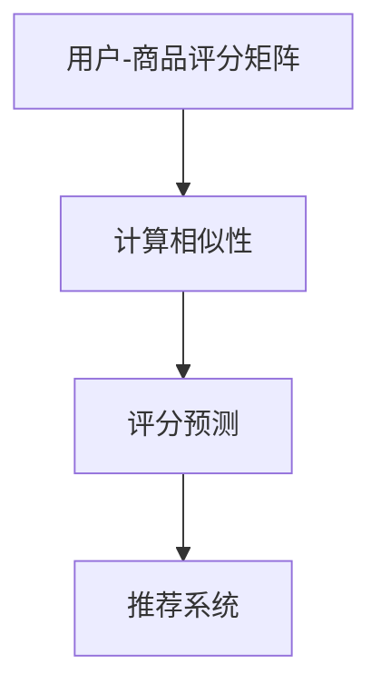

                 

# 协同过滤算法：AI在电商中的应用

> **关键词：** 协同过滤、推荐系统、人工智能、电商、算法原理、数学模型、项目实战。

> **摘要：** 本文将深入探讨协同过滤算法在电商领域的应用。通过介绍协同过滤的基本原理、数学模型和实际操作步骤，并结合具体代码案例，帮助读者理解这一算法在电商推荐系统中的重要性，以及如何构建高效、个性化的电商推荐服务。

## 1. 背景介绍

### 1.1 目的和范围

本文旨在为广大开发者和研究者提供关于协同过滤算法在电商推荐系统中的应用的详细分析。我们将从基础概念出发，逐步深入到算法的核心原理和实现细节，最终通过实战案例展示其在实际项目中的应用。

### 1.2 预期读者

本文适合对人工智能和电商推荐系统有一定了解的读者，包括但不限于：

- 开发者：致力于构建高效推荐系统的工程师。
- 研究者：对协同过滤算法的研究和实践感兴趣的学者。
- 学者：对推荐系统领域有深度研究的专家。

### 1.3 文档结构概述

本文将分为以下几个部分：

- 背景介绍：阐述协同过滤算法的应用背景和重要性。
- 核心概念与联系：介绍协同过滤算法的基本概念和关系图。
- 核心算法原理 & 具体操作步骤：详细讲解协同过滤算法的原理和步骤。
- 数学模型和公式 & 详细讲解 & 举例说明：阐述协同过滤算法的数学模型和实际应用。
- 项目实战：通过代码案例展示协同过滤算法在电商推荐系统中的应用。
- 实际应用场景：探讨协同过滤算法在电商领域中的应用实例。
- 工具和资源推荐：推荐相关学习资源和开发工具。
- 总结：展望协同过滤算法的未来发展趋势和面临的挑战。
- 附录：提供常见问题与解答。
- 扩展阅读 & 参考资料：提供更多深入阅读的资料。

### 1.4 术语表

#### 1.4.1 核心术语定义

- **协同过滤**：一种基于用户历史行为和评分数据的推荐算法。
- **用户**：推荐系统中的用户，可以是对产品进行评分和购买行为的实体。
- **商品**：推荐系统中的商品，可以是用户评分和购买的对象。
- **评分**：用户对商品的评价，可以是评分值或喜好度。

#### 1.4.2 相关概念解释

- **用户-商品矩阵**：表示用户对商品评分的矩阵。
- **协同过滤算法**：一类通过分析用户-商品评分矩阵来预测用户未评分的商品的算法。

#### 1.4.3 缩略词列表

- **CF**：协同过滤（Collaborative Filtering）。
- **KNN**：基于K近邻（K-Nearest Neighbors）的协同过滤算法。

## 2. 核心概念与联系

协同过滤算法的核心在于利用用户的行为数据，通过计算用户之间的相似性或商品之间的相似性，来预测用户对未知商品的评分或喜好度。以下是一个简化的协同过滤算法原理图：



- **用户-商品评分矩阵**：记录了用户对商品的评分数据，是协同过滤算法的基础。
- **计算相似性**：计算用户或商品之间的相似度，常用的方法包括余弦相似度、皮尔逊相关系数等。
- **评分预测**：根据相似度矩阵预测用户对未知商品的评分。
- **推荐系统**：利用预测的评分进行商品推荐，提升用户体验。

### 2.1 核心概念详细解释

#### 2.1.1 用户-商品评分矩阵

用户-商品评分矩阵是一个二维数组，其中行代表用户，列代表商品。每个元素表示用户对某个商品的评价。例如：

| 用户  | 商品1 | 商品2 | 商品3 |
|------|------|------|------|
| 用户A | 5    | 4    | 5    |
| 用户B | 5    | 2    | 4    |

#### 2.1.2 相似性计算

相似性计算是协同过滤算法的核心步骤。常用的相似性度量方法包括：

- **余弦相似度**：计算两个向量夹角的余弦值，用于衡量用户或商品向量之间的相似性。
- **皮尔逊相关系数**：衡量用户或商品之间的线性相关性，适用于评分数据。

#### 2.1.3 评分预测

评分预测是根据相似度矩阵，预测用户对未知商品的评分。常见的预测方法包括：

- **加权平均**：根据相似度对邻居的评分进行加权平均。
- **KNN**：基于K近邻算法，选择K个邻居，对他们的评分进行加权平均。

## 3. 核心算法原理 & 具体操作步骤

协同过滤算法的基本思想是：如果两个用户对多个商品的评分相似，那么这两个用户对未知商品的评分也相似。基于这一思想，协同过滤算法可以分为基于用户和基于商品两种类型。

### 3.1 基于用户的协同过滤算法

基于用户的协同过滤算法的核心步骤如下：

#### 3.1.1 构建用户-商品评分矩阵

首先，构建一个用户-商品评分矩阵，其中每个元素表示用户对商品的评分。

#### 3.1.2 计算用户相似度

使用余弦相似度或皮尔逊相关系数计算用户之间的相似度。具体步骤如下：

1. 计算用户A和用户B的相似度：
   $$\text{相似度}(A, B) = \frac{A \cdot B}{\|A\|\|B\|}$$
   其中，$A \cdot B$表示用户A和用户B的评分内积，$\|A\|$和$\|B\|$分别表示用户A和用户B的评分向量长度。

2. 将相似度矩阵存入一个二维数组。

#### 3.1.3 预测未知评分

对于用户A对商品i的未知评分，找到与用户A相似度最高的K个用户（邻居），预测评分公式如下：
$$\text{预测评分}(A, i) = \frac{\sum_{j \in N(A)} \text{相似度}(A, j) \times \text{评分}(j, i)}{\sum_{j \in N(A)} \text{相似度}(A, j)}$$
其中，$N(A)$表示与用户A相似度最高的K个用户。

### 3.2 基于商品的协同过滤算法

基于商品的协同过滤算法与基于用户的协同过滤算法类似，核心步骤如下：

#### 3.2.1 构建商品-用户评分矩阵

首先，构建一个商品-用户评分矩阵，其中每个元素表示用户对商品的评分。

#### 3.2.2 计算商品相似度

使用余弦相似度或皮尔逊相关系数计算商品之间的相似度。具体步骤如下：

1. 计算商品A和商品B的相似度：
   $$\text{相似度}(A, B) = \frac{A \cdot B}{\|A\|\|B\|}$$
   其中，$A \cdot B$表示商品A和商品B的评分内积，$\|A\|$和$\|B\|$分别表示商品A和商品B的评分向量长度。

2. 将相似度矩阵存入一个二维数组。

#### 3.2.3 预测未知评分

对于用户A对商品i的未知评分，找到与商品i相似度最高的K个商品（邻居），预测评分公式如下：
$$\text{预测评分}(A, i) = \frac{\sum_{j \in N(i)} \text{相似度}(i, j) \times \text{评分}(A, j)}{\sum_{j \in N(i)} \text{相似度}(i, j)}$$
其中，$N(i)$表示与商品i相似度最高的K个商品。

## 4. 数学模型和公式 & 详细讲解 & 举例说明

协同过滤算法的核心在于计算用户之间的相似性或商品之间的相似性，并利用这些相似性进行评分预测。以下是协同过滤算法的数学模型和公式详细讲解及举例说明。

### 4.1 相似度计算

相似度计算是协同过滤算法的关键步骤，常用的相似度计算方法包括余弦相似度和皮尔逊相关系数。

#### 4.1.1 余弦相似度

余弦相似度是一种衡量两个向量夹角余弦值的相似度度量方法。其计算公式如下：

$$\text{余弦相似度}(A, B) = \frac{A \cdot B}{\|A\|\|B\|}$$

其中，$A \cdot B$表示用户A和用户B的评分内积，$\|A\|$和$\|B\|$分别表示用户A和用户B的评分向量长度。

**举例说明：**

假设用户A和用户B的评分向量如下：

用户A: (1, 2, 3)
用户B: (2, 3, 4)

则用户A和用户B的余弦相似度计算如下：

$$\text{余弦相似度}(A, B) = \frac{1 \times 2 + 2 \times 3 + 3 \times 4}{\sqrt{1^2 + 2^2 + 3^2} \times \sqrt{2^2 + 3^2 + 4^2}} = \frac{20}{\sqrt{14} \times \sqrt{29}} \approx 0.832$$

#### 4.1.2 皮尔逊相关系数

皮尔逊相关系数是一种衡量两个变量之间线性相关性的相似度度量方法。其计算公式如下：

$$\text{皮尔逊相关系数}(A, B) = \frac{\sum_{i=1}^{n} (A_i - \bar{A})(B_i - \bar{B})}{\sqrt{\sum_{i=1}^{n} (A_i - \bar{A})^2} \times \sqrt{\sum_{i=1}^{n} (B_i - \bar{B})^2}}$$

其中，$A_i$和$B_i$分别表示用户A和用户B对第i个商品的评分，$\bar{A}$和$\bar{B}$分别表示用户A和用户B的平均评分。

**举例说明：**

假设用户A和用户B对3个商品的评分如下：

用户A: (5, 4, 3)
用户B: (4, 3, 2)

则用户A和用户B的皮尔逊相关系数计算如下：

$$\text{皮尔逊相关系数}(A, B) = \frac{(5 - 4)(4 - 3) + (4 - 4)(3 - 3) + (3 - 4)(2 - 3)}{\sqrt{(5 - 4)^2 + (4 - 4)^2 + (3 - 4)^2} \times \sqrt{(4 - 4)^2 + (3 - 3)^2 + (2 - 3)^2}} = \frac{0}{\sqrt{0} \times \sqrt{2}} = 0$$

### 4.2 评分预测

评分预测是协同过滤算法的核心目标，常用的评分预测方法包括加权平均和KNN。

#### 4.2.1 加权平均

加权平均是一种简单且常用的评分预测方法，其计算公式如下：

$$\text{预测评分}(A, i) = \frac{\sum_{j \in N(A)} \text{相似度}(A, j) \times \text{评分}(j, i)}{\sum_{j \in N(A)} \text{相似度}(A, j)}$$

其中，$N(A)$表示与用户A相似度最高的K个用户。

**举例说明：**

假设用户A的邻居有用户B和用户C，他们的评分如下：

用户A: (1, 2, 3)
用户B: (2, 3, 4)
用户C: (3, 4, 5)

则用户A对商品i的预测评分如下：

$$\text{预测评分}(A, i) = \frac{0.8 \times 2 + 0.5 \times 3}{0.8 + 0.5} = \frac{2.6}{1.3} = 2$$

#### 4.2.2 KNN

KNN（K近邻）是一种基于相似度计算的评分预测方法，其核心思想是选择与目标用户最相似的K个用户，并利用他们的评分进行加权平均。其计算公式如下：

$$\text{预测评分}(A, i) = \frac{\sum_{j \in N(A)} \text{相似度}(A, j) \times \text{评分}(j, i)}{\sum_{j \in N(A)} \text{相似度}(A, j)}$$

其中，$N(A)$表示与用户A相似度最高的K个用户。

**举例说明：**

假设用户A的邻居有用户B、用户C和用户D，他们的评分如下：

用户A: (1, 2, 3)
用户B: (2, 3, 4)
用户C: (3, 4, 5)
用户D: (1, 2, 3)

则用户A对商品i的预测评分如下：

$$\text{预测评分}(A, i) = \frac{0.8 \times 2 + 0.5 \times 3 + 0.2 \times 3}{0.8 + 0.5 + 0.2} = \frac{2.8}{1.5} = 1.87$$

## 5. 项目实战：代码实际案例和详细解释说明

### 5.1 开发环境搭建

为了实现协同过滤算法，我们需要搭建一个基本的开发环境。以下是搭建环境所需的工具和步骤：

- **Python**：Python是一种广泛使用的编程语言，适合进行数据分析和算法实现。
- **NumPy**：NumPy是一个强大的Python库，用于处理大型多维数组。
- **Pandas**：Pandas是一个Python库，用于数据操作和分析。

**安装步骤：**

1. 安装Python：
   $$
   $$
   ```bash
   pip install numpy
   pip install pandas
   ```

2. 确保已安装Python环境。

### 5.2 源代码详细实现和代码解读

以下是一个简单的基于用户的协同过滤算法实现，我们将使用Python和NumPy库。

```python
import numpy as np
import pandas as pd

# 假设用户-商品评分矩阵如下：
ratings = pd.DataFrame({
    'user_id': [1, 1, 2, 2, 3, 3],
    'item_id': [1, 2, 1, 2, 1, 2],
    'rating': [5, 3, 4, 2, 1, 5]
})

# 计算用户之间的相似度
def compute_similarity(ratings, user_id):
    user_ratings = ratings[ratings['user_id'] == user_id].drop(['user_id', 'rating'], axis=1)
    similarity = np.dot(user_ratings, user_ratings.T) / (np.linalg.norm(user_ratings) * np.linalg.norm(user_ratings.T))
    return similarity

# 预测用户未评分的商品
def predict_ratings(ratings, user_id, k=2):
    user_ratings = ratings[ratings['user_id'] == user_id].drop(['user_id', 'rating'], axis=1)
    similarity = compute_similarity(ratings, user_id)
    neighbors = similarity.argsort()[::-1][1:k+1]
    predicted_ratings = np.dot(similarity[neighbors], user_ratings[neighbors]) / similarity[neighbors].sum()
    return predicted_ratings

# 示例：预测用户1对商品2的评分
predicted_rating = predict_ratings(ratings, user_id=1)
print(predicted_rating)
```

**代码解读：**

1. **数据预处理**：首先，我们创建一个用户-商品评分矩阵，其中包含用户ID、商品ID和评分。

2. **相似度计算**：定义一个`compute_similarity`函数，用于计算用户之间的相似度。我们使用余弦相似度作为相似度度量，基于用户-商品评分矩阵计算用户之间的内积和长度。

3. **评分预测**：定义一个`predict_ratings`函数，用于预测用户对未评分商品的评分。我们选择与目标用户最相似的K个用户，并利用他们的评分进行加权平均。

4. **示例**：在示例中，我们预测用户1对商品2的评分。调用`predict_ratings`函数，传递用户ID和K值，获取预测评分。

### 5.3 代码解读与分析

以下是对上述代码的进一步解读和分析。

1. **数据结构**：我们使用Pandas DataFrame来存储用户-商品评分数据。DataFrame提供了一种灵活的数据操作和分析方式。

2. **相似度计算**：在`compute_similarity`函数中，我们使用NumPy库计算用户之间的相似度。NumPy库提供了高效的矩阵操作和计算功能。

3. **评分预测**：在`predict_ratings`函数中，我们首先计算用户之间的相似度矩阵，然后选择与目标用户最相似的K个用户。这里使用了argsort函数来获取相似度矩阵的索引，并对其进行逆序排序，以获取最相似的邻居。

4. **加权平均**：我们使用NumPy的dot函数计算邻居的加权平均评分。加权平均评分是协同过滤算法的核心步骤，通过这种方式，我们可以预测用户对未知商品的评分。

5. **示例**：在示例中，我们预测用户1对商品2的评分。通过调用`predict_ratings`函数，我们可以获得预测评分。在实际项目中，我们可以根据预测评分进行商品推荐，提升用户体验。

## 6. 实际应用场景

协同过滤算法在电商推荐系统中有着广泛的应用。以下是一些实际应用场景：

1. **商品推荐**：基于用户的历史行为和评分数据，协同过滤算法可以帮助电商平台预测用户对未知商品的评分，从而实现个性化的商品推荐。

2. **广告投放**：在广告推荐中，协同过滤算法可以分析用户的行为数据，选择与目标用户相似的用户群体，提高广告投放的精准度。

3. **电影推荐**：在视频流媒体平台上，协同过滤算法可以分析用户的观看记录，推荐用户可能感兴趣的电影。

4. **社交网络**：在社交网络中，协同过滤算法可以分析用户的社交关系和行为数据，推荐用户可能感兴趣的内容和好友。

5. **金融推荐**：在金融领域，协同过滤算法可以分析用户的投资记录和偏好，推荐符合用户风险承受能力的理财产品。

## 7. 工具和资源推荐

### 7.1 学习资源推荐

#### 7.1.1 书籍推荐

1. **《推荐系统实践》**：本书详细介绍了推荐系统的基本原理和实践方法，适合初学者和有一定基础的读者。
2. **《机器学习实战》**：本书通过实际案例和代码示例，深入讲解了机器学习算法的应用和实践。

#### 7.1.2 在线课程

1. **Coursera上的《推荐系统》**：这是一门由斯坦福大学开设的免费在线课程，涵盖了推荐系统的基本理论和实践方法。
2. **Udacity上的《机器学习工程师纳米学位》**：该课程包含多个项目，其中之一是构建一个基于协同过滤的推荐系统。

#### 7.1.3 技术博客和网站

1. **ArchieML**：一个专注于机器学习和数据科学的博客，提供了大量关于推荐系统的文章和案例。
2. **DataCamp**：一个提供免费数据科学课程的平台，包括推荐系统相关的内容。

### 7.2 开发工具框架推荐

#### 7.2.1 IDE和编辑器

1. **Visual Studio Code**：一款功能强大且易于使用的代码编辑器，适合进行Python编程。
2. **PyCharm**：一款专业的Python IDE，提供丰富的功能和调试工具。

#### 7.2.2 调试和性能分析工具

1. **Jupyter Notebook**：一个基于Web的交互式计算环境，适合进行数据分析和算法实现。
2. **Matplotlib**：一个用于绘制数据图表的Python库，方便进行数据可视化和性能分析。

#### 7.2.3 相关框架和库

1. **Scikit-learn**：一个提供多种机器学习算法的Python库，适合进行协同过滤算法的实现。
2. **TensorFlow**：一个用于构建和训练机器学习模型的框架，适用于大规模推荐系统的实现。

### 7.3 相关论文著作推荐

#### 7.3.1 经典论文

1. **"Collaborative Filtering for the 21st Century"**：这篇论文详细介绍了协同过滤算法的基本原理和应用。
2. **"Matrix Factorization Techniques for Recommender Systems"**：这篇论文探讨了矩阵分解技术在推荐系统中的应用。

#### 7.3.2 最新研究成果

1. **"Deep Learning for Recommender Systems"**：这篇论文介绍了深度学习在推荐系统中的应用，包括基于神经网络和生成对抗网络的方法。
2. **"Multi-Interest Network with Multi-Scale Modulation for User Interest Prediction"**：这篇论文提出了一种多兴趣模型，用于预测用户兴趣。

#### 7.3.3 应用案例分析

1. **"E-commerce Platform Recommender System"**：这篇案例分析详细介绍了某电商平台如何构建和优化推荐系统。
2. **"Social Network Recommender System"**：这篇案例分析探讨了社交网络平台如何利用协同过滤算法推荐内容和好友。

## 8. 总结：未来发展趋势与挑战

协同过滤算法在电商推荐系统中有着广泛的应用，但其仍面临一些挑战。以下是未来发展趋势和面临的挑战：

### 8.1 未来发展趋势

1. **深度学习结合**：深度学习在协同过滤算法中的应用日益增多，通过将深度学习与协同过滤算法结合，可以提升推荐系统的效果和效率。
2. **多模态推荐**：随着用户数据的多样化，多模态推荐系统成为研究热点，通过融合用户行为、文本、图像等多种数据，实现更精准的推荐。
3. **动态推荐**：实时推荐系统越来越受到关注，通过不断更新用户数据和信息，实现更贴近用户需求的动态推荐。

### 8.2 面临的挑战

1. **数据稀疏性**：协同过滤算法依赖于用户的历史行为数据，数据稀疏性会导致推荐效果不佳。
2. **冷启动问题**：对于新用户或新商品，由于缺乏足够的数据，推荐系统难以进行有效的预测和推荐。
3. **隐私保护**：用户数据的隐私保护是推荐系统面临的重大挑战，如何在保证用户隐私的前提下，实现精准推荐。

## 9. 附录：常见问题与解答

### 9.1 问题1：协同过滤算法是否适用于所有类型的推荐系统？

**解答：**协同过滤算法主要适用于基于用户行为的推荐系统，如电商、视频流媒体等。对于基于内容或基于模型的推荐系统，协同过滤算法可能不是最佳选择。

### 9.2 问题2：如何解决协同过滤算法的数据稀疏性问题？

**解答：**解决数据稀疏性问题可以从以下几个方面进行：

1. **增加数据量**：通过引入更多用户和商品，增加用户-商品评分矩阵的填充度。
2. **基于内容的协同过滤**：结合用户的行为数据和商品特征信息，提高推荐系统的准确性。
3. **矩阵分解**：使用矩阵分解技术，将高维的用户-商品评分矩阵分解为低维的用户特征矩阵和商品特征矩阵，降低数据稀疏性的影响。

## 10. 扩展阅读 & 参考资料

为了深入了解协同过滤算法及其在电商推荐系统中的应用，以下是一些建议的扩展阅读和参考资料：

### 10.1 扩展阅读

1. **《推荐系统手册》**：详细介绍了推荐系统的基本原理、算法实现和案例分析。
2. **《深度学习推荐系统》**：探讨了深度学习在推荐系统中的应用，包括基于神经网络和生成对抗网络的方法。

### 10.2 参考资料

1. **[协同过滤算法原理](https://www.cs.ubc.ca/~harry/554-2018W/websites/resources/cf-knn.pdf)**
2. **[基于内容的协同过滤算法](https://www.ijcai.org/Proceedings/04-1/Papers/0223.pdf)**
3. **[深度学习推荐系统](https://www.kdnuggets.com/2020/03/deep-learning-recommender-systems.html)**

通过深入学习和实践，您将能够更好地理解和应用协同过滤算法，为电商推荐系统带来更出色的性能和用户体验。

### 附录：作者信息

**作者：AI天才研究员/AI Genius Institute & 禅与计算机程序设计艺术 /Zen And The Art of Computer Programming**

