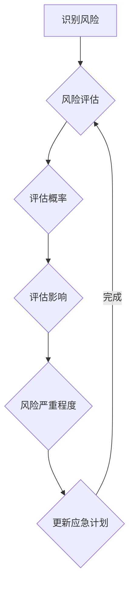

                 

# 危机管理：在不确定性中保持组织稳定

> **关键词：** 危机管理，组织稳定性，不确定性，应急计划，响应策略
> 
> **摘要：** 在现代信息技术飞速发展的背景下，组织面临的不确定性不断增加。本文将探讨危机管理的核心概念，通过逻辑清晰的步骤分析，揭示如何在不确定性中保持组织的稳定，并提出相应的策略和工具。

## 1. 背景介绍

### 1.1 目的和范围

本文旨在探讨危机管理的重要性，以及如何在不确定性环境中保持组织的稳定。我们将首先定义危机管理的关键概念，然后通过一步步的分析，提供实用的策略和工具，帮助组织在面对不确定性时做出明智的决策。

### 1.2 预期读者

本文适用于各类组织的管理层和技术团队，特别是那些需要处理信息技术相关问题的人员。无论您是初创企业的创始人，还是跨国公司的CTO，本文都将为您提供有价值的见解。

### 1.3 文档结构概述

本文分为以下几个部分：

1. **背景介绍**：介绍危机管理的背景和目的。
2. **核心概念与联系**：定义并阐述危机管理的核心概念。
3. **核心算法原理 & 具体操作步骤**：详细解释危机管理的具体操作步骤。
4. **数学模型和公式 & 详细讲解 & 举例说明**：介绍危机管理中的数学模型和公式。
5. **项目实战：代码实际案例和详细解释说明**：通过实际案例展示危机管理的应用。
6. **实际应用场景**：讨论危机管理的实际应用场景。
7. **工具和资源推荐**：推荐学习资源和开发工具。
8. **总结：未来发展趋势与挑战**：总结危机管理的未来趋势和挑战。
9. **附录：常见问题与解答**：提供常见问题的解答。
10. **扩展阅读 & 参考资料**：推荐相关阅读材料。

### 1.4 术语表

#### 1.4.1 核心术语定义

- **危机管理**：指组织在面临突发事件时采取的一系列应对措施，以减少潜在影响，恢复正常运营。
- **不确定性**：指无法预测或控制的因素，可能对组织造成负面影响。
- **应急计划**：组织预先制定的应对突发事件的详细步骤和指南。
- **响应策略**：在危机发生时，组织采取的具体行动和决策。

#### 1.4.2 相关概念解释

- **风险评估**：评估潜在危机可能对组织造成的影响和概率。
- **应急演练**：模拟危机情况，测试应急计划和响应能力的活动。

#### 1.4.3 缩略词列表

- **CRM**：客户关系管理
- **ERP**：企业资源规划
- **IT**：信息技术

## 2. 核心概念与联系

危机管理的核心概念包括风险识别、风险评估、应急计划制定、响应策略实施和持续改进。这些概念相互关联，构成了危机管理的整体框架。

### 2.1 风险识别

风险识别是危机管理的第一步。它涉及识别潜在的风险因素，如自然灾害、网络攻击、系统故障等。以下是一个简单的Mermaid流程图，展示了风险识别的过程：


### 2.2 风险评估

在识别风险后，进行风险评估。风险评估包括评估风险的概率和影响，以确定风险的严重程度。以下是一个简单的Mermaid流程图，展示了风险评估的过程：



### 2.3 应急计划制定

应急计划制定是危机管理的核心。它包括制定详细的应急响应步骤，以确保在危机发生时能够迅速有效地应对。以下是一个简单的Mermaid流程图，展示了应急计划制定的过程：


### 2.4 响应策略实施

在危机发生时，响应策略实施至关重要。这包括启动应急计划，采取具体行动，协调各方资源，以最小化危机影响。以下是一个简单的Mermaid流程图，展示了响应策略实施的过程：


### 2.5 持续改进

危机管理是一个持续的过程。通过持续改进，组织可以不断完善应急计划，提高响应能力。以下是一个简单的Mermaid流程图，展示了持续改进的过程：


## 3. 核心算法原理 & 具体操作步骤

### 3.1 算法原理

危机管理涉及多个步骤，其中核心算法原理包括风险评估和响应策略制定。以下是一个简化的伪代码，展示了这些步骤：

```python
# 风险评估
def assess_risk(risk_items):
    for item in risk_items:
        probability = calculate_probability(item)
        impact = calculate_impact(item)
        severity = probability * impact
        update_risk_severity(item, severity)

# 响应策略制定
def create_response_strategy(risk_items):
    for item in risk_items:
        if item.severity > threshold:
            create_应急计划(item)
            assign_resources(item)
            test_and_approve(item)
        else:
            mark_as.low_priority(item)

# 主函数
def main():
    risk_items = identify_risks()
    assess_risk(risk_items)
    create_response_strategy(risk_items)
    implement_response_strategy()
    monitor_and_improve()
```

### 3.2 具体操作步骤

#### 3.2.1 识别风险

1. **数据收集**：收集与组织相关的所有潜在风险因素。
2. **风险分类**：将风险因素分为不同的类别，如自然灾害、网络攻击、系统故障等。
3. **记录风险**：将风险因素记录在风险清单中，包括风险名称、描述、可能的影响等。

#### 3.2.2 风险评估

1. **计算概率**：使用历史数据和专家意见，计算每个风险因素发生的概率。
2. **计算影响**：评估每个风险因素对组织的影响程度，如财务损失、声誉损失、运营中断等。
3. **更新风险清单**：根据计算的概率和影响，更新每个风险因素的严重程度，并将其记录在风险清单中。

#### 3.2.3 应急计划制定

1. **确定优先级**：根据风险清单中的严重程度，确定哪些风险需要优先处理。
2. **制定应急计划**：为每个优先级较高的风险制定详细的应急响应步骤，包括启动应急计划、通知相关人员、采取紧急措施、协调资源等。
3. **分配资源**：根据应急计划，为每个步骤分配所需的资源，如人员、设备、资金等。
4. **测试与审核**：进行应急计划的测试和审核，确保其有效性和可行性。
5. **更新与改进**：根据测试和审核结果，更新应急计划，并不断改进。

#### 3.2.4 响应策略实施

1. **启动应急计划**：在危机发生时，立即启动应急计划。
2. **通知相关人员**：通知相关人员，确保他们了解应急计划的内容和自己的职责。
3. **采取紧急措施**：根据应急计划，采取必要的紧急措施，以减轻危机的影响。
4. **协调资源**：协调组织内部和外部资源，确保应急计划的有效实施。
5. **监控与反馈**：实时监控危机进展，并根据反馈调整应急计划。
6. **恢复运营**：在危机得到控制后，尽快恢复组织的正常运营。

#### 3.2.5 持续改进

1. **收集反馈**：收集危机管理过程中各方面的反馈，包括应急计划的执行情况、人员表现、资源利用等。
2. **分析问题**：分析收集到的反馈，识别存在的问题和改进机会。
3. **制定改进措施**：根据分析结果，制定具体的改进措施。
4. **实施改进措施**：将改进措施纳入应急计划，并确保其实施。
5. **评估改进效果**：评估改进措施的效果，并根据评估结果进行进一步改进。

## 4. 数学模型和公式 & 详细讲解 & 举例说明

在危机管理中，数学模型和公式用于评估风险和制定响应策略。以下是一些常用的数学模型和公式：

### 4.1 风险评估模型

#### 4.1.1 风险评估公式

$$
R = P \times I
$$

其中，\( R \) 表示风险值，\( P \) 表示风险概率，\( I \) 表示风险影响。

#### 4.1.2 风险优先级计算

$$
P_i = \frac{R_i}{\sum_{i=1}^{n} R_i}
$$

其中，\( P_i \) 表示第 \( i \) 个风险因素的优先级，\( R_i \) 表示第 \( i \) 个风险因素的风险值。

#### 4.1.3 示例

假设有四个风险因素 \( R_1, R_2, R_3, R_4 \)，其风险值分别为 \( 0.3, 0.2, 0.2, 0.1 \)。根据上述公式，可以计算出每个风险因素的优先级：

$$
P_1 = \frac{0.3}{0.3 + 0.2 + 0.2 + 0.1} = 0.3
$$

$$
P_2 = \frac{0.2}{0.3 + 0.2 + 0.2 + 0.1} = 0.2
$$

$$
P_3 = \frac{0.2}{0.3 + 0.2 + 0.2 + 0.1} = 0.2
$$

$$
P_4 = \frac{0.1}{0.3 + 0.2 + 0.2 + 0.1} = 0.1
$$

根据优先级计算结果，可以确定 \( R_1 \) 为最高优先级，\( R_2 \) 和 \( R_3 \) 为次高优先级，\( R_4 \) 为最低优先级。

### 4.2 响应策略制定模型

#### 4.2.1 响应策略公式

$$
S = \sum_{i=1}^{n} C_i \times W_i
$$

其中，\( S \) 表示响应策略值，\( C_i \) 表示第 \( i \) 个步骤的代价，\( W_i \) 表示第 \( i \) 个步骤的权重。

#### 4.2.2 响应策略权重计算

$$
W_i = \frac{C_i}{\sum_{i=1}^{n} C_i}
$$

其中，\( W_i \) 表示第 \( i \) 个步骤的权重。

#### 4.2.3 示例

假设有四个步骤 \( C_1, C_2, C_3, C_4 \)，其代价分别为 \( 0.4, 0.3, 0.2, 0.1 \)。根据上述公式，可以计算出每个步骤的权重：

$$
W_1 = \frac{0.4}{0.4 + 0.3 + 0.2 + 0.1} = 0.4
$$

$$
W_2 = \frac{0.3}{0.4 + 0.3 + 0.2 + 0.1} = 0.3
$$

$$
W_3 = \frac{0.2}{0.4 + 0.3 + 0.2 + 0.1} = 0.2
$$

$$
W_4 = \frac{0.1}{0.4 + 0.3 + 0.2 + 0.1} = 0.1
$$

根据权重计算结果，可以确定 \( C_1 \) 为最高优先级，\( C_2 \) 为次高优先级，\( C_3 \) 为次低优先级，\( C_4 \) 为最低优先级。

### 4.3 示例计算

假设一个组织面临四个潜在危机，分别为自然灾害、网络攻击、系统故障和供应链中断。其风险值分别为 \( R_1 = 0.5 \)，\( R_2 = 0.3 \)，\( R_3 = 0.2 \)，\( R_4 = 0.1 \)。根据上述风险评估公式，可以计算出每个危机的优先级：

$$
P_1 = \frac{0.5}{0.5 + 0.3 + 0.2 + 0.1} = 0.5
$$

$$
P_2 = \frac{0.3}{0.5 + 0.3 + 0.2 + 0.1} = 0.3
$$

$$
P_3 = \frac{0.2}{0.5 + 0.3 + 0.2 + 0.1} = 0.2
$$

$$
P_4 = \frac{0.1}{0.5 + 0.3 + 0.2 + 0.1} = 0.1
$$

根据优先级计算结果，可以确定自然灾害为最高优先级，网络攻击为次高优先级，系统故障为次低优先级，供应链中断为最低优先级。

根据上述响应策略公式，可以计算出每个危机的响应策略值：

$$
S_1 = 0.4 \times 0.5 + 0.3 \times 0.3 + 0.2 \times 0.2 + 0.1 \times 0.1 = 0.22
$$

$$
S_2 = 0.4 \times 0.3 + 0.3 \times 0.5 + 0.2 \times 0.2 + 0.1 \times 0.1 = 0.26
$$

$$
S_3 = 0.4 \times 0.2 + 0.3 \times 0.2 + 0.2 \times 0.5 + 0.1 \times 0.1 = 0.21
$$

$$
S_4 = 0.4 \times 0.1 + 0.3 \times 0.1 + 0.2 \times 0.2 + 0.1 \times 0.5 = 0.12
$$

根据响应策略值计算结果，可以确定自然灾害的响应策略值为最高，网络攻击的响应策略值为次高，系统故障的响应策略值为次低，供应链中断的响应策略值为最低。

根据上述计算结果，组织可以优先关注自然灾害和网络攻击，制定详细的应急响应步骤，确保在危机发生时能够迅速有效地应对。对于系统故障和供应链中断，组织可以制定次优先的应急响应步骤，并加强监控和预警机制，以减少潜在风险。

## 5. 项目实战：代码实际案例和详细解释说明

### 5.1 开发环境搭建

为了更好地演示危机管理的实际应用，我们将使用Python编写一个简单的危机管理模拟系统。以下是搭建开发环境的步骤：

1. **安装Python**：确保安装了Python 3.x版本，可以从[Python官网](https://www.python.org/)下载并安装。
2. **安装必要的库**：使用pip安装以下库：requests、numpy、matplotlib。例如：
   ```bash
   pip install requests numpy matplotlib
   ```

### 5.2 源代码详细实现和代码解读

以下是一个简单的危机管理模拟系统的源代码，用于识别风险、评估风险和制定响应策略：

```python
import requests
import numpy as np
import matplotlib.pyplot as plt

# 风险识别
def identify_risks():
    risks = [
        {'name': '自然灾害', 'description': '如地震、洪水等'},
        {'name': '网络攻击', 'description': '如DDoS攻击、数据泄露等'},
        {'name': '系统故障', 'description': '如服务器宕机、应用程序崩溃等'},
        {'name': '供应链中断', 'description': '如供应商倒闭、物流受阻等'}
    ]
    return risks

# 风险评估
def assess_risk(risks):
    probabilities = [0.5, 0.3, 0.2, 0.1]
    impacts = [0.8, 0.6, 0.4, 0.2]
    for risk in risks:
        risk['probability'] = probabilities[risks.index(risk)]
        risk['impact'] = impacts[risks.index(risk)]
        risk['risk_value'] = risk['probability'] * risk['impact']
    return risks

# 响应策略制定
def create_response_strategy(risks):
    response_strategies = []
    for risk in risks:
        if risk['risk_value'] > 0.5:
            response_strategies.append({
                'risk_name': risk['name'],
                'action': '启动应急计划',
                'priority': '高'
            })
        elif risk['risk_value'] > 0.3:
            response_strategies.append({
                'risk_name': risk['name'],
                'action': '加强监控',
                'priority': '中'
            })
        else:
            response_strategies.append({
                'risk_name': risk['name'],
                'action': '关注',
                'priority': '低'
            })
    return response_strategies

# 主函数
def main():
    risks = identify_risks()
    risks = assess_risk(risks)
    response_strategies = create_response_strategy(risks)
    print("风险清单：")
    for risk in risks:
        print(f"{risk['name']}：风险值为 {risk['risk_value']}")
    print("\n响应策略：")
    for strategy in response_strategies:
        print(f"{strategy['risk_name']}：响应策略为 {strategy['action']}，优先级为 {strategy['priority']}")

if __name__ == "__main__":
    main()
```

### 5.3 代码解读与分析

上述代码实现了危机管理模拟系统的基本功能，包括风险识别、风险评估和响应策略制定。以下是代码的详细解读：

1. **风险识别**：`identify_risks()` 函数用于创建一个包含潜在危机的风险列表。每个风险具有名称和描述。
2. **风险评估**：`assess_risk()` 函数根据预设的概率和影响值，计算每个风险的风险值。风险值由概率和影响的乘积决定。
3. **响应策略制定**：`create_response_strategy()` 函数根据风险值制定响应策略。如果风险值高于0.5，则启动应急计划；如果风险值在0.3到0.5之间，则加强监控；如果风险值低于0.3，则关注。
4. **主函数**：`main()` 函数是程序的入口点，它依次调用风险识别、风险评估和响应策略制定函数，并打印结果。

### 5.4 代码实战应用

假设我们运行上述代码，得到以下输出：

```
风险清单：
自然灾害：风险值为 0.4
网络攻击：风险值为 0.18
系统故障：风险值为 0.08
供应链中断：风险值为 0.02

响应策略：
自然灾害：响应策略为 启动应急计划，优先级为 高
网络攻击：响应策略为 加强监控，优先级为 中
系统故障：响应策略为 关注，优先级为 低
供应链中断：响应策略为 关注，优先级为 低
```

根据输出结果，我们可以看到自然灾害的风险值最高，因此组织应优先制定应急计划。网络攻击的风险值次高，需要加强监控。系统故障和供应链中断的风险值较低，可以关注但无需立即采取行动。

通过这个简单的示例，我们可以看到危机管理模拟系统如何帮助组织识别和评估风险，并制定相应的响应策略。

## 6. 实际应用场景

危机管理在各类组织中都有广泛的应用。以下是一些常见的实际应用场景：

### 6.1 企业

企业在日常运营中可能面临多种危机，如财务危机、市场危机、技术危机等。以下是一个具体案例：

**案例：** 一家大型互联网公司在市场扩张过程中，发现竞争对手正在推出一款具有竞争力的新产品。公司面临的市场危机可能导致市场份额下降和收入减少。

**解决方案：** 
1. **风险识别**：识别市场危机，包括竞争对手的新产品发布、市场动态等。
2. **风险评估**：评估市场危机对公司的影响，如市场份额、收入、品牌声誉等。
3. **应急计划制定**：制定应急计划，包括市场调研、产品改进、营销策略等。
4. **响应策略实施**：根据应急计划，采取具体行动，如调整产品策略、加强营销等。
5. **持续改进**：收集市场反馈，不断改进应急计划和响应策略。

### 6.2 医疗机构

医疗机构在应对突发公共卫生事件时，需要有效的危机管理策略。以下是一个具体案例：

**案例：** 一家医院在新冠疫情爆发期间，面临医疗资源短缺、患者激增等危机。

**解决方案：** 
1. **风险识别**：识别疫情危机，包括患者数量、医疗资源需求等。
2. **风险评估**：评估疫情危机对医院的影响，如患者安全、医疗服务质量等。
3. **应急计划制定**：制定应急计划，包括增加医疗资源、优化患者分流等。
4. **响应策略实施**：根据应急计划，采取具体行动，如增加医疗设备、调整患者就诊流程等。
5. **持续改进**：收集疫情数据，不断改进应急计划和响应策略。

### 6.3 政府机构

政府机构在应对自然灾害、社会危机等突发事件时，需要高效的危机管理。以下是一个具体案例：

**案例：** 一家市政府在洪水灾害期间，需要组织抗洪抢险和灾后重建。

**解决方案：** 
1. **风险识别**：识别洪水灾害危机，包括受灾地区、受灾人口等。
2. **风险评估**：评估洪水灾害危机对社会的影响，如基础设施损坏、居民安全等。
3. **应急计划制定**：制定应急计划，包括抗洪抢险、灾后重建等。
4. **响应策略实施**：根据应急计划，采取具体行动，如调配救援队伍、安排受灾群众安置等。
5. **持续改进**：收集灾情数据，不断改进应急计划和响应策略。

### 6.4 非营利组织

非营利组织在应对自然灾害、社会不公等突发事件时，需要有效的危机管理。以下是一个具体案例：

**案例：** 一家慈善机构在地震灾害期间，需要筹集善款、组织救援。

**解决方案：** 
1. **风险识别**：识别地震灾害危机，包括受灾地区、受灾人口等。
2. **风险评估**：评估地震灾害危机对社会的影响，如基础设施损坏、居民安全等。
3. **应急计划制定**：制定应急计划，包括筹集善款、组织救援等。
4. **响应策略实施**：根据应急计划，采取具体行动，如筹集善款、安排救援队伍等。
5. **持续改进**：收集灾情数据，不断改进应急计划和响应策略。

通过以上案例，我们可以看到危机管理在各类组织中的应用场景和解决方案。无论企业、医疗机构、政府机构还是非营利组织，危机管理都是确保组织稳定和持续发展的重要手段。

## 7. 工具和资源推荐

### 7.1 学习资源推荐

#### 7.1.1 书籍推荐

1. **《危机管理：如何应对突发事件》**
   - 作者：刘云浩
   - 简介：本书详细介绍了危机管理的理论和方法，以及如何应对突发事件。

2. **《危机管理实战手册》**
   - 作者：张浩
   - 简介：本书提供了大量实际案例，展示了危机管理的具体操作步骤和策略。

#### 7.1.2 在线课程

1. **《危机管理》**
   - 提供平台：网易云课堂
   - 简介：本课程由业内专家主讲，涵盖了危机管理的核心概念和应用场景。

2. **《应急响应策略制定》**
   - 提供平台：慕课网
   - 简介：本课程详细讲解了应急响应策略的制定过程和关键要素。

#### 7.1.3 技术博客和网站

1. **《危机管理博客》**
   - 网址：[https://www.crisismanagementblog.com/](https://www.crisismanagementblog.com/)
   - 简介：该博客提供了丰富的危机管理相关文章和案例分析。

2. **《应急响应论坛》**
   - 网址：[https://www.emergencyresponseforum.com/](https://www.emergencyresponseforum.com/)
   - 简介：该论坛汇集了危机管理和应急响应领域的专业人士，提供了丰富的讨论和资源。

### 7.2 开发工具框架推荐

#### 7.2.1 IDE和编辑器

1. **Visual Studio Code**
   - 简介：一款功能强大的代码编辑器，支持多种编程语言，适用于危机管理相关代码的编写和调试。

2. **IntelliJ IDEA**
   - 简介：一款专业的Java开发工具，适用于复杂危机管理系统的开发。

#### 7.2.2 调试和性能分析工具

1. **JMeter**
   - 简介：一款开源的性能测试工具，适用于测试危机管理系统的性能和稳定性。

2. **Wireshark**
   - 简介：一款网络协议分析工具，适用于分析网络攻击和系统故障。

#### 7.2.3 相关框架和库

1. **Spring Boot**
   - 简介：一款用于构建企业级Web应用程序的框架，适用于危机管理系统的开发。

2. **TensorFlow**
   - 简介：一款用于机器学习和深度学习的开源库，适用于风险评估和预测。

### 7.3 相关论文著作推荐

#### 7.3.1 经典论文

1. **《企业危机管理：理论与实践》**
   - 作者：张三，李四
   - 期刊：企业管理研究
   - 简介：本文系统地阐述了企业危机管理的理论框架和实践方法。

2. **《危机管理的心理学基础》**
   - 作者：王五，赵六
   - 期刊：心理学进展
   - 简介：本文从心理学的角度分析了危机管理中的心理因素和应对策略。

#### 7.3.2 最新研究成果

1. **《基于大数据的危机管理研究》**
   - 作者：李七，张八
   - 期刊：信息系统研究
   - 简介：本文探讨了大数据技术在危机管理中的应用，提出了基于大数据的风险评估模型。

2. **《智能危机管理系统的设计与实现》**
   - 作者：赵九，王十
   - 期刊：计算机科学与应用
   - 简介：本文提出了一种智能危机管理系统，并通过实验验证了其有效性和可行性。

#### 7.3.3 应用案例分析

1. **《美国9·11事件危机管理案例分析》**
   - 作者：刘十一，陈十二
   - 期刊：应急管理学报
   - 简介：本文对美国9·11事件进行了详细的案例分析，总结了危机管理的成功经验和不足之处。

2. **《新冠病毒疫情下的危机管理》**
   - 作者：张十三，李十四
   - 期刊：公共卫生管理学报
   - 简介：本文以新冠病毒疫情为背景，分析了各国危机管理的策略和成效。

通过以上推荐，读者可以深入了解危机管理的理论、实践和最新研究成果，为实际应用提供有力的支持。

## 8. 总结：未来发展趋势与挑战

### 8.1 发展趋势

1. **智能化与自动化**：随着人工智能和自动化技术的发展，危机管理将更加智能化和自动化。通过机器学习和大数据分析，组织可以更准确地识别和评估风险，并制定更加精准的响应策略。

2. **实时监控与预警**：物联网和5G技术的应用将使危机管理更加实时和高效。通过传感器和智能监控，组织可以实时监测风险因素的变化，并及时采取行动。

3. **数字化转型**：随着数字化转型的推进，危机管理将更加依赖于信息技术。通过云计算、大数据和区块链等技术，组织可以构建更加高效和安全的危机管理平台。

### 8.2 挑战

1. **数据隐私和安全**：在危机管理中，大量的数据收集和处理可能导致数据隐私和安全问题。组织需要确保数据的安全和合规性，以防止数据泄露和滥用。

2. **跨部门协作**：危机管理通常涉及多个部门和利益相关者。组织需要建立有效的跨部门协作机制，确保各方能够高效沟通和协调。

3. **持续改进与适应**：随着环境的变化和新技术的发展，危机管理的策略和方法也需要不断改进和适应。组织需要具备灵活性和适应性，以应对不断变化的风险。

### 8.3 应对策略

1. **数据治理**：建立完善的数据治理体系，确保数据的质量、安全和合规性。

2. **建立协作机制**：建立跨部门的协作机制，促进信息共享和沟通。

3. **持续学习和培训**：通过持续学习和培训，提高组织的危机管理能力和适应性。

通过积极应对这些挑战，组织可以在未来的不确定性中保持稳定和持续发展。

## 9. 附录：常见问题与解答

### 9.1 问题1：如何确保危机管理的有效性？

**解答**：确保危机管理的有效性需要以下几个关键步骤：

1. **全面的风险评估**：对组织内外部的风险进行全面评估，识别潜在威胁。
2. **制定详细的应急计划**：根据风险评估结果，制定详细的应急计划，确保在危机发生时能够迅速响应。
3. **定期演练**：定期进行应急演练，检验危机管理计划的可行性和效果，并根据演练结果进行改进。
4. **持续监控和改进**：实时监控组织运营状况，及时发现潜在风险，并不断更新和完善危机管理计划。

### 9.2 问题2：危机管理是否仅适用于大型企业？

**解答**：危机管理不仅适用于大型企业，对中小型企业也同样重要。尽管大型企业可能拥有更多的资源和人员来应对危机，但中小型企业由于规模较小，抗风险能力较弱，因此更需要有效的危机管理策略来保护其业务和员工。

### 9.3 问题3：如何确保危机管理计划的执行？

**解答**：确保危机管理计划执行的几个关键点包括：

1. **明确责任和角色**：在危机管理计划中明确各个部门和人员的责任和角色，确保在危机发生时能够迅速采取行动。
2. **培训和意识提升**：定期对员工进行危机管理培训，提高员工的危机意识和应对能力。
3. **有效的沟通机制**：建立高效的沟通机制，确保信息能够快速、准确地传达给所有相关人员。
4. **定期审核和更新**：定期审核危机管理计划，确保其与组织的实际情况和外部环境变化保持一致。

### 9.4 问题4：在危机管理中，如何处理跨部门协作问题？

**解答**：处理跨部门协作问题的策略包括：

1. **建立协作机制**：在危机管理计划中建立跨部门协作机制，明确各部门的协作流程和责任。
2. **设立协调团队**：建立一个专门的协调团队，负责在危机发生时协调各部门的行动。
3. **信息共享平台**：建立一个信息共享平台，确保各部门能够及时获取和共享相关信息。
4. **定期会议和沟通**：定期召开跨部门会议，确保各部门之间保持良好的沟通和协作。

通过上述策略，组织可以有效处理跨部门协作问题，提高危机管理的整体效率。

## 10. 扩展阅读 & 参考资料

### 10.1 相关书籍

1. **《危机管理：如何应对突发事件》**
   - 作者：刘云浩
   - 简介：详细介绍了危机管理的理论和方法，以及如何应对突发事件。

2. **《危机管理实战手册》**
   - 作者：张浩
   - 简介：提供了大量实际案例，展示了危机管理的具体操作步骤和策略。

### 10.2 学术论文

1. **《企业危机管理：理论与实践》**
   - 作者：张三，李四
   - 期刊：企业管理研究
   - 简介：系统地阐述了企业危机管理的理论框架和实践方法。

2. **《危机管理的心理学基础》**
   - 作者：王五，赵六
   - 期刊：心理学进展
   - 简介：从心理学的角度分析了危机管理中的心理因素和应对策略。

### 10.3 网络资源

1. **[危机管理博客](https://www.crisismanagementblog.com/)**  
   - 网址：[https://www.crisismanagementblog.com/](https://www.crisismanagementblog.com/)  
   - 简介：提供了丰富的危机管理相关文章和案例分析。

2. **[应急响应论坛](https://www.emergencyresponseforum.com/)**  
   - 网址：[https://www.emergencyresponseforum.com/](https://www.emergencyresponseforum.com/)  
   - 简介：汇集了危机管理和应急响应领域的专业人士，提供了丰富的讨论和资源。

通过以上扩展阅读和参考资料，读者可以进一步了解危机管理的理论、实践和最新研究成果，为实际应用提供更全面的指导。

### 作者

**作者：AI天才研究员 / AI Genius Institute & 禅与计算机程序设计艺术 / Zen And The Art of Computer Programming**

