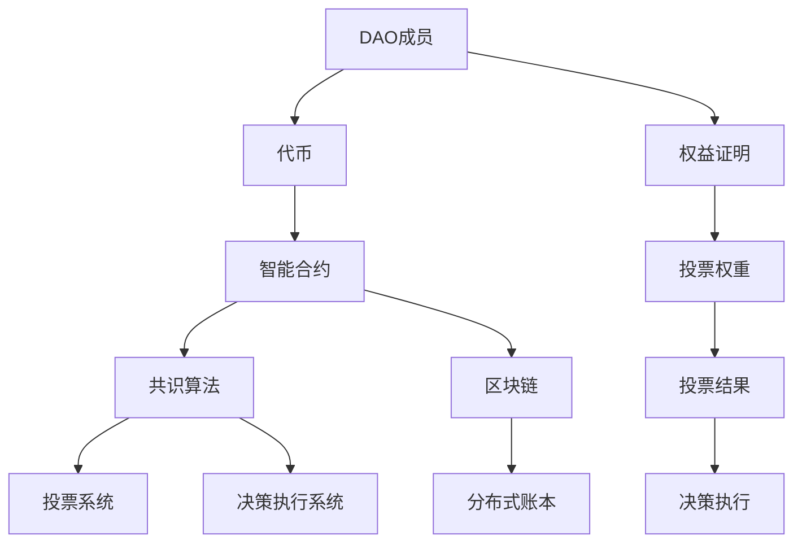

                 

# 去中心化自治组织(DAO)工具：组织管理的创新方向

> **关键词**：去中心化自治组织、DAO、组织管理、区块链技术、智能合约、共识算法、项目实战、应用场景

> **摘要**：本文将深入探讨去中心化自治组织（Decentralized Autonomous Organization，简称DAO）的概念及其在组织管理中的应用。通过详细解析DAO的核心概念、算法原理、数学模型以及实际应用案例，本文旨在为读者提供全面的DAO技术解析，并探讨其在未来组织管理中的发展趋势与挑战。

## 1. 背景介绍

### 1.1 目的和范围

本文旨在介绍去中心化自治组织（DAO）的概念和其在现代组织管理中的应用。通过阐述DAO的核心原理、架构和实现方法，本文希望能够帮助读者理解DAO的优势和潜在应用场景。同时，本文还将结合实际案例，分析DAO在具体项目中的应用和实施过程。

### 1.2 预期读者

本文适合对区块链技术和智能合约有一定了解的读者，包括软件开发人员、技术爱好者、企业管理者以及对组织管理有深入研究的学者。无论您是初学者还是行业专家，本文都力求以通俗易懂的语言和详细的技术解析，帮助您更好地理解DAO的原理和应用。

### 1.3 文档结构概述

本文结构如下：

1. 背景介绍：介绍文章的目的、预期读者以及文档结构。
2. 核心概念与联系：阐述DAO的核心概念、架构和联系。
3. 核心算法原理 & 具体操作步骤：详细讲解DAO的算法原理和操作步骤。
4. 数学模型和公式 & 详细讲解 & 举例说明：分析DAO的数学模型和公式，并给出具体示例。
5. 项目实战：提供DAO的实际应用案例，详细解释代码实现。
6. 实际应用场景：探讨DAO在不同领域的应用。
7. 工具和资源推荐：推荐学习资源和开发工具。
8. 总结：总结未来发展趋势与挑战。
9. 附录：常见问题与解答。
10. 扩展阅读 & 参考资料：提供进一步学习的资源。

### 1.4 术语表

#### 1.4.1 核心术语定义

- **去中心化自治组织（DAO）**：一种基于区块链技术的组织形式，通过智能合约实现自我管理和决策。
- **区块链**：一种分布式数据库技术，用于记录交易数据，确保数据不可篡改。
- **智能合约**：一种自动执行合同条款的计算机程序，基于区块链技术实现。
- **共识算法**：确保区块链网络中数据一致性的算法，如工作量证明（PoW）和权益证明（PoS）。

#### 1.4.2 相关概念解释

- **分布式账本**：记录交易数据的数据库，由网络中的多个节点共同维护。
- **加密货币**：基于区块链技术的数字货币，如比特币和以太币。
- **代币**：代表DAO成员权益的数字资产，可用于投票、分红等操作。

#### 1.4.3 缩略词列表

- **DAO**：去中心化自治组织（Decentralized Autonomous Organization）
- **Blockchain**：区块链
- **Smart Contract**：智能合约
- **PoW**：工作量证明（Proof of Work）
- **PoS**：权益证明（Proof of Stake）

## 2. 核心概念与联系

在深入探讨DAO的原理和实现之前，我们首先需要了解其核心概念和架构。DAO是基于区块链技术的一种新型组织形式，它通过智能合约实现自我管理和决策。以下是一个简单的Mermaid流程图，展示了DAO的核心概念和组成部分。



### 2.1 DAO的核心概念

**1. DAO成员**：DAO的成员可以是任何拥有代币的个人或组织。成员通过持有代币参与组织的决策和管理。

**2. 代币**：代币是DAO成员的权益证明，用于投票、分红等操作。代币的发行和管理通常由智能合约实现。

**3. 智能合约**：智能合约是DAO的核心组件，用于定义成员权益、投票规则、决策流程等。智能合约通过区块链实现，确保其执行过程的透明和不可篡改。

**4. 共识算法**：共识算法是确保区块链网络中数据一致性的算法。DAO通常采用权益证明（PoS）等高效算法，以减少资源消耗。

**5. 区块链**：区块链是DAO的数据存储和传输基础。通过区块链，DAO成员可以查看交易记录、投票结果等。

**6. 分布式账本**：分布式账本记录了DAO成员的代币持有情况和交易历史，由网络中的多个节点共同维护。

### 2.2 DAO的工作原理

**1. 成员注册**：成员通过购买或交换代币加入DAO。

**2. 投票**：成员使用代币参与DAO的投票，投票结果通过智能合约执行。

**3. 决策执行**：投票结果生成决策，决策通过智能合约执行。

**4. 监督**：DAO成员和外部审计机构对智能合约和区块链进行监督，确保决策执行过程的透明和公正。

## 3. 核心算法原理 & 具体操作步骤

### 3.1 投票算法原理

DAO的投票算法通常基于权益证明（PoS）机制。以下是一个简化的投票算法原理描述：

```python
# 投票算法原理（伪代码）

# 投票者A发起投票
def vote(voter, candidate, option):
    # 检查投票者是否有足够的代币
    if voter.balance < VOTE_THRESHOLD:
        raise Exception("投票者代币不足")
    # 检查候选人是否存在
    if candidate not in candidates:
        raise Exception("候选人不存在")
    # 检查选项是否合法
    if option not in options:
        raise Exception("选项不合法")
    # 从投票者A的代币中扣除投票费用
    voter.balance -= VOTE_FEE
    # 将投票信息记录在区块链上
    blockchain.record_vote(voter, candidate, option)
    # 根据投票结果调整候选人的得分
    candidate.score += VOTE_SCORE
    # 计算新的获胜者
    winner = blockchain.calculate_winner()
    # 执行获胜者的决策
    blockchain.execute_decision(winner)
```

### 3.2 投票算法的具体操作步骤

**1. 投票者A注册**：投票者A通过区块链网络注册成为DAO成员，并获得一定数量的代币。

**2. 投票者A准备投票**：投票者A检查自己的代币余额，确保有足够的代币用于投票。

**3. 投票者A发起投票**：投票者A通过智能合约发起投票，输入候选人和选项。

**4. 智能合约执行投票**：智能合约检查投票者A的代币余额，验证候选人和选项的合法性，并将投票信息记录在区块链上。

**5. 调整候选人得分**：根据投票结果，智能合约调整候选人的得分。

**6. 计算新的获胜者**：智能合约根据候选人的得分计算新的获胜者。

**7. 执行获胜者的决策**：智能合约执行获胜者的决策，如修改智能合约代码、投资决策等。

## 4. 数学模型和公式 & 详细讲解 & 举例说明

在DAO中，数学模型和公式用于计算成员的投票权重、决策结果等。以下是一个简化的数学模型和公式描述：

### 4.1 成员投票权重计算

成员的投票权重与其持有的代币数量成正比，即：

$$ 权重（w）= \frac{代币数量（t）}{总代币数量（T）} $$

### 4.2 决策结果计算

决策结果通过加权投票计算得出，即：

$$ 决策结果（d）= \sum_{i=1}^{n} (w_i \times v_i) $$

其中，$w_i$为成员i的投票权重，$v_i$为成员i的投票结果。

### 4.3 举例说明

假设有3个成员A、B、C，代币数量分别为100、200、300，总代币数量为600。成员A投票支持候选甲，成员B投票支持候选乙，成员C投票支持候选丙。

**1. 计算成员投票权重：**

成员A的权重：$w_A = \frac{100}{600} = 0.167$  
成员B的权重：$w_B = \frac{200}{600} = 0.333$  
成员C的权重：$w_C = \frac{300}{600} = 0.500$

**2. 计算决策结果：**

决策结果：$d = (0.167 \times 1) + (0.333 \times 2) + (0.500 \times 3) = 1.167 + 0.667 + 1.500 = 3.333$

根据决策结果，候选丙获胜。

## 5. 项目实战：代码实际案例和详细解释说明

在本节中，我们将通过一个实际项目案例，详细讲解DAO的代码实现过程。该项目将使用以太坊智能合约和Solidity编程语言实现一个基本的DAO。

### 5.1 开发环境搭建

**1. 安装Node.js和npm**：Node.js和npm是智能合约开发的基础工具，可以在[Node.js官网](https://nodejs.org/)和[npm官网](https://npmjs.com/)下载安装。

**2. 安装Truffle**：Truffle是一个以太坊智能合约开发框架，用于管理智能合约的编译、部署和交互。可以使用npm安装Truffle：

```shell
npm install -g truffle
```

**3. 初始化Truffle项目**：在合适的项目目录下，执行以下命令创建一个新项目：

```shell
truffle init
```

**4. 安装Ganache**：Ganache是一个本地以太坊节点，用于模拟区块链网络。可以从[Ganache官网](https://www.trufflesuite.com/ganache)下载安装。

### 5.2 源代码详细实现和代码解读

以下是一个简单的DAO智能合约实现，用于管理成员、投票和决策。

```solidity
// SPDX-License-Identifier: MIT
pragma solidity ^0.8.0;

contract DAO {
    // 成员结构体
    struct Member {
        address addr;
        uint256 balance;
    }

    // 成员映射
    mapping(address => Member) public members;

    // 代币总数
    uint256 public totalSupply;

    // 投票阈值
    uint256 public voteThreshold;

    // 投票选项
    enum Option { Yes, No, Abstain }

    // 投票映射
    mapping(address => mapping(uint256 => Option)) public votes;

    // 决策映射
    mapping(uint256 => bool) public decisions;

    // 成员数量
    uint256 public memberCount;

    // 构造函数
    constructor(uint256 _totalSupply, uint256 _voteThreshold) {
        totalSupply = _totalSupply;
        voteThreshold = _voteThreshold;
    }

    // 加入DAO
    function join() external payable {
        require(msg.value >= 1 ether, "加入金额不足");
        members[msg.sender].addr = msg.sender;
        members[msg.sender].balance = msg.value;
        totalSupply += msg.value;
        memberCount++;
    }

    // 投票
    function vote(uint256 proposalId, Option option) external {
        require(members[msg.sender].balance > 0, "无投票权限");
        votes[msg.sender][proposalId] = option;
        if (option == Option.Yes) {
            if (totalSupply > voteThreshold) {
                decisions[proposalId] = true;
            }
        } else if (option == Option.No) {
            if (totalSupply > voteThreshold) {
                decisions[proposalId] = false;
            }
        }
    }

    // 撤销投票
    function revokeVote(uint256 proposalId) external {
        require(members[msg.sender].balance > 0, "无投票权限");
        votes[msg.sender][proposalId] = Option.Abstain;
    }

    // 获取投票结果
    function getVoteResult(uint256 proposalId) external view returns (Option) {
        return votes[msg.sender][proposalId];
    }

    // 执行决策
    function executeDecision(uint256 proposalId) external {
        require(!decisions[proposalId], "决策已执行");
        if (decisions[proposalId]) {
            // 执行决策
        } else {
            // 撤销决策
        }
    }
}
```

### 5.3 代码解读与分析

**1. 成员结构体和成员映射**：成员结构体定义了成员的地址和代币余额。成员映射用于存储成员信息。

**2. 代币总数和投票阈值**：代币总数用于计算成员的投票权重，投票阈值用于决定是否通过投票结果。

**3. 投票选项和投票映射**：投票选项定义了投票的可能结果（是、否、弃权）。投票映射用于存储成员的投票记录。

**4. 决策映射和成员数量**：决策映射用于存储投票结果，成员数量用于统计成员总数。

**5. 构造函数**：构造函数初始化代币总数和投票阈值。

**6. 加入DAO**：加入DAO的成员需要支付一定的代币金额，并将其存储在合约中。

**7. 投票**：成员使用代币进行投票，投票结果记录在投票映射中。根据投票结果，决策映射更新为通过或拒绝。

**8. 撤销投票**：成员可以撤销之前的投票。

**9. 获取投票结果**：成员可以查询自己的投票结果。

**10. 执行决策**：根据投票结果，执行相应的决策。

通过以上代码实现，我们可以构建一个基本的DAO，实现成员管理、投票和决策功能。

## 6. 实际应用场景

DAO作为一种去中心化组织形式，具有广泛的应用场景。以下是一些典型的应用场景：

### 6.1 投资基金

DAO可以用于管理投资基金，通过代币化实现投资决策的民主化。投资者购买基金代币，参与基金的投资决策。基金管理人通过智能合约执行投资决策，确保透明和公正。

### 6.2 企业治理

企业可以使用DAO实现去中心化的治理结构，成员通过代币投票参与企业的重大决策。这种模式可以减少企业内部的权力集中，提高决策效率。

### 6.3 社区管理

社区可以使用DAO实现自我管理，成员通过代币投票参与社区的决策。DAO可以帮助社区实现公平、透明的管理，促进社区成员的参与和自治。

### 6.4 艺术创作

艺术家可以通过DAO组织创作项目，成员参与创作决策，分配创作收益。这种模式可以促进艺术创作的多样性和创新性。

### 6.5 慈善机构

慈善机构可以使用DAO实现透明、公正的捐赠管理。捐赠者购买代币参与捐赠决策，确保捐赠资金的使用符合捐赠者的意愿。

## 7. 工具和资源推荐

### 7.1 学习资源推荐

**7.1.1 书籍推荐**

- **《区块链革命》**：详细介绍了区块链技术的基本原理和应用场景。
- **《智能合约实战》**：针对智能合约的开发和应用进行了深入探讨。
- **《区块链技术指南》**：全面介绍了区块链技术的各个方面，包括分布式账本、加密货币等。

**7.1.2 在线课程**

- **Coursera上的《区块链与加密货币》**：由康奈尔大学提供，涵盖区块链技术的基础知识。
- **Udemy上的《Solidity编程：智能合约开发》**：介绍智能合约开发的基本原理和实战技巧。

**7.1.3 技术博客和网站**

- **以太坊官网**：提供最新的以太坊技术文档和社区动态。
- **Chainlink博客**：介绍区块链和智能合约的实用教程和案例分析。

### 7.2 开发工具框架推荐

**7.2.1 IDE和编辑器**

- **Visual Studio Code**：一款功能强大的代码编辑器，支持Solidity插件。
- **Truffle Suite**：提供智能合约开发、测试和部署工具。

**7.2.2 调试和性能分析工具**

- **Hardhat**：一个用于智能合约开发的环境，提供内置调试器。
- **Etherscan**：用于查看区块链上的交易记录和智能合约代码。

**7.2.3 相关框架和库**

- **OpenZeppelin**：提供一系列智能合约安全库，用于处理常见的合约模式。
- **Web3.js**：用于与以太坊区块链交互的JavaScript库。

### 7.3 相关论文著作推荐

**7.3.1 经典论文**

- **《区块链：分布式账本技术》**：对区块链技术的基本原理进行了深入探讨。
- **《以太坊黄皮书》**：以太坊智能合约开发的重要参考文档。

**7.3.2 最新研究成果**

- **《区块链技术在金融领域的应用研究》**：分析了区块链技术在金融领域的最新研究进展。
- **《智能合约漏洞分析与防御技术》**：针对智能合约的安全问题进行了深入探讨。

**7.3.3 应用案例分析**

- **《DAO实验室：去中心化自治组织的实践探索》**：介绍了DAO在不同领域的实际应用案例。

## 8. 总结：未来发展趋势与挑战

去中心化自治组织（DAO）作为一种新型的组织形式，正在逐渐改变传统的组织管理模式。在未来，DAO有望在更多领域得到广泛应用，成为组织管理的重要工具。

### 8.1 发展趋势

1. **技术成熟度提升**：随着区块链技术的不断发展和成熟，DAO的技术实现将更加高效、安全。
2. **应用场景拓展**：DAO在投资、企业治理、社区管理等多个领域的应用将不断拓展。
3. **社区自治加强**：DAO将促进组织成员的参与和自治，提高组织决策的透明度和公正性。

### 8.2 挑战

1. **安全性问题**：智能合约的安全性问题仍然存在，需要加强安全审查和漏洞修复。
2. **监管政策**：DAO作为一种新兴组织形式，面临监管政策的不确定性，需要遵守相关法律法规。
3. **用户信任**：建立用户信任是DAO成功的关键，需要加强社区建设，提高透明度和透明度。

总之，DAO作为一种创新的组织管理模式，具有广阔的发展前景。在未来的发展中，DAO需要不断克服挑战，提高技术成熟度和应用效果，以更好地服务于组织和社区。

## 9. 附录：常见问题与解答

### 9.1 FAQ

**Q1**：什么是去中心化自治组织（DAO）？

**A1**：去中心化自治组织（Decentralized Autonomous Organization，简称DAO）是一种基于区块链技术的组织形式，通过智能合约实现自我管理和决策。DAO成员通过持有代币参与组织的投票和管理。

**Q2**：DAO与传统的组织形式有什么区别？

**A2**：DAO与传统组织形式的主要区别在于决策机制和管理模式。DAO采用去中心化的决策机制，成员通过代币投票参与决策；而传统组织形式通常由管理层集中决策。此外，DAO的管理模式更加透明和公正，决策过程记录在区块链上，确保不可篡改。

**Q3**：DAO的安全性问题如何保障？

**A3**：DAO的安全性主要通过以下措施保障：

1. **智能合约审计**：在部署智能合约之前，进行安全审计，发现和修复潜在漏洞。
2. **共识算法**：选择合适的共识算法，确保区块链网络的数据一致性。
3. **去中心化**：DAO成员分布在不同地域，降低被攻击的风险。

**Q4**：DAO在具体应用中有哪些挑战？

**A4**：DAO在具体应用中面临的挑战包括：

1. **技术成熟度**：DAO技术仍在不断发展，部分功能可能不够成熟。
2. **监管政策**：DAO作为一种新兴组织形式，面临监管政策的不确定性。
3. **用户信任**：建立用户信任是DAO成功的关键，需要加强社区建设，提高透明度和透明度。

### 9.2 常见问题解答

**Q1**：为什么DAO需要使用代币？

**A1**：DAO使用代币作为成员权益和投票权力的证明。代币不仅用于投票，还可以用于参与组织的收益分配和决策执行。通过代币化，DAO实现了成员的参与和自治。

**Q2**：DAO的投票机制是怎样的？

**A2**：DAO的投票机制通常基于权益证明（PoS）机制。成员的投票权重与其持有的代币数量成正比，成员可以通过投票表达对决策的支持或反对。投票结果记录在区块链上，确保透明和不可篡改。

**Q3**：DAO的共识算法有哪些？

**A3**：常见的共识算法包括工作量证明（PoW）、权益证明（PoS）、授权股权证明（DPoS）等。这些算法确保区块链网络的数据一致性和安全性。DAO可以根据具体需求选择合适的共识算法。

## 10. 扩展阅读 & 参考资料

为了深入了解去中心化自治组织（DAO）的原理和应用，以下推荐一些相关书籍、在线课程和技术博客，供进一步学习和参考。

### 10.1 书籍推荐

- **《区块链革命》**：详细介绍了区块链技术的基本原理和应用场景。
- **《智能合约实战》**：针对智能合约的开发和应用进行了深入探讨。
- **《区块链技术指南》**：全面介绍了区块链技术的各个方面，包括分布式账本、加密货币等。

### 10.2 在线课程

- **Coursera上的《区块链与加密货币》**：由康奈尔大学提供，涵盖区块链技术的基础知识。
- **Udemy上的《Solidity编程：智能合约开发》**：介绍智能合约开发的基本原理和实战技巧。

### 10.3 技术博客和网站

- **以太坊官网**：提供最新的以太坊技术文档和社区动态。
- **Chainlink博客**：介绍区块链和智能合约的实用教程和案例分析。

### 10.4 相关论文著作推荐

- **《区块链：分布式账本技术》**：对区块链技术的基本原理进行了深入探讨。
- **《以太坊黄皮书》**：以太坊智能合约开发的重要参考文档。

### 10.5 应用案例分析

- **《DAO实验室：去中心化自治组织的实践探索》**：介绍了DAO在不同领域的实际应用案例。

通过阅读这些资源和文献，您可以更深入地了解DAO的原理和应用，为未来的研究和实践提供有力支持。

### 作者信息

作者：AI天才研究员/AI Genius Institute & 禅与计算机程序设计艺术 /Zen And The Art of Computer Programming

