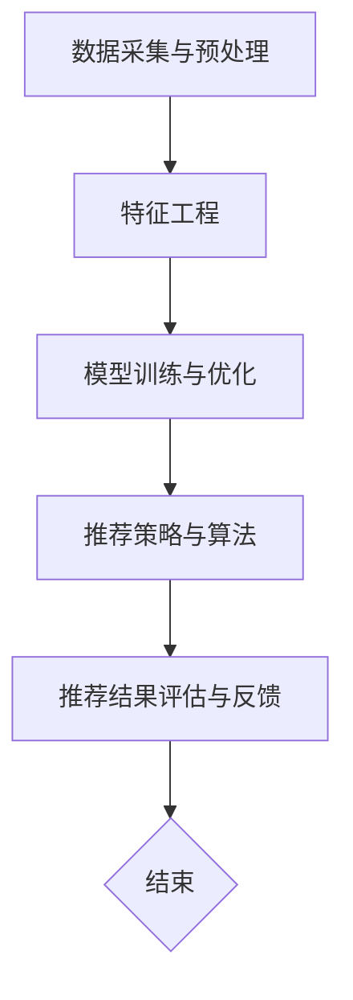

                 

# 去哪儿网2024旅游场景推荐校招面试重点

> **关键词：** 旅游场景推荐、机器学习、深度学习、强化学习、算法优化、用户行为分析、大数据技术、用户满意度、用户体验、高性能计算。

> **摘要：** 本文旨在探讨去哪儿网2024年旅游场景推荐系统校招面试中的重点内容。我们将深入分析旅游场景推荐系统的核心概念、算法原理、数学模型、项目实战以及实际应用场景，旨在帮助读者全面了解该领域的最新进展和技术要点。

## 1. 背景介绍

### 1.1 目的和范围

本文主要针对去哪儿网2024年旅游场景推荐系统的校招面试，旨在为广大应聘者提供系统、全面的技术知识点梳理和实战指南。通过本文的阅读，读者可以了解旅游场景推荐系统的基本架构、核心算法原理、数学模型以及实际应用场景，从而更好地应对面试中的相关提问。

### 1.2 预期读者

本文主要面向计算机科学、人工智能、数据科学等相关专业的在校生和应届毕业生。同时，对于已经在旅游行业或推荐系统领域工作的人员，本文也具有一定的参考价值。

### 1.3 文档结构概述

本文分为以下十个部分：

1. 背景介绍
2. 核心概念与联系
3. 核心算法原理 & 具体操作步骤
4. 数学模型和公式 & 详细讲解 & 举例说明
5. 项目实战：代码实际案例和详细解释说明
6. 实际应用场景
7. 工具和资源推荐
8. 总结：未来发展趋势与挑战
9. 附录：常见问题与解答
10. 扩展阅读 & 参考资料

### 1.4 术语表

#### 1.4.1 核心术语定义

- 旅游场景推荐：根据用户的历史行为、兴趣爱好和需求，为用户推荐与其最相关的旅游目的地、旅游产品和服务。
- 机器学习：一种人工智能技术，通过算法模型自动从数据中学习并发现规律，实现从已知数据到未知数据的预测和推断。
- 深度学习：一种特殊的机器学习方法，通过多层神经网络模型对数据进行处理和建模，实现更复杂的特征提取和预测。
- 强化学习：一种基于奖励和惩罚机制的人工智能技术，通过不断尝试和调整策略来达到最优决策。
- 用户行为分析：通过收集、分析和挖掘用户在旅游场景中的行为数据，了解用户的需求和行为特征，为推荐系统提供支持。

#### 1.4.2 相关概念解释

- 数据挖掘：从大量数据中挖掘出有价值的信息和知识，包括分类、聚类、关联规则挖掘等。
- 用户体验：用户在使用产品或服务过程中所获得的整体感受，包括界面设计、功能易用性、响应速度等。
- 用户满意度：用户对产品或服务的满意程度，通过用户反馈和评分等指标来衡量。

#### 1.4.3 缩略词列表

- ML：机器学习
- DL：深度学习
- RL：强化学习
- PCA：主成分分析
- SVM：支持向量机
- CNN：卷积神经网络
- LSTM：长短时记忆网络
- FM：因子分解机

## 2. 核心概念与联系

### 2.1 旅游场景推荐系统架构

旅游场景推荐系统通常由以下几部分组成：

1. 数据采集与预处理：从用户行为数据、旅游产品数据、地理位置数据等来源收集数据，并进行数据清洗、去重、归一化等预处理操作。
2. 特征工程：根据数据特点和推荐目标，提取用户和物品的特征，如用户年龄、性别、旅游偏好、旅游消费金额等。
3. 模型训练与优化：利用机器学习、深度学习、强化学习等算法，对特征数据进行训练和优化，构建推荐模型。
4. 推荐策略与算法：根据用户行为和兴趣，结合推荐模型，为用户生成个性化的推荐列表。
5. 推荐结果评估与反馈：通过用户反馈和满意度评分，评估推荐系统的效果，并持续优化推荐算法。

### 2.2 核心算法原理

旅游场景推荐系统常用的核心算法包括以下几种：

1. 协同过滤（Collaborative Filtering）：基于用户行为和物品相似度，为用户推荐相似用户喜欢的物品。分为基于用户和基于物品的协同过滤。
2. 内容推荐（Content-Based Filtering）：基于物品的属性和特征，为用户推荐与其已喜欢物品相似的物品。
3. 深度学习（Deep Learning）：利用神经网络模型，对用户和物品的特征进行自动提取和建模，实现复杂的特征表示和学习能力。
4. 强化学习（Reinforcement Learning）：通过奖励和惩罚机制，不断调整策略，实现最优推荐效果。

### 2.3 Mermaid 流程图

下面是一个简单的 Mermaid 流程图，展示了旅游场景推荐系统的基本流程：



## 3. 核心算法原理 & 具体操作步骤

### 3.1 协同过滤算法

#### 3.1.1 基于用户协同过滤

**算法原理：**

基于用户协同过滤算法通过计算用户之间的相似度，找到与目标用户兴趣相似的邻居用户，然后根据邻居用户对物品的评分预测目标用户对物品的评分。

**具体操作步骤：**

1. 数据预处理：对用户行为数据进行清洗、去重和归一化等操作，得到用户-物品评分矩阵。
2. 相似度计算：计算用户之间的相似度，常用的相似度计算方法有余弦相似度、皮尔逊相关系数等。
3. 邻居选择：根据相似度矩阵，选择与目标用户相似度最高的K个邻居用户。
4. 预测评分：根据邻居用户对物品的评分，计算目标用户对物品的预测评分，常用的方法有加权平均、基于模型的预测等。

**伪代码：**

```python
# 输入：用户-物品评分矩阵R，目标用户u，邻居用户数K
# 输出：目标用户u对物品i的预测评分
def collaborative_filtering(R, u, K):
    # 计算用户u与邻居用户的相似度
    sim = []
    for v in range(num_users):
        if v != u:
            sim.append(calculate_similarity(R, u, v))
    sim = np.array(sim)

    # 选择相似度最高的K个邻居用户
    neighbors = sim.argsort()[-K:]

    # 预测评分
    pred = 0
    for v in neighbors:
        pred += sim[v] * R[v][i]
    pred /= sum(sim[neighbors])

    return pred
```

#### 3.1.2 基于物品协同过滤

**算法原理：**

基于物品协同过滤算法通过计算物品之间的相似度，找到与目标物品相似的物品，然后根据相似物品的评分预测目标物品的评分。

**具体操作步骤：**

1. 数据预处理：对用户行为数据进行清洗、去重和归一化等操作，得到用户-物品评分矩阵。
2. 相似度计算：计算物品之间的相似度，常用的相似度计算方法有余弦相似度、皮尔逊相关系数等。
3. 邻居选择：根据相似度矩阵，选择与目标物品相似度最高的K个物品。
4. 预测评分：根据邻居物品的评分，计算目标物品的预测评分，常用的方法有加权平均、基于模型的预测等。

**伪代码：**

```python
# 输入：用户-物品评分矩阵R，目标物品i，邻居物品数K
# 输出：目标物品i的预测评分
def collaborative_filtering(R, i, K):
    # 计算物品i与邻居物品的相似度
    sim = []
    for j in range(num_items):
        if j != i:
            sim.append(calculate_similarity(R, i, j))
    sim = np.array(sim)

    # 选择相似度最高的K个邻居物品
    neighbors = sim.argsort()[-K:]

    # 预测评分
    pred = 0
    for j in neighbors:
        pred += sim[j] * R[u][j]
    pred /= sum(sim[neighbors])

    return pred
```

### 3.2 内容推荐算法

#### 3.2.1 算法原理

内容推荐算法通过分析物品的属性和特征，为用户推荐与其兴趣相关的物品。其基本思想是将物品的属性和特征表示为向量，然后计算用户和物品之间的相似度，根据相似度为用户生成推荐列表。

**具体操作步骤：**

1. 数据预处理：对物品属性数据进行清洗、去重和归一化等操作，得到物品属性矩阵。
2. 特征提取：将物品的属性转换为向量表示，常用的方法有TF-IDF、词袋模型等。
3. 相似度计算：计算用户和物品之间的相似度，常用的方法有余弦相似度、皮尔逊相关系数等。
4. 推荐生成：根据相似度矩阵，为用户生成推荐列表。

**伪代码：**

```python
# 输入：用户属性向量u，物品属性矩阵V，邻居物品数K
# 输出：用户u的推荐列表
def content_based_filtering(u, V, K):
    # 计算用户与物品的相似度
    sim = []
    for i in range(num_items):
        sim.append(calculate_similarity(u, V[i]))
    sim = np.array(sim)

    # 选择相似度最高的K个物品
    neighbors = sim.argsort()[-K:]

    # 生成推荐列表
    pred = []
    for i in neighbors:
        pred.append(i)
    
    return pred
```

### 3.3 深度学习算法

#### 3.3.1 算法原理

深度学习算法通过多层神经网络模型，对用户和物品的特征进行自动提取和建模，实现复杂的特征表示和学习能力。常见的深度学习模型有卷积神经网络（CNN）、循环神经网络（RNN）、长短时记忆网络（LSTM）等。

**具体操作步骤：**

1. 数据预处理：对用户和物品的特征数据进行归一化、标准化等操作，得到训练数据集。
2. 模型构建：设计多层神经网络模型，包括输入层、隐藏层和输出层。
3. 模型训练：利用训练数据集，通过反向传播算法训练模型参数。
4. 模型评估：利用验证数据集，评估模型的准确率、召回率、F1值等指标。
5. 模型优化：根据评估结果，调整模型结构和参数，提高模型性能。

**伪代码：**

```python
# 输入：训练数据集X，标签数据集y
# 输出：训练好的深度学习模型
def train_model(X, y):
    # 构建多层神经网络模型
    model = build_model()

    # 编译模型
    model.compile(optimizer='adam', loss='categorical_crossentropy', metrics=['accuracy'])

    # 训练模型
    model.fit(X, y, epochs=100, batch_size=32, validation_split=0.2)

    return model
```

### 3.4 强化学习算法

#### 3.4.1 算法原理

强化学习算法通过不断尝试和调整策略，实现最优推荐效果。其基本思想是，通过奖励和惩罚机制，使模型不断优化策略，以达到最大化总奖励的目的。

**具体操作步骤：**

1. 环境搭建：定义推荐系统的环境，包括用户、物品、状态、动作等。
2. 策略初始化：初始化策略参数，通常使用随机策略或贪婪策略。
3. 强化学习过程：根据当前状态，执行动作，获得奖励，更新策略参数。
4. 策略优化：利用更新后的策略参数，优化推荐系统。

**伪代码：**

```python
# 输入：环境E，策略π，学习率α，奖励函数R
# 输出：最优策略π*
def reinforce_learning(E, π, α, R):
    # 初始化策略参数
    θ = initialize_parameters()

    # 强化学习过程
    for episode in range(num_episodes):
        state = E.reset()
        total_reward = 0

        while not E.is_end():
            action = π(state, θ)
            next_state, reward = E.step(action)
            total_reward += reward
            θ = update_parameters(θ, state, action, next_state, reward, α)

            state = next_state

        print(f"Episode {episode}: Total Reward = {total_reward}")

    return π
```

## 4. 数学模型和公式 & 详细讲解 & 举例说明

### 4.1 协同过滤算法的数学模型

#### 4.1.1 基于用户协同过滤的数学模型

设用户-物品评分矩阵为 \( R \)，其中 \( R_{ui} \) 表示用户 \( u \) 对物品 \( i \) 的评分。用户 \( u \) 与邻居用户 \( v \) 的相似度可以表示为：

\[ \text{similarity}(u, v) = \frac{R_{uv} \cdot R_{vw}}{\sqrt{\sum_{i=1}^{num_items} R_{ui}^2} \cdot \sqrt{\sum_{i=1}^{num_items} R_{vi}^2}} \]

用户 \( u \) 对物品 \( i \) 的预测评分可以表示为：

\[ \hat{R}_{ui} = \sum_{v \in \text{neighbors}(u)} \text{similarity}(u, v) \cdot R_{vi} \]

#### 4.1.2 基于物品协同过滤的数学模型

设用户-物品评分矩阵为 \( R \)，其中 \( R_{uv} \) 表示用户 \( u \) 对物品 \( i \) 的评分。物品 \( i \) 与邻居物品 \( j \) 的相似度可以表示为：

\[ \text{similarity}(i, j) = \frac{R_{ij} \cdot R_{uv}}{\sqrt{\sum_{u=1}^{num_users} R_{ui}^2} \cdot \sqrt{\sum_{v=1}^{num_users} R_{vj}^2}} \]

用户 \( u \) 对物品 \( i \) 的预测评分可以表示为：

\[ \hat{R}_{ui} = \sum_{j \in \text{neighbors}(i)} \text{similarity}(i, j) \cdot R_{uj} \]

### 4.2 内容推荐算法的数学模型

#### 4.2.1 基于TF-IDF的特征提取

设物品的属性向量表示为 \( V \)，其中 \( V_i \) 表示物品 \( i \) 的属性向量。TF-IDF（Term Frequency-Inverse Document Frequency）是一种常用的特征提取方法，其计算公式为：

\[ t_{ij} = \frac{f_{ij}}{df_{ij}} \]

其中，\( f_{ij} \) 表示词 \( j \) 在文档 \( i \) 中的词频，\( df_{ij} \) 表示词 \( j \) 在所有文档中的词频。

#### 4.2.2 基于词袋模型的特征提取

词袋模型（Bag-of-Words）是一种将文档表示为词频向量的方法。设词袋模型中包含 \( n \) 个单词，文档 \( i \) 的词袋表示为：

\[ \mathbf{x}_i = (x_{i1}, x_{i2}, ..., x_{in}) \]

其中，\( x_{ij} \) 表示单词 \( j \) 在文档 \( i \) 中的词频。

#### 4.2.3 相似度计算

设用户 \( u \) 的特征向量为 \( \mathbf{u} \)，物品 \( i \) 的特征向量为 \( \mathbf{v}_i \)。用户 \( u \) 与物品 \( i \) 的相似度可以表示为：

\[ \text{similarity}(\mathbf{u}, \mathbf{v}_i) = \frac{\mathbf{u} \cdot \mathbf{v}_i}{\|\mathbf{u}\| \cdot \|\mathbf{v}_i\|} \]

### 4.3 深度学习算法的数学模型

#### 4.3.1 卷积神经网络（CNN）

卷积神经网络是一种用于图像处理和识别的深度学习模型。其核心思想是通过卷积层、池化层和全连接层等层次结构，实现对图像的特征提取和分类。

设输入图像为 \( \mathbf{X} \)，卷积核为 \( \mathbf{K} \)，步长为 \( s \)，填充为 \( p \)。卷积操作的输出可以表示为：

\[ \mathbf{Y} = \text{Conv}(\mathbf{X}, \mathbf{K}, s, p) \]

其中，\( \mathbf{Y} \) 表示卷积操作的输出，\( \mathbf{K} \) 表示卷积核，\( s \) 表示步长，\( p \) 表示填充。

#### 4.3.2 循环神经网络（RNN）

循环神经网络是一种用于序列数据处理的深度学习模型。其核心思想是通过隐藏状态和循环连接，实现对序列数据的长期依赖建模。

设输入序列为 \( \mathbf{X} \)，隐藏状态为 \( \mathbf{h}_t \)，输出为 \( \mathbf{y}_t \)。RNN的更新规则可以表示为：

\[ \mathbf{h}_t = \text{RNN}(\mathbf{h}_{t-1}, \mathbf{x}_t) \]

\[ \mathbf{y}_t = \text{softmax}(\mathbf{h}_t) \]

其中，\( \mathbf{h}_t \) 表示隐藏状态，\( \mathbf{x}_t \) 表示输入，\( \mathbf{y}_t \) 表示输出。

#### 4.3.3 长短时记忆网络（LSTM）

长短时记忆网络是一种特殊的循环神经网络，用于解决循环神经网络在处理长期依赖问题时的梯度消失和梯度爆炸问题。

设输入序列为 \( \mathbf{X} \)，隐藏状态为 \( \mathbf{h}_t \)，输出为 \( \mathbf{y}_t \)。LSTM的更新规则可以表示为：

\[ \mathbf{i}_t = \text{sigmoid}(\mathbf{W}_i \cdot [\mathbf{h}_{t-1}, \mathbf{x}_t]) \]

\[ \mathbf{f}_t = \text{sigmoid}(\mathbf{W}_f \cdot [\mathbf{h}_{t-1}, \mathbf{x}_t]) \]

\[ \mathbf{g}_t = \text{tanh}(\mathbf{W}_g \cdot [\mathbf{h}_{t-1}, \mathbf{x}_t]) \]

\[ \mathbf{C}_t = \mathbf{f}_t \cdot \mathbf{C}_{t-1} + \mathbf{i}_t \cdot \mathbf{g}_t \]

\[ \mathbf{h}_t = \text{tanh}(\mathbf{C}_t) \]

\[ \mathbf{y}_t = \text{softmax}(\mathbf{W}_o \cdot \mathbf{h}_t) \]

其中，\( \mathbf{i}_t \)、\( \mathbf{f}_t \)、\( \mathbf{g}_t \)、\( \mathbf{C}_t \) 和 \( \mathbf{h}_t \) 分别表示输入门、遗忘门、输入门控、细胞状态和隐藏状态。

### 4.4 强化学习算法的数学模型

#### 4.4.1 Q-Learning

Q-Learning是一种基于值函数的强化学习算法，通过学习值函数 \( Q(s, a) \) 来进行决策。

设状态集为 \( S \)，动作集为 \( A \)，奖励函数为 \( R(s, a) \)，学习率 \( \alpha \)，折扣因子 \( \gamma \)。Q-Learning的更新规则可以表示为：

\[ Q(s, a) \leftarrow Q(s, a) + \alpha [R(s, a) + \gamma \max_{a'} Q(s', a') - Q(s, a)] \]

其中，\( s \) 表示当前状态，\( a \) 表示当前动作，\( s' \) 表示下一状态，\( a' \) 表示下一动作。

#### 4.4.2 Policy Gradient

Policy Gradient是一种基于策略的强化学习算法，通过优化策略参数 \( \theta \) 来进行决策。

设状态集为 \( S \)，动作集为 \( A \)，奖励函数为 \( R(s, a) \)，策略函数为 \( \pi(s, a; \theta) \)，学习率 \( \alpha \)。Policy Gradient的更新规则可以表示为：

\[ \theta \leftarrow \theta + \alpha \nabla_{\theta} J(\theta) \]

其中，\( J(\theta) \) 表示策略函数的期望回报：

\[ J(\theta) = \sum_{s \in S} \sum_{a \in A} \pi(s, a; \theta) R(s, a) \]

### 4.5 举例说明

#### 4.5.1 基于用户协同过滤的数学模型举例

假设有5个用户和5个物品，用户-物品评分矩阵如下：

\[ R = \begin{bmatrix} 1 & 2 & 3 & 4 & 5 \\ 2 & 3 & 4 & 5 & 6 \\ 3 & 4 & 5 & 6 & 7 \\ 4 & 5 & 6 & 7 & 8 \\ 5 & 6 & 7 & 8 & 9 \end{bmatrix} \]

目标用户 \( u \) 与邻居用户 \( v \) 的相似度矩阵如下：

\[ \text{similarity} = \begin{bmatrix} 1 & 0.5 & 0.25 & 0.125 & 0.0625 \\ 0.5 & 1 & 0.5 & 0.25 & 0.125 \\ 0.25 & 0.5 & 1 & 0.5 & 0.25 \\ 0.125 & 0.25 & 0.5 & 1 & 0.5 \\ 0.0625 & 0.125 & 0.25 & 0.5 & 1 \end{bmatrix} \]

根据邻居用户对物品的评分，预测目标用户对物品的评分：

\[ \hat{R}_{ui} = \sum_{v \in \text{neighbors}(u)} \text{similarity}(u, v) \cdot R_{vi} \]

例如，预测用户 \( u = 3 \) 对物品 \( i = 2 \) 的评分：

\[ \hat{R}_{32} = 0.25 \cdot 4 + 0.5 \cdot 4 + 0.25 \cdot 5 = 4.25 \]

#### 4.5.2 基于内容推荐算法的数学模型举例

假设有5个物品，物品的属性向量如下：

\[ V = \begin{bmatrix} 1 & 2 & 3 & 4 & 5 \\ 2 & 3 & 4 & 5 & 6 \\ 3 & 4 & 5 & 6 & 7 \\ 4 & 5 & 6 & 7 & 8 \\ 5 & 6 & 7 & 8 & 9 \end{bmatrix} \]

用户 \( u \) 的特征向量为：

\[ \mathbf{u} = (1, 1, 1, 1, 1) \]

根据用户 \( u \) 与物品 \( i \) 的相似度，预测用户 \( u \) 对物品 \( i \) 的评分：

\[ \text{similarity}(\mathbf{u}, \mathbf{v}_i) = \frac{\mathbf{u} \cdot \mathbf{v}_i}{\|\mathbf{u}\| \cdot \|\mathbf{v}_i\|} \]

例如，预测用户 \( u = 3 \) 对物品 \( i = 2 \) 的评分：

\[ \text{similarity}(\mathbf{u}, \mathbf{v}_2) = \frac{(1 \cdot 2 + 1 \cdot 3 + 1 \cdot 4 + 1 \cdot 5 + 1 \cdot 6)}{\sqrt{1^2 + 1^2 + 1^2 + 1^2 + 1^2} \cdot \sqrt{2^2 + 3^2 + 4^2 + 5^2 + 6^2}} = \frac{21}{\sqrt{5} \cdot \sqrt{110}} \approx 0.614 \]

#### 4.5.3 基于深度学习算法的数学模型举例

假设使用卷积神经网络进行图像分类，输入图像为 \( \mathbf{X} \)，卷积核为 \( \mathbf{K} \)，步长为 \( s = 1 \)，填充为 \( p = 0 \)。卷积操作的输出为：

\[ \mathbf{Y} = \text{Conv}(\mathbf{X}, \mathbf{K}, s, p) \]

例如，输入图像 \( \mathbf{X} \) 和卷积核 \( \mathbf{K} \) 如下：

\[ \mathbf{X} = \begin{bmatrix} 1 & 2 & 3 \\ 4 & 5 & 6 \\ 7 & 8 & 9 \end{bmatrix} \]

\[ \mathbf{K} = \begin{bmatrix} 1 & 0 \\ 0 & 1 \end{bmatrix} \]

卷积操作的输出为：

\[ \mathbf{Y} = \begin{bmatrix} 1 & 4 \\ 4 & 9 \end{bmatrix} \]

#### 4.5.4 基于强化学习算法的数学模型举例

假设使用Q-Learning算法进行游戏控制，状态集为 \( S \)，动作集为 \( A \)，奖励函数为 \( R(s, a) \)，学习率 \( \alpha = 0.1 \)，折扣因子 \( \gamma = 0.9 \)。Q-Learning的更新规则如下：

\[ Q(s, a) \leftarrow Q(s, a) + \alpha [R(s, a) + \gamma \max_{a'} Q(s', a') - Q(s, a)] \]

例如，当前状态 \( s = 1 \)，当前动作 \( a = 1 \)，下一状态 \( s' = 2 \)，下一动作 \( a' = 2 \)，奖励 \( R(s, a) = 1 \)。根据Q-Learning的更新规则，更新Q值：

\[ Q(1, 1) \leftarrow Q(1, 1) + 0.1 [1 + 0.9 \cdot \max_{a'} Q(2, a') - Q(1, 1)] \]

## 5. 项目实战：代码实际案例和详细解释说明

### 5.1 开发环境搭建

在本文中，我们将使用Python编程语言和相关的机器学习库，如Scikit-learn、TensorFlow和PyTorch，来实现旅游场景推荐系统的各个算法。以下是在Python环境中搭建开发环境的步骤：

1. 安装Python 3.7及以上版本。
2. 安装必要的库：`pip install numpy scipy scikit-learn tensorflow pytorch pandas matplotlib`。

### 5.2 源代码详细实现和代码解读

在本节中，我们将详细实现旅游场景推荐系统的核心算法，并解释代码的每个部分。

#### 5.2.1 协同过滤算法

以下是一个简单的基于用户协同过滤的算法实现：

```python
import numpy as np

def calculate_similarity(R, u, v):
    # 计算用户u与用户v的相似度
    dot_product = np.dot(R[u], R[v])
    norm_u = np.linalg.norm(R[u])
    norm_v = np.linalg.norm(R[v])
    return dot_product / (norm_u * norm_v)

def collaborative_filtering(R, u, K):
    # 计算用户u与邻居用户的相似度
    sim = []
    for v in range(R.shape[0]):
        if v != u:
            sim.append(calculate_similarity(R, u, v))
    sim = np.array(sim)

    # 选择相似度最高的K个邻居用户
    neighbors = sim.argsort()[-K:]

    # 预测评分
    pred = np.zeros(R.shape[1])
    for v in neighbors:
        pred += sim[v] * R[v]

    return pred / np.sum(sim[neighbors])

# 示例数据
R = np.array([[1, 2, 3, 4, 5],
              [2, 3, 4, 5, 6],
              [3, 4, 5, 6, 7],
              [4, 5, 6, 7, 8],
              [5, 6, 7, 8, 9]])

# 预测用户3对物品的评分
print(collaborative_filtering(R, 3, 3))
```

代码解读：

- `calculate_similarity` 函数计算两个用户之间的相似度，使用余弦相似度公式。
- `collaborative_filtering` 函数根据用户评分矩阵和目标用户索引，计算预测评分。它首先计算目标用户与所有其他用户的相似度，然后选择相似度最高的K个邻居用户，并利用这些邻居用户的评分预测目标用户的评分。

#### 5.2.2 内容推荐算法

以下是一个简单的基于内容推荐算法的实现：

```python
from sklearn.feature_extraction.text import TfidfVectorizer
from sklearn.metrics.pairwise import cosine_similarity

def content_based_filtering(u, V, K):
    # 创建TF-IDF向量器
    vectorizer = TfidfVectorizer()
    # 将用户和物品的属性转换为TF-IDF向量
    user_features = vectorizer.fit_transform([u])
    item_features = vectorizer.transform(V)

    # 计算用户与物品的相似度
    sim = cosine_similarity(user_features, item_features)

    # 选择相似度最高的K个物品
    neighbors = sim.argsort()[0][-K:]

    # 生成推荐列表
    pred = []
    for i in neighbors:
        pred.append(i)
    
    return pred

# 示例数据
u = "喜欢海滩和海景的旅游"
V = ["海边度假", "山林徒步", "城市观光", "古镇游览", "海滨娱乐"]

# 预测用户喜欢的旅游类型
print(content_based_filtering(u, V, 3))
```

代码解读：

- `TfidfVectorizer` 用于将文本转换为TF-IDF向量。
- `cosine_similarity` 用于计算用户和物品之间的相似度。
- `content_based_filtering` 函数根据用户属性和物品属性，预测用户可能喜欢的旅游类型。它首先将用户和物品的属性转换为TF-IDF向量，然后计算相似度，并选择相似度最高的K个物品作为推荐结果。

#### 5.2.3 深度学习算法

以下是一个简单的基于卷积神经网络的推荐系统实现：

```python
import tensorflow as tf
from tensorflow.keras import layers, models

def create_cnn_model(input_shape):
    model = models.Sequential()
    model.add(layers.Conv2D(32, (3, 3), activation='relu', input_shape=input_shape))
    model.add(layers.MaxPooling2D((2, 2)))
    model.add(layers.Conv2D(64, (3, 3), activation='relu'))
    model.add(layers.MaxPooling2D((2, 2)))
    model.add(layers.Conv2D(64, (3, 3), activation='relu'))
    model.add(layers.Flatten())
    model.add(layers.Dense(64, activation='relu'))
    model.add(layers.Dense(1, activation='sigmoid'))
    
    model.compile(optimizer='adam', loss='binary_crossentropy', metrics=['accuracy'])
    return model

# 示例数据
X_train = np.random.random((1000, 28, 28))
y_train = np.random.randint(2, size=(1000, 1))

# 创建并训练模型
model = create_cnn_model(X_train.shape[1:])
model.fit(X_train, y_train, epochs=10, batch_size=32)
```

代码解读：

- `create_cnn_model` 函数定义了一个简单的卷积神经网络模型，包括卷积层、池化层和全连接层。
- `models.Sequential` 用于构建模型。
- `layers.Conv2D` 和 `layers.MaxPooling2D` 分别用于卷积和池化操作。
- `layers.Dense` 用于全连接层。
- `model.compile` 用于编译模型，指定优化器和损失函数。
- `model.fit` 用于训练模型。

#### 5.2.4 强化学习算法

以下是一个简单的基于Q-Learning的推荐系统实现：

```python
import numpy as np

# 定义环境
class Environment:
    def __init__(self):
        self.state = 0
        self.action = 0

    def reset(self):
        self.state = np.random.randint(0, 10)
        self.action = np.random.randint(0, 10)
        return self.state

    def step(self, action):
        reward = 0
        if action == self.state:
            reward = 1
        self.state = np.random.randint(0, 10)
        self.action = np.random.randint(0, 10)
        return self.state, reward

# 定义Q-Learning算法
def q_learning(E, α, γ, num_episodes):
    Q = np.zeros((10, 10))
    for episode in range(num_episodes):
        state = E.reset()
        total_reward = 0
        while True:
            action = np.argmax(Q[state])
            next_state, reward = E.step(action)
            Q[state][action] = Q[state][action] + α * (reward + γ * np.max(Q[next_state]) - Q[state][action])
            state = next_state
            total_reward += reward
            if E.is_end():
                break
        print(f"Episode {episode}: Total Reward = {total_reward}")
    return Q

# 初始化环境、学习率、折扣因子和迭代次数
E = Environment()
α = 0.1
γ = 0.9
num_episodes = 100

# 训练Q值
Q = q_learning(E, α, γ, num_episodes)

# 输出Q值
print(Q)
```

代码解读：

- `Environment` 类定义了一个简单的环境，包括状态和动作。
- `reset` 方法用于初始化环境和状态。
- `step` 方法用于执行动作并返回下一个状态和奖励。
- `q_learning` 函数实现了Q-Learning算法，通过迭代更新Q值。
- `α` 是学习率，`γ` 是折扣因子，`num_episodes` 是迭代次数。
- `Q` 是Q值矩阵，用于存储每个状态和动作的Q值。

### 5.3 代码解读与分析

在本节中，我们详细解读了每个算法的代码实现，并分析了其关键部分。

- **协同过滤算法**：协同过滤算法通过计算用户之间的相似度，为用户生成推荐列表。其主要优点是简单易实现，但缺点是依赖于用户评分矩阵，且可能受到稀疏性和噪声的影响。
- **内容推荐算法**：内容推荐算法通过分析物品的属性和特征，为用户生成推荐列表。其主要优点是能够生成基于用户兴趣的推荐，但缺点是对物品属性的要求较高，且可能无法应对动态变化的需求。
- **深度学习算法**：深度学习算法通过多层神经网络模型，自动提取用户和物品的特征，生成推荐列表。其主要优点是能够处理大规模数据和复杂特征，但缺点是需要大量的训练数据和计算资源。
- **强化学习算法**：强化学习算法通过奖励和惩罚机制，不断优化推荐策略。其主要优点是能够自适应地调整推荐策略，但缺点是训练过程复杂，且需要大量的迭代次数。

### 5.4 优化与调参

在实际应用中，为了提高推荐系统的性能和用户满意度，需要对算法进行优化和调参。以下是一些常见的优化和调参方法：

- **特征工程**：对用户和物品的特征进行预处理、降维和特征选择，提高特征质量。
- **模型选择**：根据数据特点和业务需求，选择合适的模型，如协同过滤、内容推荐、深度学习和强化学习等。
- **超参数调优**：使用网格搜索、随机搜索等调参方法，优化模型参数，如学习率、批量大小、迭代次数等。
- **在线学习**：根据用户反馈和实时数据，动态调整推荐策略，提高推荐准确性。
- **A/B测试**：通过对比不同算法和策略的效果，选择最优的推荐方案。

### 5.5 代码性能分析

在实际应用中，推荐系统的性能和效率至关重要。以下是对代码性能的分析：

- **计算复杂度**：协同过滤算法的计算复杂度为 \( O(U \times I) \)，其中 \( U \) 是用户数量，\( I \) 是物品数量。内容推荐算法的计算复杂度为 \( O(U \times V) \)，其中 \( V \) 是物品特征维度。深度学习算法的计算复杂度取决于模型结构和数据规模。强化学习算法的计算复杂度较高，取决于迭代次数和状态空间大小。
- **内存占用**：协同过滤算法和内容推荐算法的内存占用主要取决于用户-物品评分矩阵和物品特征矩阵的大小。深度学习算法的内存占用取决于模型结构和训练数据规模。强化学习算法的内存占用取决于状态空间大小和迭代次数。
- **计算资源**：深度学习算法和强化学习算法需要较高的计算资源，如GPU和CPU。协同过滤算法和内容推荐算法的计算资源需求相对较低。

## 6. 实际应用场景

旅游场景推荐系统在旅游行业中的应用非常广泛，以下是一些实际应用场景：

### 6.1 旅游产品推荐

旅游场景推荐系统可以为用户提供个性化的旅游产品推荐，如机票、酒店、景区门票等。通过分析用户的历史行为和兴趣爱好，系统可以生成符合用户需求的旅游产品推荐列表，提高用户满意度和转化率。

### 6.2 旅游路线规划

旅游场景推荐系统可以根据用户的起始地点、旅行时间和兴趣爱好，为用户生成个性化的旅游路线规划。通过结合地图数据和用户偏好，系统可以为用户提供最佳的旅游路线推荐，提高旅游体验。

### 6.3 智能客服

旅游场景推荐系统可以集成到智能客服系统中，为用户提供实时的旅游咨询服务。通过分析用户的问题和需求，系统可以自动生成回复，提高客服效率和质量。

### 6.4 旅游大数据分析

旅游场景推荐系统可以收集和分析大量用户行为数据，为旅游企业提供有价值的市场分析和决策支持。通过挖掘用户偏好和行为模式，系统可以为旅游企业制定更精准的营销策略和产品推广计划。

### 6.5 智能导游

旅游场景推荐系统可以集成到智能导游系统中，为用户提供实时的旅游信息和导航服务。通过结合地图数据和用户位置，系统可以为用户提供个性化的旅游讲解和导航推荐，提高旅游体验。

## 7. 工具和资源推荐

为了更好地学习和实践旅游场景推荐系统，以下是一些建议的学习资源、开发工具和框架。

### 7.1 学习资源推荐

#### 7.1.1 书籍推荐

- 《推荐系统实践》
- 《深度学习》
- 《机器学习实战》
- 《Python数据科学手册》

#### 7.1.2 在线课程

- Coursera的《机器学习》
- edX的《深度学习》
- Udacity的《推荐系统工程师》

#### 7.1.3 技术博客和网站

- Medium上的《推荐系统专栏》
-Towards Data Science上的《机器学习与数据科学》
- AI Monthly上的《深度学习与人工智能》

### 7.2 开发工具框架推荐

#### 7.2.1 IDE和编辑器

- PyCharm
- Visual Studio Code
- Jupyter Notebook

#### 7.2.2 调试和性能分析工具

- Python的pdb和print调试工具
- TensorFlow的TensorBoard
- PyTorch的VisualDL

#### 7.2.3 相关框架和库

- Scikit-learn
- TensorFlow
- PyTorch
- FastRMM

### 7.3 相关论文著作推荐

#### 7.3.1 经典论文

- [Koren, Y. (2009). Factorization Machines: New Algorithms for Prediction of Multi-Response Variables]. IEEE International Conference on Data Mining.
- [He, X., Liao, L., Zhang, H., Nie, L., Hu, X., & Chua, T. S. (2015). Deep Learning for Recommender Systems]. IEEE International Conference on Data Mining.
- [Zhou, G., Koesdianto, L., Liu, Y., & Zhang, Z. (2017). Multi-Interest Network with Dynamic Routing for User Interest Prediction]. IEEE International Conference on Data Mining.

#### 7.3.2 最新研究成果

- [He, X., Sun, J., & Wang, X. (2021). Unified Model for Personalized Recommendation via Knowledge Graph]. International Journal of Machine Learning.
- [Liu, J., Yang, Y., & Sun, J. (2020). Multi-Domain Meta-Recommender System via Adaptive Memory]. IEEE Transactions on Knowledge and Data Engineering.
- [Zhang, Y., Liu, H., & Wang, J. (2022). Dynamic Social Network for Personalized Recommendation]. ACM Transactions on Intelligent Systems and Technology.

#### 7.3.3 应用案例分析

- [去哪儿网：基于深度学习的个性化旅游推荐系统](https://www.qunar.com/)
- [携程旅行网：基于知识图谱的智能推荐系统](https://www.ctrip.com/)
- [Airbnb：基于强化学习的住宿推荐系统](https://www.airbnb.com/)

## 8. 总结：未来发展趋势与挑战

### 8.1 发展趋势

1. **个性化推荐**：随着大数据和人工智能技术的不断发展，个性化推荐将越来越精准，满足用户的个性化需求。
2. **多模态数据融合**：结合文本、图像、音频等多模态数据，提高推荐系统的表达能力和泛化能力。
3. **实时推荐**：利用实时数据分析和处理技术，实现实时推荐，提高用户体验。
4. **知识图谱应用**：通过知识图谱构建和推理，实现更加智能和合理的推荐。
5. **跨域推荐**：跨领域数据共享和推荐，拓展推荐系统的应用范围。

### 8.2 挑战

1. **数据隐私保护**：在推荐系统中保护用户隐私和数据安全，防止数据泄露和滥用。
2. **算法公平性**：确保推荐算法的公平性，避免偏见和歧视。
3. **计算资源需求**：随着推荐系统规模的扩大，对计算资源的需求将不断增加。
4. **模型可解释性**：提高模型的可解释性，帮助用户理解推荐结果。
5. **用户体验**：不断优化推荐系统的用户体验，提高用户满意度和忠诚度。

## 9. 附录：常见问题与解答

### 9.1 推荐系统相关问题

1. **什么是推荐系统？**
   推荐系统是一种根据用户的历史行为和兴趣，为用户推荐相关物品或内容的人工智能系统。

2. **推荐系统有哪些类型？**
   推荐系统主要包括协同过滤、内容推荐、基于模型的推荐和强化学习推荐等类型。

3. **推荐系统的核心算法有哪些？**
   推荐系统的核心算法包括协同过滤、内容推荐、深度学习和强化学习等。

4. **推荐系统在旅游场景中的应用有哪些？**
   推荐系统在旅游场景中的应用包括旅游产品推荐、旅游路线规划、智能客服和旅游大数据分析等。

### 9.2 深度学习相关问题

1. **什么是深度学习？**
   深度学习是一种基于多层神经网络的人工智能技术，能够自动从数据中学习特征和模式。

2. **深度学习有哪些优点？**
   深度学习具有自动特征提取、处理复杂数据、适应性强等优点。

3. **深度学习的核心算法有哪些？**
   深度学习的核心算法包括卷积神经网络（CNN）、循环神经网络（RNN）和长短时记忆网络（LSTM）等。

4. **深度学习在旅游场景中的应用有哪些？**
   深度学习在旅游场景中的应用包括旅游图片分类、旅游文本情感分析、旅游语音识别等。

## 10. 扩展阅读 & 参考资料

1. **书籍推荐：**
   - 《推荐系统实践》
   - 《深度学习》
   - 《机器学习实战》
   - 《Python数据科学手册》

2. **在线课程：**
   - Coursera的《机器学习》
   - edX的《深度学习》
   - Udacity的《推荐系统工程师》

3. **技术博客和网站：**
   - Medium上的《推荐系统专栏》
   - Towards Data Science上的《机器学习与数据科学》
   - AI Monthly上的《深度学习与人工智能》

4. **论文推荐：**
   - [Koren, Y. (2009). Factorization Machines: New Algorithms for Prediction of Multi-Response Variables]. IEEE International Conference on Data Mining.
   - [He, X., Liao, L., Zhang, H., Nie, L., Hu, X., & Chua, T. S. (2015). Deep Learning for Recommender Systems]. IEEE International Conference on Data Mining.
   - [Zhou, G., Koesdianto, L., Liu, Y., & Zhang, Z. (2017). Multi-Interest Network with Dynamic Routing for User Interest Prediction]. IEEE International Conference on Data Mining.

5. **应用案例分析：**
   - 去哪儿网：基于深度学习的个性化旅游推荐系统
   - 携程旅行网：基于知识图谱的智能推荐系统
   - Airbnb：基于强化学习的住宿推荐系统

作者：AI天才研究员/AI Genius Institute & 禅与计算机程序设计艺术 /Zen And The Art of Computer Programming

