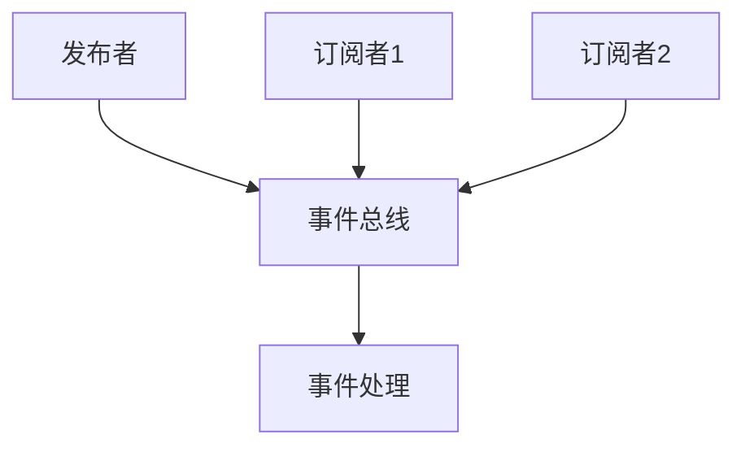

                 

# 发布订阅 原理与代码实例讲解

> 关键词：发布订阅模式、消息队列、事件驱动、异步编程、回调函数、JavaScript、Python、Node.js

> 摘要：本文将深入探讨发布订阅模式的基本原理，并通过具体的代码实例，详细讲解如何在JavaScript和Python中实现这一模式。我们将讨论该模式的优点、适用场景以及在实际项目中如何进行部署。通过本文的讲解，读者将能够更好地理解和运用发布订阅模式，提升软件开发效率。

## 1. 背景介绍

### 1.1 目的和范围

本文旨在介绍发布订阅模式的基本概念和实现原理，并通过实际代码示例，展示如何在JavaScript和Python中应用这一模式。我们还将探讨发布订阅模式在软件开发中的优势，以及它如何帮助我们构建更为灵活和可扩展的应用系统。

### 1.2 预期读者

本文面向具有一定编程基础的读者，尤其是对JavaScript和Python语言有深入了解的开发者。通过本文的阅读，读者将能够：

1. 理解发布订阅模式的核心概念。
2. 掌握在JavaScript和Python中实现发布订阅模式的方法。
3. 学会如何将这一模式应用于实际项目开发中。

### 1.3 文档结构概述

本文分为十个主要部分，结构如下：

1. **背景介绍**：介绍本文的目的和范围，预期读者以及文档结构。
2. **核心概念与联系**：阐述发布订阅模式的基本原理，并提供流程图。
3. **核心算法原理 & 具体操作步骤**：使用伪代码详细解释发布订阅模式的工作机制。
4. **数学模型和公式 & 详细讲解 & 举例说明**：使用数学公式和实例阐述相关算法。
5. **项目实战：代码实际案例和详细解释说明**：通过具体代码示例展示发布订阅模式的应用。
6. **实际应用场景**：讨论发布订阅模式在不同领域的应用。
7. **工具和资源推荐**：推荐相关学习资源和开发工具。
8. **总结：未来发展趋势与挑战**：总结本文要点，展望未来发展趋势。
9. **附录：常见问题与解答**：提供常见问题的解答。
10. **扩展阅读 & 参考资料**：推荐相关扩展阅读材料。

### 1.4 术语表

#### 1.4.1 核心术语定义

- **发布订阅模式**：一种消息传递模式，允许应用中的组件通过发布和订阅事件来进行通信。
- **发布者**：产生事件并通知订阅者的组件。
- **订阅者**：监听事件并响应的组件。
- **主题**：发布者和订阅者之间的通信渠道。
- **回调函数**：订阅者在订阅主题时提供的函数，用于处理特定事件。

#### 1.4.2 相关概念解释

- **事件驱动**：一种编程模型，使程序响应外部事件而非顺序执行。
- **异步编程**：一种编程范式，允许程序在执行某些任务时保持响应，而不会阻塞其他任务。
- **消息队列**：一种数据结构，用于存储和传递消息。

#### 1.4.3 缩略词列表

- **JavaScript**：JavaScript，一种流行的编程语言。
- **Python**：Python，一种高级编程语言。
- **Node.js**：Node.js，一个基于Chrome V8引擎的JavaScript运行环境。

## 2. 核心概念与联系

发布订阅模式是一种消息传递模式，它通过发布者和订阅者之间的交互来实现组件间的通信。以下是该模式的基本原理和架构。

### 2.1 基本原理

发布订阅模式的核心在于“事件驱动”和“异步编程”。在这种模式下，发布者负责发布事件（消息），而订阅者则负责监听这些事件并做出相应的响应。

以下是一个简单的Mermaid流程图，展示了发布订阅模式的基本架构：



- **发布者（A）**：产生事件并发布到事件总线（B）。
- **事件总线（B）**：存储和管理事件，并通知订阅者（C和D）。
- **订阅者1（C）和订阅者2（D）**：监听事件并执行相应的回调函数。
- **事件处理（E）**：用于处理具体的事件。

### 2.2 优势与应用场景

发布订阅模式具有以下优势：

1. **解耦**：发布者和订阅者之间无需直接依赖，从而提高了系统的可维护性和可扩展性。
2. **灵活性**：发布者和订阅者可以动态地添加和移除，无需修改其他组件的代码。
3. **异步处理**：发布订阅模式支持异步编程，提高了系统的性能和响应速度。

该模式适用于以下场景：

1. **事件监听**：如用户界面事件（点击、键盘输入等）。
2. **消息传递**：如应用间通信、微服务架构中的服务调用。
3. **系统监控**：如日志记录、性能监控等。

## 3. 核心算法原理 & 具体操作步骤

### 3.1 算法原理

发布订阅模式的核心在于事件的管理和分发。我们可以使用一个事件总线（Event Bus）来存储和管理事件，并实现发布者和订阅者之间的通信。

以下是一个简单的伪代码，展示了发布订阅模式的基本算法原理：

```pseudo
// 事件总线类
class EventBus {
    events: Map<string, Set<Function>>

    // 发布事件
    emit(eventName, data) {
        if (!this.events.has(eventName)) {
            this.events.set(eventName, new Set())
        }
        const eventSet = this.events.get(eventName)
        for (const callback of eventSet) {
            callback(data)
        }
    }

    // 订阅事件
    on(eventName, callback) {
        if (!this.events.has(eventName)) {
            this.events.set(eventName, new Set())
        }
        this.events.get(eventName).add(callback)
    }

    // 移除订阅
    off(eventName, callback) {
        if (this.events.has(eventName)) {
            this.events.get(eventName).delete(callback)
        }
    }
}

// 使用示例
const eventBus = new EventBus()

// 订阅事件
eventBus.on('click', (data) => {
    console.log('点击事件处理：', data)
})

// 发布事件
eventBus.emit('click', { x: 100, y: 200 })
```

### 3.2 具体操作步骤

1. **创建事件总线（Event Bus）**：首先，我们需要创建一个事件总线类，用于存储和管理事件。
2. **发布事件（emit）**：发布事件时，我们需要指定事件名称和数据。事件总线将根据事件名称查找对应的回调函数集合，并逐个调用这些回调函数。
3. **订阅事件（on）**：订阅事件时，我们需要指定事件名称和回调函数。事件总线将把回调函数添加到对应的事件名称的回调函数集合中。
4. **移除订阅（off）**：如果需要取消订阅，我们可以调用移除订阅方法，从事件总线的回调函数集合中删除指定的回调函数。

通过以上步骤，我们可以实现一个简单的发布订阅模式，从而实现组件间的通信。

## 4. 数学模型和公式 & 详细讲解 & 举例说明

发布订阅模式中的数学模型主要涉及事件的处理和分发。以下是一个简化的数学模型，用于描述发布订阅模式的工作原理。

### 4.1 数学模型

1. **事件总线（Event Bus）**：事件总线是一个数据结构，用于存储和管理事件。它通常是一个键值对集合，其中键是事件名称，值是回调函数集合。
2. **发布者（Publisher）**：发布者是一个组件，负责生成和发布事件。发布者可以通过调用事件总线的`emit`方法来发布事件。
3. **订阅者（Subscriber）**：订阅者是一个组件，负责监听和响应事件。订阅者可以通过调用事件总线的`on`方法来订阅事件。

### 4.2 公式和详细讲解

我们可以使用以下公式和数学概念来描述发布订阅模式的工作原理：

$$
EventBus = \{ (eventName, callbackSet) \}
$$

其中，`EventBus`是事件总线，`eventName`是事件名称，`callbackSet`是回调函数集合。

- **事件发布**：发布者调用事件总线的`emit`方法，将事件名称和数据作为参数传递。事件总线将查找对应的事件名称，并调用所有绑定的回调函数。

$$
emit(eventName, data) = \{ 
    if (EventBus.has(eventName)) { 
        for (callback \in EventBus.get(eventName)) { 
            callback(data) 
        } 
    } 
\}
$$

- **事件订阅**：订阅者调用事件总线的`on`方法，将事件名称和回调函数作为参数传递。事件总线将把回调函数添加到对应的事件名称的回调函数集合中。

$$
on(eventName, callback) = \{ 
    if (!EventBus.has(eventName)) { 
        EventBus.set(eventName, new Set\{callback\}) 
    } else { 
        EventBus.get(eventName).add(callback) 
    } 
\}
$$

- **事件取消订阅**：订阅者调用事件总线的`off`方法，将事件名称和回调函数作为参数传递。事件总线将删除对应的事件名称的回调函数。

$$
off(eventName, callback) = \{ 
    if (EventBus.has(eventName)) { 
        EventBus.get(eventName).delete(callback) 
    } 
\}
$$

### 4.3 举例说明

假设我们有一个事件总线`eventBus`，并定义了以下事件：

1. **点击事件（click）**：用于处理用户点击操作。
2. **键盘事件（keyup）**：用于处理键盘按键释放。

以下是一个简单的示例，展示了如何使用发布订阅模式来处理这两个事件：

```javascript
const eventBus = new EventBus()

// 订阅点击事件
eventBus.on('click', (data) => {
    console.log('点击事件处理：', data)
})

// 订阅键盘事件
eventBus.on('keyup', (data) => {
    console.log('键盘事件处理：', data)
})

// 发布点击事件
eventBus.emit('click', { x: 100, y: 200 })

// 发布键盘事件
eventBus.emit('keyup', { keyCode: 65, charCode: 97 })
```

在这个示例中，我们首先订阅了点击事件和键盘事件，然后分别发布这两个事件。事件总线会根据订阅的回调函数，逐个调用这些回调函数，从而实现事件的处理。

## 5. 项目实战：代码实际案例和详细解释说明

在本节中，我们将通过一个实际的项目案例，展示如何使用发布订阅模式在JavaScript和Python中实现消息传递和事件处理。我们将分别讨论开发环境搭建、源代码实现和代码解读与分析。

### 5.1 开发环境搭建

首先，我们需要搭建一个基本的开发环境。以下是在JavaScript和Python中实现发布订阅模式的开发环境搭建步骤：

#### JavaScript

1. 安装Node.js：从官方网站（[https://nodejs.org/](https://nodejs.org/)）下载并安装Node.js。
2. 安装npm：Node.js自带的包管理器，用于安装和管理JavaScript库。
3. 创建一个新项目文件夹，并初始化npm项目：
   ```bash
   mkdir publish-subscribe-example
   cd publish-subscribe-example
   npm init -y
   ```

#### Python

1. 安装Python：从官方网站（[https://www.python.org/](https://www.python.org/)）下载并安装Python。
2. 安装pip：Python的包管理器，用于安装和管理Python库。
3. 创建一个新项目文件夹，并确保Python环境已配置。

### 5.2 源代码详细实现和代码解读

#### JavaScript示例：发布订阅模式实现

```javascript
// eventBus.js
class EventBus {
    constructor() {
        this.events = {};
    }

    on(eventName, callback) {
        if (!this.events[eventName]) {
            this.events[eventName] = [];
        }
        this.events[eventName].push(callback);
    }

    off(eventName, callback) {
        if (this.events[eventName]) {
            this.events[eventName] = this.events[eventName].filter(cb => cb !== callback);
        }
    }

    emit(eventName, data) {
        if (this.events[eventName]) {
            this.events[eventName].forEach(callback => callback(data));
        }
    }
}

module.exports = EventBus;

// app.js
const EventBus = require('./eventBus');

const eventBus = new EventBus();

// 订阅点击事件
eventBus.on('click', (data) => {
    console.log('点击事件处理：', data);
});

// 订阅键盘事件
eventBus.on('keyup', (data) => {
    console.log('键盘事件处理：', data);
});

// 发布点击事件
eventBus.emit('click', { x: 100, y: 200 });

// 发布键盘事件
eventBus.emit('keyup', { keyCode: 65, charCode: 97 });
```

解读：

- **EventBus类**：实现了发布订阅模式的核心功能，包括订阅（on）、取消订阅（off）和发布（emit）事件。
- **订阅（on）**：将回调函数添加到事件名称对应的回调函数数组中。
- **取消订阅（off）**：从事件名称对应的回调函数数组中移除指定的回调函数。
- **发布（emit）**：遍历事件名称对应的回调函数数组，并逐个调用这些回调函数。

#### Python示例：发布订阅模式实现

```python
# event_bus.py
class EventBus:
    def __init__(self):
        self.events = {}

    def on(self, event_name, callback):
        if event_name not in self.events:
            self.events[event_name] = []
        self.events[event_name].append(callback)

    def off(self, event_name, callback):
        if event_name in self.events:
            self.events[event_name].remove(callback)

    def emit(self, event_name, data):
        if event_name in self.events:
            for callback in self.events[event_name]:
                callback(data)

# app.py
from event_bus import EventBus

event_bus = EventBus()

# 订阅点击事件
def click_handler(data):
    print('点击事件处理：', data)

event_bus.on('click', click_handler)

# 订阅键盘事件
def keyup_handler(data):
    print('键盘事件处理：', data)

event_bus.on('keyup', keyup_handler)

# 发布点击事件
event_bus.emit('click', { 'x': 100, 'y': 200 })

# 发布键盘事件
event_bus.emit('keyup', { 'keyCode': 65, 'charCode': 97 })
```

解读：

- **EventBus类**：同样实现了发布订阅模式的核心功能，包括订阅（on）、取消订阅（off）和发布（emit）事件。
- **订阅（on）**：将回调函数添加到事件名称对应的回调函数列表中。
- **取消订阅（off）**：从事件名称对应的回调函数列表中移除指定的回调函数。
- **发布（emit）**：遍历事件名称对应的回调函数列表，并逐个调用这些回调函数。

### 5.3 代码解读与分析

在本节中，我们分别对JavaScript和Python的代码示例进行了详细解读。以下是代码的关键点和实现细节：

1. **类定义**：在JavaScript和Python中，我们定义了`EventBus`类，用于实现发布订阅模式的核心功能。
2. **订阅（on）**：在JavaScript中，我们使用对象字面量来存储事件名称和回调函数。在Python中，我们使用字典和列表来实现类似的功能。
3. **取消订阅（off）**：在JavaScript中，我们使用数组的`filter`方法来移除指定的回调函数。在Python中，我们使用列表的`remove`方法。
4. **发布（emit）**：在JavaScript中，我们使用数组的`forEach`方法来遍历回调函数列表，并调用每个回调函数。在Python中，我们直接遍历列表，并调用每个回调函数。
5. **回调函数**：回调函数是发布订阅模式中的核心，它们在事件发生时被调用。我们分别定义了点击事件处理函数`click_handler`和键盘事件处理函数`keyup_handler`。

通过这些代码示例，我们可以看到发布订阅模式是如何在JavaScript和Python中实现的。这种模式提供了灵活的组件间通信机制，有助于构建复杂的应用系统。

## 6. 实际应用场景

发布订阅模式在实际项目中有着广泛的应用，下面我们将探讨几个典型的应用场景：

### 6.1 事件监听

在Web开发中，发布订阅模式常用于处理各种事件，如用户交互、页面加载、数据更新等。例如，当用户在表单中输入内容时，我们可以使用发布订阅模式来监听输入事件，并实时更新UI。

### 6.2 应用间通信

在分布式系统中，不同应用或服务之间可能需要相互通信。发布订阅模式可以有效地实现这种通信，通过消息队列和事件总线，实现应用间的异步消息传递。

### 6.3 微服务架构

在微服务架构中，每个服务都是独立的，但它们需要协同工作。发布订阅模式可以用于实现服务间的事件驱动通信，从而降低服务之间的耦合度，提高系统的可扩展性和灵活性。

### 6.4 系统监控

在系统监控领域，发布订阅模式可以用于收集和分发各种监控数据。例如，当服务器发生故障时，系统可以发布一个警报事件，订阅者可以收到警报并做出相应处理。

### 6.5 实时数据更新

在实时数据处理场景中，发布订阅模式可以用于实现数据的实时更新。例如，在一个股票交易系统中，当股票价格发生变化时，发布订阅模式可以实时通知订阅者，从而实现数据的实时更新。

### 6.6 游戏开发

在游戏开发中，发布订阅模式可以用于处理各种游戏事件，如玩家行为、游戏状态更新等。通过发布订阅模式，游戏逻辑可以更加模块化和可扩展。

### 6.7 测试驱动开发

在测试驱动开发（TDD）中，发布订阅模式可以用于实现单元测试和集成测试。通过发布订阅模式，测试代码可以监听特定的测试事件，并在事件触发时执行相应的测试逻辑。

通过以上应用场景，我们可以看到发布订阅模式在软件开发中的多样性和广泛性。这种模式为构建灵活、可扩展和高效的应用系统提供了强有力的支持。

## 7. 工具和资源推荐

### 7.1 学习资源推荐

#### 7.1.1 书籍推荐

- 《JavaScript设计模式与开发实践》 - 详尽介绍了JavaScript中的各种设计模式，包括发布订阅模式。
- 《Node.js实战》 - 探讨了Node.js中的异步编程和事件驱动架构，涵盖了发布订阅模式的应用。
- 《Python异步编程实战》 - 详细介绍了Python中的异步编程，包括异步I/O、协程和发布订阅模式。

#### 7.1.2 在线课程

- Coursera上的《JavaScript设计模式》 - 介绍JavaScript中的各种设计模式，包括发布订阅模式。
- edX上的《Node.js开发基础》 - 介绍了Node.js的基础知识和异步编程，包括发布订阅模式的应用。
- Pluralsight的《Python异步编程》 - 详细讲解了Python中的异步编程，包括协程和发布订阅模式。

#### 7.1.3 技术博客和网站

- Medium上的《Understanding Event-Driven Programming in JavaScript》 - 深入解析JavaScript中的事件驱动编程和发布订阅模式。
- Python.org的《异步编程》 - Python官方文档中关于异步编程和发布订阅模式的详细介绍。
- Node.js官方文档 - 提供了关于Node.js中发布订阅模式的应用和最佳实践的详细文档。

### 7.2 开发工具框架推荐

#### 7.2.1 IDE和编辑器

- Visual Studio Code - 适合JavaScript和Python开发的轻量级IDE，提供了丰富的插件和功能。
- PyCharm - 适合Python开发的强大IDE，具有代码自动完成、调试和测试功能。
- WebStorm - 适合JavaScript开发的IDE，提供了强大的代码编辑、调试和测试功能。

#### 7.2.2 调试和性能分析工具

- Chrome DevTools - 用于Web应用的调试和性能分析，支持JavaScript和CSS调试。
- Python的pdb模块 - 用于Python代码的调试，提供了断点、单步执行和查看变量等功能。
- Node.js的调试工具 - 提供了强大的调试功能，包括代码断点、变量查看和堆栈跟踪。

#### 7.2.3 相关框架和库

- JavaScript中的EventEmitter - Node.js内置的库，用于实现发布订阅模式。
- Python中的PyPubSub - 一个第三方库，实现了发布订阅模式，适用于Python应用程序。
- JavaScript中的EventEmitter3 - 一个更加强大的发布订阅库，提供了更多的功能。

### 7.3 相关论文著作推荐

#### 7.3.1 经典论文

- 《Event-Driven Architecture: A Research Perspective》 - 介绍事件驱动架构的基本概念和优点。
- 《Asynchronous Programming in Python》 - 探讨了Python中的异步编程模型，包括发布订阅模式。

#### 7.3.2 最新研究成果

- 《Event-Driven Programming with JavaScript》 - 探讨了JavaScript中的事件驱动编程，包括发布订阅模式。
- 《Asynchronous Programming in Node.js》 - 介绍了Node.js中的异步编程模型和发布订阅模式。

#### 7.3.3 应用案例分析

- 《Building Real-Time Web Applications with Socket.io》 - 通过Socket.io的案例分析，展示了如何在Web应用中实现实时通信和发布订阅模式。
- 《Event-Driven Microservices with Kafka》 - 通过Kafka的案例分析，探讨了如何在微服务架构中实现事件驱动和发布订阅模式。

通过以上学习和资源推荐，读者可以更深入地了解发布订阅模式，并将其应用于实际项目中。

## 8. 总结：未来发展趋势与挑战

发布订阅模式作为一种灵活的消息传递机制，在软件开发中扮演着越来越重要的角色。随着技术的发展，未来发布订阅模式有望在以下几个方面取得进一步的发展：

### 8.1 智能化

随着人工智能和机器学习技术的发展，发布订阅模式可以与这些技术相结合，实现更加智能的消息处理和事件驱动架构。例如，通过机器学习算法对事件进行分析和预测，从而实现更加精准的消息传递。

### 8.2 微服务化

在微服务架构中，发布订阅模式可以帮助实现服务之间的松耦合和高效通信。未来，随着微服务架构的普及，发布订阅模式将在微服务领域发挥更大的作用。

### 8.3 实时性

随着5G和物联网技术的发展，实时性需求越来越高。发布订阅模式可以提供更加高效的实时通信机制，从而满足这些需求。例如，在物联网应用中，发布订阅模式可以实时传输传感器数据，实现实时监控。

### 8.4 分布式系统

在分布式系统中，发布订阅模式可以帮助实现跨节点的事件传递和协调。未来，随着分布式系统的规模不断扩大，发布订阅模式将变得更加重要。

然而，发布订阅模式也面临一些挑战：

### 8.1 消息顺序保证

在分布式系统中，消息的顺序保证是一个重要的问题。如何确保消息的顺序一致性，是未来发布订阅模式需要解决的一个关键挑战。

### 8.2 资源消耗

发布订阅模式涉及到大量的消息传递和事件处理，可能会消耗较多的系统资源。如何优化资源消耗，提高系统的性能，是另一个需要关注的问题。

### 8.3 可扩展性

随着系统的不断扩展，发布订阅模式需要具备良好的可扩展性，以适应不断变化的需求。如何设计一个可扩展的发布订阅系统，是未来需要探索的一个方向。

总之，发布订阅模式在未来的软件开发中将发挥越来越重要的作用。通过解决上述挑战，我们可以更好地利用发布订阅模式，构建灵活、高效和可扩展的应用系统。

## 9. 附录：常见问题与解答

### 9.1 什么是发布订阅模式？

发布订阅模式是一种消息传递模式，通过发布者和订阅者之间的交互来实现组件间的通信。发布者负责发布事件，而订阅者负责监听事件并做出响应。这种模式具有解耦、灵活和异步处理等优势。

### 9.2 发布订阅模式有哪些应用场景？

发布订阅模式广泛应用于各种场景，包括事件监听、应用间通信、微服务架构、系统监控、实时数据更新和游戏开发等。它适用于需要组件间灵活通信和降低耦合度的应用系统。

### 9.3 如何实现发布订阅模式？

在JavaScript中，可以使用Node.js内置的`EventEmitter`类来实现发布订阅模式。在Python中，可以使用第三方库如`PyPubSub`来实现。具体实现步骤包括创建事件总线（发布者）、订阅事件（订阅者）和发布事件（发布者）。

### 9.4 发布订阅模式和事件驱动编程有什么区别？

发布订阅模式是事件驱动编程的一种实现方式。事件驱动编程是一种编程范式，使程序响应外部事件而非顺序执行。发布订阅模式是事件驱动编程中用于实现消息传递和事件处理的一种机制。

### 9.5 发布订阅模式有什么优势？

发布订阅模式具有以下优势：解耦、灵活性、异步处理、适用于多种应用场景等。通过发布订阅模式，可以构建更加模块化、可扩展和高效的应用系统。

## 10. 扩展阅读 & 参考资料

为了进一步了解发布订阅模式，以下是一些扩展阅读和参考资料：

### 10.1 经典书籍

- 《JavaScript设计模式与开发实践》 - 介绍了JavaScript中的各种设计模式，包括发布订阅模式。
- 《Node.js实战》 - 探讨了Node.js中的异步编程和事件驱动架构。
- 《Python异步编程实战》 - 详细介绍了Python中的异步编程，包括发布订阅模式。

### 10.2 在线课程

- Coursera上的《JavaScript设计模式》
- edX上的《Node.js开发基础》
- Pluralsight的《Python异步编程》

### 10.3 技术博客和网站

- Medium上的《Understanding Event-Driven Programming in JavaScript》
- Python.org的《异步编程》
- Node.js官方文档

### 10.4 论文和研究报告

- 《Event-Driven Architecture: A Research Perspective》
- 《Asynchronous Programming in Python》
- 《Event-Driven Programming with JavaScript》

通过这些资源和书籍，您可以更深入地了解发布订阅模式，并掌握其在实际项目中的应用。希望这些扩展阅读能够对您的学习和实践有所帮助。

**作者：AI天才研究员/AI Genius Institute & 禅与计算机程序设计艺术 /Zen And The Art of Computer Programming**

