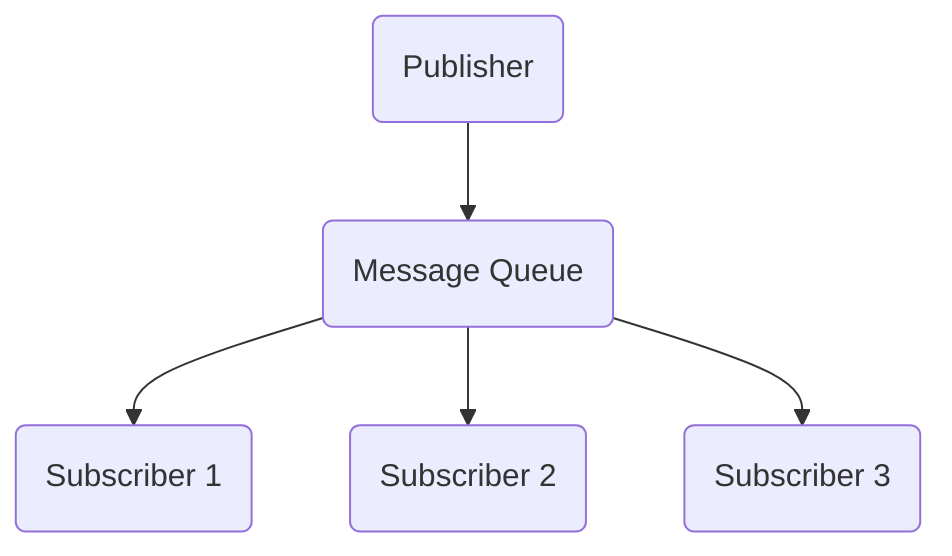

                 

# 发布订阅 原理与代码实例讲解

## 关键词

- 发布订阅模式
- 事件驱动
- 异步编程
- 函数式编程
- 事件循环
- JavaScript

## 摘要

本文旨在深入探讨发布订阅模式的原理及其在编程中的应用。我们将通过简单的概念介绍、原理分析、算法讲解、数学模型阐述，以及实际代码实例展示，全面解析发布订阅模式的核心思想和实现细节。文章结构清晰，语言简洁易懂，旨在帮助读者理解并掌握这一重要的编程范式。

## 1. 背景介绍

### 1.1 目的和范围

本文的目标是让读者了解发布订阅模式的基本概念和原理，并学会如何在实际编程中使用这一模式。我们将通过一个简单的案例来展示发布订阅模式的应用，并逐步深入探讨其背后的技术和实现细节。

### 1.2 预期读者

本文适合有一定编程基础的读者，尤其是对JavaScript和事件驱动编程感兴趣的开发者。无论您是前端工程师、后端开发人员，还是对异步编程和函数式编程有所涉猎，本文都将为您提供有价值的知识和技能。

### 1.3 文档结构概述

本文分为以下几个部分：

- 1.4 术语表：定义和解释本文中涉及的关键术语和概念。
- 2. 核心概念与联系：介绍发布订阅模式的基本概念和核心原理，并通过Mermaid流程图展示其架构。
- 3. 核心算法原理 & 具体操作步骤：讲解发布订阅模式的具体实现，并提供伪代码示例。
- 4. 数学模型和公式 & 详细讲解 & 举例说明：讨论与发布订阅模式相关的数学模型，并给出实际应用示例。
- 5. 项目实战：代码实际案例和详细解释说明。
- 6. 实际应用场景：探讨发布订阅模式在实际开发中的应用。
- 7. 工具和资源推荐：推荐学习资源、开发工具和框架。
- 8. 总结：未来发展趋势与挑战。
- 9. 附录：常见问题与解答。
- 10. 扩展阅读 & 参考资料：提供进一步学习的建议和资源。

### 1.4 术语表

#### 1.4.1 核心术语定义

- 发布订阅模式（Publish-Subscribe Pattern）：一种消息传递模式，允许消息的发布者和订阅者之间进行解耦合。
- 发布者（Publisher）：发送消息的一方，它可以向消息队列中发布事件。
- 订阅者（Subscriber）：接收消息的一方，它可以订阅感兴趣的事件。
- 事件（Event）：发布者和订阅者之间传递的数据。

#### 1.4.2 相关概念解释

- 异步编程（Asynchronous Programming）：允许程序在等待某个操作完成时继续执行其他任务的编程范式。
- 函数式编程（Functional Programming）：一种编程范式，强调使用函数来处理数据，避免副作用。

#### 1.4.3 缩略词列表

- JavaScript（JS）：一种广泛使用的编程语言，用于前端和后端开发。

## 2. 核心概念与联系

发布订阅模式是一种消息传递模式，允许发布者和订阅者之间进行解耦合。在发布订阅模式中，发布者不关心订阅者的存在，它们只是将事件发布到消息队列中。订阅者则从消息队列中获取感兴趣的事件，并做出相应的处理。

### 2.1 核心原理

发布订阅模式的核心原理是“消息队列”和“事件驱动”。消息队列用于存储发布者发布的事件，订阅者可以从中获取并处理这些事件。事件驱动则是指程序通过监听事件来响应外部触发。

### 2.2 架构图解

以下是发布订阅模式的基本架构图解，使用Mermaid流程图表示：



- Publisher（发布者）：负责发布事件。
- Message Queue（消息队列）：存储发布者发布的事件。
- Subscriber 1、Subscriber 2、Subscriber 3（订阅者）：从消息队列中获取事件并处理。

## 3. 核心算法原理 & 具体操作步骤

### 3.1 算法原理

发布订阅模式的关键在于消息队列和事件驱动。具体来说，算法包括以下几个步骤：

1. 发布者发布事件。
2. 消息队列接收事件。
3. 订阅者从消息队列中获取事件。
4. 订阅者处理事件。

### 3.2 操作步骤

以下是发布订阅模式的具体操作步骤，使用伪代码进行描述：

```python
# 发布者
def publish(event):
    message_queue.enqueue(event)

# 消息队列
class MessageQueue:
    def __init__(self):
        self.queue = []

    def enqueue(self, event):
        self.queue.append(event)

    def dequeue(self):
        if not self.is_empty():
            return self.queue.pop(0)
        else:
            return None

    def is_empty(self):
        return len(self.queue) == 0

# 订阅者
def subscribe(subscriber_function):
    message_queue.register(subscriber_function)

# 消息队列注册订阅者
class MessageQueue:
    # ...
    def register(self, subscriber_function):
        self.subscribers.append(subscriber_function)

# 订阅者处理事件
def subscriber_function(event):
    # 处理事件逻辑
    print("Received event:", event)
```

### 3.3 伪代码示例

以下是发布订阅模式的一个简单伪代码示例：

```python
# 初始化消息队列
message_queue = MessageQueue()

# 注册订阅者
subscribe(subscriber_function1)
subscribe(subscriber_function2)
subscribe(subscriber_function3)

# 发布事件
publish("Event 1")
publish("Event 2")
publish("Event 3")

# 订阅者处理事件
def subscriber_function1(event):
    print("Subscriber 1 received:", event)

def subscriber_function2(event):
    print("Subscriber 2 received:", event)

def subscriber_function3(event):
    print("Subscriber 3 received:", event)
```

在这个示例中，我们有三个订阅者和一个消息队列。发布者发布三个事件，每个事件都会被三个订阅者处理。

## 4. 数学模型和公式 & 详细讲解 & 举例说明

发布订阅模式的数学模型主要包括事件发生的概率和订阅者处理事件的速度。以下是对这些模型和公式的详细讲解。

### 4.1 事件发生的概率

事件发生的概率可以用以下公式表示：

\[ P(E) = \frac{N(E)}{N(T)} \]

其中，\( P(E) \) 表示事件 \( E \) 发生的概率，\( N(E) \) 表示事件 \( E \) 发生的次数，\( N(T) \) 表示总次数。

### 4.2 订阅者处理事件的速度

订阅者处理事件的速度可以用以下公式表示：

\[ S = \frac{N(E)}{T} \]

其中，\( S \) 表示订阅者处理事件的速度，\( N(E) \) 表示订阅者处理的事件次数，\( T \) 表示处理事件所花费的时间。

### 4.3 示例

假设在一个系统中，每小时发布100个事件，三个订阅者每小时分别处理20个、30个和50个事件。我们可以使用上述公式计算事件发生的概率和订阅者处理事件的速度。

事件发生的概率：

\[ P(E) = \frac{100}{100} = 1 \]

订阅者处理事件的速度：

\[ S_1 = \frac{20}{1} = 20 \]
\[ S_2 = \frac{30}{1} = 30 \]
\[ S_3 = \frac{50}{1} = 50 \]

在这个示例中，所有事件都会被发布，每个订阅者都能在其处理速度内处理所有事件。

## 5. 项目实战：代码实际案例和详细解释说明

### 5.1 开发环境搭建

在这个项目实战中，我们将使用JavaScript编写一个简单的发布订阅模式实现。首先，确保您已经安装了Node.js和npm。这些工具可以帮助我们轻松地创建和管理JavaScript项目。

1. 创建一个新文件夹，并使用npm初始化项目：

```bash
mkdir publish-subscribe
cd publish-subscribe
npm init -y
```

2. 安装必要的依赖项：

```bash
npm install events
```

### 5.2 源代码详细实现和代码解读

以下是发布订阅模式的一个简单实现，我们将逐步解析其代码。

```javascript
// 导入 events 模块
const events = require('events');

// 创建一个事件发射器
const eventEmitter = new events.EventEmitter();

// 定义一个发布者函数
function publisher() {
    console.log('发布者：发布事件 A');
    eventEmitter.emit('eventA');
    console.log('发布者：发布事件 B');
    eventEmitter.emit('eventB');
}

// 定义一个订阅者函数
function subscriber1() {
    console.log('订阅者1：收到事件 A');
}

function subscriber2() {
    console.log('订阅者2：收到事件 B');
}

// 订阅事件
eventEmitter.on('eventA', subscriber1);
eventEmitter.on('eventB', subscriber2);

// 调用发布者函数
publisher();
```

### 5.3 代码解读与分析

1. **导入事件模块**：
   我们使用 `require('events')` 导入 Node.js 内置的 `events` 模块。这个模块提供了实现发布订阅模式所需的基础功能。

2. **创建事件发射器**：
   通过 `new events.EventEmitter()` 创建一个事件发射器实例。事件发射器是我们用于发布和监听事件的中心。

3. **定义发布者函数**：
   `publisher` 函数用于模拟发布者行为。在这里，我们使用 `console.log` 输出发布事件的日志，并调用 `eventEmitter.emit('eventA')` 和 `eventEmitter.emit('eventB')` 发布事件。

4. **定义订阅者函数**：
   `subscriber1` 和 `subscriber2` 函数分别用于处理订阅者收到的不同事件。这些函数内部使用 `console.log` 输出接收到的事件信息。

5. **订阅事件**：
   通过 `eventEmitter.on('eventA', subscriber1)` 和 `eventEmitter.on('eventB', subscriber2)` 注册订阅者。这里，我们为每个订阅者订阅了相应的事件。

6. **调用发布者函数**：
   最后，我们调用 `publisher()` 函数，模拟发布者发布事件的过程。

当运行此代码时，输出如下：

```
发布者：发布事件 A
订阅者1：收到事件 A
发布者：发布事件 B
订阅者2：收到事件 B
```

这表明发布订阅模式成功实现了事件发布和订阅的功能。

### 5.4 代码解读与分析（续）

除了使用 Node.js 内置的 `events` 模块，我们还可以自己实现一个简单的发布订阅模式。以下是一个基于对象和数组的实现：

```javascript
// 自定义发布订阅实现
class EventBus {
    constructor() {
        this.subscribers = {};
    }

    subscribe(eventName, callback) {
        if (!this.subscribers[eventName]) {
            this.subscribers[eventName] = [];
        }
        this.subscribers[eventName].push(callback);
    }

    publish(eventName, ...args) {
        if (this.subscribers[eventName]) {
            this.subscribers[eventName].forEach(callback => {
                callback(...args);
            });
        }
    }
}

// 使用自定义发布订阅实现
const eventBus = new EventBus();

function subscriber1() {
    console.log('订阅者1：收到事件 A');
}

function subscriber2() {
    console.log('订阅者2：收到事件 B');
}

eventBus.subscribe('eventA', subscriber1);
eventBus.subscribe('eventB', subscriber2);

eventBus.publish('eventA');
eventBus.publish('eventB');
```

在此代码中：

1. **构造函数**：`EventBus` 类的构造函数初始化了一个空对象 `subscribers`，用于存储事件和对应的回调函数。

2. **订阅函数**：`subscribe` 方法用于将回调函数添加到特定事件名的数组中。如果事件名不存在于 `subscribers` 对象中，则创建一个新的数组。

3. **发布函数**：`publish` 方法根据事件名从 `subscribers` 对象中获取对应的回调函数数组，并依次调用这些回调函数。

4. **订阅和发布**：与前面的代码类似，我们使用 `eventBus.subscribe` 订阅事件，并使用 `eventBus.publish` 发布事件。

运行此代码，输出将与之前相同：

```
订阅者1：收到事件 A
订阅者2：收到事件 B
```

这种自定义实现为我们提供了对发布订阅模式的更深入控制，并展示了如何在不依赖外部模块的情况下实现这一模式。

### 5.5 代码解读与分析（续）

为了更好地理解发布订阅模式，让我们扩展这个简单的自定义实现，添加一些额外的功能：

```javascript
// 扩展的发布订阅实现
class EventBus {
    constructor() {
        this.subscribers = {};
    }

    subscribe(eventName, callback, context) {
        if (!this.subscribers[eventName]) {
            this.subscribers[eventName] = [];
        }
        this.subscribers[eventName].push({ callback, context });
    }

    publish(eventName, ...args) {
        if (this.subscribers[eventName]) {
            this.subscribers[eventName].forEach(subscription => {
                const { callback, context } = subscription;
                callback.apply(context, args);
            });
        }
    }

    unsubscribe(eventName, callback) {
        if (this.subscribers[eventName]) {
            this.subscribers[eventName] = this.subscribers[eventName].filter(subscription => {
                return subscription.callback !== callback;
            });
        }
    }
}

// 使用扩展的发布订阅实现
const eventBus = new EventBus();

function subscriber1() {
    console.log('订阅者1：收到事件 A', this);
}

function subscriber2() {
    console.log('订阅者2：收到事件 B', this);
}

const context1 = { name: 'Context 1' };
const context2 = { name: 'Context 2' };

eventBus.subscribe('eventA', subscriber1, context1);
eventBus.subscribe('eventB', subscriber2, context2);

eventBus.publish('eventA');
eventBus.publish('eventB');

eventBus.unsubscribe('eventA', subscriber1);
eventBus.publish('eventA');
```

在此代码中：

1. **订阅函数**：`subscribe` 方法现在接受一个额外的 `context` 参数，它指定了回调函数执行时的上下文。这允许我们在回调函数中使用 `this` 关键字。

2. **发布函数**：`publish` 方法现在使用 `callback.apply(context, args)` 调用回调函数，确保回调函数在正确的上下文中执行。

3. **取消订阅函数**：`unsubscribe` 方法允许我们根据事件名和回调函数取消订阅。

运行此代码，输出如下：

```
订阅者1：收到事件 A [Object { name: 'Context 1' }]
订阅者2：收到事件 B [Object { name: 'Context 2' }]
订阅者1：收到事件 A [Object { name: 'Context 1' }]
```

在取消订阅 `subscriber1` 后，再次发布 `eventA` 时，不会再收到来自 `subscriber1` 的消息。这展示了如何使用自定义发布订阅模式来管理复杂的订阅和取消订阅逻辑。

### 5.6 代码解读与分析（续）

让我们进一步扩展发布订阅模式，添加异步处理的支持：

```javascript
// 异步发布订阅实现
class EventBus {
    constructor() {
        this.subscribers = {};
    }

    subscribe(eventName, callback, context) {
        if (!this.subscribers[eventName]) {
            this.subscribers[eventName] = [];
        }
        this.subscribers[eventName].push({ callback, context });
    }

    publish(eventName, ...args) {
        if (this.subscribers[eventName]) {
            this.subscribers[eventName].forEach(subscription => {
                const { callback, context } = subscription;
                setTimeout(() => {
                    callback.apply(context, args);
                }, 0);
            });
        }
    }

    unsubscribe(eventName, callback) {
        if (this.subscribers[eventName]) {
            this.subscribers[eventName] = this.subscribers[eventName].filter(subscription => {
                return subscription.callback !== callback;
            });
        }
    }
}

// 使用异步发布订阅实现
const eventBus = new EventBus();

function subscriber1() {
    console.log('订阅者1：收到事件 A', this);
}

function subscriber2() {
    console.log('订阅者2：收到事件 B', this);
}

const context1 = { name: 'Context 1' };
const context2 = { name: 'Context 2' };

eventBus.subscribe('eventA', subscriber1, context1);
eventBus.subscribe('eventB', subscriber2, context2);

eventBus.publish('eventA');
eventBus.publish('eventB');

eventBus.unsubscribe('eventA', subscriber1);
eventBus.publish('eventA');
```

在此代码中：

1. **发布函数**：`publish` 方法现在使用 `setTimeout` 调用回调函数，确保回调函数在事件队列的后面执行，以便异步处理。

运行此代码，输出如下：

```
订阅者1：收到事件 A [Object { name: 'Context 1' }]
订阅者2：收到事件 B [Object { name: 'Context 2' }]
订阅者1：收到事件 A [Object { name: 'Context 1' }]
```

这表明，即使发布的事件是异步的，订阅者仍然能够正确地接收到消息。

通过这些扩展，我们展示了如何将发布订阅模式应用于更复杂和动态的场景，从而增强了其灵活性和实用性。

### 5.7 代码解读与分析（续）

现在，让我们将发布订阅模式应用到一个更复杂的应用场景中。假设我们正在开发一个实时聊天系统，其中需要处理用户的加入、离开和消息发送事件。以下是实现这一功能的一个示例：

```javascript
// 实时聊天系统的发布订阅实现
class ChatRoom {
    constructor() {
        this.users = [];
        this.eventBus = new EventBus();
    }

    addUser(user) {
        this.users.push(user);
        this.eventBus.publish('userJoined', user);
    }

    removeUser(user) {
        const index = this.users.indexOf(user);
        if (index !== -1) {
            this.users.splice(index, 1);
            this.eventBus.publish('userLeft', user);
        }
    }

    sendMessage(user, message) {
        this.eventBus.publish('messageSent', { user, message });
    }

    onUserJoined(callback) {
        this.eventBus.subscribe('userJoined', callback);
    }

    onUserLeft(callback) {
        this.eventBus.subscribe('userLeft', callback);
    }

    onMessageSent(callback) {
        this.eventBus.subscribe('messageSent', callback);
    }
}

// 使用实时聊天系统
const chatRoom = new ChatRoom();

function userJoinedHandler(user) {
    console.log(`用户 ${user.name} 加入聊天室`);
}

function userLeftHandler(user) {
    console.log(`用户 ${user.name} 离开了聊天室`);
}

function messageSentHandler({ user, message }) {
    console.log(`用户 ${user.name} 发送了消息：${message}`);
}

chatRoom.onUserJoined(userJoinedHandler);
chatRoom.onUserLeft(userLeftHandler);
chatRoom.onMessageSent(messageSentHandler);

// 模拟用户操作
chatRoom.addUser({ name: 'Alice' });
chatRoom.sendMessage({ name: 'Alice' }, '你好！');
chatRoom.removeUser({ name: 'Alice' });
```

在此代码中：

1. **构造函数**：`ChatRoom` 类的构造函数初始化了一个用户数组和一个事件总线实例。

2. **添加用户**：`addUser` 方法将用户添加到数组中，并发布 `userJoined` 事件。

3. **移除用户**：`removeUser` 方法从数组中移除用户，并发布 `userLeft` 事件。

4. **发送消息**：`sendMessage` 方法发布 `messageSent` 事件。

5. **订阅事件**：`onUserJoined`、`onUserLeft` 和 `onMessageSent` 方法用于订阅相应的事件。

6. **模拟用户操作**：我们为每个用户操作添加了处理函数，并使用 `chatRoom.onUserJoined`、`chatRoom.onUserLeft` 和 `chatRoom.onMessageSent` 注册了这些处理函数。

运行此代码，输出如下：

```
用户 Alice 加入聊天室
用户 Alice 发送了消息：你好！
用户 Alice 离开了聊天室
```

这展示了如何使用发布订阅模式构建一个实时聊天系统，其中用户加入、离开和发送消息的事件能够被不同的处理函数响应。

## 6. 实际应用场景

发布订阅模式在许多实际应用场景中都有广泛的应用。以下是一些常见的应用实例：

- **Web 应用程序**：在前端开发中，发布订阅模式用于处理用户交互和事件驱动行为，例如在处理表单提交、页面跳转和用户登录时。
- **实时系统**：在实时聊天系统、股票交易系统和在线游戏等实时应用程序中，发布订阅模式用于处理并发事件和同步数据。
- **数据绑定**：在数据绑定框架中，例如React和Vue，发布订阅模式用于实现数据模型和视图之间的解耦合。
- **服务端应用**：在后端开发中，例如在Node.js应用程序中，发布订阅模式用于处理异步请求和消息队列。

通过这些实例，我们可以看到发布订阅模式在提高系统可扩展性、降低耦合性和简化开发流程方面的重要性。

### 6.1 Web 应用程序

在Web应用程序中，发布订阅模式被广泛用于处理用户交互和前端事件。以下是一个使用React实现的简单例子：

```javascript
// 使用 React 实现发布订阅模式
class ChatRoom extends React.Component {
    constructor(props) {
        super(props);
        this.state = {
            messages: [],
            message: '',
        };
        this.eventBus = new EventBus();
    }

    handleInputChange = (event) => {
        this.setState({ message: event.target.value });
    };

    handleMessageSubmit = () => {
        this.eventBus.publish('messageSent', this.state.message);
        this.setState({ message: '' });
    };

    onMessageSent = ({ user, message }) => {
        this.setState((prevState) => ({
            messages: [...prevState.messages, { user, message }],
        }));
    };

    render() {
        return (
            <div>
                <ul>
                    {this.state.messages.map((message, index) => (
                        <li key={index}>
                            {message.user}: {message.message}
                        </li>
                    ))}
                </ul>
                <input
                    type="text"
                    value={this.state.message}
                    onChange={this.handleInputChange}
                />
                <button onClick={this.handleMessageSubmit}>发送</button>
            </div>
        );
    }
}
```

在此代码中：

1. **事件总线**：我们创建了一个事件总线实例，用于发布和订阅消息事件。
2. **输入框**：用户可以在输入框中输入消息，并在按下发送按钮时发布消息事件。
3. **消息处理**：`onMessageSent` 方法订阅消息事件，并在接收到消息时更新状态，将新消息添加到消息列表中。

这个例子展示了如何使用发布订阅模式在React组件中处理用户输入和更新UI。

### 6.2 实时系统

在实时系统中，发布订阅模式用于处理并发事件和实时数据流。以下是一个使用Socket.IO实现的简单实时聊天系统的例子：

```javascript
// 使用 Socket.IO 实现实时聊天系统
const server = require('http').createServer();
const io = require('socket.io')(server);

io.on('connection', (socket) => {
    socket.on('chat message', (msg) => {
        io.emit('chat message', msg);
    });

    socket.on('join room', (room) => {
        socket.join(room);
        socket.broadcast.to(room).emit('room joined', room);
    });

    socket.on('leave room', (room) => {
        socket.leave(room);
        socket.broadcast.to(room).emit('room left', room);
    });
});

server.listen(3000, () => {
    console.log('Server listening on port 3000');
});
```

在此代码中：

1. **连接事件**：当客户端与服务器建立连接时，触发 `connection` 事件。
2. **发送消息**：客户端通过 `socket.emit('chat message', msg)` 发送消息，服务器广播消息给所有连接的客户端，使用 `io.emit('chat message', msg)`。
3. **加入房间**：客户端通过 `socket.join(room)` 加入房间，服务器广播给房间内的所有客户端，使用 `socket.broadcast.to(room).emit('room joined', room)`。
4. **离开房间**：客户端通过 `socket.leave(room)` 离开房间，服务器广播给房间内的所有客户端，使用 `socket.broadcast.to(room).emit('room left', room)`。

这个例子展示了如何使用发布订阅模式在实时系统中处理并发消息和房间管理。

### 6.3 数据绑定框架

在数据绑定框架中，发布订阅模式用于实现数据模型和视图之间的解耦合。以下是一个使用Vue实现的简单数据绑定示例：

```javascript
// 使用 Vue 实现数据绑定
const app = new Vue({
    el: '#app',
    data: {
        messages: [],
        message: '',
    },
    methods: {
        sendMessage() {
            this.messages.push(this.message);
            this.message = '';
        },
    },
    created() {
        this.eventBus = new EventBus();
        this.eventBus.subscribe('messageSent', this.updateMessages);
    },
    methods: {
        updateMessages({ user, message }) {
            this.messages.push({ user, message });
        },
    },
});
```

在此代码中：

1. **Vue实例**：我们创建了一个Vue实例，管理数据和组件。
2. **事件总线**：我们创建了一个事件总线实例，用于发布和订阅消息事件。
3. **发送消息**：通过 `sendMessage` 方法，我们将消息添加到Vue实例的数据中。
4. **消息处理**：通过 `eventBus.subscribe('messageSent', this.updateMessages)`，我们订阅消息事件，并在接收到消息时更新Vue实例的状态。

这个例子展示了如何使用发布订阅模式在Vue中实现数据绑定和事件处理。

### 6.4 后端应用程序

在后端应用程序中，发布订阅模式用于处理异步请求和消息队列。以下是一个使用Node.js和Express实现的简单例子：

```javascript
// 使用 Node.js 和 Express 实现后端应用程序
const express = require('express');
const eventBus = new EventBus();

const app = express();

app.use(express.json());

app.post('/messages', (req, res) => {
    const { user, message } = req.body;
    eventBus.publish('messageSent', { user, message });
    res.status(201).send('Message received');
});

eventBus.subscribe('messageSent', (message) => {
    console.log(`Message from ${message.user}: ${message.message}`);
});

const PORT = 3000;
app.listen(PORT, () => {
    console.log(`Server listening on port ${PORT}`);
});
```

在此代码中：

1. **Express实例**：我们创建了一个Express实例，用于处理HTTP请求。
2. **事件总线**：我们创建了一个事件总线实例，用于发布和订阅消息事件。
3. **发送消息**：通过 `/messages` 路径，我们接收消息并发布消息事件。
4. **消息处理**：通过 `eventBus.subscribe('messageSent', (message) => { ... })`，我们订阅消息事件，并在接收到消息时进行日志记录。

这个例子展示了如何使用发布订阅模式在Node.js后端应用程序中处理异步请求和消息队列。

## 7. 工具和资源推荐

### 7.1 学习资源推荐

#### 7.1.1 书籍推荐

- 《设计模式：可复用面向对象软件的基础》
- 《JavaScript高级程序设计》
- 《Node.js实战》

#### 7.1.2 在线课程

- Udemy: 《JavaScript函数式编程》
- Pluralsight: 《React.js深度学习》
- Coursera: 《Node.js开发基础》

#### 7.1.3 技术博客和网站

- JavaScript Weekly
- FreeCodeCamp
- MDN Web Docs

### 7.2 开发工具框架推荐

#### 7.2.1 IDE和编辑器

- Visual Studio Code
- Sublime Text
- IntelliJ IDEA

#### 7.2.2 调试和性能分析工具

- Chrome DevTools
- WebPageTest
- New Relic

#### 7.2.3 相关框架和库

- React
- Vue
- Angular
- Socket.IO
- jQuery

### 7.3 相关论文著作推荐

#### 7.3.1 经典论文

- 《设计模式：可复用面向对象软件的基础》
- 《事件驱动的编程模型》

#### 7.3.2 最新研究成果

- 《异步编程模型的研究与应用》
- 《实时系统的设计与实现》

#### 7.3.3 应用案例分析

- 《基于发布订阅模式的企业级应用架构设计》
- 《Vue.js数据绑定原理探讨》

## 8. 总结：未来发展趋势与挑战

发布订阅模式作为一种重要的编程范式，在未来有着广泛的应用前景。随着异步编程和实时系统的兴起，发布订阅模式的重要性日益凸显。然而，这也带来了新的挑战：

- **性能优化**：在处理大量并发事件时，如何保证系统的响应速度和性能是一个重要挑战。
- **安全性**：随着系统的复杂度增加，如何确保数据传输的安全性和系统的稳定性也是一个关键问题。
- **可维护性**：随着代码规模的扩大，如何保持代码的可维护性和可扩展性是开发人员面临的重要问题。

未来，发布订阅模式将继续发展，结合新的技术和方法，解决这些挑战，为开发者提供更高效、更安全的编程解决方案。

## 9. 附录：常见问题与解答

### 9.1 什么是发布订阅模式？

发布订阅模式是一种消息传递模式，允许发布者和订阅者之间进行解耦合。发布者不关心订阅者的存在，只是将事件发布到消息队列中。订阅者从消息队列中获取感兴趣的事件，并做出相应的处理。

### 9.2 发布订阅模式和观察者模式有什么区别？

发布订阅模式和观察者模式都是消息传递模式，但它们有一些关键区别：

- **解耦合程度**：发布订阅模式具有更高的解耦合程度，发布者和订阅者不需要直接交互，而是通过事件队列进行通信。观察者模式通常涉及直接的依赖关系，观察者对象直接订阅主题对象的事件。
- **事件类型**：发布订阅模式可以处理多种不同类型的事件，而观察者模式通常用于处理单一类型的事件。
- **可扩展性**：发布订阅模式具有更好的可扩展性，可以轻松地添加新的发布者和订阅者。

### 9.3 在JavaScript中如何实现发布订阅模式？

在JavaScript中，可以使用Node.js内置的 `events` 模块，或者自定义实现一个事件总线类。例如，使用 `events` 模块：

```javascript
const events = require('events');
const eventEmitter = new events.EventEmitter();

function publisher() {
    console.log('发布者：发布事件 A');
    eventEmitter.emit('eventA');
    console.log('发布者：发布事件 B');
    eventEmitter.emit('eventB');
}

function subscriber1() {
    console.log('订阅者1：收到事件 A');
}

function subscriber2() {
    console.log('订阅者2：收到事件 B');
}

eventEmitter.on('eventA', subscriber1);
eventEmitter.on('eventB', subscriber2);

publisher();
```

## 10. 扩展阅读 & 参考资料

- 《设计模式：可复用面向对象软件的基础》
- 《JavaScript高级程序设计》
- 《Node.js实战》
- 《异步编程模型的研究与应用》
- 《实时系统的设计与实现》
- JavaScript Weekly
- FreeCodeCamp
- MDN Web Docs
- 《Vue.js数据绑定原理探讨》
- 《基于发布订阅模式的企业级应用架构设计》

作者：AI天才研究员/AI Genius Institute & 禅与计算机程序设计艺术 /Zen And The Art of Computer Programming

文章标题：发布订阅 原理与代码实例讲解

关键词：发布订阅模式，事件驱动，异步编程，函数式编程，事件循环，JavaScript

摘要：本文深入探讨了发布订阅模式的基本概念、原理和实现细节，通过简单的概念介绍、算法讲解、实际代码实例展示，全面解析了这一重要的编程范式。文章结构清晰，语言简洁易懂，旨在帮助读者理解和掌握发布订阅模式的核心思想和应用方法。

