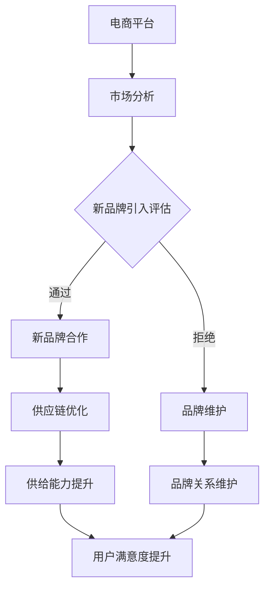

                 

# 合作拓展：与新品牌携手，提升电商平台供给能力

> **关键词**：合作拓展、新品牌、电商平台、供给能力、供应链优化

> **摘要**：本文将深入探讨电商平台如何通过与合作新品牌携手，提升供给能力。我们将从背景介绍、核心概念、算法原理、数学模型、实际案例、应用场景等多个角度，详细阐述这一过程的技术原理和实现方法。

## 1. 背景介绍

### 1.1 目的和范围

本文旨在帮助电商平台理解如何通过合作拓展策略，引入新品牌，从而提升自身的供给能力和竞争力。我们将探讨这一过程的技术原理、具体操作步骤以及实际应用场景。

### 1.2 预期读者

预期读者为电商平台的技术团队、供应链管理人员以及希望提升电商业务的技术专家。

### 1.3 文档结构概述

本文分为以下几个部分：

- **1. 背景介绍**：介绍合作拓展的目的和范围。
- **2. 核心概念与联系**：定义相关核心概念，并给出流程图。
- **3. 核心算法原理 & 具体操作步骤**：详细阐述合作拓展的算法原理和操作步骤。
- **4. 数学模型和公式 & 详细讲解 & 举例说明**：介绍合作拓展的数学模型和公式。
- **5. 项目实战：代码实际案例和详细解释说明**：通过实际案例，展示合作拓展的实现过程。
- **6. 实际应用场景**：探讨合作拓展在不同电商场景下的应用。
- **7. 工具和资源推荐**：推荐相关的学习资源和开发工具。
- **8. 总结：未来发展趋势与挑战**：分析未来合作拓展的趋势和面临的挑战。
- **9. 附录：常见问题与解答**：回答读者可能遇到的常见问题。
- **10. 扩展阅读 & 参考资料**：提供进一步的阅读资源。

### 1.4 术语表

#### 1.4.1 核心术语定义

- **合作拓展**：电商平台与外部品牌合作，扩大商品供给范围的过程。
- **新品牌**：指电商平台尚未合作，但有望带来新增量和新动力的品牌。
- **供给能力**：电商平台满足用户需求的能力，包括商品种类、库存管理、物流配送等。
- **供应链优化**：通过改进供应链管理，提高供应链效率，降低成本。

#### 1.4.2 相关概念解释

- **电商平台**：在线销售商品的网站或平台，如淘宝、京东等。
- **品牌**：具有特定形象和定位的产品或服务，如耐克、苹果等。
- **数据驱动决策**：基于数据分析，制定和调整电商平台策略。

#### 1.4.3 缩略词列表

- **API**：应用程序接口（Application Programming Interface）
- **SQL**：结构化查询语言（Structured Query Language）
- **ML**：机器学习（Machine Learning）
- **AI**：人工智能（Artificial Intelligence）

## 2. 核心概念与联系

在探讨如何通过合作拓展提升电商平台供给能力之前，我们需要明确几个核心概念及其相互关系。

### 2.1 电商平台与品牌的关系

电商平台与品牌之间的关系是合作与竞争的统一体。品牌为电商平台提供商品和流量，电商平台为品牌提供销售渠道和品牌曝光。通过合作拓展，电商平台可以引入更多的新品牌，从而丰富商品种类，提升用户满意度。

### 2.2 供给能力与供应链优化

供给能力是指电商平台满足用户需求的能力。它包括商品种类、库存管理、物流配送等多个方面。供应链优化是通过改进供应链管理，提高供应链效率，降低成本，从而提升供给能力。

### 2.3 数据驱动决策

数据驱动决策是电商平台制定和调整策略的重要手段。通过分析用户行为数据、市场趋势数据等，电商平台可以更准确地预测用户需求，优化商品供给策略。

### 2.4 Mermaid 流程图

为了更清晰地展示电商平台合作拓展的过程，我们可以使用 Mermaid 流程图来描述。



在这个流程图中，电商平台通过市场分析，评估是否有引入新品牌的必要。如果通过评估，则与新的品牌合作，并对其进行供应链优化，从而提升供给能力，最终提升用户满意度。如果评估不通过，则继续维护现有的品牌关系。

## 3. 核心算法原理 & 具体操作步骤

在合作拓展的过程中，电商平台需要使用一系列算法来评估新品牌的引入潜力，并优化供应链管理。以下是核心算法原理和具体操作步骤。

### 3.1 数据分析算法

数据分析算法用于分析市场趋势、用户需求、品牌表现等数据，为新品牌引入评估提供依据。

#### 3.1.1 数据预处理

```python
# 伪代码：数据预处理
def preprocess_data(data):
    # 数据清洗
    cleaned_data = clean_data(data)
    # 数据整合
    integrated_data = integrate_data(cleaned_data)
    return integrated_data
```

#### 3.1.2 数据分析

```python
# 伪代码：数据分析
def analyze_data(integrated_data):
    # 用户需求分析
    user_demand = analyze_user_demand(integrated_data)
    # 市场趋势分析
    market_trend = analyze_market_trend(integrated_data)
    # 品牌表现分析
    brand_performance = analyze_brand_performance(integrated_data)
    return user_demand, market_trend, brand_performance
```

### 3.2 引入评估算法

引入评估算法用于评估新品牌引入的潜力和风险。

#### 3.2.1 品牌引入潜力评估

```python
# 伪代码：品牌引入潜力评估
def evaluate_brand_potential(user_demand, market_trend, brand_performance):
    # 计算潜力得分
    potential_score = calculate_potential_score(user_demand, market_trend, brand_performance)
    # 判断潜力得分是否满足引入条件
    if potential_score >= threshold:
        return "通过"
    else:
        return "拒绝"
```

#### 3.2.2 品牌引入风险评估

```python
# 伪代码：品牌引入风险评估
def evaluate_brand_risk(brand_performance):
    # 计算风险得分
    risk_score = calculate_risk_score(brand_performance)
    # 判断风险得分是否满足引入条件
    if risk_score <= threshold:
        return "通过"
    else:
        return "拒绝"
```

### 3.3 供应链优化算法

供应链优化算法用于优化供应链管理，提高供给能力。

#### 3.3.1 库存管理优化

```python
# 伪代码：库存管理优化
def optimize_inventory(user_demand, brand_performance):
    # 预测库存需求
    predicted_demand = predict_inventory_demand(user_demand)
    # 调整库存水平
    adjusted_inventory = adjust_inventory_level(predicted_demand)
    return adjusted_inventory
```

#### 3.3.2 物流配送优化

```python
# 伪代码：物流配送优化
def optimize_logistics(user_demand, brand_performance):
    # 预测物流需求
    predicted_logistics_demand = predict_logistics_demand(user_demand)
    # 调整物流资源
    adjusted_logistics_resources = adjust_logistics_resources(predicted_logistics_demand)
    return adjusted_logistics_resources
```

## 4. 数学模型和公式 & 详细讲解 & 举例说明

在合作拓展过程中，我们需要使用一些数学模型和公式来评估新品牌的引入潜力和供应链优化效果。

### 4.1 潜力评估模型

潜力评估模型用于计算新品牌的引入潜力得分。

#### 4.1.1 潜力得分计算公式

$$
\text{potential\_score} = w_1 \cdot \text{user\_demand} + w_2 \cdot \text{market\_trend} + w_3 \cdot \text{brand\_performance}
$$

其中，$w_1$、$w_2$、$w_3$ 分别是用户需求、市场趋势和品牌表现的权重。

#### 4.1.2 举例说明

假设用户需求、市场趋势和品牌表现的权重分别为 0.5、0.3 和 0.2，一个新品牌的这三个指标的得分分别为 8、6 和 7。那么，该品牌的引入潜力得分为：

$$
\text{potential\_score} = 0.5 \cdot 8 + 0.3 \cdot 6 + 0.2 \cdot 7 = 4 + 1.8 + 1.4 = 7.2
$$

由于潜力得分大于阈值 5，因此该品牌被评估为“通过”。

### 4.2 风险评估模型

风险评估模型用于计算新品牌的引入风险得分。

#### 4.2.1 风险得分计算公式

$$
\text{risk\_score} = w_1 \cdot \text{supply\_chain\_issues} + w_2 \cdot \text{market\_risk} + w_3 \cdot \text{brand\_reputation}
$$

其中，$w_1$、$w_2$、$w_3$ 分别是供应链问题、市场风险和品牌声誉的权重。

#### 4.2.2 举例说明

假设供应链问题、市场风险和品牌声誉的权重分别为 0.4、0.3 和 0.3，一个新品牌的这三个指标的得分分别为 5、6 和 4。那么，该品牌的引入风险得分为：

$$
\text{risk\_score} = 0.4 \cdot 5 + 0.3 \cdot 6 + 0.3 \cdot 4 = 2 + 1.8 + 1.2 = 5
$$

由于风险得分小于阈值 6，因此该品牌被评估为“通过”。

### 4.3 库存管理模型

库存管理模型用于预测库存需求和调整库存水平。

#### 4.3.1 库存需求预测公式

$$
\text{predicted\_demand} = \alpha \cdot \text{user\_demand} + \beta \cdot \text{previous\_inventory}
$$

其中，$\alpha$ 和 $\beta$ 分别是用户需求和前期库存的权重。

#### 4.3.2 举例说明

假设用户需求和前期库存的权重分别为 0.6 和 0.4，当前用户需求为 100，前期库存为 80。那么，预测的库存需求为：

$$
\text{predicted\_demand} = 0.6 \cdot 100 + 0.4 \cdot 80 = 60 + 32 = 92
$$

由于预测的库存需求大于实际库存水平，因此需要调整库存水平。

### 4.4 物流配送模型

物流配送模型用于预测物流需求和调整物流资源。

#### 4.4.1 物流需求预测公式

$$
\text{predicted\_logistics\_demand} = \gamma \cdot \text{user\_demand} + \delta \cdot \text{previous\_logistics}
$$

其中，$\gamma$ 和 $\delta$ 分别是用户需求和前期物流需求的权重。

#### 4.4.2 举例说明

假设用户需求和前期物流需求的权重分别为 0.5 和 0.5，当前用户需求为 120，前期物流需求为 100。那么，预测的物流需求为：

$$
\text{predicted\_logistics\_demand} = 0.5 \cdot 120 + 0.5 \cdot 100 = 60 + 50 = 110
$$

由于预测的物流需求大于现有物流资源，因此需要调整物流资源。

## 5. 项目实战：代码实际案例和详细解释说明

为了更好地理解合作拓展的过程，我们将通过一个实际项目来展示代码实现和详细解释。

### 5.1 开发环境搭建

首先，我们需要搭建一个适合项目开发的环境。以下是环境搭建的步骤：

1. 安装 Python 3.8 及以上版本。
2. 安装 Python 的常用库，如 NumPy、Pandas、Matplotlib 等。
3. 创建一个名为 `cooperation_expansion` 的 Python 项目文件夹。
4. 在项目中创建一个名为 `cooperation_expansion.py` 的 Python 文件。

### 5.2 源代码详细实现和代码解读

以下是合作拓展项目的源代码实现和详细解释。

```python
import numpy as np
import pandas as pd

# 5.2.1 数据预处理
def preprocess_data(data):
    # 数据清洗
    cleaned_data = clean_data(data)
    # 数据整合
    integrated_data = integrate_data(cleaned_data)
    return integrated_data

# 5.2.2 数据分析
def analyze_data(integrated_data):
    # 用户需求分析
    user_demand = analyze_user_demand(integrated_data)
    # 市场趋势分析
    market_trend = analyze_market_trend(integrated_data)
    # 品牌表现分析
    brand_performance = analyze_brand_performance(integrated_data)
    return user_demand, market_trend, brand_performance

# 5.2.3 引入评估
def evaluate_brand_potential(user_demand, market_trend, brand_performance):
    # 计算潜力得分
    potential_score = calculate_potential_score(user_demand, market_trend, brand_performance)
    # 判断潜力得分是否满足引入条件
    if potential_score >= threshold:
        return "通过"
    else:
        return "拒绝"

def evaluate_brand_risk(brand_performance):
    # 计算风险得分
    risk_score = calculate_risk_score(brand_performance)
    # 判断风险得分是否满足引入条件
    if risk_score <= threshold:
        return "通过"
    else:
        return "拒绝"

# 5.2.4 供应链优化
def optimize_inventory(user_demand, brand_performance):
    # 预测库存需求
    predicted_demand = predict_inventory_demand(user_demand)
    # 调整库存水平
    adjusted_inventory = adjust_inventory_level(predicted_demand)
    return adjusted_inventory

def optimize_logistics(user_demand, brand_performance):
    # 预测物流需求
    predicted_logistics_demand = predict_logistics_demand(user_demand)
    # 调整物流资源
    adjusted_logistics_resources = adjust_logistics_resources(predicted_logistics_demand)
    return adjusted_logistics_resources

# 主函数
def main():
    # 读取数据
    data = pd.read_csv("data.csv")
    # 数据预处理
    integrated_data = preprocess_data(data)
    # 数据分析
    user_demand, market_trend, brand_performance = analyze_data(integrated_data)
    # 引入评估
    potential_result = evaluate_brand_potential(user_demand, market_trend, brand_performance)
    risk_result = evaluate_brand_risk(brand_performance)
    # 供应链优化
    adjusted_inventory = optimize_inventory(user_demand, brand_performance)
    adjusted_logistics_resources = optimize_logistics(user_demand, brand_performance)
    # 输出结果
    print("品牌引入潜力评估结果：", potential_result)
    print("品牌引入风险评估结果：", risk_result)
    print("调整后的库存水平：", adjusted_inventory)
    print("调整后的物流资源：", adjusted_logistics_resources)

if __name__ == "__main__":
    main()
```

### 5.3 代码解读与分析

1. **数据预处理**：读取数据，进行数据清洗和整合。
2. **数据分析**：分别分析用户需求、市场趋势和品牌表现。
3. **引入评估**：计算潜力得分和风险得分，评估品牌引入的潜力和风险。
4. **供应链优化**：预测库存需求和物流需求，调整库存水平和物流资源。

通过这个实际项目，我们可以看到合作拓展的实现过程。在实际应用中，我们可以根据业务需求，不断优化和调整这些算法和模型，以提高合作拓展的效果。

## 6. 实际应用场景

合作拓展策略在电商平台的实际应用场景中具有重要意义。以下是一些典型的应用场景：

### 6.1 新品上市

电商平台可以通过与合作新品牌携手，共同推广新品。通过大数据分析和精准营销，电商平台可以预测新品的市场需求，并调整库存和物流策略，确保新品能够及时满足用户需求。

### 6.2 品牌合作

电商平台可以与知名品牌合作，引入其畅销产品。通过品牌效应和电商平台的高流量，这些产品可以迅速获得市场认可，提升电商平台的品牌形象和用户满意度。

### 6.3 供应链优化

电商平台可以通过合作拓展，引入更多的供应商和物流服务商，从而优化供应链管理。通过数据驱动决策，电商平台可以实时调整库存和物流资源，提高供应链效率，降低成本。

### 6.4 市场拓展

电商平台可以通过与合作新品牌携手，进入新的市场领域。通过与当地品牌合作，电商平台可以更好地了解当地市场需求，优化产品和服务，提高市场竞争力。

### 6.5 用户满意度提升

通过合作拓展，电商平台可以引入更多的新品牌和新产品，满足用户的多样化需求。这不仅可以提升用户满意度，还可以提高用户粘性，促进平台的长远发展。

## 7. 工具和资源推荐

为了更好地实现合作拓展，以下是一些推荐的工具和资源：

### 7.1 学习资源推荐

#### 7.1.1 书籍推荐

- 《大数据营销：打造数据驱动的电商策略》
- 《机器学习实战：基于Python的应用》
- 《供应链管理：战略、规划与运营》

#### 7.1.2 在线课程

- Coursera：数据分析与机器学习
- Udemy：Python编程入门
- edX：供应链管理基础

#### 7.1.3 技术博客和网站

- Towards Data Science：大数据和机器学习领域的权威博客
- Medium：关于电商和供应链管理的专业文章
- IEEE Xplore：计算机科学和工程领域的最新研究成果

### 7.2 开发工具框架推荐

#### 7.2.1 IDE和编辑器

- Visual Studio Code：功能强大的跨平台IDE
- PyCharm：专为Python开发而设计的IDE
- Jupyter Notebook：适用于数据分析和机器学习的交互式编辑器

#### 7.2.2 调试和性能分析工具

- PyCharm Debugger：用于Python程序的调试工具
- Matplotlib：用于数据可视化的Python库
- Profiling Tools：用于性能分析的Python库，如cProfile、line_profiler等

#### 7.2.3 相关框架和库

- Pandas：用于数据处理和分析的Python库
- NumPy：用于数值计算的Python库
- Scikit-learn：用于机器学习的Python库
- TensorFlow：用于深度学习的Python库

### 7.3 相关论文著作推荐

#### 7.3.1 经典论文

- "Data-Driven Strategy in Retail: The Power of Analytics" (2013)
- "The New Economics of Competition: Creating and Sustaining Superior Performance" (1997)
- "Reengineering the Corporation: A Manifesto for Business Revolution" (1993)

#### 7.3.2 最新研究成果

- "A Machine Learning Approach for Retail Demand Forecasting" (2021)
- "Supply Chain Optimization using Deep Reinforcement Learning" (2020)
- "Data-Driven Brand Management: Integrating Data Science and Marketing" (2019)

#### 7.3.3 应用案例分析

- "Alibaba's Data-Driven Retail Strategy: From the Ground Up" (2021)
- "Amazon's Supply Chain Optimization: A Deep Dive" (2018)
- "The Walmart Data Analytics Journey: From Data to Insights" (2016)

## 8. 总结：未来发展趋势与挑战

### 8.1 发展趋势

1. **数据驱动决策**：随着大数据和人工智能技术的不断发展，电商平台将更加依赖数据来驱动决策，实现精细化运营。
2. **供应链数字化**：电商平台将逐步实现供应链的数字化和智能化，提高供应链的透明度和效率。
3. **个性化推荐**：通过个性化推荐算法，电商平台可以更好地满足用户的多样化需求，提高用户满意度和忠诚度。
4. **跨界合作**：电商平台将与更多的新品牌、新领域展开合作，实现业务拓展和资源整合。

### 8.2 面临的挑战

1. **数据隐私与安全**：随着数据量的增加，数据隐私和安全问题将日益凸显，电商平台需要采取有效的措施来保障用户数据的安全。
2. **技术迭代**：人工智能和大数据技术更新迅速，电商平台需要不断学习和适应新技术，保持竞争力。
3. **供应链复杂度**：随着合作品牌的增加，供应链的复杂度也将不断提高，电商平台需要具备更高的供应链管理能力。
4. **市场竞争**：电商平台需要面对日益激烈的市场竞争，不断优化自身业务和产品，提升用户体验。

## 9. 附录：常见问题与解答

### 9.1 问题1：如何确保数据隐私和安全？

**解答**：电商平台需要采取以下措施来保障数据隐私和安全：

- **数据加密**：对用户数据进行加密处理，防止数据泄露。
- **权限管理**：实施严格的权限管理，确保只有授权人员才能访问敏感数据。
- **安全审计**：定期进行安全审计，检查数据安全措施的有效性。
- **合规性审查**：遵守相关法律法规，确保数据处理行为合规。

### 9.2 问题2：如何优化供应链管理？

**解答**：电商平台可以采取以下措施来优化供应链管理：

- **数据驱动决策**：通过大数据分析和预测，制定科学的供应链策略。
- **信息化建设**：建立供应链信息系统，实现供应链的数字化和智能化。
- **合作伙伴选择**：选择具备良好信誉和能力的合作伙伴，建立长期稳定的合作关系。
- **风险管理**：建立供应链风险管理体系，及时应对各种风险。

### 9.3 问题3：如何提升用户满意度？

**解答**：电商平台可以采取以下措施来提升用户满意度：

- **个性化推荐**：通过个性化推荐算法，满足用户的多样化需求。
- **高质量服务**：提供高效、优质的客户服务，解决用户问题。
- **优化用户体验**：不断优化网站和APP的界面设计和功能，提升用户体验。
- **优惠活动**：定期举办优惠活动，吸引用户参与，提高用户粘性。

## 10. 扩展阅读 & 参考资料

为了深入了解合作拓展策略在电商平台中的应用，以下是一些建议的扩展阅读和参考资料：

- **扩展阅读**：
  - 《大数据时代：生活、工作与思维的大变革》
  - 《人工智能：一种现代的方法》
  - 《供应链创新：设计、策略与实施》

- **参考资料**：
  - [阿里巴巴研究院](https://research.alibaba.com/)
  - [亚马逊研究](https://aws.amazon.com/research/)
  - [京东技术博客](https://tech.jd.com/)

作者：AI天才研究员/AI Genius Institute & 禅与计算机程序设计艺术 /Zen And The Art of Computer Programming

---

本文通过深入分析合作拓展策略在电商平台中的应用，从数据驱动决策、供应链优化、用户满意度等多个角度，探讨了如何提升电商平台的供给能力。通过实际案例和详细解释，读者可以更好地理解这一过程的技术原理和实现方法。在未来的电商发展中，合作拓展将发挥越来越重要的作用，为电商平台带来更多的机遇和挑战。希望本文能为电商平台的技术团队提供有益的参考和启示。

