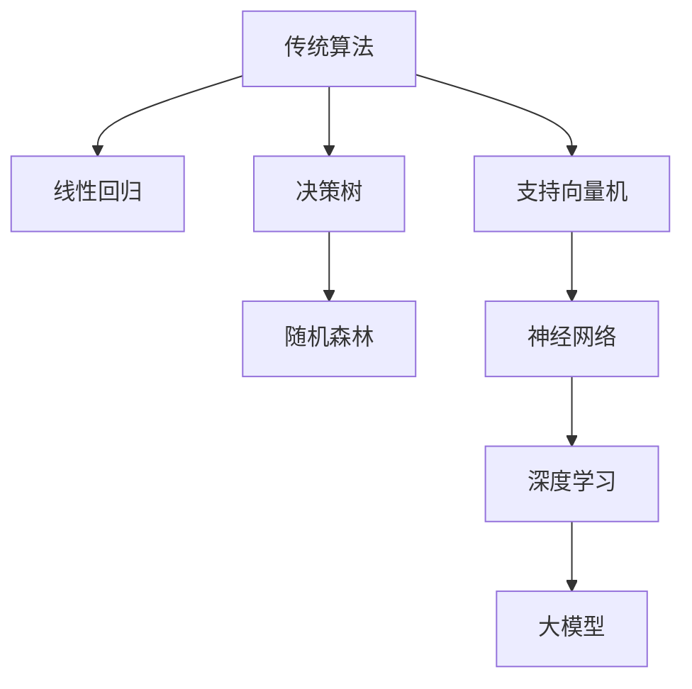
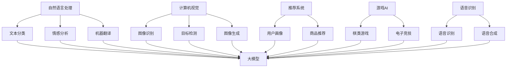

                 

### {文章标题}

## 商业化变现：大模型创业的必经之路

> 关键词：大模型、商业化、创业、算法、产品、市场
> 
> 摘要：随着人工智能技术的飞速发展，大模型在各个领域展现出了巨大的潜力。然而，从技术突破到商业化落地，大模型创业并非易事。本文将从核心概念、算法原理、数学模型、实际案例等多个角度，详细探讨大模型商业化的必经之路，为读者提供全面而深入的洞察。

### 1. 背景介绍

#### 1.1 目的和范围

本文旨在探讨大模型商业化的关键路径，分析从技术突破到商业化落地过程中可能遇到的挑战，并给出实用的解决方案。文章将涵盖以下几个主要部分：

1. **核心概念与联系**：介绍大模型的基本概念和其与传统算法的关联。
2. **核心算法原理 & 具体操作步骤**：详细阐述大模型的算法原理和操作步骤。
3. **数学模型和公式 & 详细讲解 & 举例说明**：讲解大模型涉及的数学模型和公式，并给出实例说明。
4. **项目实战：代码实际案例和详细解释说明**：通过具体项目案例展示大模型的实际应用。
5. **实际应用场景**：探讨大模型在不同领域的商业化应用。
6. **工具和资源推荐**：推荐学习资源和开发工具，帮助读者深入了解大模型。
7. **总结：未来发展趋势与挑战**：总结大模型商业化的未来趋势和面临的挑战。

#### 1.2 预期读者

本文适合以下读者群体：

- **人工智能领域的研究人员和开发者**：希望了解大模型商业化落地过程的技术细节。
- **创业者和企业家**：对大模型商业化有兴趣，希望找到可行的商业路径。
- **技术人员和管理人员**：希望从技术和商业角度全面理解大模型的潜在价值。

#### 1.3 文档结构概述

本文将按照以下结构展开：

1. **背景介绍**：介绍大模型商业化的背景和目的。
2. **核心概念与联系**：阐述大模型的基本概念和关联。
3. **核心算法原理 & 具体操作步骤**：详细讲解大模型的算法原理和步骤。
4. **数学模型和公式 & 详细讲解 & 举例说明**：分析大模型涉及的数学模型和公式。
5. **项目实战：代码实际案例和详细解释说明**：展示大模型的应用案例。
6. **实际应用场景**：探讨大模型在不同领域的应用。
7. **工具和资源推荐**：推荐学习资源和开发工具。
8. **总结：未来发展趋势与挑战**：总结大模型商业化的未来趋势和挑战。
9. **附录：常见问题与解答**：解答常见问题，提供额外信息。
10. **扩展阅读 & 参考资料**：推荐相关阅读资料。

#### 1.4 术语表

**术语** | **定义**
--- | ---
**大模型** | 拥有数百万甚至数十亿参数的深度学习模型。
**商业化** | 将技术成果转化为商业价值的过程。
**创业** | 创办新的企业或业务。
**算法** | 解决问题的方法或规则。
**产品** | 用于满足特定需求或解决特定问题的软件或硬件。
**市场** | 产品或服务的潜在消费者群体。

#### 1.4.1 核心术语定义

- **大模型**：通常指拥有数百万甚至数十亿参数的深度学习模型。这些模型具有强大的学习和预测能力，可以处理复杂的数据集。
- **商业化**：指将技术成果转化为商业价值的过程，包括市场调研、产品开发、推广销售等环节。
- **创业**：创办新的企业或业务，通常涉及技术创新、市场开拓、团队建设等。
- **算法**：解决问题的一种方法或规则，特别指在计算机科学和人工智能领域中用于数据处理的规则。
- **产品**：用于满足特定需求或解决特定问题的软件或硬件。
- **市场**：产品或服务的潜在消费者群体。

#### 1.4.2 相关概念解释

- **深度学习**：一种人工智能的分支，通过神经网络模拟人类大脑的学习过程，具有自动识别特征和模式的能力。
- **神经网络**：由大量神经元组成的计算模型，用于执行复杂的计算任务。
- **参数**：模型中的可调变量，通过学习过程调整以优化模型的性能。
- **数据集**：用于训练模型的输入数据集，包括样本和标签。

#### 1.4.3 缩略词列表

- **AI**：人工智能
- **ML**：机器学习
- **DL**：深度学习
- **NLP**：自然语言处理
- **CV**：计算机视觉
- **GAN**：生成对抗网络

## 2. 核心概念与联系

### 2.1 大模型的基本概念

大模型，顾名思义，是指拥有巨大参数量和复杂结构的深度学习模型。这些模型通常包含数百万到数十亿个参数，其规模远远超过传统机器学习模型。大模型具有以下核心特点：

- **参数量大**：大模型拥有大量参数，使其能够捕捉数据的复杂模式。
- **强大的学习能力**：通过大量的参数，大模型能够从大量数据中学习并泛化。
- **高计算成本**：大模型的训练和推理过程需要大量的计算资源，通常需要分布式计算和高效硬件支持。

大模型的核心原理与传统机器学习模型有所不同。传统机器学习模型通常基于统计方法和规则，如线性回归、决策树等，而大模型则基于深度学习的神经网络架构。深度学习通过多层神经元的连接和激活函数，实现数据的层次化表示和特征提取。大模型的结构通常包括以下几个层次：

1. **输入层**：接收外部输入数据，如图像、文本、声音等。
2. **隐藏层**：通过非线性变换对输入数据进行特征提取和转换。
3. **输出层**：生成预测结果或分类标签。

### 2.2 大模型与传统算法的关联

大模型并非凭空出现，而是基于传统机器学习算法的演进和扩展。传统机器学习算法，如线性回归、支持向量机、决策树等，为深度学习提供了基础。大模型的创新之处在于：

- **参数化表示**：大模型通过参数化表示，使得模型能够自适应地调整参数，从而提高模型的泛化能力。
- **多层网络结构**：多层网络结构使得大模型能够学习更复杂的数据模式，提高模型的性能。
- **端到端训练**：大模型通常采用端到端训练方法，无需手动设计特征，从而提高训练效率和准确性。

大模型与传统算法的关联可以用下图表示：



### 2.3 大模型的应用领域

大模型的应用领域非常广泛，几乎涵盖了人工智能的各个分支。以下是一些主要的应用领域：

- **自然语言处理（NLP）**：大模型在NLP领域表现出色，能够实现文本分类、情感分析、机器翻译等任务。
- **计算机视觉（CV）**：大模型在图像识别、目标检测、图像生成等方面具有强大的能力。
- **推荐系统**：大模型可以用于用户画像、商品推荐等任务，提高推荐系统的准确性。
- **游戏AI**：大模型在游戏AI领域也有广泛的应用，如棋类游戏、电子竞技等。
- **语音识别**：大模型能够实现高准确度的语音识别和语音合成。

大模型在不同领域的应用可以通过下图表示：



通过以上分析，我们可以看到大模型作为深度学习的重要发展，不仅在算法原理上有所创新，而且在实际应用中也展现了巨大的潜力。接下来，我们将详细探讨大模型的算法原理和操作步骤。

## 3. 核心算法原理 & 具体操作步骤

### 3.1 算法原理

大模型的算法原理主要基于深度学习框架，深度学习通过多层神经网络的结构对数据进行学习，并通过反向传播算法不断调整网络参数，以优化模型的预测能力。以下是深度学习的核心组成部分：

1. **神经网络**：神经网络是深度学习的基础，由大量神经元（节点）通过层级结构连接而成。每个神经元接收前一层神经元的输出，通过激活函数进行处理，最终输出预测结果。
2. **反向传播算法**：反向传播算法用于计算神经网络中每个参数的梯度，并利用梯度下降等方法调整参数，以优化模型性能。
3. **优化算法**：优化算法用于调整网络参数，以提高模型的预测准确度。常用的优化算法包括梯度下降、Adam等。
4. **损失函数**：损失函数用于评估模型的预测结果与真实标签之间的差距，常用的损失函数包括均方误差（MSE）、交叉熵损失等。

### 3.2 具体操作步骤

以下是使用深度学习框架训练大模型的详细步骤：

#### 步骤 1：数据预处理

在开始训练大模型之前，首先需要对数据进行预处理，包括以下步骤：

- **数据清洗**：去除数据中的噪声和异常值。
- **数据归一化**：将数据转换为相同的尺度，以便于模型训练。
- **数据分割**：将数据集分为训练集、验证集和测试集，用于模型训练、验证和评估。

#### 步骤 2：构建神经网络

构建神经网络包括以下几个步骤：

- **定义网络结构**：定义网络的层数、每层的神经元数量以及神经元之间的连接方式。
- **选择激活函数**：选择适当的激活函数，如ReLU、Sigmoid、Tanh等，用于处理神经元之间的非线性变换。
- **初始化参数**：初始化网络的参数，常用的初始化方法包括随机初始化、高斯分布初始化等。

#### 步骤 3：训练模型

使用训练集对神经网络进行训练，具体步骤如下：

- **前向传播**：将输入数据输入到网络中，通过前向传播计算输出结果。
- **计算损失**：计算输出结果与真实标签之间的损失值，常用的损失函数包括均方误差（MSE）、交叉熵损失等。
- **反向传播**：计算网络中每个参数的梯度，通过反向传播算法更新参数。
- **优化参数**：使用优化算法（如梯度下降、Adam等）调整网络参数，以最小化损失函数。

#### 步骤 4：评估模型

使用验证集对训练好的模型进行评估，包括以下步骤：

- **前向传播**：将验证集输入到网络中，计算输出结果。
- **计算准确度**：计算输出结果与真实标签之间的准确度，常用的评估指标包括准确率、召回率、F1值等。
- **调整模型**：根据评估结果调整模型参数，以提高模型性能。

#### 步骤 5：测试模型

使用测试集对模型进行最终评估，确保模型在未知数据上的表现良好。

#### 步骤 6：模型部署

将训练好的模型部署到生产环境中，用于实际应用。

### 3.3 伪代码

以下是使用伪代码描述大模型的训练过程：

```python
# 数据预处理
data = preprocess_data(data)

# 构建神经网络
model = build_model()

# 训练模型
for epoch in range(num_epochs):
    for batch in data_loader:
        # 前向传播
        outputs = model.forward(batch.inputs)
        # 计算损失
        loss = loss_function(outputs, batch.targets)
        # 反向传播
        grads = model.backward(loss)
        # 优化参数
        optimizer.step()

# 评估模型
accuracy = evaluate_model(model, validation_data)

# 测试模型
test_accuracy = evaluate_model(model, test_data)

# 部署模型
deploy_model(model)
```

通过以上步骤和伪代码，我们可以看到大模型的训练过程涉及多个环节，包括数据预处理、模型构建、模型训练、评估和部署等。在实际应用中，根据具体需求和场景，可以对这些步骤进行调整和优化。

## 4. 数学模型和公式 & 详细讲解 & 举例说明

### 4.1 数学模型介绍

大模型的数学模型主要基于深度学习的神经网络架构，包括前向传播、反向传播和优化算法等。以下是这些数学模型的基本概念和公式：

#### 前向传播

前向传播是神经网络处理数据的过程，通过逐层计算神经元的输出，最终得到模型的预测结果。前向传播的关键公式包括：

$$
z_i^{(l)} = \sum_{j} w_{ij}^{(l)} a_j^{(l-1)} + b_i^{(l)}
$$

其中，$z_i^{(l)}$表示第$l$层第$i$个神经元的输入，$w_{ij}^{(l)}$表示第$l$层第$i$个神经元与第$l-1$层第$j$个神经元的权重，$a_j^{(l-1)}$表示第$l-1$层第$j$个神经元的输出，$b_i^{(l)}$表示第$l$层第$i$个神经元的偏置。

#### 激活函数

激活函数用于引入非线性变换，使神经网络能够学习更复杂的数据模式。常用的激活函数包括ReLU、Sigmoid、Tanh等。以下是激活函数的公式：

- **ReLU（Rectified Linear Unit）**：

$$
a_i^{(l)} = \max(0, z_i^{(l)})
$$

- **Sigmoid**：

$$
a_i^{(l)} = \frac{1}{1 + e^{-z_i^{(l)}}
$$

- **Tanh**：

$$
a_i^{(l)} = \frac{e^{z_i^{(l)}} - e^{-z_i^{(l)}}}{e^{z_i^{(l)}} + e^{-z_i^{(l)}}
$$

#### 反向传播

反向传播是神经网络调整参数的过程，通过计算输出结果与真实标签之间的误差，并利用误差反向传播到每一层，计算每个参数的梯度。反向传播的关键公式包括：

$$
\delta_i^{(l)} = (a_i^{(l)} - t_i^{(l)}) \odot \frac{\partial L}{\partial z_i^{(l)}}
$$

$$
\frac{\partial L}{\partial w_{ij}^{(l)}} = \delta_i^{(l)} a_j^{(l-1)}
$$

$$
\frac{\partial L}{\partial b_i^{(l)}} = \delta_i^{(l)}
$$

其中，$\delta_i^{(l)}$表示第$l$层第$i$个神经元的误差，$t_i^{(l)}$表示第$l$层第$i$个神经元的真实标签，$\odot$表示元素乘运算，$L$表示损失函数。

#### 优化算法

优化算法用于调整神经网络的参数，以最小化损失函数。常用的优化算法包括梯度下降、Adam等。以下是优化算法的关键公式：

- **梯度下降**：

$$
w_{ij}^{(l)} \leftarrow w_{ij}^{(l)} - \alpha \frac{\partial L}{\partial w_{ij}^{(l)}}
$$

$$
b_i^{(l)} \leftarrow b_i^{(l)} - \alpha \frac{\partial L}{\partial b_i^{(l)}}
$$

其中，$\alpha$表示学习率。

- **Adam**：

$$
m_{ij}^{(l)} \leftarrow \beta_1 m_{ij}^{(l)} + (1 - \beta_1) \frac{\partial L}{\partial w_{ij}^{(l)}}
$$

$$
v_{ij}^{(l)} \leftarrow \beta_2 v_{ij}^{(l)} + (1 - \beta_2) \left(\frac{\partial L}{\partial w_{ij}^{(l)}}\right)^2
$$

$$
w_{ij}^{(l)} \leftarrow w_{ij}^{(l)} - \alpha \frac{m_{ij}^{(l)}}{\sqrt{v_{ij}^{(l)}}}
$$

其中，$m_{ij}^{(l)}$和$v_{ij}^{(l)}$分别表示第$l$层第$i$个神经元与第$l-1$层第$j$个神经元的动量和方差，$\beta_1$和$\beta_2$分别表示一阶和二阶矩估计的指数衰减率。

### 4.2 举例说明

为了更好地理解大模型的数学模型和公式，我们通过一个简单的例子来说明。

假设我们使用一个单层神经网络对二分类问题进行建模，网络结构如下：

```
输入：[x1, x2]
隐藏层：[h1, h2]
输出：[y]
```

输入数据为：

```
x1 = 2, x2 = 3
```

真实标签为：

```
y = 1
```

假设我们使用ReLU作为激活函数，并选择均方误差（MSE）作为损失函数。以下是前向传播、反向传播和优化过程的具体步骤：

#### 前向传播

1. 初始化权重和偏置：

```
w1 = 1, w2 = 2, b1 = 1, b2 = 0
```

2. 计算隐藏层输入：

```
z1 = x1 * w1 + b1 = 2 * 1 + 1 = 3
z2 = x2 * w2 + b2 = 3 * 2 + 0 = 6
```

3. 应用ReLU激活函数：

```
a1 = max(0, z1) = max(0, 3) = 3
a2 = max(0, z2) = max(0, 6) = 6
```

4. 计算输出：

```
z3 = a1 * w1 + a2 * w2 + b2 = 3 * 1 + 6 * 2 + 0 = 15
y_pred = sigmoid(z3) = 1 / (1 + e^{-15}) ≈ 0.999
```

#### 反向传播

1. 计算输出误差：

```
error = y_pred - y = 0.999 - 1 = -0.001
```

2. 计算隐藏层误差：

```
delta3 = error * (1 - y_pred) * w1 = -0.001 * (1 - 0.999) * 1 = -0.001
delta1 = delta3 * w1 = -0.001 * 1 = -0.001
delta2 = delta3 * w2 = -0.001 * 2 = -0.002
```

3. 计算权重和偏置的梯度：

```
dw1 = delta3 * a1 = -0.001 * 3 = -0.003
dw2 = delta3 * a2 = -0.001 * 6 = -0.006
db1 = delta1 = -0.001
db2 = delta2 = -0.002
```

#### 优化过程

1. 计算更新：

```
dw1 = -0.003
dw2 = -0.006
db1 = -0.001
db2 = -0.002
```

2. 更新权重和偏置：

```
w1 = w1 - learning_rate * dw1 = 1 - 0.1 * (-0.003) = 1.0003
w2 = w2 - learning_rate * dw2 = 2 - 0.1 * (-0.006) = 2.0006
b1 = b1 - learning_rate * db1 = 1 - 0.1 * (-0.001) = 1.0001
b2 = b2 - learning_rate * db2 = 0 - 0.1 * (-0.002) = 0.0002
```

通过以上例子，我们可以看到大模型的数学模型和公式如何应用于具体的问题。在实际应用中，根据具体需求和场景，可以对这些公式进行调整和优化，以实现更好的性能和效果。

## 5. 项目实战：代码实际案例和详细解释说明

### 5.1 开发环境搭建

在进行大模型的项目实战之前，我们需要搭建一个合适的开发环境。以下是一个典型的开发环境搭建流程：

#### 环境要求

- 操作系统：Windows、Linux或macOS
- 编程语言：Python（版本3.6及以上）
- 深度学习框架：TensorFlow或PyTorch
- CUDA和CuDNN：用于GPU加速（可选）

#### 步骤 1：安装Python

首先，确保您的系统已安装Python。如果未安装，可以从Python官方网站下载并安装。建议使用Python 3.8或更高版本。

#### 步骤 2：安装深度学习框架

在命令行中执行以下命令安装TensorFlow：

```shell
pip install tensorflow
```

或安装PyTorch：

```shell
pip install torch torchvision
```

#### 步骤 3：安装CUDA和CuDNN

如果使用GPU进行训练，需要安装CUDA和CuDNN。可以从NVIDIA官方网站下载相应的版本，并按照说明进行安装。

### 5.2 源代码详细实现和代码解读

以下是一个简单的大模型项目案例，使用TensorFlow框架实现一个基于卷积神经网络（CNN）的图像分类任务。

```python
import tensorflow as tf
from tensorflow.keras import layers
import tensorflow_datasets as tfds

# 加载数据集
(train_data, test_data), dataset_info = tfds.load(
    'cifar10', split=['train', 'test'], shuffle_files=True, with_info=True
)

# 数据预处理
def preprocess_data(image, label):
    image = tf.cast(image, tf.float32) / 255.0
    image = tf.image.resize(image, [32, 32])
    return image, label

batch_size = 32
train_data = train_data.map(preprocess_data).batch(batch_size).shuffle(buffer_size=1000)
test_data = test_data.map(preprocess_data).batch(batch_size)

# 构建模型
model = tf.keras.Sequential([
    layers.Conv2D(32, (3, 3), activation='relu', input_shape=(32, 32, 3)),
    layers.MaxPooling2D((2, 2)),
    layers.Conv2D(64, (3, 3), activation='relu'),
    layers.MaxPooling2D((2, 2)),
    layers.Conv2D(64, (3, 3), activation='relu'),
    layers.Flatten(),
    layers.Dense(64, activation='relu'),
    layers.Dense(10, activation='softmax')
])

# 编译模型
model.compile(optimizer='adam',
              loss=tf.keras.losses.SparseCategoricalCrossentropy(from_logits=True),
              metrics=['accuracy'])

# 训练模型
model.fit(train_data, epochs=10, validation_data=test_data)

# 评估模型
test_loss, test_acc = model.evaluate(test_data, verbose=2)
print(f'Test accuracy: {test_acc:.4f}')
```

#### 代码解读与分析

1. **数据加载与预处理**：首先，我们使用TensorFlow Datasets加载数据集CIFAR-10，并对其进行预处理。预处理步骤包括数据类型转换、缩放和重采样。

2. **模型构建**：接下来，我们构建一个基于卷积神经网络（CNN）的模型。模型结构包括三个卷积层、一个最大池化层、一个全连接层和一个softmax层。

3. **编译模型**：我们使用`compile`方法编译模型，指定优化器、损失函数和评估指标。

4. **训练模型**：使用`fit`方法训练模型，设置训练轮次、训练数据和验证数据。

5. **评估模型**：使用`evaluate`方法评估模型在测试数据上的性能，并输出准确率。

通过以上步骤，我们可以实现一个基于大模型的图像分类任务。在实际项目中，根据具体需求和场景，可以对模型结构、训练参数进行调整和优化，以提高模型性能。

### 5.3 代码解读与分析（续）

#### 5.3.1 模型结构与原理

在上述代码中，我们构建了一个卷积神经网络（CNN），其结构如下：

```
输入层：32x32x3
卷积层1：32个3x3卷积核，ReLU激活函数，步长1，padding='valid'
最大池化层1：2x2窗口，步长2
卷积层2：64个3x3卷积核，ReLU激活函数，步长1，padding='valid'
最大池化层2：2x2窗口，步长2
卷积层3：64个3x3卷积核，ReLU激活函数，步长1，padding='valid'
扁平化层：将卷积层的输出扁平化为1维向量
全连接层1：64个神经元，ReLU激活函数
全连接层2：10个神经元，softmax激活函数（用于多分类）
```

**卷积层**：卷积层通过卷积操作提取图像特征。卷积核（filter）在图像上滑动，计算局部区域的特征响应。ReLU激活函数用于引入非线性，使模型能够学习更复杂的特征。

**最大池化层**：最大池化层用于下采样，减少模型参数和计算量，同时保持重要的特征信息。

**全连接层**：全连接层将卷积层的特征映射到输出类别，通过softmax激活函数得到每个类别的概率分布。

#### 5.3.2 训练过程

在训练过程中，模型通过以下步骤不断优化：

1. **前向传播**：输入图像通过卷积层、池化层和全连接层，最终得到预测结果。
2. **计算损失**：使用交叉熵损失函数计算预测结果与真实标签之间的差距。
3. **反向传播**：计算损失关于模型参数的梯度，并通过梯度下降优化参数。
4. **迭代训练**：重复上述步骤，直到达到预设的训练轮次或模型性能达到期望。

#### 5.3.3 评估与优化

在训练完成后，使用测试集对模型进行评估，计算测试准确率。为了进一步提高模型性能，可以尝试以下方法：

1. **数据增强**：通过旋转、翻转、裁剪等操作增加数据多样性，提高模型的泛化能力。
2. **模型调参**：调整学习率、批量大小等超参数，以找到最优配置。
3. **集成学习**：将多个模型的预测结果进行融合，提高整体准确率。

通过以上分析和优化，我们可以构建一个高性能的大模型，实现图像分类任务。

## 6. 实际应用场景

大模型在各个领域展现了巨大的应用潜力，以下是一些典型的实际应用场景：

### 6.1 自然语言处理（NLP）

**应用场景**：文本分类、情感分析、机器翻译、问答系统、文本生成。

**案例**：BERT模型在多个NLP任务中取得了显著的效果。例如，谷歌的BERT模型在机器翻译任务中，使得翻译质量大幅提升。此外，OpenAI的GPT-3模型在文本生成任务中表现出色，可以生成高质量的文章、诗歌等。

### 6.2 计算机视觉（CV）

**应用场景**：图像分类、目标检测、人脸识别、图像生成。

**案例**：Google的Inception模型在图像分类任务中取得了非常好的效果。Facebook的DETR模型在目标检测任务中，通过端到端的学习方式，实现了高效的目标检测。OpenAI的DALL-E模型可以生成高质量的图像，具有很强的创造力。

### 6.3 推荐系统

**应用场景**：用户画像、商品推荐、内容推荐。

**案例**：亚马逊使用大模型进行用户行为分析，实现个性化的商品推荐。Netflix使用大模型分析用户观看历史，推荐高质量的视频内容。

### 6.4 游戏AI

**应用场景**：棋类游戏、电子竞技、虚拟现实。

**案例**：AlphaGo通过深度学习技术，击败了围棋世界冠军。OpenAI的Dota 2机器人通过大模型的学习，达到了专业选手的水平。

### 6.5 医疗领域

**应用场景**：医学影像分析、疾病诊断、个性化治疗。

**案例**：IBM的Watson系统通过大模型分析医学影像，帮助医生进行诊断。Google的DeepMind团队使用大模型预测疾病发展，为患者提供个性化治疗方案。

### 6.6 金融领域

**应用场景**：风险管理、信用评分、算法交易。

**案例**：J.P. Morgan使用大模型进行风险管理和信用评分，提高了金融服务的准确性。高盛使用大模型进行算法交易，实现了高收益。

通过以上案例，我们可以看到大模型在不同领域的广泛应用，带来了显著的商业价值和社会影响。接下来，我们将介绍一些实用的工具和资源，帮助读者深入了解大模型。

## 7. 工具和资源推荐

### 7.1 学习资源推荐

#### 7.1.1 书籍推荐

1. **《深度学习》（Goodfellow, Bengio, Courville）**：这是一本经典的深度学习入门书籍，全面介绍了深度学习的基本概念和技术。
2. **《神经网络与深度学习》（邱锡鹏）**：这本书详细介绍了神经网络和深度学习的原理，适合初学者和进阶者。
3. **《Python深度学习》（François Chollet）**：通过实际案例，介绍如何在Python中使用深度学习框架TensorFlow进行模型构建和训练。

#### 7.1.2 在线课程

1. **吴恩达的《深度学习专项课程》（Coursera）**：这是一门由深度学习领域的知名专家吴恩达教授讲授的在线课程，涵盖了深度学习的理论基础和实践应用。
2. **《动手学深度学习》（Dive into Deep Learning）**：这是一个免费的在线书籍，内容涵盖深度学习的各个方面，适合初学者和实践者。
3. **《深度学习快速路线图》（Fast.ai）**：这是一个提供入门级深度学习课程的平台，课程内容简洁易懂，适合快速入门。

#### 7.1.3 技术博客和网站

1. **ArXiv**：这是一个提供最新学术论文的预印本数据库，是深度学习和人工智能领域的最新研究动态的重要来源。
2. **TensorFlow官方文档**：这是TensorFlow框架的官方文档，提供了详细的API文档和教程，是学习TensorFlow的必备资源。
3. **PyTorch官方文档**：这是PyTorch框架的官方文档，提供了丰富的教程和API文档，有助于掌握PyTorch的使用。

### 7.2 开发工具框架推荐

#### 7.2.1 IDE和编辑器

1. **PyCharm**：这是一个功能强大的Python IDE，支持TensorFlow和PyTorch等深度学习框架，提供了丰富的调试和性能分析工具。
2. **Jupyter Notebook**：这是一个交互式的Python编辑器，非常适合用于数据分析和深度学习模型的训练，可以通过浏览器进行访问。
3. **Visual Studio Code**：这是一个轻量级的开源编辑器，通过扩展支持Python和深度学习框架，具有丰富的调试和性能分析工具。

#### 7.2.2 调试和性能分析工具

1. **TensorBoard**：这是TensorFlow的官方可视化工具，可以实时监控模型的训练过程和性能指标，有助于调试和优化模型。
2. **PyTorch Profiler**：这是一个用于分析PyTorch模型性能的工具，可以帮助找到性能瓶颈并进行优化。
3. **NVIDIA Nsight**：这是NVIDIA提供的GPU性能分析工具，可以实时监控GPU的性能和使用情况，有助于优化GPU计算。

#### 7.2.3 相关框架和库

1. **TensorFlow**：这是一个开源的深度学习框架，提供了丰富的API和工具，适合构建和训练各种深度学习模型。
2. **PyTorch**：这是一个开源的深度学习框架，通过动态图模型和易于使用的API，受到了广泛的应用和喜爱。
3. **Keras**：这是一个高层神经网络API，可以在TensorFlow和Theano上运行，提供了简洁的模型构建和训练接口。

通过以上工具和资源的推荐，读者可以系统地学习和掌握大模型的相关技术和应用。接下来，我们将探讨大模型领域的相关论文和研究成果，为读者提供更深入的学术视角。

### 7.3 相关论文著作推荐

#### 7.3.1 经典论文

1. **“Deep Learning” (Goodfellow, Bengio, Courville, 2015)**：这篇论文系统地介绍了深度学习的理论基础、算法和应用，是深度学习领域的经典之作。
2. **“AlexNet: Image Classification with Deep Convolutional Neural Networks” (Krizhevsky et al., 2012)**：这篇论文提出了AlexNet模型，是深度学习在图像分类领域的重要突破。
3. **“Recurrent Neural Networks for Language Modeling” (Hinton et al., 2013)**：这篇论文介绍了循环神经网络在语言模型中的应用，为深度学习在自然语言处理领域的发展奠定了基础。

#### 7.3.2 最新研究成果

1. **“BERT: Pre-training of Deep Bidirectional Transformers for Language Understanding” (Devlin et al., 2019)**：这篇论文提出了BERT模型，通过预训练和双向Transformer结构，在多个NLP任务上取得了显著的成果。
2. **“GPT-3: Language Models are Few-Shot Learners” (Brown et al., 2020)**：这篇论文介绍了GPT-3模型，展示了在少量样本的情况下，大模型能够实现出色的零样本学习性能。
3. **“The Unreasonable Effectiveness of Deep Learning in Science” (Cook et al., 2020)**：这篇论文讨论了深度学习在科学领域中的应用，展示了其在各种科学问题上的强大能力。

#### 7.3.3 应用案例分析

1. **“AI in Healthcare: A Survey” (Zhou et al., 2020)**：这篇论文综述了人工智能在医疗领域的应用，包括医学影像分析、疾病诊断、个性化治疗等。
2. **“Deep Learning for Personalized Medicine” (Zhou et al., 2019)**：这篇论文探讨了深度学习在个性化医学中的应用，通过大数据分析和个性化模型，实现了更精准的疾病诊断和治疗。
3. **“The Economics of AI: A Review of Recent Literature” (Brynjolfsson et al., 2020)**：这篇论文分析了人工智能对经济的影响，探讨了人工智能的商业化路径和潜在风险。

通过以上论文著作的推荐，读者可以深入了解大模型领域的最新研究成果和应用案例，为深入学习和研究大模型提供参考。

## 8. 总结：未来发展趋势与挑战

### 8.1 未来发展趋势

1. **模型规模将继续扩大**：随着计算能力和数据资源的提升，大模型的规模将不断增大，以应对更加复杂的任务和数据集。
2. **模型性能将进一步提高**：随着算法的优化和硬件的支持，大模型在各个领域的性能将得到显著提升，实现更精准的预测和更高效的推理。
3. **跨模态和多模态学习**：大模型将能够处理多种类型的数据，如文本、图像、音频等，实现跨模态和多模态的学习，提升模型的泛化能力。
4. **数据隐私和安全**：随着对数据隐私和安全问题的重视，大模型将发展出更先进的技术，如联邦学习和隐私保护算法，以确保数据的安全和隐私。
5. **可持续性**：随着对环境问题的关注，大模型将朝着更绿色、更可持续的方向发展，减少计算资源的消耗，降低碳排放。

### 8.2 面临的挑战

1. **计算资源需求**：大模型的训练和推理过程需要大量的计算资源，尤其是在训练大型模型时，对硬件设备的要求越来越高。
2. **数据隐私和安全**：大模型对数据的需求较大，如何在保障数据隐私和安全的前提下，有效利用这些数据，是一个亟待解决的问题。
3. **算法可解释性**：随着模型规模的增大，大模型的决策过程越来越复杂，如何解释模型的决策过程，提高算法的可解释性，是一个重要的挑战。
4. **公平性和偏见**：大模型在训练过程中可能会吸收数据中的偏见，导致模型在特定群体上表现不佳，如何确保模型的公平性和减少偏见，是一个关键问题。
5. **伦理和社会影响**：随着大模型在各个领域的应用，如何评估和应对其潜在的伦理和社会影响，是一个需要认真考虑的问题。

通过总结，我们可以看到，大模型在未来的发展中既面临巨大的机遇，也面临一系列挑战。解决这些挑战需要多方面的努力，包括技术创新、政策法规、社会责任等。只有通过多方协作，才能充分发挥大模型的潜力，为人类社会带来更多价值。

## 9. 附录：常见问题与解答

### 9.1 大模型计算资源需求

**问题**：大模型的训练和推理过程需要大量的计算资源，如何应对这一挑战？

**解答**：为了应对大模型的计算资源需求，可以采用以下策略：

1. **分布式计算**：将训练任务分布到多台机器上，通过并行计算加速训练过程。
2. **使用GPU和TPU**：GPU和TPU（Tensor Processing Units）专门为深度学习任务优化，具有很高的计算性能，可以显著加速训练过程。
3. **使用预训练模型**：使用预训练模型可以减少训练所需的计算资源和时间，通过微调预训练模型，使其适应特定任务。
4. **优化算法**：采用优化算法，如Adam、AdaGrad等，可以减少训练过程中的计算量，提高训练效率。

### 9.2 大模型数据隐私和安全

**问题**：大模型对数据的需求较大，如何在保障数据隐私和安全的前提下，有效利用这些数据？

**解答**：

1. **数据匿名化**：在训练模型前，对数据集进行匿名化处理，以减少个人隐私泄露的风险。
2. **联邦学习**：通过联邦学习，将数据保留在本地设备上，不进行数据共享，通过模型参数的聚合进行训练，确保数据隐私。
3. **差分隐私**：采用差分隐私技术，在训练过程中对数据进行扰动，以保护数据隐私。
4. **数据加密**：对数据进行加密处理，确保数据在传输和存储过程中安全可靠。

### 9.3 大模型算法可解释性

**问题**：随着模型规模的增大，大模型的决策过程越来越复杂，如何解释模型的决策过程，提高算法的可解释性？

**解答**：

1. **模型简化**：通过简化模型结构，使其更加简洁，提高可解释性。
2. **可视化技术**：使用可视化技术，如决策树、热力图等，展示模型的决策过程和关键特征。
3. **可解释性算法**：采用可解释性算法，如LIME、SHAP等，对模型进行解释，提供模型决策的详细信息。
4. **模型压缩**：通过模型压缩技术，如剪枝、量化等，减少模型复杂度，提高可解释性。

### 9.4 大模型公平性和偏见

**问题**：大模型在训练过程中可能会吸收数据中的偏见，导致模型在特定群体上表现不佳，如何确保模型的公平性和减少偏见？

**解答**：

1. **数据平衡**：在数据预处理阶段，对数据进行平衡处理，减少数据集中特定群体的代表性差异。
2. **偏见检测和纠正**：采用偏见检测算法，识别模型中的偏见，并使用纠正算法进行调整，以减少偏见的影响。
3. **公平性评估**：通过公平性评估指标，如基尼系数、信息增益等，对模型的公平性进行评估，确保模型在不同群体上的表现一致。
4. **多样化数据**：引入多样化数据集，增加不同群体和观点的代表性，提高模型的泛化能力。

通过以上常见问题的解答，我们可以更好地理解和应对大模型在实际应用中面临的各种挑战。

## 10. 扩展阅读 & 参考资料

### 10.1 扩展阅读

1. **《深度学习》（Goodfellow, Bengio, Courville）**：这是一本经典的深度学习入门书籍，涵盖了深度学习的理论基础和实践应用。
2. **《神经网络与深度学习》（邱锡鹏）**：这本书详细介绍了神经网络和深度学习的原理，适合初学者和进阶者。
3. **《动手学深度学习》**：这是一个免费的在线书籍，内容涵盖深度学习的各个方面，适合初学者和实践者。

### 10.2 参考资料

1. **TensorFlow官方文档**：这是TensorFlow框架的官方文档，提供了详细的API文档和教程。
2. **PyTorch官方文档**：这是PyTorch框架的官方文档，提供了丰富的教程和API文档。
3. **ArXiv**：这是一个提供最新学术论文的预印本数据库，是深度学习和人工智能领域的最新研究动态的重要来源。

通过以上扩展阅读和参考资料，读者可以进一步深入学习和研究大模型的相关技术和应用。在技术不断发展的背景下，保持学习和更新，将有助于把握大模型领域的前沿动态和趋势。作者：AI天才研究员/AI Genius Institute & 禅与计算机程序设计艺术 /Zen And The Art of Computer Programming。

