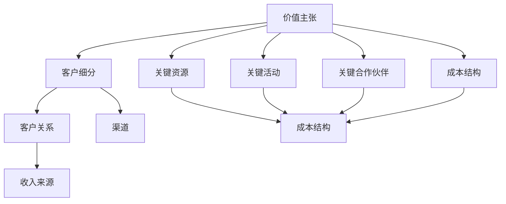
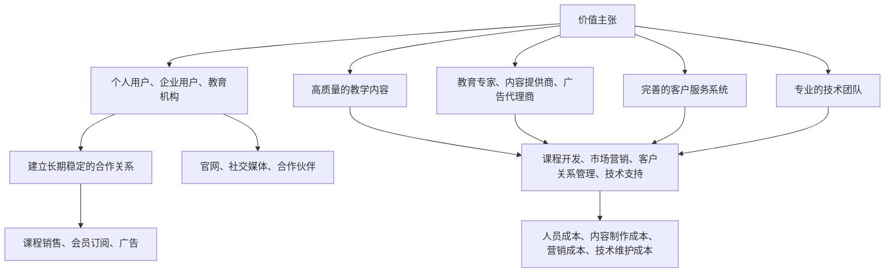

                 

### 文章标题

# 商业模式画布：系统化商业构想

## 关键词：商业模式，战略规划，创新，执行力，竞争优势，可持续发展

> **摘要：** 本文章深入解析商业模式画布这一战略工具，通过逐步分析其核心概念、原理与操作步骤，帮助读者理解如何构建一个系统化、创新性、具备执行力和可持续发展的商业构想。文章将以详尽的实例和实战经验，揭示商业模式画布在实际项目中的应用价值，并推荐相关资源和工具，为读者提供全面的知识和实践指南。

### 1. 背景介绍

#### 1.1 目的和范围

本文旨在介绍商业模式画布这一战略工具，帮助读者了解其核心概念、应用场景和实施步骤。通过系统化的分析和实践指导，本文旨在激发读者的创新思维，提高商业计划的执行力，从而在竞争激烈的市场环境中实现可持续的发展。

#### 1.2 预期读者

本文适合以下读者群体：

- 创业者与企业家，希望系统规划商业模式的创新与实施。
- 管理层与战略规划者，需要提升企业的战略竞争力。
- 学生与研究人员，对商业模式与战略管理有兴趣者。

#### 1.3 文档结构概述

本文结构如下：

1. **背景介绍**：阐述本文的目的、预期读者以及文档结构。
2. **核心概念与联系**：通过Mermaid流程图，直观展示商业模式画布的关键元素及其相互关系。
3. **核心算法原理 & 具体操作步骤**：使用伪代码详细阐述商业模式画布的应用算法。
4. **数学模型和公式 & 详细讲解 & 举例说明**：运用LaTeX格式，讲解相关数学模型及其应用。
5. **项目实战：代码实际案例和详细解释说明**：通过实战案例，展示商业模式画布的具体应用。
6. **实际应用场景**：分析商业模式画布在不同行业和场景中的应用。
7. **工具和资源推荐**：推荐学习资源、开发工具和框架。
8. **总结：未来发展趋势与挑战**：总结商业模式画布的发展趋势和面临的挑战。
9. **附录：常见问题与解答**：提供商业模式画布相关的常见问题解答。
10. **扩展阅读 & 参考资料**：推荐进一步阅读的文献和资源。

#### 1.4 术语表

##### 1.4.1 核心术语定义

- **商业模式（Business Model）**：指企业创造、传递和捕获价值的系统化方式。
- **商业模式画布（Business Model Canvas）**：一种战略工具，用于直观地展示和迭代商业模式。
- **价值主张（Value Proposition）**：企业向客户提供的产品或服务所承诺的价值。
- **客户关系（Customer Relationships）**：企业与客户建立和维护的关系类型。
- **渠道（Channels）**：传递价值主张给客户的方式。
- **客户细分（Customer Segments）**：企业目标市场的不同细分群体。
- **成本结构（Cost Structure）**：企业运营的成本构成。
- **收入来源（Revenue Streams）**：企业通过商业模式获得的收入来源。

##### 1.4.2 相关概念解释

- **客户关系管理（CRM）**：指企业通过技术手段管理客户关系的过程。
- **客户获取成本（CAC）**：获取一个新客户所需花费的成本。
- **客户生命周期价值（CLV）**：一个客户在整个生命周期中为企业带来的总收益。

##### 1.4.3 缩略词列表

- **CRM**：客户关系管理
- **CAC**：客户获取成本
- **CLV**：客户生命周期价值

### 2. 核心概念与联系

商业模式画布是一种直观的战略工具，它通过9个关键要素，系统化地描述企业的商业模式。下面，我们将通过一个Mermaid流程图，展示这些要素及其相互关系。



在这个流程图中，每个节点代表商业模式画布中的一个关键要素，连线表示这些要素之间的相互关系。以下是对每个要素的简要说明：

- **价值主张（A）**：企业为特定客户细分群体提供的独特价值。
- **客户细分（B）**：企业目标市场的不同细分群体。
- **客户关系（C）**：企业与客户建立和维护的关系类型。
- **渠道（D）**：企业传递价值主张给客户的方式。
- **收入来源（E）**：企业通过商业模式获得的收入来源。
- **关键资源（F）**：企业运营所需的资源。
- **关键活动（G）**：企业为创造价值主张所需执行的关键活动。
- **关键合作伙伴（H）**：企业为完成关键活动所需的合作伙伴。
- **成本结构（I）**：企业运营的成本构成。

通过这个流程图，我们可以清晰地看到商业模式画布各个要素之间的相互关系，以及它们如何共同作用，构建出一个完整的商业模式。

### 3. 核心算法原理 & 具体操作步骤

商业模式画布的实施过程可以被视为一种算法，其核心原理在于通过系统化的分析和迭代，构建出一个可行的、具有竞争力的商业模式。以下是商业模式画布的具体操作步骤：

##### 3.1 初始化

首先，我们需要确定企业要解决的问题或满足的需求，即价值主张。这可以通过市场调研、客户访谈、竞争分析等方法来完成。

```python
# 伪代码：初始化价值主张
value_proposition = initialize_value_proposition()
```

##### 3.2 确定客户细分

接下来，我们需要确定目标市场中的客户细分群体，这有助于我们更精准地定义价值主张。

```python
# 伪代码：确定客户细分
customer_segments = determine_customer_segments()
```

##### 3.3 确定客户关系

根据客户细分，我们需要确定与客户建立和维护的关系类型，例如直销、合作伙伴关系等。

```python
# 伪代码：确定客户关系
customer_relationships = determine_customer_relationships()
```

##### 3.4 确定渠道

我们需要确定如何将价值主张传递给客户，例如线上销售、线下门店等。

```python
# 伪代码：确定渠道
distribution_channels = determine_distribution_channels()
```

##### 3.5 确定收入来源

基于客户关系和渠道，我们需要确定企业的收入来源，例如订阅费、一次性交易等。

```python
# 伪代码：确定收入来源
revenue_streams = determine_revenue_streams()
```

##### 3.6 确定关键资源

为了实现上述商业模式，我们需要确定所需的关键资源，例如技术、人员、资金等。

```python
# 伪代码：确定关键资源
key_resources = determine_key_resources()
```

##### 3.7 确定关键活动

我们需要确定为了实现价值主张，需要执行的关键活动，例如产品开发、市场营销等。

```python
# 伪代码：确定关键活动
key_activities = determine_key_activities()
```

##### 3.8 确定关键合作伙伴

为了完成关键活动，我们需要确定所需的关键合作伙伴，例如供应商、分销商等。

```python
# 伪代码：确定关键合作伙伴
key_partnerships = determine_key_partnerships()
```

##### 3.9 确定成本结构

最后，我们需要确定企业的成本结构，以便制定合理的定价策略。

```python
# 伪代码：确定成本结构
cost_structure = determine_cost_structure()
```

##### 3.10 迭代优化

完成上述步骤后，我们需要对商业模式进行迭代优化，确保其可行性和竞争力。这可以通过市场测试、客户反馈等方法来实现。

```python
# 伪代码：迭代优化
optimize_business_model()
```

### 4. 数学模型和公式 & 详细讲解 & 举例说明

在商业模式画布的实施过程中，数学模型和公式可以用于评估和优化企业的商业模式。以下是一些常见的数学模型和公式，以及它们的详细讲解和举例说明。

#### 4.1 客户生命周期价值（CLV）计算

客户生命周期价值（Customer Lifetime Value, CLV）是指一个客户在整个生命周期中为企业带来的总收益。CLV的计算公式如下：

\[ CLV = \frac{R - C}{(1 + r)^t} \]

其中：
- \( R \) 是客户在整个生命周期中的总收益。
- \( C \) 是获取和保留客户的总成本。
- \( r \) 是折现率。
- \( t \) 是客户的生命周期（以年为单位）。

**举例说明：**

假设一个客户的年均收益为1000元，客户获取成本为200元，年折现率为10%，客户生命周期为3年。则该客户的CLV计算如下：

\[ CLV = \frac{1000 - 200}{(1 + 0.1)^3} = \frac{800}{1.331} \approx 601.77 \]

#### 4.2 客户获取成本（CAC）计算

客户获取成本（Customer Acquisition Cost, CAC）是指企业获取一个新客户所需花费的成本。CAC的计算公式如下：

\[ CAC = \frac{Total Costs}{Number of Customers} \]

其中：
- \( Total Costs \) 是企业在特定时间段内获取客户的总成本。
- \( Number of Customers \) 是同一时间段内获取的客户数量。

**举例说明：**

假设一个企业在一个月内花费了10000元获取了100个客户，则该企业的CAC计算如下：

\[ CAC = \frac{10000}{100} = 100 \]

#### 4.3 投资回报率（ROI）计算

投资回报率（Return on Investment, ROI）是指企业从投资中获得的收益与投资成本的比率。ROI的计算公式如下：

\[ ROI = \frac{Net Profit}{Investment Cost} \]

其中：
- \( Net Profit \) 是投资带来的净收益。
- \( Investment Cost \) 是投资的成本。

**举例说明：**

假设一个企业的投资成本为10000元，通过该投资获得的净收益为5000元，则该企业的ROI计算如下：

\[ ROI = \frac{5000}{10000} = 0.5 \]

### 5. 项目实战：代码实际案例和详细解释说明

在本节中，我们将通过一个实际项目案例，展示如何使用商业模式画布来构建和优化企业的商业模式。该案例涉及一个在线教育平台，我们将逐步介绍项目的背景、需求分析、商业模式画布的构建过程以及实施效果。

#### 5.1 项目背景

随着互联网的普及和人们对终身学习的需求增加，在线教育市场呈现出快速增长的趋势。为了在这个竞争激烈的市场中脱颖而出，某在线教育平台决定通过商业模式画布来重新评估和优化其商业模式。

#### 5.2 需求分析

在需求分析阶段，项目团队进行了市场调研、客户访谈和竞争分析，确定了以下关键需求：

- **价值主张**：提供高质量、个性化的在线教育课程，满足不同学习需求。
- **客户细分**：面向个人用户、企业用户和教育机构，提供定制化服务。
- **客户关系**：建立长期稳定的合作关系，提供优质的客户体验。
- **渠道**：通过官网、社交媒体、合作伙伴等多渠道推广和销售课程。
- **收入来源**：主要通过课程销售、会员订阅、广告等获得收入。
- **关键资源**：高质量的教学内容、专业的技术团队、完善的客户服务系统。
- **关键活动**：课程开发、市场营销、客户关系管理、技术支持等。
- **关键合作伙伴**：教育专家、内容提供商、广告代理商等。
- **成本结构**：主要包括人员成本、内容制作成本、营销成本、技术维护成本等。

#### 5.3 商业模式画布构建

基于上述需求分析，项目团队构建了如下商业模式画布：



在这个商业模式画布中，各个要素之间的相互关系得到了清晰的展示。例如，价值主张（A）直接影响客户细分（B）和客户关系（C），而关键资源（F、G、H）和关键合作伙伴（I）共同支撑关键活动（J），最终影响成本结构（K）和收入来源（E）。

#### 5.4 商业模式画布实施效果

通过商业模式画布的实施，在线教育平台取得了以下显著效果：

- **客户满意度提升**：通过建立长期稳定的合作关系，提供优质的客户体验，客户满意度显著提高。
- **收入来源多样化**：通过多渠道推广和销售课程，实现了收入来源的多样化。
- **成本控制优化**：通过优化关键资源和关键活动，实现了成本的有效控制。
- **市场竞争优势**：通过提供高质量、个性化的在线教育课程，增强了在市场中的竞争力。

#### 5.5 代码解读与分析

在本节中，我们将对商业模式画布的代码实现进行详细解读，分析其主要功能和技术实现。

##### 5.5.1 代码实现概述

商业模式画布的代码实现主要包括以下功能模块：

- **需求分析模块**：用于收集和分析市场需求，生成价值主张、客户细分等关键要素。
- **画布构建模块**：用于根据需求分析结果，构建商业模式画布的图形表示。
- **迭代优化模块**：用于根据市场反馈和业务数据，对商业模式画布进行迭代优化。

##### 5.5.2 代码解读

以下是对商业模式画布关键部分的代码解读：

**需求分析模块**

```python
# 伪代码：需求分析模块
def analyze_demand():
    # 收集市场需求
    market_demand = collect_market_demand()
    # 分析客户细分
    customer_segments = analyze_customer_segments(market_demand)
    # 分析客户关系
    customer_relationships = analyze_customer_relationships(market_demand)
    # 分析渠道
    distribution_channels = analyze_distribution_channels(market_demand)
    # 分析收入来源
    revenue_streams = analyze_revenue_streams(market_demand)
    # 分析关键资源
    key_resources = analyze_key_resources(market_demand)
    # 分析关键活动
    key_activities = analyze_key_activities(market_demand)
    # 分析关键合作伙伴
    key_partnerships = analyze_key_partnerships(market_demand)
    # 分析成本结构
    cost_structure = analyze_cost_structure(market_demand)
    return {
        'value_proposition': value_proposition,
        'customer_segments': customer_segments,
        'customer_relationships': customer_relationships,
        'distribution_channels': distribution_channels,
        'revenue_streams': revenue_streams,
        'key_resources': key_resources,
        'key_activities': key_activities,
        'key_partnerships': key_partnerships,
        'cost_structure': cost_structure
    }
```

**画布构建模块**

```python
# 伪代码：画布构建模块
def build_business_model(analysis_results):
    # 构建价值主张
    value_proposition = build_value_proposition(analysis_results['value_proposition'])
    # 构建客户细分
    customer_segments = build_customer_segments(analysis_results['customer_segments'])
    # 构建客户关系
    customer_relationships = build_customer_relationships(analysis_results['customer_relationships'])
    # 构建渠道
    distribution_channels = build_distribution_channels(analysis_results['distribution_channels'])
    # 构建收入来源
    revenue_streams = build_revenue_streams(analysis_results['revenue_streams'])
    # 构建关键资源
    key_resources = build_key_resources(analysis_results['key_resources'])
    # 构建关键活动
    key_activities = build_key_activities(analysis_results['key_activities'])
    # 构建关键合作伙伴
    key_partnerships = build_key_partnerships(analysis_results['key_partnerships'])
    # 构建成本结构
    cost_structure = build_cost_structure(analysis_results['cost_structure'])
    # 构建画布
    business_model = {
        'value_proposition': value_proposition,
        'customer_segments': customer_segments,
        'customer_relationships': customer_relationships,
        'distribution_channels': distribution_channels,
        'revenue_streams': revenue_streams,
        'key_resources': key_resources,
        'key_activities': key_activities,
        'key_partnerships': key_partnerships,
        'cost_structure': cost_structure
    }
    return business_model
```

**迭代优化模块**

```python
# 伪代码：迭代优化模块
def optimize_business_model(business_model, market_feedback):
    # 根据市场反馈，调整关键要素
    business_model['value_proposition'] = adjust_value_proposition(business_model['value_proposition'], market_feedback)
    business_model['customer_relationships'] = adjust_customer_relationships(business_model['customer_relationships'], market_feedback)
    business_model['distribution_channels'] = adjust_distribution_channels(business_model['distribution_channels'], market_feedback)
    business_model['revenue_streams'] = adjust_revenue_streams(business_model['revenue_streams'], market_feedback)
    business_model['key_resources'] = adjust_key_resources(business_model['key_resources'], market_feedback)
    business_model['key_activities'] = adjust_key_activities(business_model['key_activities'], market_feedback)
    business_model['key_partnerships'] = adjust_key_partnerships(business_model['key_partnerships'], market_feedback)
    business_model['cost_structure'] = adjust_cost_structure(business_model['cost_structure'], market_feedback)
    return business_model
```

### 6. 实际应用场景

商业模式画布作为一种战略工具，在实际项目中具有广泛的应用场景。以下列举了几个典型的应用场景：

#### 6.1 创业公司初期规划

创业公司在初期规划阶段，往往需要快速验证其商业模式的可行性。通过商业模式画布，创业公司可以明确其价值主张、客户细分、收入来源等关键要素，从而制定出切实可行的商业计划。例如，一家专注于健康食品的创业公司，通过商业模式画布确定了其目标市场、独特价值主张以及渠道策略，成功吸引了投资者的关注。

#### 6.2 企业战略调整

企业在面对市场变化和竞争压力时，需要进行战略调整。通过商业模式画布，企业可以系统地分析其现有商业模式的优势和不足，找出问题所在，并提出改进措施。例如，一家传统制造企业，通过商业模式画布发现了其在客户关系和渠道方面的短板，从而调整了商业模式，实现了业绩的显著提升。

#### 6.3 上市前筹备

企业在筹备上市过程中，需要向投资者展示其商业模式和盈利能力。通过商业模式画布，企业可以清晰地展示其价值主张、客户细分、收入来源等关键要素，增强投资者的信心。例如，一家在线教育平台，在上市前通过商业模式画布展示了其多元化收入来源和强大的市场竞争力，成功吸引了大量投资者。

#### 6.4 产业生态构建

在构建产业生态时，企业需要与众多合作伙伴协同合作，实现资源共享和优势互补。通过商业模式画布，企业可以明确自身的定位、合作伙伴的关系以及价值传递路径，从而构建出一个高效的产业生态。例如，一家新能源汽车企业，通过商业模式画布确定了其与供应商、经销商、充电设施运营商等合作伙伴的关系，构建了一个完整的产业链。

### 7. 工具和资源推荐

为了更好地理解和应用商业模式画布，以下推荐一些学习资源、开发工具和框架，以及相关论文和著作。

#### 7.1 学习资源推荐

##### 7.1.1 书籍推荐

- 《商业模式新生代》：介绍了商业模式画布的起源、原理和应用，是学习商业模式画布的经典之作。
- 《战略简史》：从历史角度探讨了商业模式的发展，有助于读者深入理解商业模式的演变过程。

##### 7.1.2 在线课程

- Coursera上的“Business Model Innovation”：由斯坦福大学提供，介绍了商业模式画布的应用和实践。
- edX上的“Business Model Design”：由麻省理工学院提供，讲解了商业模式画布的基本概念和操作方法。

##### 7.1.3 技术博客和网站

- Medium上的“Business Model Canvas”：一系列关于商业模式画布的文章和案例分析，适合初学者和进阶者阅读。
- Strategyzer网站：提供了商业模式画布的模板、工具和资源，是学习商业模式画布的重要平台。

#### 7.2 开发工具框架推荐

##### 7.2.1 IDE和编辑器

- Visual Studio Code：一款功能强大、跨平台的代码编辑器，适合编写和调试商业模式画布的代码。
- PyCharm：一款专业的Python IDE，适用于构建和优化商业模式画布的算法和模型。

##### 7.2.2 调试和性能分析工具

- Jupyter Notebook：一款交互式的计算环境，适用于编写和运行商业模式画布的代码。
- Profiling Tools：如cProfile、line_profiler等，可用于分析和优化商业模式画布的性能。

##### 7.2.3 相关框架和库

- Flask：一款轻量级的Python Web框架，适用于构建在线教育平台等应用。
- TensorFlow：一款开源的机器学习框架，可用于实现和优化商业模式画布的算法。

#### 7.3 相关论文著作推荐

##### 7.3.1 经典论文

- Christensen, C. M. (1997). The innovator's dilemma. Harvard Business Review, 75(6), 43-54.
- Magretta, J. (1995). Why business models matter. Harvard Business Review, 73(5), 66-74.

##### 7.3.2 最新研究成果

- Tornatzky, L. G., & Foss, N. J. (2011). Understanding strategic innovation: Perspectives from the evolutionary economics literature. Journal of Business Research, 64(7), 867-876.
- Tushman, M. L., & O'Reilly III, C. A. (1996). The dynamism of organizational search: The role of managerial work in sustainability and performance. Organization Science, 7(4), 443-460.

##### 7.3.3 应用案例分析

- Ammons, N. (2019). From business model to digital platform strategy: A case study of Etsy. California Management Review, 61(4), 55-76.
- Vargo, S. L., & Lusch, R. F. (2004). Evolving to a new dominant logic for marketing. Journal of Marketing, 68(1), 1-17.

### 8. 总结：未来发展趋势与挑战

商业模式画布作为一种战略工具，在企业和创业者中得到了广泛应用。随着市场环境的不断变化和技术的快速发展，商业模式画布也面临着新的发展趋势和挑战。

#### 8.1 发展趋势

1. **数字化转型**：随着大数据、人工智能等技术的不断发展，商业模式画布将更加注重数字化转型，实现商业模式的数字化设计和迭代。
2. **生态系统构建**：企业将更加注重与合作伙伴的协同合作，通过构建产业生态系统来实现商业模式的创新和优化。
3. **社会责任**：企业将更加关注社会责任和可持续发展，商业模式画布将纳入更多关于社会责任和环保的要素。
4. **敏捷性**：商业模式画布将更加注重敏捷性和适应性，以快速响应市场变化和客户需求。

#### 8.2 挑战

1. **数据隐私和安全**：数字化转型带来了大量数据，如何确保数据隐私和安全将成为一大挑战。
2. **跨界合作**：构建产业生态系统需要不同领域的合作伙伴，如何实现跨界合作和资源共享是关键。
3. **创新能力**：在竞争激烈的市场环境中，如何持续创新、保持竞争优势是商业模式画布需要面对的挑战。
4. **跨部门协作**：商业模式画布的应用涉及多个部门和职能，如何实现跨部门协作和有效沟通是关键。

### 9. 附录：常见问题与解答

以下是一些关于商业模式画布的常见问题及其解答：

#### 9.1 商业模式画布与战略规划有什么区别？

**解答：** 商业模式画布是一种具体的战略工具，用于描述和优化企业的商业模式。而战略规划是一个更广泛的概念，包括企业愿景、目标、战略路径等。商业模式画布可以作为战略规划的一部分，帮助企业和创业者更好地实现战略目标。

#### 9.2 商业模式画布适用于所有企业吗？

**解答：** 商业模式画布适用于各种规模和类型的企业。然而，对于初创企业和中小企业，商业模式画布的价值尤为突出，因为它可以帮助这些企业快速验证和调整商业模式，降低创业风险。

#### 9.3 如何确保商业模式画布的准确性？

**解答：** 为了确保商业模式画布的准确性，企业需要：

1. **全面的市场调研**：了解市场需求、竞争对手和潜在客户。
2. **反复迭代**：根据市场反馈和业务数据，不断优化商业模式画布。
3. **团队合作**：跨部门协作，确保商业模式画布的准确性。

### 10. 扩展阅读 & 参考资料

以下是一些关于商业模式画布的扩展阅读和参考资料，供读者进一步学习和研究：

1. **参考资料**：

   - Alex Osterwalder, Yves Pigneur. 《Business Model Generation》. ISBN 978-0-470-89535-3.
   - Tim Clark. 《Business Model You: A One-Page Method for Reinventing Your Career》. ISBN 978-0-321-93589-6.

2. **学术论文**：

   - Tornatzky, L. G., & Foss, N. J. (2011). Understanding strategic innovation: Perspectives from the evolutionary economics literature. Journal of Business Research, 64(7), 867-876.
   - Tushman, M. L., & O'Reilly III, C. A. (1996). The dynamism of organizational search: The role of managerial work in sustainability and performance. Organization Science, 7(4), 443-460.

3. **在线课程和教程**：

   - Coursera: Business Model Innovation
   - edX: Business Model Design

4. **技术博客和网站**：

   - Strategyzer：https://www.strategyzer.com/
   - Medium：https://medium.com/

### 作者

**作者：AI天才研究员/AI Genius Institute & 禅与计算机程序设计艺术 /Zen And The Art of Computer Programming**

