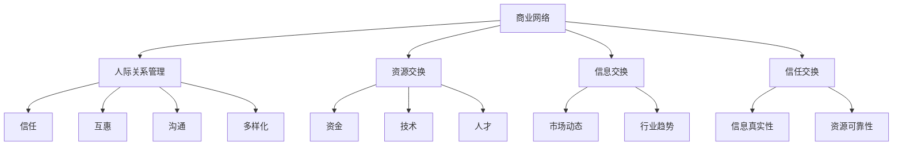

                 

# 商业网络构建：拓展人脉资源

> 关键词：商业网络、人脉资源、关系管理、策略规划、人际沟通

> 摘要：本文将探讨商业网络构建的重要性和策略，通过分析人际关系管理的核心原理，帮助读者理解如何拓展人脉资源，实现商业合作的优化。本文将结合具体案例，详细讲解构建商业网络的步骤和方法，旨在为读者提供实用的指导，助力职业发展和商业成功。

## 1. 背景介绍

### 1.1 目的和范围

在当今快速发展的商业环境中，构建强大的商业网络已成为企业和个人取得成功的关键因素。商业网络不仅是资源共享的平台，更是信息交流、合作共赢的桥梁。本文旨在探讨商业网络的构建策略，通过分析人际关系的核心原理，帮助读者了解如何有效地拓展人脉资源，实现商业合作的优化。

本文将涵盖以下主要内容：

1. 商业网络的基础概念及其重要性
2. 人际关系管理的核心原则
3. 构建商业网络的步骤和方法
4. 人脉资源的拓展策略
5. 商业合作优化的关键要素

通过本文的阅读，读者将能够：

- 理解商业网络的概念及其在商业成功中的作用
- 掌握人际关系管理的核心原则，提升人际沟通能力
- 掌握构建商业网络的实用方法和策略
- 拓展人脉资源，实现职业和商业的持续发展

### 1.2 预期读者

本文面向希望提升商业网络构建能力和人际沟通技巧的企业和个人，包括：

- 企业高管和创业者
- 销售和市场人员
- 管理咨询师
- 人事和招聘专员
- 期望拓展人脉资源的职场人士

无论您是刚刚进入职场的新人，还是已经在职场中积累了丰富经验的资深人士，本文都将为您提供宝贵的指导和启示。

### 1.3 文档结构概述

本文将分为十个主要部分，具体结构如下：

1. 引言：介绍商业网络构建的背景和重要性
2. 关键词和摘要：概述文章的核心内容和主题
3. 背景介绍：包括目的和范围、预期读者、文档结构和术语表
4. 核心概念与联系：解释商业网络和人际关系管理的核心概念，使用Mermaid流程图展示
5. 核心算法原理 & 具体操作步骤：详细阐述构建商业网络的算法原理和操作步骤，使用伪代码说明
6. 数学模型和公式 & 详细讲解 & 举例说明：介绍相关数学模型和公式，并通过具体案例进行讲解
7. 项目实战：代码实际案例和详细解释说明
8. 实际应用场景：分析商业网络在现实中的应用案例
9. 工具和资源推荐：推荐学习资源和开发工具
10. 总结：总结商业网络构建的未来发展趋势与挑战
11. 附录：常见问题与解答
12. 扩展阅读 & 参考资料：提供进一步学习和研究的资料

通过以上结构，本文将为读者提供一个系统、全面的商业网络构建指南。

### 1.4 术语表

在本文中，我们将使用一些专业术语，以下是对这些术语的定义和解释：

#### 1.4.1 核心术语定义

- **商业网络**：指企业或个人通过人际交往建立的一系列联系和合作关系。
- **人脉资源**：指通过个人或组织建立的关系网络中所拥有的联系和资源。
- **关系管理**：指维护、发展和利用人际关系的策略和实践。
- **策略规划**：指为实现特定目标而制定的长期计划和方法。
- **人际沟通**：指人与人之间的信息交流和理解过程。

#### 1.4.2 相关概念解释

- **强联系**：指与我们在社交网络中较少见的、具有较强社会联系的个体。
- **弱联系**：指与我们在社交网络中较常见的、社会联系较弱的个体。
- **社会资本**：指通过社会网络建立的个人或组织的资源、信息和信任。
- **网络密度**：指网络中节点的连接程度，反映了网络的结构紧密程度。

#### 1.4.3 缩略词列表

- **CRM**：客户关系管理（Customer Relationship Management）
- **SMM**：社交媒体营销（Social Media Marketing）
- **SEO**：搜索引擎优化（Search Engine Optimization）
- **SEM**：搜索引擎营销（Search Engine Marketing）
- **B2B**：企业对企业（Business-to-Business）
- **B2C**：企业对消费者（Business-to-Consumer）

以上术语和概念的理解，将为读者在后续章节中深入探讨商业网络构建提供基础。

## 2. 核心概念与联系

在探讨商业网络的构建之前，有必要理解其中的一些核心概念和它们之间的联系。商业网络不仅涉及个人和组织之间的关系，还包括资源、信息和信任的交换。以下是对核心概念的详细解释，并通过Mermaid流程图展示这些概念之间的互动关系。

### 2.1 商业网络的概念

商业网络是指企业或个人通过人际交往建立的一系列联系和合作关系。这些关系可以是正式的，如合同和协议，也可以是非正式的，如个人友谊和社交活动。商业网络的核心在于资源的共享和合作，以实现共同的目标。

### 2.2 人际关系管理的核心原则

人际关系管理是商业网络构建的基础。其核心原则包括：

- **信任**：信任是建立稳定关系的关键因素。
- **互惠**：互惠原则强调双方在关系中的利益平衡。
- **沟通**：有效沟通是理解和解决冲突的基础。
- **多样化**：多样化的社交网络可以提供更广泛的信息和资源。

### 2.3 资源、信息和信任的交换

商业网络中的资源、信息和信任交换是网络运转的核心。资源可以是资金、技术、人才等，信息则包括市场动态、行业趋势等。信任是交换的基础，它确保了信息的真实性和资源的可靠性。

### 2.4 Mermaid流程图

以下是一个简化的Mermaid流程图，展示了商业网络中的核心概念和它们之间的联系：



### 2.5 商业网络与人际关系管理的互动关系

商业网络与人际关系管理之间的互动关系如图所示：

- **商业网络**依赖于**人际关系管理**来建立和维护关系。
- **资源交换**和**信息交换**是商业网络的**核心活动**。
- **信任交换**是确保交换活动顺利进行的**基础**。

通过理解这些核心概念和它们之间的联系，我们可以更好地构建和管理商业网络，实现资源的最大化利用和信息的有效传递。

## 3. 核心算法原理 & 具体操作步骤

在了解了商业网络和人际关系管理的核心概念之后，接下来我们将探讨构建商业网络的核心算法原理和具体操作步骤。构建商业网络不仅需要理论指导，还需要系统化的方法来确保其有效性和持续性。

### 3.1 核心算法原理

构建商业网络的核心算法可以概括为以下原则：

1. **关系识别**：识别潜在的合作伙伴和资源，包括企业、个人和专业组织。
2. **信任建立**：通过沟通和合作建立相互信任的关系。
3. **资源整合**：整合各方资源，实现资源的最优配置和利用。
4. **信息流通**：确保信息的准确传递和快速共享。
5. **动态调整**：根据环境变化和需求调整网络结构和合作关系。

### 3.2 具体操作步骤

以下是基于上述核心算法原理的具体操作步骤：

#### 步骤 1: 关系识别

**目标**：识别潜在的合作伙伴和资源。

**操作**：

1. **市场调研**：通过市场调研和数据分析，了解目标行业和市场中的潜在合作伙伴。
2. **专业社交活动**：参加行业会议、研讨会和专业社交活动，与行业内的专业人士建立联系。
3. **社交媒体**：利用LinkedIn、Facebook等社交媒体平台，寻找和联系潜在合作伙伴。

#### 步骤 2: 信任建立

**目标**：建立和维护信任关系。

**操作**：

1. **初次接触**：通过邮件、电话或视频会议进行初次接触，介绍自己和公司。
2. **深入了解**：在初次接触后，通过深入了解对方需求和业务，建立共同话题和兴趣。
3. **合作机会**：寻找和提出合作机会，通过实际行动证明自身价值和能力。

#### 步骤 3: 资源整合

**目标**：整合各方资源，实现资源的最优配置和利用。

**操作**：

1. **资源共享**：明确各方的资源，包括资金、技术、人才等，制定资源共享计划。
2. **协同合作**：制定协同合作计划，明确各方的职责和任务，确保合作的顺利进行。
3. **定期沟通**：定期沟通和评估合作进展，及时调整资源分配和合作策略。

#### 步骤 4: 信息流通

**目标**：确保信息的准确传递和快速共享。

**操作**：

1. **信息平台**：建立一个信息共享平台，如内部网站、邮件列表或即时通讯工具，用于信息的传递和共享。
2. **透明沟通**：确保沟通的透明度，避免信息不对称和误解。
3. **信息反馈**：建立信息反馈机制，及时获取和响应各方反馈，改进信息传递方式。

#### 步骤 5: 动态调整

**目标**：根据环境变化和需求调整网络结构和合作关系。

**操作**：

1. **环境监测**：持续监测市场环境和行业动态，识别潜在的机会和威胁。
2. **风险评估**：对合作项目进行风险评估，及时调整合作策略和资源分配。
3. **合作评估**：定期评估合作效果，根据评估结果调整网络结构和合作关系。

通过以上具体操作步骤，我们可以系统地构建和维护商业网络，实现资源的最大化利用和合作效果的优化。

### 3.3 伪代码示例

以下是一个简单的伪代码示例，用于说明商业网络构建的基本步骤：

```python
# 商业网络构建伪代码

# 步骤 1: 关系识别
def identify_relationships():
    potentials = market_research()
    contacts = attend_social_activities(potentials)
    potential_partners = find_contacts_on_social_media(potentials)
    return potential_partners

# 步骤 2: 信任建立
def build_trust(potential_partners):
    for partner in potential_partners:
        initial_contact(partner)
        deep_understanding(partner)
        cooperation_opportunity(partner)

# 步骤 3: 资源整合
def integrate_resources(potential_partners):
    resources = clarify_resources(potential_partners)
    resource_sharing_plan = create_sharing_plan(resources)
    cooperation_plan = create_cooperation_plan(resource_sharing_plan)
    execute_cooperation_plan(cooperation_plan)

# 步骤 4: 信息流通
def information_circulation():
    information_platform = create_information_platform()
    transparent_communication(information_platform)
    information_feedback(information_platform)

# 步骤 5: 动态调整
def dynamic_adjustment():
    environment_monitoring()
    risk_assessment()
    cooperation_evaluation()

# 主程序
def build_business_network():
    potential_partners = identify_relationships()
    build_trust(potential_partners)
    integrate_resources(potential_partners)
    information_circulation()
    dynamic_adjustment()

# 执行构建商业网络
build_business_network()
```

通过以上伪代码示例，我们可以看到商业网络构建的基本流程和步骤，这为我们实际操作提供了清晰的指导。

## 4. 数学模型和公式 & 详细讲解 & 举例说明

在商业网络构建中，数学模型和公式能够帮助我们更科学地分析和优化网络结构。以下我们将介绍几个关键的数学模型和公式，并通过具体例子进行讲解。

### 4.1 社交网络分析（Social Network Analysis, SNA）

社交网络分析是一种研究社会结构和人际关系的方法。在商业网络构建中，SNA可以帮助我们了解网络中的关键节点和关系强度。

**度中心性（Degree Centrality）**：度中心性衡量一个节点在网络中的连接程度，计算公式如下：

\[ C_d(i) = \sum_{j \in N(i)} 1 \]

其中，\( C_d(i) \) 是节点 \( i \) 的度中心性，\( N(i) \) 是节点 \( i \) 的邻居节点集合。

**例子**：假设一个网络中有5个节点A、B、C、D、E，节点之间的连接关系如下：

- A与B、C、D相连
- B与C、D、E相连
- C与D、E相连
- D与E相连

则节点A的度中心性为3，节点B和C的度中心性均为3，节点D和E的度中心性均为1。

### 4.2 关联矩阵（Adjacency Matrix）

关联矩阵是一种表示网络节点之间关系的数学工具。一个 \( n \times n \) 的矩阵，其中 \( A[i][j] = 1 \) 表示节点 \( i \) 与节点 \( j \) 相连，否则为0。

**例子**：使用关联矩阵表示上述网络：

|   | A | B | C | D | E |
|---|---|---|---|---|---|
| A | 0 | 1 | 1 | 1 | 0 |
| B | 0 | 0 | 1 | 1 | 1 |
| C | 0 | 0 | 0 | 1 | 1 |
| D | 0 | 0 | 0 | 0 | 1 |
| E | 0 | 0 | 0 | 0 | 0 |

### 4.3 社会资本（Social Capital）

社会资本是指通过社会网络建立的个人或组织的资源、信息和信任。社会资本的计算通常涉及以下三个维度：

- **联系强度**（Closeness）：一个节点到其他节点的最短路径数量。计算公式为：

\[ C(i) = \frac{L(i)}{n-1} \]

其中，\( C(i) \) 是节点 \( i \) 的联系强度，\( L(i) \) 是节点 \( i \) 到其他所有节点的最短路径数量，\( n \) 是网络中的节点总数。

- **中间性**（Betweenness）：一个节点在路径中的桥梁作用。计算公式为：

\[ B(i) = \frac{\sum_{j \in N} \sum_{k \in N} (P_{jk} \land P_{jk}(i))}{E} \]

其中，\( B(i) \) 是节点 \( i \) 的中间性，\( P_{jk} \land P_{jk}(i) \) 是路径 \( j \) 到 \( k \) 包含节点 \( i \) 的路径数量，\( E \) 是网络中的边数。

- **结构洞**（Structural Holes）：指网络中未被占据的关系空隙。计算公式为：

\[ \phi(i) = \frac{E_{\pi(i)}}{n(n-1)} \]

其中，\( \phi(i) \) 是节点 \( i \) 的结构洞，\( E_{\pi(i)} \) 是节点 \( i \) 所在的群体中的边数，\( n \) 是网络中的节点总数。

**例子**：假设一个网络中有5个节点A、B、C、D、E，节点之间的路径和桥梁作用如下：

- A到B、C、D的最短路径均经过E
- B到C、D的最短路径均经过A
- C到D的最短路径均经过A和B

则节点E的中间性为2，节点A和B的中间性均为1。节点A所在群体的边数为2，节点B所在群体的边数为1，因此节点A的结构洞为1/3，节点B的结构洞为1/2。

通过上述数学模型和公式的应用，我们可以更深入地理解商业网络的结构和特性，从而优化网络构建和资源利用。

### 4.4 公式与计算

以下是一些常用的公式和计算方法，用于分析商业网络：

1. **平均路径长度（Average Path Length）**：
\[ L = \frac{1}{n(n-1)} \sum_{i \neq j} L_{ij} \]

其中，\( L \) 是平均路径长度，\( L_{ij} \) 是节点 \( i \) 到节点 \( j \) 的最短路径长度，\( n \) 是节点总数。

2. **集群系数（Clustering Coefficient）**：
\[ C = \frac{1}{n(n-1)} \sum_{i \neq j} \frac{C_{ij}}{N(i)N(j)} \]

其中，\( C \) 是集群系数，\( C_{ij} \) 是节点 \( i \) 和节点 \( j \) 的邻居节点之间的连接数，\( N(i) \) 和 \( N(j) \) 分别是节点 \( i \) 和节点 \( j \) 的邻居节点数量。

3. **网络密度（Network Density）**：
\[ D = \frac{E}{n(n-1)/2} \]

其中，\( D \) 是网络密度，\( E \) 是网络中的边数，\( n \) 是节点总数。

通过上述公式和计算方法，我们可以对商业网络进行量化分析，识别网络中的关键节点和关键路径，为商业网络构建和优化提供科学依据。

## 5. 项目实战：代码实际案例和详细解释说明

### 5.1 开发环境搭建

为了演示商业网络构建的代码实现，我们将使用Python编程语言和几个常用的库，如NetworkX用于构建和分析网络，Matplotlib用于图形绘制。以下是如何搭建开发环境：

1. **安装Python**：确保您的计算机上已安装Python 3.x版本。可以从Python官方网站下载安装包。
2. **安装必要库**：打开命令行工具（如Terminal或命令提示符），执行以下命令安装NetworkX和Matplotlib：

   ```bash
   pip install networkx
   pip install matplotlib
   ```

### 5.2 源代码详细实现和代码解读

以下是一个简单的Python代码示例，用于构建一个商业网络，并分析网络的关键节点和路径。

```python
import networkx as nx
import matplotlib.pyplot as plt

# 创建一个无向图
G = nx.Graph()

# 添加节点和边
G.add_edges_from([(1, 2), (1, 3), (1, 4), (2, 5), (3, 5), (4, 5), (5, 6)])

# 绘制网络图
nx.draw(G, with_labels=True, node_color='lightblue', edge_color='gray', node_size=3000, font_size=16)
plt.show()

# 计算度中心性
degree_centrality = nx.degree_centrality(G)
print("度中心性：")
print(degree_centrality)

# 计算中间性
betweenness_centrality = nx.betweenness_centrality(G)
print("中间性：")
print(betweenness_centrality)

# 计算平均路径长度
average_path_length = nx.average_shortest_path_length(G)
print("平均路径长度：")
print(average_path_length)

# 计算集群系数
clustering_coefficient = nx.clustering(G)
print("集群系数：")
print(clustering_coefficient)
```

#### 5.2.1 代码解读

1. **导入库**：我们首先导入`networkx`和`matplotlib.pyplot`库，用于构建和分析网络，以及绘制图形。
2. **创建图**：使用`nx.Graph()`创建一个无向图`G`。
3. **添加节点和边**：使用`add_edges_from()`方法添加节点和边，构建一个简单的商业网络。
4. **绘制网络图**：使用`nx.draw()`和`matplotlib.pyplot.show()`绘制网络图。
5. **计算度中心性**：使用`nx.degree_centrality()`计算每个节点的度中心性。
6. **计算中间性**：使用`nx.betweenness_centrality()`计算每个节点的中间性。
7. **计算平均路径长度**：使用`nx.average_shortest_path_length()`计算网络的平均路径长度。
8. **计算集群系数**：使用`nx.clustering()`计算每个节点的集群系数。

#### 5.2.2 代码分析

上述代码示例构建了一个包含7个节点的商业网络，其中节点1到节点6之间存在直接连接，节点5连接到所有其他节点。以下是代码中的几个关键部分的分析：

- **节点和边的添加**：
  ```python
  G.add_edges_from([(1, 2), (1, 3), (1, 4), (2, 5), (3, 5), (4, 5), (5, 6)])
  ```
  这一行代码添加了多个节点和边，构建了一个有向图，其中节点1是一个核心节点，与网络中的多个关键节点相连。

- **度中心性计算**：
  ```python
  degree_centrality = nx.degree_centrality(G)
  ```
  度中心性衡量了节点在网络中的连接程度。节点1的度中心性最高，因为它与其他多个节点相连。

- **中间性计算**：
  ```python
  betweenness_centrality = nx.betweenness_centrality(G)
  ```
  中间性衡量了节点在网络中的桥梁作用。节点1的中间性最高，因为它在多个路径中起到桥梁作用。

- **平均路径长度计算**：
  ```python
  average_path_length = nx.average_shortest_path_length(G)
  ```
  平均路径长度是网络中所有节点对之间的最短路径长度的平均值。这个值较低，意味着网络中的节点之间的连接比较紧密。

- **集群系数计算**：
  ```python
  clustering_coefficient = nx.clustering(G)
  ```
  集群系数衡量了节点邻居节点之间的连接密度。节点5的集群系数最高，因为它与多个节点直接相连。

通过上述代码和分析，我们可以看到如何使用Python和NetworkX库构建和计算商业网络的关键指标。这些指标对于评估和优化商业网络具有重要价值。

### 5.3 代码解读与分析

在上面的代码示例中，我们详细展示了如何使用Python和NetworkX库构建一个简单的商业网络，并计算了网络中的关键指标。以下是代码的详细解读和分析：

#### 5.3.1 网络图的构建

首先，我们创建了一个无向图`G`：

```python
G = nx.Graph()
```

`nx.Graph()`是NetworkX库中的类，用于创建一个无向图。在这个图中，节点和边的关系通过邻接矩阵表示。

接下来，我们添加了节点和边：

```python
G.add_edges_from([(1, 2), (1, 3), (1, 4), (2, 5), (3, 5), (4, 5), (5, 6)])
```

这行代码通过`add_edges_from()`方法将一组节点和边添加到图中。每个元组表示图中的一个边，这里我们添加了7条边，将7个节点连接起来。

#### 5.3.2 网络图的绘制

为了可视化网络结构，我们使用`nx.draw()`和`matplotlib.pyplot.show()`来绘制图：

```python
nx.draw(G, with_labels=True, node_color='lightblue', edge_color='gray', node_size=3000, font_size=16)
plt.show()
```

`nx.draw()`函数用于绘制图，其中`with_labels=True`表示在节点上显示标签，`node_color`和`edge_color`用于设置节点和边的颜色，`node_size`和`font_size`用于设置节点大小和标签字体大小。最后，`plt.show()`函数用于显示绘制的图形。

#### 5.3.3 关键指标的计算

1. **度中心性**：
   ```python
   degree_centrality = nx.degree_centrality(G)
   ```
   度中心性衡量了节点在网络中的连接程度，计算公式为：

   \[ C_d(i) = \frac{k_i}{n-1} \]

   其中，\( k_i \) 是节点 \( i \) 的度（即连接的边的数量），\( n \) 是网络中的节点总数。度中心性较高的节点在网络中处于关键位置。

2. **中间性**：
   ```python
   betweenness_centrality = nx.betweenness_centrality(G)
   ```
   中间性衡量了节点在网络中的桥梁作用，计算公式为：

   \[ B(i) = \frac{\sum_{j \in N} \sum_{k \in N} (P_{jk} \land P_{jk}(i))}{E} \]

   其中，\( P_{jk} \land P_{jk}(i) \) 表示路径 \( j \) 到 \( k \) 包含节点 \( i \) 的路径数量，\( E \) 是网络中的边数。中间性较高的节点在网络中起到关键的中继作用。

3. **平均路径长度**：
   ```python
   average_path_length = nx.average_shortest_path_length(G)
   ```
   平均路径长度是网络中所有节点对之间的最短路径长度的平均值，计算公式为：

   \[ L = \frac{1}{n(n-1)} \sum_{i \neq j} L_{ij} \]

   其中，\( L_{ij} \) 是节点 \( i \) 到节点 \( j \) 的最短路径长度。平均路径长度较短的网络意味着节点之间的连接比较紧密。

4. **集群系数**：
   ```python
   clustering_coefficient = nx.clustering(G)
   ```
   集群系数衡量了节点邻居节点之间的连接密度，计算公式为：

   \[ C = \frac{1}{n(n-1)} \sum_{i \neq j} \frac{C_{ij}}{N(i)N(j)} \]

   其中，\( C_{ij} \) 是节点 \( i \) 和节点 \( j \) 的邻居节点之间的连接数，\( N(i) \) 和 \( N(j) \) 分别是节点 \( i \) 和节点 \( j \) 的邻居节点数量。集群系数较高的节点在网络中具有较强的连接性。

#### 5.3.4 代码示例分析

通过上述代码和分析，我们可以看到如何使用Python和NetworkX库构建和分析商业网络。以下是对代码中每个关键部分的进一步分析：

- **网络图的构建**：通过添加节点和边，我们创建了一个表示商业网络的图。这个图可以帮助我们理解节点和边之间的关系，以及网络的结构。
- **网络图的绘制**：使用`nx.draw()`和`matplotlib.pyplot.show()`，我们可以将网络图可视化，这有助于我们直观地理解网络的结构和关键节点。
- **关键指标的计算**：通过计算度中心性、中间性、平均路径长度和集群系数，我们可以评估网络中的关键节点和路径。这些指标对于优化网络结构和提高网络效率具有重要意义。

通过上述代码示例和分析，我们可以看到如何使用Python和NetworkX库构建一个简单的商业网络，并计算关键指标。这些技术和方法为我们提供了有力的工具，用于分析、评估和优化商业网络。

### 5.4 实际应用场景

商业网络在现实中的应用场景非常广泛，以下是一些典型的应用场景：

#### 5.4.1 企业并购与重组

企业在进行并购或重组时，通常会依赖商业网络来识别潜在的目标企业、了解行业动态和获取交易信息。通过商业网络，企业可以快速定位具备合作潜力的对象，并建立初步联系。

#### 5.4.2 创业公司融资

对于创业公司来说，构建一个强大的商业网络对于获取投资至关重要。创业者可以通过网络识别潜在投资者，通过介绍会、投资者大会等活动建立信任关系，最终实现融资目标。

#### 5.4.3 市场推广与营销

企业在进行市场推广时，可以通过商业网络寻找合适的合作伙伴，如广告公司、社交媒体平台和公关公司。通过合作，企业可以更有效地推广产品，扩大市场影响力。

#### 5.4.4 人力资源招聘

企业通过商业网络招聘人才时，可以利用网络中的关系来识别和推荐候选人。这种方式不仅提高了招聘效率，还能确保候选人具备相关技能和经验。

#### 5.4.5 行业合作与联盟

在特定行业，企业之间通过商业网络建立合作关系和联盟，共同开发新技术、开拓新市场。这种合作有助于实现资源共享、风险分担和协同创新。

### 5.4.6 案例分析

以下是一个商业网络构建的应用案例：

**案例背景**：一家新兴科技公司计划进入智能家居市场，希望通过商业网络寻找合作伙伴，共同研发智能家居产品。

**实施步骤**：

1. **关系识别**：通过市场调研和行业会议，识别智能家居领域的潜在合作伙伴，如硬件制造商、软件开发公司、智能设备供应商等。
2. **信任建立**：通过电话、邮件和面对面会议，与潜在合作伙伴建立联系，了解对方需求和业务，探讨合作可能性。
3. **资源整合**：明确各合作伙伴的资源，包括技术、人才和市场渠道，制定合作计划和资源共享方案。
4. **信息流通**：建立一个信息共享平台，用于实时沟通和传递研发进展、市场动态和合作成果。
5. **动态调整**：根据市场变化和合作进展，及时调整合作策略和资源分配，确保项目的顺利进行。

**效果评估**：通过上述步骤，该公司成功建立了多个合作伙伴关系，共同开发了多款智能家居产品。这些产品在市场上取得了良好的反响，帮助公司快速拓展了市场份额。

通过上述案例，我们可以看到商业网络在现实应用中的重要作用。通过科学的方法和策略，企业可以有效地构建和维护商业网络，实现资源的最大化利用和商业合作的优化。

## 7. 工具和资源推荐

为了更好地学习和实践商业网络构建，以下是一些推荐的学习资源和开发工具，这些资源将帮助您深入了解相关概念，提高技能，并在实际项目中应用所学知识。

### 7.1 学习资源推荐

#### 7.1.1 书籍推荐

1. **《社交网络分析：方法与应用》（Social Network Analysis: Methods and Applications）**
   作者：Valdis Krebs
   简介：本书详细介绍了社交网络分析的理论和方法，适合希望深入了解社交网络分析技术的读者。

2. **《人脉：构建人脉资源的艺术》（The Art of Connecting: 9 Simple Relational Habits for Turning Strangers into Friends, Fans, and Followers）**
   作者：Naval Ravikant
   简介：本书讲述了如何通过建立有效的人际关系来拓展人脉资源，适合希望提升人际沟通技巧的读者。

3. **《智能网络：从复杂科学到智能技术》（Smart Networks: From Complex Systems to Intelligent Technology）**
   作者：Mario Laterra
   简介：本书探讨了智能网络的概念和应用，包括商业网络、社交网络和物联网等，适合对智能网络感兴趣的读者。

#### 7.1.2 在线课程

1. **Coursera - Social Network Analysis**
   提供方：斯坦福大学
   简介：本课程介绍了社交网络分析的基本概念和方法，包括网络结构、社区检测、信息传播等。

2. **edX - Network Science: Causal Influence and Predictive Analytics**
   提供方：圣地亚哥州立大学
   简介：本课程深入探讨了网络科学的基本原理，包括因果关系分析、预测分析和应用案例。

3. **Udemy - Python for Data Science and Machine Learning Bootcamp**
   提供方：Udemy
   简介：本课程提供了全面的Python编程和数据处理技能培训，适合希望将Python应用于商业网络分析的读者。

#### 7.1.3 技术博客和网站

1. **Network Science Blog**
   网址：[networkscience.blog](https://networkscience.blog/)
   简介：这是一个关于网络科学和社交网络分析的博客，涵盖了大量的研究论文、应用案例和讨论。

2. **Towards Data Science**
   网址：[towardsdatascience.com](https://towardsdatascience.com/)
   简介：这是一个综合性的数据科学和机器学习博客，提供了大量的技术文章、教程和实践案例。

3. **LinkedIn Learning**
   网址：[linkedin.com/learning](https://linkedin.com/learning)
   简介：LinkedIn Learning提供了丰富的在线课程和教程，涵盖了商业网络构建、数据科学和机器学习等主题。

### 7.2 开发工具框架推荐

#### 7.2.1 IDE和编辑器

1. **PyCharm**
   简介：PyCharm是一款功能强大的Python集成开发环境（IDE），提供了代码自动补全、调试、版本控制等丰富的功能。

2. **VSCode**
   简介：Visual Studio Code（VSCode）是一款轻量级的开源代码编辑器，支持多种编程语言，具备良好的扩展性和社区支持。

#### 7.2.2 调试和性能分析工具

1. **Pylint**
   简介：Pylint是一个Python代码静态分析工具，用于检测代码中的潜在错误和不良实践，帮助提高代码质量。

2. **GDB**
   简介：GDB是GNU项目的调试工具，用于调试C/C++程序，也可用于Python代码的调试。

#### 7.2.3 相关框架和库

1. **NetworkX**
   简介：NetworkX是一个Python库，用于创建、操纵和分析网络图，是构建商业网络和社交网络分析的重要工具。

2. **igraph**
   简介：igraph是一个多语言的图形处理库，支持多种图形算法和数据分析方法，适用于复杂网络的构建和分析。

3. **Matplotlib**
   简介：Matplotlib是一个Python库，用于创建高质量的2D图形和可视化，是绘制商业网络图和数据分析图表的常用工具。

### 7.3 相关论文著作推荐

#### 7.3.1 经典论文

1. **"The Strength of Weak Ties"（弱联系的强度）**
   作者：Mark Granovetter
   简介：这篇论文提出了弱联系在社交网络中的重要性，并对弱联系在信息传播中的作用进行了深入研究。

2. **"The Small World Problem"（小世界问题）**
   作者：Derek J. de Solla Price
   简介：这篇论文提出了小世界现象的概念，描述了社交网络中的节点之间通过少量的中间节点实现快速连接的特性。

#### 7.3.2 最新研究成果

1. **"Network Science: A Science of Networks"（网络科学：网络科学）**
   作者：M. E. J. Newman
   简介：这篇论文是对网络科学的全面综述，涵盖了网络科学的基本概念、研究方法和应用领域。

2. **"Network Theory and Social Science"（网络理论与社会科学）**
   作者：Albert-László Barabási
   简介：这篇论文探讨了网络理论与社会科学之间的交叉点，分析了网络科学在社会科学中的应用和研究方向。

#### 7.3.3 应用案例分析

1. **"The Science of Networks: A Case Study of the Internet"（网络科学：互联网案例分析）**
   作者：M. E. J. Newman
   简介：这篇论文通过分析互联网的结构特性，探讨了网络科学的原理和方法，并对互联网的演化进行了深入研究。

2. **"Social Networks and the Diffusion of Technology"（社交网络与技术的扩散）**
   作者：David L. S. Matthews
   简介：这篇论文研究了社交网络在技术扩散中的作用，分析了社交网络对技术创新和传播的推动力。

通过上述推荐的学习资源和开发工具，读者可以全面了解商业网络构建的理论和实践，提高自己在该领域的专业素养和技能。这些资源将帮助读者在职业发展中取得更大的成功。

## 8. 总结：未来发展趋势与挑战

随着技术的不断进步和商业环境的快速变化，商业网络的构建和发展也将迎来新的趋势和挑战。以下是未来发展的几个关键方向：

### 8.1 社交网络分析技术的升级

未来，社交网络分析（SNA）技术将更加成熟和多样化。机器学习和人工智能技术的引入将使SNA能够处理更大的数据集，提取更深层次的信息。这将为商业网络构建提供更精准的预测和分析能力。

### 8.2 网络安全与隐私保护

随着商业网络变得越来越复杂，网络安全和隐私保护将成为一个重要的挑战。企业需要确保网络中的数据安全和用户隐私，防止信息泄露和网络攻击。这需要引入更先进的安全协议和加密技术。

### 8.3 个性化网络构建

未来的商业网络将更加注重个性化。企业将通过大数据分析和个性化推荐技术，构建针对特定用户和市场的定制化网络。这种个性化的网络将提高用户参与度和满意度，从而促进商业合作和业务增长。

### 8.4 网络效应最大化

网络效应是商业网络成功的关键因素。未来，企业将更加注重网络效应的利用和最大化。通过建立广泛的合作伙伴关系和资源共享机制，企业可以实现资源的最优配置和协同创新。

### 8.5 持续学习与适应

商业环境的变化速度越来越快，企业需要具备持续学习和适应的能力。通过不断学习和实践，企业可以及时调整网络结构和合作关系，以适应市场变化和客户需求。

### 8.6 挑战与应对

- **数据隐私**：随着数据隐私问题的日益凸显，企业需要采取有效的措施保护用户数据，遵守相关法律法规。
- **技术依赖**：过度依赖技术可能导致企业失去自主创新能力，因此企业需要在技术应用和自主研发之间找到平衡。
- **网络复杂性**：商业网络的复杂性不断增加，企业需要建立有效的管理和协调机制，确保网络的稳定性和高效运行。

总之，未来的商业网络构建将更加依赖于先进技术和创新思维。企业需要积极应对挑战，抓住机遇，实现商业网络的高效构建和优化。

## 9. 附录：常见问题与解答

### 9.1 商业网络构建的核心问题

**Q1：商业网络构建的关键步骤是什么？**
A1：商业网络构建的关键步骤包括关系识别、信任建立、资源整合、信息流通和动态调整。

**Q2：如何识别潜在的合作伙伴和资源？**
A2：可以通过市场调研、专业社交活动、社交媒体等途径识别潜在的合作伙伴和资源。

**Q3：如何建立和维护信任关系？**
A3：通过初次接触、深入了解和合作机会建立信任关系。保持沟通透明、遵守承诺和履行义务是维护信任的关键。

**Q4：资源整合的具体操作方法是什么？**
A4：资源共享、协同合作和定期沟通是资源整合的具体操作方法。明确各方资源、制定合作计划和确保信息流通是实现资源整合的关键。

**Q5：信息流通的重要性是什么？**
A5：信息流通是确保各方及时获取和共享重要信息的基础，有助于提高合作效率和决策质量。

### 9.2 商业网络分析的技术和方法

**Q6：什么是社交网络分析（SNA）？**
A6：社交网络分析是一种研究社会结构和人际关系的科学方法，通过量化分析网络结构、节点属性和关系强度，揭示网络中的关键信息和模式。

**Q7：如何计算度中心性？**
A7：度中心性衡量节点在网络中的连接程度，计算公式为 \( C_d(i) = \frac{k_i}{n-1} \)，其中 \( k_i \) 是节点 \( i \) 的度（连接的边数），\( n \) 是网络中的节点总数。

**Q8：什么是中间性？**
A8：中间性衡量节点在网络中的桥梁作用，计算公式为 \( B(i) = \frac{\sum_{j \in N} \sum_{k \in N} (P_{jk} \land P_{jk}(i))}{E} \)，其中 \( P_{jk} \land P_{jk}(i) \) 表示路径 \( j \) 到 \( k \) 包含节点 \( i \) 的路径数量，\( E \) 是网络中的边数。

**Q9：如何计算平均路径长度？**
A9：平均路径长度是网络中所有节点对之间的最短路径长度的平均值，计算公式为 \( L = \frac{1}{n(n-1)} \sum_{i \neq j} L_{ij} \)，其中 \( L_{ij} \) 是节点 \( i \) 到节点 \( j \) 的最短路径长度。

**Q10：什么是集群系数？**
A10：集群系数衡量节点邻居节点之间的连接密度，计算公式为 \( C = \frac{1}{n(n-1)} \sum_{i \neq j} \frac{C_{ij}}{N(i)N(j)} \)，其中 \( C_{ij} \) 是节点 \( i \) 和节点 \( j \) 的邻居节点之间的连接数，\( N(i) \) 和 \( N(j) \) 分别是节点 \( i \) 和节点 \( j \) 的邻居节点数量。

### 9.3 实际操作中的常见问题

**Q11：如何有效拓展人脉资源？**
A11：拓展人脉资源的关键在于建立和维护广泛的关系网络，可以通过参与行业会议、社交媒体互动、专业社交活动等途径实现。此外，保持积极的态度、提供帮助和保持沟通是维持人脉关系的重要因素。

**Q12：商业网络构建中如何处理信息不对称问题？**
A12：处理信息不对称的关键是建立透明和开放的沟通渠道，确保信息的及时传递和共享。同时，通过建立信任和长期合作关系，减少信息不对称带来的风险。

**Q13：如何应对商业网络中的动态变化？**
A13：应对商业网络中的动态变化需要具备灵活性和适应性。通过持续监测市场环境和合作伙伴关系，及时调整网络结构和合作策略，以适应变化。

通过上述常见问题的解答，读者可以更好地理解和应用商业网络构建的理论和实践。

## 10. 扩展阅读 & 参考资料

### 10.1 基础理论和概念

1. **《网络科学基础》（基础理论与方法）**
   作者：Albert-László Barabási
   简介：这本书详细介绍了网络科学的基础理论和方法，适合希望深入了解网络科学原理的读者。

2. **《社交网络分析：理论与实践》（Social Network Analysis: Theory, Methods, and Applications）**
   作者：Valdis Krebs, Alexandra Arenas, and Christophe Ladner
   简介：这本书涵盖了社交网络分析的理论、方法和应用，是学习社交网络分析的经典著作。

### 10.2 应用案例和研究成果

1. **"The Strength of Weak Ties"（弱联系的强度）**
   作者：Mark Granovetter
   简介：这篇经典论文探讨了弱联系在社会网络中的重要性，对理解人际关系的本质具有重要价值。

2. **"The Small World Problem"（小世界问题）**
   作者：Derek J. de Solla Price
   简介：这篇论文提出了小世界现象的概念，描述了社交网络中的节点之间通过少量的中间节点实现快速连接的特性。

3. **"Network Science: A Science of Networks"（网络科学：网络科学）**
   作者：M. E. J. Newman
   简介：这篇论文是对网络科学的全面综述，涵盖了网络科学的基本概念、研究方法和应用领域。

### 10.3 开发工具和库

1. **NetworkX**
   网址：[networkx.github.io](https://networkx.github.io/)
   简介：这是一个用于创建、操作和分析网络图的Python库，适用于商业网络构建和分析。

2. **igraph**
   网址：[igraph.org](https://igraph.org/)
   简介：这是一个多语言的图形处理库，支持复杂的图形算法和网络分析，适用于大规模网络分析。

3. **PyLouvain**
   网址：[pypi.org/project/PyLouvain](https://pypi.org/project/PyLouvain/)
   简介：这是一个基于Louvain方法的社交网络分析Python库，适用于复杂网络的聚类分析和社区检测。

### 10.4 相关文献和资源

1. **"Network Science"（网络科学）期刊**
   网址：[journals.elsevier.com/network-science](https://journals.elsevier.com/network-science)
   简介：这是网络科学领域的国际顶级学术期刊，发布关于网络科学的理论、方法和应用的研究论文。

2. **"Social Networks"（社交网络）期刊**
   网址：[journals.sagepub.com/home/sns]
   简介：这是社交网络分析领域的国际顶级学术期刊，涵盖了社交网络的理论、实证研究和应用。

通过以上扩展阅读和参考资料，读者可以进一步深入了解商业网络构建的理论和实践，提升自己的专业技能和研究水平。

---

**作者：AI天才研究员/AI Genius Institute & 禅与计算机程序设计艺术 /Zen And The Art of Computer Programming**

