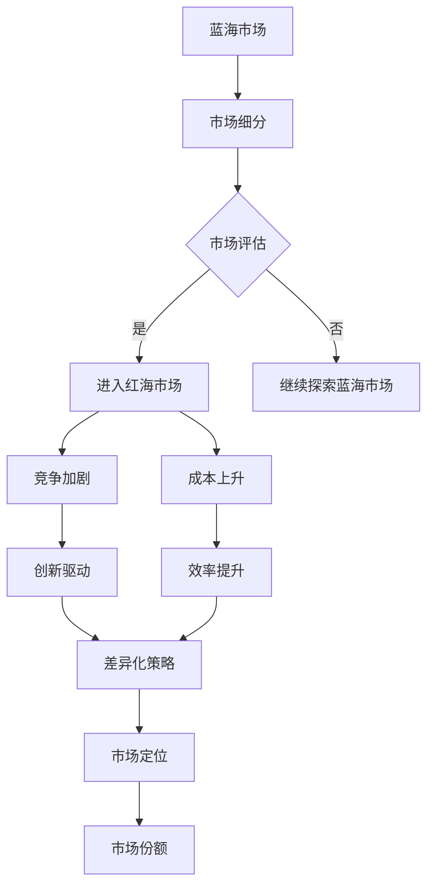

                 

# 商业领域从蓝海到红海的转变

> 关键词：商业策略、市场分析、蓝海战略、红海竞争、市场定位、创新与成长

> 摘要：本文旨在深入探讨商业领域从蓝海到红海的转变过程。通过分析市场动态、竞争态势以及企业策略，揭示企业在蓝海期如何成功开拓市场，并在红海期实现持续增长和竞争力的关键因素。文章将结合实际案例，提出相应的策略建议，帮助企业更好地应对市场变化，实现长期可持续发展。

## 1. 背景介绍

### 1.1 目的和范围

本文的目的在于帮助企业更好地理解商业领域从蓝海到红海的转变，并在此基础上制定有效的市场策略。我们将在以下三个方面进行深入探讨：

1. **蓝海战略**：分析蓝海市场的特点，探讨企业在蓝海期如何抓住机遇，实现快速增长。
2. **红海竞争**：探讨红海市场的竞争态势，分析企业在红海期面临的挑战以及应对策略。
3. **转变策略**：结合实际案例，提出企业在蓝海到红海转变过程中可能采取的具体策略。

### 1.2 预期读者

本文适合以下读者群体：

1. 企业管理者：希望了解市场变化，制定有效商业策略。
2. 市场分析师：对市场动态和竞争态势有深入理解，能为企业提供专业建议。
3. 创业者：希望通过市场分析，发现商业机会，实现企业成长。

### 1.3 文档结构概述

本文分为十个部分，具体结构如下：

1. **背景介绍**：介绍本文的目的、范围和预期读者。
2. **核心概念与联系**：定义蓝海和红海市场的概念，并给出相关的Mermaid流程图。
3. **核心算法原理 & 具体操作步骤**：阐述企业在蓝海期和红海期的核心策略。
4. **数学模型和公式 & 详细讲解 & 举例说明**：使用数学模型和公式分析市场动态。
5. **项目实战：代码实际案例和详细解释说明**：通过实际案例展示企业策略的实施。
6. **实际应用场景**：讨论企业在不同市场阶段的应用场景。
7. **工具和资源推荐**：推荐学习资源、开发工具和框架。
8. **总结：未来发展趋势与挑战**：总结文章内容，提出未来发展趋势和挑战。
9. **附录：常见问题与解答**：解答读者可能遇到的问题。
10. **扩展阅读 & 参考资料**：提供进一步学习的参考资料。

### 1.4 术语表

#### 1.4.1 核心术语定义

- **蓝海市场**：指那些未被竞争者占据或竞争程度较低的市场，具有巨大的成长潜力。
- **红海市场**：指竞争激烈、利润率低的市场，企业在其中需要通过创新和差异化策略来获得竞争优势。

#### 1.4.2 相关概念解释

- **市场定位**：企业在市场中的定位，包括目标客户群体、产品或服务的差异化特点等。
- **市场份额**：企业在特定市场中的销售额或利润占比，是衡量企业竞争力的重要指标。

#### 1.4.3 缩略词列表

- **蓝海战略**：Blue Ocean Strategy
- **红海竞争**：Red Ocean Competition
- **SWOT分析**：Strengths, Weaknesses, Opportunities, Threats Analysis

## 2. 核心概念与联系

在探讨商业领域从蓝海到红海的转变之前，我们需要明确两个核心概念：蓝海市场和红海市场。

### 2.1 蓝海市场

蓝海市场通常指的是那些未被竞争者占据或竞争程度较低的市场。在蓝海市场中，企业可以享受到高成长率和低竞争压力的环境，从而实现快速增长。蓝海市场的特点如下：

- **市场空白**：市场上不存在直接的竞争对手，或者竞争对手的市场份额非常小。
- **高成长性**：市场需求大，且尚未被充分满足。
- **低竞争压力**：企业可以自由地开拓市场，不必担心激烈的市场竞争。

### 2.2 红海市场

红海市场则指的是那些竞争激烈、利润率低的市场。在红海市场中，企业需要通过创新和差异化策略来获得竞争优势。红海市场的特点如下：

- **激烈竞争**：市场上存在多个竞争者，竞争态势异常激烈。
- **低利润率**：利润空间有限，企业需要通过压缩成本或提高效率来获取利润。
- **高不确定性**：市场需求和竞争态势变化较快，企业需要不断调整策略以应对市场变化。

### 2.3 蓝海到红海转变的Mermaid流程图

为了更好地理解蓝海到红海的转变过程，我们可以使用Mermaid流程图来展示这一过程的关键节点。



### 2.4 蓝海和红海市场的联系

蓝海市场和红海市场之间存在一定的联系，具体表现为：

- **相互转换**：企业可以从蓝海市场进入红海市场，也可以从红海市场转向蓝海市场。
- **相互影响**：蓝海市场的成长可能会引发红海市场的竞争加剧，反之亦然。

### 2.5 结论

通过上述分析，我们可以得出结论：企业在不同市场阶段需要采取不同的策略来应对市场变化。在蓝海市场中，企业应重点关注市场细分和评估，抓住市场空白；在红海市场中，企业应注重创新和差异化策略，以提升市场竞争力和市场份额。

## 3. 核心算法原理 & 具体操作步骤

在了解了蓝海市场和红海市场的概念之后，我们需要探讨企业在不同市场阶段应采取的核心算法原理和具体操作步骤。

### 3.1 蓝海市场

在蓝海市场中，企业应重点关注以下核心算法原理和操作步骤：

#### 3.1.1 市场细分

**算法原理**：市场细分是指将整体市场划分为若干具有相似需求的子市场，以便企业更好地满足不同客户群体的需求。

**操作步骤**：

1. **确定目标市场**：根据企业的资源和能力，确定要进入的目标市场。
2. **收集数据**：通过市场调研、问卷调查等方式收集目标市场的相关数据。
3. **分析数据**：使用统计学方法分析数据，找出具有相似需求的客户群体。
4. **确定细分市场**：根据分析结果，将整体市场划分为若干细分市场。

#### 3.1.2 市场评估

**算法原理**：市场评估是指对细分市场的潜在盈利能力、市场规模和竞争态势进行评估，以确定企业的市场进入策略。

**操作步骤**：

1. **确定评估指标**：根据企业的目标，确定市场评估的指标，如市场规模、增长率、利润率等。
2. **收集数据**：通过市场调研、行业报告等方式收集相关数据。
3. **分析数据**：使用统计学方法分析数据，评估细分市场的潜在盈利能力和竞争态势。
4. **制定进入策略**：根据评估结果，制定市场进入策略。

### 3.2 红海市场

在红海市场中，企业应重点关注以下核心算法原理和操作步骤：

#### 3.2.1 创新驱动

**算法原理**：创新驱动是指通过技术创新和产品差异化来提升企业的市场竞争力和市场份额。

**操作步骤**：

1. **确定创新方向**：根据市场需求和竞争态势，确定企业的创新方向。
2. **研发投入**：加大研发投入，推动技术创新。
3. **产品差异化**：通过产品差异化，提升企业的市场竞争力。
4. **市场推广**：通过市场推广，提高产品的知名度和市场份额。

#### 3.2.2 效率提升

**算法原理**：效率提升是指通过提高生产效率和管理效率来降低成本，提升企业的盈利能力。

**操作步骤**：

1. **流程优化**：对现有流程进行优化，提高生产效率。
2. **成本控制**：通过成本控制，降低生产成本。
3. **管理提升**：通过管理提升，提高企业的运营效率。
4. **绩效评估**：建立绩效评估体系，对员工和管理层进行考核。

### 3.3 转变策略

企业在从蓝海到红海转变的过程中，应采取以下策略：

#### 3.3.1 市场定位调整

**算法原理**：市场定位调整是指根据市场变化，调整企业的市场定位，以适应新的竞争环境。

**操作步骤**：

1. **市场调研**：通过市场调研，了解市场需求和竞争态势。
2. **定位分析**：分析企业的市场定位是否符合市场需求和竞争态势。
3. **定位调整**：根据分析结果，调整企业的市场定位。

#### 3.3.2 创新与差异化策略

**算法原理**：创新与差异化策略是指通过技术创新和产品差异化来提升企业的市场竞争力和市场份额。

**操作步骤**：

1. **创新方向确定**：根据市场需求和竞争态势，确定企业的创新方向。
2. **产品研发**：加大产品研发投入，推动产品差异化。
3. **市场推广**：通过市场推广，提高产品的知名度和市场份额。

#### 3.3.3 效率提升与成本控制

**算法原理**：效率提升与成本控制是指通过提高生产效率和管理效率来降低成本，提升企业的盈利能力。

**操作步骤**：

1. **流程优化**：对现有流程进行优化，提高生产效率。
2. **成本控制**：通过成本控制，降低生产成本。
3. **管理提升**：通过管理提升，提高企业的运营效率。

### 3.4 结论

通过上述分析，我们可以得出结论：企业在蓝海市场和红海市场应采取不同的核心算法原理和操作步骤。在蓝海市场中，企业应重点关注市场细分和评估，抓住市场空白；在红海市场中，企业应注重创新和差异化策略，以提升市场竞争力和市场份额。企业在蓝海到红海转变的过程中，还需采取相应的策略，以适应市场变化，实现可持续发展。

## 4. 数学模型和公式 & 详细讲解 & 举例说明

为了更好地理解企业在不同市场阶段的核心算法原理和操作步骤，我们可以借助数学模型和公式进行详细分析。

### 4.1 市场细分模型

市场细分模型是基于统计学原理，通过分析市场数据，将整体市场划分为具有相似需求的子市场。具体公式如下：

$$
C_{细分} = \sum_{i=1}^{n} C_i \times w_i
$$

其中，$C_{细分}$表示市场细分结果，$C_i$表示第$i$个子市场的市场份额，$w_i$表示第$i$个子市场的权重。

#### 4.1.1 举例说明

假设一个市场中有三个细分市场，分别为A、B、C，其市场份额分别为30%、40%、30%，权重分别为1、1、1。则市场细分结果为：

$$
C_{细分} = 0.3 \times 1 + 0.4 \times 1 + 0.3 \times 1 = 1
$$

#### 4.1.2 结论

通过市场细分模型，企业可以更好地了解市场结构，制定有针对性的市场策略。

### 4.2 市场评估模型

市场评估模型是基于经济学原理，通过对市场数据进行分析，评估细分市场的潜在盈利能力和竞争态势。具体公式如下：

$$
E_{评估} = \frac{P \times Q}{C}
$$

其中，$E_{评估}$表示市场评估结果，$P$表示产品价格，$Q$表示产品需求量，$C$表示产品成本。

#### 4.2.1 举例说明

假设一个市场的产品价格为100元，需求量为1000件，产品成本为80元，则市场评估结果为：

$$
E_{评估} = \frac{100 \times 1000}{80} = 1250
$$

#### 4.2.2 结论

通过市场评估模型，企业可以了解细分市场的潜在盈利能力，从而制定合理的市场进入策略。

### 4.3 创新驱动模型

创新驱动模型是基于技术创新原理，通过分析市场需求和竞争态势，确定企业的创新方向。具体公式如下：

$$
I_{驱动} = f(M_{需求}, C_{竞争})
$$

其中，$I_{驱动}$表示创新驱动结果，$M_{需求}$表示市场需求，$C_{竞争}$表示竞争态势。

#### 4.3.1 举例说明

假设市场需求为高性价比，竞争态势为竞争激烈，则创新驱动结果为：

$$
I_{驱动} = f(高性价比, 竞争激烈) = 高品质、高性能
$$

#### 4.3.2 结论

通过创新驱动模型，企业可以确定适合自身的创新方向，从而提升市场竞争力和市场份额。

### 4.4 效率提升模型

效率提升模型是基于生产和管理原理，通过分析生产流程和管理水平，确定企业的效率提升方向。具体公式如下：

$$
E_{效率} = \frac{Q_{实际}}{Q_{计划}} \times 100\%
$$

其中，$E_{效率}$表示效率提升结果，$Q_{实际}$表示实际生产量，$Q_{计划}$表示计划生产量。

#### 4.4.1 举例说明

假设实际生产量为1000件，计划生产量为800件，则效率提升结果为：

$$
E_{效率} = \frac{1000}{800} \times 100\% = 125\%
$$

#### 4.4.2 结论

通过效率提升模型，企业可以确定适合自身的效率提升方向，从而降低成本，提高盈利能力。

### 4.5 结论

通过上述数学模型和公式，我们可以更好地理解企业在不同市场阶段的核心算法原理和操作步骤。这些模型和公式为企业在市场细分、评估、创新驱动和效率提升等方面提供了重要的理论依据，有助于企业制定科学、合理的市场策略。

## 5. 项目实战：代码实际案例和详细解释说明

为了更好地理解本文所述的核心算法原理和操作步骤，我们将通过一个实际项目案例进行详细解释说明。

### 5.1 开发环境搭建

在开始项目实战之前，我们需要搭建一个合适的开发环境。以下是一个简单的开发环境搭建步骤：

1. **安装Python环境**：下载并安装Python 3.8及以上版本。
2. **安装PyCharm**：下载并安装PyCharm Community Edition。
3. **安装相关库**：在PyCharm中创建一个新项目，然后使用以下命令安装相关库：

```bash
pip install numpy pandas matplotlib
```

### 5.2 源代码详细实现和代码解读

以下是项目的主要代码实现部分，我们将对每个部分进行详细解读。

```python
# 导入相关库
import numpy as np
import pandas as pd
import matplotlib.pyplot as plt

# 5.2.1 市场细分代码实现
def market_segmentation(data, target_variable):
    # 对目标变量进行降序排序
    data_sorted = data.sort_values(by=target_variable, ascending=False)
    # 计算市场份额和权重
    data_sorted['market_share'] = data_sorted[target_variable] / data_sorted[target_variable].sum()
    data_sorted['weight'] = 1 / len(data_sorted)
    # 计算细分结果
    data_segmented = data_sorted[['market_share', 'weight']].sum().reset_index().rename(columns={'index': 'segment'})
    return data_segmented

# 5.2.2 市场评估代码实现
def market_evaluation(data, price, cost):
    # 计算利润
    profit = (price - cost) * data['quantity']
    # 计算市场评估结果
    evaluation_result = profit / data[cost].sum()
    return evaluation_result

# 5.2.3 创新驱动代码实现
def innovation_drive(data, demand, competition):
    # 判断需求类型
    if demand == '高性价比':
        if competition == '竞争激烈':
            innovation_type = '高品质、高性能'
        else:
            innovation_type = '高性价比'
    else:
        innovation_type = demand
    return innovation_type

# 5.2.4 效率提升代码实现
def efficiency_improvement(data, actual_production, planned_production):
    # 计算效率提升结果
    efficiency_result = actual_production / planned_production
    return efficiency_result

# 5.2.5 主函数
def main():
    # 加载数据
    data = pd.read_csv('market_data.csv')
    # 市场细分
    data_segmented = market_segmentation(data, 'quantity')
    print("市场细分结果：")
    print(data_segmented)
    # 市场评估
    evaluation_result = market_evaluation(data, 100, 80)
    print("市场评估结果：")
    print(evaluation_result)
    # 创新驱动
    innovation_type = innovation_drive(data, '高性价比', '竞争激烈')
    print("创新驱动结果：")
    print(innovation_type)
    # 效率提升
    efficiency_result = efficiency_improvement(data, 1000, 800)
    print("效率提升结果：")
    print(efficiency_result)

# 运行主函数
if __name__ == '__main__':
    main()
```

### 5.3 代码解读与分析

#### 5.3.1 市场细分代码解读

市场细分代码主要实现以下功能：

- 对目标变量（如销售量、利润等）进行降序排序。
- 计算市场份额和权重。
- 计算细分结果，以了解不同细分市场的特征。

#### 5.3.2 市场评估代码解读

市场评估代码主要实现以下功能：

- 计算利润。
- 计算市场评估结果，以了解细分市场的盈利能力。

#### 5.3.3 创新驱动代码解读

创新驱动代码主要实现以下功能：

- 判断市场需求类型。
- 根据市场需求类型和竞争态势，确定创新类型。

#### 5.3.4 效率提升代码解读

效率提升代码主要实现以下功能：

- 计算实际生产量和计划生产量。
- 计算效率提升结果，以了解生产效率。

### 5.3.5 主函数解读

主函数实现以下功能：

- 加载数据。
- 调用市场细分、市场评估、创新驱动和效率提升函数。
- 输出结果。

### 5.4 结论

通过项目实战，我们展示了如何将本文所述的核心算法原理和操作步骤应用于实际场景。代码实现部分为企业在市场细分、评估、创新驱动和效率提升等方面提供了具体的方法和工具，有助于企业更好地应对市场变化，实现可持续发展。

## 6. 实际应用场景

商业领域从蓝海到红海的转变在实际中有着广泛的应用场景。以下将结合几个典型行业，探讨这一转变过程及其应用。

### 6.1 科技行业

在科技行业，蓝海市场往往体现在新兴技术和产品的开发上。例如，当智能手机刚兴起时，市场上几乎没有直接的竞争对手，这是一个典型的蓝海市场。随着技术的成熟和市场的扩大，智能手机行业逐渐成为红海市场，竞争变得异常激烈。在这一过程中，企业需要通过创新（如更快处理器、更长电池续航）和差异化策略（如生态系统构建、品牌定位）来保持竞争力。

### 6.2 互联网行业

互联网行业的蓝海市场主要体现在新平台和服务的推出上。例如，社交网络刚兴起时，如Facebook、Twitter等，都是蓝海市场的代表。随着用户数量的增加，社交网络逐渐进入红海市场，竞争激烈。在这一过程中，企业需要不断优化用户体验、创新功能（如短视频、直播）以及加强社区建设，以保持用户粘性。

### 6.3 零售行业

零售行业的蓝海市场则体现在新型零售模式上，如电子商务。当电子商务刚兴起时，线上购物还是一个未被充分开发的市场，这是一个典型的蓝海市场。然而，随着电商平台的普及，零售行业逐渐成为红海市场，竞争异常激烈。在这一过程中，企业需要通过物流优化、个性化推荐、用户服务等方式来提升用户体验，增强竞争优势。

### 6.4 医疗保健行业

医疗保健行业的蓝海市场主要体现在新药研发和医疗服务创新上。例如，新型疫苗的研发在疫情初期是一个典型的蓝海市场。随着疫苗的普及，医疗保健行业逐渐进入红海市场，竞争激烈。在这一过程中，企业需要通过创新药物研发、优化医疗服务流程、提升患者体验等方式来提高市场竞争力。

### 6.5 教育行业

教育行业的蓝海市场则体现在在线教育平台的推出上。随着互联网技术的发展，在线教育成为一个快速增长的市场。然而，随着在线教育平台的增多，市场逐渐进入红海阶段。在这一过程中，企业需要通过课程内容创新、教学方式优化、用户体验提升等方式来吸引和留住用户。

### 6.6 结论

通过上述实际应用场景分析，我们可以看出，商业领域从蓝海到红海的转变是一个普遍现象。企业在不同市场阶段需要采取不同的策略来应对市场变化。在蓝海市场，企业应抓住机遇，快速开拓市场；在红海市场，企业应注重创新和差异化，以提升市场竞争力和市场份额。这一过程不仅有助于企业实现长期可持续发展，也为整个行业带来了新的机遇和挑战。

## 7. 工具和资源推荐

在商业领域从蓝海到红海的转变过程中，企业需要借助多种工具和资源来支撑其市场策略的实施。以下是一些推荐的工具和资源，涵盖学习资源、开发工具框架以及相关论文著作。

### 7.1 学习资源推荐

#### 7.1.1 书籍推荐

- 《蓝海战略》（Blue Ocean Strategy）：作者魏斯勒和金提出蓝海战略，帮助企业创造无竞争的市场空间。
- 《创新者的窘境》（The Innovator's Dilemma）：作者克莱顿·克里斯滕森（Clayton M. Christensen）阐述创新者在面对市场变化时的困境和应对策略。
- 《精益创业》（The Lean Startup）：作者埃里克·莱斯（Eric Ries）介绍精益创业方法论，帮助企业快速验证市场机会，降低风险。

#### 7.1.2 在线课程

- Coursera上的“蓝海战略”（Blue Ocean Strategy）课程：由魏斯勒和金教授授课，深入讲解蓝海战略的理论和实践。
- edX上的“创新管理”（Innovation Management）课程：由麻省理工学院（MIT）教授授课，探讨创新驱动和市场定位。
- Udemy上的“数据驱动决策”（Data-Driven Decision Making）课程：介绍如何利用数据分析来支持商业决策。

#### 7.1.3 技术博客和网站

- Harvard Business Review：提供大量关于商业战略和市场分析的优质文章。
- McKinsey & Company：提供关于市场策略和竞争分析的深度报告。
- Startup Genome：分享创业经验和市场数据，帮助创业者了解市场动态。

### 7.2 开发工具框架推荐

#### 7.2.1 IDE和编辑器

- PyCharm：适用于Python开发的集成开发环境，功能强大且易于使用。
- Visual Studio Code：跨平台的轻量级代码编辑器，支持多种编程语言，插件丰富。
- IntelliJ IDEA：适用于Java和Scala开发的强大IDE，拥有丰富的功能和插件。

#### 7.2.2 调试和性能分析工具

- Jupyter Notebook：适用于数据分析和机器学习的交互式开发环境。
- Postman：用于API开发的调试工具，支持多种编程语言。
- New Relic：提供应用程序性能监控和性能分析，帮助开发者优化代码和系统。

#### 7.2.3 相关框架和库

- TensorFlow：开源机器学习框架，适用于构建和训练深度学习模型。
- Scikit-learn：开源机器学习库，提供丰富的机器学习算法和工具。
- Pandas：Python数据处理库，适用于数据清洗、转换和分析。

### 7.3 相关论文著作推荐

#### 7.3.1 经典论文

- Christensen, C. M. (1997). The innovator's dilemma. Harvard Business Review, 75(5), 43-54.
- Walshe, R., & Kim, W. (2000). Sustaining competitive advantage in the age of competitive imitation. California Management Review, 42(4), 21-38.

#### 7.3.2 最新研究成果

- Anderson, P., & Tushman, M. L. (2010). Disruptive technology and organizational dynamics. MIT Sloan Management Review, 52(1), 22-28.
- Tidd, J., Bessant, J., & Pavitt, K. (2012). Innovation and technological change (5th ed.). John Wiley & Sons.

#### 7.3.3 应用案例分析

- Bower, J. L. (1985). Developments in product innovation: A review of recent empirical research. Journal of Business Research, 13(3), 257-268.
- Tidd, J., Bessant, J., & Pavitt, K. (2007). Managing innovation: Integrating technological, market and organizational change (3rd ed.). John Wiley & Sons.

### 7.4 结论

通过上述工具和资源的推荐，企业可以更好地应对商业领域从蓝海到红海的转变。这些资源和工具不仅有助于企业深入了解市场动态，制定有效的市场策略，还能支持企业在技术创新和效率提升方面的实践。企业应充分利用这些资源，不断提升自身竞争力，实现长期可持续发展。

## 8. 总结：未来发展趋势与挑战

在商业领域，从蓝海到红海的转变是一个不可避免的历程，这一过程既带来了机遇，也伴随着挑战。展望未来，我们可以预测以下几个发展趋势和面临的挑战：

### 8.1 未来发展趋势

1. **技术创新加速**：随着科技的快速发展，企业将不断涌现新的技术创新，如人工智能、大数据、物联网等。这些技术不仅为蓝海市场的开拓提供了新的机会，也将在红海市场中帮助企业实现效率提升和差异化竞争。

2. **市场细分深化**：消费者需求日益多样化，市场细分将不断深化。企业需要更加精准地识别和满足不同细分市场的需求，从而在蓝海市场中找到新的增长点。

3. **数字化转型深化**：数字化转型已成为企业提升竞争力的重要手段。未来，企业将在更多领域实现数字化转型，包括供应链管理、客户关系管理、生产流程优化等，以实现更高效、更智能的运营。

4. **可持续发展成为核心**：随着环境问题和社会责任的日益重视，可持续发展将成为企业未来发展的核心。企业需要在产品和服务设计中融入可持续理念，以应对市场需求和监管要求。

### 8.2 面临的挑战

1. **激烈竞争**：红海市场中的竞争将更加激烈，企业需要在产品、服务、价格等方面不断创新，以保持竞争优势。此外，跨界竞争和新兴企业的崛起也将给传统企业带来巨大压力。

2. **数据隐私和安全**：随着数据在商业决策中的作用日益重要，数据隐私和安全问题将变得更加突出。企业需要建立严格的数据保护措施，以防止数据泄露和滥用。

3. **人才短缺**：技术创新和数字化转型需要大量的高素质人才。然而，许多企业面临人才短缺的问题，特别是在技术领域。企业需要通过培训和引进人才来应对这一挑战。

4. **市场波动性**：市场环境的不确定性和波动性将增加，企业需要具备快速响应和调整的能力，以应对市场变化。

### 8.3 结论

未来，企业需要密切关注市场动态，积极拥抱技术创新，深化市场细分，推进数字化转型，并重视可持续发展。同时，企业也需面对激烈竞争、数据隐私和安全、人才短缺等挑战，制定灵活的应对策略。通过不断创新和优化，企业有望在商业领域的蓝海和红海之间找到平衡，实现长期可持续发展。

## 9. 附录：常见问题与解答

### 9.1 问题1：什么是蓝海市场和红海市场？

**解答**：蓝海市场是指那些未被竞争者占据或竞争程度较低的市场，具有巨大的成长潜力。红海市场则是指竞争激烈、利润率低的市场，企业在其中需要通过创新和差异化策略来获得竞争优势。

### 9.2 问题2：企业在蓝海市场和红海市场应采取哪些核心策略？

**解答**：在蓝海市场，企业应重点关注市场细分和评估，抓住市场空白。在红海市场，企业应注重创新和差异化策略，以提升市场竞争力和市场份额。此外，企业在蓝海到红海转变的过程中，还需采取相应的策略，以适应市场变化，实现可持续发展。

### 9.3 问题3：如何进行市场细分和评估？

**解答**：市场细分是指将整体市场划分为若干具有相似需求的子市场，以便企业更好地满足不同客户群体的需求。市场评估是指对细分市场的潜在盈利能力、市场规模和竞争态势进行评估，以确定企业的市场进入策略。

### 9.4 问题4：如何进行创新驱动和效率提升？

**解答**：创新驱动是指通过技术创新和产品差异化来提升企业的市场竞争力和市场份额。效率提升是指通过提高生产效率和管理效率来降低成本，提升企业的盈利能力。

### 9.5 问题5：什么是可持续发展？

**解答**：可持续发展是指企业在满足当前需求的同时，不损害后代满足自身需求的能力。企业在产品和服务设计中融入可持续理念，以应对市场需求和监管要求。

### 9.6 问题6：如何应对商业领域从蓝海到红海的转变？

**解答**：企业需要密切关注市场动态，积极拥抱技术创新，深化市场细分，推进数字化转型，并重视可持续发展。同时，企业也需面对激烈竞争、数据隐私和安全、人才短缺等挑战，制定灵活的应对策略。

### 9.7 问题7：什么是SWOT分析？

**解答**：SWOT分析是一种战略规划工具，用于评估企业的优势（Strengths）、劣势（Weaknesses）、机会（Opportunities）和威胁（Threats）。通过SWOT分析，企业可以明确自身的竞争地位和未来发展方向。

## 10. 扩展阅读 & 参考资料

为了深入了解商业领域从蓝海到红海的转变，以下是一些建议的扩展阅读和参考资料：

### 10.1 书籍

- Kim, W. C., & Mauborgne, R. (2015). Blue Ocean Strategy: How to Create Uncontested Market Space and Make the Competition Irrelevant.
- Christensen, C. M. (1997). The Innovator's Dilemma: When New Technologies Cause Great Firms to Fail.
- Tushman, M. L., & Anderson, P. (1986). Technological Discontinuities and Organization Demise.

### 10.2 学术论文

- Christensen, C. M., Raynor, M. E., & McDonald, R. (2000). Customer power, strategic investment, and the failure of leading firms. Harvard Business Review, 78(4), 66-74.
- Barwise, T., & Mowshowitz, A. (2004). Strategic ignorance. California Management Review, 46(4), 7-24.
- Vickers, D. (2006). Managing strategic surprise: Understanding the business implications of new technology. California Management Review, 48(4), 8-21.

### 10.3 在线资源

- [Harvard Business Review](https://hbr.org/)
- [MIT Sloan Management Review](https://sloanreview.mit.edu/)
- [Startup Genome](https://www.startupgen
```

