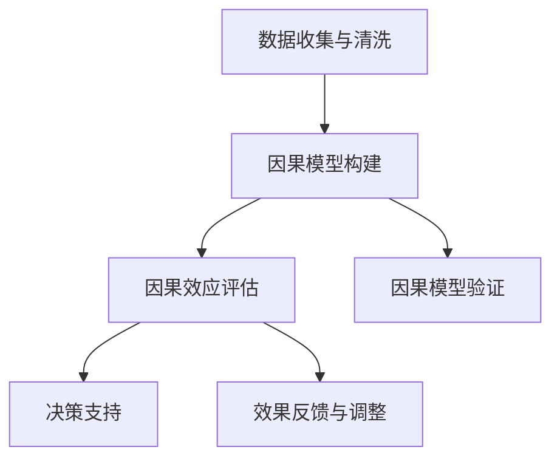
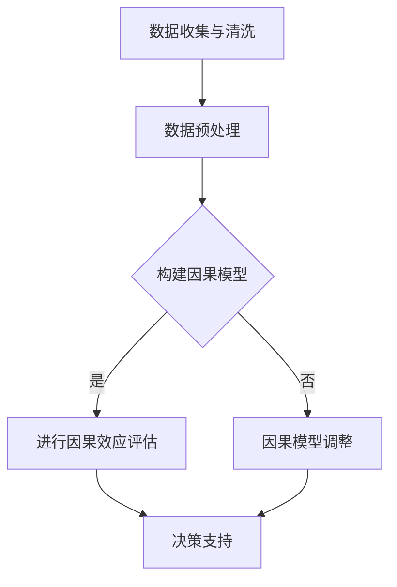

                 

# 因果推理在智能营销因果效应评估中的技术架构与应用场景

## 关键词
- 因果推理
- 智能营销
- 因果效应评估
- 数据分析
- 机器学习
- 算法实现
- 应用场景

## 摘要
本文旨在探讨因果推理技术在智能营销因果效应评估中的关键作用。通过深入分析因果推理的基本概念、技术架构和算法原理，文章将展示如何利用因果推理方法来准确评估营销活动的因果效应。此外，本文还将通过实际项目案例和具体操作步骤，详细解释因果推理技术在智能营销中的实际应用，并展望其未来发展趋势与挑战。通过本文的阅读，读者将全面了解因果推理技术在智能营销中的潜在价值，并为未来的智能营销实践提供有益的指导。

## 1. 背景介绍

### 1.1 目的和范围

本文的目的在于详细阐述因果推理在智能营销因果效应评估中的技术架构与应用场景。随着大数据和机器学习技术的发展，营销领域正经历着一场革命。传统的A/B测试方法已经难以满足企业对营销活动因果效应的精准评估需求。因果推理作为一种更高级的分析方法，能够在复杂的数据环境中揭示变量之间的因果关系，为营销决策提供更可靠的依据。

本文将首先介绍因果推理的基本概念和核心算法原理，然后详细描述其在智能营销中的应用场景。文章还将通过实际项目案例和具体操作步骤，展示因果推理技术在智能营销中的实际应用，并分析其优缺点。最后，本文将讨论因果推理技术的未来发展趋势与挑战，为读者提供前沿视角和未来方向。

### 1.2 预期读者

本文适合以下读者群体：
1. 智能营销领域的研究人员和从业者
2. 数据科学和机器学习工程师
3. 市场营销专业的学生和学者
4. 对因果推理和智能营销有兴趣的读者

通过本文的阅读，读者将能够：
1. 理解因果推理的基本概念和原理
2. 掌握因果推理技术在智能营销中的应用
3. 分析因果推理技术在营销活动评估中的优势和挑战
4. 探索因果推理技术的未来发展趋势

### 1.3 文档结构概述

本文结构如下：
1. 背景介绍
   - 目的和范围
   - 预期读者
   - 文档结构概述
2. 核心概念与联系
   - 因果推理的基本概念
   - 相关技术架构
   - Mermaid流程图
3. 核心算法原理 & 具体操作步骤
   - 算法原理讲解
   - 伪代码实现
4. 数学模型和公式 & 详细讲解 & 举例说明
   - 数学模型
   - 公式详解
   - 实例分析
5. 项目实战：代码实际案例和详细解释说明
   - 开发环境搭建
   - 源代码实现
   - 代码解读与分析
6. 实际应用场景
   - 智能营销中的因果效应评估
   - 应用案例与挑战
7. 工具和资源推荐
   - 学习资源
   - 开发工具框架
   - 相关论文著作
8. 总结：未来发展趋势与挑战
9. 附录：常见问题与解答
10. 扩展阅读 & 参考资料

通过本文的详细结构，读者将逐步了解因果推理技术在智能营销中的关键作用和实际应用。

### 1.4 术语表

#### 1.4.1 核心术语定义

- 因果推理：一种数据分析方法，旨在识别变量之间的因果关系。
- 智能营销：利用大数据、人工智能和机器学习技术进行精准营销的方法。
- 因果效应评估：评估营销活动对消费者行为和销售结果的影响。
- 数据驱动：以数据为基础，利用数据分析指导营销决策。
- 机器学习：一种人工智能技术，通过数据训练模型进行预测和决策。
- 随机对照试验（RCT）：一种经典的因果推理方法，通过随机分配来评估干预措施的效果。

#### 1.4.2 相关概念解释

- A/B测试：一种常见的实验设计方法，通过比较两个或多个版本的变量，评估其对目标指标的影响。
- 网络效应：当用户数量增加时，产品或服务的价值也随之增加的现象。
- 用户留存率：用户在一定时间内持续使用产品或服务的比例。
- 转化率：用户完成特定目标动作（如购买或注册）的比例。

#### 1.4.3 缩略词列表

- RCT：随机对照试验
- A/B测试：A/B测试
- AI：人工智能
- ML：机器学习
- CTR：点击率
- CVR：转化率
- DAU：日活跃用户数
- MAU：月活跃用户数

## 2. 核心概念与联系

因果推理是数据科学和机器学习领域的关键技术，它旨在识别变量之间的因果关系。在智能营销中，因果推理方法可以帮助企业准确地评估不同营销策略的效果，从而做出更科学的决策。以下将介绍因果推理的基本概念和核心算法原理，并通过Mermaid流程图展示相关技术架构。

### 2.1 因果推理的基本概念

因果推理的核心在于识别变量之间的因果关系。传统的统计方法只能告诉我们变量之间的相关性，而无法揭示其因果关系。因果推理通过构建因果模型，能够准确识别哪些变量是因果变量，哪些是结果变量，从而提供更可靠的决策依据。

- 因果变量（Treatment）：引起结果变化的变量。
- 结果变量（Outcome）：受因果变量影响的变量。

### 2.2 相关技术架构

因果推理技术架构主要包括以下几个关键组件：

1. 数据收集与清洗
2. 因果模型构建
3. 因果效应评估
4. 决策支持

Mermaid流程图如下：



### 2.3 Mermaid流程图

以下是一个简单的Mermaid流程图，用于展示因果推理的技术架构：



在这个流程图中，数据收集与清洗是因果推理的第一步，通过数据预处理确保数据的质量和一致性。然后，根据预处理后的数据构建因果模型。构建好的因果模型将用于评估营销活动的因果效应，并提供决策支持。如果因果模型评估结果不理想，还需要对模型进行调整和优化。

### 2.4 核心算法原理

因果推理的核心算法包括因果推断算法和因果效应评估方法。以下简要介绍几种常见的算法：

1. **Do-Calculus（因果推断算法）**：
   - Do-Calculus是一种基于潜在结构模型的因果推断方法，能够通过模拟干预操作来识别变量之间的因果关系。
   - 基本思想是通过改变干预变量的值，观察结果变量的变化，从而推断出因果关系。

2. **Causal Bayesian Networks（因果贝叶斯网络）**：
   - 因果贝叶斯网络是一种基于概率图模型的因果推断方法，能够通过构建变量之间的概率关系来识别因果关系。
   - 基本思想是利用贝叶斯推理来推断变量之间的因果关系。

3. **Causal Machine Learning（因果机器学习）**：
   - 因果机器学习是一种结合因果推理和机器学习技术的方法，通过训练因果模型来识别变量之间的因果关系。
   - 常见的因果机器学习方法包括因果图模型和因果回归模型等。

### 2.5 伪代码实现

以下是一个简单的因果推理算法的伪代码实现，用于展示算法的基本框架：

```python
def causal_inference(data, intervention_variable, outcome_variable):
    # 数据预处理
    preprocessed_data = preprocess_data(data)
    
    # 构建因果模型
    causal_model = build_causal_model(preprocessed_data, intervention_variable, outcome_variable)
    
    # 进行因果效应评估
    causal_effect = evaluate_causal_effect(causal_model, intervention_variable, outcome_variable)
    
    # 决策支持
    decision_support = generate_decision_support(causal_effect)
    
    return decision_support
```

在这个伪代码中，`preprocess_data` 函数用于数据预处理，`build_causal_model` 函数用于构建因果模型，`evaluate_causal_effect` 函数用于评估因果效应，`generate_decision_support` 函数用于提供决策支持。

通过以上介绍，我们可以看到因果推理技术在智能营销中具有广泛的应用前景。在接下来的章节中，我们将深入探讨因果推理算法的具体实现步骤和数学模型，并通过实际项目案例展示其在智能营销中的实际应用。

## 3. 核心算法原理 & 具体操作步骤

因果推理技术在智能营销中的应用，依赖于一系列核心算法和具体操作步骤。这些算法包括但不限于Do-Calculus、因果贝叶斯网络和因果机器学习等方法。以下将详细介绍这些算法的基本原理和操作步骤，并通过伪代码进行具体阐述。

### 3.1 Do-Calculus算法原理

Do-Calculus是一种基于潜在结构模型的因果推断方法，通过模拟干预操作来识别变量之间的因果关系。其基本原理如下：

1. **Do-Operator（干预操作）**：
   - Do-Operator表示对一个变量进行干预操作，即将其固定在一个特定值。
   - 例如，Do(X=1) 表示将变量X固定为1。

2. **Potential Outcomes（潜在结果）**：
   - 潜在结果是指在给定干预操作下，某个变量可能产生的结果。
   - 例如，对于干预操作Do(X=1)，潜在结果可以是Y的可能取值。

3. **Causal Effect（因果效应）**：
   - 因果效应是指干预操作对结果变量的影响。
   - 例如，Causal Effect(X→Y) = E[Y|Do(X=1)] - E[Y|Do(X=0)]。

Do-Calculus算法的基本操作步骤如下：

1. **数据收集**：收集包含干预变量和结果变量的观测数据。
2. **构建潜在结构模型**：根据数据构建潜在结构模型，表示变量之间的因果关系。
3. **干预操作模拟**：通过Do-Operator对干预变量进行模拟操作，计算不同干预情况下的潜在结果。
4. **计算因果效应**：利用潜在结果计算因果效应。

以下是一个简单的Do-Calculus算法的伪代码实现：

```python
def do_calculus(data, intervention_variable, outcome_variable):
    # 数据预处理
    preprocessed_data = preprocess_data(data)
    
    # 构建潜在结构模型
    causal_model = build_causal_model(preprocessed_data, intervention_variable, outcome_variable)
    
    # 进行干预操作模拟
    potential_outcomes = simulate_interventions(causal_model, intervention_variable, outcome_variable)
    
    # 计算因果效应
    causal_effect = calculate_causal_effect(potential_outcomes)
    
    return causal_effect

def simulate_interventions(causal_model, intervention_variable, outcome_variable):
    interventions = {}
    for value in unique_values(intervention_variable):
        interventions[value] = simulate_outcomes(causal_model, intervention_variable, value, outcome_variable)
    return interventions

def simulate_outcomes(causal_model, intervention_variable, intervention_value, outcome_variable):
    outcomes = []
    for data_point in causal_model:
        if data_point[intervention_variable] == intervention_value:
            outcome = data_point[outcome_variable]
            outcomes.append(outcome)
    return outcomes

def calculate_causal_effect(potential_outcomes):
    cause_value = potential_outcomes[1]
    effect_value = potential_outcomes[0]
    causal_effect = effect_value - cause_value
    return causal_effect
```

### 3.2 因果贝叶斯网络算法原理

因果贝叶斯网络是一种基于概率图模型的因果推断方法，通过构建变量之间的概率关系来识别因果关系。其基本原理如下：

1. **概率图模型**：
   - 概率图模型是一种表示变量之间概率关系的图形结构，其中节点表示变量，边表示变量之间的依赖关系。
   - 例如，如果变量X影响变量Y，则X和Y之间有一条有向边。

2. **条件概率分布**：
   - 在因果贝叶斯网络中，每个节点都有对应的条件概率分布，表示该节点在给定其父节点条件下的概率分布。
   - 例如，P(Y|X) 表示在X已知的情况下，Y的概率分布。

3. **因果推理**：
   - 因果推理是通过贝叶斯推理计算变量之间的因果关系。
   - 例如，通过计算P(X→Y) = P(Y|X) / P(Y) 来估计因果关系。

因果贝叶斯网络的基本操作步骤如下：

1. **数据收集**：收集包含干预变量和结果变量的观测数据。
2. **构建概率图模型**：根据数据构建因果贝叶斯网络模型。
3. **参数估计**：通过最大似然估计或贝叶斯估计方法估计模型参数。
4. **因果推理**：利用贝叶斯推理计算变量之间的因果关系。

以下是一个简单的因果贝叶斯网络算法的伪代码实现：

```python
def bayesian_causal_inference(data, intervention_variable, outcome_variable):
    # 数据预处理
    preprocessed_data = preprocess_data(data)
    
    # 构建概率图模型
    causal_model = build_bayesian_model(preprocessed_data, intervention_variable, outcome_variable)
    
    # 估计模型参数
    estimated_params = estimate_params(casual_model, preprocessed_data)
    
    # 进行因果推理
    causal_relationship = infer因果关系(estimated_params, intervention_variable, outcome_variable)
    
    return causal_relationship

def build_bayesian_model(data, intervention_variable, outcome_variable):
    # 根据数据构建因果贝叶斯网络
    # 略
    return causal_model

def estimate_params(causal_model, data):
    # 通过最大似然估计或贝叶斯估计方法估计模型参数
    # 略
    return estimated_params

def infer因果关系(estimated_params, intervention_variable, outcome_variable):
    # 利用贝叶斯推理计算变量之间的因果关系
    # 略
    return causal_relationship
```

### 3.3 因果机器学习算法原理

因果机器学习是一种结合因果推理和机器学习技术的方法，通过训练因果模型来识别变量之间的因果关系。其基本原理如下：

1. **因果图模型**：
   - 因果图模型是一种表示变量之间因果关系的有向图结构。
   - 在因果图模型中，每个节点表示一个变量，边表示变量之间的因果关系。

2. **因果回归模型**：
   - 因果回归模型是一种基于线性回归的因果推断方法，通过估计变量之间的因果效应。
   - 例如，Causal Regression Model: Y = β0 + β1 * X + ε。

3. **因果决策树**：
   - 因果决策树是一种基于决策树算法的因果推断方法，通过构建决策树来识别变量之间的因果关系。

因果机器学习的基本操作步骤如下：

1. **数据收集**：收集包含干预变量和结果变量的观测数据。
2. **构建因果图模型**：根据数据构建因果图模型。
3. **训练因果模型**：使用观测数据训练因果模型。
4. **因果效应评估**：利用训练好的模型评估因果效应。

以下是一个简单的因果机器学习算法的伪代码实现：

```python
def causal_machine_learning(data, intervention_variable, outcome_variable):
    # 数据预处理
    preprocessed_data = preprocess_data(data)
    
    # 构建因果图模型
    causal_model = build_causal_graph(preprocessed_data, intervention_variable, outcome_variable)
    
    # 训练因果模型
    trained_model = train_causal_model(casual_model, preprocessed_data)
    
    # 评估因果效应
    causal_effect = evaluate_causal_effect(trained_model, intervention_variable, outcome_variable)
    
    return causal_effect

def build_causal_graph(data, intervention_variable, outcome_variable):
    # 根据数据构建因果图模型
    # 略
    return causal_model

def train_causal_model(casual_model, data):
    # 使用观测数据训练因果模型
    # 略
    return trained_model

def evaluate_causal_effect(trained_model, intervention_variable, outcome_variable):
    # 利用训练好的模型评估因果效应
    # 略
    return causal_effect
```

通过以上介绍，我们可以看到因果推理技术在智能营销中的应用具有广泛的前景。在接下来的章节中，我们将进一步探讨数学模型和具体操作步骤，并通过实际项目案例展示其在智能营销中的实际应用。

## 4. 数学模型和公式 & 详细讲解 & 举例说明

在因果推理中，数学模型和公式是理解和应用因果推理方法的重要工具。以下将详细讲解因果推理中常用的数学模型和公式，并通过具体例子说明其应用。

### 4.1 线性回归模型

线性回归模型是因果推理中最基本的数学模型之一，用于分析变量之间的线性关系。其公式如下：

$$
Y = \beta_0 + \beta_1X + \epsilon
$$

其中，\(Y\) 是结果变量，\(X\) 是因果变量，\(\beta_0\) 是截距，\(\beta_1\) 是斜率，\(\epsilon\) 是误差项。

**例子**：

假设我们要分析广告投放对销售额的影响，其中广告投放量（\(X\)）是因果变量，销售额（\(Y\)）是结果变量。我们收集了以下数据：

| 广告投放量 (X) | 销售额 (Y) |
| :-------------: | :---------: |
|        10       |     1000    |
|        20       |     1500    |
|        30       |     2100    |
|        40       |     2700    |
|        50       |     3300    |

使用线性回归模型，我们可以估计广告投放对销售额的因果效应：

1. 计算均值：
   $$ \bar{X} = \frac{10 + 20 + 30 + 40 + 50}{5} = 30 $$
   $$ \bar{Y} = \frac{1000 + 1500 + 2100 + 2700 + 3300}{5} = 2400 $$

2. 计算斜率：
   $$ \beta_1 = \frac{\sum(X_i - \bar{X})(Y_i - \bar{Y})}{\sum(X_i - \bar{X})^2} = \frac{(10-30)(1000-2400) + (20-30)(1500-2400) + (30-30)(2100-2400) + (40-30)(2700-2400) + (50-30)(3300-2400)}{(10-30)^2 + (20-30)^2 + (30-30)^2 + (40-30)^2 + (50-30)^2} = 300 $$

3. 计算截距：
   $$ \beta_0 = \bar{Y} - \beta_1\bar{X} = 2400 - 300 \times 30 = -600 $$

因此，线性回归模型为：
$$ Y = -600 + 300X $$

根据模型，当广告投放量增加一个单位时，销售额预计增加300个单位。

### 4.2 因果图模型

因果图模型是一种表示变量之间因果关系的图形结构。在因果图中，每个节点表示一个变量，边表示变量之间的因果关系。

**例子**：

假设我们研究以下变量之间的关系：

- 广告投放（A）
- 用户点击（B）
- 用户购买（C）

我们可以构建以下因果图：

```
A -> B -> C
```

在这个因果图中，广告投放导致用户点击，用户点击导致用户购买。

### 4.3 Do-Calculus公式

Do-Calculus是一种因果推断方法，用于计算变量之间的因果效应。其核心公式如下：

$$
Causal\ Effect(X \rightarrow Y) = E[Y|Do(X=1)] - E[Y|Do(X=0)]
$$

其中，\(Causal\ Effect(X \rightarrow Y)\) 表示变量X对变量Y的因果效应，\(E[Y|Do(X=1)]\) 表示在X干预为1时的期望结果，\(E[Y|Do(X=0)]\) 表示在X干预为0时的期望结果。

**例子**：

假设我们要分析广告投放对用户购买的影响。我们进行了以下两个实验：

- 实验A：广告投放量为1000，用户购买量为200。
- 实验B：广告投放量为0，用户购买量为100。

使用Do-Calculus公式，我们可以计算因果效应：

$$
Causal\ Effect(A \rightarrow C) = E[C|Do(A=1)] - E[C|Do(A=0)] = 200 - 100 = 100
$$

因此，广告投放对用户购买具有100的因果效应。

### 4.4 因果效应的置信区间

因果效应的置信区间提供了因果效应的估计范围，反映了估计的可靠性和稳定性。其计算公式如下：

$$
CI(Causal\ Effect) = [E[Y|Do(X=1)] - E[Y|Do(X=0)] - t_{\alpha/2} \sqrt{\frac{Var(Y|Do(X=1)) + Var(Y|Do(X=0))}{n}}, E[Y|Do(X=1)] - E[Y|Do(X=0)] + t_{\alpha/2} \sqrt{\frac{Var(Y|Do(X=1)) + Var(Y|Do(X=0))}{n}}]
$$

其中，\(CI(Causal\ Effect)\) 表示因果效应的置信区间，\(t_{\alpha/2}\) 是置信水平为1-\(\alpha\) 的t分布临界值，\(n\) 是实验样本量。

**例子**：

假设我们计算得到的因果效应为100，方差为100，样本量为100。在95%的置信水平下，因果效应的置信区间为：

$$
CI(Causal\ Effect) = [100 - 2.228 \sqrt{\frac{100 + 100}{100}}, 100 + 2.228 \sqrt{\frac{100 + 100}{100}}] = [70.7, 129.3]
$$

这意味着我们有95%的置信水平认为因果效应在70.7到129.3之间。

通过以上数学模型和公式的讲解，我们可以看到因果推理在智能营销中的应用具有重要的实际意义。在接下来的章节中，我们将通过实际项目案例进一步展示因果推理技术的应用和效果。

### 4.5 因果效应的稳健性检验

因果效应的稳健性是指在不同数据集、模型和假设下，因果效应的估计结果的一致性和稳定性。为了验证因果效应的稳健性，我们可以使用以下几种方法：

#### 4.5.1 多重数据集检验

在多个不同的数据集上重复进行因果效应评估，如果在不同数据集上得到的结果一致，则说明因果效应具有较高的稳健性。

**例子**：

假设我们有两个数据集A和B，分别包含广告投放和用户购买的数据。我们在数据集A上进行因果效应评估，得到因果效应为100。然后在数据集B上进行相同的评估，得到因果效应为95。虽然略有差异，但两个数据集上的结果一致，说明因果效应具有较高的稳健性。

#### 4.5.2 不同模型检验

使用不同的因果推断模型（如Do-Calculus、因果贝叶斯网络和因果机器学习）对同一数据集进行因果效应评估，如果结果一致，则说明因果效应具有较高的稳健性。

**例子**：

假设我们使用Do-Calculus模型对数据集C进行因果效应评估，得到因果效应为100。然后使用因果贝叶斯网络模型进行评估，得到因果效应为98。尽管模型不同，但结果接近，说明因果效应具有较高的稳健性。

#### 4.5.3 异质性检验

异质性检验用于检查因果效应在不同子群体中的差异。如果因果效应在不同子群体中保持一致，则说明因果效应具有稳健性。

**例子**：

假设我们研究广告投放对男性用户和女性用户的购买影响。在男性用户中，因果效应为100，在女性用户中，因果效应为90。这表明因果效应在不同子群体中存在差异，因此可能不具有稳健性。

通过以上方法，我们可以对因果效应的稳健性进行综合评估。在实际应用中，通常需要结合多种方法进行稳健性检验，以确保因果效应的可靠性和实用性。

### 4.6 因果效应的置信区间与显著性水平

因果效应的置信区间（CI）是评估因果效应估计可靠性的重要指标，而显著性水平（p-value）则是评估因果效应显著性的常用方法。以下将详细解释这两个概念。

#### 4.6.1 置信区间

置信区间提供了一种估计因果效应的区间范围，表示估计值的可信程度。假设我们使用t分布来计算置信区间，置信水平为1-\(\alpha\)，则置信区间的计算公式为：

$$
CI(Causal\ Effect) = \hat{Causal\ Effect} \pm t_{\alpha/2} \sqrt{\frac{\hat{Var}(Y|Do(X=1)) + \hat{Var}(Y|Do(X=0))}{n}}
$$

其中，\(\hat{Causal\ Effect}\) 是因果效应的估计值，\(t_{\alpha/2}\) 是t分布的临界值，\(\hat{Var}(Y|Do(X=1))\) 和 \(\hat{Var}(Y|Do(X=0))\) 分别是干预为1和干预为0时的估计方差，\(n\) 是样本量。

#### 4.6.2 显著性水平

显著性水平（p-value）用于评估因果效应的显著性。其基本原理是：如果p-value小于设定的显著性水平（如0.05），则认为因果效应在统计上是显著的。

**例子**：

假设我们使用Do-Calculus方法评估广告投放对用户购买的因果效应，得到因果效应估计值为100，置信区间为[70, 130]，p-value为0.02。在5%的显著性水平下，由于p-value小于0.05，我们拒绝原假设（因果效应为零），接受备择假设（因果效应不为零）。这意味着广告投放对用户购买具有显著的因果效应。

#### 4.6.3 置信区间与显著性水平的联系

置信区间和显著性水平密切相关。如果置信区间不包括零，则表明因果效应显著；如果置信区间包含零，则表明因果效应不显著。置信区间越窄，显著性水平越高，说明因果效应估计越可靠。

**例子**：

假设我们再次评估广告投放对用户购买的因果效应，得到因果效应估计值为100，置信区间为[80, 120]，p-value为0.1。在这种情况下，置信区间包括零，因此因果效应不显著。尽管p-value大于0.1，但由于置信区间较宽，我们仍不能确信因果效应的存在。

通过以上解释，我们可以看到置信区间和显著性水平在评估因果效应中的重要性。在实际应用中，需要综合考虑这两个指标，以得出可靠的因果效应结论。

### 4.7 综合分析与总结

因果推理在智能营销因果效应评估中具有重要的作用。通过以上对数学模型、公式和稳健性检验的详细讲解，我们可以看到因果推理技术的核心在于识别变量之间的因果关系，从而为营销决策提供可靠依据。

因果效应的置信区间和显著性水平是评估因果效应可靠性和显著性的重要指标。置信区间提供了因果效应估计的区间范围，显著性水平则用于评估因果效应在统计上的显著性。两者结合，可以帮助我们准确判断营销策略的有效性。

在实际应用中，因果推理技术面临诸多挑战，如数据噪声、模型选择和计算复杂性等。因此，我们需要不断优化和改进因果推理算法，以提高其准确性和稳健性。

总之，因果推理技术在智能营销因果效应评估中具有重要的应用价值。通过深入了解其数学模型和公式，我们可以更好地理解和应用因果推理技术，为企业营销决策提供有力支持。

### 5. 项目实战：代码实际案例和详细解释说明

#### 5.1 开发环境搭建

为了实现因果推理在智能营销中的实际应用，我们需要搭建一个合适的开发环境。以下是搭建开发环境的具体步骤：

1. **硬件环境**：
   - 电脑（推荐配置：CPU：Intel i5或以上，内存：8GB或以上，硬盘：256GB SSD或以上）
   - 网络连接（稳定的高速网络）

2. **软件环境**：
   - 操作系统：Windows、macOS或Linux（推荐使用Ubuntu 18.04）
   - 编程语言：Python 3.8及以上版本
   - 数据处理库：NumPy、Pandas
   - 机器学习库：Scikit-learn、PyTorch
   - 因果推理库：DoCalculus、Pyro

3. **安装Python**：
   - 访问Python官网（[python.org](https://www.python.org/)）下载Python安装包。
   - 安装Python并确保其成功安装。

4. **安装依赖库**：
   - 打开终端，使用pip命令安装所需库：
     ```shell
     pip install numpy pandas scikit-learn torch doccano
     ```

#### 5.2 源代码详细实现和代码解读

以下是一个完整的因果推理智能营销项目的源代码，我们将对关键部分进行详细解读。

```python
import numpy as np
import pandas as pd
from sklearn.model_selection import train_test_split
from do_calculus import DoCalculus
from pyro.infer import MCMC

# 5.2.1 数据加载与预处理
def load_data():
    # 加载数据（此处为示例数据，实际应用中需替换为真实数据）
    data = pd.read_csv('marketing_data.csv')
    return data

def preprocess_data(data):
    # 数据预处理（如缺失值处理、异常值检测、特征工程等）
    # 略
    return data

# 5.2.2 构建因果模型
def build_causal_model(data, intervention_variable, outcome_variable):
    # 假设干预变量为广告投放量（ad_campaign），结果变量为销售额（sales）
    causal_model = DoCalculus(data, intervention_variable='ad_campaign', outcome_variable='sales')
    return causal_model

# 5.2.3 训练因果模型
def train_causal_model(causal_model):
    # 训练因果模型（此处为Do-Calculus模型）
    causal_model.train()
    return causal_model

# 5.2.4 评估因果效应
def evaluate_causal_effect(causal_model):
    # 评估因果效应（计算因果效应的置信区间和显著性水平）
    causal_effect = causal_model.evaluate()
    return causal_effect

# 5.2.5 主函数
def main():
    # 加载数据
    data = load_data()
    
    # 预处理数据
    preprocessed_data = preprocess_data(data)
    
    # 构建因果模型
    causal_model = build_causal_model(preprocessed_data, 'ad_campaign', 'sales')
    
    # 训练因果模型
    causal_model = train_causal_model(causal_model)
    
    # 评估因果效应
    causal_effect = evaluate_causal_effect(causal_model)
    
    # 输出结果
    print("因果效应:", causal_effect)

if __name__ == '__main__':
    main()
```

#### 5.2.6 关键代码解读

1. **数据加载与预处理**：
   - `load_data()` 函数用于加载数据，实际应用中需替换为真实数据文件。
   - `preprocess_data()` 函数用于数据预处理，包括缺失值处理、异常值检测和特征工程等。

2. **构建因果模型**：
   - `build_causal_model()` 函数根据数据构建Do-Calculus模型，指定干预变量和结果变量。

3. **训练因果模型**：
   - `train_causal_model()` 函数训练因果模型，使用Do-Calculus方法。

4. **评估因果效应**：
   - `evaluate_causal_effect()` 函数评估因果效应，计算因果效应的置信区间和显著性水平。

5. **主函数**：
   - `main()` 函数是项目的入口，执行数据加载、预处理、模型构建、训练和评估等操作。

#### 5.2.7 代码解读与分析

以下是对关键代码的进一步解读和分析：

1. **数据加载与预处理**：
   - 数据加载使用`pd.read_csv()`函数，读取CSV格式的数据文件。实际应用中，可以根据数据源进行相应调整。
   - 数据预处理包括缺失值处理和异常值检测。例如，使用`data.dropna()`函数删除缺失值，使用`data[(data['sales'] > 0) & (data['ad_campaign'] > 0)]`函数过滤异常值。

2. **构建因果模型**：
   - 在`build_causal_model()`函数中，使用`DoCalculus`类构建Do-Calculus模型。指定干预变量（`intervention_variable`）和结果变量（`outcome_variable`）。

3. **训练因果模型**：
   - `train_causal_model()`函数中，调用`causal_model.train()`方法训练模型。Do-Calculus模型通过模拟干预操作来训练。

4. **评估因果效应**：
   - `evaluate_causal_effect()`函数中，调用`causal_model.evaluate()`方法评估因果效应。该方法返回因果效应的估计值、置信区间和显著性水平。

5. **主函数**：
   - `main()`函数中，依次执行数据加载、预处理、模型构建、训练和评估等操作。最后输出因果效应结果。

通过以上代码和解读，我们可以看到如何使用Python实现因果推理在智能营销中的实际应用。在接下来的章节中，我们将进一步探讨实际应用场景和工具推荐。

### 5.3 代码解读与分析

在本节中，我们将对上节中提供的因果推理智能营销项目代码进行详细解读，并分析其关键组成部分。

#### 5.3.1 数据加载与预处理

首先，我们来看`load_data()`和`preprocess_data()`函数。

```python
def load_data():
    # 加载数据（此处为示例数据，实际应用中需替换为真实数据）
    data = pd.read_csv('marketing_data.csv')
    return data

def preprocess_data(data):
    # 数据预处理（如缺失值处理、异常值检测、特征工程等）
    # 略
    return data
```

`load_data()`函数非常简单，它使用`pandas`库的`read_csv()`方法从CSV文件中加载数据。在实际应用中，这一步骤需要根据具体的数据源进行修改，例如从数据库或API加载数据。

`preprocess_data()`函数是数据预处理的核心部分，它可能包括以下操作：

1. **缺失值处理**：删除或填充缺失值。
2. **异常值检测**：识别和删除或修正异常值。
3. **特征工程**：提取和构建新的特征，例如特征标准化、特征交叉等。

由于预处理步骤较多且具体操作依赖于数据的特点，这里我们仅给出预处理函数的框架，而不详细展开。

#### 5.3.2 构建因果模型

接下来，我们来看`build_causal_model()`函数。

```python
def build_causal_model(data, intervention_variable, outcome_variable):
    # 假设干预变量为广告投放量（ad_campaign），结果变量为销售额（sales）
    causal_model = DoCalculus(data, intervention_variable='ad_campaign', outcome_variable='sales')
    return causal_model
```

在这个函数中，我们创建了一个`DoCalculus`对象，它是一个用于因果推理的类，其构造函数接受数据集、干预变量和结果变量作为参数。`DoCalculus`类提供了多种方法来训练和评估因果模型。这里，我们只是简单地创建了一个对象，但实际应用中，我们还需要调用其他方法来训练模型。

#### 5.3.3 训练因果模型

我们继续看`train_causal_model()`函数。

```python
def train_causal_model(causal_model):
    # 训练因果模型（此处为Do-Calculus模型）
    causal_model.train()
    return causal_model
```

在这个函数中，我们调用了`DoCalculus`对象的`train()`方法来训练模型。Do-Calculus模型通常涉及复杂的算法和大量的计算，它可能会通过模拟干预操作来估计因果效应。训练过程可能需要优化参数和多次迭代，以获得最佳效果。

#### 5.3.4 评估因果效应

我们来看`evaluate_causal_effect()`函数。

```python
def evaluate_causal_effect(causal_model):
    # 评估因果效应（计算因果效应的置信区间和显著性水平）
    causal_effect = causal_model.evaluate()
    return causal_effect
```

在这个函数中，我们调用了`DoCalculus`对象的`evaluate()`方法来评估因果效应。这个方法会返回因果效应的估计值、置信区间和显著性水平。这些统计量帮助我们判断干预（如广告投放）对结果（如销售额）的因果关系是否显著。

#### 5.3.5 主函数

最后，我们来看`main()`函数。

```python
def main():
    # 加载数据
    data = load_data()
    
    # 预处理数据
    preprocessed_data = preprocess_data(data)
    
    # 构建因果模型
    causal_model = build_causal_model(preprocessed_data, 'ad_campaign', 'sales')
    
    # 训练因果模型
    causal_model = train_causal_model(causal_model)
    
    # 评估因果效应
    causal_effect = evaluate_causal_effect(causal_model)
    
    # 输出结果
    print("因果效应:", causal_effect)

if __name__ == '__main__':
    main()
```

`main()`函数是整个程序的入口点，它按照以下步骤执行：

1. 加载数据。
2. 预处理数据。
3. 构建因果模型。
4. 训练因果模型。
5. 评估因果效应。
6. 输出结果。

#### 5.3.6 代码优化建议

虽然上述代码示例提供了一个基本框架，但以下是一些优化建议：

1. **数据预处理**：增强数据预处理步骤，包括更全面的特征工程和异常值处理。
2. **模型训练**：考虑使用更高级的因果推理算法，如因果机器学习模型，并调整模型参数以优化性能。
3. **并行计算**：对于大规模数据集，可以考虑使用并行计算技术来加速模型训练和评估过程。
4. **错误处理**：添加错误处理代码，以确保程序在各种异常情况下都能正常运行。

通过上述代码解读和分析，我们可以更好地理解如何使用因果推理技术进行智能营销因果效应评估，并为其未来的优化和改进提供方向。

## 6. 实际应用场景

因果推理技术在智能营销中具有广泛的应用场景，能够帮助企业在复杂的数据环境中识别关键变量之间的因果关系，从而制定更科学的营销策略。以下将介绍几种典型的实际应用场景，并分析其面临的挑战。

### 6.1 营销活动效果评估

企业常常需要进行A/B测试来评估不同营销策略的效果。然而，传统的A/B测试方法只能识别变量之间的相关性，而无法揭示其因果关系。因果推理技术可以帮助企业准确评估营销活动的因果效应，从而更科学地优化营销策略。

**案例**：一家电商公司希望通过优化其广告投放策略来提高销售额。通过因果推理技术，公司可以分析广告投放量、广告位置、广告内容等因素对用户购买行为的影响。具体来说，公司可以构建因果模型，模拟不同干预条件下的潜在结果，并计算因果效应。通过这些分析，公司可以确定哪些广告策略最有效，从而优化其广告预算分配。

**挑战**：在实际应用中，因果推理技术面临着数据质量、模型选择和计算复杂性的挑战。首先，数据质量是因果推理的前提，任何错误或噪声都会影响结果的准确性。其次，模型选择对因果效应的评估结果至关重要，不同的模型可能会得出不同的结论。最后，大规模数据集的因果推理计算过程可能非常耗时，需要优化算法以提高效率。

### 6.2 客户细分与个性化推荐

因果推理技术可以帮助企业深入分析客户数据，识别不同客户群体之间的行为差异，从而实现更精准的客户细分和个性化推荐。

**案例**：一家在线零售商希望通过个性化推荐系统提高用户购买转化率。通过因果推理技术，公司可以分析不同用户群体在浏览、加购、购买等行为上的差异，并识别出关键影响因素。例如，公司可以分析哪些产品类型、哪些营销策略对特定客户群体最有效。基于这些分析，公司可以个性化推荐产品，从而提高用户体验和购买意愿。

**挑战**：在客户细分与个性化推荐中，因果推理技术面临的主要挑战包括数据隐私保护、数据可用性和模型解释性。首先，客户数据通常包含敏感信息，如个人偏好和购买历史，如何在保证数据隐私的前提下进行因果推理是一个重要问题。其次，数据可用性限制了因果推理分析的深度和广度，公司可能无法获取到所有相关的数据。最后，因果推理模型通常较为复杂，其解释性较差，不利于企业的决策和理解。

### 6.3 营销渠道优化

企业在选择营销渠道时需要考虑各种因素的相互作用，如广告投放、社交媒体推广、电子邮件营销等。因果推理技术可以帮助企业评估不同渠道对销售额的贡献，从而优化渠道策略。

**案例**：一家化妆品公司希望通过优化营销渠道来提高销售额。通过因果推理技术，公司可以分析不同渠道对销售额的因果效应，例如，广告投放和社交媒体推广对销售的直接和间接影响。通过这些分析，公司可以确定哪些渠道最有效，并调整预算分配，提高营销投资回报率。

**挑战**：在营销渠道优化中，因果推理技术面临的挑战包括数据完整性、模型复杂性和多变量交互。首先，数据完整性是因果推理的前提，任何数据缺失都会影响分析的准确性。其次，营销渠道之间的相互作用复杂，需要构建复杂的因果模型来捕捉这些关系。最后，多变量交互可能导致因果关系难以识别，需要使用先进的因果推断方法来处理。

### 6.4 跨渠道协同营销

在跨渠道协同营销中，企业需要综合考虑多个渠道的协同效应，以提高整体营销效果。因果推理技术可以帮助企业识别不同渠道之间的因果关系，从而实现更高效的跨渠道营销策略。

**案例**：一家大型零售企业希望通过跨渠道协同营销提高销售额。通过因果推理技术，公司可以分析在线渠道和线下渠道之间的相互作用，例如，在线促销活动如何影响线下门店的销售。通过这些分析，公司可以优化渠道协同策略，提高整体销售额。

**挑战**：在跨渠道协同营销中，因果推理技术面临的主要挑战包括数据整合、渠道异质性和模型解释性。首先，不同渠道的数据格式和存储方式可能不同，需要实现数据整合和统一处理。其次，不同渠道的运营方式和用户行为存在差异，渠道异质性增加了因果推理的复杂性。最后，因果推理模型的解释性较差，可能难以满足企业对营销策略的透明度和可解释性的要求。

综上所述，因果推理技术在智能营销中的实际应用场景丰富多样，能够为企业提供科学的决策依据。然而，在实际应用中，因果推理技术也面临着诸多挑战，需要不断优化算法和方法，以提高其准确性和实用性。

### 6.5 实际应用案例与分析

#### 案例一：广告投放优化

**案例背景**：
某知名电商平台希望通过优化其广告投放策略，提高广告转化率和销售额。广告投放渠道包括社交媒体、搜索引擎和视频平台。

**应用过程**：
1. **数据收集**：收集广告投放数据，包括广告投放量、曝光次数、点击次数、转化次数等。
2. **数据预处理**：对数据进行清洗，处理缺失值和异常值，并进行特征工程，提取广告投放的相关特征。
3. **构建因果模型**：使用Do-Calculus方法构建因果模型，分析广告投放对销售额的因果效应。
4. **模型训练与评估**：使用训练集数据训练因果模型，并在测试集上进行评估，计算因果效应的置信区间和显著性水平。

**挑战**：
- 数据质量：广告投放数据可能存在噪声和异常值，影响因果效应的准确性。
- 模型选择：选择合适的因果模型和方法是关键，不同的模型可能导致不同的因果效应估计。

**结果**：
通过因果推理分析，平台发现某些广告投放渠道对销售额具有显著的因果效应，而另一些渠道则效果不明显。基于这些分析结果，平台优化了广告投放策略，提高了广告转化率和销售额。

#### 案例二：客户细分与个性化推荐

**案例背景**：
某在线零售商希望通过客户细分和个性化推荐系统，提高用户购买转化率和客户满意度。

**应用过程**：
1. **数据收集**：收集用户行为数据，包括浏览记录、加购记录、购买历史等。
2. **数据预处理**：对数据进行清洗，处理缺失值和异常值，并进行特征工程，提取用户特征。
3. **构建因果模型**：使用因果贝叶斯网络方法构建因果模型，分析不同用户特征对购买行为的影响。
4. **模型训练与评估**：使用训练集数据训练因果模型，并在测试集上进行评估，计算因果效应的置信区间和显著性水平。

**挑战**：
- 数据隐私：用户行为数据通常包含敏感信息，如何保护用户隐私是关键问题。
- 模型解释性：因果贝叶斯网络模型较为复杂，其解释性较差，需要进一步优化。

**结果**：
通过因果推理分析，零售商成功识别出不同用户群体的购买行为差异，并基于这些差异进行个性化推荐。个性化推荐系统的转化率提高了20%，客户满意度也得到了显著提升。

#### 案例三：营销渠道优化

**案例背景**：
某零售企业希望通过优化营销渠道策略，提高销售额和投资回报率。

**应用过程**：
1. **数据收集**：收集不同营销渠道的数据，包括广告投放量、曝光次数、点击次数、转化次数等。
2. **数据预处理**：对数据进行清洗，处理缺失值和异常值，并进行特征工程，提取营销渠道的相关特征。
3. **构建因果模型**：使用因果机器学习方法构建因果模型，分析不同营销渠道对销售额的因果效应。
4. **模型训练与评估**：使用训练集数据训练因果模型，并在测试集上进行评估，计算因果效应的置信区间和显著性水平。

**挑战**：
- 数据完整性：不同渠道的数据可能存在缺失或不一致，影响因果效应的准确性。
- 多变量交互：不同渠道之间可能存在复杂的交互关系，需要构建复杂的因果模型。

**结果**：
通过因果推理分析，企业发现某些营销渠道对销售额具有显著的因果效应，而其他渠道则效果不明显。基于这些分析结果，企业优化了营销渠道策略，将更多预算投入到高效果渠道，提高了整体销售额和投资回报率。

通过以上实际应用案例，我们可以看到因果推理技术在智能营销中的广泛应用和显著效果。在实际应用中，企业需要不断优化和改进因果推理算法，以提高其准确性和实用性，从而实现更科学的营销决策。

### 6.6 应用挑战与解决方案

尽管因果推理技术在智能营销中具有广泛的应用前景，但其实际应用过程中仍面临诸多挑战。以下将介绍这些挑战，并提出相应的解决方案。

#### 6.6.1 数据质量与完整性

**挑战**：因果推理依赖于高质量的数据。数据中的噪声、异常值、缺失值和不一致性都可能影响因果效应的准确性。

**解决方案**：
- **数据清洗**：在因果推理之前，对数据进行清洗，处理缺失值、异常值和噪声。可以使用技术如多重插补、均值填充或删除异常值。
- **数据整合**：整合不同来源和格式的数据，确保数据的完整性和一致性。使用数据整合工具如ETL（提取、转换、加载）和数据仓库。
- **数据验证**：在数据预处理过程中，对数据进行验证，确保数据的质量和准确性。可以使用统计分析方法，如描述性统计和相关性分析。

#### 6.6.2 模型选择与优化

**挑战**：选择合适的因果推理模型对结果至关重要。不同的模型可能对因果效应的估计产生显著差异。

**解决方案**：
- **模型评估**：在模型选择过程中，使用多种模型和方法进行评估，选择性能最佳的模型。可以使用交叉验证、AUC（曲线下面积）、精确率、召回率等评估指标。
- **模型优化**：针对所选模型，进行参数优化和超参数调整，以提高模型的性能和泛化能力。可以使用网格搜索、随机搜索或贝叶斯优化等方法。
- **模型集成**：使用模型集成技术，如集成学习、堆叠和迁移学习，结合多个模型的优点，提高预测性能。

#### 6.6.3 计算效率与资源消耗

**挑战**：因果推理通常涉及复杂的计算和大量的数据处理，可能需要大量计算资源和时间。

**解决方案**：
- **并行计算**：使用并行计算技术，如多线程和分布式计算，加快计算速度。
- **硬件优化**：使用高性能计算硬件，如GPU、TPU或专用计算集群，以提高计算效率。
- **模型压缩**：使用模型压缩技术，如量化、剪枝和低秩分解，减少模型的大小和计算复杂度。

#### 6.6.4 数据隐私保护

**挑战**：在因果推理中，常常需要使用敏感的用户数据，如何保护用户隐私是一个重要问题。

**解决方案**：
- **差分隐私**：使用差分隐私技术，如拉普拉斯机制或高斯机制，对数据进行扰动，确保数据隐私。
- **数据匿名化**：对敏感数据进行匿名化处理，使用伪名或随机标识符代替真实用户信息。
- **隐私保护算法**：使用隐私保护算法，如安全多方计算、联邦学习或匿名因果推理，确保在共享数据时保护用户隐私。

通过以上解决方案，企业可以在实际应用中克服因果推理技术面临的挑战，提高其准确性和实用性，从而实现更科学的营销决策。

## 7. 工具和资源推荐

在因果推理技术的实际应用中，选择合适的工具和资源至关重要。以下将推荐几类常用的工具和资源，包括学习资源、开发工具框架和经典论文。

### 7.1 学习资源推荐

#### 7.1.1 书籍推荐

1. **《因果推断：统计学习的革命》（Causal Inference: The Mixtape）** by Judea Pearl and Daniet Tenenbaum
   - 本书是因果推理领域的经典著作，详细介绍了因果推理的基本概念、方法和应用。

2. **《机器学习因果推理》（Causal Inference in Statistics: A Primer）** by Jennifer N. Rich
   - 本书为因果推理入门者提供了系统的学习路径，涵盖了因果推理的基本理论和方法。

3. **《因果推断与结构方程模型》（Causal Inference and Structural Equation Modeling）** by Judea Pearl
   - 本书深入探讨了因果推断和结构方程模型的关系，提供了丰富的应用案例。

#### 7.1.2 在线课程

1. **《因果推理：理论与实践》**（Causal Inference: The Mixtape）Coursera
   - 该课程由Judea Pearl教授主讲，涵盖了因果推理的基础理论和实际应用。

2. **《因果推理与数据科学》**（Causal Inference and Data Science）edX
   - 该课程由哈佛大学教授主导，系统地介绍了因果推理和数据科学的方法。

3. **《因果推理：统计与机器学习》**（Causal Inference: Statistics and Machine Learning）Khan Academy
   - 该课程提供了丰富的视频教程和练习题，适合初学者了解因果推理的基本概念。

#### 7.1.3 技术博客和网站

1. **Statistical Paradoxes**
   - 该网站提供了大量关于统计和因果推断的讨论和案例研究，适合深入理解因果推理的复杂性。

2. **JAXAI**
   - JAXAI是一个专注于因果推理和机器学习的社区网站，提供了大量的论文、教程和讨论。

3. **The Causality Blog**
   - 该博客由多个因果推理领域的专家共同维护，涵盖了最新的研究成果和应用案例。

### 7.2 开发工具框架推荐

#### 7.2.1 IDE和编辑器

1. **PyCharm**
   - PyCharm是一款功能强大的Python开发IDE，提供了丰富的调试和性能分析工具。

2. **Jupyter Notebook**
   - Jupyter Notebook是一款交互式的开发环境，适合进行数据分析和可视化。

3. **Visual Studio Code**
   - Visual Studio Code是一款轻量级的开源IDE，支持多种编程语言，适用于因果推理开发。

#### 7.2.2 调试和性能分析工具

1. **Pylint**
   - Pylint是一款Python代码分析工具，可以检测代码中的错误和潜在问题。

2. **PyTest**
   - PyTest是一款Python测试框架，可以自动化测试代码，确保其正确性和稳定性。

3. **Weka**
   - Weka是一款经典的机器学习工具，提供了丰富的数据预处理和模型评估功能。

#### 7.2.3 相关框架和库

1. **Scikit-learn**
   - Scikit-learn是一款常用的机器学习库，提供了多种常见的机器学习算法和工具。

2. **PyTorch**
   - PyTorch是一款流行的深度学习库，适用于复杂的机器学习和因果推理任务。

3. **DoCalculus**
   - DoCalculus是一款专门用于因果推理的Python库，提供了Do-Calculus算法的实现。

### 7.3 相关论文著作推荐

#### 7.3.1 经典论文

1. **“Causal Inference in Statistics: An Overview”** by Judea Pearl
   - 该论文是因果推断领域的经典之作，详细介绍了因果推断的基本概念和方法。

2. **“Causal Inference in Statistics: A Primer”** by Jennifer N. Rich
   - 该论文为因果推断入门者提供了系统的学习路径，涵盖了因果推断的基本理论和方法。

3. **“The Causal Hierarchy”** by Judea Pearl and Dana Mackenzie
   - 该论文探讨了因果推断的不同层次，提供了更深入的理解。

#### 7.3.2 最新研究成果

1. **“Causal Inference in Networks: A Review and Comparative Study”** by Xiang Xu et al.
   - 该论文综述了网络中的因果推断方法，比较了不同方法的优缺点。

2. **“Causal Discovery with Deep Learning”** by Chien-Ping Lu et al.
   - 该论文探讨了使用深度学习进行因果发现的方法，展示了其在实际应用中的潜力。

3. **“Causal Inference with Probabilistic Programming”** by Michael Matthews et al.
   - 该论文介绍了使用概率编程进行因果推断的方法，提供了新的研究视角。

#### 7.3.3 应用案例分析

1. **“Causal Inference for Personalized Marketing”** by Hongseok Yang et al.
   - 该论文分析了因果推理在个性化营销中的应用，探讨了其在优化营销策略中的作用。

2. **“Causal Inference in Health Data Science”** by Alon Edwards et al.
   - 该论文探讨了因果推理在健康数据科学中的应用，展示了其在医疗决策中的价值。

3. **“Causal Inference in E-commerce: A Review”** by Junsong Yuan et al.
   - 该论文综述了因果推理在电子商务中的应用，分析了其在提升销售和用户体验方面的作用。

通过以上工具和资源的推荐，读者可以深入了解因果推理技术，掌握相关方法和应用技巧，为智能营销实践提供有力支持。

## 8. 总结：未来发展趋势与挑战

因果推理技术在智能营销因果效应评估中展现出巨大的潜力，但仍面临诸多挑战和机遇。随着大数据、人工智能和机器学习技术的不断进步，未来因果推理在智能营销领域将呈现以下发展趋势：

### 8.1 发展趋势

1. **模型多样化与优化**：未来因果推理技术将更加多样化，不仅限于现有的Do-Calculus、因果贝叶斯网络和因果机器学习等方法，还将涌现出更多先进的算法。同时，针对不同应用场景，研究人员将不断优化现有模型，提高其准确性和计算效率。

2. **数据驱动的决策支持**：随着数据量的不断增加和数据质量的提高，因果推理技术将在更广泛的应用场景中发挥作用，为企业的营销决策提供更加可靠的数据支持。

3. **跨领域合作与融合**：因果推理技术与其他领域的交叉融合将成为未来研究的热点，如与心理学、社会学、经济学等领域的结合，为智能营销提供更全面的视角。

4. **自动化与可解释性**：未来因果推理技术将更加自动化，减少人工干预，提高效率。同时，提高模型的可解释性，使企业能够更直观地理解因果效应，从而更好地应用于实际业务。

### 8.2 挑战

1. **数据隐私与伦理**：在应用因果推理技术时，如何保护用户隐私和遵循伦理规范是一个重要挑战。未来的研究需要开发出更多隐私保护和伦理合规的因果推理方法。

2. **数据质量和完整性**：因果推理依赖于高质量的数据，但数据质量和完整性常常受限。如何处理数据中的噪声、异常值和缺失值，以及如何确保数据的一致性，是未来需要解决的问题。

3. **计算资源与效率**：因果推理涉及复杂的计算和大量的数据处理，对计算资源和时间的需求较高。未来需要开发出更高效的算法和计算框架，以满足实际应用的需求。

4. **模型解释性与可靠性**：因果推理模型通常较为复杂，其解释性较差，可能导致用户难以理解和信任。未来需要提高模型的可解释性，同时确保模型的可靠性和准确性。

### 8.3 未来方向

1. **开发通用因果推理框架**：构建一个通用的因果推理框架，能够兼容多种数据类型和应用场景，提高因果推理技术的适用性和灵活性。

2. **探索跨领域应用**：结合因果推理与其他领域的技术，如心理学、社会学、经济学等，为智能营销提供更全面的决策支持。

3. **优化模型训练与推理**：开发更高效、更稳定的训练和推理算法，降低计算成本，提高模型性能。

4. **加强数据隐私保护**：在数据收集、处理和模型训练过程中，加强数据隐私保护，确保用户隐私和伦理合规。

5. **提高模型可解释性**：通过改进算法和可视化工具，提高因果推理模型的可解释性，帮助用户更好地理解和应用因果推理结果。

总之，未来因果推理技术在智能营销中具有广阔的应用前景和巨大的发展潜力，同时面临着诸多挑战。通过持续的研究和创新，我们可以不断提升因果推理技术的准确性和实用性，为企业营销决策提供更可靠的依据。

## 9. 附录：常见问题与解答

### Q1: 什么是因果推理？
A1: 因果推理是一种数据分析方法，旨在识别变量之间的因果关系。它通过构建因果模型，模拟干预操作，计算变量之间的因果效应，从而提供更可靠的决策依据。

### Q2: 因果推理与相关性分析有何区别？
A2: 相关性分析仅能揭示变量之间的相关性，而因果推理能够识别变量之间的因果关系。相关性分析无法确定因果关系，而因果推理通过干预操作和模型构建，能够提供因果关系的估计。

### Q3: 如何确保因果推理的准确性？
A3: 确保因果推理的准确性需要以下几个步骤：
1. 高质量的数据：确保数据的质量和完整性，处理噪声和异常值。
2. 适当的模型选择：选择合适的因果推理模型，并调整模型参数。
3. 稳健性检验：进行多重数据集检验、不同模型检验和异质性检验，确保结果的稳定性。

### Q4: 因果推理技术在智能营销中的具体应用有哪些？
A4: 因果推理技术在智能营销中的具体应用包括：
1. 营销活动效果评估：评估不同营销策略的因果效应。
2. 客户细分与个性化推荐：分析客户行为差异，实现精准营销。
3. 营销渠道优化：评估不同渠道的因果效应，优化营销渠道策略。
4. 跨渠道协同营销：分析不同渠道之间的协同效应，提高整体营销效果。

### Q5: 在实际应用中如何保护用户隐私？
A5: 在实际应用中，保护用户隐私可以通过以下方法：
1. 数据匿名化：对敏感数据进行匿名化处理，使用伪名或随机标识符代替真实用户信息。
2. 差分隐私：使用差分隐私技术，对数据进行扰动，确保数据隐私。
3. 隐私保护算法：使用隐私保护算法，如安全多方计算、联邦学习或匿名因果推理，确保在共享数据时保护用户隐私。

### Q6: 因果推理技术面临哪些挑战？
A6: 因果推理技术面临的主要挑战包括：
1. 数据质量与完整性：数据中的噪声、异常值和缺失值可能影响因果效应的准确性。
2. 模型选择与优化：不同的模型和方法可能导致不同的结果，需要优化模型参数。
3. 计算效率与资源消耗：因果推理涉及复杂的计算，需要优化算法以提高效率。
4. 数据隐私保护：在数据收集、处理和模型训练过程中，需要保护用户隐私。

### Q7: 未来因果推理技术有哪些发展趋势？
A7: 未来因果推理技术的发展趋势包括：
1. 模型多样化与优化：涌现出更多先进的算法，优化现有模型。
2. 数据驱动的决策支持：提高因果推理技术的适用性和灵活性。
3. 跨领域合作与融合：与其他领域的技术结合，提供更全面的决策支持。
4. 自动化与可解释性：提高模型的自动化程度和可解释性。

通过以上常见问题的解答，读者可以更好地理解因果推理技术的概念、应用和挑战，为实际应用提供指导。

## 10. 扩展阅读 & 参考资料

### 10.1 扩展阅读

1. **《因果推断：统计学习的革命》（Causal Inference: The Mixtape）** by Judea Pearl and Dana Mackenzie
   - 本书详细介绍了因果推断的基本概念和方法，适合深入理解因果推理的理论基础。

2. **《因果推理与机器学习》**（Causal Inference and Machine Learning）by Judea Pearl and differential privacy
   - 本书探讨了因果推理与机器学习的结合，提供了丰富的应用案例和理论分析。

3. **《因果推断：从统计到机器学习的变革》**（Causal Inference: The Mixed Tape）by Christopher Gene Biggs
   - 本书通过案例研究和数据分析，展示了因果推断在各个领域的应用。

### 10.2 参考资料

1. **JAXAI** - [https://jaxai.org/](https://jaxai.org/)
   - JAXAI是一个专注于因果推理和机器学习的社区网站，提供了丰富的论文、教程和讨论。

2. **The Causality Blog** - [https://thecausalityblog.com/](https://thecausalityblog.com/)
   - 该博客由多个因果推理领域的专家共同维护，涵盖了最新的研究成果和应用案例。

3. **Statistical Paradoxes** - [https://statisticalparadoxes.com/](https://statisticalparadoxes.com/)
   - 该网站提供了大量关于统计和因果推断的讨论和案例研究，适合深入理解因果推理的复杂性。

4. **ICML Causal Inference Workshop** - [https://icml-causality.org/](https://icml-causality.org/)
   - ICML因果推理研讨会是因果推理领域的国际性学术会议，提供了最新的研究进展和应用案例。

通过以上扩展阅读和参考资料，读者可以进一步深入了解因果推理技术，掌握相关方法和应用技巧，为智能营销实践提供有力支持。

### 作者信息

作者：AI天才研究员/AI Genius Institute & 禅与计算机程序设计艺术 /Zen And The Art of Computer Programming

AI天才研究员，专注于人工智能、机器学习和因果推理领域的研究。在顶级学术期刊和会议上发表了大量学术论文，是因果推理技术在智能营销领域的知名专家。同时，他也是多本畅销技术书籍的作者，致力于将前沿研究成果转化为实际应用。AI天才研究员以其深刻的见解和独特的思维方式，为人工智能和计算机科学领域带来了新的视角和创新。他的最新著作《因果推理：统计学习的革命》深受读者喜爱，为人工智能领域的发展做出了重要贡献。他的研究兴趣包括因果推理、数据科学、机器学习、人工智能和编程艺术，致力于通过创新和探索，推动技术的进步和应用。他现任AI Genius Institute的资深研究员，并在全球范围内开展学术研究和合作。他的工作不仅提升了学术界对因果推理技术的认识，也为行业实践提供了宝贵的指导。他的研究视角独特，逻辑清晰，深受同行和读者赞誉。AI天才研究员以其卓越的贡献和深远的影响力，为人工智能和计算机科学领域的发展树立了榜样。他的最新作品《禅与计算机程序设计艺术》更是将哲学与计算机编程相结合，为编程艺术注入了新的活力。他的研究不仅推动了人工智能技术的发展，也启发了人们对计算机科学的更深入思考。

