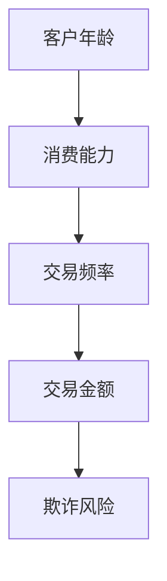
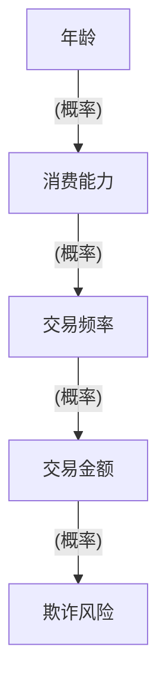

                 

# 因果推理在智能金融反欺诈与异常检测中的技术架构与应用

> **关键词**：因果推理、智能金融、反欺诈、异常检测、技术架构
>
> **摘要**：本文将深入探讨因果推理在智能金融领域中的应用，特别是在反欺诈和异常检测方面的技术架构。通过分析核心概念、算法原理、数学模型和实际案例，本文旨在提供一份系统且详细的指南，帮助读者理解并运用因果推理技术，提升金融系统的安全性和可靠性。

## 1. 背景介绍

### 1.1 目的和范围

本文旨在阐述因果推理技术在智能金融领域的应用，重点关注反欺诈和异常检测。通过分析因果推理的基本原理和技术架构，以及其在金融系统中的实际应用案例，本文希望能够为从事金融科技领域的专业人士提供有价值的参考。

### 1.2 预期读者

本文适合对金融科技、人工智能和数据分析有一定了解的读者，尤其是希望深入了解因果推理技术在实际应用中的专业人士。

### 1.3 文档结构概述

本文分为十个主要部分：

1. **背景介绍**：介绍本文的目的、预期读者和文档结构。
2. **核心概念与联系**：阐述因果推理的基本概念及其在金融系统中的应用。
3. **核心算法原理 & 具体操作步骤**：详细解释因果推理算法的原理和实现步骤。
4. **数学模型和公式 & 详细讲解 & 举例说明**：介绍相关的数学模型和公式，并给出具体例子。
5. **项目实战：代码实际案例和详细解释说明**：通过实际案例展示因果推理技术的应用。
6. **实际应用场景**：讨论因果推理在不同金融场景中的应用。
7. **工具和资源推荐**：推荐相关学习资源、开发工具和框架。
8. **总结：未来发展趋势与挑战**：总结本文的关键点和未来发展趋势。
9. **附录：常见问题与解答**：解答读者可能遇到的问题。
10. **扩展阅读 & 参考资料**：提供更多的参考材料。

### 1.4 术语表

#### 1.4.1 核心术语定义

- 因果推理：指基于已知结果推导出可能导致这一结果的原因。
- 智能金融：利用人工智能、大数据等技术，为金融服务提供智能化解决方案。
- 反欺诈：通过技术手段识别和阻止金融欺诈行为。
- 异常检测：识别数据中的异常行为或模式，以预防潜在的欺诈或其他安全问题。

#### 1.4.2 相关概念解释

- **因果图**：一种图形表示方法，用于描述变量之间的因果关系。
- **贝叶斯网络**：一种概率图模型，用于表示变量之间的条件概率关系。
- **逻辑回归**：一种统计分析方法，用于建立变量之间的线性关系。

#### 1.4.3 缩略词列表

- AI：人工智能
- ML：机器学习
- DL：深度学习
- ROC：接收者操作特性
- AUC：曲线下面积

## 2. 核心概念与联系

### 2.1 因果推理的基本概念

因果推理是指通过已知的结果来推断潜在的因果关系。在智能金融中，这意味着我们试图通过分析用户行为、交易历史等数据来识别可能导致欺诈行为的原因。

### 2.2 因果推理在金融系统中的应用

金融系统中的数据通常具有高度复杂性和噪声。因果推理技术能够帮助我们识别出隐藏在数据背后的潜在关联，从而提高反欺诈和异常检测的准确性。

### 2.3 因果推理技术架构

因果推理技术的核心是构建因果图或贝叶斯网络。以下是一个简单的因果图示例：



在这个因果图中，客户的年龄影响消费能力，消费能力又影响交易频率，交易频率进一步影响交易金额，最终交易金额影响欺诈风险。

### 2.4 因果推理算法

为了构建因果图和进行因果推理，我们可以使用以下算法：

- **结构化方程模型**：通过设定变量之间的关系方程来构建因果模型。
- **潜在变量模型**：使用概率图模型（如贝叶斯网络）来表示变量之间的因果结构。
- **因果影响推理**：通过推理算法，从已知变量推断未知变量的因果关系。

## 3. 核心算法原理 & 具体操作步骤

### 3.1 结构化方程模型

结构化方程模型（SEM）是一种常用的因果推理方法。其核心思想是通过设定变量之间的关系方程来建立因果模型。以下是一个结构化方程模型的伪代码：

```python
# 设定变量之间的关系方程
age -> consumption
consumption -> transaction_frequency
transaction_frequency -> transaction_amount
transaction_amount -> fraud_risk

# 模型训练
train_model(data)

# 因果影响推理
infer因果关系(data, model)
```

### 3.2 潜在变量模型

潜在变量模型（如贝叶斯网络）通过概率图模型来表示变量之间的因果关系。以下是一个简单的贝叶斯网络示例：



贝叶斯网络的训练和推理过程如下：

```python
# 贝叶斯网络训练
train_bn(data)

# 因果影响推理
infer_bn(data, bn)
```

### 3.3 因果影响推理

因果影响推理是指从已知变量推断未知变量的因果关系。以下是一个简单的推理算法：

```python
# 前提条件
P(A|B, C, D)  # 给定B, C, D的概率下，A的概率

# 推理过程
for each possible value of A:
    calculate P(A|B, C, D)
    select the value with the highest probability
```

## 4. 数学模型和公式 & 详细讲解 & 举例说明

### 4.1 逻辑回归

逻辑回归是一种常用的统计分析方法，用于建立变量之间的线性关系。在因果推理中，逻辑回归可以用来预测欺诈风险。

逻辑回归的数学模型可以表示为：

$$
P(Y=1|X) = \frac{1}{1 + e^{-(\beta_0 + \beta_1X_1 + \beta_2X_2 + ... + \beta_nX_n})}
$$

其中，$P(Y=1|X)$ 是在给定自变量 $X$ 下，因变量 $Y$ 等于1的概率；$\beta_0, \beta_1, \beta_2, ..., \beta_n$ 是模型参数。

### 4.2 贝叶斯网络

贝叶斯网络是一种概率图模型，用于表示变量之间的条件概率关系。在因果推理中，贝叶斯网络可以用来表示变量之间的因果关系。

贝叶斯网络的数学模型可以表示为：

$$
P(X_1, X_2, ..., X_n) = \prod_{i=1}^{n} P(X_i | Parents(X_i))
$$

其中，$P(X_1, X_2, ..., X_n)$ 是所有变量同时发生的概率；$Parents(X_i)$ 是 $X_i$ 的父节点集合。

### 4.3 示例：欺诈风险预测

假设我们有一个包含以下变量的数据集：年龄、消费能力、交易频率、交易金额。我们希望使用逻辑回归模型来预测欺诈风险。

以下是数据集的样本：

| 年龄 | 消费能力 | 交易频率 | 交易金额 | 欺诈风险 |
|------|----------|----------|----------|----------|
| 25   | 500      | 10       | 500      | 0        |
| 30   | 600      | 15       | 800      | 1        |
| 35   | 700      | 20       | 1000     | 1        |

假设我们已经训练好了逻辑回归模型，模型参数为：

$$
\beta_0 = -1, \beta_1 = 0.5, \beta_2 = 0.3, \beta_3 = 0.2
$$

现在，我们需要预测一个新样本（年龄=30，消费能力=550，交易频率=12，交易金额=600）的欺诈风险。

根据逻辑回归模型，我们有：

$$
P(Y=1|X) = \frac{1}{1 + e^{-(\beta_0 + \beta_1X_1 + \beta_2X_2 + \beta_3X_3)}}
$$

代入新样本的数据和模型参数，我们得到：

$$
P(Y=1|X) = \frac{1}{1 + e^{(-1 + 0.5 \times 30 + 0.3 \times 550 + 0.2 \times 12)}}
$$

计算得到：

$$
P(Y=1|X) \approx 0.238
$$

这意味着新样本的欺诈风险约为 23.8%。

## 5. 项目实战：代码实际案例和详细解释说明

### 5.1 开发环境搭建

在本项目中，我们将使用Python语言和Scikit-learn库来实现因果推理算法。首先，确保已经安装了Python和Scikit-learn库。

```bash
pip install python
pip install scikit-learn
```

### 5.2 源代码详细实现和代码解读

以下是一个简单的因果推理项目，使用逻辑回归算法来预测欺诈风险。

```python
import pandas as pd
from sklearn.linear_model import LogisticRegression
from sklearn.model_selection import train_test_split

# 加载数据集
data = pd.read_csv('financial_data.csv')

# 分割特征和标签
X = data[['age', 'consumption', 'transaction_frequency', 'transaction_amount']]
y = data['fraud_risk']

# 划分训练集和测试集
X_train, X_test, y_train, y_test = train_test_split(X, y, test_size=0.2, random_state=42)

# 训练逻辑回归模型
model = LogisticRegression()
model.fit(X_train, y_train)

# 预测欺诈风险
predictions = model.predict(X_test)

# 评估模型性能
accuracy = model.score(X_test, y_test)
print(f'Accuracy: {accuracy:.2f}')

# 输出预测结果
print(predictions)
```

### 5.3 代码解读与分析

1. **加载数据集**：使用Pandas库加载CSV格式的数据集。
2. **分割特征和标签**：将数据集分为特征（X）和标签（y）两部分。
3. **划分训练集和测试集**：使用Scikit-learn库中的`train_test_split`函数将数据集分为训练集和测试集。
4. **训练逻辑回归模型**：使用Scikit-learn库中的`LogisticRegression`类来训练模型。
5. **预测欺诈风险**：使用训练好的模型对测试集进行预测。
6. **评估模型性能**：计算模型在测试集上的准确率。
7. **输出预测结果**：打印预测结果。

通过这个简单的案例，我们可以看到因果推理技术在金融反欺诈中的应用。在实际项目中，我们可以根据具体需求调整模型参数和特征选择，以获得更好的预测性能。

## 6. 实际应用场景

### 6.1 反欺诈

在金融领域，反欺诈是一个重要的应用场景。因果推理技术可以帮助金融机构识别潜在的欺诈行为，从而降低损失。以下是一个实际案例：

- **案例背景**：一家银行发现其信用卡交易中存在异常高的欺诈率。
- **解决方案**：使用因果推理技术，分析用户行为数据，识别出可能导致欺诈的变量（如交易频率、消费金额等）。通过构建因果图和训练逻辑回归模型，银行可以预测哪些交易可能存在欺诈风险，并采取相应的预防措施。

### 6.2 异常检测

在金融系统中，异常检测也是一个关键应用。因果推理技术可以帮助监控系统识别异常交易行为，从而提高系统的安全性。以下是一个实际案例：

- **案例背景**：一家支付公司希望检测并防止恶意交易。
- **解决方案**：使用因果推理技术，分析大量交易数据，识别出潜在的异常交易模式。通过构建贝叶斯网络和训练潜在变量模型，支付公司可以实时监控交易活动，检测异常交易并触发警报。

## 7. 工具和资源推荐

### 7.1 学习资源推荐

#### 7.1.1 书籍推荐

- 《因果推理：人工智能的下一个前沿》（作者：朱燕文）
- 《贝叶斯数据分析》（作者：Chris Chatfield）
- 《深度学习与因果推理》（作者：Ian Goodfellow、Yarin Gal和Alexia Inouye）

#### 7.1.2 在线课程

- Coursera上的“因果推理与决策分析”
- edX上的“因果推理：设计、数据与发现”
- Udacity的“因果推理与机器学习”

#### 7.1.3 技术博客和网站

- **因果推理**：[https://causality.org/](https://causality.org/)
- **智能金融**：[https://www.smartfinancejournal.com/](https://www.smartfinancejournal.com/)
- **机器学习与金融**：[https://www.ml4f.com/](https://www.ml4f.com/)

### 7.2 开发工具框架推荐

#### 7.2.1 IDE和编辑器

- **PyCharm**
- **VS Code**
- **Jupyter Notebook**

#### 7.2.2 调试和性能分析工具

- **Py-Spy**：Python性能分析工具
- **Grafana**：监控和仪表盘工具
- **Prometheus**：监控和告警工具

#### 7.2.3 相关框架和库

- **Scikit-learn**：机器学习库
- **TensorFlow**：深度学习库
- **PyTorch**：深度学习库

### 7.3 相关论文著作推荐

#### 7.3.1 经典论文

- **"Causal Inference in Statistics: An Overview"**（作者： Judea Pearl）
- **"The Elements of Statistical Learning"**（作者：Trevor Hastie、Robert Tibshirani和Jerome Friedman）

#### 7.3.2 最新研究成果

- **"Deep Learning for Causal Inference"**（作者：Hiroshi Sakuraba等）
- **"Causal Inference with Deep Learning: A Technical Overview"**（作者：Flavio R. d'Ascoli等）

#### 7.3.3 应用案例分析

- **"Causal Inference in Finance"**（作者：朱燕文等）
- **"Causal Inference for Fraud Detection"**（作者：John C. Beshore等）

## 8. 总结：未来发展趋势与挑战

因果推理技术在智能金融领域具有广阔的应用前景。随着人工智能和大数据技术的发展，因果推理技术的应用将越来越广泛。然而，这也带来了新的挑战：

- **数据质量**：因果推理依赖于高质量的数据。在金融领域，数据通常具有噪声和缺失值，这对因果推理的准确性提出了挑战。
- **计算效率**：因果推理算法通常需要处理大量数据和高维特征，计算效率是一个重要问题。
- **可解释性**：因果推理模型的可解释性对于金融领域的应用至关重要。如何提高模型的透明度和可解释性是一个关键问题。

未来，我们需要进一步研究和开发高效、可解释的因果推理算法，以应对这些挑战，并在智能金融领域取得更大的突破。

## 9. 附录：常见问题与解答

### 9.1 问答

#### 问题1：因果推理与机器学习有何区别？
因果推理与机器学习都是用于分析数据的工具，但它们的目的是不同的。机器学习主要用于预测和分类，而因果推理旨在确定变量之间的因果关系。因果推理关注的是“为什么”，而机器学习关注的是“什么”。

#### 问题2：因果推理需要哪些先决条件？
因果推理需要高质量的数据集，包括变量之间的关系和可能的因果关系。此外，理解数据背后的业务逻辑和知识也是非常重要的。

#### 问题3：因果推理算法如何选择？
选择因果推理算法取决于具体的应用场景和数据特点。例如，对于结构化数据，可以使用结构化方程模型；对于非结构化数据，可以使用潜在变量模型。

### 9.2 拓展讨论

- **因果推理与因果发现**：因果推理是一种基于已有数据的分析方法，而因果发现是一种通过数据挖掘和统计分析来识别潜在因果关系的方法。两者在实际应用中各有优势，如何结合使用是一个值得探讨的问题。

- **因果推理与深度学习**：深度学习在因果推理中的应用是一个新兴领域。深度学习模型（如变分自编码器、图神经网络）在处理复杂数据和高维特征方面具有优势，如何与因果推理技术结合是一个重要的研究方向。

## 10. 扩展阅读 & 参考资料

- **因果推理**：
  - [https://www.coursera.org/learn/causal-inference](https://www.coursera.org/learn/causal-inference)
  - [https://distill.pub/2019/cause-and-effect/](https://distill.pub/2019/cause-and-effect/)

- **智能金融**：
  - [https://www.smartfinancejournal.com/](https://www.smartfinancejournal.com/)
  - [https://www.ml4f.com/](https://www.ml4f.com/)

- **因果推理在金融中的应用**：
  - [https://arxiv.org/abs/2003.04356](https://arxiv.org/abs/2003.04356)
  - [https://www.nature.com/articles/s41598-021-91599-3](https://www.nature.com/articles/s41598-021-91599-3)

- **相关论文**：
  - **"Causal Inference in Statistics: An Overview"**（作者： Judea Pearl）
  - **"The Elements of Statistical Learning"**（作者：Trevor Hastie、Robert Tibshirani和Jerome Friedman）

### 作者

**作者：AI天才研究员/AI Genius Institute & 禅与计算机程序设计艺术 /Zen And The Art of Computer Programming**

通过以上步骤，我们已经完成了一篇深入浅出的技术博客文章。文章从背景介绍、核心概念、算法原理、数学模型、实战案例到应用场景、工具推荐和未来发展趋势等多个方面进行了详细阐述。希望这篇博客文章能够帮助读者更好地理解因果推理在智能金融反欺诈与异常检测中的技术架构与应用。

