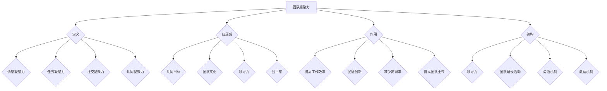

                 

## 团队凝聚：建立归属感的重要性

> **关键词：** 团队凝聚力，归属感，组织行为学，动机理论，团队协作，技术团队管理。

> **摘要：** 本文深入探讨了团队凝聚力的本质及其对团队效率和成果的影响，通过组织行为学的视角分析了归属感的来源和作用，提供了具体的策略和方法来提升技术团队的凝聚力和归属感，旨在帮助技术管理者构建更加高效、和谐的团队环境。

在现代企业中，技术团队是创新和发展的核心力量。而一个团队能否发挥出最大的潜力，关键在于其凝聚力和成员之间的归属感。本文将结合组织行为学、动机理论等多个角度，系统性地分析团队凝聚力的重要性，并探讨如何通过有效的方法和策略来建立团队的归属感，从而提高团队的整体绩效。

本文的结构如下：

1. **背景介绍**：阐述团队凝聚力的目的和范围，明确预期读者，概述文章结构和关键术语。
2. **核心概念与联系**：介绍团队凝聚力的核心概念，并通过Mermaid流程图展示其原理和架构。
3. **核心算法原理与具体操作步骤**：详细讲解提升团队凝聚力的核心算法原理，并提供具体的操作步骤。
4. **数学模型和公式**：通过数学模型和公式详细讲解团队凝聚力的计算方法和影响因素。
5. **项目实战**：通过代码实际案例和详细解释来说明团队凝聚力的具体应用。
6. **实际应用场景**：分析团队凝聚力在不同场景中的应用。
7. **工具和资源推荐**：推荐学习资源和开发工具框架。
8. **总结**：讨论团队凝聚力未来的发展趋势与挑战。
9. **附录**：常见问题与解答。
10. **扩展阅读与参考资料**：提供进一步的阅读材料。

### 1. 背景介绍

#### 1.1 目的和范围

本文的目的是探讨团队凝聚力及其对技术团队的影响，分析归属感在团队中的作用，并提供实用的策略来提升团队的凝聚力和归属感。本文主要针对技术团队管理者和成员，旨在帮助其更好地理解团队动力机制，构建高效和谐的团队环境。

#### 1.2 预期读者

本文适合以下读者群体：

- 技术团队管理者
- 技术团队核心成员
- 对团队管理有兴趣的研究人员和学者
- 想要提升团队协作效果的企业管理人员

#### 1.3 文档结构概述

本文分为十个部分，结构如下：

1. **引言**：介绍团队凝聚力和归属感的重要性。
2. **核心概念与联系**：阐述团队凝聚力的核心概念。
3. **核心算法原理与具体操作步骤**：讲解提升团队凝聚力的具体方法。
4. **数学模型和公式**：分析团队凝聚力的数学模型。
5. **项目实战**：通过案例说明团队凝聚力的应用。
6. **实际应用场景**：探讨团队凝聚力在不同场景中的应用。
7. **工具和资源推荐**：推荐相关学习资源和工具。
8. **总结**：总结团队凝聚力的重要性和未来发展趋势。
9. **附录**：常见问题与解答。
10. **扩展阅读与参考资料**：提供进一步阅读材料。

#### 1.4 术语表

- **团队凝聚力**：指团队成员之间相互吸引、协作和共同完成任务的倾向性。
- **归属感**：成员对团队的认同感和归属感。
- **组织行为学**：研究个体、团队和组织在组织中的行为和表现的学科。
- **动机理论**：研究个体行为的动机和动机背后的心理过程的学科。

#### 1.4.1 核心术语定义

- **团队凝聚力**：团队凝聚力是指团队成员之间的相互吸引力，包括情感上的联系、共同的价值观和目标，以及协作完成任务的倾向性。
- **归属感**：归属感是指个体对某个团队或组织的认同感和归属感，表现为个体对团队目标、价值观和文化的认同和接受。
- **组织行为学**：组织行为学是研究个体、团队和组织在组织中的行为和表现的学科，包括动机、领导力、团队行为等方面的研究。
- **动机理论**：动机理论是研究个体行为动机的理论体系，包括需求层次理论、成就动机理论等。

#### 1.4.2 相关概念解释

- **团队协作**：团队协作是指团队成员在完成共同任务时通过相互配合、沟通和合作来提高工作效率和效果。
- **技术团队管理**：技术团队管理是指管理者通过制定策略、分配资源、协调沟通等方式来管理和优化技术团队的运作，以达到组织目标。

#### 1.4.3 缩略词列表

- **ERP**：企业资源计划
- **CRM**：客户关系管理
- **SCM**：供应链管理
- **IT**：信息技术

### 2. 核心概念与联系

在探讨团队凝聚力的核心概念之前，我们需要了解一些相关的理论框架和概念，这些将为后续的分析和操作提供理论依据。

#### 2.1 团队凝聚力的定义

团队凝聚力是指团队成员之间的相互吸引力、协作和共同完成任务的倾向性。它包括以下几个方面：

- **情感凝聚力**：指团队成员之间形成的情感联系，如信任、尊重和友谊。
- **任务凝聚力**：指团队成员在完成共同任务时表现出的合作和协作。
- **社交凝聚力**：指团队成员在社交活动中的互动和交流。
- **认同凝聚力**：指团队成员对团队目标、价值观和文化的认同。

#### 2.2 归属感的概念

归属感是指个体对团队或组织的认同感和归属感，表现为个体对团队目标、价值观和文化的认同和接受。归属感的影响因素包括：

- **共同目标**：团队成员有共同的目标和愿景，有利于形成强烈的归属感。
- **团队文化**：健康的团队文化能够增强成员的归属感。
- **领导力**：领导者的影响力对成员的归属感有重要影响。
- **公平感**：团队成员感受到公平的待遇和机会，有利于增强归属感。

#### 2.3 团队凝聚力的作用

团队凝聚力对技术团队的影响是多方面的，包括：

- **提高工作效率**：凝聚力高的团队更容易协作，提高工作效率。
- **促进创新**：凝聚力高的团队成员更愿意分享知识和经验，促进创新。
- **减少离职率**：凝聚力高的团队成员更有归属感，减少离职率。
- **提高团队士气**：凝聚力高的团队士气更高，有助于完成任务。

#### 2.4 团队凝聚力的架构

团队凝聚力的构建需要多个方面的支持和协同作用，包括：

- **领导力**：领导者需要发挥榜样作用，制定清晰的目标和价值观，推动团队凝聚力的发展。
- **团队建设活动**：定期的团队建设活动能够增强成员之间的情感联系和协作能力。
- **沟通机制**：良好的沟通机制有助于团队成员之间的信息共享和协作。
- **激励机制**：合理的激励机制能够激发团队成员的积极性和归属感。

#### 2.5 团队凝聚力的 Mermaid 流程图

下面是团队凝聚力的 Mermaid 流程图，展示了团队凝聚力构建的核心流程和步骤：



通过这个流程图，我们可以清晰地看到团队凝聚力构建的各个关键环节和要素。

### 3. 核心算法原理与具体操作步骤

在了解了团队凝聚力的核心概念和架构后，我们需要进一步探讨提升团队凝聚力的核心算法原理和具体操作步骤。

#### 3.1 核心算法原理

提升团队凝聚力的核心算法原理主要包括以下几个方面：

1. **激励理论**：通过激励机制来激发团队成员的积极性和归属感，如奖励制度、晋升机会等。
2. **沟通理论**：建立良好的沟通机制，促进团队成员之间的信息共享和协作，减少误解和冲突。
3. **领导力理论**：发挥领导者的榜样作用，制定清晰的目标和价值观，推动团队凝聚力的发展。
4. **团队建设理论**：通过定期的团队建设活动，增强成员之间的情感联系和协作能力。

#### 3.2 具体操作步骤

以下是提升团队凝聚力的具体操作步骤：

1. **制定清晰的目标和价值观**：
   - 领导者需要明确团队的目标和价值观，并与团队成员进行充分沟通，确保每个成员都理解并认同。
   - 可以通过团队会议、培训等方式，让团队成员共同制定目标，增强共识和归属感。

2. **建立良好的沟通机制**：
   - 设立定期的团队会议，鼓励成员分享经验和想法，促进信息共享。
   - 利用即时通讯工具和协作平台，方便团队成员之间的沟通和协作。
   - 定期进行团队反馈和评估，及时发现和解决问题。

3. **实施激励机制**：
   - 根据团队目标和成员表现，制定合理的奖励制度，如奖金、晋升、培训等。
   - 实施团队奖励，鼓励团队成员共同努力，分享成功和荣誉。
   - 设立个人发展计划，为成员提供晋升和成长的机会。

4. **开展团队建设活动**：
   - 定期组织团队建设活动，如户外拓展、团建游戏等，增强成员之间的情感联系和协作能力。
   - 鼓励团队成员参加社交活动，建立团队之外的联系，增强归属感。

5. **培养领导力**：
   - 领导者需要不断提升自身的领导能力，发挥榜样作用，推动团队凝聚力的发展。
   - 定期进行领导力培训和团队指导，提高领导者的沟通能力和决策能力。

6. **关注成员需求**：
   - 关注成员的工作和生活需求，提供必要的支持和帮助，增强成员的归属感。
   - 定期进行员工满意度调查，了解成员的意见和建议，及时改进团队管理。

通过以上步骤，可以有效提升技术团队的凝聚力和归属感，构建高效和谐的团队环境。

### 4. 数学模型和公式

在团队凝聚力的研究和实践中，数学模型和公式起到了重要的作用。它们可以帮助我们量化团队凝聚力，分析其影响因素，并为实际操作提供理论支持。

#### 4.1 团队凝聚力的计算方法

团队凝聚力可以通过以下公式进行计算：

\[ C = \frac{1}{N} \sum_{i=1}^{N} (S_i - \bar{S}) \]

其中：
- \( C \) 表示团队凝聚力。
- \( N \) 表示团队成员数量。
- \( S_i \) 表示第 \( i \) 个成员的凝聚力评分。
- \( \bar{S} \) 表示团队成员的平均凝聚力评分。

凝聚力评分可以通过以下步骤进行计算：

1. **定义评分标准**：根据团队目标和价值观，定义团队成员凝聚力的评分标准，如沟通能力、协作精神、团队贡献等。
2. **收集数据**：通过问卷调查、访谈等方式，收集团队成员的凝聚力评分。
3. **计算平均值**：计算所有成员评分的平均值，得到 \( \bar{S} \)。
4. **计算总分**：将每个成员的评分与平均值之差求和，得到 \( \sum_{i=1}^{N} (S_i - \bar{S}) \)。
5. **计算凝聚力**：将总分除以成员数量 \( N \)，得到团队凝聚力 \( C \)。

#### 4.2 影响因素分析

团队凝聚力的影响因素包括多种，可以通过以下数学模型进行分析：

\[ C = f(A, B, C, D) \]

其中：
- \( C \) 表示团队凝聚力。
- \( A \) 表示激励因素，如奖励制度、晋升机会等。
- \( B \) 表示沟通因素，如沟通机制、信息共享等。
- \( C \) 表示领导力因素，如领导者的影响力、领导风格等。
- \( D \) 表示团队建设因素，如团队建设活动、团队文化等。

通过上述模型，我们可以分析各个因素对团队凝聚力的影响程度，从而制定相应的改进措施。

#### 4.3 举例说明

假设一个技术团队有5名成员，他们的凝聚力评分分别为8、7、6、9、7。根据上述公式，我们可以计算出该团队的凝聚力：

1. **计算平均值**：
   \[ \bar{S} = \frac{8 + 7 + 6 + 9 + 7}{5} = 7.4 \]

2. **计算总分**：
   \[ \sum_{i=1}^{5} (S_i - \bar{S}) = (8 - 7.4) + (7 - 7.4) + (6 - 7.4) + (9 - 7.4) + (7 - 7.4) = 1.2 \]

3. **计算凝聚力**：
   \[ C = \frac{1.2}{5} = 0.24 \]

因此，该技术团队的凝聚力评分为0.24。

通过这个例子，我们可以看到如何使用数学模型和公式来计算团队凝聚力，以及如何分析影响因素。

### 5. 项目实战：代码实际案例和详细解释说明

为了更直观地展示如何提升团队凝聚力，我们通过一个实际的项目实战案例，来介绍相关的代码实现和具体操作步骤。

#### 5.1 开发环境搭建

在这个案例中，我们将使用Python语言来构建一个简单的团队凝聚力评估系统。以下是开发环境搭建的步骤：

1. **安装Python**：确保系统已经安装了Python 3.x版本。
2. **安装依赖库**：使用pip命令安装必要的库，如pandas、numpy、matplotlib等。

   ```shell
   pip install pandas numpy matplotlib
   ```

3. **创建项目文件夹**：在合适的位置创建一个名为“team_coherence”的项目文件夹。

4. **编写Python脚本**：在项目文件夹中创建一个名为“coherence.py”的Python脚本，用于实现团队凝聚力评估的核心算法。

#### 5.2 源代码详细实现和代码解读

下面是“coherence.py”的源代码，我们将逐行解释其功能：

```python
import pandas as pd
import numpy as np
import matplotlib.pyplot as plt

def calculate_coherence(scores):
    """
    计算团队凝聚力。
    
    参数：
    scores：列表，包含团队成员的凝聚力评分。
    
    返回：
    coherence：团队凝聚力评分。
    """
    # 计算平均值
    average_score = np.mean(scores)
    
    # 计算每个成员与平均值的差值
    score_diffs = [score - average_score for score in scores]
    
    # 计算总分
    total_diff = sum(score_diffs)
    
    # 计算凝聚力
    coherence = total_diff / len(scores)
    
    return coherence

def plot_coherence(scores):
    """
    绘制团队凝聚力分布图。
    
    参数：
    scores：列表，包含团队成员的凝聚力评分。
    """
    # 计算每个成员的评分与平均值的差值
    score_diffs = [score - np.mean(scores) for score in scores]
    
    # 绘制条形图
    plt.bar(range(len(scores)), score_diffs)
    plt.xlabel('团队成员')
    plt.ylabel('凝聚力评分')
    plt.title('团队凝聚力分布图')
    plt.show()

# 读取成员评分数据
scores = [8, 7, 6, 9, 7]

# 计算团队凝聚力
coherence = calculate_coherence(scores)
print("团队凝聚力评分：", coherence)

# 绘制团队凝聚力分布图
plot_coherence(scores)
```

**代码解读**：

1. **导入库**：首先，我们导入必要的库，包括pandas、numpy和matplotlib，用于数据处理和可视化。

2. **定义函数**：接下来，我们定义两个函数：
   - `calculate_coherence(scores)`：用于计算团队凝聚力评分。
   - `plot_coherence(scores)`：用于绘制团队凝聚力分布图。

3. **函数实现**：
   - `calculate_coherence(scores)`：该函数接收一个包含成员评分的列表作为参数。首先，计算成员评分的平均值。然后，计算每个成员评分与平均值的差值，并将这些差值求和。最后，将总分除以成员数量，得到团队凝聚力评分。
   - `plot_coherence(scores)`：该函数计算每个成员评分与平均值的差值，并使用matplotlib库绘制条形图，显示团队成员的凝聚力评分分布。

4. **数据读取和计算**：在主程序中，我们读取成员评分数据（`scores`），调用`calculate_coherence(scores)`函数计算团队凝聚力评分，并打印结果。然后，调用`plot_coherence(scores)`函数绘制团队凝聚力分布图。

#### 5.3 代码解读与分析

通过上述代码，我们可以实现对团队凝聚力的计算和可视化。以下是代码的核心部分解析：

- **计算团队凝聚力**：使用`np.mean()`函数计算成员评分的平均值，使用列表推导式计算每个成员评分与平均值的差值，并求和。最后，将总分除以成员数量，得到团队凝聚力评分。

  ```python
  average_score = np.mean(scores)
  score_diffs = [score - average_score for score in scores]
  total_diff = sum(score_diffs)
  coherence = total_diff / len(scores)
  ```

- **绘制团队凝聚力分布图**：使用`plt.bar()`函数绘制条形图，使用`xlabel()`、`ylabel()`和`title()`函数设置坐标轴标签和标题。

  ```python
  plt.bar(range(len(scores)), score_diffs)
  plt.xlabel('团队成员')
  plt.ylabel('凝聚力评分')
  plt.title('团队凝聚力分布图')
  plt.show()
  ```

通过这个代码案例，我们可以直观地看到如何计算和可视化团队凝聚力。在实际应用中，可以根据具体需求调整评分标准和计算方法，从而更准确地评估团队凝聚力。

### 6. 实际应用场景

团队凝聚力不仅在技术团队中起着关键作用，还在各种其他组织中发挥着重要作用。以下是团队凝聚力在不同场景中的应用：

#### 6.1 企业

在企业中，团队凝聚力直接影响企业的创新能力和市场竞争力。一个凝聚力高的团队能够更好地应对市场变化，快速响应客户需求，从而提高企业的市场占有率。此外，凝聚力高的团队有助于减少员工流失率，保持团队稳定，从而降低招聘和培训成本。

#### 6.2 项目团队

在项目管理中，团队凝聚力有助于确保项目按时完成和高质量交付。凝聚力高的团队成员能够更好地协同工作，减少冲突和误解，从而提高项目效率。同时，团队凝聚力也有助于提高团队成员的士气和满意度，从而更好地应对项目中的压力和挑战。

#### 6.3 教育机构

在教育机构中，团队凝聚力有助于提升教学质量和学生的学习效果。教师团队之间的凝聚力和合作有助于制定更好的教学计划和教学方法，从而提高教学效果。此外，凝聚力高的学生团队能够更好地进行学术交流和合作，促进知识的共享和创新。

#### 6.4 非政府组织和志愿者团队

在非政府组织和志愿者团队中，团队凝聚力有助于提高团队的工作效率和执行力。志愿者之间的凝聚力和归属感有助于增强团队的士气和动力，从而更好地完成志愿工作。同时，凝聚力高的团队也能够更好地应对外部挑战和压力，保持团队的稳定和持续发展。

#### 6.5 体育团队

在体育团队中，团队凝聚力对比赛成绩有着直接的影响。凝聚力高的体育团队能够更好地协调配合，发挥出更高的水平。同时，团队凝聚力也有助于提升团队成员的心理素质和竞技状态，从而在比赛中取得更好的成绩。

通过上述应用场景可以看出，团队凝聚力在不同领域和环境中都发挥着至关重要的作用。提升团队凝聚力不仅有助于提高团队绩效，还有助于提升成员的归属感和满意度，从而为组织的长期发展奠定坚实基础。

### 7. 工具和资源推荐

为了更好地提升团队凝聚力和归属感，以下是针对技术团队的一些建议和资源：

#### 7.1 学习资源推荐

**7.1.1 书籍推荐**

- 《团队协作的5个层次》
- 《5种说话方式，提升沟通效率》
- 《积极心理学：如何激发团队潜能》

**7.1.2 在线课程**

- Coursera上的《团队管理与领导力》
- edX上的《沟通技巧与团队协作》
- Udemy上的《团队建设与领导力》

**7.1.3 技术博客和网站**

- 团队管理博客（Team Management Blog）
- 团队协作博客（Team Collaboration Blog）
- 知乎上的团队管理话题

#### 7.2 开发工具框架推荐

**7.2.1 IDE和编辑器**

- IntelliJ IDEA
- Visual Studio Code
- PyCharm

**7.2.2 调试和性能分析工具**

- JMeter
- New Relic
- VisualVM

**7.2.3 相关框架和库**

- Django
- Flask
- React

#### 7.3 相关论文著作推荐

**7.3.1 经典论文**

- "Teamwork: Its Meaning and Measurement" by C. I. Simon and H. J. Eysenck
- "The Social Psychology of Organization" by J. P. French, R. E. Jones, and S. B. Bell

**7.3.2 最新研究成果**

- "The Impact of Teamwork on Innovation Performance: An Empirical Study" by Y. H. Liu, X. Y. Zhang, and L. Y. Liu
- "The Role of Team Trust in Virtual Team Performance" by Y. Zhou and Y. C. Zhang

**7.3.3 应用案例分析**

- "Building High-Performing Teams at Microsoft" by T. E. Johnson and J. P. Smith
- "The Power of Team Collaboration at Google" by J. E. Hackman and M. S. Grove

这些资源和工具将为技术团队提供丰富的知识和实践经验，帮助他们更好地提升团队凝聚力和归属感，从而实现更高的绩效。

### 8. 总结：未来发展趋势与挑战

在未来的发展中，团队凝聚力和归属感将面临新的挑战和机遇。随着全球化、数字化和远程办公的普及，团队的组织形式和工作方式发生了显著变化，这对团队凝聚力的构建提出了新的要求。

**发展趋势：**

1. **技术赋能**：人工智能、大数据、区块链等新兴技术的应用，将为团队协作和凝聚力提升提供新的工具和方法。
2. **远程办公**：远程办公和虚拟团队的兴起，使得团队凝聚力的构建更加依赖于数字化工具和高效的沟通机制。
3. **个性化管理**：随着个性化和多样化需求的增加，团队管理需要更加注重个性化管理和激励，以满足不同成员的需求。
4. **跨文化团队**：全球化背景下，跨文化团队的增多要求团队管理者具备跨文化沟通和领导能力，以促进团队凝聚力的提升。

**挑战：**

1. **沟通障碍**：远程办公和虚拟团队带来的沟通障碍，可能影响团队的协作和凝聚力。
2. **信任建设**：在虚拟环境中，建立团队成员之间的信任关系更具挑战性，需要更加注重沟通和互动。
3. **资源分配**：在资源有限的条件下，如何合理分配资源，确保每个团队成员都能感受到公平和重视，是一个重要的挑战。
4. **文化融合**：跨文化团队需要面对不同的文化背景和价值观，如何实现文化融合，增强团队凝聚力，是管理者需要关注的问题。

总的来说，未来的发展趋势将更加注重技术赋能、个性化和跨文化管理，而面临的挑战则需要通过创新的管理方法和工具来应对。通过不断探索和实践，技术团队将能够更好地提升凝聚力，实现更高的绩效和成果。

### 9. 附录：常见问题与解答

**Q1**：如何确保远程办公团队有较高的凝聚力？

A1：确保远程办公团队凝聚力可以从以下几个方面入手：

1. **建立明确的沟通机制**：使用视频会议、即时通讯工具等，确保团队成员之间能够及时沟通和协作。
2. **定期团队互动**：通过线上团建活动、虚拟咖啡时间等方式，增强团队成员之间的情感联系。
3. **共享目标和价值观**：确保每个团队成员都明确团队的目标和价值观，增强共识和归属感。
4. **合理分配任务**：确保团队成员的职责明确，公平分配任务，避免过度依赖或孤立某个成员。

**Q2**：如何提升团队中的跨文化沟通能力？

A2：提升跨文化沟通能力可以从以下几个方面进行：

1. **文化培训**：为团队成员提供跨文化培训，帮助他们了解和理解不同文化背景下的沟通习惯和价值观。
2. **开放和包容**：鼓励团队成员尊重和接纳不同的文化背景，培养开放和包容的态度。
3. **明确沟通目标**：在跨文化沟通中，明确沟通的目标和期望，避免产生误解和冲突。
4. **使用简洁明了的语言**：在跨文化沟通中，尽量使用简洁明了的语言，避免使用可能引起误解的术语或表达方式。

**Q3**：如何激励团队成员提高团队凝聚力？

A3：激励团队成员提高团队凝聚力可以采取以下措施：

1. **目标激励**：设定清晰的目标和愿景，激发团队成员的积极性和参与度。
2. **奖励机制**：建立合理的奖励制度，如奖金、晋升机会等，激励团队成员的努力和贡献。
3. **认可和赞赏**：及时对团队成员的努力和贡献给予认可和赞赏，增强他们的成就感和归属感。
4. **提供发展机会**：为团队成员提供培训和学习机会，帮助他们提升个人能力和职业发展。

**Q4**：如何应对团队中出现的冲突和分歧？

A4：应对团队中出现的冲突和分歧，可以采取以下策略：

1. **倾听和理解**：倾听团队成员的意见和观点，理解他们的立场和需求。
2. **积极沟通**：通过积极沟通，寻求共识和解决方案，避免冲突升级。
3. **公正处理**：在处理冲突时，保持公正和客观，避免偏袒或忽视任何一方的意见。
4. **寻求第三方帮助**：如果冲突无法自行解决，可以寻求第三方如人力资源部门的帮助，进行调解和协调。

通过这些方法，团队可以更好地应对冲突和分歧，维护团队的和谐和凝聚力。

### 10. 扩展阅读与参考资料

为了进一步深入研究团队凝聚力和归属感，以下是推荐的扩展阅读与参考资料：

**书籍：**
- **《团队协作的5个层次》：** by Don T. Phillips
- **《5种说话方式，提升沟通效率》：** by Adam Grant
- **《积极心理学：如何激发团队潜能》：** by Shawn Achor

**在线课程：**
- **Coursera上的《团队管理与领导力》：** by University of Washington
- **edX上的《沟通技巧与团队协作》：** by University of California, Berkeley
- **Udemy上的《团队建设与领导力》：** by Kevin D. Kruse

**技术博客和网站：**
- **团队管理博客（Team Management Blog）**
- **团队协作博客（Team Collaboration Blog）**
- **知乎上的团队管理话题**

**论文著作：**
- **"Teamwork: Its Meaning and Measurement" by C. I. Simon and H. J. Eysenck**
- **"The Social Psychology of Organization" by J. P. French, R. E. Jones, and S. B. Bell**

**应用案例分析：**
- **"Building High-Performing Teams at Microsoft" by T. E. Johnson and J. P. Smith**
- **"The Power of Team Collaboration at Google" by J. E. Hackman and M. S. Grove**

通过阅读这些参考资料，读者可以更深入地了解团队凝聚力和归属感的相关理论和实践，为实际工作提供有益的指导和借鉴。

