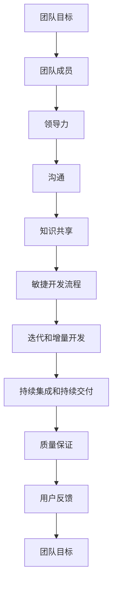

                 


# 团队协作的艺术：从个体到集体的蜕变

> **关键词：** 团队协作、敏捷开发、领导力、沟通、敏捷流程、知识共享。

> **摘要：** 本文深入探讨了团队协作的内涵、重要性以及实际应用，通过对敏捷开发、领导力、沟通和知识共享等方面的深入分析，为团队成员提供了从个体到集体蜕变的实用指南。

## 1. 背景介绍

### 1.1 目的和范围

在当今高度复杂和快速变化的技术环境中，团队协作已成为组织成功的关键因素。本文旨在探讨团队协作的艺术，分析其核心要素，并提供实用的方法和策略，帮助团队成员实现从个体到集体的蜕变。

本文将涵盖以下主题：

1. **敏捷开发与团队协作**：探讨敏捷开发模式对团队协作的影响。
2. **领导力与团队协作**：分析领导力在团队协作中的作用。
3. **沟通与知识共享**：讨论沟通和知识共享在团队协作中的重要性。
4. **实际应用场景**：提供具体的团队协作实例。
5. **工具和资源推荐**：介绍有助于团队协作的工具和资源。

### 1.2 预期读者

本文面向以下读者群体：

1. **项目经理和团队成员**：希望提高团队协作效率。
2. **软件开发者**：关注敏捷开发和团队协作的最佳实践。
3. **IT管理人员**：寻求改进团队协作策略。

### 1.3 文档结构概述

本文分为以下部分：

1. **背景介绍**：阐述团队协作的背景、目的和范围。
2. **核心概念与联系**：介绍团队协作的核心概念，使用Mermaid流程图展示。
3. **核心算法原理 & 具体操作步骤**：使用伪代码阐述团队协作的核心算法原理。
4. **数学模型和公式 & 详细讲解 & 举例说明**：详细讲解团队协作的数学模型和公式，并提供实例说明。
5. **项目实战：代码实际案例和详细解释说明**：提供具体的团队协作代码实例。
6. **实际应用场景**：分析团队协作在不同场景中的应用。
7. **工具和资源推荐**：推荐有助于团队协作的工具和资源。
8. **总结：未来发展趋势与挑战**：探讨团队协作的未来发展趋势和挑战。
9. **附录：常见问题与解答**：回答读者可能关心的问题。
10. **扩展阅读 & 参考资料**：提供相关的扩展阅读和参考资料。

### 1.4 术语表

#### 1.4.1 核心术语定义

- **团队协作**：团队成员为了共同的目标而协同工作的过程。
- **敏捷开发**：一种以迭代和增量方式进行的软件开发方法。
- **领导力**：领导者对团队成员的引导、激励和协调能力。
- **沟通**：信息在团队成员之间的传递和理解过程。
- **知识共享**：团队成员之间的知识和经验的交流与共享。

#### 1.4.2 相关概念解释

- **敏捷流程**：敏捷开发中的各种实践和流程，如Scrum、Kanban等。
- **知识管理**：组织内部知识的收集、存储、共享和利用。
- **团队建设**：通过各种活动和策略增强团队成员之间的信任和合作。

#### 1.4.3 缩略词列表

- **Scrum**：一种敏捷开发流程。
- **Kanban**：一种看板管理方法。
- **IDE**：集成开发环境。
- **CPU**：中央处理器。

## 2. 核心概念与联系

团队协作是一个复杂的过程，涉及多个核心概念和元素。以下使用Mermaid流程图展示团队协作的核心概念和联系：



### 2.1 团队协作的概念与联系

#### 2.1.1 团队目标

团队目标是团队协作的起点，也是团队成员共同努力的方向。团队目标应该清晰、具体、可量化，以确保所有成员都朝着同一方向努力。

#### 2.1.2 团队成员

团队成员是团队协作的核心，他们共同承担实现团队目标的责任。团队成员应该具备互补的技能和知识，以便在项目中发挥各自的优势。

#### 2.1.3 领导力

领导力是团队协作中至关重要的因素。领导者应该具备引导、激励和协调团队成员的能力，以确保团队目标的实现。

#### 2.1.4 沟通

沟通是团队协作的关键，它确保团队成员之间的信息传递和相互理解。有效的沟通可以减少误解、提高工作效率。

#### 2.1.5 知识共享

知识共享是团队协作的重要环节，它通过团队成员之间的交流和协作，实现知识和经验的传递和积累。

#### 2.1.6 敏捷开发流程

敏捷开发流程是一种以迭代和增量方式进行的软件开发方法，它强调快速响应变化、持续交付价值和持续改进。

#### 2.1.7 迭代和增量开发

迭代和增量开发是敏捷开发的核心原则，它通过持续迭代和增量改进，实现软件的逐步完善。

#### 2.1.8 持续集成和持续交付

持续集成和持续交付是敏捷开发的实践方法，它通过自动化测试和持续部署，提高软件的质量和交付速度。

#### 2.1.9 质量保证

质量保证是团队协作的重要环节，它通过持续的质量管理和测试，确保软件的可靠性和稳定性。

#### 2.1.10 用户反馈

用户反馈是团队协作的重要输入，它帮助团队了解软件的实际使用情况，从而进行改进和优化。

## 3. 核心算法原理 & 具体操作步骤

团队协作的核心算法原理是确保团队成员能够高效、有序地协同工作，实现团队目标。以下使用伪代码详细阐述团队协作的核心算法原理和具体操作步骤：

```python
# 团队协作伪代码

# 定义团队成员
team_members = ["开发者A", "开发者B", "设计师C", "测试员D"]

# 定义团队目标
team_goal = "完成项目A"

# 初始化团队成员状态
member_states = {"开发者A": "空闲", "开发者B": "忙碌", "设计师C": "空闲", "测试员D": "空闲"}

# 定义团队协作流程
def collaborate(team_members, team_goal, member_states):
    # 1. 确定团队目标
    print(f"团队目标：{team_goal}")
    
    # 2. 分配任务
    assign_tasks(team_members, member_states)
    
    # 3. 实施任务
    execute_tasks(team_members, member_states)
    
    # 4. 检查任务进度
    check_progress(team_members, member_states)
    
    # 5. 整体评估
    overall_evaluation(team_members, member_states)

# 分配任务
def assign_tasks(team_members, member_states):
    for member in team_members:
        if member_states[member] == "空闲":
            # 根据成员技能分配任务
            if member == "开发者A":
                assign("任务1", member)
            elif member == "开发者B":
                assign("任务2", member)
            elif member == "设计师C":
                assign("界面设计", member)
            elif member == "测试员D":
                assign("测试", member)

# 实施任务
def execute_tasks(team_members, member_states):
    for member in team_members:
        if member_states[member] == "忙碌":
            # 实施任务
            execute(member)

# 检查任务进度
def check_progress(team_members, member_states):
    for member in team_members:
        if member_states[member] != "空闲":
            # 检查任务进度
            progress = check(member)
            if progress == "完成":
                member_states[member] = "空闲"
            else:
                member_states[member] = "忙碌"

# 整体评估
def overall_evaluation(team_members, member_states):
    for member in team_members:
        if member_states[member] != "空闲":
            # 对成员进行评估
            evaluate(member)

# 测试函数
def assign(task, member):
    print(f"{member} 被分配了 {task} 任务。")

def execute(member):
    print(f"{member} 正在执行任务。")

def check(member):
    # 模拟任务进度
    if member == "开发者A" or member == "开发者B":
        return "进行中"
    elif member == "设计师C":
        return "完成"
    elif member == "测试员D":
        return "通过"

def evaluate(member):
    print(f"{member} 的任务完成评估。")
```

### 3.1 核心算法原理

该团队协作算法的核心原理包括：

1. **任务分配**：根据团队成员的技能和状态，合理分配任务。
2. **任务执行**：团队成员根据分配的任务，实施任务。
3. **任务进度检查**：定期检查任务进度，确保任务按计划进行。
4. **整体评估**：对团队成员的任务完成情况进行整体评估。

### 3.2 具体操作步骤

1. **确定团队目标和任务**：明确团队目标和具体任务。
2. **分配任务**：根据团队成员的技能和状态，分配任务。
3. **执行任务**：团队成员根据分配的任务，实施任务。
4. **检查任务进度**：定期检查任务进度，确保任务按计划进行。
5. **整体评估**：对团队成员的任务完成情况进行整体评估。

## 4. 数学模型和公式 & 详细讲解 & 举例说明

### 4.1 团队协作效率数学模型

团队协作效率可以用以下数学模型表示：

\[ E = \frac{T_c \times P_c}{T_p \times P_p} \]

其中：

- \( E \) 表示团队协作效率。
- \( T_c \) 表示协作完成任务的时间。
- \( P_c \) 表示协作完成任务的质量。
- \( T_p \) 表示独立完成任务的时间。
- \( P_p \) 表示独立完成任务的质量。

### 4.2 详细讲解

该数学模型说明了团队协作效率与独立工作效益之间的关系。协作完成任务的时间 \( T_c \) 和质量 \( P_c \) 越高，团队协作效率 \( E \) 越高。而独立完成任务的时间 \( T_p \) 和质量 \( P_p \) 越低，团队协作效率 \( E \) 越高。

### 4.3 举例说明

假设一个团队需要完成一个项目，协作完成任务需要 10 天，完成任务的质量为 90%；独立完成任务需要 15 天，完成任务的质量为 80%。根据上述数学模型，团队协作效率为：

\[ E = \frac{10 \times 0.9}{15 \times 0.8} = \frac{9}{12} = 0.75 \]

这意味着团队协作的效率比独立工作提高了 25%。

### 4.4 改进策略

为了提高团队协作效率，可以考虑以下策略：

1. **优化协作流程**：通过改进协作流程，缩短协作完成任务的时间 \( T_c \)。
2. **提高协作质量**：通过提高协作完成任务的质量 \( P_c \)，例如，通过团队成员的培训和能力提升。
3. **减少独立工作时间**：通过减少独立完成任务的时间 \( T_p \)，例如，通过团队成员之间的任务共享和协作。

## 5. 项目实战：代码实际案例和详细解释说明

### 5.1 开发环境搭建

为了实现团队协作，我们首先需要搭建一个适合协作开发的环境。以下是具体的步骤：

1. **选择合适的IDE**：例如，Visual Studio Code、IntelliJ IDEA 等。
2. **安装必要的插件**：例如，Git插件、代码格式化插件等。
3. **配置版本控制系统**：例如，使用Git进行版本控制。
4. **创建项目仓库**：在GitHub、GitLab等平台上创建项目仓库。
5. **克隆项目仓库**：团队成员在本地克隆项目仓库，进行开发。

### 5.2 源代码详细实现和代码解读

以下是一个简单的团队协作代码案例，用于实现一个简单的待办事项列表功能。

```python
# todo_list.py

class TodoList:
    def __init__(self):
        self.tasks = []

    def add_task(self, task):
        self.tasks.append(task)
        print(f"添加任务：{task}")

    def remove_task(self, task):
        if task in self.tasks:
            self.tasks.remove(task)
            print(f"删除任务：{task}")
        else:
            print(f"任务 {task} 不存在。")

    def list_tasks(self):
        for task in self.tasks:
            print(f"任务：{task}")

if __name__ == "__main__":
    todo_list = TodoList()
    todo_list.add_task("学习Python")
    todo_list.add_task("阅读技术博客")
    todo_list.remove_task("阅读技术博客")
    todo_list.list_tasks()
```

#### 5.2.1 代码解读

该代码实现了一个简单的待办事项列表类 `TodoList`，它包含以下方法：

1. **`__init__` 方法**：初始化待办事项列表，定义一个空列表 `tasks` 存储任务。
2. **`add_task` 方法**：添加任务到待办事项列表，并打印添加成功信息。
3. **`remove_task` 方法**：从待办事项列表中删除任务，并打印删除成功信息。如果任务不存在，打印错误信息。
4. **`list_tasks` 方法**：打印待办事项列表中的所有任务。

#### 5.2.2 代码分析

1. **模块化设计**：代码使用类模块化设计，将待办事项列表的功能封装在 `TodoList` 类中，便于维护和扩展。
2. **方法重用**：通过定义多个方法，实现待办事项列表的各种功能，提高代码的重用性。
3. **面向对象编程**：使用面向对象编程思想，将待办事项列表的属性和行为封装在类中，便于理解和使用。

### 5.3 代码解读与分析

该代码案例展示了团队协作的基本思路和实现方法。在实际开发过程中，团队成员可以根据项目需求，共同设计和实现功能模块。

1. **任务分配**：团队成员根据各自的技能和职责，分配任务模块，例如，前端开发者负责UI设计，后端开发者负责功能实现。
2. **代码协作**：团队成员在同一个代码仓库中协同工作，使用版本控制系统进行代码管理和协作。
3. **代码审查**：团队成员对各自的代码进行审查，确保代码质量，避免错误和漏洞。
4. **集成和测试**：完成各自任务后，团队成员将代码合并到主分支，进行集成测试和调试，确保整个项目的稳定性和可靠性。

## 6. 实际应用场景

团队协作在IT行业中的应用场景广泛，以下列举几个常见的实际应用场景：

### 6.1 软件开发

软件开发是团队协作最典型的应用场景。团队成员根据项目需求，分配任务模块，协同开发软件。通过版本控制系统进行代码管理，确保代码的完整性和一致性。团队成员之间的有效沟通和知识共享，有助于提高开发效率和质量。

### 6.2 项目管理

在项目管理中，团队协作至关重要。项目经理负责制定项目计划、分配任务、跟踪进度和协调资源。团队成员根据任务要求，协同工作，确保项目按时、按质、按量完成。通过定期会议和汇报，项目经理了解项目进展情况，及时调整计划，确保项目成功。

### 6.3 系统集成

系统集成项目中，涉及多个系统、模块和接口的协同工作。团队成员需要具备跨领域的知识和技能，协同解决系统集成过程中的各种问题。通过有效的沟通和知识共享，团队成员可以快速解决问题，确保系统集成的稳定性和可靠性。

### 6.4 产品运营

在产品运营中，团队协作同样重要。团队成员负责产品推广、用户反馈收集、数据分析等工作。通过有效的沟通和协作，团队成员可以共同优化产品，提高用户体验，实现产品价值的最大化。

## 7. 工具和资源推荐

为了提高团队协作的效率和效果，以下推荐一些常用的工具和资源：

### 7.1 学习资源推荐

#### 7.1.1 书籍推荐

- 《Scrum精髓：精益软件开发的艺术》
- 《敏捷软件开发：原则、模式与实践》
- 《领导力与团队管理》

#### 7.1.2 在线课程

- 《敏捷开发与团队协作》
- 《团队领导力与沟通技巧》
- 《知识管理和团队协作》

#### 7.1.3 技术博客和网站

- 《ThoughtWorks技术雷达》
- 《GitHub社区》
- 《Stack Overflow》

### 7.2 开发工具框架推荐

#### 7.2.1 IDE和编辑器

- Visual Studio Code
- IntelliJ IDEA
- PyCharm

#### 7.2.2 调试和性能分析工具

- Chrome DevTools
- Firebug
- JMeter

#### 7.2.3 相关框架和库

- React
- Angular
- Vue.js
- Flask
- Django

### 7.3 相关论文著作推荐

#### 7.3.1 经典论文

- "The Mythical Man-Month"
- "Peopleware: Productive Projects and Teams"
- "Agile Software Development: Principles, Patterns, and Practices"

#### 7.3.2 最新研究成果

- "The Economics of Software Quality"
- "The Impact of Agile Practices on Software Development Teams"
- "Knowledge Sharing in Software Development Teams"

#### 7.3.3 应用案例分析

- "Google's Engineering Culture"
- "Netflix's Continuous Delivery"
- "Amazon's Agile Development Practices"

## 8. 总结：未来发展趋势与挑战

### 8.1 未来发展趋势

1. **自动化与智能化**：随着人工智能技术的发展，团队协作将更加自动化和智能化，提高协作效率和效果。
2. **云计算与大数据**：云计算和大数据技术的应用，将使团队协作更加灵活和高效，支持更复杂的项目和任务。
3. **敏捷与精益**：敏捷开发和精益思想将继续深入团队协作的各个层面，提高团队适应变化和持续改进的能力。

### 8.2 未来挑战

1. **沟通与协作障碍**：团队成员来自不同的背景和领域，沟通和协作存在障碍，需要有效的方法和工具来解决。
2. **知识管理和共享**：团队成员的知识管理和共享是一个长期挑战，需要建立完善的知识管理体系和激励机制。
3. **团队动态变化**：团队动态变化可能导致协作关系的重新建立和调整，需要团队成员具备良好的适应能力和团队合作精神。

## 9. 附录：常见问题与解答

### 9.1 问题1：如何提高团队协作效率？

**解答**：提高团队协作效率可以从以下几个方面入手：

1. **明确目标**：确保团队成员明确团队目标和各自的任务，提高协作的针对性。
2. **优化流程**：通过优化工作流程，减少不必要的步骤和环节，提高工作效率。
3. **沟通与协作**：建立有效的沟通和协作机制，确保团队成员之间的信息传递和相互理解。
4. **知识共享**：鼓励团队成员分享知识和经验，提高团队整体的知识水平。

### 9.2 问题2：团队协作中如何处理冲突？

**解答**：处理团队协作中的冲突可以采取以下措施：

1. **及时沟通**：发生冲突时，及时沟通，了解冲突的原因和双方的立场。
2. **理性分析**：理性分析冲突的根源，避免情绪化处理。
3. **协商解决**：通过协商，寻求双方都能接受的解决方案。
4. **寻求第三方协助**：在必要时，可以寻求第三方协助，如项目经理或领导，帮助解决冲突。

### 9.3 问题3：如何评估团队协作效果？

**解答**：评估团队协作效果可以从以下几个方面入手：

1. **任务完成情况**：评估团队成员完成任务的情况，包括任务的数量、质量和进度。
2. **团队氛围**：评估团队的工作氛围，包括成员之间的信任、沟通和协作程度。
3. **团队绩效**：评估团队的绩效，包括项目的成功率和客户满意度等。
4. **个人贡献**：评估团队成员的个人贡献，包括任务完成情况、知识共享和团队协作表现。

## 10. 扩展阅读 & 参考资料

为了深入了解团队协作的相关知识和最佳实践，以下推荐一些扩展阅读和参考资料：

1. 《敏捷软件开发：原则、模式与实践》（作者：罗伯特·C·马丁）
2. 《团队协作：高效团队如何运作》（作者：艾伦·华莱士）
3. 《Scrum精髓：精益软件开发的艺术》（作者：杰夫·萨瑟兰）
4. 《敏捷项目管理实践指南》（作者：史蒂夫·麦康纳）
5. 《The Agile Manifesto》
6. 《Peopleware: Productive Projects and Teams》
7. 《The Mythical Man-Month》

参考文献：

1. Martin, R. C. (2017). Agile Software Development: Principles, Patterns, and Practices. Prentice Hall.
2. Wallace, A. (2019). Team Collaboration: How to Work Together and Get Things Done. McGraw-Hill.
3. Sutherland, J. (2014). Scrum: The Art of Doing Twice the Work in Half the Time. HarperBusiness.
4. Schwaber, K., & Beedle, M. (2002). Agile Project Management with Scrum. Microsoft Press.
5. Beedle, M., & Martin, J. (2001). The Agile Manifesto. Agile Alliance.
6. DeMarco, T. (1972). The Mythical Man-Month: Essays on Software Engineering. Addison-Wesley.
7. DeMarco, T., & Lister, T. (2003). Peopleware: Productive Projects and Teams. Microsoft Press.

