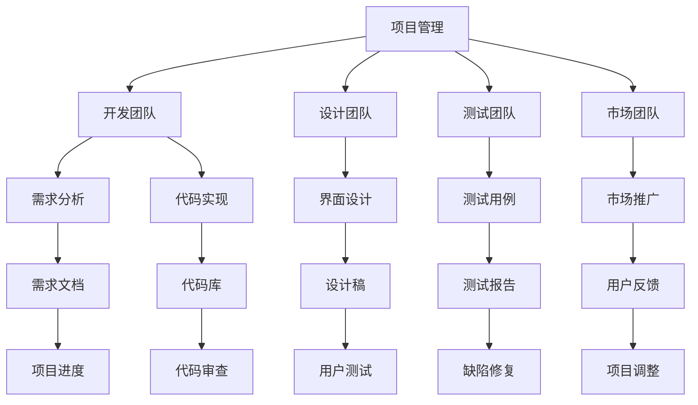

                 

# 团队协作：跨职能合作的挑战与策略

> **关键词**：团队协作、跨职能合作、沟通、挑战、策略、项目成功

> **摘要**：本文深入探讨了跨职能团队合作在现代IT项目中的重要性，分析了其中面临的挑战，并提出了有效的策略来提升团队协作效率和项目成功率。通过详细的技术分析、案例研究和工具推荐，为IT行业从业者提供了实用的指导。

## 1. 背景介绍

### 1.1 目的和范围

在现代企业中，项目往往涉及多个职能部门，如开发、设计、测试、市场营销等。跨职能团队协作已经成为实现项目成功的关键。本文旨在探讨跨职能团队合作的重要性，分析其中的挑战，并提供解决方案。

### 1.2 预期读者

本文面向IT行业的开发人员、项目经理、团队领导和其他对跨职能合作感兴趣的读者。希望读者能够在阅读后对团队协作有更深入的理解，并能够将所学应用于实际工作中。

### 1.3 文档结构概述

本文分为八个主要部分：背景介绍、核心概念与联系、核心算法原理与具体操作步骤、数学模型与公式、项目实战、实际应用场景、工具和资源推荐以及总结与未来发展趋势。

### 1.4 术语表

#### 1.4.1 核心术语定义

- **跨职能团队**：由来自不同职能部门的人员组成的团队。
- **沟通**：信息在团队成员间的传递和理解。
- **协作**：团队成员共同努力以实现共同目标。

#### 1.4.2 相关概念解释

- **敏捷开发**：一种以用户需求迭代为核心的软件开发方法。
- **DevOps**：一种将软件开发和IT运维紧密结合的方法。

#### 1.4.3 缩略词列表

- **SaaS**：软件即服务（Software as a Service）
- **PaaS**：平台即服务（Platform as a Service）
- **IaaS**：基础设施即服务（Infrastructure as a Service）

## 2. 核心概念与联系

跨职能团队合作是现代IT项目成功的关键。以下是一个简化的Mermaid流程图，展示了跨职能团队中的核心概念和关系：



## 3. 核心算法原理与具体操作步骤

跨职能团队协作的核心在于高效的沟通和协调。以下是一个简化版的伪代码，用于描述跨职能团队协作的基本步骤：

```plaintext
function crossFunctionalCollaboration():
    1. 创建跨职能团队，包括项目经理、开发人员、设计师、测试人员等。
    2. 确定项目目标和里程碑。
    3. 每个团队成员明确自己的职责和任务。
    4. 定期召开会议，讨论项目进展和遇到的问题。
    5. 使用敏捷开发方法，进行迭代式开发。
    6. 开发人员编写代码，设计师设计界面，测试人员编写测试用例。
    7. 团队成员相互审查和反馈。
    8. 根据用户反馈调整项目方向。
    9. 完成项目，并交付给客户。
```

## 4. 数学模型和公式与详细讲解与举例说明

跨职能团队协作的数学模型可以通过项目进度方程来表示。假设项目分为n个阶段，每个阶段的完成概率为p_i，则项目整体完成概率P可以用以下公式表示：

$$ P = \prod_{i=1}^{n} p_i $$

例如，如果项目分为三个阶段，每个阶段的完成概率分别为0.9、0.8和0.85，则项目整体完成概率为：

$$ P = 0.9 \times 0.8 \times 0.85 = 0.612 $$

这意味着项目成功的概率为61.2%。

## 5. 项目实战：代码实际案例和详细解释说明

### 5.1 开发环境搭建

为了展示跨职能团队协作，我们以一个简单的Web应用开发为例。首先，我们需要搭建开发环境。以下是相关步骤：

1. 安装Node.js和npm。
2. 安装前端框架，如React或Vue.js。
3. 安装后端框架，如Express.js或Spring Boot。
4. 创建项目目录和文件结构。

### 5.2 源代码详细实现和代码解读

以下是一个简单的React前端组件，用于展示跨职能团队协作：

```jsx
import React from 'react';

function CrossFunctionalTeam() {
    return (
        <div>
            <h1>跨职能团队协作示例</h1>
            <p>开发人员：编写代码</p>
            <p>设计师：设计界面</p>
            <p>测试人员：编写测试用例</p>
            <p>项目经理：协调各方</p>
        </div>
    );
}

export default CrossFunctionalTeam;
```

在这个组件中，我们通过React的 JSX 语言定义了一个简单的HTML结构，展示了跨职能团队中不同角色的职责。

### 5.3 代码解读与分析

1. **组件定义**：使用 `function CrossFunctionalTeam()` 定义了一个名为 `CrossFunctionalTeam` 的函数组件。
2. **返回值**：组件的返回值是一个 `div` 元素，包含一个标题和三个段落，分别描述了开发人员、设计师和测试人员的职责。
3. **功能**：这个组件用于在Web应用中展示跨职能团队协作的过程，提高团队成员间的理解和协作。

## 6. 实际应用场景

跨职能团队协作在实际项目中具有广泛的应用。以下是一些常见的应用场景：

1. **软件开发**：跨职能团队在软件开发中负责不同的任务，如需求分析、界面设计、代码实现和测试。
2. **市场营销**：跨职能团队在市场营销中负责不同的任务，如市场调研、广告设计、内容创作和用户反馈。
3. **项目管理**：跨职能团队在项目管理中负责不同的任务，如项目规划、进度跟踪、风险管理和资源调配。

## 7. 工具和资源推荐

### 7.1 学习资源推荐

#### 7.1.1 书籍推荐

- 《敏捷软件开发：实践指南》（《Agile Software Development: Principles, Patterns, and Practices》）
- 《团队协作：有效沟通的艺术》（《Collaboration Excellence: The Art of Business Writing and Communication》）

#### 7.1.2 在线课程

- Coursera上的“项目管理和团队协作”（Project Management and Team Collaboration）
- edX上的“跨职能团队合作”（Cross-Functional Team Collaboration）

#### 7.1.3 技术博客和网站

- Medium上的“敏捷开发与团队协作”（Agile Development and Team Collaboration）
- Stack Overflow上的“团队协作问答”（Team Collaboration Q&A）

### 7.2 开发工具框架推荐

#### 7.2.1 IDE和编辑器

- Visual Studio Code
- IntelliJ IDEA
- Eclipse

#### 7.2.2 调试和性能分析工具

- Chrome DevTools
- Firebug
- New Relic

#### 7.2.3 相关框架和库

- React
- Vue.js
- Angular

### 7.3 相关论文著作推荐

#### 7.3.1 经典论文

- 《跨职能团队协作：理论与实践》（"Cross-Functional Team Collaboration: Theory and Practice"）
- 《敏捷开发：一种软件开发方法论》（"Agile Development: A Software Development Methodology"）

#### 7.3.2 最新研究成果

- 《跨职能团队协作：现状与未来》（"Cross-Functional Team Collaboration: Current State and Future Directions"）
- 《DevOps实践：跨职能团队协作的新模式》（"DevOps Practices: New Models for Cross-Functional Team Collaboration"）

#### 7.3.3 应用案例分析

- 《跨职能团队在金融科技项目中的应用》（"Application of Cross-Functional Teams in FinTech Projects"）
- 《敏捷团队在大型项目中的协作经验》（"Collaboration Experience of Agile Teams in Large Projects"）

## 8. 总结：未来发展趋势与挑战

未来，跨职能团队协作将继续成为企业创新和竞争的关键。随着技术的发展，如人工智能、区块链和物联网，跨职能团队将面临新的挑战和机遇。以下是一些关键趋势和挑战：

1. **技术整合**：跨职能团队需要更好地整合不同的技术，以提高协作效率和项目成功率。
2. **敏捷转型**：越来越多的企业将采用敏捷开发方法，跨职能团队需要适应这种快速变化的环境。
3. **人才发展**：企业需要培养具有跨职能能力和团队合作精神的人才，以应对日益复杂的项目需求。
4. **数据驱动**：跨职能团队将更多地依赖于数据分析和机器学习来指导项目决策和优化团队协作。

## 9. 附录：常见问题与解答

### 9.1 什么是跨职能团队？

跨职能团队是由来自不同职能部门的人员组成的团队，如开发、设计、测试、市场营销等。他们的目标是共同完成一个项目，实现项目的成功。

### 9.2 跨职能团队协作的关键是什么？

跨职能团队协作的关键是高效的沟通和协调。团队成员需要明确自己的职责和任务，并保持定期的沟通，以确保项目进展顺利。

### 9.3 如何提高跨职能团队的效率？

提高跨职能团队效率的方法包括：采用敏捷开发方法，使用合适的工具和平台，培养团队成员的跨职能能力和团队合作精神。

## 10. 扩展阅读 & 参考资料

- 《敏捷软件开发：实践指南》（《Agile Software Development: Principles, Patterns, and Practices》）by Robert C. Martin
- 《团队协作：有效沟通的艺术》（《Collaboration Excellence: The Art of Business Writing and Communication》）by Jim Highsmith
- 《跨职能团队协作：理论与实践》（"Cross-Functional Team Collaboration: Theory and Practice"）by John P. Kotter and Dan S. Cohen
- 《敏捷开发：一种软件开发方法论》（"Agile Development: A Software Development Methodology"）by David J. Anderson

## 作者

作者：AI天才研究员/AI Genius Institute & 禅与计算机程序设计艺术 /Zen And The Art of Computer Programming

