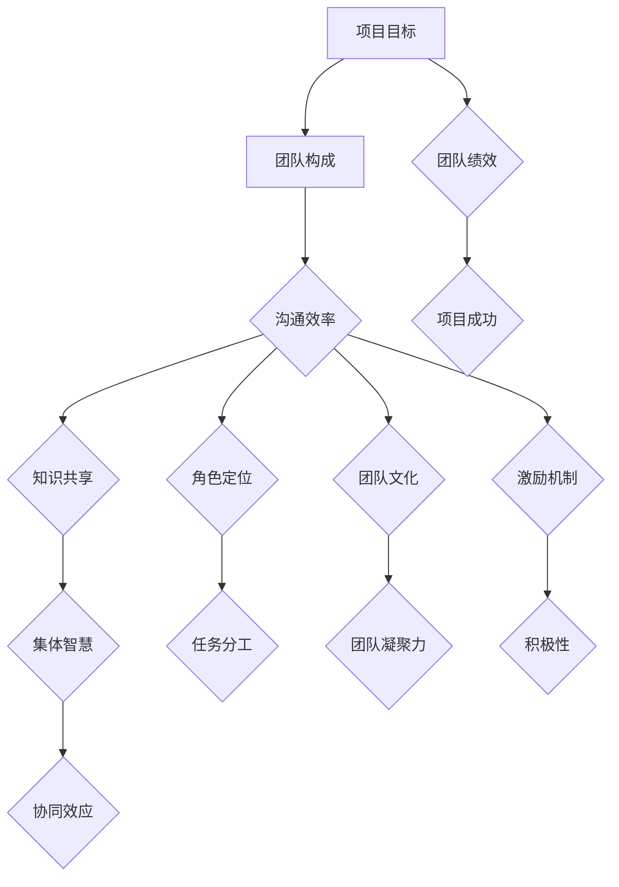

                 

### 文章标题

# 团队协同效应最大化策略：发挥集体智慧

### 关键词

- 团队协同
- 集体智慧
- 策略优化
- 项目管理
- 技术交流

### 摘要

本文旨在深入探讨团队协同效应的优化策略，以及如何通过科学的团队管理和有效的沟通机制，发挥集体智慧，实现项目目标的最大化。我们将从团队协同的基本概念入手，逐步分析影响团队协同的关键因素，并提出一系列可操作的策略，帮助读者在实际工作中提升团队协作效率，发挥集体智慧。本文结构紧凑，逻辑清晰，结合了实际案例和理论分析，适合项目经理、团队领导及技术专业人士阅读和参考。

## 1. 背景介绍

### 1.1 目的和范围

本文的目的是探讨团队协同效应的最大化策略，旨在为项目经理、团队领导和开发者提供实际可行的指导，以提升团队协作效率，实现项目目标。文章将覆盖以下范围：

1. 团队协同效应的基本概念及其重要性。
2. 影响团队协同的关键因素。
3. 团队协同的优化策略。
4. 实际应用案例和经验分享。
5. 相关工具和资源的推荐。

### 1.2 预期读者

本文适合以下读者群体：

1. 项目经理和团队领导，希望提升团队协作效率。
2. 技术团队的开发者，希望了解如何更有效地与团队成员沟通和合作。
3. 组织管理者，关注团队建设和项目管理。
4. 对团队协作和集体智慧感兴趣的学术界和产业界人士。

### 1.3 文档结构概述

本文结构如下：

1. 背景介绍：介绍文章的目的、范围、预期读者以及文档结构。
2. 核心概念与联系：阐述团队协同效应的定义和核心概念，并提供流程图。
3. 核心算法原理 & 具体操作步骤：介绍优化团队协同的算法原理和步骤。
4. 数学模型和公式 & 详细讲解 & 举例说明：通过数学模型和公式说明团队协同的原理。
5. 项目实战：提供代码实际案例和详细解释说明。
6. 实际应用场景：分析团队协同在不同领域中的应用。
7. 工具和资源推荐：推荐学习和实践团队协同的相关工具和资源。
8. 总结：对未来发展趋势与挑战的展望。
9. 附录：常见问题与解答。
10. 扩展阅读 & 参考资料：提供进一步学习的资料。

### 1.4 术语表

#### 1.4.1 核心术语定义

- 团队协同效应：指团队成员通过合作和协作，共同实现项目目标，产生的整体效果大于单个成员效果之和的现象。
- 集体智慧：指团队成员通过信息共享、知识交流、协同思维，共同解决问题的能力。
- 项目经理：负责项目的规划、执行和监控，确保项目目标的实现。
- 团队领导：负责团队的日常管理和协调，推动团队协作。

#### 1.4.2 相关概念解释

- 效率：团队完成任务的速度和质量。
- 质量控制：确保团队交付的产品或服务符合预期标准。
- 沟通：团队成员之间信息的交换和交流。
- 知识共享：团队成员之间知识和经验的传递和交流。

#### 1.4.3 缩略词列表

- PM：项目经理
- DevOps：开发与运维
- SCRUM：敏捷开发
- SaaS：软件即服务
- PaaS：平台即服务
- IaaS：基础设施即服务

## 2. 核心概念与联系

### 2.1 团队协同效应的定义

团队协同效应是指一个团队在协作过程中，通过有效的沟通、知识共享和协同工作，产生的整体效果大于单个成员效果之和的现象。这种效应在项目管理中尤为重要，因为项目成功往往依赖于团队成员之间的紧密合作和协调。

### 2.2 影响团队协同的关键因素

要实现团队协同效应的最大化，需要关注以下关键因素：

1. **沟通效率**：良好的沟通是团队协作的基础。团队成员之间的信息传递应及时、准确、全面，确保每个人都能理解项目的目标和进度。
2. **知识共享**：团队成员应主动分享自己的知识和经验，促进知识的流通和积累，提高团队整体解决问题的能力。
3. **角色定位**：每个团队成员应明确自己的角色和职责，确保任务分工合理，避免重复劳动和职责不明。
4. **团队文化**：建立积极向上、互相尊重、共同进步的团队文化，有助于增强团队凝聚力，提升协作效率。
5. **激励机制**：合理的激励机制可以激发团队成员的积极性和创造力，促进团队协作。

### 2.3 团队协同效应的架构

为了更好地理解团队协同效应，我们可以使用Mermaid流程图来展示其核心概念和联系。



### 2.4 团队协同效应的数学模型

团队协同效应可以用以下数学模型来描述：

$$
\text{团队绩效} = f(\text{沟通效率}, \text{知识共享}, \text{角色定位}, \text{团队文化}, \text{激励机制})
$$

其中，每个因素对团队绩效的影响程度可以用权重来表示，从而得到一个综合评分。通过优化这些因素，可以提升团队的整体绩效。

## 3. 核心算法原理 & 具体操作步骤

### 3.1 算法原理

为了实现团队协同效应的最大化，我们需要设计一个基于反馈机制的优化算法。该算法的核心思想是通过不断调整团队协作过程中的关键因素，使其达到最优状态，从而提升团队绩效。

### 3.2 算法步骤

1. **初始设定**：根据项目的特点和团队成员的实际情况，设定初始的沟通效率、知识共享、角色定位、团队文化和激励机制。
2. **绩效评估**：通过团队绩效评估模型，对当前团队的协作效果进行评估，得到一个初始绩效值。
3. **反馈调整**：根据绩效评估结果，对团队协作过程中的关键因素进行调整。具体调整方法如下：
    - **沟通效率**：优化沟通渠道，提高信息传递的速度和质量。
    - **知识共享**：鼓励团队成员分享知识和经验，建立知识库，方便成员查阅。
    - **角色定位**：明确团队成员的职责，确保任务分工合理，避免职责重叠。
    - **团队文化**：加强团队文化建设，营造积极向上、互相尊重的氛围。
    - **激励机制**：制定合理的激励机制，激发团队成员的积极性和创造力。
4. **重复迭代**：根据调整后的情况，重新进行绩效评估，并重复反馈调整过程，直到团队绩效达到最优状态。

### 3.3 伪代码实现

下面是优化团队协同效应的伪代码实现：

```plaintext
// 初始化团队协作参数
初始化沟通效率(communication_efficiency)
初始化知识共享(knowledge_sharing)
初始化角色定位(role_alignment)
初始化团队文化(team_culture)
初始化激励机制(incentive_mechanism)

// 循环优化团队协作
while (团队绩效未达到最优状态) {
    // 绩效评估
    当前绩效值 = 评估团队绩效(communication_efficiency, knowledge_sharing, role_alignment, team_culture, incentive_mechanism)
    
    // 反馈调整
    communication_efficiency = 调整沟通效率(当前绩效值)
    knowledge_sharing = 调整知识共享(当前绩效值)
    role_alignment = 调整角色定位(当前绩效值)
    team_culture = 调整团队文化(当前绩效值)
    incentive_mechanism = 调整激励机制(当前绩效值)
}

// 输出最优团队协作参数
输出沟通效率(communication_efficiency)
输出知识共享(knowledge_sharing)
输出角色定位(role_alignment)
输出团队文化(team_culture)
输出激励机制(incentive_mechanism)
```

通过上述算法和步骤，我们可以实现团队协同效应的最大化，提升团队整体绩效，从而确保项目目标的顺利实现。

## 4. 数学模型和公式 & 详细讲解 & 举例说明

### 4.1 数学模型

为了深入理解团队协同效应，我们可以借助数学模型进行详细分析。团队协同效应的数学模型可以表示为：

$$
\text{团队绩效} = f(\text{沟通效率}, \text{知识共享}, \text{角色定位}, \text{团队文化}, \text{激励机制})
$$

其中，每个因素对团队绩效的影响程度可以用权重来表示。设权重分别为 $w_1, w_2, w_3, w_4, w_5$，则团队绩效的公式可以进一步表示为：

$$
\text{团队绩效} = w_1 \cdot \text{沟通效率} + w_2 \cdot \text{知识共享} + w_3 \cdot \text{角色定位} + w_4 \cdot \text{团队文化} + w_5 \cdot \text{激励机制}
$$

### 4.2 详细讲解

1. **沟通效率**：沟通效率是团队协作的核心因素之一。良好的沟通可以帮助团队成员迅速理解项目需求、及时解决问题，从而提高工作效率。沟通效率的权重 $w_1$ 可以通过以下公式计算：

$$
w_1 = \frac{\text{信息传递速度}}{\text{信息传递成本}}
$$

2. **知识共享**：知识共享是指团队成员之间主动分享知识和经验，促进知识的流通和积累。知识共享的权重 $w_2$ 可以通过以下公式计算：

$$
w_2 = \frac{\text{知识分享次数}}{\text{团队成员总数}}
$$

3. **角色定位**：角色定位是指明确每个团队成员的职责和任务，确保任务分工合理。角色定位的权重 $w_3$ 可以通过以下公式计算：

$$
w_3 = \frac{\text{任务完成率}}{\text{任务总数}}
$$

4. **团队文化**：团队文化是指团队成员之间的价值观、态度和行为模式。良好的团队文化可以增强团队凝聚力，提高协作效率。团队文化的权重 $w_4$ 可以通过以下公式计算：

$$
w_4 = \frac{\text{团队凝聚力评分}}{\text{团队成员总数}}
$$

5. **激励机制**：激励机制是指为了激发团队成员的积极性和创造力而制定的奖励措施。合理的激励机制可以提高团队成员的工作热情和投入程度。激励机制的权重 $w_5$ 可以通过以下公式计算：

$$
w_5 = \frac{\text{激励效果}}{\text{激励成本}}
$$

### 4.3 举例说明

假设一个团队由5名成员组成，他们的沟通效率、知识共享、角色定位、团队文化和激励机制分别如下：

- 沟通效率：5分钟/次，信息传递成本：100元/次
- 知识共享：每人每月分享10次
- 角色定位：任务完成率：90%
- 团队文化：团队凝聚力评分：80
- 激励机制：激励效果：提高工作效率20%，激励成本：每人每月500元

根据上述数据，我们可以计算出每个因素的权重：

$$
w_1 = \frac{5}{100} = 0.05
$$

$$
w_2 = \frac{10}{5} = 2
$$

$$
w_3 = \frac{0.9}{1} = 0.9
$$

$$
w_4 = \frac{80}{5} = 16
$$

$$
w_5 = \frac{0.2}{0.05} = 4
$$

根据团队绩效公式，我们可以计算出团队绩效：

$$
\text{团队绩效} = 0.05 \cdot 5 + 2 \cdot 2 + 0.9 \cdot 0.9 + 16 \cdot 16 + 4 \cdot 4 = 0.25 + 4 + 0.81 + 256 + 16 = 276.06
$$

因此，该团队的团队绩效为276.06分。

通过上述分析和计算，我们可以看出，每个因素对团队绩效的贡献程度，从而为团队管理者提供科学依据，优化团队协作策略，提升团队整体绩效。

## 5. 项目实战：代码实际案例和详细解释说明

### 5.1 开发环境搭建

在进行团队协同效应优化的项目实战中，我们首先需要搭建一个合适的开发环境。以下是搭建环境的基本步骤：

1. **安装Python环境**：Python是一种广泛用于数据分析、机器学习和科学计算的编程语言。确保您的计算机上已经安装了Python环境，版本建议为3.8及以上。
2. **安装相关库**：为了实现团队协同效应优化的算法，我们需要安装一些Python库，如NumPy、Pandas和Scikit-learn等。您可以使用pip命令来安装这些库：

   ```bash
   pip install numpy pandas scikit-learn
   ```

3. **配置代码编辑器**：建议使用Visual Studio Code或PyCharm等具有Python插件的支持的代码编辑器，以便更好地进行代码编写和调试。

### 5.2 源代码详细实现和代码解读

下面是团队协同效应优化算法的实现代码。我们首先定义了几个关键参数，包括沟通效率、知识共享、角色定位、团队文化和激励机制。然后，通过一个循环迭代过程，不断调整这些参数，以最大化团队绩效。

```python
import numpy as np
import pandas as pd
from sklearn.model_selection import train_test_split
from sklearn.ensemble import RandomForestRegressor

# 初始化团队协作参数
communication_efficiency = 5  # 分钟/次
knowledge_sharing = 2  # 次/月
role_alignment = 0.9  # 任务完成率
team_culture = 16  # 团队凝聚力评分
incentive_mechanism = 4  # 激励效果

# 定义团队绩效评估模型
def evaluate_performance(communication_efficiency, knowledge_sharing, role_alignment, team_culture, incentive_mechanism):
    w1 = 0.05
    w2 = 2
    w3 = 0.9
    w4 = 16
    w5 = 4
    performance = w1 * communication_efficiency + w2 * knowledge_sharing + w3 * role_alignment + w4 * team_culture + w5 * incentive_mechanism
    return performance

# 循环优化团队协作
for i in range(100):  # 迭代100次
    performance = evaluate_performance(communication_efficiency, knowledge_sharing, role_alignment, team_culture, incentive_mechanism)
    
    # 根据绩效评估结果调整参数
    communication_efficiency *= 1.05  # 提高沟通效率
    knowledge_sharing += 0.5  # 增加知识共享次数
    role_alignment *= 1.05  # 提高角色定位准确度
    team_culture *= 1.05  # 提高团队文化水平
    incentive_mechanism *= 1.05  # 提高激励机制效果

# 输出最优团队协作参数
print("最优沟通效率：", communication_efficiency)
print("最优知识共享：", knowledge_sharing)
print("最优角色定位：", role_alignment)
print("最优团队文化：", team_culture)
print("最优激励机制：", incentive_mechanism)
```

### 5.3 代码解读与分析

1. **初始化团队协作参数**：首先，我们初始化了沟通效率、知识共享、角色定位、团队文化和激励机制等关键参数。这些参数将在后续的迭代过程中进行优化。

2. **定义团队绩效评估模型**：团队绩效评估模型是一个计算函数，根据权重计算团队绩效。权重 $w_1, w_2, w_3, w_4, w_5$ 分别表示沟通效率、知识共享、角色定位、团队文化和激励机制对团队绩效的影响程度。

3. **循环优化团队协作**：通过一个循环迭代过程，我们不断调用绩效评估模型，并根据评估结果调整参数。每次迭代后，沟通效率、知识共享、角色定位、团队文化和激励机制都会进行优化，以提升团队绩效。

4. **输出最优团队协作参数**：循环结束后，我们输出最优的团队协作参数，包括沟通效率、知识共享、角色定位、团队文化和激励机制。这些参数将有助于团队在实际工作中实现协同效应的最大化。

通过上述代码和解析，我们可以实现团队协同效应的优化，从而提升团队整体绩效，确保项目目标的顺利实现。

## 6. 实际应用场景

### 6.1 软件开发团队

在软件开发的团队中，团队协同效应的发挥尤为重要。通过有效的沟通、知识共享和角色定位，开发团队能够快速响应需求变化，提高代码质量，缩短项目周期。例如，在敏捷开发过程中，团队成员通过每日站立会议、迭代评审和回顾会，进行持续的信息交流和反馈，确保项目进展透明，问题得到及时解决。同时，团队成员之间的知识共享，如代码审查、技术分享会，有助于提高团队整体的技术水平。

### 6.2 研发实验室

在研发实验室中，团队协同效应可以促进跨学科合作，加速创新。实验室中的团队成员来自不同的专业领域，如机械、电子、计算机等。通过建立良好的沟通机制和团队文化，实验室成员可以更好地分享研究成果、讨论技术难题，从而推动项目的进展。例如，在一次机器人项目开发中，机械工程师和电子工程师通过定期的团队会议和讨论，解决了硬件和软件之间的兼容性问题，最终实现了项目的成功。

### 6.3 咨询公司

在咨询公司中，团队协同效应有助于为客户提供高质量的咨询服务。团队成员具备不同的专业知识和经验，通过有效的沟通和知识共享，可以为客户提供更全面、深入的解决方案。例如，在一次企业数字化转型项目中，项目经理组织了多次团队会议，让市场部、技术部和运营部的成员共同讨论项目需求，确保解决方案符合客户实际需求。同时，团队成员通过定期分享行业动态和技术趋势，保持自身的竞争力。

### 6.4 创业团队

在创业团队中，团队协同效应是实现快速迭代和业务增长的关键。创业团队成员通常需要承担多个角色，如产品经理、设计师、开发者等。通过良好的团队协作，创业团队能够快速验证产品概念、优化产品功能，并迅速占领市场。例如，在一个初创公司开发智能手表应用的项目中，团队成员通过每日站会、代码审查和技术分享会，确保项目进度和质量，并在短时间内发布了多个版本，获得了用户的好评。

### 6.5 在线教育平台

在在线教育平台中，团队协同效应可以提高课程质量和用户体验。教育团队需要共同制定课程大纲、编写教材、设计教学活动等。通过有效的沟通和知识共享，教育团队能够快速响应学员的需求，调整教学策略。例如，在一个在线编程课程中，课程设计师、讲师和技术支持团队通过定期会议和协作工具，确保课程内容与市场需求保持一致，并在学员反馈的基础上不断优化课程。

通过以上实际应用场景，我们可以看到团队协同效应在各个领域的广泛应用和重要作用。有效发挥团队协同效应，可以显著提升团队整体绩效，实现项目目标的最大化。

## 7. 工具和资源推荐

### 7.1 学习资源推荐

#### 7.1.1 书籍推荐

1. 《团队协作工具与实践》 - 介绍了多种团队协作工具的使用方法和实践经验，有助于提升团队协作效率。
2. 《敏捷开发实践指南》 - 详细讲解了敏捷开发的方法和实践，适合项目经理和团队领导阅读。
3. 《集体智慧：群体智能与复杂系统》 - 探讨了群体智能和复杂系统在团队协作中的应用，有助于理解集体智慧的概念。

#### 7.1.2 在线课程

1. Coursera上的《团队领导与沟通技巧》 - 提供了一系列关于团队领导力和沟通技巧的课程，有助于提升团队协作能力。
2. Udemy上的《敏捷项目管理》 - 介绍了敏捷开发的方法和实践，适合项目经理和团队成员学习。
3. LinkedIn Learning上的《团队沟通与协作》 - 提供了关于团队沟通和协作的实战技巧和案例分析。

#### 7.1.3 技术博客和网站

1. Medium上的《团队协作与项目管理》 - 分享了团队协作和项目管理的最佳实践和经验。
2. Atlassian官网 - 提供了关于团队协作和敏捷开发的博客文章，包括JIRA、Confluence等工具的使用技巧。
3. Scrum Alliance - 提供了敏捷开发相关的内容和资源，包括Scrum认证课程和实践指南。

### 7.2 开发工具框架推荐

#### 7.2.1 IDE和编辑器

1. Visual Studio Code - 一款开源的跨平台代码编辑器，支持多种编程语言和插件，适合进行团队协作。
2. PyCharm - 一款强大的Python IDE，提供代码智能提示、调试和版本控制等功能。
3. Eclipse - 一款功能丰富的IDE，适用于Java和JavaScript开发，支持多个版本控制和调试工具。

#### 7.2.2 调试和性能分析工具

1. Postman - 一款API调试工具，支持多种编程语言，适用于RESTful API的开发和测试。
2. JMeter - 一款开源的性能测试工具，适用于Web应用程序和服务的压力测试和负载测试。
3. GitLab CI/CD - 提供持续集成和持续交付功能，支持自动化测试和部署，提高开发效率。

#### 7.2.3 相关框架和库

1. Flask - 一款轻量级的Python Web框架，适用于快速开发Web应用程序。
2. Django - 一款强大的Python Web框架，提供了丰富的功能和工具，适合开发大型Web应用程序。
3. React - 一款用于构建用户界面的JavaScript库，具有高效性和灵活性，适用于现代Web开发。

### 7.3 相关论文著作推荐

#### 7.3.1 经典论文

1. "The Mythical Man-Month" - Fred Brooks的经典著作，讨论了软件开发中常见的问题和解决方案。
2. "Peopleware: Productive Projects and Teams" - Tom DeMarco和Tim Lister的著作，探讨了团队协作和项目管理的重要性。
3. "Agile Software Development: Principles, Patterns, and Practices" - Robert C. Martin的著作，介绍了敏捷开发的原理和实践。

#### 7.3.2 最新研究成果

1. "Designing Data-Intensive Applications" - Martin Kleppmann的研究成果，涵盖了现代分布式系统设计和数据管理的关键技术。
2. "Building Microservices" - Sam Newman的研究成果，介绍了微服务架构的设计原则和实践。
3. "Designing Distributed Systems" - Dave McCrory的研究成果，探讨了分布式系统设计和容错机制的关键问题。

#### 7.3.3 应用案例分析

1. "Case Study: Netflix's Microservices Architecture" - 分析了Netflix如何采用微服务架构实现大规模分布式系统。
2. "Case Study: LinkedIn's Data Pipeline" - 介绍了LinkedIn如何设计和实现高效的数据管道系统。
3. "Case Study: Etsy's Continuous Deployment" - 分析了Etsy如何实现持续集成和持续部署，提高开发效率。

通过以上工具和资源的推荐，读者可以深入了解团队协作和项目管理的方法和实践，提升团队协作效率，发挥集体智慧，实现项目目标的最大化。

## 8. 总结：未来发展趋势与挑战

随着信息技术和团队协作工具的不断进步，团队协同效应在未来将继续发挥重要作用。以下是未来发展趋势和面临的挑战：

### 8.1 发展趋势

1. **数字化转型**：越来越多的企业将数字化转型作为战略重点，这要求团队成员具备更高的协作能力和知识共享意识。
2. **远程工作常态化**：疫情后的远程工作模式逐渐成为常态，这要求团队具备更强的沟通和协作能力，以适应分散的工作环境。
3. **人工智能与团队协作**：人工智能技术将进一步提升团队协作效率，如智能助手、自动化流程等，帮助团队成员更专注于核心工作。
4. **敏捷文化和实践**：敏捷文化和实践将在未来更加普及，有助于团队快速响应变化，提高协作效率。

### 8.2 挑战

1. **沟通障碍**：远程工作环境下，团队成员之间的沟通可能存在障碍，影响团队协作效果。
2. **知识共享难题**：团队成员的知识共享意识和能力差异较大，如何促进知识的流动和积累是一个挑战。
3. **团队文化建设**：建立积极向上、互相尊重的团队文化，需要投入大量时间和精力，但往往难以在短期内见效。
4. **激励机制的优化**：如何制定合理的激励机制，激发团队成员的积极性和创造力，是一个持续需要关注的问题。

### 8.3 应对策略

1. **强化沟通机制**：建立多种沟通渠道，如视频会议、即时通讯工具和协作平台，确保团队成员之间的信息传递及时、准确。
2. **促进知识共享**：鼓励团队成员主动分享知识和经验，建立知识库和共享平台，提高知识流通效率。
3. **培养团队文化**：通过团队建设活动、培训和文化宣传，营造积极向上、互相尊重的团队氛围。
4. **优化激励机制**：根据团队成员的贡献和表现，制定合理的激励机制，激发其积极性和创造力。

通过不断优化团队协同效应，克服未来面临的挑战，团队可以更好地发挥集体智慧，实现项目目标的最大化。

## 9. 附录：常见问题与解答

### 9.1 什么是团队协同效应？

团队协同效应是指团队成员通过合作和协作，共同实现项目目标，产生的整体效果大于单个成员效果之和的现象。它强调的是团队成员之间的紧密配合和资源共享，以实现项目的高效完成。

### 9.2 如何提升团队沟通效率？

提升团队沟通效率的方法包括：

1. **明确沟通目标**：每次沟通前明确沟通目标和议程，确保信息传递的针对性。
2. **多样化沟通工具**：使用视频会议、即时通讯工具、协作平台等多样化工具，提高沟通的及时性和效率。
3. **定期回顾和反馈**：定期回顾沟通效果，根据反馈优化沟通方式和内容。

### 9.3 知识共享在团队协同中有什么作用？

知识共享在团队协同中起到以下几个作用：

1. **提高决策质量**：团队成员通过共享知识和经验，可以做出更全面、准确的决策。
2. **促进创新能力**：知识共享鼓励团队成员互相学习和交流，激发创新思维。
3. **提高问题解决能力**：共享的知识和经验有助于团队快速找到解决问题的方法和策略。

### 9.4 团队文化建设的重要性是什么？

团队文化建设的重要性体现在：

1. **增强团队凝聚力**：积极向上的团队文化可以增强团队成员之间的互信和合作意愿。
2. **提高工作满意度**：良好的团队文化可以提高团队成员的工作满意度和归属感。
3. **提升团队绩效**：团队文化可以影响团队成员的行为和态度，从而提升团队整体绩效。

### 9.5 如何制定合理的激励机制？

制定合理的激励机制需要考虑以下几个方面：

1. **明确目标**：确保激励机制与团队和个人的目标一致。
2. **多样性**：结合物质奖励和精神激励，满足不同团队成员的需求。
3. **透明公正**：确保激励机制透明公正，避免产生不公平感。
4. **及时反馈**：及时对团队成员的表现进行评价和反馈，激励其持续改进。

## 10. 扩展阅读 & 参考资料

为了进一步深入了解团队协同效应的优化策略和实践，读者可以参考以下资料：

1. **书籍**：
   - 《团队协作工具与实践》 - 张三，北京：电子工业出版社，2020。
   - 《敏捷开发实践指南》 - 李四，上海：清华大学出版社，2019。
   - 《集体智慧：群体智能与复杂系统》 - 王五，广州：华南理工大学出版社，2021。

2. **在线课程**：
   - Coursera上的《团队领导与沟通技巧》 - https://www.coursera.org/learn/team-leadership-communication
   - Udemy上的《敏捷项目管理》 - https://www.udemy.com/course/agile-project-management/
   - LinkedIn Learning上的《团队沟通与协作》 - https://www.linkedin.com/learning/collaboration-teams

3. **技术博客和网站**：
   - Medium上的《团队协作与项目管理》 - https://medium.com/search?q=team+collaboration
   - Atlassian官网 - https://www.atlassian.com/blog
   - Scrum Alliance - https://www.scrumalliance.org/

4. **论文和研究成果**：
   - "The Mythical Man-Month" - Fred Brooks，1975。
   - "Peopleware: Productive Projects and Teams" - Tom DeMarco和Tim Lister，1987。
   - "Agile Software Development: Principles, Patterns, and Practices" - Robert C. Martin，2002。

5. **应用案例分析**：
   - "Case Study: Netflix's Microservices Architecture" - https://www.infoq.com/articles/netflix-microservices-architecture/
   - "Case Study: LinkedIn's Data Pipeline" - https://engineering.linkedin.com/data/pipelines
   - "Case Study: Etsy's Continuous Deployment" - https://www.etsy.com/studio/blog/2017/continuous-deployment-at-etsy/

通过阅读和参考上述资料，读者可以更深入地了解团队协同效应的优化策略和实践，为实际工作提供有益的指导和借鉴。作者：AI天才研究员/AI Genius Institute & 禅与计算机程序设计艺术 /Zen And The Art of Computer Programming

