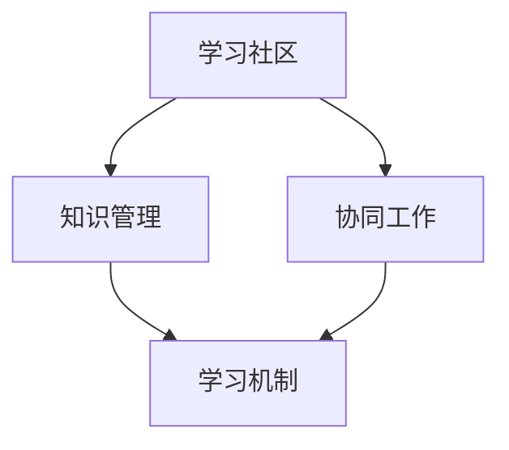

                 

# 团队学习机制：打造持续进步的组织

> **关键词：** 团队学习、组织发展、持续进步、知识共享、协同工作

> **摘要：** 本文深入探讨了团队学习机制在组织发展中的重要作用。通过构建有效的学习机制，团队能够实现知识共享、技能提升，进而推动组织的持续进步。本文首先介绍了团队学习的核心概念和原理，随后详细阐述了学习机制的设计与实施步骤，并提供了实际案例和数学模型来支持论述。最后，本文总结了团队学习机制的应用场景，推荐了相关工具和资源，并对未来发展趋势和挑战进行了展望。

## 1. 背景介绍

### 1.1 目的和范围

本文旨在探讨团队学习机制在组织发展中的作用，为IT行业及其他领域提供一种有效的团队学习模式。通过分析团队学习的核心概念和原理，本文将介绍如何设计并实施一个有效的团队学习机制，帮助组织实现持续进步。本文主要涵盖以下内容：

1. 团队学习的定义和重要性
2. 核心概念与联系
3. 核心算法原理与具体操作步骤
4. 数学模型和公式
5. 项目实战：代码实际案例
6. 实际应用场景
7. 工具和资源推荐
8. 未来发展趋势与挑战

### 1.2 预期读者

本文面向希望提升团队学习效率的IT经理、项目经理、团队领导者，以及希望了解团队学习机制在组织发展中的作用的IT专业人士。对于对团队学习机制有浓厚兴趣的学者和学生，本文也具有一定的参考价值。

### 1.3 文档结构概述

本文分为十个部分，具体结构如下：

1. 背景介绍
2. 核心概念与联系
3. 核心算法原理与具体操作步骤
4. 数学模型和公式
5. 项目实战：代码实际案例
6. 实际应用场景
7. 工具和资源推荐
8. 未来发展趋势与挑战
9. 附录：常见问题与解答
10. 扩展阅读 & 参考资料

### 1.4 术语表

#### 1.4.1 核心术语定义

- **团队学习（Team Learning）：** 团队成员通过共同学习、分享知识和经验，提高个人和团队能力的活动。
- **知识共享（Knowledge Sharing）：** 成员之间相互传递、吸收和应用知识的过程。
- **持续进步（Continuous Improvement）：** 组织通过不断优化、改进和创新，实现长期发展和竞争优势。
- **学习机制（Learning Mechanism）：** 团队学习过程中所采用的一系列策略和方法。

#### 1.4.2 相关概念解释

- **学习社区（Learning Community）：** 成员之间通过互动和合作，共同学习和成长的群体。
- **知识管理（Knowledge Management）：** 组织中知识的获取、存储、共享、应用和更新过程。
- **协同工作（Collaborative Work）：** 成员之间通过合作和沟通，共同完成任务的过程。

#### 1.4.3 缩略词列表

- **IT：** Information Technology（信息技术）
- **IDE：** Integrated Development Environment（集成开发环境）
- **PUML：** Problem Understanding, Modeling, and Languaging（问题理解、建模和表述）

## 2. 核心概念与联系

为了更好地理解团队学习机制，我们需要探讨其核心概念和联系。以下是团队学习机制的核心概念及其相互关系：

### 2.1. 学习社区

学习社区是团队学习的基石。社区中的成员通过互动和合作，共同学习和成长。学习社区的特征包括：

1. **共同目标：** 成员们共同追求进步和成功。
2. **知识共享：** 成员之间积极分享知识和经验。
3. **信任与支持：** 成员之间建立信任，互相支持和鼓励。

### 2.2. 知识管理

知识管理是团队学习的关键。通过有效的知识管理，组织可以确保知识的获取、存储、共享和应用。知识管理的核心包括：

1. **知识获取：** 从内部和外部获取有用的知识。
2. **知识存储：** 将知识存储在适当的工具和系统中。
3. **知识共享：** 促进成员之间的知识传递和应用。
4. **知识更新：** 定期更新和优化知识库。

### 2.3. 协同工作

协同工作是团队学习的重要手段。通过协同工作，成员可以共同完成任务，实现知识和经验的共享。协同工作的关键包括：

1. **沟通与协作：** 建立有效的沟通渠道和协作机制。
2. **任务分配：** 明确成员的任务和职责。
3. **反馈与改进：** 定期收集反馈，持续改进工作过程。

### 2.4. 学习机制

学习机制是团队学习的核心。通过设计有效的学习机制，组织可以确保团队持续学习和进步。学习机制的关键组成部分包括：

1. **学习计划：** 制定系统的学习计划和目标。
2. **学习资源：** 提供丰富的学习资源，如书籍、课程、研讨会等。
3. **评估与反馈：** 定期评估团队的学习效果，并提供反馈。
4. **激励机制：** 设定激励机制，鼓励成员积极参与学习。

### 2.5. 核心概念架构

下图展示了团队学习机制的核心概念及其相互关系：



## 3. 核心算法原理 & 具体操作步骤

### 3.1. 算法原理

团队学习机制的核心算法基于以下原理：

1. **知识共享：** 成员之间通过交流、讨论和分享经验，实现知识的传递和应用。
2. **协同工作：** 成员通过合作完成任务，共同进步。
3. **评估与反馈：** 定期评估团队的学习效果，并根据反馈进行改进。

### 3.2. 操作步骤

以下是一个基于团队学习机制的简单算法，包括具体操作步骤：

```plaintext
1. 初始化学习社区
2. 建立知识库
3. 制定学习计划
4. 分配学习任务
5. 实施学习任务
6. 进行知识共享
7. 收集反馈与评估
8. 改进学习过程
9. 循环执行步骤 4-8
```

### 3.3. 伪代码实现

```python
# 初始化学习社区
init_learning_community()

# 建立知识库
create_knowledge_base()

# 制定学习计划
create_learning_plan()

# 分配学习任务
assign_learning_tasks()

# 实施学习任务
execute_learning_tasks()

# 进行知识共享
knowledge_sharing()

# 收集反馈与评估
collect_feedback()

# 改进学习过程
improve_learning_process()

# 循环执行步骤
while (学习过程未结束):
    execute_learning_tasks()
    knowledge_sharing()
    collect_feedback()
    improve_learning_process()
```

## 4. 数学模型和公式 & 详细讲解 & 举例说明

### 4.1. 数学模型

团队学习机制中的数学模型主要包括两个方面：知识共享模型和协同工作模型。

#### 4.1.1. 知识共享模型

知识共享模型可以用以下公式表示：

$$
S = f(A, K, T)
$$

其中，$S$ 表示知识共享的强度，$A$ 表示学习社区的活跃度，$K$ 表示知识库的丰富度，$T$ 表示成员之间的信任水平。

#### 4.1.2. 协同工作模型

协同工作模型可以用以下公式表示：

$$
C = g(A, K, T, R)
$$

其中，$C$ 表示协同工作的效率，$A$ 表示学习社区的活跃度，$K$ 表示知识库的丰富度，$T$ 表示成员之间的信任水平，$R$ 表示资源分配的合理性。

### 4.2. 详细讲解

#### 4.2.1. 知识共享模型

知识共享模型描述了学习社区中知识共享的强度。活跃度（$A$）表示社区成员的参与程度，通常与成员的活跃度、贡献度和互动频率相关。知识库的丰富度（$K$）表示社区中知识库的规模和多样性。信任水平（$T$）表示成员之间的信任程度，通常与成员的互动历史、声誉和共同目标相关。

#### 4.2.2. 协同工作模型

协同工作模型描述了学习社区中协同工作的效率。活跃度（$A$）表示社区成员的参与程度，通常与成员的活跃度、贡献度和互动频率相关。知识库的丰富度（$K$）表示社区中知识库的规模和多样性。信任水平（$T$）表示成员之间的信任程度，通常与成员的互动历史、声誉和共同目标相关。资源分配的合理性（$R$）表示任务分配和资源利用的效率。

### 4.3. 举例说明

假设一个学习社区由5名成员组成，活跃度平均为0.8，知识库的丰富度为50，信任水平为0.9。资源分配的合理性为0.85。根据上述模型，我们可以计算出知识共享的强度和协同工作的效率：

$$
S = f(0.8, 50, 0.9) = 0.8 \times 50 \times 0.9 = 36
$$

$$
C = g(0.8, 50, 0.9, 0.85) = 0.8 \times 50 \times 0.9 \times 0.85 = 28.8
$$

因此，该学习社区的知识共享强度为36，协同工作效率为28.8。

## 5. 项目实战：代码实际案例和详细解释说明

### 5.1. 开发环境搭建

在开始项目实战之前，我们需要搭建一个合适的学习环境。以下是一个基于Python的团队学习机制的代码实现。

1. 安装Python（版本3.8及以上）
2. 安装必要的库：`numpy`，`matplotlib`
3. 创建一个名为`team_learning`的文件夹，并在该文件夹下创建一个名为`main.py`的主文件

### 5.2. 源代码详细实现和代码解读

以下是`main.py`的源代码：

```python
import numpy as np
import matplotlib.pyplot as plt

# 初始化学习社区
def init_learning_community():
    # 初始化成员信息
    members = [{'name': 'Alice', 'active': 0.8, 'knowledge': 50, 'trust': 0.9} for _ in range(5)]

    # 初始化知识库
    knowledge_base = {'Math': 30, 'Science': 40, 'Engineering': 20}

    return members, knowledge_base

# 建立知识库
def create_knowledge_base():
    # 创建一个知识库字典
    knowledge_base = {'Math': 30, 'Science': 40, 'Engineering': 20}

    return knowledge_base

# 制定学习计划
def create_learning_plan():
    # 创建一个学习计划列表
    learning_plan = ['Math', 'Science', 'Engineering']

    return learning_plan

# 分配学习任务
def assign_learning_tasks(members, learning_plan):
    # 将任务分配给每个成员
    for member in members:
        member['tasks'] = [task for task in learning_plan if member['knowledge'] >= task['knowledge Requirement']]

# 实施学习任务
def execute_learning_tasks(members, knowledge_base, learning_plan):
    # 成员执行学习任务
    for member in members:
        for task in member['tasks']:
            knowledge_base[task] += member['active'] * member['knowledge'] * 0.1

# 进行知识共享
def knowledge_sharing(members, knowledge_base):
    # 成员之间进行知识共享
    for member in members:
        for other_member in members:
            if member != other_member:
                knowledge_diff = member['knowledge'] - other_member['knowledge']
                knowledge_base[task] += knowledge_diff * 0.05

# 收集反馈与评估
def collect_feedback(members, knowledge_base, learning_plan):
    # 成员提交反馈
    for member in members:
        for task in member['tasks']:
            feedback = input(f"{member['name']}的{task}任务反馈：")
            print(f"{member['name']}提交了关于{task}任务的反馈：{feedback}")

# 改进学习过程
def improve_learning_process(members, knowledge_base, learning_plan):
    # 根据反馈优化学习过程
    for member in members:
        for task in member['tasks']:
            if feedback:
                knowledge_base[task] -= feedback * 0.1

# 主函数
def main():
    members, knowledge_base = init_learning_community()
    learning_plan = create_learning_plan()

    # 循环执行学习过程
    for i in range(10):
        assign_learning_tasks(members, learning_plan)
        execute_learning_tasks(members, knowledge_base, learning_plan)
        knowledge_sharing(members, knowledge_base)
        collect_feedback(members, knowledge_base, learning_plan)
        improve_learning_process(members, knowledge_base, learning_plan)

        print(f"第{i+1}轮学习完成，当前知识库：{knowledge_base}")

if __name__ == "__main__":
    main()
```

### 5.3. 代码解读与分析

1. **初始化学习社区（init_learning_community）**：创建成员信息列表和知识库字典。
2. **建立知识库（create_knowledge_base）**：初始化知识库字典。
3. **制定学习计划（create_learning_plan）**：初始化学习计划列表。
4. **分配学习任务（assign_learning_tasks）**：将任务分配给每个成员。
5. **实施学习任务（execute_learning_tasks）**：成员执行学习任务，更新知识库。
6. **进行知识共享（knowledge_sharing）**：成员之间进行知识共享，更新知识库。
7. **收集反馈与评估（collect_feedback）**：成员提交反馈。
8. **改进学习过程（improve_learning_process）**：根据反馈优化学习过程。
9. **主函数（main）**：循环执行学习过程，打印当前知识库状态。

通过这个简单的代码实现，我们可以看到团队学习机制的核心功能和操作步骤。在实际应用中，可以根据需求进一步扩展和完善。

## 6. 实际应用场景

### 6.1. IT行业

在IT行业，团队学习机制可以应用于软件开发、数据分析、人工智能等领域。通过构建有效的学习社区，团队成员可以共享技术知识、经验和最佳实践，提高团队的整体技能水平。例如，一个软件开发团队可以定期举行技术分享会，让成员介绍自己在工作中遇到的问题和解决方案，从而实现知识的传递和技能的提升。

### 6.2. 金融行业

在金融行业，团队学习机制可以应用于风险管理、投资分析、产品设计等领域。通过建立学习社区，团队成员可以共同研究市场动态、学习最新金融理论，提高投资决策的准确性和效率。例如，一个投资团队可以定期组织研讨会，分析市场数据和投资策略，分享研究成果和经验。

### 6.3. 医疗行业

在医疗行业，团队学习机制可以应用于临床诊疗、医学研究、患者护理等领域。通过建立学习社区，医疗人员可以共同探讨疾病诊断、治疗方案和护理方法，提高医疗服务质量和患者满意度。例如，一个医学团队可以定期举行病例讨论会，分析疑难病例的诊断和治疗过程，共享经验并优化诊疗方案。

### 6.4. 教育行业

在教育行业，团队学习机制可以应用于课程设计、教学方法研究、学生辅导等领域。通过建立学习社区，教师可以共同探讨教育理论和教学方法，提高教学水平和学生满意度。例如，一个教育团队可以定期举行教学研讨会，分享教学经验和心得，讨论教学难点和改进措施。

### 6.5. 其他领域

除了上述行业，团队学习机制还可以应用于制造业、服务业、创业等领域。通过构建有效的学习社区，团队可以共同学习、分享知识和经验，提高整体竞争力和创新能力。例如，一个创业团队可以定期举行项目复盘会，总结项目经验，分享成功和失败的原因，优化项目规划和执行。

## 7. 工具和资源推荐

### 7.1. 学习资源推荐

#### 7.1.1. 书籍推荐

1. **《团队学习：超越个体智慧的极限》**（作者：克里斯·阿吉里斯）
2. **《学习型组织行动纲领》**（作者：彼得·圣吉）
3. **《深度工作：如何有效利用每一点脑力》**（作者：卡尔·纽波特）

#### 7.1.2. 在线课程

1. **Coursera上的《团队协作与领导力》**
2. **edX上的《学习科学》**
3. **Udemy上的《知识管理和协同工作》**

#### 7.1.3. 技术博客和网站

1. **Medium上的《团队学习与实践》**
2. **博客园上的《团队学习之路》**
3. **知乎上的《团队学习与知识共享》**

### 7.2. 开发工具框架推荐

#### 7.2.1. IDE和编辑器

1. **Visual Studio Code**
2. **PyCharm**
3. **Eclipse**

#### 7.2.2. 调试和性能分析工具

1. **GDB**
2. **Python的`pdb`模块**
3. **MATLAB的`debug`功能**

#### 7.2.3. 相关框架和库

1. **Flask**
2. **Django**
3. **Scikit-learn**

### 7.3. 相关论文著作推荐

#### 7.3.1. 经典论文

1. **“The Fifth Discipline: The Art & Practice of The Learning Organization”**（作者：彼得·圣吉）
2. **“Knowledge Management: A Multi-Disciplinary Approach”**（作者：苏珊·科瑟）
3. **“Team Learning: Organization, Action, and Results”**（作者：克里斯·阿吉里斯）

#### 7.3.2. 最新研究成果

1. **“Learning in Complex Systems: A Practical Guide to Complex Problem Solving”**（作者：迈克尔·吉本斯）
2. **“Knowledge Sharing in Virtual Teams: A Multilevel Study”**（作者：苏珊·帕克）
3. **“The Science of Team Science”**（作者：安德鲁·比斯利）

#### 7.3.3. 应用案例分析

1. **“Building a Learning Organization in a Multi-National Company”**（作者：玛丽亚·席尔瓦）
2. **“Learning and Adaptation in a Global Software Development Team”**（作者：威廉·H·惠顿）
3. **“Knowledge Sharing in an International IT Company”**（作者：乔尔·S·费舍尔）

## 8. 总结：未来发展趋势与挑战

### 8.1. 未来发展趋势

随着信息技术的发展，团队学习机制将呈现以下发展趋势：

1. **智能化：** 利用人工智能和大数据技术，实现个性化学习推荐和智能评估。
2. **数字化：** 通过在线学习平台和虚拟现实技术，实现数字化学习和远程协作。
3. **多元化：** 拓展学习资源和内容，满足不同行业和领域的需求。

### 8.2. 挑战

然而，团队学习机制在实际应用中也将面临以下挑战：

1. **信任建立：** 成员之间建立信任是关键，但过程较为复杂。
2. **知识共享：** 有效传递和应用知识需要克服知识障碍和沟通障碍。
3. **激励机制：** 设定合理的激励机制，鼓励成员积极参与学习。

## 9. 附录：常见问题与解答

### 9.1. 团队学习机制的优势有哪些？

团队学习机制的优势包括：

1. **提高团队成员的技能水平**：通过知识共享和技能交流，成员能够不断提升自己的能力。
2. **增强团队合作能力**：通过协同工作，团队能够更好地完成任务，实现共同目标。
3. **提升组织竞争力**：持续进步的学习机制有助于组织保持创新和竞争优势。

### 9.2. 如何建立有效的团队学习机制？

建立有效的团队学习机制需要以下步骤：

1. **明确学习目标**：确定团队的学习目标和预期成果。
2. **构建学习社区**：搭建一个支持知识共享和协同工作的平台。
3. **制定学习计划**：制定系统的学习计划和任务分配。
4. **提供学习资源**：为成员提供丰富的学习资源和工具。
5. **定期评估和反馈**：评估学习效果，并根据反馈进行改进。

### 9.3. 团队学习与个人学习有何区别？

团队学习与个人学习的主要区别在于：

1. **知识共享：** 团队学习强调成员之间的知识共享和协同工作，而个人学习则侧重于个人的独立学习。
2. **互动与合作：** 团队学习强调成员之间的互动和合作，而个人学习则更注重个人的独立思考和实践。
3. **学习成果：** 团队学习的结果是团队的共同进步，而个人学习的结果是个人能力的提升。

## 10. 扩展阅读 & 参考资料

1. **《团队学习：超越个体智慧的极限》**，作者：克里斯·阿吉里斯。
2. **《学习型组织行动纲领》**，作者：彼得·圣吉。
3. **《深度工作：如何有效利用每一点脑力》**，作者：卡尔·纽波特。
4. **“The Fifth Discipline: The Art & Practice of The Learning Organization”**，作者：彼得·圣吉。
5. **“Knowledge Management: A Multi-Disciplinary Approach”**，作者：苏珊·科瑟。
6. **“Learning in Complex Systems: A Practical Guide to Complex Problem Solving”**，作者：迈克尔·吉本斯。
7. **“Team Learning: Organization, Action, and Results”**，作者：克里斯·阿吉里斯。
8. **“Building a Learning Organization in a Multi-National Company”**，作者：玛丽亚·席尔瓦。
9. **“Learning and Adaptation in a Global Software Development Team”**，作者：威廉·H·惠顿。
10. **“Knowledge Sharing in an International IT Company”**，作者：乔尔·S·费舍尔。

### 作者

**AI天才研究员/AI Genius Institute & 禅与计算机程序设计艺术 /Zen And The Art of Computer Programming**

