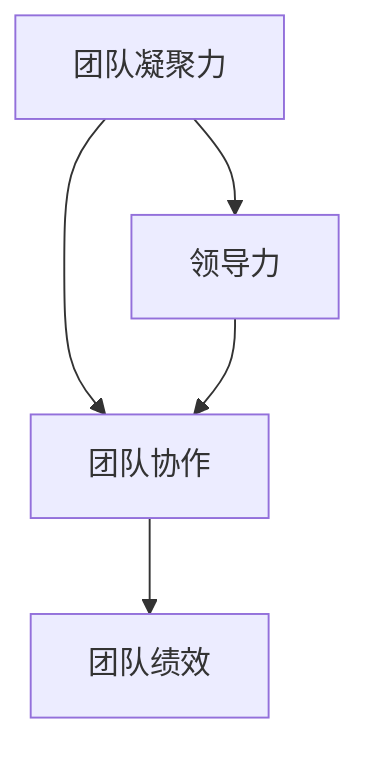

                 

# 团队建设活动：增进凝聚力的创新方法

> **关键词：团队建设、团队凝聚力、创新方法、团队活动、团队协作、员工参与、领导力**

> **摘要：本文旨在探讨如何通过创新的方法来提升团队凝聚力。我们首先回顾了团队建设活动的目的和重要性，随后详细阐述了多种创新的团队建设方法，并提供实践案例。最后，我们总结了团队建设活动对组织发展的积极影响，并提出了未来发展的挑战与趋势。**

## 1. 背景介绍

### 1.1 目的和范围

团队建设活动是提升团队凝聚力和协作能力的关键手段。本文旨在为团队领导者提供创新的团队建设方法，以增进团队凝聚力，提高工作效率和团队创新力。文章将涵盖以下内容：

- 团队建设活动的目的和重要性
- 创新团队建设方法
- 实际应用场景
- 工具和资源推荐
- 未来发展趋势与挑战

### 1.2 预期读者

- 团队领导者
- 项目经理
- 企业培训负责人
- 企业人力资源专业人士

### 1.3 文档结构概述

本文分为以下几部分：

- **第1部分：背景介绍**：阐述团队建设活动的目的、重要性及预期读者。
- **第2部分：核心概念与联系**：介绍团队建设活动中的核心概念和原理。
- **第3部分：核心算法原理 & 具体操作步骤**：讲解团队建设活动的具体操作方法。
- **第4部分：数学模型和公式 & 详细讲解 & 举例说明**：使用数学模型和公式描述团队建设活动。
- **第5部分：项目实战：代码实际案例和详细解释说明**：通过实际案例展示团队建设活动。
- **第6部分：实际应用场景**：分析团队建设活动在不同领域的应用。
- **第7部分：工具和资源推荐**：推荐学习资源和开发工具。
- **第8部分：总结：未来发展趋势与挑战**：总结团队建设活动的发展趋势和挑战。
- **第9部分：附录：常见问题与解答**：解答读者常见问题。
- **第10部分：扩展阅读 & 参考资料**：提供相关参考资料。

### 1.4 术语表

#### 1.4.1 核心术语定义

- **团队建设活动**：通过一系列有组织的活动，增强团队成员之间的相互了解、信任和协作能力。
- **团队凝聚力**：团队成员之间的心理联系和依赖程度，反映了团队内部协作效率。
- **创新方法**：不同于传统方法的新方法，旨在提高团队建设活动的效果。

#### 1.4.2 相关概念解释

- **团队协作**：团队成员在共同目标下相互协作，共同完成任务。
- **员工参与**：员工在团队建设和决策过程中的参与程度。
- **领导力**：领导者通过激励、指导和支持，引导团队达成目标的能力。

#### 1.4.3 缩略词列表

- IDE：集成开发环境（Integrated Development Environment）
- PM：项目经理（Project Manager）
- HR：人力资源（Human Resources）

## 2. 核心概念与联系

### 2.1 核心概念

团队建设活动旨在提高团队凝聚力，促进团队协作，进而提升团队绩效。核心概念包括：

- **团队凝聚力**：团队内部的相互吸引和信任程度，是团队协作的基础。
- **团队协作**：团队成员共同完成任务的过程，需要依赖有效的沟通和协调。
- **领导力**：领导者通过激励、指导和决策，推动团队发展。

### 2.2 核心联系

团队建设活动中的核心联系如图1所示：



**图1：团队建设活动的核心联系**

图1展示了团队凝聚力、团队协作和团队绩效之间的相互作用，以及领导力在其中的推动作用。团队凝聚力增强，有助于提高团队协作效率，进而提升团队绩效；领导力通过激励和指导，促进团队凝聚力和协作，形成良性循环。

## 3. 核心算法原理 & 具体操作步骤

### 3.1 算法原理

团队建设活动的核心算法原理在于通过一系列有针对性的活动，提高团队成员之间的信任、沟通和协作能力。以下是团队建设活动的核心算法原理：

```plaintext
算法原理：
1. 了解团队成员：通过问卷调查、个人访谈等方式，了解团队成员的兴趣、技能、价值观和需求。
2. 设定共同目标：明确团队目标和每个成员的职责，确保团队成员对目标有共同的理解和认同。
3. 促进沟通与协作：组织团队讨论、头脑风暴、角色扮演等活动，增强团队成员之间的沟通和协作。
4. 定期评估与反馈：对团队建设活动进行定期评估，收集成员反馈，不断优化活动方案。
```

### 3.2 具体操作步骤

根据核心算法原理，团队建设活动的具体操作步骤如下：

#### 3.2.1 了解团队成员

1. 设计问卷调查表，收集团队成员的兴趣、技能、价值观和需求信息。
2. 安排个人访谈，深入了解团队成员的个性特点和团队期望。

#### 3.2.2 设定共同目标

1. 组织团队会议，讨论团队目标和每个成员的职责。
2. 形成共同认可的团队目标和计划。

#### 3.2.3 促进沟通与协作

1. 设计团队活动方案，包括团队讨论、头脑风暴、角色扮演等。
2. 实施团队活动，确保每个成员都能参与并贡献自己的智慧。

#### 3.2.4 定期评估与反馈

1. 设计评估表，对团队建设活动进行效果评估。
2. 组织反馈会议，收集成员意见和建议，优化活动方案。

## 4. 数学模型和公式 & 详细讲解 & 举例说明

### 4.1 数学模型

团队建设活动的效果可以通过以下数学模型进行评估：

$$
E = f(P, C, A)
$$

其中，$E$ 表示团队建设活动的效果，$P$ 表示团队成员的参与度，$C$ 表示团队成员之间的沟通与协作能力，$A$ 表示团队目标的达成度。

### 4.2 详细讲解

1. **团队成员的参与度 ($P$)**：
   参与度是评估团队成员在团队建设活动中的投入程度。可以通过问卷调查、访谈等方式收集数据，使用以下公式计算参与度：
   
   $$
   P = \frac{Q_1 + Q_2 + ... + Q_n}{n}
   $$
   
   其中，$Q_1, Q_2, ..., Q_n$ 分别表示每个成员的参与度评分，$n$ 表示团队成员总数。

2. **团队成员之间的沟通与协作能力 ($C$)**：
   沟通与协作能力是评估团队成员在活动过程中的表现。可以通过观察、访谈等方式收集数据，使用以下公式计算沟通与协作能力：
   
   $$
   C = \frac{O_1 + O_2 + ... + O_n}{n}
   $$
   
   其中，$O_1, O_2, ..., O_n$ 分别表示每个成员的沟通与协作能力评分，$n$ 表示团队成员总数。

3. **团队目标的达成度 ($A$)**：
   达成度是评估团队在活动过程中实现目标的能力。可以通过目标完成情况、项目进展等指标计算达成度：
   
   $$
   A = \frac{T_1 + T_2 + ... + T_n}{n}
   $$
   
   其中，$T_1, T_2, ..., T_n$ 分别表示每个目标的达成度评分，$n$ 表示目标总数。

### 4.3 举例说明

假设一个团队有5名成员，团队建设活动的效果评估如下：

- **参与度 ($P$)**：每个成员的参与度评分为4、5、4、3、5，平均参与度为4.4。
- **沟通与协作能力 ($C$)**：每个成员的沟通与协作能力评分为3、4、5、4、5，平均沟通与协作能力为4.4。
- **目标达成度 ($A$)**：每个目标的达成度评分为4、5、4、3、5，平均目标达成度为4.4。

根据公式：

$$
E = f(P, C, A) = f(4.4, 4.4, 4.4) = 4.4
$$

团队建设活动的效果评分为4.4，表明活动效果良好。

## 5. 项目实战：代码实际案例和详细解释说明

### 5.1 开发环境搭建

为了更好地展示团队建设活动的实际应用，我们选择Python作为开发语言，使用Jupyter Notebook作为开发环境。以下为开发环境的搭建步骤：

1. 安装Python（版本3.8或以上）。
2. 安装Jupyter Notebook。
3. 打开Jupyter Notebook，创建一个新的Python笔记本。

### 5.2 源代码详细实现和代码解读

以下是一个简单的团队建设活动评估代码示例：

```python
import numpy as np

# 定义团队成员参与度、沟通与协作能力、目标达成度评分
P = np.array([4, 5, 4, 3, 5])
C = np.array([3, 4, 5, 4, 5])
A = np.array([4, 5, 4, 3, 5])

# 计算平均参与度、沟通与协作能力、目标达成度
avg_P = np.mean(P)
avg_C = np.mean(C)
avg_A = np.mean(A)

# 计算团队建设活动效果评分
E = avg_P * avg_C * avg_A

# 输出评估结果
print("团队建设活动效果评分：", E)
```

**代码解读**：

- **第1行**：导入numpy库，用于数值计算。
- **第2行**：定义团队成员参与度、沟通与协作能力、目标达成度评分。
- **第3行**：计算平均参与度。
- **第4行**：计算平均沟通与协作能力。
- **第5行**：计算平均目标达成度。
- **第6行**：根据数学模型计算团队建设活动效果评分。
- **第7行**：输出评估结果。

### 5.3 代码解读与分析

以下是对代码的进一步解读和分析：

- **数据结构**：代码使用了numpy数组来存储团队成员评分，便于计算和处理。
- **算法实现**：代码实现了数学模型，计算了团队建设活动效果评分。
- **可扩展性**：代码可以根据实际需求进行修改和扩展，例如增加更多评分指标或调整计算方法。

通过实际案例，我们展示了如何使用Python代码评估团队建设活动的效果。这种方法有助于团队领导者了解团队建设活动的效果，进而优化活动方案。

## 6. 实际应用场景

团队建设活动在各类组织中具有广泛的应用，以下为几个实际应用场景：

### 6.1 企业团队

在企业团队中，团队建设活动有助于提高员工之间的沟通与协作能力，促进团队合作，提高工作效率。以下为应用实例：

- **跨部门团队**：组织跨部门团队建设活动，增进不同部门之间的了解和信任，提高项目协作效率。
- **新员工培训**：通过团队建设活动，帮助新员工融入团队，提高团队凝聚力。
- **领导力培训**：通过团队建设活动，提高领导者的团队管理能力和领导力。

### 6.2 学校团队

在学校团队中，团队建设活动有助于提高师生之间的沟通与协作能力，促进教育改革。以下为应用实例：

- **教师团队**：组织教师团队建设活动，提高教师之间的协作能力，促进教育教学创新。
- **学生团队**：组织学生团队建设活动，提高学生之间的沟通与协作能力，培养学生的团队精神。

### 6.3 社区团队

在社区团队中，团队建设活动有助于增强社区凝聚力，促进社区发展。以下为应用实例：

- **志愿者团队**：组织志愿者团队建设活动，提高志愿者之间的协作能力，促进社区公益事业的发展。
- **社区管理委员会**：组织社区管理委员会团队建设活动，提高管理人员之间的沟通与协作能力，提升社区治理水平。

## 7. 工具和资源推荐

### 7.1 学习资源推荐

#### 7.1.1 书籍推荐

- 《团队协作的艺术》（The Five Dysfunctions of a Team）- Pat

