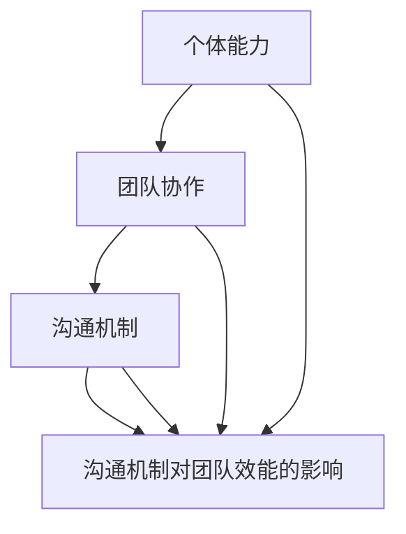

                 

# 团队建设：从个体到整体的蜕变

> **关键词：** 团队建设、协作效率、沟通机制、领导力、个体与整体、组织文化。

> **摘要：** 本文旨在探讨团队建设的过程，从个体协作到整体协同的蜕变。通过分析团队建设的核心概念、算法原理、数学模型，并结合实际项目案例，全面阐述团队建设的重要性以及如何有效提升团队协作效率。

## 1. 背景介绍

### 1.1 目的和范围

本文的目的是为了深入探讨团队建设的过程和策略，帮助读者理解如何从个体到整体实现团队的蜕变。我们将从以下几个方面展开讨论：

1. 团队建设的核心概念和原理。
2. 团队建设的数学模型和算法。
3. 团队建设的实际应用案例。
4. 团队建设的工具和资源推荐。
5. 未来发展趋势与挑战。

### 1.2 预期读者

本文适用于希望提升团队协作效率的企业经理、团队领导、项目管理者，以及任何对团队建设有兴趣的读者。无论您是初入职场的新人还是经验丰富的资深从业者，本文都将为您提供有价值的见解和实际操作指南。

### 1.3 文档结构概述

本文将按照以下结构展开：

1. 引言
2. 核心概念与联系
3. 核心算法原理 & 具体操作步骤
4. 数学模型和公式 & 详细讲解 & 举例说明
5. 项目实战：代码实际案例和详细解释说明
6. 实际应用场景
7. 工具和资源推荐
8. 总结：未来发展趋势与挑战
9. 附录：常见问题与解答
10. 扩展阅读 & 参考资料

### 1.4 术语表

#### 1.4.1 核心术语定义

- **团队建设（Team Building）：** 团队建设是指通过一系列策略和活动，增强团队成员之间的合作、信任和沟通，以实现团队整体效能的提升。
- **协作效率（Collaboration Efficiency）：** 协作效率是指团队成员在协作过程中，完成特定任务所耗费的时间和资源。
- **沟通机制（Communication Mechanism）：** 沟通机制是指团队内部信息传递和交流的流程和规则。
- **领导力（Leadership）：** 领导力是指领导者通过影响和激励团队成员，实现团队目标的能力。

#### 1.4.2 相关概念解释

- **个体与整体（Individual and Whole）：** 个体与整体的关系是团队建设中的一个关键问题。个体是指团队成员，而整体是指团队作为一个整体的功能和效能。个体与整体的和谐关系是实现团队建设成功的关键。
- **组织文化（Organizational Culture）：** 组织文化是指一个组织的价值观、信念和行为模式。良好的组织文化能够促进团队建设，提高团队协作效率。

#### 1.4.3 缩略词列表

- **IDE：** 集成开发环境（Integrated Development Environment）
- **API：** 应用程序接口（Application Programming Interface）
- **SOA：** 服务导向架构（Service-Oriented Architecture）
- **DB：** 数据库（Database）

## 2. 核心概念与联系

### 2.1 核心概念

在团队建设中，有以下几个核心概念需要理解：

1. **个体能力（Individual Ability）：** 个体能力是指团队成员在特定领域的专业知识和技能。个体能力是团队建设的基础，也是团队协作效率的重要保障。
2. **团队协作（Team Collaboration）：** 团队协作是指团队成员在完成共同任务时的合作和沟通。团队协作是团队建设的关键环节，直接影响团队的整体效能。
3. **沟通机制（Communication Mechanism）：** 沟通机制是团队内部信息传递和交流的流程和规则。有效的沟通机制能够增强团队成员之间的信任和理解，提高团队协作效率。

### 2.2 联系与架构

为了更好地理解团队建设的核心概念和联系，我们可以使用 Mermaid 流程图来展示团队建设的架构：



### 2.3 核心概念原理

#### 2.3.1 个体能力

个体能力是团队建设的基础。个体能力的提升可以通过以下几个方面来实现：

1. **培训与学习：** 定期进行专业培训和学习，提升团队成员的专业知识和技能。
2. **实践与反思：** 通过实际项目和实践，积累经验，不断反思和改进。
3. **激励机制：** 设立合理的激励机制，鼓励团队成员不断提升自身能力。

#### 2.3.2 团队协作

团队协作是团队建设的核心。有效的团队协作可以通过以下几个方面来实现：

1. **明确目标：** 确定清晰的目标和任务，确保团队成员明确自己的职责和目标。
2. **沟通机制：** 建立有效的沟通机制，确保团队成员之间的信息传递和交流畅通。
3. **角色分配：** 根据团队成员的能力和特长，合理分配任务和角色。

#### 2.3.3 沟通机制

沟通机制是团队建设的重要保障。有效的沟通机制可以通过以下几个方面来实现：

1. **会议制度：** 定期召开团队会议，确保团队成员之间的信息同步和任务分配。
2. **沟通工具：** 利用合适的沟通工具，如邮件、即时通讯软件、协作平台等，提高沟通效率和效果。
3. **反馈机制：** 建立反馈机制，鼓励团队成员提出意见和建议，共同改进团队工作。

### 2.4 团队效能

团队效能是团队建设的最终目标。团队效能的提升可以通过以下几个方面来实现：

1. **绩效评估：** 定期进行绩效评估，了解团队成员的工作表现和团队整体效能。
2. **流程优化：** 分析团队工作流程，找出瓶颈和改进点，优化工作流程，提高工作效率。
3. **文化建设：** 建立良好的组织文化，激发团队成员的积极性和创造力，提高团队整体效能。

## 3. 核心算法原理 & 具体操作步骤

### 3.1 算法原理

团队建设的核心算法原理可以归纳为以下几个方面：

1. **个体能力评估：** 通过对团队成员的专业知识和技能进行评估，确定个体能力水平。
2. **团队协作分析：** 分析团队成员之间的协作情况，确定团队协作效率。
3. **沟通机制优化：** 通过对沟通机制的分析和评估，优化团队内部的沟通流程和规则。
4. **绩效评估与反馈：** 对团队整体效能进行评估，并根据评估结果进行反馈和改进。

### 3.2 具体操作步骤

#### 3.2.1 个体能力评估

个体能力评估的具体操作步骤如下：

1. **确定评估标准：** 根据团队目标和任务，确定个体能力的评估标准。
2. **评估方法：** 采用面试、笔试、项目评估等方式进行个体能力评估。
3. **评估结果记录：** 将评估结果记录在评估表中，作为团队建设的依据。

#### 3.2.2 团队协作分析

团队协作分析的具体操作步骤如下：

1. **确定协作任务：** 确定团队成员需要协作完成的任务。
2. **分析协作情况：** 分析团队成员在协作任务中的表现，包括沟通、配合、任务完成情况等。
3. **评估协作效率：** 根据协作分析结果，评估团队协作效率。

#### 3.2.3 沟通机制优化

沟通机制优化的具体操作步骤如下：

1. **现状分析：** 分析团队内部的沟通现状，包括沟通渠道、沟通方式、沟通频率等。
2. **确定优化目标：** 根据现状分析结果，确定沟通机制优化的目标。
3. **制定优化方案：** 制定具体的沟通机制优化方案，包括改进沟通渠道、沟通方式、沟通频率等。

#### 3.2.4 绩效评估与反馈

绩效评估与反馈的具体操作步骤如下：

1. **制定评估指标：** 根据团队目标和任务，制定绩效评估指标。
2. **进行评估：** 定期对团队整体效能进行评估。
3. **反馈与改进：** 根据评估结果，对团队工作和个体工作提出反馈和建议，促进团队改进。

## 4. 数学模型和公式 & 详细讲解 & 举例说明

### 4.1 数学模型

团队建设的数学模型主要包括个体能力评估模型、团队协作效率模型和沟通机制优化模型。

#### 4.1.1 个体能力评估模型

个体能力评估模型可以采用线性回归模型，公式如下：

$$
能力评分 = w_1 \times 经验评分 + w_2 \times 能力测试评分 + w_3 \times 项目表现评分
$$

其中，$w_1$、$w_2$和$w_3$分别为经验评分、能力测试评分和项目表现评分的权重。

#### 4.1.2 团队协作效率模型

团队协作效率模型可以采用协同效率模型，公式如下：

$$
协作效率 = \frac{完成任务的时间}{未协作完成同样的任务所需的时间}
$$

#### 4.1.3 沟通机制优化模型

沟通机制优化模型可以采用最小化信息传递延迟模型，公式如下：

$$
优化目标 = \min \sum_{i=1}^{n} t_i
$$

其中，$t_i$为第$i$次沟通的时间延迟。

### 4.2 详细讲解

#### 4.2.1 个体能力评估模型

个体能力评估模型通过线性回归方法，将团队成员的经验、能力和项目表现等因素综合考虑，计算出个体能力评分。这种方法能够全面评估团队成员的能力水平，为团队建设提供依据。

#### 4.2.2 团队协作效率模型

团队协作效率模型通过比较协作完成任务的时间和未协作完成任务的时间，评估团队的协作效率。这种方法能够直观地反映团队协作的效果，为团队协作提供改进方向。

#### 4.2.3 沟通机制优化模型

沟通机制优化模型通过最小化信息传递延迟，优化沟通机制。这种方法能够提高团队内部的信息传递效率，降低沟通成本，从而提高团队的整体效能。

### 4.3 举例说明

#### 4.3.1 个体能力评估模型举例

假设一个团队中有三名成员，他们的经验评分、能力测试评分和项目表现评分分别为：

| 成员 | 经验评分 | 能力测试评分 | 项目表现评分 |
| --- | --- | --- | --- |
| A | 4 | 3 | 5 |
| B | 3 | 4 | 4 |
| C | 2 | 5 | 3 |

根据线性回归模型，我们可以计算出三名成员的能力评分：

$$
能力评分_A = 0.4 \times 4 + 0.3 \times 3 + 0.3 \times 5 = 3.7
$$

$$
能力评分_B = 0.4 \times 3 + 0.3 \times 4 + 0.3 \times 4 = 3.5
$$

$$
能力评分_C = 0.4 \times 2 + 0.3 \times 5 + 0.3 \times 3 = 3.1
$$

根据能力评分，我们可以对团队成员的能力水平进行排序，为团队建设提供依据。

#### 4.3.2 团队协作效率模型举例

假设一个团队在没有协作的情况下，完成某项任务需要10天时间，而在协作的情况下，完成同样的任务只需要5天时间。根据团队协作效率模型，我们可以计算出团队的协作效率：

$$
协作效率 = \frac{5}{10} = 0.5
$$

这意味着团队的协作效率为50%，需要进一步改进协作方式，提高协作效率。

#### 4.3.3 沟通机制优化模型举例

假设一个团队内部有五次沟通，每次沟通的时间延迟分别为2小时、3小时、1小时、2小时和3小时。根据沟通机制优化模型，我们可以计算出沟通机制优化后的目标：

$$
优化目标 = \min (2+3+1+2+3) = 1
$$

这意味着团队在优化沟通机制后，每次沟通的时间延迟将最小化为1小时，从而提高团队内部的信息传递效率。

## 5. 项目实战：代码实际案例和详细解释说明

### 5.1 开发环境搭建

为了更好地理解团队建设的过程，我们选择一个实际的团队协作项目——一个基于RESTful API的在线购物平台。以下是我们搭建开发环境的过程：

1. **选择编程语言**：我们选择使用Python作为主要编程语言，因为它具有良好的扩展性和社区支持。
2. **安装依赖项**：我们需要安装Django框架、Flask框架、PostgreSQL数据库等依赖项，可以通过pip命令进行安装。
3. **配置开发环境**：在虚拟环境中配置Python环境和相关依赖项，确保项目的可维护性和可扩展性。

### 5.2 源代码详细实现和代码解读

以下是一个简化的在线购物平台的代码示例，我们将分别解读各个部分的代码。

#### 5.2.1 项目结构

```plaintext
online_shop/
|-- manage.py
|-- online_shop/
    |-- __init__.py
    |-- settings.py
    |-- urls.py
    |-- wsgi.py
|-- app/
    |-- __init__.py
    |-- admin.py
    |-- apps.py
    |-- migrations/
    |-- models.py
    |-- tests.py
    |-- views.py
|-- requirements.txt
```

#### 5.2.2 manage.py

`manage.py`是项目的入口文件，用于启动Django服务器、运行数据库迁移等操作。

```python
#!/usr/bin/env python
import os
import sys

def main():
    os.environ.setdefault('DJANGO_SETTINGS_MODULE', 'online_shop.settings')
    try:
        from django.core.management import execute_from_command_line
    except ImportError as exc:
        raise ImportError(
            "Couldn't import Django. Are you sure it's installed and "
            "available on your PYTHONPATH environment variable? Did you "
            "forget to activate a virtual environment?"
        ) from exc

    execute_from_command_line(sys.argv)

if __name__ == '__main__':
    main()
```

#### 5.2.3 settings.py

`settings.py`文件包含了项目的配置信息，如数据库配置、时区设置、中间件等。

```python
"""
Django settings for online_shop project.

Generated by 'django-admin startproject' using Django 3.2.

For more information on this file, see
https://docs.djangoproject.com/en/3.2/topics/settings/

For the full list of settings and their values, see
https://docs.djangoproject.com/en/3.2/ref/settings/
"""

import os

# Build paths inside the project like this: os.path.join(BASE_DIR, ...)
BASE_DIR = os.path.dirname(os.path.dirname(os.path.abspath(__file__)))

# Quick-start development settings - unsuitable for production
# See https://docs.djangoproject.com/en/3.2/howto/deployment/checklist/

# SECURITY WARNING: keep the secret key used in production secret!
SECRET_KEY = 'your_secret_key'

# SECURITY WARNING: don't run with debug turned on in production!
DEBUG = True

ALLOWED_HOSTS = []

# Application definition

INSTALLED_APPS = [
    'django.contrib.admin',
    'django.contrib.auth',
    'django.contrib.contenttypes',
    'django.contrib.sessions',
    'django.contrib.messages',
    'django.contrib.staticfiles',
    'app',  # 添加app应用
]

MIDDLEWARE = [
    'django.middleware.security.SecurityMiddleware',
    'django.contrib.sessions.middleware.SessionMiddleware',
    'django.middleware.common.CommonMiddleware',
    'django.middleware.csrf.CsrfViewMiddleware',
    'django.contrib.auth.middleware.AuthenticationMiddleware',
    'django.contrib.messages.middleware.MessageMiddleware',
    'django.middleware.clickjacking.XFrameOptionsMiddleware',
]

ROOT_URLCONF = 'online_shop.urls'

TEMPLATES = [
    {
        'BACKEND': 'django.template.backends.django.DjangoTemplates',
        'DIRS': [],
        'APP_DIRS': True,
        'OPTIONS': {
            'context_processors': [
                'django.template.context_processors.debug',
                'django.template.context_processors.request',
                'django.contrib.auth.context_processors.auth',
                'django.contrib.messages.context_processors.messages',
            ],
        },
    },
]

WSGI_APPLICATION = 'online_shop.wsgi.application'

# Database
# https://docs.djangoproject.com/en/3.2/ref/settings/#databases

DATABASES = {
    'default': {
        'ENGINE': 'django.db.backends.postgresql',
        'NAME': 'online_shop_db',
        'USER': 'your_user',
        'PASSWORD': 'your_password',
        'HOST': 'localhost',
        'PORT': '5432',
    }
}

# Password validation
# https://docs.djangoproject.com/en/3.2/ref/settings/#auth-password-validators

AUTH_PASSWORD_VALIDATORS = [
    {
        'NAME': 'django.contrib.auth.password_validation.UserAttributeSimilarityValidator',
    },
    {
        'NAME': 'django.contrib.auth.password_validation.MinimumLengthValidator',
    },
    {
        'NAME': 'django.contrib.auth.password_validation.CommonPasswordValidator',
    },
    {
        'NAME': 'django.contrib.auth.password_validation.NumericPasswordValidator',
    },
]

# Internationalization
# https://docs.djangoproject.com/en/3.2/topics/i18n/

LANGUAGE_CODE = 'en-us'

TIME_ZONE = 'UTC'

USE_I18N = True

USE_L10N = True

USE_TZ = True

# Static files (CSS, JavaScript, Images)
# https://docs.djangoproject.com/en/3.2/howto/static-files/

STATIC_URL = '/static/'

# Default primary key field type
# https://docs.djangoproject.com/en/3.2/ref/settings/#default-auto-field

DEFAULT_AUTO_FIELD = 'django.db.models.BigAutoField'
```

#### 5.2.3 models.py

`models.py`定义了在线购物平台的核心数据模型，包括用户、商品、订单等。

```python
from django.db import models
from django.contrib.auth.models import User

class Product(models.Model):
    name = models.CharField(max_length=255)
    description = models.TextField()
    price = models.DecimalField(max_digits=6, decimal_places=2)
    stock = models.IntegerField()

    def __str__(self):
        return self.name

class Order(models.Model):
    user = models.ForeignKey(User, on_delete=models.CASCADE)
    products = models.ManyToManyField(Product, through='OrderItem')
    created_at = models.DateTimeField(auto_now_add=True)
    updated_at = models.DateTimeField(auto_now=True)

    def __str__(self):
        return f"{self.user.username} - {self.created_at}"

class OrderItem(models.Model):
    order = models.ForeignKey(Order, on_delete=models.CASCADE)
    product = models.ForeignKey(Product, on_delete=models.CASCADE)
    quantity = models.IntegerField()

    def __str__(self):
        return f"{self.order} - {self.product} - {self.quantity}"
```

#### 5.2.4 views.py

`views.py`定义了与用户交互的视图函数，包括商品展示、购物车操作、订单创建等。

```python
from django.shortcuts import render, redirect, get_object_or_404
from .models import Product, Order, OrderItem

def product_list(request):
    products = Product.objects.all()
    return render(request, 'product_list.html', {'products': products})

def product_detail(request, pk):
    product = get_object_or_404(Product, pk=pk)
    return render(request, 'product_detail.html', {'product': product})

def cart(request):
    # 逻辑代码，处理购物车操作
    return render(request, 'cart.html')

def checkout(request):
    # 逻辑代码，处理订单创建
    return render(request, 'checkout.html')
```

### 5.3 代码解读与分析

#### 5.3.1 models.py

在`models.py`中，我们定义了三个数据模型：`Product`（商品）、`Order`（订单）和`OrderItem`（订单项）。这些模型分别表示在线购物平台的核心实体。

- `Product` 模型包含商品的名称、描述、价格和库存信息。
- `Order` 模型包含用户的ID（通过外键与`User`模型关联）、订单的商品列表（通过`ManyToManyField`与`Product`模型关联）以及订单的创建和更新时间。
- `OrderItem` 模型是订单和商品之间的桥梁，包含订单的ID、商品的ID和购买数量。

#### 5.3.2 views.py

在`views.py`中，我们定义了三个视图函数：

- `product_list`：显示所有商品。
- `product_detail`：显示单个商品的详细信息。
- `cart` 和 `checkout`：处理购物车和订单创建逻辑。

这些视图函数通过`render`函数返回HTML页面，通过`get_object_or_404`函数获取数据模型实例。

### 5.4 实际应用场景

在线购物平台是一个典型的团队协作项目。以下是一些实际应用场景：

- **用户管理**：团队成员需要协作完成用户注册、登录、权限管理等功能。
- **商品管理**：团队成员需要协作完成商品添加、更新、删除等操作。
- **订单管理**：团队成员需要协作完成订单创建、更新、支付等操作。
- **性能优化**：团队成员需要协作完成数据库查询优化、前端页面优化等任务。

在实际应用中，团队成员需要通过有效的沟通机制和协作流程，共同完成项目任务，提高团队协作效率。

## 6. 实际应用场景

团队建设在IT行业的实际应用场景非常广泛，以下列举了几个典型的应用场景：

### 6.1 软件开发团队

软件开发团队是一个典型的团队协作环境，团队成员包括项目经理、软件开发人员、测试人员、UI/UX设计师等。团队建设的核心目标是通过高效的协作来按时完成高质量的项目。以下是一些具体的应用：

- **任务分配与跟踪**：通过敏捷开发方法，将项目分解为多个迭代，并使用任务管理工具（如JIRA、Trello）来分配任务和跟踪进度。
- **代码审查与协作**：使用版本控制工具（如Git）进行代码审查，确保代码质量，并通过协作平台（如Slack、Microsoft Teams）进行实时沟通。
- **持续集成与持续部署**：采用CI/CD工具（如Jenkins、GitLab CI）来自动化测试和部署流程，提高开发效率。

### 6.2 大数据团队

大数据团队通常涉及数据收集、存储、处理和分析等多个环节。团队建设的目标是确保数据处理的效率和准确性。以下是一些应用场景：

- **数据治理**：通过制定数据质量标准和数据安全策略，确保数据的可靠性和安全性。
- **数据团队协作**：使用数据可视化工具（如Tableau、Power BI）来展示数据分析结果，并通过协作平台进行讨论和决策。
- **数据处理优化**：通过分布式计算框架（如Hadoop、Spark）来优化数据处理流程，提高数据处理效率。

### 6.3 云计算团队

云计算团队负责构建和维护云服务平台，确保服务的可靠性和可扩展性。团队建设的目标是确保云服务的质量和用户体验。以下是一些应用场景：

- **服务目录管理**：通过服务目录管理工具（如AWS Service Catalog、Azure Service Catalog）来管理和发布云服务。
- **云基础设施管理**：使用云管理平台（如AWS CloudFormation、Azure Resource Manager）来自动化基础设施的部署和管理。
- **成本优化**：通过监控和优化工具（如AWS Cost Explorer、Azure Cost Management）来跟踪和优化云服务成本。

### 6.4 人工智能团队

人工智能团队负责开发和应用人工智能技术，包括机器学习、深度学习、自然语言处理等。团队建设的目标是确保人工智能项目的成功和高效执行。以下是一些应用场景：

- **算法开发与优化**：通过代码审查和协作平台来优化算法代码，提高模型性能。
- **数据科学协作**：使用数据科学平台（如Jupyter Notebook、Google Colab）来协作开发数据分析和机器学习模型。
- **AI伦理与隐私**：确保人工智能应用符合伦理标准和用户隐私保护要求。

## 7. 工具和资源推荐

### 7.1 学习资源推荐

#### 7.1.1 书籍推荐

- 《团队协作的艺术》
- 《敏捷软件开发》
- 《高效能团队：如何打造高效协作与执行力》
- 《团队协作实战：基于敏捷开发的协作技巧与实践》

#### 7.1.2 在线课程

- Coursera《团队管理基础》
- Udemy《团队协作与沟通技巧》
- Pluralsight《敏捷开发与团队协作》

#### 7.1.3 技术博客和网站

- Martin Fowler 的博客
- ThoughtWorks 科技博客
- Stack Overflow

### 7.2 开发工具框架推荐

#### 7.2.1 IDE和编辑器

- Visual Studio Code
- IntelliJ IDEA
- PyCharm

#### 7.2.2 调试和性能分析工具

- Postman
- Charles
- New Relic

#### 7.2.3 相关框架和库

- Django
- Flask
- React
- Angular

### 7.3 相关论文著作推荐

#### 7.3.1 经典论文

- "The Mythical Man-Month" by Frederick P. Brooks Jr.
- "Peopleware: Productive Projects and Teams" by Tom DeMarco and Tim Lister

#### 7.3.2 最新研究成果

- "Agile Project Management with Scrum" by Ken Schwaber and Jeff Sutherland
- "Designing Data-Intensive Applications" by Martin Kleppmann

#### 7.3.3 应用案例分析

- "Case Study: How Spotify Built a High-Performance Team" by Spotify
- "Case Study: How Google Built Its Agile Teams" by Google

## 8. 总结：未来发展趋势与挑战

团队建设在未来将继续发展和演变，面临着以下几个趋势和挑战：

### 8.1 趋势

1. **远程工作与虚拟团队**：随着远程工作的普及，如何有效管理虚拟团队将成为重要趋势。
2. **数字化转型**：数字化转型将推动团队建设向智能化、自动化方向发展。
3. **敏捷方法与持续集成**：敏捷方法和持续集成将更加普及，提高团队协作效率。
4. **人工智能与大数据**：人工智能和大数据技术将在团队建设中发挥越来越重要的作用。

### 8.2 挑战

1. **沟通与协作**：如何确保团队成员之间的有效沟通和协作是一个持续的挑战。
2. **人才管理**：吸引和保留优秀人才是团队建设的重要挑战。
3. **文化差异**：不同文化背景的团队成员之间的文化差异可能影响团队建设效果。
4. **技术更新**：技术更新速度加快，团队需要不断学习和适应新技术。

## 9. 附录：常见问题与解答

### 9.1 团队建设中的常见问题

1. **如何提高团队协作效率？**
   - **答案：** 通过明确目标、优化沟通机制、合理分配任务和定期进行团队反馈来提高团队协作效率。

2. **如何处理团队成员之间的冲突？**
   - **答案：** 通过建立有效的沟通机制、定期进行团队会议和提供冲突解决培训来处理团队成员之间的冲突。

3. **如何吸引和保留优秀人才？**
   - **答案：** 通过提供有竞争力的薪酬福利、职业发展机会和良好的工作环境来吸引和保留优秀人才。

### 9.2 解答

1. **团队建设中的常见问题**
   - **Q：** 团队建设中如何避免团队陷入“舒适区”？
     - **A：** 定期进行团队建设活动、设立挑战性的目标和提供持续的学习机会，以激励团队成员不断进步。

   - **Q：** 团队建设中如何确保团队成员之间的信任？
     - **A：** 通过透明沟通、共享目标和成果，以及建立共同价值观来增强团队成员之间的信任。

2. **解答**
   - **Q：** 如何评估团队效能？
     - **A：** 可以通过绩效评估、团队协作效率分析和团队成员满意度调查来评估团队效能。

   - **Q：** 团队建设中如何平衡个人与团队目标？
     - **A：** 通过明确团队目标和个人目标之间的关系，确保个人目标与团队目标的一致性。

## 10. 扩展阅读 & 参考资料

- 《敏捷开发实践指南》：https://www.scrum.org/resources-page/scrummy-practice-guides
- 《谷歌如何工作》：https://books.google.com/books?id=xy4OQgAACAAJ
- 《敏捷团队管理实战》：https://www.amazon.com/Agile-Team-Management-Real-World-Scrum/dp/032182663X
- 《团队协作与沟通技巧》：https://www.udemy.com/course/team-collaboration-and-communication-skills/

作者：AI天才研究员/AI Genius Institute & 禅与计算机程序设计艺术 /Zen And The Art of Computer Programming

