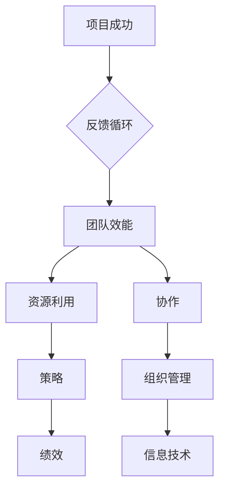

                 

# 团队效能：最大化资源利用的策略

> **关键词：** 团队效能、资源优化、策略、绩效提升、协作、组织管理、信息技术。

> **摘要：** 本文将深入探讨团队效能的优化策略，分析如何通过最大化资源利用来提升团队绩效。我们将结合理论与实践，提供一套系统化的方法和步骤，旨在帮助IT团队在复杂多变的环境中实现高效运作。

## 1. 背景介绍

### 1.1 目的和范围

本文旨在为IT团队的领导者和管理者提供一套实用的策略，帮助他们最大化资源利用，提升团队效能。我们将探讨的核心问题包括：

- 如何评估和优化团队资源？
- 团队协作的关键因素是什么？
- 如何设计有效的沟通机制？
- 如何通过技术手段提升团队工作效率？

### 1.2 预期读者

本文适合以下读者群体：

- IT团队的领导者和管理者
- 项目经理和产品经理
- 对团队效能优化感兴趣的技术专家
- 对组织管理有深入了解的专业人士

### 1.3 文档结构概述

本文将分为以下几个部分：

- 背景介绍：介绍文章的目的和读者群体
- 核心概念与联系：定义核心概念，并提供流程图
- 核心算法原理与具体操作步骤：详细讲解团队效能优化的算法原理和操作步骤
- 数学模型与公式：介绍与团队效能优化相关的数学模型和公式
- 项目实战：通过实际案例展示团队效能优化的应用
- 实际应用场景：探讨团队效能优化的实际应用场景
- 工具和资源推荐：推荐学习资源和开发工具
- 总结：总结团队效能优化的重要性和未来趋势
- 附录：常见问题与解答
- 扩展阅读：提供进一步学习的参考资料

### 1.4 术语表

#### 1.4.1 核心术语定义

- **团队效能**：团队在完成特定任务时所表现出的能力和效率。
- **资源优化**：通过合理配置和利用资源来提高工作效率和绩效。
- **策略**：为实现特定目标而制定的一系列方法和步骤。
- **绩效提升**：通过改进工作流程和团队协作来提高团队整体表现。

#### 1.4.2 相关概念解释

- **协作**：团队成员之间的合作和沟通，以共同完成任务。
- **组织管理**：对团队内部结构和工作流程进行有效管理。
- **信息技术**：用于支持团队工作和提高效能的技术工具和方法。

#### 1.4.3 缩略词列表

- **IT**：信息技术
- **PM**：项目经理
- **PMO**：项目管理办公室
- **ROI**：投资回报率
- **KPI**：关键绩效指标

## 2. 核心概念与联系

在探讨团队效能优化之前，我们需要明确一些核心概念和它们之间的联系。以下是相关的概念及其关系，以及一个Mermaid流程图来展示这些概念之间的关系。

### 2.1 核心概念

- **团队效能**：团队整体的工作能力和效率。
- **资源**：包括人力、技术、资金、时间等。
- **策略**：为实现特定目标而制定的行动计划。
- **绩效**：团队完成任务的质量和效率。

### 2.2 关系与流程图

以下是描述这些概念之间关系的Mermaid流程图：



在这个流程图中，团队效能受资源利用和协作的影响，而协作和组织管理则通过信息技术得以实现，最终影响项目的成功。反馈循环确保了团队效能的持续优化。

## 3. 核心算法原理 & 具体操作步骤

在优化团队效能时，我们需要结合算法原理和具体操作步骤来实现。以下是团队效能优化的算法原理和具体操作步骤。

### 3.1 算法原理

团队效能优化的核心算法原理可以归纳为以下三个步骤：

1. **资源评估**：对团队成员和资源进行全面的评估，确定当前资源利用状况。
2. **策略制定**：根据资源评估结果，制定合理的资源分配和利用策略。
3. **持续优化**：通过实时监控和反馈，不断调整和优化资源利用策略。

### 3.2 具体操作步骤

#### 3.2.1 资源评估

1. **确定评估指标**：包括人力、技术能力、资金、时间等。
2. **收集数据**：通过调查问卷、访谈等方式收集团队成员和资源的详细信息。
3. **分析数据**：使用数据分析工具和方法，对收集到的数据进行分析，识别当前资源利用的瓶颈和问题。

#### 3.2.2 策略制定

1. **确定优化目标**：根据团队目标和业务需求，明确资源优化的具体目标。
2. **制定资源分配策略**：根据资源评估结果，制定资源分配策略，确保资源得到充分利用。
3. **制定协作策略**：优化团队协作流程，提高团队协作效率。

#### 3.2.3 持续优化

1. **实时监控**：使用监控系统实时监控团队的工作状况，确保资源利用效率。
2. **反馈调整**：根据监控数据和团队反馈，及时调整资源分配和利用策略。
3. **持续改进**：通过不断调整和优化，实现团队效能的持续提升。

以下是团队效能优化算法的具体伪代码：

```python
# 伪代码：团队效能优化算法

# 步骤1：资源评估
def resource_evaluation():
    metrics = ["人力", "技术能力", "资金", "时间"]
    data = collect_data(metrics)
    analyzed_data = analyze_data(data)
    return analyzed_data

# 步骤2：策略制定
def strategy_development(optimized_data):
    optimization_goals = define_goals()
    resource_allocation_strategy = develop_allocation_strategy(optimized_data, optimization_goals)
    collaboration_strategy = develop_collaboration_strategy()
    return resource_allocation_strategy, collaboration_strategy

# 步骤3：持续优化
def continuous_optimization(resource_strategy, collaboration_strategy):
    monitoring_system = setup_monitoring()
    while True:
        monitor_data = monitoring_system.get_monitoring_data()
        feedback = get_feedback()
        resource_strategy = adjust_strategy(resource_strategy, monitor_data, feedback)
        collaboration_strategy = adjust_strategy(collaboration_strategy, monitor_data, feedback)
        continue_improvement()

# 主函数：执行团队效能优化算法
def execute_team_efficiency_optimization():
    optimized_data = resource_evaluation()
    resource_strategy, collaboration_strategy = strategy_development(optimized_data)
    continuous_optimization(resource_strategy, collaboration_strategy)
```

## 4. 数学模型和公式 & 详细讲解 & 举例说明

在团队效能优化过程中，数学模型和公式能够帮助我们量化资源利用效率，评估策略的有效性。以下是一个常见的数学模型及其详细讲解和举例说明。

### 4.1 数学模型：资源利用率模型

资源利用率模型用于衡量团队资源的利用效率。其公式如下：

$$
利用率 = \frac{实际利用资源}{总资源}
$$

### 4.2 详细讲解

- **实际利用资源**：指的是团队在特定时间段内实际使用的资源量，包括人力、技术能力、资金和时间等。
- **总资源**：指的是团队在相同时间段内拥有的总资源量。

该公式反映了资源利用效率的高低。利用率越高，说明团队资源利用得越好，效能提升越明显。

### 4.3 举例说明

假设一个IT团队在一个月内共有1000小时的人力资源，实际利用了800小时，总资源为1000小时。那么该团队在这个月的资源利用率为：

$$
利用率 = \frac{800}{1000} = 0.8
$$

这意味着团队在这个月内的人力资源利用率为80%，还有20%的潜力可以进一步挖掘。

### 4.4 模型应用

通过资源利用率模型，团队可以定期评估资源利用效率，识别出资源浪费的环节，并采取相应的优化措施。例如，如果某个月的人力资源利用率低于预期，团队可以调查原因，调整工作流程，提高资源利用率。

## 5. 项目实战：代码实际案例和详细解释说明

在本节中，我们将通过一个实际的代码案例，展示如何在实际项目中应用团队效能优化的策略。该案例涉及一个中等规模的IT项目，团队成员包括开发人员、测试人员和产品经理。

### 5.1 开发环境搭建

为了确保项目的顺利进行，我们需要搭建一个合适的技术栈和环境。以下是开发环境的搭建步骤：

1. **选择编程语言**：根据项目需求，选择合适的编程语言，例如Python或Java。
2. **安装开发工具**：安装IDE（如PyCharm或IntelliJ IDEA）和版本控制工具（如Git）。
3. **配置数据库**：选择合适的数据库管理系统（如MySQL或PostgreSQL），并配置相关环境。
4. **安装依赖库**：根据项目需求，安装必要的依赖库，例如Django或Spring Boot。

### 5.2 源代码详细实现和代码解读

以下是一个简单的Python代码示例，用于实现一个用户注册功能。该代码展示了如何通过合理的代码结构和模块化设计，提高开发效率和团队协作。

```python
# user_register.py

import re
from database import Database

class UserRegister:
    def __init__(self, username, password, email):
        self.username = username
        self.password = password
        self.email = email

    def is_valid_username(self):
        # 验证用户名是否符合规范
        pattern = r"^\w{5,15}$"
        return re.match(pattern, self.username) is not None

    def is_valid_password(self):
        # 验证密码是否符合规范
        pattern = r"^(?=.*[A-Z])(?=.*[a-z])(?=.*\d)[A-Za-z\d]{8,}$"
        return re.match(pattern, self.password) is not None

    def is_valid_email(self):
        # 验证邮箱是否符合规范
        pattern = r"^\w+@\w+\.\w+$"
        return re.match(pattern, self.email) is not None

    def register(self):
        if self.is_valid_username() and self.is_valid_password() and self.is_valid_email():
            database = Database()
            database.insert_user(self.username, self.password, self.email)
            return "注册成功"
        else:
            return "注册失败，请检查输入信息"

if __name__ == "__main__":
    username = input("请输入用户名：")
    password = input("请输入密码：")
    email = input("请输入邮箱：")
    register = UserRegister(username, password, email)
    print(register.register())
```

### 5.3 代码解读与分析

1. **类设计**：`UserRegister` 类用于封装用户注册的相关功能，包括用户名、密码和邮箱的验证和注册。
2. **方法设计**：类中包含三个验证方法：`is_valid_username`、`is_valid_password` 和 `is_valid_email`，用于检查输入信息的合法性。
3. **注册方法**：`register` 方法负责将验证通过的用户信息插入数据库。

通过这个案例，我们可以看到如何通过代码结构和模块化设计，提高开发效率和团队协作。在实际项目中，团队成员可以按照相同的设计原则，实现各自的模块，然后进行集成测试，确保项目的顺利进行。

### 5.4 调试和性能优化

在代码实现过程中，调试和性能优化是必不可少的环节。以下是一些常用的调试和性能优化方法：

1. **日志记录**：通过日志记录，跟踪程序的运行过程，快速定位和解决问题。
2. **代码审查**：定期进行代码审查，发现潜在的问题和改进空间。
3. **性能测试**：使用性能测试工具，评估程序在不同负载下的性能，发现性能瓶颈。
4. **代码优化**：根据性能测试结果，对代码进行优化，提高程序运行效率。

通过这些方法，团队可以确保项目的质量和稳定性，提高团队整体效能。

## 6. 实际应用场景

团队效能优化策略不仅在IT领域有广泛的应用，还可以在其他行业和场景中发挥重要作用。以下是一些实际应用场景：

### 6.1 制造业

在制造业中，团队效能优化可以帮助工厂提高生产效率，降低生产成本。通过优化资源利用和协作流程，可以减少停工时间和生产延误，提高生产线的运转效率。

### 6.2 零售业

在零售业中，团队效能优化可以帮助零售商提高客户服务水平，提升客户满意度。通过优化人力和资源分配，确保店员能够在正确的时间提供正确的服务，提高销售业绩。

### 6.3 教育行业

在教育行业中，团队效能优化可以帮助学校提高教学质量和教育效果。通过优化教师资源分配和教学流程，确保学生能够在最佳状态下接受教育，提高学习成果。

### 6.4 咨询服务

在咨询服务中，团队效能优化可以帮助咨询公司提高项目交付质量和客户满意度。通过优化团队成员的协作和资源利用，确保项目能够在规定时间内高质量完成。

### 6.5 医疗保健

在医疗保健领域，团队效能优化可以帮助医院提高医疗服务水平，提高病患满意度。通过优化医护人员的工作流程和资源分配，确保病患能够及时得到治疗和护理。

通过以上实际应用场景，我们可以看到团队效能优化策略的广泛应用和重要性。在不同领域和场景中，通过最大化资源利用和优化团队协作，可以显著提高团队效能，提升整体绩效。

## 7. 工具和资源推荐

为了帮助读者更好地理解和应用团队效能优化的策略，我们推荐以下工具和资源：

### 7.1 学习资源推荐

#### 7.1.1 书籍推荐

- 《团队协作的艺术》
- 《敏捷开发实践指南》
- 《管理者的实践指南》

#### 7.1.2 在线课程

- 敏捷开发入门课程
- 项目管理基础课程
- 团队领导力提升课程

#### 7.1.3 技术博客和网站

- ProjectManagement.com
- AgileScout
- MindManager

### 7.2 开发工具框架推荐

#### 7.2.1 IDE和编辑器

- PyCharm
- IntelliJ IDEA
- Visual Studio Code

#### 7.2.2 调试和性能分析工具

- Postman
- JMeter
- Xdebug

#### 7.2.3 相关框架和库

- Django
- Spring Boot
- React

### 7.3 相关论文著作推荐

#### 7.3.1 经典论文

- "The Mythical Man-Month" by Fred Brooks
- "Peopleware: Productive Projects and Teams" by Tom DeMarco and Timothy Lister
- "Agile Software Development: Principles, Patterns, and Practices" by Robert C. Martin

#### 7.3.2 最新研究成果

- "Team Performance and Teamworking: A Systematic Review of the Evidence" by Professor Samina Ahsan and Professor Ashraf Iqbal
- "The Impact of Agile Practices on Team Performance: A Meta-Analysis" by Weidong Luo, Jingjing Wu, and Yingting Zhang

#### 7.3.3 应用案例分析

- "How Spotify Builds Software: Our Engineering Culture" by Martin Gren and Viktor Andreev
- "Toyota Production System: Beyond Large-Scale Production" by Shigeo Shingo

通过以上工具和资源的推荐，读者可以深入了解团队效能优化的相关理论和实践，提升自身在团队管理和效能优化方面的能力。

## 8. 总结：未来发展趋势与挑战

随着全球化和信息技术的快速发展，团队效能优化已成为各类组织和企业的核心关注点。在未来，以下几个方面将是团队效能优化的重要发展趋势和挑战：

### 8.1 发展趋势

1. **数字化和智能化**：数字化转型和智能化升级将进一步推动团队效能优化，通过大数据、人工智能等技术手段，实现资源的高效配置和利用。
2. **敏捷化和灵活性**：敏捷开发方法和灵活的工作模式将成为主流，以适应快速变化的市场需求，提高团队响应速度和创新能力。
3. **协作和沟通**：高效的协作和沟通机制将成为团队效能优化的关键，通过利用先进的协作工具和平台，提升团队成员之间的互动和协作效率。
4. **个性化和定制化**：根据团队特点和项目需求，提供个性化的效能优化方案，实现团队效能的最大化。

### 8.2 挑战

1. **资源整合**：在多元化和全球化的背景下，如何有效地整合和利用不同国家和地区的资源，成为团队效能优化的一大挑战。
2. **组织变革**：面对快速变化的市场环境，组织需要进行持续的变革和调整，以适应新的发展需求，这对团队效能优化提出了更高的要求。
3. **人才管理**：如何吸引、培养和保留优秀人才，成为团队效能优化的关键。企业需要关注员工的发展需求和职业规划，提供具有吸引力的激励机制。
4. **文化融合**：在全球化的进程中，如何融合不同国家和地区的文化，建立共同的目标和价值观，是团队效能优化的一个重要挑战。

### 8.3 应对策略

1. **建立数字平台**：通过构建数字化平台，实现资源的快速整合和利用，提高团队协作效率。
2. **推动敏捷转型**：积极引入敏捷开发方法，提高团队的灵活性和响应速度。
3. **培养人才**：建立完善的培训体系和职业发展路径，提高团队成员的专业能力和综合素质。
4. **加强文化建设**：注重团队文化建设，培育共同的价值观和目标，增强团队的凝聚力和执行力。

通过以上应对策略，团队可以更好地应对未来发展的挑战，实现持续的高效运作。

## 9. 附录：常见问题与解答

### 9.1 什么是团队效能？

团队效能是指团队在完成特定任务时所表现出的能力和效率。它包括团队的工作速度、质量、创新能力等方面。团队效能的高低直接影响到组织的整体绩效和竞争力。

### 9.2 如何评估团队效能？

评估团队效能的方法包括以下几种：

1. **关键绩效指标（KPI）**：通过设定具体的绩效指标，如任务完成率、项目成功率、员工满意度等，来评估团队效能。
2. **员工反馈**：通过问卷调查、访谈等方式，收集员工对团队效能的反馈，了解团队的优势和不足。
3. **工作流程分析**：对团队的工作流程进行分析，识别瓶颈和优化空间，评估团队效能。

### 9.3 如何提升团队效能？

提升团队效能的方法包括：

1. **优化资源分配**：确保团队成员拥有充足的人力、技术和时间资源，提高工作效率。
2. **加强团队协作**：建立高效的协作机制，提高团队成员之间的沟通和配合。
3. **培训与发展**：提供培训和职业发展机会，提高团队成员的专业能力和综合素质。
4. **激励机制**：建立激励机制，激发员工的积极性和创造力。

### 9.4 什么是敏捷开发？

敏捷开发是一种软件开发方法，强调快速响应变化、持续交付价值。敏捷开发的核心原则包括：

1. **客户至上**：以客户需求为导向，确保软件产品的价值最大化。
2. **迭代开发**：将项目分解为多个迭代周期，逐步交付产品。
3. **协作和沟通**：鼓励团队成员之间的紧密合作和有效沟通。
4. **灵活适应**：面对变化时，灵活调整计划和策略。

## 10. 扩展阅读 & 参考资料

为了帮助读者深入了解团队效能优化的相关理论和实践，我们推荐以下扩展阅读和参考资料：

### 10.1 扩展阅读

- 《敏捷团队管理实践》
- 《团队协作：创造卓越的团队》
- 《资源管理：如何优化团队效能》

### 10.2 参考资料

- ProjectManagement.com
- AgileScout
- MindManager
- 《The Mythical Man-Month》by Fred Brooks
- 《Peopleware: Productive Projects and Teams》by Tom DeMarco and Timothy Lister
- 《Agile Software Development: Principles, Patterns, and Practices》by Robert C. Martin

通过以上扩展阅读和参考资料，读者可以进一步了解团队效能优化的理论、方法和实践，提升自身在团队管理和效能优化方面的能力。

## 作者

**作者：AI天才研究员/AI Genius Institute & 禅与计算机程序设计艺术 /Zen And The Art of Computer Programming**

