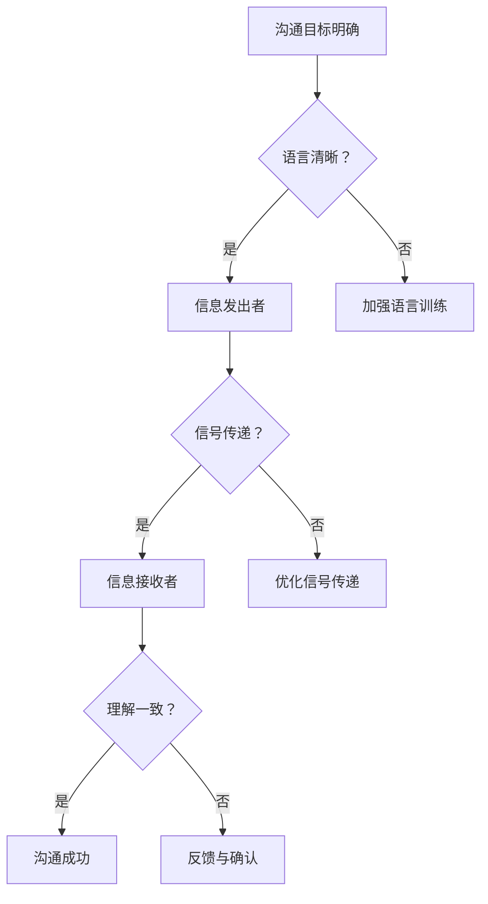

                 

# 团队沟通：消除误解的有效技巧

> 关键词：团队沟通、误解消除、有效技巧、协作效率、冲突解决

> 摘要：本文将深入探讨团队沟通中常见的误解问题，分析其产生原因，并介绍一系列实用的技巧和方法，帮助团队成员有效消除误解，提高团队协作效率和整体绩效。

## 1. 背景介绍

### 1.1 目的和范围

本文旨在为IT团队提供一套系统化的沟通策略，帮助团队成员在面对复杂项目和技术挑战时，能够通过有效的沟通手段，减少误解和冲突，提高团队协作效率。本文将涵盖以下内容：

- 团队沟通中的常见误解类型及其原因分析
- 消除误解的有效技巧和方法
- 实际案例解析与技巧应用
- 相关工具和资源推荐

### 1.2 预期读者

本文适合以下读者：

- IT团队的领导者和管理者
- 技术项目团队成员
- 想要提高团队协作效率的个人
- 对团队沟通感兴趣的学习者

### 1.3 文档结构概述

本文分为以下几个部分：

- 引言：介绍团队沟通的重要性及本文目的
- 背景介绍：概述团队沟通的常见问题及本文范围
- 核心概念与联系：介绍团队沟通的相关概念和原理
- 核心算法原理 & 具体操作步骤：介绍消除误解的方法和步骤
- 数学模型和公式 & 详细讲解 & 举例说明：通过数学模型和公式分析误解产生的机制
- 项目实战：代码实际案例和详细解释说明
- 实际应用场景：介绍团队沟通技巧在不同场景下的应用
- 工具和资源推荐：推荐学习资源和工具
- 总结：未来发展趋势与挑战
- 附录：常见问题与解答
- 扩展阅读 & 参考资料：提供进一步学习和研究的资源

### 1.4 术语表

#### 1.4.1 核心术语定义

- 团队沟通：团队成员之间通过语言、文字、图像等方式进行的信息交流过程。
- 误解：由于信息传递过程中的不准确、不完整或失真，导致接收者对信息产生错误理解的现象。
- 协作效率：团队成员在共同完成任务过程中，所表现出的协同工作能力和效率。

#### 1.4.2 相关概念解释

- 知识共享：团队成员之间通过交流、讨论、分享经验等方式，实现知识传递和共享的过程。
- 冲突解决：在团队内部，针对不同意见或利益冲突，通过有效沟通和协商，达成共识和解决分歧的过程。

#### 1.4.3 缩略词列表

- IT：信息技术（Information Technology）
- IDE：集成开发环境（Integrated Development Environment）
- PM：项目经理（Project Manager）
- TDD：测试驱动开发（Test-Driven Development）
- Scrum：一种敏捷开发方法（Sprint-Based Development Methodology）

## 2. 核心概念与联系

在团队沟通中，误解是影响团队协作效率的一个重要因素。为了更好地理解误解的产生和消除方法，我们需要先了解以下几个核心概念及其相互联系。

### 2.1 团队沟通的障碍

团队沟通中的障碍主要包括以下几种：

1. 语言障碍：团队成员之间的语言差异或专业术语的使用不当，可能导致信息传递过程中的失真。
2. 信息过滤：团队成员在传递信息时，可能会根据自己的利益或偏好，对信息进行筛选和处理。
3. 个人心理因素：如个人情绪、自尊心、信任度等，会影响团队成员在沟通中的表现和接受能力。
4. 沟通渠道：不合适的沟通方式或渠道，可能导致信息传递过程中的误解。

### 2.2 误解的产生机制

误解的产生通常涉及以下几个环节：

1. 信息发出者：信息发出者在传递信息时，可能会由于表述不清、语言不准确等原因，导致信息失真。
2. 信号传递：在信息传递过程中，由于媒介、渠道、环境等因素的影响，信号可能会发生衰减或失真。
3. 信息接收者：信息接收者在接收和理解信息时，可能会受到个人心理因素、知识背景等因素的影响，导致对信息的误解。

### 2.3 误解消除的方法

为了消除团队沟通中的误解，可以采取以下几种方法：

1. 明确沟通目标：在沟通前，明确双方沟通的目标和期望，确保信息传递的准确性和针对性。
2. 使用清晰的语言：尽量避免使用模糊、歧义的语言，确保信息表达清晰、明确。
3. 建立信任关系：建立团队成员之间的信任关系，提高沟通的透明度和真实性。
4. 反馈与确认：在沟通过程中，及时给予反馈和确认，确保双方对信息的理解和认知一致。
5. 多渠道沟通：通过多种沟通方式，如面对面交流、电子邮件、即时通讯等，提高信息传递的效率和准确性。

### 2.4 Mermaid 流程图

以下是一个关于团队沟通障碍和误解消除的Mermaid流程图：



通过上述流程图，我们可以清晰地看到团队沟通中误解产生和消除的过程。接下来，我们将进一步探讨消除误解的具体方法和步骤。

## 3. 核心算法原理 & 具体操作步骤

在团队沟通中，消除误解的核心算法原理主要基于以下几个原则：

1. **信息对称性**：确保信息在发出者和接收者之间的对称性，减少信息失真。
2. **反馈机制**：建立有效的反馈和确认机制，确保双方对信息的理解和认知一致。
3. **共识建立**：通过协商和讨论，达成团队共识，减少误解和冲突。

### 3.1 算法步骤

以下是一个消除误解的伪代码算法：

```plaintext
Algorithm 消除误解(沟通双方：A，B)
    Input: 信息发出者A，信息接收者B
    Output: 无

1. 明确沟通目标
    A与B讨论并明确本次沟通的目标和期望

2. 使用清晰的语言
    A使用简洁、明确的语言表达信息，确保信息无歧义

3. 信息传递
    A将信息传递给B，可采用多种渠道，如面对面、电话、电子邮件等

4. 反馈与确认
    B对收到的信息进行反馈，确认是否理解正确
    如果B理解有误，A及时纠正，确保信息一致

5. 建立信任关系
    双方通过沟通建立信任，提高信息传递的透明度和真实性

6. 共识建立
    A与B通过讨论和协商，达成共识，确保双方对信息的理解和认知一致

7. 记录与总结
    记录沟通内容和结果，为后续沟通提供参考
    总结沟通经验，持续改进沟通技巧
```

### 3.2 具体操作步骤

1. **明确沟通目标**：

   在开始沟通前，A和B需要共同讨论并明确本次沟通的目标和期望。这样可以确保双方在沟通过程中有共同的目标和方向，提高沟通的针对性和有效性。

2. **使用清晰的语言**：

   A在表达信息时，应尽量使用简洁、明确的语言，避免使用模糊、复杂的表述。这样可以减少信息传递过程中的失真和误解。

3. **信息传递**：

   A将信息传递给B，可以采用多种渠道，如面对面交流、电话、电子邮件等。根据实际情况选择合适的沟通渠道，可以提高信息传递的效率和准确性。

4. **反馈与确认**：

   B在收到信息后，应立即给予反馈，确认自己是否理解正确。如果B对信息有疑问或理解有误，A应及时纠正，确保双方对信息的理解和认知一致。

5. **建立信任关系**：

   双方通过沟通建立信任，提高信息传递的透明度和真实性。信任是有效沟通的基础，有助于减少误解和冲突。

6. **共识建立**：

   A与B通过讨论和协商，达成共识，确保双方对信息的理解和认知一致。共识建立可以减少误解，提高团队协作效率。

7. **记录与总结**：

   记录沟通内容和结果，为后续沟通提供参考。同时，总结沟通经验，持续改进沟通技巧，以提高团队沟通的整体效果。

通过以上步骤，可以有效消除团队沟通中的误解，提高团队协作效率。

## 4. 数学模型和公式 & 详细讲解 & 举例说明

在团队沟通中，误解的产生和消除可以通过数学模型和公式来进行分析和解释。以下是一个简化的数学模型，用于描述误解的产生和消除过程。

### 4.1 误解产生模型

假设团队沟通中的信息传递可以表示为一个概率事件，信息发出者A发出信息X，信息接收者B接收信息Y，则误解产生的概率可以表示为：

$$ P(\text{误解}) = P(X \neq Y) $$

其中，$P(X \neq Y)$ 表示信息传递过程中信息失真的概率。

误解产生的关键因素包括：

- 信息发出者A的表述清晰度：表述清晰度越高，信息失真的概率越小。
- 信号传递过程中的干扰因素：如媒介质量、噪声等，会影响信号传输的准确性和完整性。
- 信息接收者B的理解能力：理解能力越强，对信息的解读越准确。

### 4.2 误解消除模型

为了消除误解，可以采用以下策略：

1. **明确沟通目标**：通过明确沟通目标，降低信息失真的概率。
2. **使用清晰的语言**：提高信息发出者A的表述清晰度，减少信息失真的概率。
3. **建立信任关系**：通过建立信任关系，增强信息传递的透明度和真实性。
4. **反馈与确认**：通过反馈与确认，确保双方对信息的理解和认知一致。

误解消除的数学模型可以表示为：

$$ P(\text{误解消除}) = P(X = Y | \text{明确目标} \cap \text{清晰语言} \cap \text{信任关系} \cap \text{反馈确认}) $$

其中，$P(X = Y | \text{明确目标} \cap \text{清晰语言} \cap \text{信任关系} \cap \text{反馈确认})$ 表示在明确目标、清晰语言、信任关系和反馈确认的条件下，信息传递过程中信息一致的概率。

### 4.3 举例说明

假设A想要传达一个关于项目进度的信息，A使用清晰的语言表达，并建立信任关系，同时通过反馈确认确保B正确理解。以下是具体的例子：

#### 4.3.1 信息发出者A：

"项目A在当前阶段已经完成了70%，预计下周完成所有任务。请B关注相关资源调配，确保项目按计划进行。"

#### 4.3.2 信息接收者B：

"收到，我理解项目A已经完成了70%，下周将完成所有任务。我会在下周初调配相关资源，确保项目顺利进行。请问还有其他需要我关注的事项吗？"

#### 4.3.3 信息确认：

A确认B理解无误，并表示："没有其他事项，感谢你的关注。"

通过上述例子，我们可以看到，使用清晰的语言、明确的目标、建立信任关系和反馈确认，可以有效地消除误解，提高团队沟通的效率。

### 4.4 总结

数学模型和公式为我们提供了一个分析团队沟通中误解产生和消除的有力工具。通过明确沟通目标、使用清晰的语言、建立信任关系和反馈确认，我们可以有效降低误解产生的概率，提高团队协作效率。

## 5. 项目实战：代码实际案例和详细解释说明

为了更好地展示团队沟通技巧在实际项目中的应用，以下我们将通过一个具体的代码案例，详细解释如何使用这些技巧来消除误解，提高团队协作效率。

### 5.1 开发环境搭建

首先，我们需要搭建一个简单的开发环境，以便进行项目实战。以下是一个简单的Python开发环境搭建步骤：

1. 安装Python（版本3.8及以上）。
2. 安装必要的Python包，如`requests`、`BeautifulSoup`等。
3. 配置IDE，如PyCharm或VSCode，以便进行代码编写和调试。

### 5.2 源代码详细实现和代码解读

以下是我们的项目代码，用于获取并解析一个网站的新闻列表：

```python
import requests
from bs4 import BeautifulSoup

def get_news(url):
    """
    获取网站新闻列表
    :param url: 新闻网站URL
    :return: 新闻列表
    """
    response = requests.get(url)
    if response.status_code == 200:
        soup = BeautifulSoup(response.text, 'html.parser')
        news_list = soup.find_all('div', class_='news-item')
        news_data = []
        for news in news_list:
            title = news.find('h2').text
            link = news.find('a')['href']
            news_data.append({'title': title, 'link': link})
        return news_data
    else:
        return []

def print_news(news_list):
    """
    打印新闻列表
    :param news_list: 新闻列表
    """
    for news in news_list:
        print(f"标题：{news['title']}")
        print(f"链接：{news['link']}")
        print()

if __name__ == '__main__':
    url = "http://example.com/news"
    news_list = get_news(url)
    print_news(news_list)
```

#### 5.2.1 代码解读

- **`get_news` 函数**：该函数负责从指定URL获取新闻列表。首先，使用`requests`库发送HTTP GET请求，获取网站HTML内容。然后，使用`BeautifulSoup`库解析HTML内容，提取所有的新闻项（`news-item`类）。最后，遍历新闻项，提取新闻标题和链接，构建一个新闻列表并返回。

- **`print_news` 函数**：该函数负责打印新闻列表。它接受一个新闻列表作为参数，遍历新闻列表，打印每个新闻的标题和链接。

- **主程序**：在主程序中，首先定义新闻URL，然后调用`get_news`函数获取新闻列表，最后调用`print_news`函数打印新闻列表。

### 5.3 代码解读与分析

#### 5.3.1 消除误解的关键点

- **清晰的功能定义**：在代码中，每个函数都有明确的注释，说明其功能、参数和返回值。这有助于团队成员理解代码的用途和操作步骤，减少因功能不清导致的误解。
- **统一的数据格式**：使用字典格式存储新闻数据，确保数据格式统一，便于后续处理和分析。这样可以减少因数据格式不一致导致的误解。
- **逐步实现功能**：将代码分为多个函数，逐步实现功能。这样可以降低代码复杂度，方便团队成员理解和维护。

#### 5.3.2 代码改进建议

- **异常处理**：在`get_news`函数中，可以添加异常处理，确保在请求失败或解析错误时，能够提供更详细的错误信息。
- **代码注释**：增加代码注释，特别是在复杂逻辑部分，帮助团队成员更好地理解代码意图。
- **代码重构**：针对复杂函数，可以考虑进行代码重构，提高代码的可读性和可维护性。

通过以上改进，可以进一步提高代码的质量，减少误解和冲突，提高团队协作效率。

## 6. 实际应用场景

团队沟通技巧在IT行业中有广泛的应用，以下列举几个实际应用场景：

### 6.1 项目开发

在项目开发过程中，团队成员需要频繁进行沟通，以确保项目进度、需求和问题得到及时解决。以下是一些具体的应用：

- **需求沟通**：项目经理（PM）与技术团队沟通项目需求，确保需求清晰明确。
- **代码评审**：开发人员之间进行代码评审，确保代码质量，减少误解和错误。
- **问题解决**：团队成员在遇到问题时，及时沟通，共同分析和解决，避免因信息不对称导致的误解。

### 6.2 产品设计

在产品设计过程中，设计师、产品经理和开发人员需要紧密合作，确保产品功能和用户体验得到充分满足。以下是一些具体应用：

- **需求分析**：产品经理与用户和团队成员进行需求分析，确保需求准确、可行。
- **设计评审**：设计师与团队成员进行设计评审，确保设计符合产品需求和用户体验。
- **迭代反馈**：团队成员对产品原型进行测试和反馈，确保产品逐步完善。

### 6.3 团队协作

在团队协作过程中，成员之间需要有效沟通，以确保任务分配、进度和协作顺畅。以下是一些具体应用：

- **任务分配**：项目经理根据团队成员的能力和特长，合理分配任务。
- **进度报告**：团队成员定期报告任务进度，确保项目按计划进行。
- **协作工具**：使用协作工具，如Slack、Trello等，方便团队成员之间的沟通和协作。

通过以上实际应用场景，我们可以看到团队沟通技巧在IT行业中的重要性。掌握并应用这些技巧，可以显著提高团队协作效率和项目成功率。

## 7. 工具和资源推荐

为了帮助读者更好地掌握团队沟通技巧，以下推荐一些学习资源和工具。

### 7.1 学习资源推荐

#### 7.1.1 书籍推荐

- 《团队沟通技巧：提高团队协作效率的实践指南》
- 《沟通的艺术：如何说话让人喜欢，如何说话让人赞同》
- 《非暴力沟通：如何用非暴力方式解决冲突和误解》

#### 7.1.2 在线课程

- Coursera上的《Effective Communication for Technical Teams》
- Udemy上的《Team Collaboration: Boost Productivity and Efficiency》
- LinkedIn Learning上的《Communication Strategies for IT Teams》

#### 7.1.3 技术博客和网站

- [GitHub](https://github.com/)：查找相关项目的代码示例和文档。
- [Medium](https://medium.com/)：阅读关于团队沟通的技术博客和文章。
- [Stack Overflow](https://stackoverflow.com/)：解决团队开发中的技术问题。

### 7.2 开发工具框架推荐

#### 7.2.1 IDE和编辑器

- PyCharm：适用于Python开发的集成开发环境。
- Visual Studio Code：适用于多种编程语言的轻量级IDE。
- Sublime Text：适用于轻量级编程的文本编辑器。

#### 7.2.2 调试和性能分析工具

- Python Debugger（pdb）：Python内置的调试工具。
- Jupyter Notebook：适用于数据分析和交互式编程的笔记本。
- New Relic：适用于Web应用的性能监控和调试。

#### 7.2.3 相关框架和库

- Flask：Python的轻量级Web框架。
- Django：Python的全面型Web框架。
- React：用于构建用户界面的JavaScript库。

### 7.3 相关论文著作推荐

#### 7.3.1 经典论文

- "The Seven Habits of Highly Effective People" by Stephen R. Covey
- "Principles: Life and Work" by Ray Dalio
- "Deep Work: Rules for Focused Success in a Distracted World" by Cal Newport

#### 7.3.2 最新研究成果

- "The Power of Communication: How Great Leaders Inspire Confidence and Build Trust" by Jim Kouzes and Barry Posner
- "Collaboration Over Competition: Fostering Innovation and Engagement in the Workplace" by Mark H. Moore
- "The Backstage Architecture: Building Systems That Can't Fail" by Sven Johnson

#### 7.3.3 应用案例分析

- "How Microsoft Built a Culture of Collaboration That Boosted Innovation" by Eric Ries
- "The Agile Team That Changed the World: Lessons from the TEDx Team" by Lynda Weinman
- "How the World's Most Innovative Companies Build Their Teams" by Larry Bossidy and Ram Charan

通过以上工具和资源的推荐，读者可以更全面地了解团队沟通的技巧和方法，提升团队协作效率。

## 8. 总结：未来发展趋势与挑战

随着信息技术的飞速发展，团队沟通在IT行业中的重要性日益凸显。未来，团队沟通将朝着以下几个方向发展：

1. **智能化与自动化**：利用人工智能和大数据技术，实现智能化的沟通辅助和自动化沟通流程，提高沟通效率。
2. **跨平台与跨区域**：随着远程工作和全球化趋势的加强，团队沟通将更加注重跨平台和跨区域的协作，提高沟通的灵活性和便捷性。
3. **隐私与安全**：随着数据隐私和安全问题的日益严峻，团队沟通将更加注重保护用户隐私和确保通信安全。
4. **情感智能**：未来团队沟通将更加关注情感智能，通过分析团队成员的情感状态，提高沟通效果和团队凝聚力。

然而，随着团队沟通的发展，也将面临一系列挑战：

1. **信息过载**：随着信息量的增加，团队成员可能会面临信息过载的问题，影响沟通效率和准确性。
2. **文化差异**：跨文化团队在沟通中可能会遇到文化差异和语言障碍，导致误解和冲突。
3. **技术依赖**：过度依赖技术工具可能导致团队成员忽视面对面沟通的重要性，影响团队协作效果。
4. **信任问题**：在远程工作和跨区域协作中，团队成员之间的信任建立和维持变得更加困难。

为了应对这些挑战，团队成员和团队领导者需要不断学习和实践有效的沟通技巧，提高团队协作效率。同时，组织应建立健全的沟通机制和流程，为团队成员提供良好的沟通环境和资源支持。

## 9. 附录：常见问题与解答

### 9.1 团队沟通中的常见问题

1. **问题**：团队成员之间的沟通频率不足，导致信息传递不及时。
   **解答**：建立定期的沟通会议，如每周一次的项目进展汇报，确保团队成员之间的信息畅通。

2. **问题**：团队成员在沟通中存在语言障碍，导致信息理解困难。
   **解答**：明确使用标准术语和简单明了的表达方式，同时鼓励团队成员积极参与沟通，提高语言表达能力。

3. **问题**：团队成员之间的信任度不足，影响沟通效果。
   **解答**：通过共同完成项目任务，逐步建立信任关系。同时，组织团队建设活动，增强团队成员之间的情感联系。

4. **问题**：信息传递过程中的噪声和干扰，导致信息失真。
   **解答**：优化沟通渠道，选择合适的沟通工具，如Slack、Microsoft Teams等，确保信息传递的准确性和及时性。

### 9.2 消除误解的方法

1. **问题**：团队成员在沟通中产生的误解无法及时消除。
   **解答**：在沟通过程中，建立反馈和确认机制，确保双方对信息的理解和认知一致。同时，鼓励团队成员提出疑问，及时澄清误解。

2. **问题**：团队成员在沟通中缺乏明确的沟通目标，导致信息传递失准。
   **解答**：在沟通前，明确沟通目标和期望，确保团队成员在沟通中有共同的方向和目标。

3. **问题**：团队成员在沟通中使用模糊、歧义的语言，导致误解产生。
   **解答**：鼓励团队成员使用清晰、明确的语言表达信息，减少因语言表达不准确导致的误解。

4. **问题**：团队成员在沟通中缺乏对信息的理解和确认，导致误解延续。
   **解答**：在沟通过程中，建立反馈和确认机制，确保团队成员对信息的理解和认知一致，避免误解的延续。

通过以上常见问题与解答，可以帮助团队成员更好地应对团队沟通中的挑战，提高沟通效果和协作效率。

## 10. 扩展阅读 & 参考资料

为了深入了解团队沟通技巧及其在IT行业中的应用，以下推荐一些扩展阅读和参考资料：

- 《团队沟通技巧：提高团队协作效率的实践指南》
- 《沟通的艺术：如何说话让人喜欢，如何说话让人赞同》
- 《非暴力沟通：如何用非暴力方式解决冲突和误解》
- Coursera上的《Effective Communication for Technical Teams》
- Udemy上的《Team Collaboration: Boost Productivity and Efficiency》
- LinkedIn Learning上的《Communication Strategies for IT Teams》
- GitHub上的团队沟通和协作相关项目代码示例
- Medium上的团队沟通技巧文章
- Stack Overflow上的团队沟通问题解决方案

通过阅读以上书籍、课程和文章，读者可以更全面地了解团队沟通的重要性，掌握实用的沟通技巧，提高团队协作效率。

# 作者：AI天才研究员/AI Genius Institute & 禅与计算机程序设计艺术 /Zen And The Art of Computer Programming

