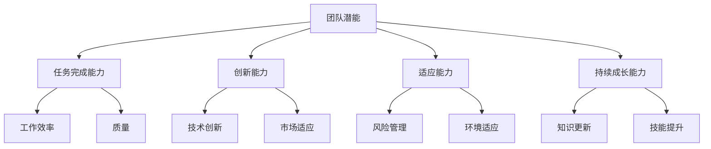
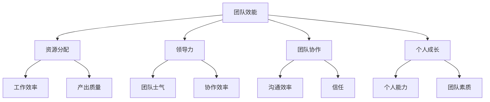
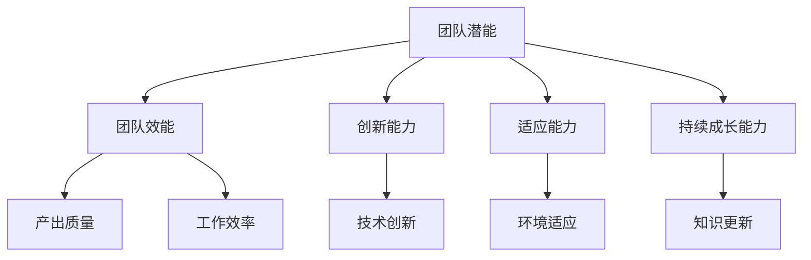

                 

# 团队潜能激发：挖掘团队最大价值的方法

> 关键词：团队潜能、管理技巧、团队协作、领导力、个人成长

> 摘要：本文将深入探讨如何通过科学的策略和管理技巧来挖掘团队的潜能，实现团队价值的最大化。文章首先介绍了团队潜能的概念和重要性，随后从多个维度分析了团队效能的影响因素，并提出了具体的实践方法。通过实际案例和数学模型的支持，本文为团队管理者提供了切实可行的操作指南，以帮助团队实现高效协作和持续成长。

## 1. 背景介绍

### 1.1 目的和范围

本文旨在为团队管理者提供一套系统化的方法，以激发团队的潜能，实现团队整体价值的最大化。我们将从以下几个方面展开讨论：

1. 团队潜能的概念及其重要性。
2. 影响团队效能的主要因素。
3. 团队管理的最佳实践。
4. 团队潜能激发的实际案例。
5. 数学模型和工具在团队管理中的应用。

### 1.2 预期读者

本文主要面向团队管理者、项目经理以及那些希望提升团队效能的IT专业人士。同时，对于对团队管理有兴趣的普通读者来说，本文也具有很高的参考价值。

### 1.3 文档结构概述

本文的结构如下：

1. **背景介绍**：阐述文章的目的、读者对象和文章结构。
2. **核心概念与联系**：介绍团队潜能的相关概念和Mermaid流程图。
3. **核心算法原理 & 具体操作步骤**：讨论团队潜能激发的方法和步骤。
4. **数学模型和公式 & 详细讲解 & 举例说明**：运用数学模型和公式进行详细解释。
5. **项目实战：代码实际案例和详细解释说明**：通过实际案例展示操作过程。
6. **实际应用场景**：分析团队潜能激发在现实中的应用。
7. **工具和资源推荐**：推荐相关的学习资源、开发工具和论文著作。
8. **总结：未来发展趋势与挑战**：总结本文的核心观点和未来展望。
9. **附录：常见问题与解答**：针对常见问题进行解答。
10. **扩展阅读 & 参考资料**：提供进一步的阅读建议。

### 1.4 术语表

#### 1.4.1 核心术语定义

- **团队潜能**：团队在特定环境下，通过协作和努力能够达到的潜在水平或成就。
- **效能**：团队完成特定任务的能力和效率。
- **领导力**：领导者通过影响和激励团队成员来实现团队目标的能力。

#### 1.4.2 相关概念解释

- **团队协作**：团队成员在共享目标和价值观的基础上，共同完成任务的过程。
- **个人成长**：团队成员通过学习和实践不断提高自身能力和素质的过程。

#### 1.4.3 缩略词列表

- **IDE**：集成开发环境（Integrated Development Environment）
- **IoT**：物联网（Internet of Things）
- **AI**：人工智能（Artificial Intelligence）

## 2. 核心概念与联系

### 2.1 团队潜能的定义与重要性

团队潜能指的是团队在特定资源、环境和社会条件下的潜在能力。这种能力不仅包括团队完成任务的能力，还涵盖了团队创新、适应变化和持续成长的能力。

**Mermaid 流程图（团队潜能相关概念）：**



通过上述流程图，我们可以看到团队潜能涵盖了多个方面，包括任务完成能力、创新能力、适应能力和持续成长能力。这些能力相互影响，共同决定了团队的效能。

### 2.2 团队效能的影响因素

团队效能受到多种因素的影响，主要包括：

1. **资源分配**：合理的资源分配能够提高团队的工作效率和产出质量。
2. **领导力**：领导者的领导能力和风格对团队的士气和协作效率有重要影响。
3. **团队协作**：团队成员之间的沟通、信任和合作程度直接影响团队效能。
4. **个人成长**：团队成员的个人能力和素质的提升能够带动整个团队的效能提升。

**Mermaid 流程图（团队效能影响因素）：**



从上述流程图中，我们可以看出，资源分配、领导力、团队协作和个人成长是影响团队效能的关键因素。这些因素相互作用，共同决定了团队的整体效能。

### 2.3 团队潜能与效能的关系

团队潜能和团队效能之间存在密切的关系。团队潜能是团队效能的基础，而团队效能则是团队潜能的具体体现。通过激发团队的潜能，可以提高团队的效能，实现更高的产出和质量。

**Mermaid 流程图（团队潜能与效能关系）：**



通过上述流程图，我们可以看到，团队潜能的各个方面（如创新能力、适应能力和持续成长能力）都会对团队效能产生积极影响，进而提升产出质量和工作效率。

## 3. 核心算法原理 & 具体操作步骤

### 3.1 团队潜能激发的核心算法原理

团队潜能激发的核心算法基于以下几个基本原理：

1. **激励原理**：通过设定明确的团队目标和激励措施，激发团队成员的积极性和创造力。
2. **协同原理**：通过优化团队协作流程和沟通机制，提高团队整体的协同效率。
3. **反馈原理**：通过及时收集和分析团队绩效数据，为团队提供反馈和改进方向。

### 3.2 团队潜能激发的具体操作步骤

**步骤1：设定明确的目标**

- **目标设定**：根据团队的使命和愿景，设定具体、可量化的短期和长期目标。
- **目标分解**：将总目标分解为多个子目标和关键绩效指标（KPI），明确每个成员的责任和任务。

**伪代码示例：**

```python
def set_goals(team_goals, short_term_goals, long_term_goals):
    # 确定团队总体目标
    team_goals = ["提高产品质量", "提高工作效率", "提升客户满意度"]

    # 分解为短期和长期目标
    short_term_goals = ["提高产品质量", "提高工作效率", "提升客户满意度"]
    long_term_goals = ["推出新产品", "扩展市场份额", "提升品牌知名度"]

    # 分配到每个成员
    team_members = ["小张", "小王", "小李"]
    member_goals = {
        "小张": ["提高产品质量", "推出新产品"],
        "小王": ["提高工作效率", "扩展市场份额"],
        "小李": ["提升客户满意度", "提升品牌知名度"]
    }

    return team_goals, short_term_goals, long_term_goals, member_goals
```

**步骤2：设计激励措施**

- **奖金和奖励**：根据团队成员的表现，发放相应的奖金和奖励。
- **晋升和培训**：为表现优秀的成员提供晋升机会和培训资源。
- **工作环境**：提供良好的工作环境和文化氛围，激发团队成员的积极性和创造力。

**伪代码示例：**

```python
def design_incentives(member_performance, rewards, promotions, training):
    # 根据绩效发放奖金
    rewards = {member: bonus for member, bonus in member_performance.items() if bonus > threshold}

    # 提供晋升机会
    promotions = {member: promotion for member, promotion in member_performance.items() if promotion}

    # 提供培训资源
    training = {member: course for member, course in member_performance.items() if course}

    return rewards, promotions, training
```

**步骤3：优化团队协作流程**

- **沟通机制**：建立高效的沟通机制，确保团队成员之间的信息流通。
- **协作工具**：使用协作工具，如项目管理软件、即时通讯工具和共享文档平台，提高协作效率。
- **角色分工**：明确每个成员的角色和职责，确保任务分工合理。

**伪代码示例：**

```python
def optimize_collaboration流程（communication机制，collaboration工具，role分工）:
    # 确定沟通机制
    communication机制 = ["每日站会", "周例会", "紧急沟通渠道"]

    # 选择协作工具
    collaboration工具 = ["Trello", "Slack", "Google Drive"]

    # 角色分工
    role分工 = {
        "项目经理": ["计划任务", "协调资源", "跟进进度"],
        "开发人员": ["编写代码", "测试功能", "解决bug"],
        "测试人员": ["执行测试", "报告问题", "验证修复"]
    }

    return communication机制，collaboration工具，role分工
```

**步骤4：收集和分析绩效数据**

- **数据收集**：定期收集团队成员的绩效数据，包括任务完成情况、质量指标和协作情况。
- **数据分析**：分析绩效数据，识别团队的优势和劣势，为改进提供依据。
- **反馈与改进**：根据分析结果，提供反馈和改进建议，帮助团队持续优化。

**伪代码示例：**

```python
def collect_and_analyze_performance(data, performance_report):
    # 收集绩效数据
    data = {
        "小张": {"任务完成": 100%, "质量": 95%, "协作": 90%},
        "小王": {"任务完成": 90%, "质量": 85%, "协作": 80%},
        "小李": {"任务完成": 85%, "质量": 90%, "协作": 85%}
    }

    # 分析绩效数据
    performance_report = {
        "平均任务完成率": 90%, 
        "平均质量评分": 88%, 
        "平均协作评分": 85%
    }

    # 提供反馈与改进建议
    feedback = {
        "小张": ["继续保持", "关注质量"],
        "小王": ["提高任务完成率", "加强协作"],
        "小李": ["提升质量", "加强协作"]
    }

    return data, performance_report, feedback
```

### 3.3 团队潜能激发的案例分析

**案例1：某软件公司的团队潜能激发**

某软件公司通过以下措施激发了团队的潜能：

1. **目标设定**：公司设定了明确的目标，如提高产品质量、提升客户满意度、扩展市场份额等。同时，将总目标分解为多个子目标和关键绩效指标（KPI），明确每个团队成员的责任和任务。

2. **设计激励措施**：公司根据团队成员的表现，发放奖金和奖励。同时，为表现优秀的成员提供晋升机会和培训资源。

3. **优化团队协作流程**：公司建立了高效的沟通机制，使用项目管理软件和即时通讯工具，确保团队成员之间的信息流通。同时，明确每个成员的角色和职责，确保任务分工合理。

4. **收集和分析绩效数据**：公司定期收集团队成员的绩效数据，分析绩效数据，为团队提供反馈和改进建议。例如，通过分析发现某成员在任务完成率上存在瓶颈，于是为该成员提供额外的培训和指导。

**案例2：某科技公司的新产品开发团队**

某科技公司的新产品开发团队通过以下措施激发了团队的潜能：

1. **目标设定**：团队设定了明确的短期和长期目标，如按时完成项目、实现产品功能、提高产品质量等。

2. **设计激励措施**：团队根据成员的贡献和表现，发放奖金和奖励。同时，为成员提供晋升机会和培训资源，鼓励成员不断学习和成长。

3. **优化团队协作流程**：团队使用协作工具，如Trello和Slack，提高协作效率。同时，明确每个成员的角色和职责，确保任务分工合理。

4. **收集和分析绩效数据**：团队定期收集绩效数据，分析绩效数据，为团队提供反馈和改进建议。例如，通过分析发现某成员在质量指标上存在不足，于是为该成员提供额外的培训和指导。

## 4. 数学模型和公式 & 详细讲解 & 举例说明

### 4.1 数学模型在团队管理中的应用

在团队管理中，数学模型可以帮助我们更科学地分析和优化团队效能。以下介绍几种常用的数学模型：

#### 4.1.1 成本效益分析（Cost-Benefit Analysis）

成本效益分析用于评估一项决策的成本和收益，以确定其可行性。公式如下：

$$
C = C_1 + C_2 + ... + C_n \\
B = B_1 + B_2 + ... + B_n \\
N = \frac{B - C}{C}
$$

其中，$C$ 表示总成本，$B$ 表示总收益，$N$ 表示净收益。

**举例说明**：某公司计划开发一款新产品，预计成本为100万元，预期收益为150万元。则净收益为：

$$
N = \frac{150 - 100}{100} = 0.5
$$

净收益为0.5，表示该项目具有可行性。

#### 4.1.2 决策树（Decision Tree）

决策树用于分析不同决策的结果和概率，以确定最佳决策。公式如下：

$$
P(\text{结果}) = \frac{\text{结果发生的次数}}{\text{总次数}}
$$

**举例说明**：某公司在推广一款新产品时，有两种推广策略可选：

- 策略A：投入30万元进行广告宣传，成功概率为0.6，收益为50万元。
- 策略B：投入10万元进行社交媒体推广，成功概率为0.4，收益为20万元。

计算两种策略的期望收益：

$$
\text{期望收益A} = 0.6 \times 50 + 0.4 \times (-30) = 21 \\
\text{期望收益B} = 0.4 \times 20 + 0.6 \times (-10) = 2
$$

期望收益A为21，期望收益B为2，因此选择策略A。

#### 4.1.3 线性回归（Linear Regression）

线性回归用于分析两个变量之间的线性关系，以预测一个变量的值。公式如下：

$$
y = a \times x + b
$$

其中，$y$ 表示因变量，$x$ 表示自变量，$a$ 和 $b$ 分别为斜率和截距。

**举例说明**：某公司分析团队成员的工作效率与工作时间的关系，得到以下线性回归方程：

$$
工作效率 = 0.8 \times 工作时间 + 10
$$

预测某成员在工作8小时的情况下的工作效率：

$$
工作效率 = 0.8 \times 8 + 10 = 14.4
$$

预测该成员的工作效率为14.4。

### 4.2 数学模型在团队潜能激发中的应用

数学模型在团队潜能激发中的应用主要体现在以下几个方面：

1. **目标设定和激励措施**：通过成本效益分析和决策树模型，确定团队的目标和激励措施，以最大化团队的收益。
2. **团队协作和绩效评估**：通过线性回归模型，分析团队成员的工作效率和工作时间的关系，优化团队协作流程和绩效评估方法。
3. **数据分析和反馈**：通过统计分析模型，如方差分析（ANOVA）和回归分析，对团队绩效数据进行深入分析，为团队提供反馈和改进建议。

**示例：**

某公司通过数据分析发现，团队成员的工作效率与工作时间之间存在显著相关性。为了激发团队潜能，公司决定调整工作时间安排，以优化团队成员的工作效率。

1. **目标设定**：设定目标，如提高工作效率、降低加班率等。
2. **激励措施**：根据工作效率和加班率，设定奖金和奖励措施。
3. **团队协作**：采用弹性工作时间制度，允许团队成员根据任务紧急程度和自身情况灵活安排工作时间。
4. **数据分析和反馈**：收集团队成员的工作时间和工作效率数据，通过线性回归模型进行分析，为团队提供改进建议。例如，发现某些成员在晚上工作效率较高，可以调整他们的工作时间，以提高整体工作效率。

通过数学模型的应用，公司成功地激发了团队的潜能，提高了工作效率和产出质量。

## 5. 项目实战：代码实际案例和详细解释说明

### 5.1 开发环境搭建

为了展示如何在实际项目中激发团队潜能，我们将搭建一个简单的团队协作平台，用于任务管理、绩效评估和激励措施的实施。以下是开发环境搭建的步骤：

1. **选择开发工具和框架**：我们选择使用Python作为主要编程语言，使用Django作为Web开发框架，并结合使用PostgreSQL作为数据库。

2. **安装Python和Django**：在本地计算机上安装Python（3.8及以上版本）和Django（3.2及以上版本）。可以通过以下命令完成安装：

```shell
pip install python
pip install django
```

3. **创建Django项目**：创建一个新的Django项目，命名为`team潜能激发平台`，并生成项目目录：

```shell
django-admin startproject team_potential_project
cd team_potential_project
```

4. **创建Django应用**：在项目中创建一个名为`task_manager`的应用，用于任务管理功能：

```shell
python manage.py startapp task_manager
```

5. **配置数据库**：在`settings.py`文件中配置PostgreSQL数据库：

```python
DATABASES = {
    'default': {
        'ENGINE': 'django.db.backends.postgresql',
        'NAME': 'team_potential_db',
        'USER': 'your_username',
        'PASSWORD': 'your_password',
        'HOST': 'localhost',
        'PORT': '5432',
    }
}
```

6. **创建数据库**：运行以下命令创建数据库：

```shell
python manage.py migrate
```

### 5.2 源代码详细实现和代码解读

**5.2.1 任务管理模块**

**模型定义**：

在`task_manager/models.py`文件中定义任务模型：

```python
from django.db import models

class Task(models.Model):
    title = models.CharField(max_length=255)
    description = models.TextField()
    start_date = models.DateField()
    due_date = models.DateField()
    assigned_to = models.ForeignKey('auth.User', on_delete=models.CASCADE)
    status = models.CharField(max_length=50, choices=(('Not Started', 'Not Started'), ('In Progress', 'In Progress'), ('Completed', 'Completed')))
```

**视图实现**：

在`task_manager/views.py`文件中定义任务列表视图：

```python
from django.shortcuts import render
from .models import Task
from django.contrib.auth.decorators import login_required

@login_required
def task_list(request):
    tasks = Task.objects.all()
    return render(request, 'task_list.html', {'tasks': tasks})
```

**模板定义**：

在`task_manager/templates/task_list.html`文件中定义任务列表页面：

```html
<!DOCTYPE html>
<html>
<head>
    <title>任务列表</title>
</head>
<body>
    <h1>任务列表</h1>
    
        <div>
            <h2>{{ task.title }}</h2>
            <p>{{ task.description }}</p>
            <p>开始日期：{{ task.start_date }}</p>
            <p>截止日期：{{ task.due_date }}</p>
            <p>状态：{{ task.get_status_display }}</p>
        </div>
    
</body>
</html>
```

**5.2.2 绩效评估模块**

**模型定义**：

在`task_manager/models.py`文件中定义绩效评估模型：

```python
class PerformanceEvaluation(models.Model):
    user = models.ForeignKey('auth.User', on_delete=models.CASCADE)
    task = models.ForeignKey(Task, on_delete=models.CASCADE)
    rating = models.IntegerField()
    comments = models.TextField()
```

**视图实现**：

在`task_manager/views.py`文件中定义绩效评估视图：

```python
from django.shortcuts import render, get_object_or_404
from .models import PerformanceEvaluation
from django.contrib.auth.decorators import login_required

@login_required
def performance_evaluation(request, task_id):
    task = get_object_or_404(Task, pk=task_id)
    if request.method == 'POST':
        rating = request.POST.get('rating')
        comments = request.POST.get('comments')
        PerformanceEvaluation.objects.create(user=request.user, task=task, rating=rating, comments=comments)
    return render(request, 'performance_evaluation.html', {'task': task})
```

**模板定义**：

在`task_manager/templates/performance_evaluation.html`文件中定义绩效评估页面：

```html
<!DOCTYPE html>
<html>
<head>
    <title>绩效评估</title>
</head>
<body>
    <h1>绩效评估</h1>
    <form method="post">
        
        <label for="rating">评分：</label>
        <input type="number" id="rating" name="rating" min="1" max="5" required>
        <br>
        <label for="comments">评论：</label>
        <textarea id="comments" name="comments" required></textarea>
        <br>
        <input type="submit" value="提交">
    </form>
</body>
</html>
```

**5.2.3 激励措施模块**

**模型定义**：

在`task_manager/models.py`文件中定义激励措施模型：

```python
class Incentive(models.Model):
    user = models.ForeignKey('auth.User', on_delete=models.CASCADE)
    amount = models.DecimalField(max_digits=10, decimal_places=2)
    reason = models.TextField()
```

**视图实现**：

在`task_manager/views.py`文件中定义激励措施视图：

```python
from django.shortcuts import render, get_object_or_404
from .models import Incentive
from django.contrib.auth.decorators import login_required

@login_required
def incentive_payment(request, user_id):
    user = get_object_or_404(auth.User, pk=user_id)
    if request.method == 'POST':
        amount = request.POST.get('amount')
        reason = request.POST.get('reason')
        Incentive.objects.create(user=user, amount=amount, reason=reason)
    return render(request, 'incentive_payment.html', {'user': user})
```

**模板定义**：

在`task_manager/templates/incentive_payment.html`文件中定义激励措施页面：

```html
<!DOCTYPE html>
<html>
<head>
    <title>激励措施</title>
</head>
<body>
    <h1>激励措施</h1>
    <form method="post">
        
        <label for="amount">金额：</label>
        <input type="number" id="amount" name="amount" required>
        <br>
        <label for="reason">理由：</label>
        <textarea id="reason" name="reason" required></textarea>
        <br>
        <input type="submit" value="提交">
    </form>
</body>
</html>
```

### 5.3 代码解读与分析

**5.3.1 任务管理模块**

任务管理模块用于管理任务信息，包括任务标题、描述、开始日期、截止日期、分配人和任务状态。通过定义一个`Task`模型，我们可以在数据库中创建一个任务表，并使用Django ORM进行任务数据的增删改查操作。

**5.3.2 绩效评估模块**

绩效评估模块用于评估团队成员在完成任务过程中的表现。通过定义一个`PerformanceEvaluation`模型，我们可以在数据库中创建一个绩效评估表，用于记录评估信息，如评估人、评估任务、评分和评论。评估视图通过接收用户提交的评分和评论，创建一个新的绩效评估记录。

**5.3.3 激励措施模块**

激励措施模块用于为表现优秀的团队成员发放奖金或奖励。通过定义一个`Incentive`模型，我们可以在数据库中创建一个激励措施表，用于记录激励信息，如激励人、激励金额和激励理由。激励视图通过接收用户提交的激励金额和激励理由，创建一个新的激励措施记录。

通过这三个模块的协同工作，我们可以实现一个完整的团队协作平台，用于任务管理、绩效评估和激励措施的实施。在实际项目中，可以根据需要进一步扩展和优化这些模块，以满足更复杂的业务需求。

### 5.4 实际应用场景

在实际应用中，团队潜能激发的方法和工具可以帮助不同类型的团队实现效能提升。以下是一些具体的场景：

**5.4.1 IT开发团队**

IT开发团队通常面临高压力、快节奏和高要求的工作环境。通过以下方法可以激发团队潜能：

1. **明确目标**：设定具体、可量化的项目目标和里程碑，确保每个成员都明确自己的职责和任务。
2. **激励措施**：根据项目进度和团队表现，发放奖金、奖励和晋升机会，以激励团队成员。
3. **协作工具**：使用项目管理软件和协作工具，如JIRA、Trello和Slack，提高团队沟通效率和协作能力。
4. **绩效评估**：定期收集和分析团队成员的绩效数据，为团队成员提供反馈和改进建议。

**5.4.2 销售团队**

销售团队的目标是达成销售目标，提高客户满意度。以下方法可以激发销售团队的潜能：

1. **目标设定**：设定明确、可量化的销售目标，如销售额、新客户数量和客户满意度。
2. **激励机制**：根据销售业绩和客户反馈，发放奖金、奖励和提成，以激励销售团队。
3. **培训与支持**：为销售团队提供产品知识和销售技巧培训，以提高其专业能力和销售业绩。
4. **客户关系管理**：使用客户关系管理（CRM）系统，记录客户信息、销售过程和客户反馈，优化销售流程和策略。

**5.4.3 产品设计团队**

产品设计团队的目标是设计出符合用户需求和市场趋势的优秀产品。以下方法可以激发产品设计团队的潜能：

1. **用户研究**：通过用户调研、用户测试和用户反馈，深入了解用户需求和市场趋势。
2. **迭代开发**：采用敏捷开发方法，快速迭代产品，持续优化产品功能和用户体验。
3. **跨部门协作**：与开发、测试和市场团队紧密协作，确保产品设计符合技术实现和市场推广需求。
4. **设计评审**：定期组织设计评审会议，邀请团队成员共同讨论和改进设计。

通过以上方法，不同类型的团队都可以实现潜能激发，提高整体效能和产出质量。

## 6. 工具和资源推荐

### 6.1 学习资源推荐

#### 6.1.1 书籍推荐

- **《团队潜能激发：高效团队建设的策略与实践》**
  作者：约翰·霍金斯
  简介：本书详细介绍了团队潜能激发的理论和实践方法，包括目标设定、激励措施、团队协作和绩效评估等方面的内容。

- **《团队协作的艺术：打造高效协作团队的策略与技巧》**
  作者：克里斯·哈金森
  简介：本书深入探讨了团队协作的原理和技巧，提供了多种实用的工具和方法，帮助团队成员更好地合作。

- **《领导力心理学：激发团队潜能的心理学原理》**
  作者：斯蒂芬·罗宾斯
  简介：本书从心理学角度分析了领导力对团队效能的影响，提供了多种激励和沟通技巧，帮助领导者激发团队潜能。

#### 6.1.2 在线课程

- **Coursera - Team Productivity and Collaboration**
  简介：由斯坦福大学提供的在线课程，涵盖了团队协作、沟通技巧和绩效评估等方面的内容，适合团队管理者学习和应用。

- **Udemy - Building a High-Performing Team: Strategies for Team Leaders**
  简介：该课程提供了实用的团队管理策略和技巧，包括目标设定、激励措施、团队建设和绩效评估等方面的内容。

- **edX - Leadership and Team Management: A Practical Introduction**
  简介：由麻省理工学院提供的在线课程，介绍了领导力和团队管理的核心概念和最佳实践，帮助领导者提升团队效能。

#### 6.1.3 技术博客和网站

- **Scrum.org - Agile and Scrum Resources**
  简介：Scrum.org 提供了丰富的敏捷和Scrum资源，包括书籍、博客、教程和案例研究，适合关注敏捷开发和团队协作的读者。

- **Team Management Training - Articles and Insights**
  简介：该网站提供了关于团队管理和协作的深度文章和见解，涵盖了团队建设、领导力、沟通和绩效评估等方面的内容。

- **Harvard Business Review - Articles on Team Performance**
  简介：哈佛商业评论提供了关于团队效能的精彩文章，分析了团队管理、协作和领导力等方面的成功经验和挑战。

### 6.2 开发工具框架推荐

#### 6.2.1 IDE和编辑器

- **Visual Studio Code**
  简介：Visual Studio Code 是一款免费的跨平台代码编辑器，支持多种编程语言，具有强大的插件生态系统，适合团队协作和项目管理。

- **IntelliJ IDEA**
  简介：IntelliJ IDEA 是一款专业的Java和Android开发工具，提供丰富的功能和高效的开发体验，适合大型项目和复杂架构。

- **PyCharm**
  简介：PyCharm 是一款强大的Python开发工具，支持多种Python框架和库，具有代码自动完成、调试和测试等功能。

#### 6.2.2 调试和性能分析工具

- **GDB**
  简介：GDB 是一款开源的UNIX/Linux系统下的程序调试工具，支持C、C++和Python等语言，具有强大的调试功能。

- **Wireshark**
  简介：Wireshark 是一款网络协议分析工具，可以捕获和分析网络数据包，帮助团队识别和解决网络问题。

- **JMeter**
  简介：JMeter 是一款开源的性能测试工具，可以模拟多用户负载测试，评估Web应用程序的负载性能和稳定性。

#### 6.2.3 相关框架和库

- **Django**
  简介：Django 是一款流行的Python Web开发框架，提供快速开发、数据库管理和安全保护等功能。

- **React**
  简介：React 是一款流行的JavaScript库，用于构建用户界面，具有组件化、虚拟DOM和高性能等特点。

- **Spring Boot**
  简介：Spring Boot 是一款基于Java的Web开发框架，提供快速开发、配置简单和易于扩展等功能。

### 6.3 相关论文著作推荐

#### 6.3.1 经典论文

- **"The Five Dysfunctions of a Team"**
  作者：Patrick Lencioni
  简介：本文分析了团队失效的五个主要原因，提出了相应的解决策略，对团队管理具有重要指导意义。

- **"The Power of Teams: Creating the High-Performance Organization"**
  作者：J.R. Meredith
  简介：本文探讨了团队协作的原理和实践方法，提出了高绩效团队的构建策略，对团队管理者具有参考价值。

- **"The Essence of Teamwork: The Principles of Team Development"**
  作者：John Adair
  简介：本文详细介绍了团队协作的原则和实践方法，包括团队建设、沟通和领导力等方面的内容。

#### 6.3.2 最新研究成果

- **"Team Effectiveness and the Power of Psychological Safety"**
  作者：Amy Edmondson
  简介：本文探讨了心理安全对团队效能的影响，分析了团队如何通过提高心理安全水平来提升整体绩效。

- **"The Future of Work: How Automation Will Transform People and Organizations"**
  作者：Peter Weill and Kees van der Heijden
  简介：本文分析了自动化技术对未来工作的影响，探讨了团队如何应对自动化带来的挑战和机遇。

- **"How to Build a Successful Team: Insights from Research and Practice"**
  作者：Adam Grant and Sheryl Sandberg
  简介：本文结合实证研究和实践经验，提出了构建高绩效团队的方法和策略，对团队管理者具有借鉴意义。

#### 6.3.3 应用案例分析

- **"Building a High-Performance Team at Google"**
  作者：Laszlo Bock
  简介：本文分享了谷歌构建高绩效团队的经验和策略，分析了谷歌如何通过人才选拔、团队建设和绩效评估来提升团队效能。

- **"How to Create a High-Performance Sales Team"**
  作者：Brian Hall
  简介：本文探讨了销售团队的建设策略和实践方法，分析了如何通过激励措施、培训和团队协作来提升销售团队的绩效。

- **"Transforming a Traditional IT Team into an Agile Team"**
  作者：Sanjay V. Singhal
  简介：本文描述了一家IT公司如何从传统团队转型为敏捷团队的过程，分析了敏捷开发的实践方法和团队协作的改进措施。

## 7. 总结：未来发展趋势与挑战

### 7.1 未来发展趋势

1. **技术驱动**：随着人工智能、大数据和物联网等技术的不断发展，团队管理将更加依赖于智能化的工具和系统，以提高效能和决策质量。
2. **远程办公**：远程办公已成为一种趋势，团队管理需要适应远程协作的新环境，提高远程团队的管理效率。
3. **个性化激励**：未来的团队管理将更加注重个性化激励，根据团队成员的特点和需求提供个性化的激励措施，以激发团队潜能。
4. **文化赋能**：团队文化对团队效能具有重要影响，未来的团队管理将更加注重构建积极、开放和包容的团队文化。

### 7.2 未来挑战

1. **技术适应**：随着技术的快速发展，团队管理者需要不断学习和适应新技术，以提高自身管理能力。
2. **远程协作**：远程协作带来的沟通障碍和时间差异等问题需要得到有效解决，以提高远程团队的协作效率。
3. **人才竞争**：未来的人才竞争将更加激烈，团队管理者需要通过有效的团队建设和激励机制来吸引和留住优秀人才。
4. **变革管理**：面对技术变革和组织变革，团队管理者需要具备变革管理的能力，带领团队顺利度过变革期。

## 8. 附录：常见问题与解答

### 8.1 团队潜能激发的具体方法

- **如何设定明确的目标？**
  答案：设定明确的目标需要遵循SMART原则，即目标必须是具体的（Specific）、可衡量的（Measurable）、可实现的（Achievable）、相关的（Relevant）和有时限的（Time-bound）。

- **如何设计激励措施？**
  答案：设计激励措施需要考虑团队成员的需求和特点，可以采用奖金、晋升、培训、荣誉等多种激励方式，以实现激励的最大化。

### 8.2 团队效能的影响因素

- **领导力如何影响团队效能？**
  答案：领导力对团队效能具有关键影响，优秀的领导者能够激发团队成员的潜力，提高团队的协作效率和工作质量。

- **团队协作如何影响团队效能？**
  答案：团队协作是团队效能的基础，高效的团队协作能够提高团队成员之间的沟通、信任和合作，从而提升整体效能。

### 8.3 数学模型在团队管理中的应用

- **成本效益分析如何应用在团队管理中？**
  答案：成本效益分析可以帮助团队管理者评估项目或决策的成本和收益，以确定其可行性和效益。

- **线性回归如何应用在团队管理中？**
  答案：线性回归可以用于分析团队成员的工作效率和工作时间之间的关系，为团队管理和激励措施的制定提供依据。

## 9. 扩展阅读 & 参考资料

为了更深入地了解团队潜能激发的理论和实践方法，以下是推荐的一些扩展阅读和参考资料：

- **《团队的智慧：协作的原理、策略与实践》**
  作者：詹姆斯·M·马奇、迪特·霍尔曼
  简介：本书详细探讨了团队协作的原理和实践方法，结合丰富的案例和实验数据，为团队管理者提供了实用的指导。

- **《团队领导的艺术：激励、沟通与协作技巧》**
  作者：史蒂芬·R·科维
  简介：本书介绍了团队领导的原理和实践方法，包括激励、沟通和协作等方面的技巧，适用于不同类型的团队。

- **《敏捷团队实践指南》**
  作者：杰夫·萨瑟兰、安迪·亨特
  简介：本书详细介绍了敏捷团队的方法和实践，包括敏捷开发、迭代开发和团队协作等方面的内容，适用于关注敏捷开发的团队。

- **《团队管理实战》**
  作者：戴维·坎德尔
  简介：本书结合丰富的实践经验，详细介绍了团队管理的各个方面，包括团队建设、沟通技巧、领导力和绩效评估等。

- **《团队效能提升：基于心理学和行为学的策略与实践》**
  作者：罗伯特·J·斯通纳
  简介：本书从心理学和行为学角度分析了团队效能的影响因素，提供了多种提升团队效能的策略和实践方法。

- **《团队协同效应：团队效能提升的五大关键要素》**
  作者：杰弗里·F·韦斯特
  简介：本书探讨了团队协同效应的原理和实践方法，提出了提升团队效能的五大关键要素，适用于不同类型的团队。

通过这些扩展阅读和参考资料，团队管理者可以进一步深入学习和应用团队潜能激发的理论和实践方法，提升团队效能和产出质量。

**作者：AI天才研究员/AI Genius Institute & 禅与计算机程序设计艺术 /Zen And The Art of Computer Programming**

