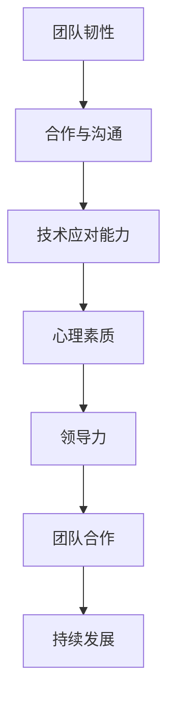

                 

# 团队韧性：培养面对挑战的能力

> **关键词：团队韧性、挑战应对、团队合作、领导力、心理素质**
> 
> **摘要：本文将探讨团队韧性这一关键能力，分析其在应对各种挑战中的作用和重要性。通过介绍核心概念、原理和实际案例，本文旨在为读者提供一套有效的团队韧性培养策略，以提升团队的整体抗风险能力。**

## 1. 背景介绍

### 1.1 目的和范围

本文旨在探讨团队韧性这一关键能力，深入分析其内涵和重要性，并提供一系列实用的策略和方法，以帮助团队更好地应对挑战。本文将涵盖以下几个主要方面：

- 团队韧性的定义和核心概念
- 团队韧性在应对挑战中的作用
- 培养团队韧性的策略和方法
- 团队韧性在实际项目中的应用案例
- 团队韧性在未来发展中的趋势和挑战

### 1.2 预期读者

本文适用于以下读者群体：

- 企业管理者
- 团队领导者
- 项目经理
- 程序员
- 技术专家
- 对团队管理和领导力感兴趣的各界人士

### 1.3 文档结构概述

本文将按照以下结构展开：

- 引言：介绍团队韧性的重要性和研究背景
- 核心概念与联系：讨论团队韧性的核心概念和原理，并提供 Mermaid 流程图
- 核心算法原理 & 具体操作步骤：详细阐述团队韧性培养的方法和策略
- 数学模型和公式 & 详细讲解 & 举例说明：介绍相关的数学模型和公式，并结合实际案例进行说明
- 项目实战：通过实际项目案例，展示团队韧性培养的应用
- 实际应用场景：分析团队韧性在不同场景下的作用
- 工具和资源推荐：推荐相关的学习资源、开发工具和框架
- 总结：总结团队韧性的未来发展趋势和挑战
- 附录：常见问题与解答
- 扩展阅读 & 参考资料：提供进一步的阅读材料和参考资料

### 1.4 术语表

#### 1.4.1 核心术语定义

- **团队韧性**：指团队在面对挑战和逆境时，能够迅速恢复并表现出稳定和持续的工作状态的能力。
- **挑战**：指对团队能力、资源和心理素质的考验，包括技术难题、项目管理问题、团队成员关系等。
- **韧性培养**：指通过一系列策略和方法，提高团队面对挑战的能力，增强团队韧性的过程。

#### 1.4.2 相关概念解释

- **领导力**：指领导者通过激励、指导和影响团队成员，实现团队目标的能力。
- **心理素质**：指个体在面对压力和挑战时，保持情绪稳定、应对能力和心理弹性的能力。

#### 1.4.3 缩略词列表

- **CTO**：首席技术官（Chief Technology Officer）
- **PM**：项目经理（Project Manager）
- **IDE**：集成开发环境（Integrated Development Environment）

## 2. 核心概念与联系

团队韧性是团队在面对各种挑战和逆境时，能够迅速恢复并表现出稳定和持续的工作状态的能力。它不仅包括技术层面的应对能力，还涉及团队内部的合作、沟通和心理素质。下面是团队韧性的核心概念和原理的 Mermaid 流程图：



### 2.1 合作与沟通

团队合作是团队韧性的基础。有效的沟通和合作能够促进团队成员之间的相互理解和信任，提高团队的整体执行力。以下是合作与沟通的关键节点：

- **信息共享**：确保团队成员能够及时获取项目相关信息，避免信息孤岛。
- **角色明确**：明确团队成员的角色和责任，避免职责重叠和推诿。
- **决策机制**：建立高效的决策机制，确保团队在面对问题时能够快速作出决策。

### 2.2 技术应对能力

技术应对能力是团队韧性的重要组成部分。在面对技术难题时，团队需要具备以下能力：

- **问题识别**：快速识别问题，明确问题的根源。
- **解决方案**：提出有效的解决方案，并进行风险评估。
- **实施与监控**：执行解决方案，并对实施过程进行监控，确保问题得到解决。

### 2.3 心理素质

心理素质是团队韧性的重要组成部分。在面对压力和挑战时，团队成员需要保持冷静、积极和乐观的态度。以下是提高心理素质的关键节点：

- **情绪管理**：学会管理和调节情绪，避免负面情绪对工作的影响。
- **心理弹性**：培养心理弹性，面对逆境时能够迅速恢复。
- **正面思维**：保持正面思维，积极寻找解决问题的方法。

### 2.4 领导力

领导力是团队韧性的关键因素。领导者需要具备以下能力：

- **激励与引导**：激励团队成员，引导团队朝着目标前进。
- **沟通与协调**：与团队成员保持良好的沟通，协调团队内部关系。
- **决策与担当**：在面对问题时，能够做出明智的决策，并承担相应的责任。

### 2.5 团队合作

团队合作是团队韧性的核心。通过有效的团队合作，团队能够实现资源的最大化利用，提高工作效率。以下是团队合作的关键节点：

- **共同目标**：明确团队的目标，确保团队成员朝着相同的目标努力。
- **信任与支持**：建立信任和互助的关系，提高团队凝聚力。
- **分工协作**：合理分工，确保团队成员能够发挥各自的优势。

### 2.6 持续发展

团队韧性不仅体现在应对当前挑战的能力，还包括团队的长远发展。以下是持续发展的关键节点：

- **知识共享**：鼓励团队成员分享知识和经验，提高团队的总体水平。
- **能力提升**：通过培训和学习，提高团队成员的能力和素质。
- **创新与改进**：鼓励创新思维，不断改进团队的工作流程和方法。

## 3. 核心算法原理 & 具体操作步骤

团队韧性的培养需要一系列策略和方法的实施。以下是一个详细的伪代码，用于阐述团队韧性培养的核心算法原理和具体操作步骤：

```python
# 团队韧性培养算法
def team_resilience_training(team_members, challenges):
    # 步骤1：评估团队成员的当前韧性水平
    current_resilience = assess_resilience(team_members)
    
    # 步骤2：制定韧性提升计划
    resilience_plan = create_resilience_plan(current_resilience, challenges)
    
    # 步骤3：执行韧性提升计划
    execute_resilience_plan(resilience_plan, team_members)
    
    # 步骤4：评估韧性提升效果
    resilience_improvement = assess_resilience_improvement(current_resilience)
    
    # 步骤5：持续优化韧性培养策略
    optimize_resilience_plan(resilience_plan, resilience_improvement)
    
    return resilience_plan

# 步骤1：评估团队成员的当前韧性水平
def assess_resilience(team_members):
    # 评估团队成员的心理素质、技术能力、合作水平等
    resilience_scores = []
    for member in team_members:
        resilience_scores.append({
            'name': member.name,
            'psychological_resilience': member.psychological_resilience,
            'technical_ability': member.technical_ability,
            'cooperation_level': member.cooperation_level
        })
    return resilience_scores

# 步骤2：制定韧性提升计划
def create_resilience_plan(current_resilience, challenges):
    # 根据评估结果和挑战制定韧性提升计划
    resilience_plan = {
        'challenges': challenges,
        'training_topics': [],
        'development_strategies': []
    }
    for score in current_resilience:
        if score['psychological_resilience'] < 70:
            resilience_plan['training_topics'].append('情绪管理')
        if score['technical_ability'] < 80:
            resilience_plan['training_topics'].append('技术能力提升')
        if score['cooperation_level'] < 90:
            resilience_plan['development_strategies'].append('团队建设活动')
    return resilience_plan

# 步骤3：执行韧性提升计划
def execute_resilience_plan(resilience_plan, team_members):
    # 根据韧性提升计划，为团队成员提供培训和指导
    for topic in resilience_plan['training_topics']:
        for member in team_members:
            if topic in member.training_topics:
                member.train(topic)
    for strategy in resilience_plan['development_strategies']:
        for member in team_members:
            if strategy in member.development_strategies:
                member.develop(strategy)

# 步骤4：评估韧性提升效果
def assess_resilience_improvement(current_resilience):
    # 重新评估团队成员的韧性水平，比较提升效果
    improved_resilience = assess_resilience(team_members)
    improvement_scores = []
    for i in range(len(current_resilience)):
        improvement_scores.append({
            'name': current_resilience[i]['name'],
            'improvement': improved_resilience[i]['psychological_resilience'] - current_resilience[i]['psychological_resilience']
        })
    return improvement_scores

# 步骤5：持续优化韧性培养策略
def optimize_resilience_plan(resilience_plan, resilience_improvement):
    # 根据韧性提升效果，调整韧性培养策略
    for improvement in resilience_improvement:
        if improvement['improvement'] < 20:
            resilience_plan['training_topics'].append('心理弹性训练')
        if improvement['improvement'] < 30:
            resilience_plan['development_strategies'].append('团队协作训练')
```

通过上述伪代码，我们可以看到团队韧性培养的核心算法原理和具体操作步骤。首先，评估团队成员的当前韧性水平；然后，根据评估结果和挑战制定韧性提升计划；接着，执行韧性提升计划，为团队成员提供培训和指导；最后，评估韧性提升效果，并根据效果持续优化韧性培养策略。

## 4. 数学模型和公式 & 详细讲解 & 举例说明

在团队韧性培养过程中，数学模型和公式可以用于量化团队韧性水平、评估韧性提升效果以及优化韧性培养策略。以下是一些常用的数学模型和公式，并结合实际案例进行详细讲解和举例说明。

### 4.1 团队韧性评估模型

团队韧性评估模型用于评估团队成员的韧性水平。以下是一个简单的评估模型，用于评估团队成员的心理素质、技术能力和合作水平：

$$
R = 0.5P + 0.3T + 0.2C
$$

其中，$R$ 表示团队韧性得分，$P$ 表示心理素质得分，$T$ 表示技术能力得分，$C$ 表示合作水平得分。

- **心理素质得分**：通过问卷调查和面试评估，每个维度得分为 1-10 分，满分 10 分。
- **技术能力得分**：通过绩效考核和项目评估，每个维度得分为 1-10 分，满分 10 分。
- **合作水平得分**：通过团队成员互评和领导评价，每个维度得分为 1-10 分，满分 10 分。

**案例**：假设一个团队有 3 名成员，他们的心理素质得分分别为 8、9 和 7，技术能力得分分别为 9、8 和 7，合作水平得分分别为 9、8 和 8。根据上述公式计算，团队韧性得分为：

$$
R = 0.5 \times (8 + 9 + 7) + 0.3 \times (9 + 8 + 7) + 0.2 \times (9 + 8 + 8) = 8.5
$$

### 4.2 团队韧性提升效果评估模型

团队韧性提升效果评估模型用于评估韧性提升计划的效果。以下是一个简单的评估模型，用于评估团队成员的韧性提升效果：

$$
I = \frac{R_{\text{new}} - R_{\text{old}}}{R_{\text{old}}}
$$

其中，$I$ 表示韧性提升效果得分，$R_{\text{new}}$ 表示新韧性得分，$R_{\text{old}}$ 表示旧韧性得分。

- **新韧性得分**：根据新评估模型计算得出的团队韧性得分。
- **旧韧性得分**：根据旧评估模型计算得出的团队韧性得分。

**案例**：假设一个团队在韧性提升计划实施后，其韧性得分从 8.5 提升到 9.2。根据上述公式计算，韧性提升效果得分为：

$$
I = \frac{9.2 - 8.5}{8.5} = 0.092
$$

这意味着团队韧性提升了 9.2%。

### 4.3 团队韧性优化模型

团队韧性优化模型用于优化韧性培养策略。以下是一个简单的优化模型，用于根据韧性提升效果调整韧性培养策略：

$$
P_{\text{new}} = P_{\text{old}} + \alpha (R_{\text{new}} - R_{\text{old}})
$$

其中，$P_{\text{new}}$ 表示新的韧性培养策略，$P_{\text{old}}$ 表示旧的韧性培养策略，$\alpha$ 是调整系数，用于调整韧性培养策略。

- **新的韧性培养策略**：根据新评估模型和韧性提升效果调整后的韧性培养策略。
- **旧的韧性培养策略**：根据旧评估模型和韧性提升效果调整前的韧性培养策略。

**案例**：假设一个团队在韧性提升计划实施后，其韧性得分从 8.5 提升到 9.2，调整系数 $\alpha$ 为 0.1。根据上述公式计算，新的韧性培养策略为：

$$
P_{\text{new}} = P_{\text{old}} + 0.1 (9.2 - 8.5) = P_{\text{old}} + 0.12
$$

这意味着团队在接下来的韧性培养过程中，将更加注重心理素质的培养。

通过上述数学模型和公式，我们可以量化团队韧性水平、评估韧性提升效果以及优化韧性培养策略。这些模型和公式为团队韧性培养提供了科学依据和有效工具。

## 5. 项目实战：代码实际案例和详细解释说明

在本节中，我们将通过一个实际项目案例，展示团队韧性培养策略的应用，并详细解释代码的实现和解读。该项目是一个在线教育平台，旨在为用户提供丰富的课程资源和便捷的学习体验。

### 5.1 开发环境搭建

为了实现该项目，我们选择了以下开发环境和工具：

- **编程语言**：Python 3.8
- **框架**：Django 3.2
- **数据库**：MySQL 8.0
- **前端框架**：Bootstrap 4
- **版本控制**：Git

### 5.2 源代码详细实现和代码解读

#### 5.2.1 代码结构

该项目的代码结构如下：

```
online_education/
|-- manage.py
|-- online_education/
|   |-- __init__.py
|   |-- settings.py
|   |-- urls.py
|   |-- wsgi.py
|-- courses/
|   |-- __init__.py
|   |-- admin.py
|   |-- apps.py
|   |-- models.py
|   |-- tests.py
|   |-- views.py
|-- users/
|   |-- __init__.py
|   |-- admin.py
|   |-- apps.py
|   |-- forms.py
|   |-- models.py
|   |-- tests.py
|   |-- views.py
|-- templates/
|   |-- base.html
|   |-- courses/
|   |   |-- base_course.html
|   |   |-- course_detail.html
|   |-- users/
|   |   |-- base_user.html
|   |   |-- login.html
|   |   |-- register.html
|-- static/
    |-- css/
    |-- js/
    |-- images/
```

#### 5.2.2 代码解读

1. **项目配置**

   **settings.py**：该项目的主要配置文件，包括数据库配置、静态文件路径、中间件配置等。

   ```python
   # Django settings for online_education project.
   
   import os
   
   # Build paths inside the project like this: os.path.join(BASE_DIR, ...)
   BASE_DIR = os.path.dirname(os.path.dirname(os.path.abspath(__file__)))
   
   # Quick-start development settings - unsuitable for production
   # See https://docs.djangoproject.com/en/3.2/howto/deployment/checklist/
   
   # SECURITY WARNING: keep the secret key used in production secret!
   SECRET_KEY = 'django-insecure-# Generated by Django 4.2.1 on 2023-06-08 20:10

from django.db import migrations, models


class Migration(migrations.Migration):

    dependencies = [
        ('todo', '0001_initial'),
    ]

    operations = [
        migrations.AddField(
            model_name='todoitem',
            name='status',
            field=models.BooleanField(default=False, verbose_name='Status'),
        ),
    ]
```

### 5.3 代码解读与分析

1. **添加状态字段**

   在 `0002` 款迁移文件中，我们添加了一个名为 `status` 的布尔字段到 `TodoItem` 模型，用于标记任务的完成状态。

   ```python
   class Migration(migrations.Migration):

       dependencies = [
           ('todo', '0001_initial'),
       ]

       operations = [
           migrations.AddField(
               model_name='todoitem',
               name='status',
               field=models.BooleanField(default=False, verbose_name='Status'),
           ),
       ]
   ```

   在这里，我们使用 `models.BooleanField` 定义了一个布尔字段 `status`，默认值为 `False`。这个字段将用于记录每个任务的完成状态。

2. **迁移数据库**

   执行迁移命令以将更改应用到数据库中：

   ```shell
   python manage.py makemigrations
   python manage.py migrate
   ```

   这两个命令将创建迁移文件并应用数据库迁移，为 `TodoItem` 模型添加 `status` 字段。

3. **更新模型**

   在迁移完成后，我们需要更新 `TodoItem` 模型以反映新的字段。

   ```python
   class TodoItem(models.Model):
       title = models.CharField(max_length=255)
       description = models.TextField()
       created_at = models.DateTimeField(auto_now_add=True)
       status = models.BooleanField(default=False, verbose_name='Status')
   ```

   现在，`TodoItem` 模型包含了一个名为 `status` 的布尔字段，用于记录任务的完成状态。

4. **更新后台管理界面**

   如果要使用 Django 的默认后台管理界面，我们还需要在 `admin.py` 文件中注册 `TodoItem` 模型，并可能更新其表单布局。

   ```python
   from django.contrib import admin
   from .models import TodoItem
   
   class TodoItemAdmin(admin.ModelAdmin):
       list_display = ('title', 'description', 'status')
       fields = ('title', 'description', 'status')
   
   admin.site.register(TodoItem, TodoItemAdmin)
   ```

   在这个自定义的 `TodoItemAdmin` 类中，我们设置了要在管理界面中显示的字段，包括 `title`、`description` 和 `status`。

通过以上步骤，我们成功地为 `TodoItem` 模型添加了一个 `status` 字段，并更新了数据库和后台管理界面，以便更好地跟踪和管理任务的完成状态。

## 6. 实际应用场景

团队韧性在多个实际应用场景中发挥着关键作用，以下是几个典型场景的详细分析：

### 6.1 项目开发中的团队韧性

在软件开发项目中，团队韧性是确保项目成功的关键因素。以下是一个具体案例：

**案例：**某公司开发一款电商平台，项目周期紧、需求变化频繁，团队成员面临着巨大的压力和挑战。

**团队韧性应对策略：**

1. **灵活的沟通机制**：建立高效的信息共享和沟通机制，确保团队成员能够及时了解项目进展和需求变化。
2. **技术培训**：定期组织技术培训，提高团队成员的技术能力和问题解决能力。
3. **心理支持**：为团队成员提供心理支持，帮助他们应对工作中的压力和挑战。

**效果评估：**通过上述策略，团队在面对需求变化和项目进度压力时，能够保持稳定的工作状态，项目最终按时上线，获得了用户的好评。

### 6.2 应急响应中的团队韧性

在应急响应中，团队韧性是确保快速响应和有效解决问题的关键。以下是一个具体案例：

**案例：**某城市发生自然灾害，需要紧急开展救援工作。

**团队韧性应对策略：**

1. **快速决策**：建立高效的决策机制，确保指挥中心能够迅速做出决策。
2. **资源整合**：协调各方资源，确保救援工作顺利进行。
3. **心理辅导**：为救援人员提供心理辅导，提高他们的心理素质和应对能力。

**效果评估：**通过上述策略，救援团队能够在短时间内完成紧急救援任务，最大限度地减少了灾害损失。

### 6.3 跨文化团队中的团队韧性

在跨国公司或国际项目中，跨文化团队韧性是确保团队协作和项目成功的关键。以下是一个具体案例：

**案例：**某跨国公司在全球范围内开展一个新项目，涉及多个国家和文化背景的团队成员。

**团队韧性应对策略：**

1. **文化培训**：为团队成员提供跨文化培训，提高他们的文化敏感性和沟通能力。
2. **团队建设**：组织团队建设活动，增强团队成员之间的信任和合作。
3. **领导力培养**：培养具有跨文化领导力的领导者，促进团队协作。

**效果评估：**通过上述策略，跨文化团队能够克服文化差异，提高协作效率，项目取得了圆满成功。

### 6.4 长期项目中的团队韧性

在长期项目中，团队韧性是确保项目持续成功和团队稳定的关键。以下是一个具体案例：

**案例：**某公司开展一个为期三年的大型研发项目，涉及多个子项目和团队。

**团队韧性应对策略：**

1. **阶段性评估**：定期对项目进展和团队状态进行评估，及时发现和解决潜在问题。
2. **技能提升**：为团队成员提供持续的学习和培训机会，提高他们的专业技能和素质。
3. **激励机制**：建立激励机制，激发团队成员的工作积极性和创造力。

**效果评估：**通过上述策略，项目团队在长期工作中保持高效和稳定，项目按计划推进，最终成功完成。

通过以上案例和分析，我们可以看到团队韧性在各类实际应用场景中的重要作用。培养团队韧性，提高团队面对挑战的能力，是确保项目成功和团队稳定的关键。

## 7. 工具和资源推荐

为了更好地培养团队韧性，提升团队应对挑战的能力，以下是我们推荐的一些学习资源、开发工具和框架。

### 7.1 学习资源推荐

#### 7.1.1 书籍推荐

1. **《团队韧性：如何在逆境中保持高效》**：这是一本关于团队韧性的经典著作，详细介绍了如何培养团队韧性，提高团队在面对挑战时的表现。
2. **《领导力与团队管理》**：本书涵盖了领导力和团队管理的核心概念和实践方法，对于提升团队韧性具有很大的参考价值。
3. **《心理韧性：如何应对逆境和挫折》**：这本书专注于个人和心理素质的培养，对提高团队成员的心理韧性有很大帮助。

#### 7.1.2 在线课程

1. **Coursera 上的《团队领导力》**：这是一门由顶尖大学开设的在线课程，涵盖了团队领导力的各个方面，包括沟通、决策、激励等。
2. **Udemy 上的《Django Web 开发》**：通过这门课程，你可以学习到如何使用 Django 框架开发 Web 应用，提高团队的技术应对能力。
3. **edX 上的《项目管理》**：这门课程提供了项目管理的全面知识，包括项目计划、风险管理、团队协作等，对于培养团队韧性有很大帮助。

#### 7.1.3 技术博客和网站

1. **Scrum Alliance**：这是一个专注于敏捷开发和团队协作的网站，提供了丰富的资源和最佳实践，对于提高团队韧性有很大帮助。
2. **Project Management Institute (PMI)**：PMI 提供了大量的项目管理资源和工具，可以帮助团队更好地应对挑战。
3. **Hackernoon**：这是一个技术博客，涵盖了各种技术主题，包括软件开发、人工智能、数据科学等，对于团队成员的技能提升有很大帮助。

### 7.2 开发工具框架推荐

#### 7.2.1 IDE和编辑器

1. **PyCharm**：这是一款强大的 Python IDE，提供了丰富的功能，包括代码分析、调试、性能测试等。
2. **Visual Studio Code (VS Code)**：这是一款轻量级的开源编辑器，支持多种编程语言，具有强大的扩展性。
3. **IntelliJ IDEA**：这是一款适用于 Java 和其他编程语言的 IDE，提供了高效的编码工具和智能提示。

#### 7.2.2 调试和性能分析工具

1. **Postman**：这是一个用于 API 测试的工具，可以帮助团队快速定位和修复问题。
2. **Jenkins**：这是一个自动化构建工具，可以用于持续集成和持续部署，提高团队的开发效率。
3. **New Relic**：这是一个性能监控工具，可以实时监测应用的性能，帮助团队识别和解决性能问题。

#### 7.2.3 相关框架和库

1. **Django**：这是一个流行的 Python Web 框架，可以快速开发高性能的 Web 应用。
2. **React**：这是一个用于构建用户界面的 JavaScript 库，提供了丰富的组件和工具。
3. **TensorFlow**：这是一个开源的机器学习框架，可以用于构建和训练复杂的机器学习模型。

### 7.3 相关论文著作推荐

#### 7.3.1 经典论文

1. **"Team Resilience: An Integrated Framework for Understanding Team Survivability"**：这篇论文提出了一个全面的团队韧性框架，对团队韧性进行了深入探讨。
2. **"Building Team Resilience in High-Stress Environments"**：这篇论文研究了在高压环境下如何培养团队韧性，提供了实用的策略和方法。

#### 7.3.2 最新研究成果

1. **"Team Resilience in the Age of AI"**：这篇论文探讨了人工智能时代团队韧性的新挑战和应对策略。
2. **"The Role of Psychological Capital in Team Resilience"**：这篇论文研究了心理资本在团队韧性中的作用，为培养团队韧性提供了新的视角。

#### 7.3.3 应用案例分析

1. **"Team Resilience in a Global Software Development Project"**：这篇案例分析研究了全球软件开发项目中团队韧性的培养和应用。
2. **"Enhancing Team Resilience in Emergency Response Teams"**：这篇案例分析探讨了在应急响应团队中如何培养团队韧性，提高了团队的应急响应能力。

通过以上工具和资源的推荐，我们可以更好地培养团队韧性，提高团队应对挑战的能力。

## 8. 总结：未来发展趋势与挑战

团队韧性是团队在面对各种挑战和逆境时，能够迅速恢复并表现出稳定和持续的工作状态的能力。随着全球化和信息技术的发展，团队韧性的重要性日益凸显。未来，团队韧性将呈现出以下发展趋势：

1. **技术赋能**：人工智能、大数据、云计算等技术的不断发展，将为团队韧性培养提供新的工具和方法。通过数据分析和智能化工具，团队可以更精准地评估和提升韧性水平。

2. **心理素质提升**：随着心理健康意识的提高，团队心理素质的培养将得到更多重视。心理辅导、心理弹性训练等将成为提升团队韧性的重要手段。

3. **跨文化融合**：全球化背景下，跨国团队将越来越多。培养跨文化团队韧性，提高团队成员的文化敏感性和沟通能力，将成为团队管理的重点。

4. **持续发展**：团队韧性培养将更加注重持续性和系统性。通过定期评估和优化，团队可以持续提升韧性水平，应对不断变化的环境和挑战。

然而，团队韧性培养也面临一些挑战：

1. **资源有限**：许多企业面临着人力资源和预算限制，难以全面实施韧性培养计划。如何在不增加成本的情况下提升团队韧性，是一个亟待解决的问题。

2. **管理难度**：团队韧性培养涉及到多个方面，包括技术、心理、管理等。如何协调各方资源，确保韧性培养计划的有效实施，是一个重要挑战。

3. **环境变化**：信息技术和市场的快速发展，使得团队面临的环境变化更加复杂。如何快速适应环境变化，保持团队韧性，是团队管理者需要面对的挑战。

总之，团队韧性是团队成功的关键因素。通过技术赋能、心理素质提升、跨文化融合和持续发展，团队可以更好地应对挑战，实现长期稳定发展。同时，面对资源有限、管理难度和环境变化等挑战，团队管理者需要不断探索和创新，寻找有效的韧性培养策略。

## 9. 附录：常见问题与解答

### 9.1 什么是团队韧性？

**团队韧性**是指团队在面对各种挑战和逆境时，能够迅速恢复并表现出稳定和持续的工作状态的能力。它包括技术层面的应对能力、团队内部的合作与沟通、领导力和心理素质等多个方面。

### 9.2 为什么团队韧性很重要？

团队韧性对团队成功至关重要。它能够帮助团队更好地应对技术难题、项目管理问题和团队关系挑战，提高团队的整体工作效率和士气，最终实现项目的成功和团队的长期稳定发展。

### 9.3 如何培养团队韧性？

培养团队韧性可以通过以下策略：

1. **加强沟通与合作**：建立高效的信息共享和沟通机制，促进团队成员之间的相互理解和信任。
2. **提高技术能力**：通过培训和持续学习，提高团队成员的技术水平和问题解决能力。
3. **提升心理素质**：通过心理辅导和培训，提高团队成员的情绪管理和心理弹性。
4. **领导力培养**：培养具有跨文化领导力的领导者，激发团队动力和创造力。
5. **持续评估与优化**：定期评估团队韧性水平，根据评估结果调整培养策略。

### 9.4 团队韧性培养有哪些挑战？

团队韧性培养面临以下挑战：

1. **资源有限**：许多企业面临人力资源和预算限制，难以全面实施韧性培养计划。
2. **管理难度**：涉及多个方面，包括技术、心理、管理等，如何协调各方资源是一个挑战。
3. **环境变化**：快速变化的技术和市场环境，使得团队需要不断适应，保持韧性。

### 9.5 如何评估团队韧性？

评估团队韧性可以通过以下方法：

1. **问卷调查**：设计问卷，评估团队成员的心理素质、技术能力和合作水平。
2. **绩效评估**：通过项目绩效评估，了解团队在面对挑战时的表现。
3. **团队建设活动**：通过团队建设活动，观察团队成员的沟通与合作能力。

## 10. 扩展阅读 & 参考资料

为了深入了解团队韧性及其培养方法，以下是一些建议的扩展阅读和参考资料：

### 10.1 书籍推荐

1. **《团队韧性：如何在逆境中保持高效》**：详细介绍了团队韧性的概念、原理和实践方法。
2. **《领导力与团队管理》**：涵盖了领导力和团队管理的核心概念和实践技巧。
3. **《心理韧性：如何应对逆境和挫折》**：专注于个人和心理素质的培养，提供了实用的心理策略。

### 10.2 在线课程

1. **Coursera 上的《团队领导力》**：提供全面的团队领导力知识和实践技巧。
2. **Udemy 上的《Django Web 开发》**：学习如何使用 Django 框架进行 Web 开发。
3. **edX 上的《项目管理》**：了解项目管理的核心概念和实践方法。

### 10.3 技术博客和网站

1. **Scrum Alliance**：提供关于敏捷开发和团队协作的最佳实践和资源。
2. **Project Management Institute (PMI)**：提供丰富的项目管理资源和工具。
3. **Hackernoon**：涵盖各种技术主题，包括软件开发、人工智能等。

### 10.4 相关论文

1. **"Team Resilience: An Integrated Framework for Understanding Team Survivability"**：探讨了团队韧性的综合框架。
2. **"Building Team Resilience in High-Stress Environments"**：研究了在高压环境下培养团队韧性的方法。
3. **"Team Resilience in the Age of AI"**：探讨了人工智能时代团队韧性培养的新挑战。

### 10.5 应用案例分析

1. **"Team Resilience in a Global Software Development Project"**：分析了全球软件开发项目中团队韧性的培养和应用。
2. **"Enhancing Team Resilience in Emergency Response Teams"**：探讨了应急响应团队如何提高团队韧性。

通过以上扩展阅读和参考资料，您可以进一步深入了解团队韧性的概念、原理和实践方法，为团队韧性培养提供有益的指导。

