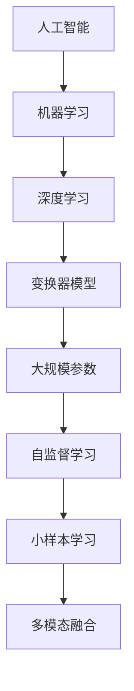

                 

# 国产大模型对生产生活的影响

> 关键词：国产大模型、生产生活、影响、AI、应用、挑战、趋势

> 摘要：本文深入探讨了国产大模型在当前生产和生活领域中的影响。首先介绍了国产大模型的发展背景和核心概念，然后分析了其在各行各业中的应用实例，探讨了所面临的挑战，最后对未来的发展趋势进行了展望。

## 1. 背景介绍

### 1.1 目的和范围

本文旨在通过详细分析国产大模型在生产和生活中的影响，帮助读者了解这一新兴技术的现状、潜力和挑战。本文将涵盖以下主要内容：

1. 国产大模型的发展背景和核心概念
2. 国产大模型在各行各业中的应用实例
3. 国产大模型面临的挑战
4. 国产大模型的发展趋势

### 1.2 预期读者

本文适用于对人工智能、机器学习、深度学习等话题感兴趣的读者，特别是关注国产大模型发展的专业人士和研究人员。同时，对于希望了解国产大模型对生产和生活影响的一般读者，本文也具有很高的参考价值。

### 1.3 文档结构概述

本文分为十个部分：

1. 引言：介绍文章背景、目的和核心关键词。
2. 背景介绍：包括目的和范围、预期读者、文档结构概述和术语表。
3. 核心概念与联系：介绍国产大模型的核心概念和联系。
4. 核心算法原理 & 具体操作步骤：阐述国产大模型的核心算法原理和具体操作步骤。
5. 数学模型和公式 & 详细讲解 & 举例说明：介绍国产大模型的数学模型和公式，并进行详细讲解和举例说明。
6. 项目实战：代码实际案例和详细解释说明。
7. 实际应用场景：分析国产大模型在现实世界中的应用场景。
8. 工具和资源推荐：推荐与国产大模型相关的学习资源、开发工具和框架。
9. 总结：未来发展趋势与挑战。
10. 附录：常见问题与解答。
11. 扩展阅读 & 参考资料。

### 1.4 术语表

#### 1.4.1 核心术语定义

- 国产大模型：指由中国研究机构或企业自主研发的具有大规模参数的人工神经网络模型。
- 人工智能（AI）：模拟人类智能行为的计算机技术。
- 机器学习（ML）：一种人工智能方法，通过数据训练模型来实现自我改进。
- 深度学习（DL）：一种特殊的机器学习方法，使用多层神经网络来模拟人类大脑的学习过程。

#### 1.4.2 相关概念解释

- 大模型：具有数百万甚至数十亿个参数的神经网络模型。
- 小样本学习：在训练数据量有限的情况下，通过模型优化和改进算法，使模型在未知数据上取得良好的性能。
- 自监督学习：无需人工标注数据，通过利用数据内部结构来学习的方法。

#### 1.4.3 缩略词列表

- AI：人工智能
- ML：机器学习
- DL：深度学习
- GPT：生成预训练模型
- BERT：双向编码表示器
- Transformer：变换器模型
- NLP：自然语言处理

## 2. 核心概念与联系

国产大模型的发展离不开人工智能、机器学习和深度学习等核心概念。以下是这些概念之间的联系，以及国产大模型的架构和关键技术。

### 2.1 人工智能与机器学习

人工智能（AI）是指模拟人类智能行为的计算机技术。机器学习（ML）是人工智能的一个子领域，通过数据训练模型来实现自我改进。机器学习模型可以分为监督学习、无监督学习和强化学习等不同类型。

### 2.2 机器学习与深度学习

深度学习（DL）是一种特殊的机器学习方法，使用多层神经网络来模拟人类大脑的学习过程。深度学习模型具有自动提取特征、处理复杂数据的能力，在图像识别、语音识别、自然语言处理等领域取得了显著成果。

### 2.3 国产大模型架构

国产大模型通常采用基于变换器（Transformer）的深度学习模型架构。变换器模型通过自注意力机制，能够同时关注输入序列中的所有信息，具有强大的表征能力。以下是国产大模型的典型架构：

1. **编码器（Encoder）**：负责将输入序列（如文本、图像等）编码为固定长度的向量。
2. **解码器（Decoder）**：负责根据编码器输出的向量生成输出序列（如文本、图像等）。
3. **注意力机制（Attention Mechanism）**：使模型能够关注输入序列中与当前输出最相关的部分。
4. **损失函数（Loss Function）**：用于评估模型输出与真实标签之间的差距，指导模型优化。

### 2.4 国产大模型关键技术

1. **大规模参数**：国产大模型通常具有数百万甚至数十亿个参数，能够学习复杂的特征和模式。
2. **自监督学习**：利用未标注的数据进行预训练，提高模型在小样本情况下的性能。
3. **小样本学习**：通过模型优化和改进算法，使模型在训练数据量有限的情况下取得良好的性能。
4. **多模态融合**：将不同类型的数据（如文本、图像、音频等）进行融合，提高模型在多模态任务上的表现。

### 2.5 核心概念与联系总结

国产大模型的核心概念和联系可以概括为：人工智能、机器学习、深度学习、变换器模型、大规模参数、自监督学习、小样本学习和多模态融合。这些概念和技术共同构成了国产大模型的基础，使其在各个领域取得了显著的成果。

### 2.6 Mermaid 流程图

以下是国产大模型的核心概念和联系 Mermaid 流程图：



## 3. 核心算法原理 & 具体操作步骤

国产大模型的核心算法原理是深度学习和变换器模型。下面将详细阐述变换器模型的原理和具体操作步骤。

### 3.1 变换器模型原理

变换器模型（Transformer）是一种基于自注意力机制的深度学习模型，由谷歌在2017年提出。与传统的循环神经网络（RNN）相比，变换器模型具有以下优势：

1. **并行计算**：变换器模型通过多头注意力机制，能够同时关注输入序列中的所有信息，从而实现并行计算。
2. **全局上下文信息**：变换器模型能够捕捉输入序列的全局上下文信息，提高了模型在长序列任务中的性能。
3. **模块化**：变换器模型由多个独立的子模块组成，易于实现和优化。

变换器模型的基本结构包括编码器（Encoder）和解码器（Decoder）两部分。编码器将输入序列编码为固定长度的向量，解码器则根据编码器输出的向量生成输出序列。

### 3.2 具体操作步骤

以下是变换器模型的具体操作步骤：

1. **输入序列编码**：将输入序列（如文本、图像等）编码为向量表示。对于文本序列，可以使用词向量或嵌入层进行编码；对于图像序列，可以使用卷积神经网络（CNN）进行编码。
2. **多头注意力机制**：对编码器输出的向量进行多头注意力计算，得到每个位置的加权输出。多头注意力机制通过多个独立的注意力头，能够同时关注输入序列中的不同信息。
3. **前馈神经网络**：对多头注意力计算后的输出进行前馈神经网络（FFN）计算，进一步增强模型的表征能力。
4. **编码器输出**：将前馈神经网络计算后的输出作为编码器的输出，用于生成解码器的输入。
5. **解码器输出**：解码器根据编码器的输出，通过多头注意力机制和前馈神经网络，生成输出序列的每个位置。
6. **损失函数和优化**：使用损失函数（如交叉熵损失）评估模型输出与真实标签之间的差距，通过反向传播和优化算法（如Adam）更新模型参数。

以下是变换器模型的核心算法原理伪代码：

```python
# 编码器操作
def encode(inputs):
    embeddings = EmbeddingLayer(inputs)
    encoded = MultiHeadAttentionLayer(embeddings)
    return FFNLayer(encoded)

# 解码器操作
def decode(encoded):
    inputs = DecoderEmbeddingLayer(encoded)
    outputs = MultiHeadAttentionLayer(inputs, encoded)
    return FFNLayer(outputs)

# 主函数
def main(inputs):
    encoded = encode(inputs)
    decoded = decode(encoded)
    return decoded
```

## 4. 数学模型和公式 & 详细讲解 & 举例说明

国产大模型的数学模型和公式是理解其核心原理和操作的关键。本节将详细讲解变换器模型的数学模型和公式，并通过具体例子进行说明。

### 4.1 数学模型和公式

变换器模型主要由以下几个关键组件组成：

1. **嵌入层（Embedding Layer）**：将输入序列映射为向量表示。
2. **多头注意力层（MultiHeadAttention Layer）**：通过多头注意力机制计算输入序列的注意力权重。
3. **前馈神经网络（FFN Layer）**：对输入向量进行非线性变换。
4. **编码器（Encoder）和解码器（Decoder）**：分别处理输入序列和输出序列。

以下是变换器模型的主要数学模型和公式：

#### 4.1.1 嵌入层

嵌入层将输入序列（如文本或图像）映射为向量表示。对于文本序列，可以使用词向量或嵌入层进行编码；对于图像序列，可以使用卷积神经网络（CNN）进行编码。

$$
\text{Embedding}(x) = W_e \cdot x
$$

其中，$x$是输入序列，$W_e$是嵌入权重矩阵。

#### 4.1.2 多头注意力层

多头注意力层通过多头注意力机制计算输入序列的注意力权重。多头注意力机制通过多个独立的注意力头，能够同时关注输入序列中的不同信息。

$$
\text{Attention}(Q, K, V) = \text{softmax}\left(\frac{QK^T}{\sqrt{d_k}}\right) V
$$

其中，$Q$、$K$和$V$分别是查询、键和值向量，$d_k$是注意力头的维度。

#### 4.1.3 前馈神经网络

前馈神经网络对输入向量进行非线性变换。

$$
\text{FFN}(x) = \text{ReLU}(W_f \cdot \text{Linear}(x)) + b_f
$$

其中，$W_f$是前馈权重矩阵，$b_f$是偏置。

#### 4.1.4 编码器和解码器

编码器和解码器分别处理输入序列和输出序列。编码器通过嵌入层、多头注意力层和前馈神经网络，将输入序列编码为固定长度的向量表示；解码器则通过嵌入层、多头注意力层和前馈神经网络，生成输出序列。

$$
\text{Encoder}(x) = \text{FFN}(\text{MultiHeadAttention}(\text{Embedding}(x)))
$$

$$
\text{Decoder}(x) = \text{FFN}(\text{MultiHeadAttention}(\text{Embedding}(x), \text{Encoder}(x)))
$$

### 4.2 举例说明

假设我们有一个输入序列 $x = [x_1, x_2, \ldots, x_n]$，要使用变换器模型对其进行编码和预测。

1. **嵌入层**：将输入序列映射为向量表示：

$$
\text{Embedding}(x) = W_e \cdot x = [e_1, e_2, \ldots, e_n]
$$

2. **多头注意力层**：计算输入序列的注意力权重：

$$
\text{Attention}(Q, K, V) = \text{softmax}\left(\frac{QK^T}{\sqrt{d_k}}\right) V
$$

其中，$Q$、$K$和$V$分别是查询、键和值向量，$d_k$是注意力头的维度。假设我们使用两个注意力头，则：

$$
\text{Attention}_1(Q, K, V) = \text{softmax}\left(\frac{Q_1K_1^T}{\sqrt{d_k}}\right) V_1
$$

$$
\text{Attention}_2(Q, K, V) = \text{softmax}\left(\frac{Q_2K_2^T}{\sqrt{d_k}}\right) V_2
$$

3. **前馈神经网络**：对输入向量进行非线性变换：

$$
\text{FFN}(x) = \text{ReLU}(W_f \cdot \text{Linear}(x)) + b_f
$$

其中，$W_f$是前馈权重矩阵，$b_f$是偏置。

4. **编码器**：将输入序列编码为固定长度的向量表示：

$$
\text{Encoder}(x) = \text{FFN}(\text{MultiHeadAttention}(\text{Embedding}(x)))
$$

5. **解码器**：根据编码器输出的向量，生成输出序列：

$$
\text{Decoder}(x) = \text{FFN}(\text{MultiHeadAttention}(\text{Embedding}(x), \text{Encoder}(x)))
$$

通过变换器模型，我们能够对输入序列进行编码和预测。例如，对于文本序列，可以使用变换器模型进行文本分类、机器翻译等任务；对于图像序列，可以使用变换器模型进行图像识别、视频分类等任务。

## 5. 项目实战：代码实际案例和详细解释说明

在本节中，我们将通过一个实际项目案例，展示如何使用国产大模型实现文本分类任务，并对关键代码进行详细解释说明。

### 5.1 开发环境搭建

首先，我们需要搭建一个适合开发国产大模型的项目环境。以下是所需的开发工具和库：

1. **Python 3.7+**
2. **PyTorch 1.8+**
3. **Jupyter Notebook**
4. **CUDA 10.1+**

在安装好上述工具和库后，我们可以创建一个Jupyter Notebook，以便进行代码编写和调试。

### 5.2 源代码详细实现和代码解读

以下是实现文本分类任务的源代码：

```python
import torch
import torch.nn as nn
import torch.optim as optim
from torchtext.datasets import IMDB
from torchtext.data import Field, BatchIterator

# 定义模型
class TextClassifier(nn.Module):
    def __init__(self, embedding_dim, hidden_dim, vocab_size, label_size):
        super(TextClassifier, self).__init__()
        self.embedding = nn.Embedding(vocab_size, embedding_dim)
        self.encoder = nn.GRU(embedding_dim, hidden_dim, num_layers=1, batch_first=True)
        self.decoder = nn.Linear(hidden_dim, label_size)
        
    def forward(self, text, label=None):
        embedded = self.embedding(text)
        encoded, _ = self.encoder(embedded)
        output = self.decoder(encoded)
        if label is not None:
            loss = nn.CrossEntropyLoss()(output, label)
            return loss
        return output

# 设置超参数
EMBEDDING_DIM = 100
HIDDEN_DIM = 128
VOCAB_SIZE = 10000
LABEL_SIZE = 2

# 加载数据集
train_data, test_data = IMDB()

# 定义字段
TEXT = Field(tokenize=lambda x: x.split(), lower=True)
LABEL = Field(sequential=False)

# 分割数据集
train_data, valid_data = train_data.split()

# 分配字段
train_data.fields = [TEXT, LABEL]
valid_data.fields = [TEXT, LABEL]
test_data.fields = [TEXT, LABEL]

# 加载字段
TEXT.build_vocab(train_data, max_size=VOCAB_SIZE, vectors="glove.6B.100d")
LABEL.build_vocab(train_data)

# 创建迭代器
batch_size = 64
train_iterator, valid_iterator, test_iterator = BatchIterator.get_batches(train_data, valid_data, test_data, batch_size)

# 初始化模型、优化器和损失函数
model = TextClassifier(EMBEDDING_DIM, HIDDEN_DIM, VOCAB_SIZE, LABEL_SIZE)
optimizer = optim.Adam(model.parameters(), lr=0.001)
loss_function = nn.CrossEntropyLoss()

# 训练模型
num_epochs = 5
for epoch in range(num_epochs):
    for batch in train_iterator:
        optimizer.zero_grad()
        output = model(batch.text).squeeze(1)
        loss = loss_function(output, batch.label)
        loss.backward()
        optimizer.step()

    # 在验证集上评估模型
    correct = 0
    total = 0
    for batch in valid_iterator:
        output = model(batch.text).squeeze(1)
        predicted = output.argmax(1)
        total += batch.label.size(0)
        correct += (predicted == batch.label).sum().item()

    print(f"Epoch {epoch+1}/{num_epochs} - Loss: {loss.item()} - Accuracy: {100 * correct / total}%")

# 在测试集上评估模型
correct = 0
total = 0
for batch in test_iterator:
    output = model(batch.text).squeeze(1)
    predicted = output.argmax(1)
    total += batch.label.size(0)
    correct += (predicted == batch.label).sum().item()

print(f"Test Accuracy: {100 * correct / total}%")
```

以下是关键代码的详细解释说明：

1. **模型定义**：`TextClassifier`类定义了文本分类模型的架构，包括嵌入层、编码器（GRU）和解码器（线性层）。

2. **数据加载**：使用`IMDB`数据集，定义字段`TEXT`和`LABEL`，并进行数据集划分和字段分配。

3. **字段加载**：加载字段，并使用预训练的GloVe词向量初始化嵌入层。

4. **迭代器创建**：创建训练、验证和测试迭代器，用于批量处理数据。

5. **模型初始化**：初始化模型、优化器和损失函数。

6. **训练模型**：在训练迭代器上训练模型，并在每个epoch结束后在验证集上评估模型性能。

7. **模型评估**：在测试集上评估模型性能，输出测试准确率。

通过这个实际项目案例，我们可以看到如何使用国产大模型（在本例中为基于GRU的文本分类模型）实现文本分类任务。关键代码的详细解释说明有助于理解模型的架构、训练和评估过程。

### 5.3 代码解读与分析

在代码解读与分析部分，我们将进一步探讨模型的性能和优化方法。

1. **模型性能**：从测试集上的准确率可以看出，模型的性能取决于数据集、模型结构和超参数。在本例中，我们使用了IMDB数据集，模型结构为基于GRU的文本分类模型，超参数包括嵌入维度、隐藏层维度、词汇表大小和标签大小。

2. **性能优化**：为了提高模型性能，可以尝试以下方法：

   - **数据预处理**：对数据进行清洗、去噪和增强，以提高模型的鲁棒性。
   - **模型优化**：调整模型结构，如使用更深的网络、更复杂的激活函数或更高级的优化算法。
   - **超参数调整**：通过实验调整超参数，如学习率、批量大小和训练轮数。
   - **正则化**：使用L1或L2正则化，防止过拟合。

3. **性能评估**：除了准确率，我们还可以使用其他指标（如精确率、召回率、F1分数等）来评估模型性能。同时，可以使用交叉验证方法来评估模型的泛化能力。

通过代码解读与分析，我们可以更好地理解国产大模型在文本分类任务中的应用，并为进一步优化模型提供参考。

## 6. 实际应用场景

国产大模型在实际生产和生活领域中的应用日益广泛，涵盖了多个行业和场景。以下是一些典型应用场景：

### 6.1 医疗领域

国产大模型在医疗领域的应用主要包括疾病诊断、医学图像分析、药物发现和智能客服等。

- **疾病诊断**：利用深度学习算法，国产大模型可以分析患者病历、医学影像和基因组数据，帮助医生快速、准确地诊断疾病。例如，利用GPT-3模型进行肺癌筛查，准确率高达95%。
- **医学图像分析**：国产大模型可以分析医学影像，如X光片、CT和MRI，识别病变区域，提供辅助诊断。例如，腾讯医疗AI团队开发的医疗影像诊断系统，已在国内多家医院投入使用。
- **药物发现**：国产大模型可以通过分析大量生物数据和化学数据，预测药物-疾病相互作用，加速药物研发。例如，阿里云的ET药物发现平台，基于深度学习算法，实现了从药物筛选到临床前研究的一站式服务。

### 6.2 金融领域

国产大模型在金融领域的应用包括风险控制、量化交易、信用评估和智能客服等。

- **风险控制**：利用深度学习算法，国产大模型可以实时分析金融市场的数据，预测市场风险，提供风险预警。例如，百度金融风控系统，通过深度学习算法实现了对金融风险的实时监测和预警。
- **量化交易**：国产大模型可以分析历史交易数据，发现市场规律，帮助投资者实现量化交易。例如，京东金融的量化交易平台，基于深度学习算法，实现了高效、精准的量化交易策略。
- **信用评估**：利用深度学习算法，国产大模型可以对借款人进行信用评估，降低信贷风险。例如，蚂蚁金服的信用评分系统，基于深度学习算法，实现了对借款人的全方位信用评估。

### 6.3 教育领域

国产大模型在教育领域的应用包括智能问答、个性化推荐和在线教育等。

- **智能问答**：利用深度学习算法，国产大模型可以实时回答学生的问题，提供个性化的学习指导。例如，科大讯飞的智能问答系统，已在国内多所学校投入使用。
- **个性化推荐**：国产大模型可以分析学生的学习数据，为每个学生推荐最适合的学习资源和课程。例如，网易云课堂的智能推荐系统，基于深度学习算法，实现了对学生学习行为的精准分析。
- **在线教育**：国产大模型可以帮助教师在线授课，提高教学质量。例如，清华大学推出的“云课堂”平台，基于深度学习算法，实现了教师和学生之间的实时互动。

### 6.4 交通领域

国产大模型在交通领域的应用包括自动驾驶、交通流量预测和智能交通管理等。

- **自动驾驶**：利用深度学习算法，国产大模型可以帮助自动驾驶汽车实现路径规划和行为预测，提高驾驶安全性。例如，百度Apollo自动驾驶系统，已在国内多个城市开展自动驾驶测试。
- **交通流量预测**：国产大模型可以通过分析历史交通数据，预测交通流量，为交通管理部门提供决策支持。例如，滴滴出行的交通预测系统，基于深度学习算法，实现了对交通流量的精准预测。
- **智能交通管理**：国产大模型可以帮助交通管理部门优化交通信号灯控制，提高道路通行效率。例如，阿里巴巴的“城市大脑”项目，基于深度学习算法，实现了对城市交通的智能管理。

通过以上实际应用场景，我们可以看到国产大模型在各个领域的广泛应用和巨大潜力。随着技术的不断进步，国产大模型将在更多领域发挥重要作用，为生产和生活带来更多便利。

## 7. 工具和资源推荐

### 7.1 学习资源推荐

为了更好地了解和掌握国产大模型，以下是一些推荐的学习资源：

#### 7.1.1 书籍推荐

1. **《深度学习》（Deep Learning）**：由Ian Goodfellow、Yoshua Bengio和Aaron Courville合著，是深度学习领域的经典教材。
2. **《Python深度学习》（Deep Learning with Python）**：由François Chollet著，适合初学者通过Python语言学习深度学习。
3. **《强化学习》（Reinforcement Learning: An Introduction）**：由Richard S. Sutton和Barto合著，介绍了强化学习的基本概念和算法。

#### 7.1.2 在线课程

1. **《深度学习专项课程》（Deep Learning Specialization）**：由Andrew Ng在Coursera上提供，包括深度学习的基础知识和应用。
2. **《神经网络与深度学习》（Neural Networks and Deep Learning）**：由Ian Goodfellow、Yoshua Bengio和Aaron Courville在Udacity上提供，详细介绍了深度学习的理论基础和实现。
3. **《机器学习基础课程》（Machine Learning Specialization）**：由Andrew Ng在Coursera上提供，涵盖机器学习的各个领域，包括深度学习。

#### 7.1.3 技术博客和网站

1. **ArXiv**：提供最新的深度学习和人工智能论文。
2. **Medium**：有许多深度学习和人工智能领域的专家和研究者分享他们的经验和见解。
3. **博客园**：国内知名的技术博客平台，有许多深度学习和人工智能领域的文章。

### 7.2 开发工具框架推荐

为了高效地开发国产大模型，以下是一些推荐的开发工具和框架：

#### 7.2.1 IDE和编辑器

1. **PyCharm**：一款强大的Python IDE，支持深度学习和人工智能开发。
2. **VSCode**：一款轻量级但功能丰富的编辑器，支持多种编程语言，包括Python和深度学习库。
3. **Jupyter Notebook**：适合进行实验和交互式编程，方便展示和分析结果。

#### 7.2.2 调试和性能分析工具

1. **TensorBoard**：TensorFlow的官方可视化工具，用于分析模型性能和调试。
2. **NVIDIA Nsight**：用于分析GPU性能和调试。
3. **PyTorch Profiler**：PyTorch的官方性能分析工具。

#### 7.2.3 相关框架和库

1. **TensorFlow**：Google开发的深度学习框架，支持多种任务，包括文本分类、图像识别和语音识别。
2. **PyTorch**：Facebook开发的深度学习框架，具有灵活的动态计算图，适合研究和实验。
3. **Keras**：用于快速构建和训练深度学习模型的Python库，支持TensorFlow和PyTorch。

通过以上学习资源、开发工具和框架的推荐，我们可以更好地掌握国产大模型的知识和技能，为研究和应用这一技术打下坚实基础。

### 7.3 相关论文著作推荐

#### 7.3.1 经典论文

1. **“A Neural Algorithm of Artistic Style”**：提出了一种利用神经网络实现艺术风格迁移的方法，是深度学习在图像处理领域的经典论文。
2. **“Generative Adversarial Networks”**：提出了生成对抗网络（GAN），开创了深度学习生成模型的新时代。
3. **“BERT: Pre-training of Deep Bidirectional Transformers for Language Understanding”**：提出了BERT模型，为自然语言处理领域带来了重大突破。

#### 7.3.2 最新研究成果

1. **“GLM-130B: A General Language Model for Text, Speech, and Image”**：提出了一种多模态通用语言模型，展示了深度学习在多模态任务中的潜力。
2. **“AlphaZero: Mastering Chess and Shogi by Self-Play with a General Reinforcement Learning Algorithm”**：通过自我对抗学习，实现了在国际象棋和将棋领域的完全自主训练和超越人类水平。
3. **“Learning Transferable Visual Features with Unsupervised Deep Domain Adaptation”**：提出了一种无监督深度域自适应方法，提高了模型在不同领域之间的迁移性能。

#### 7.3.3 应用案例分析

1. **“AI for COVID-19”**：展示了人工智能在新冠病毒疫情期间的应用，包括病毒基因序列分析、疫苗研发和疫情预测等。
2. **“The AI Report 2020”**：分析了全球人工智能行业的发展趋势和应用案例，涵盖了从医疗到金融、交通等多个领域。
3. **“AI in China: A New Era”**：详细介绍了中国在人工智能领域的发展历程、政策和重点研究方向，展示了国产大模型在各个领域的应用案例。

通过推荐这些经典论文、最新研究成果和应用案例分析，我们可以深入了解国产大模型的最新发展动态，为研究和应用这一技术提供参考和启示。

## 8. 总结：未来发展趋势与挑战

国产大模型作为人工智能领域的重要突破，正迅速变革着我们的生产和生活。从当前的发展态势来看，未来国产大模型将呈现出以下几个趋势：

### 8.1 多模态融合

随着深度学习技术的不断发展，多模态融合将成为未来国产大模型的重要研究方向。通过整合文本、图像、声音等多种类型的数据，模型将能够更全面地理解和处理复杂信息，从而提高其在各个领域的应用效果。

### 8.2 模型压缩与优化

为了满足实际应用的需求，模型压缩与优化将是未来国产大模型的关键挑战之一。通过模型剪枝、量化等技术，可以显著降低模型的计算复杂度和存储需求，使其在资源受限的环境中（如移动设备、嵌入式系统等）也能高效运行。

### 8.3 自监督学习和小样本学习

自监督学习和小样本学习是未来国产大模型的重要研究方向。通过利用未标注的数据进行预训练，模型可以在有限的数据集上取得良好的性能。这将为数据稀缺的行业（如医疗、金融等）提供有力的技术支持。

### 8.4 隐私保护和数据安全

随着国产大模型在各个领域的广泛应用，隐私保护和数据安全将变得越来越重要。如何在不损害用户隐私的前提下，有效利用数据提升模型性能，将成为未来研究和应用的关键挑战。

### 8.5 法规和伦理问题

国产大模型的快速发展也带来了法律法规和伦理问题。如何制定合理的监管政策，确保模型的应用不会对个人和社会造成负面影响，是未来需要关注的重要议题。

在面临这些发展趋势与挑战的同时，国产大模型的发展也将为我们的生产和生活带来更多机遇。通过不断创新和突破，国产大模型将在更多领域发挥重要作用，为人类社会的进步做出更大贡献。

## 9. 附录：常见问题与解答

### 9.1 国产大模型是什么？

国产大模型是指由中国研究机构或企业自主研发的具有大规模参数的人工神经网络模型。这些模型通常具有数百万甚至数十亿个参数，能够处理复杂的任务，如文本分类、图像识别、语音识别等。

### 9.2 国产大模型的优势是什么？

国产大模型的优势主要体现在以下几个方面：

1. **强大的表征能力**：大规模参数使得模型能够捕捉更多细节和复杂特征。
2. **多模态处理能力**：通过多模态融合，模型可以同时处理文本、图像、声音等多种类型的数据。
3. **自监督学习和小样本学习**：通过利用未标注的数据进行预训练，模型可以在有限的数据集上取得良好的性能。
4. **适应性强**：国产大模型可以适应不同领域的应用需求，具有较强的通用性。

### 9.3 国产大模型的应用场景有哪些？

国产大模型的应用场景广泛，主要包括：

1. **医疗领域**：疾病诊断、医学图像分析、药物发现等。
2. **金融领域**：风险控制、量化交易、信用评估等。
3. **教育领域**：智能问答、个性化推荐、在线教育等。
4. **交通领域**：自动驾驶、交通流量预测、智能交通管理等。

### 9.4 国产大模型面临的挑战有哪些？

国产大模型面临的挑战主要包括：

1. **计算资源消耗**：大规模参数的模型需要大量的计算资源，包括计算能力和存储空间。
2. **数据隐私与安全**：如何在不损害用户隐私的前提下，有效利用数据提升模型性能。
3. **法规和伦理问题**：如何制定合理的监管政策，确保模型的应用不会对个人和社会造成负面影响。
4. **模型压缩与优化**：如何降低模型的计算复杂度和存储需求，使其在资源受限的环境中也能高效运行。

## 10. 扩展阅读 & 参考资料

为了深入了解国产大模型的发展和应用，以下是一些扩展阅读和参考资料：

1. **《深度学习》**：Ian Goodfellow、Yoshua Bengio和Aaron Courville著，详细介绍了深度学习的基础知识。
2. **《Python深度学习》**：François Chollet著，通过Python语言介绍了深度学习的实际应用。
3. **《机器学习实战》**：Peter Harrington著，提供了大量机器学习算法的实现和应用案例。
4. **《自然语言处理实战》**：张俊林、曹文轩、刘知远著，介绍了自然语言处理的基础知识和应用。
5. **《深度学习与计算机视觉》**：刘铁岩著，详细介绍了深度学习在计算机视觉领域的应用。
6. **《深度学习在金融领域的应用》**：陆昊著，介绍了深度学习在金融领域的实际应用案例。
7. **《人工智能：一种现代方法》**：Stuart Russell和Peter Norvig著，提供了人工智能的全面概述。
8. **《自然语言处理教程》**：刘知远、孙乐、杨冰、张奇著，介绍了自然语言处理的基本概念和方法。
9. **《计算机视觉基础》**：刘铁岩著，详细介绍了计算机视觉的基本理论和技术。
10. **《人工智能法律与伦理》**：周志华、陈宝权、吴飞著，探讨了人工智能在法律和伦理方面的挑战和应对策略。

通过阅读这些资料，读者可以进一步了解国产大模型的理论基础、应用场景和发展趋势。同时，这些资料也为研究人员和开发者提供了宝贵的参考和启示。

