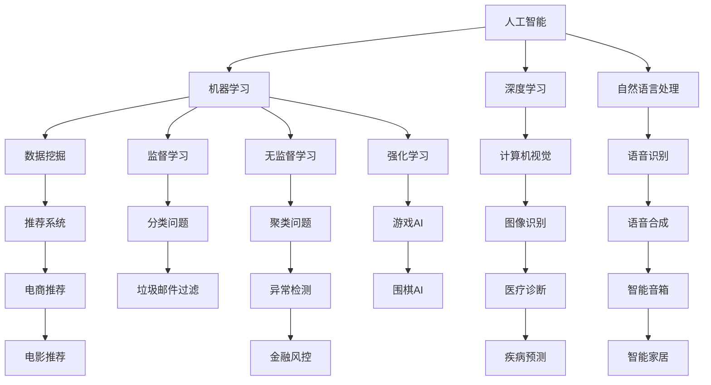

                 

# 国际合作：构建 AI 时代的全球治理体系

> **关键词：**人工智能，国际合作，全球治理，AI 伦理，数据隐私，技术标准

> **摘要：**本文探讨了人工智能在全球化背景下的重要性和挑战，提出了构建 AI 时代的全球治理体系的必要性。文章从核心概念、算法原理、数学模型、项目实战、应用场景等多个维度，分析了国际合作在 AI 发展中的作用，为推动全球 AI 治理提供了理论和实践依据。

## 1. 背景介绍

### 1.1 目的和范围

本文旨在探讨人工智能（AI）时代的全球治理问题，分析国际合作在推动全球 AI 治理体系构建中的重要作用。文章将围绕核心概念、算法原理、数学模型、项目实战、应用场景等方面展开，旨在为各国政府、研究机构、企业及公众提供有益的参考和启示。

### 1.2 预期读者

本文面向对人工智能和全球治理有兴趣的读者，包括但不限于：

1. AI 领域的研究人员和技术专家；
2. 政府官员和政策制定者；
3. 企业家和创业者；
4. 高校师生和研究人员；
5. 对 AI 技术感兴趣的一般读者。

### 1.3 文档结构概述

本文共分为十个部分：

1. 背景介绍：阐述研究目的、预期读者和文档结构；
2. 核心概念与联系：介绍 AI 相关概念、原理和架构；
3. 核心算法原理 & 具体操作步骤：讲解 AI 算法原理和操作步骤；
4. 数学模型和公式 & 详细讲解 & 举例说明：阐述相关数学模型和公式；
5. 项目实战：提供实际案例和代码解读；
6. 实际应用场景：分析 AI 在不同领域的应用；
7. 工具和资源推荐：推荐相关学习资源和开发工具；
8. 总结：展望 AI 时代的未来发展；
9. 附录：常见问题与解答；
10. 扩展阅读 & 参考资料：提供进一步阅读和参考文献。

### 1.4 术语表

#### 1.4.1 核心术语定义

- **人工智能（AI）**：一种模拟人类智能的技术，包括机器学习、深度学习、自然语言处理等子领域。
- **国际合作**：各国政府、研究机构、企业等在特定领域进行的合作，以实现共同目标。
- **全球治理**：全球范围内对重大问题进行协调和管理的体系。
- **数据隐私**：个人信息的安全保护，防止未经授权的访问和泄露。
- **技术标准**：在特定领域内，由权威机构制定的一系列规范和准则。

#### 1.4.2 相关概念解释

- **算法**：解决特定问题的计算步骤和规则。
- **机器学习**：一种让计算机通过数据自动学习和改进的方法。
- **深度学习**：一种基于多层神经网络进行数据分析和决策的技术。
- **自然语言处理**：使计算机理解和处理人类语言的技术。

#### 1.4.3 缩略词列表

- **AI**：人工智能
- **ML**：机器学习
- **DL**：深度学习
- **NLP**：自然语言处理
- **GDPR**：通用数据保护条例
- **ISO**：国际标准化组织

## 2. 核心概念与联系

在探讨 AI 时代的全球治理之前，我们需要了解一些核心概念和它们之间的关系。以下是一个简化的 Mermaid 流程图，展示了这些概念及其相互联系：



### 2.1 核心概念解释

- **人工智能（AI）**：AI 是一个广泛的概念，包括多个子领域，如机器学习、深度学习和自然语言处理等。AI 的目标是让计算机模拟人类的智能行为。
- **机器学习（ML）**：ML 是 AI 的一个子领域，通过数据训练模型，使计算机能够自动学习和改进。
- **深度学习（DL）**：DL 是一种基于多层神经网络进行数据分析和决策的技术，它在图像识别、语音识别等领域取得了显著成果。
- **自然语言处理（NLP）**：NLP 是使计算机理解和处理人类语言的技术，包括语音识别、文本分类、机器翻译等。

### 2.2 概念之间的关系

- **AI 与 ML**：AI 包含 ML，ML 是实现 AI 的方法之一。
- **ML 与 DL**：ML 包含 DL，DL 是 ML 的一种特殊形式，具有多层神经网络结构。
- **NLP 与 DL**：NLP 利用 DL 技术进行文本分析和处理，实现语音识别、机器翻译等功能。

## 3. 核心算法原理 & 具体操作步骤

在了解核心概念之后，我们将深入探讨 AI 中的核心算法原理及其具体操作步骤。以下是一个简化的伪代码，用于解释机器学习中的监督学习算法：

```python
# 伪代码：监督学习算法实现
initialize_model()
for each training example (x, y) in dataset:
    compute_output(output)
    compute_loss(output, y)
    update_model_parameters(loss)
```

### 3.1 初始化模型

初始化模型参数，包括权重、偏置等。这些参数通常通过随机初始化或预训练模型进行初始化。

```python
# 初始化模型参数
weights = random_weights()
bias = random_bias()
```

### 3.2 计算输出

使用输入特征 `x` 和模型参数（权重 `weights` 和偏置 `bias`）计算输出。

```python
# 计算输出
output = activate_function(dot_product(weights, x) + bias)
```

### 3.3 计算损失

计算模型输出与真实标签 `y` 之间的差异，即损失。

```python
# 计算损失
loss = compute_loss(output, y)
```

### 3.4 更新模型参数

根据损失函数，更新模型参数以减小损失。

```python
# 更新模型参数
weights -= learning_rate * gradient_of_loss_with_respect_to_weights
bias -= learning_rate * gradient_of_loss_with_respect_to_bias
```

### 3.5 重复迭代

重复执行计算输出、计算损失和更新模型参数的过程，直至满足收敛条件。

```python
# 重复迭代
while not converged:
    compute_output(output)
    compute_loss(output, y)
    update_model_parameters(loss)
```

## 4. 数学模型和公式 & 详细讲解 & 举例说明

在 AI 中，数学模型和公式起着至关重要的作用。以下是一些常用的数学模型和公式，以及它们的详细讲解和举例说明。

### 4.1 损失函数

损失函数是监督学习中的核心组件，用于衡量模型输出与真实标签之间的差异。以下是一些常用的损失函数：

#### 4.1.1 均方误差（MSE）

均方误差（MSE）是监督学习中常用的损失函数，计算公式如下：

$$
MSE = \frac{1}{n}\sum_{i=1}^{n}(y_i - \hat{y}_i)^2
$$

其中，$y_i$ 为真实标签，$\hat{y}_i$ 为模型输出，$n$ 为样本数量。

#### 4.1.2 交叉熵损失（Cross-Entropy Loss）

交叉熵损失函数常用于分类问题，计算公式如下：

$$
Cross-Entropy Loss = -\sum_{i=1}^{n} y_i \log(\hat{y}_i)
$$

其中，$y_i$ 为真实标签，$\hat{y}_i$ 为模型输出。

#### 4.1.3 举例说明

假设我们有一个二元分类问题，真实标签 $y$ 为 [1, 0, 1, 0]，模型输出 $\hat{y}$ 为 [0.6, 0.4, 0.8, 0.2]。

使用交叉熵损失函数计算损失：

$$
Cross-Entropy Loss = -[1 \times \log(0.6) + 0 \times \log(0.4) + 1 \times \log(0.8) + 0 \times \log(0.2)] \approx 0.613
$$

### 4.2 激活函数

激活函数是神经网络中的重要组成部分，用于引入非线性特性。以下是一些常用的激活函数：

#### 4.2.1 sigmoid 函数

sigmoid 函数计算公式如下：

$$
sigmoid(x) = \frac{1}{1 + e^{-x}}
$$

#### 4.2.2 ReLU 函数

ReLU 函数计算公式如下：

$$
ReLU(x) = \max(0, x)
$$

#### 4.2.3 举例说明

对于输入 $x = -2$：

- sigmoid(x) = 0.11863
- ReLU(x) = 0

### 4.3 反向传播算法

反向传播算法是神经网络训练的核心算法，用于更新模型参数。以下是一个简化的反向传播算法步骤：

#### 4.3.1 前向传播

计算模型输出：

$$
\hat{y} = \sigma(\sum_{i} w_i * a_i + b)
$$

其中，$\sigma$ 为激活函数，$w_i$ 和 $b$ 为模型参数。

#### 4.3.2 计算损失

计算损失函数：

$$
loss = \frac{1}{2} \sum_{i} (y_i - \hat{y}_i)^2
$$

#### 4.3.3 计算梯度

计算模型参数的梯度：

$$
\frac{\partial loss}{\partial w_i} = (y_i - \hat{y}_i) * a_i * (1 - a_i)
$$

$$
\frac{\partial loss}{\partial b} = (y_i - \hat{y}_i) * a_i
$$

#### 4.3.4 更新参数

更新模型参数：

$$
w_i = w_i - learning_rate * \frac{\partial loss}{\partial w_i}
$$

$$
b = b - learning_rate * \frac{\partial loss}{\partial b}
$$

## 5. 项目实战：代码实际案例和详细解释说明

为了更好地理解 AI 中的核心算法和数学模型，我们将通过一个实际项目来展示代码实现和详细解释。本项目将使用 Python 编写一个简单的线性回归模型，用于预测房价。

### 5.1 开发环境搭建

首先，我们需要搭建一个 Python 开发环境。以下是一个简化的步骤：

1. 安装 Python 3.x（建议使用 Anaconda，以便管理依赖项）。
2. 安装必要的库，如 NumPy、Pandas 和 Matplotlib。

### 5.2 源代码详细实现和代码解读

以下是一个简单的线性回归模型实现：

```python
import numpy as np
import pandas as pd
import matplotlib.pyplot as plt

# 数据预处理
def preprocess_data(data):
    data = data.reset_index(drop=True)
    X = data[['Rooms', 'Bathrooms', 'LivingArea']]
    y = data['Price']
    X = (X - X.mean()) / X.std()
    return X, y

# 训练模型
def train_model(X, y):
    w = np.zeros(X.shape[1])
    b = 0
    learning_rate = 0.01
    epochs = 1000
    for _ in range(epochs):
        y_pred = np.dot(X, w) + b
        loss = (y - y_pred) ** 2
        dw = 2 * (y - y_pred) * X
        db = 2 * (y - y_pred)
        w -= learning_rate * dw.mean()
        b -= learning_rate * db.mean()
    return w, b

# 预测
def predict(X, w, b):
    return np.dot(X, w) + b

# 画图
def plot_regression(X, y, w, b):
    plt.scatter(X[:, 0], y, color='blue')
    plt.plot(X[:, 0], predict(X, w, b), color='red')
    plt.xlabel('Rooms')
    plt.ylabel('Price')
    plt.show()

# 加载数据
data = pd.read_csv('house_data.csv')
X, y = preprocess_data(data)

# 训练模型
w, b = train_model(X, y)

# 预测
predicted_price = predict(X, w, b)

# 画图
plot_regression(X, y, w, b)
```

### 5.3 代码解读与分析

1. **数据预处理**：加载房价数据，对特征进行标准化处理，以消除不同特征之间的尺度差异。
2. **训练模型**：初始化模型参数（权重 `w` 和偏置 `b`），使用梯度下降算法更新参数，以最小化损失函数。
3. **预测**：使用训练好的模型对新的数据进行预测。
4. **画图**：绘制真实房价与预测房价的关系，以便直观地观察模型的性能。

## 6. 实际应用场景

人工智能在各个领域有着广泛的应用，以下是一些典型的应用场景：

- **医疗健康**：AI 技术可用于疾病预测、诊断、药物研发等，如基于深度学习的医学图像分析、基于强化学习的药物分子设计等。
- **金融行业**：AI 技术可用于风险管理、量化交易、客户服务等领域，如基于机器学习的信用评分、基于自然语言处理的智能客服等。
- **交通运输**：AI 技术可用于自动驾驶、交通管理、物流优化等领域，如基于深度学习的自动驾驶车辆、基于强化学习的交通信号控制等。
- **智能家居**：AI 技术可用于智能音箱、智能照明、智能安防等领域，如基于语音识别的智能音箱、基于计算机视觉的智能安防系统等。
- **教育领域**：AI 技术可用于个性化学习、在线教育、教育评估等领域，如基于推荐系统的学习路径规划、基于自然语言处理的智能问答系统等。

## 7. 工具和资源推荐

为了更好地学习和开发人工智能项目，以下是一些推荐的工具和资源：

### 7.1 学习资源推荐

#### 7.1.1 书籍推荐

- 《Python机器学习》（作者：塞巴斯蒂安·拉斯泰瑞尔）
- 《深度学习》（作者：伊恩·古德费洛、约书亚·本吉奥、亚伦·库维尔）
- 《自然语言处理入门》（作者：理查德·席林）
- 《人工智能：一种现代方法》（作者：斯图尔特·罗素、彼得·诺维格）

#### 7.1.2 在线课程

- Coursera（《机器学习》由吴恩达教授授课）
- edX（《深度学习》由李飞飞教授授课）
- Udacity（《人工智能纳米学位》）
- Pluralsight（《Python编程基础》）

#### 7.1.3 技术博客和网站

- Medium（《机器学习与深度学习相关文章》）
- arXiv（《最新的 AI 研究论文》）
- Fast.ai（《深度学习教程和资源》）
- AI 技术社区（《AI 技术交流和分享平台》）

### 7.2 开发工具框架推荐

#### 7.2.1 IDE和编辑器

- PyCharm
- Visual Studio Code
- Jupyter Notebook

#### 7.2.2 调试和性能分析工具

- PyTorch Profiler
- TensorBoard
- Intel VTune Amplifier

#### 7.2.3 相关框架和库

- TensorFlow
- PyTorch
- Keras
- Scikit-learn

### 7.3 相关论文著作推荐

#### 7.3.1 经典论文

- 《A Learning Algorithm for Continuously Running Fully Recurrent Neural Networks》
- 《Deep Learning: A Methodology and Theoretical Framework》
- 《Recurrent Neural Networks for Language Modeling》

#### 7.3.2 最新研究成果

- 《Understanding Deep Learning Requires Reinterpreting Generalization as Optimality》
- 《Learning to Learn without Gradient Descent》
- 《A Theoretical Framework for Hamiltonian Neural Networks》

#### 7.3.3 应用案例分析

- 《A Survey of Machine Learning Based Anomaly Detection Techniques and Algorithms》
- 《AI in Healthcare: Practical Guide to Implementing AI Solutions》
- 《The Future of Autonomous Vehicles: From Research to Deployment》

## 8. 总结：未来发展趋势与挑战

随着人工智能技术的快速发展，国际合作在构建全球治理体系中发挥着越来越重要的作用。未来，AI 时代的发展趋势和挑战主要表现在以下几个方面：

1. **技术创新**：不断推陈出新的 AI 技术将推动全球治理体系的变革，如强化学习、生成对抗网络（GAN）等。
2. **数据隐私与安全**：数据隐私保护成为全球治理的重要议题，如何平衡数据共享与隐私保护成为一大挑战。
3. **AI 伦理**：AI 伦理问题日益凸显，如何制定统一的 AI 伦理标准和规范成为全球治理的关键。
4. **技术标准化**：技术标准化有助于降低 AI 技术的进入门槛，促进全球 AI 产业的发展。
5. **人才培养**：全球范围内 AI 人才的培养和储备成为各国政府和企业关注的重点。

## 9. 附录：常见问题与解答

### 9.1 什么是人工智能？

人工智能（AI）是一种模拟人类智能的技术，包括机器学习、深度学习、自然语言处理等子领域。AI 的目标是让计算机实现自动化决策、理解和解决问题。

### 9.2 人工智能的发展历程是怎样的？

人工智能的发展历程可以分为四个阶段：

1. **理论阶段（20世纪50-60年代）**：以图灵测试为标志，提出人工智能的概念。
2. **应用阶段（20世纪70-80年代）**：人工智能开始应用于实际场景，如专家系统、机器视觉等。
3. **低谷阶段（20世纪90年代）**：受限于计算能力和算法发展，人工智能进入低谷。
4. **复兴阶段（21世纪）**：得益于深度学习和大数据技术的发展，人工智能再次受到广泛关注。

### 9.3 人工智能有哪些应用领域？

人工智能在多个领域有着广泛的应用，包括医疗健康、金融行业、交通运输、智能家居、教育等领域。

### 9.4 人工智能是否会取代人类？

人工智能不会完全取代人类，而是与人类共同发展。人工智能擅长处理大规模数据和复杂计算，而人类则在创造力、情感理解和人际交往等方面具有优势。

## 10. 扩展阅读 & 参考资料

- [深度学习论文集](https://www.deeplearning.net/)
- [机器学习课程](https://www.coursera.org/learn/machine-learning)
- [人工智能报告](https://aiindex.com/)
- [AI Ethics](https://aiethics.org/)
- [AI in Healthcare](https://aihc.io/)

