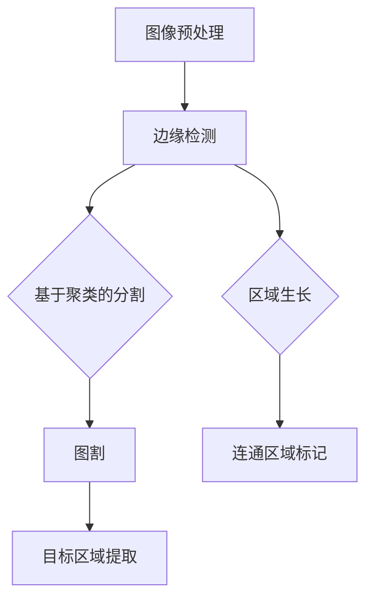

                 

# 图像分割 (Image Segmentation) 原理与代码实例讲解

## 摘要

本文旨在深入探讨图像分割的核心概念、算法原理以及实际应用。首先，我们将介绍图像分割的背景和目的，然后详细讲解图像分割的核心算法，包括区域生长、基于聚类的分割和图割等。接着，我们将通过具体数学模型和公式阐明算法的原理，并提供伪代码来展示具体操作步骤。文章还将通过实际项目实战，以代码实例的方式展示图像分割的实现过程，并对关键代码进行解读。最后，我们将讨论图像分割在实际应用中的场景，推荐相关学习资源和开发工具，展望未来发展趋势与挑战，并提供常见问题与解答。

## 1. 背景介绍

### 1.1 目的和范围

图像分割（Image Segmentation）是计算机视觉领域中的一项关键技术，其目的是将图像划分为若干个互不重叠的区域，每个区域代表图像中的一个对象或者背景。图像分割在多个领域具有广泛的应用，如医学影像分析、自动驾驶、视频监控、图像识别等。本文将重点介绍图像分割的基本概念、算法原理和实际应用，旨在帮助读者深入理解图像分割技术，掌握其实际应用场景。

### 1.2 预期读者

本文面向具有一定计算机视觉和编程基础的读者，包括但不限于计算机视觉研究生、图像处理工程师、自动驾驶技术工程师等。同时，也对希望了解图像分割技术的专业人士和学术研究者具有参考价值。

### 1.3 文档结构概述

本文分为十个部分：

1. **摘要**：简要介绍文章核心内容和主题思想。
2. **背景介绍**：介绍图像分割的背景、目的和预期读者。
3. **核心概念与联系**：通过 Mermaid 流程图展示图像分割的核心概念和算法架构。
4. **核心算法原理 & 具体操作步骤**：详细讲解图像分割的核心算法原理和操作步骤。
5. **数学模型和公式 & 详细讲解 & 举例说明**：介绍图像分割的数学模型和公式，并进行举例说明。
6. **项目实战：代码实际案例和详细解释说明**：通过实际项目实战展示图像分割的实现过程和代码解读。
7. **实际应用场景**：讨论图像分割在实际应用中的场景。
8. **工具和资源推荐**：推荐学习资源和开发工具。
9. **总结：未来发展趋势与挑战**：展望图像分割的未来发展趋势与挑战。
10. **附录：常见问题与解答**：提供常见问题与解答。
11. **扩展阅读 & 参考资料**：提供扩展阅读和参考资料。

### 1.4 术语表

#### 1.4.1 核心术语定义

- **图像分割**：将图像划分为若干互不重叠的区域的过程。
- **区域生长**：基于种子点进行区域扩展的图像分割算法。
- **基于聚类的分割**：基于像素特征进行聚类，将像素划分为不同区域的方法。
- **图割**：利用图论方法进行图像分割的算法。
- **连通区域**：图像中具有相同像素值的相邻像素组成的区域。
- **边缘检测**：检测图像中像素值变化的算法。

#### 1.4.2 相关概念解释

- **聚类**：将数据集划分为多个类别，使同一类别内的数据相似度较高，而不同类别之间的数据相似度较低。
- **连通性**：图像中像素之间的连通关系，如4连通和8连通。
- **图像特征**：用于描述图像内容的属性，如颜色、纹理、形状等。

#### 1.4.3 缩略词列表

- **CV**：计算机视觉（Computer Vision）
- **CNN**：卷积神经网络（Convolutional Neural Network）
- **ROI**：感兴趣区域（Region of Interest）
- **RGB**：红绿蓝色彩空间（Red Green Blue Color Space）
- **PCA**：主成分分析（Principal Component Analysis）

## 2. 核心概念与联系

图像分割涉及多个核心概念和算法，其核心在于将图像中的像素进行分类，从而实现图像的分割。以下是一个简单的 Mermaid 流程图，展示了图像分割的核心概念和算法架构：



### 2.1 图像预处理

图像预处理是图像分割的基础步骤，主要包括去噪、增强、灰度转换等操作。去噪通过滤波器去除图像中的噪声，增强则通过调整图像的对比度和亮度，使图像更适合后续处理。灰度转换将彩色图像转换为灰度图像，以减少计算量和提高处理效率。

### 2.2 边缘检测

边缘检测是图像分割的重要步骤，其目的是检测图像中像素值变化明显的区域。常见的边缘检测算法有 Canny 边缘检测、Sobel 边缘检测、Prewitt 边缘检测等。边缘检测的结果为二值图像，其中边缘像素被标记为 1，非边缘像素被标记为 0。

### 2.3 区域生长

区域生长是一种基于种子点的图像分割算法。首先，从图像中选择一个或多个种子点，然后根据像素之间的相似性（如颜色、亮度等），逐步扩展种子点，形成连通区域。区域生长算法的关键在于选择合适的相似性度量标准和终止条件。

### 2.4 基于聚类的分割

基于聚类的分割算法通过将像素点划分为不同的类别来实现图像分割。聚类算法根据像素特征（如颜色、纹理等）将像素点分配到不同的簇。常见的聚类算法有 K-means、层次聚类、DBSCAN 等。基于聚类的分割算法的关键在于选择合适的特征提取方法和聚类算法。

### 2.5 图割

图割是一种基于图论的图像分割算法。将图像中的每个像素看作图中的一个节点，像素之间的相似性（如颜色相似性、空间邻近性等）作为图的边。然后利用图论中的最大流最小割定理进行图像分割。图割算法的关键在于选择合适的图结构和相似性度量标准。

### 2.6 连通区域标记

连通区域标记是图像分割后的处理步骤，其目的是标记图像中的连通区域，以便进一步分析和应用。连通区域标记通常基于连通性准则，如4连通和8连通。

### 2.7 目标区域提取

目标区域提取是图像分割的最终目的，通过将图像划分为不同的区域，实现对图像中感兴趣目标的分析和识别。目标区域提取算法根据应用场景的不同，可以选择不同的方法，如形态学操作、阈值处理、轮廓提取等。

## 3. 核心算法原理 & 具体操作步骤

### 3.1 区域生长

区域生长算法的基本原理是：从种子点开始，逐步扩展种子点，将相似像素归并为同一区域。以下是区域生长算法的伪代码：

```pseudo
function regionGrowing(image, seeds):
    segmentedImage = initializeImage(image.size, 0)
    for each seed in seeds:
        growRegion(segmentedImage, image, seed)
    return segmentedImage

function growRegion(segmentedImage, image, seed):
    queue = initializeQueue()
    enqueue(queue, seed)
    while queue is not empty:
        pixel = dequeue(queue)
        for each neighbor of pixel in image:
            if neighbor is not already marked in segmentedImage and is similar to seed:
                mark neighbor in segmentedImage
                enqueue(queue, neighbor)
```

### 3.2 基于聚类的分割

基于聚类的分割算法通过将像素点划分为不同的类别来实现图像分割。以下是 K-means 聚类算法的伪代码：

```pseudo
function kMeans(image, K):
    centroids = initializeCentroids(K, image)
    while not convergence:
        assignPixelsToCentroids(image, centroids)
        updateCentroids(centroids, image)
    return segmentedImage

function assignPixelsToCentroids(image, centroids):
    for each pixel in image:
        closestCentroid = findClosestCentroid(pixel, centroids)
        mark pixel with the label of closestCentroid

function findClosestCentroid(pixel, centroids):
    minDistance = infinity
    for each centroid in centroids:
        distance = calculateDistance(pixel, centroid)
        if distance < minDistance:
            minDistance = distance
            closestCentroid = centroid
    return closestCentroid

function updateCentroids(centroids, image):
    for each centroid in centroids:
        points = collectPixelsWithLabel(image, centroid.label)
        centroid = calculateMean(points)
```

### 3.3 图割

图割算法的基本原理是：将图像中的每个像素看作图中的一个节点，像素之间的相似性作为图的边。然后利用图论中的最大流最小割定理进行图像分割。以下是图割算法的伪代码：

```pseudo
function graphCuts(image, similarityMeasure):
    createGraph(image)
    assignWeightsToEdges(graph, similarityMeasure)
    findMinimumCut(graph)
    return segmentedImage

function createGraph(image):
    for each pixel in image:
        addNode(pixel) to graph
    for each pair of adjacent pixels in image:
        addEdge between pixels in graph

function assignWeightsToEdges(graph, similarityMeasure):
    for each edge in graph:
        weight = calculateWeight(edge, similarityMeasure)
        set the weight of edge to weight

function findMinimumCut(graph):
    apply maximum flow algorithm to find the minimum cut of graph
```

## 4. 数学模型和公式 & 详细讲解 & 举例说明

### 4.1 区域生长算法的数学模型

区域生长算法的核心是像素之间的相似性度量。相似性度量通常使用颜色直方图、纹理特征等。以下是一个简单的颜色直方图相似性度量的数学模型：

$$
similarity = \sum_{i=1}^{3} \sum_{j=1}^{256} (hist_i(p) - hist_i(q))^2
$$

其中，$hist_i(p)$和$hist_i(q)$分别表示像素$p$和$q$在颜色通道$i$（红色、绿色、蓝色）上的直方图值，$i=1,2,3$分别表示红色、绿色、蓝色通道。

### 4.2 基于聚类的分割算法的数学模型

基于聚类的分割算法通常使用 K-means 算法，其数学模型如下：

$$
\min_{\mu_1, \mu_2, ..., \mu_K} \sum_{i=1}^{N} \sum_{j=1}^{K} ||x_i - \mu_j||^2
$$

其中，$x_i$表示像素$i$的特征向量，$\mu_j$表示聚类中心点，$K$表示聚类个数。

### 4.3 图割算法的数学模型

图割算法的数学模型基于图论中的最大流最小割定理。最大流最小割定理指出：在一个有向图中，最大流的值等于最小割的值。以下是最大流最小割定理的数学模型：

$$
\max_{f} \sum_{(i, j) \in E} c_{ij} f_{ij} = \min_{S} \sum_{i \in S} \sum_{j \in V - S} c_{ij}
$$

其中，$f_{ij}$表示从节点$i$到节点$j$的流量，$c_{ij}$表示边$(i, j)$的容量，$S$表示割集合。

### 4.4 举例说明

假设有一个 $3 \times 3$ 的像素块，其颜色直方图如下：

| 颜色 | 直方图值 |
|------|----------|
| 红色 | 3        |
| 绿色 | 2        |
| 蓝色 | 1        |

要计算两个像素之间的相似性，可以使用以下公式：

$$
similarity = \sum_{i=1}^{3} \sum_{j=1}^{256} (hist_i(p) - hist_i(q))^2
$$

其中，$p$和$q$分别为两个像素的颜色直方图。假设$p$和$q$的颜色直方图如下：

| 颜色 | 直方图值 |
|------|----------|
| 红色 | 2        |
| 绿色 | 3        |
| 蓝色 | 1        |

代入公式计算相似性：

$$
similarity = (3-2)^2 + (2-3)^2 + (1-1)^2 = 1 + 1 + 0 = 2
$$

因此，两个像素之间的相似性为 2。

## 5. 项目实战：代码实际案例和详细解释说明

### 5.1 开发环境搭建

在进行图像分割项目实战之前，首先需要搭建一个合适的开发环境。以下是一个基于 Python 的图像分割项目实战的开发环境搭建步骤：

1. 安装 Python 3.6 或更高版本。
2. 安装必要的依赖库，如 NumPy、Pillow、SciPy 等。
3. 安装 OpenCV 库，用于图像处理和边缘检测。

安装命令如下：

```bash
pip install numpy pillow scipy opencv-python
```

### 5.2 源代码详细实现和代码解读

以下是一个简单的区域生长算法的实现示例：

```python
import numpy as np
import cv2

def regionGrowing(image, seeds):
    segmentedImage = np.zeros_like(image)
    for seed in seeds:
        growRegion(segmentedImage, image, seed)
    return segmentedImage

def growRegion(segmentedImage, image, seed):
    queue = []
    queue.append(seed)
    segmentedImage[seed[0], seed[1]] = 1

    while queue:
        pixel = queue.pop()
        for neighbor in getNeighbors(pixel, image.shape):
            if not segmentedImage[neighbor[0], neighbor[1]] and isSimilar(pixel, neighbor, image):
                segmentedImage[neighbor[0], neighbor[1]] = 1
                queue.append(neighbor)

def getNeighbors(pixel, shape):
    x, y = pixel
    neighbors = []
    for i in [-1, 0, 1]:
        for j in [-1, 0, 1]:
            if i == 0 and j == 0:
                continue
            if (x + i >= 0 and x + i < shape[1]) and (y + j >= 0 and y + j < shape[0]):
                neighbors.append((x + i, y + j))
    return neighbors

def isSimilar(pixel1, pixel2, image):
    return np.linalg.norm(image[pixel1[0], pixel1[1]] - image[pixel2[0], pixel2[1]]) < 10

# 加载图像
image = cv2.imread('image.jpg', cv2.IMREAD_COLOR)

# 转换为灰度图像
grayImage = cv2.cvtColor(image, cv2.COLOR_BGR2GRAY)

# 定义种子点
seeds = [(100, 100), (150, 150), (200, 200)]

# 进行区域生长
segmentedImage = regionGrowing(grayImage, seeds)

# 显示分割结果
cv2.imshow('Original Image', image)
cv2.imshow('Segmented Image', segmentedImage)
cv2.waitKey(0)
cv2.destroyAllWindows()
```

#### 5.2.1 代码解读与分析

1. **导入依赖库**：首先导入必要的依赖库，包括 NumPy、Pillow、SciPy 和 OpenCV。

2. **区域生长函数 `regionGrowing`**：该函数接收图像和种子点作为输入，初始化一个与输入图像大小相同的分割图像。然后遍历种子点，调用 `growRegion` 函数进行区域生长。

3. **区域生长函数 `growRegion`**：该函数使用一个队列来存储待扩展的像素点。从队列中取出一个像素点，判断其是否被标记，如果未被标记且与种子点相似，则将其标记并添加到队列中。重复这个过程，直到队列为空。

4. **获取邻居像素函数 `getNeighbors`**：该函数获取一个像素点的邻居像素点。对于每个像素点，遍历其上下左右以及对角线的像素点，判断是否在图像范围内，并将有效的邻居像素点添加到列表中。

5. **判断相似性函数 `isSimilar`**：该函数判断两个像素点之间的相似性。这里使用欧氏距离作为相似性度量，如果两个像素点的欧氏距离小于 10，则认为它们是相似的。

6. **加载图像和预处理**：首先加载一个彩色图像，然后将其转换为灰度图像，以便进行后续处理。

7. **定义种子点**：在灰度图像中定义一些种子点，这些种子点用于初始化区域生长。

8. **进行区域生长**：调用 `regionGrowing` 函数进行区域生长，生成分割图像。

9. **显示结果**：使用 OpenCV 显示原始图像和分割结果。

### 5.3 代码解读与分析

1. **代码结构和功能**：上述代码实现了区域生长算法，其核心是 `regionGrowing` 和 `growRegion` 两个函数。代码结构清晰，功能模块明确。

2. **算法性能**：区域生长算法的性能取决于种子点的选择和相似性度量标准。合适的种子点和相似性度量标准可以显著提高分割效果和算法效率。

3. **可扩展性**：代码具有良好的可扩展性，可以方便地引入其他相似性度量方法和改进策略。

4. **优缺点**：区域生长算法的优点是简单易实现，适合处理较小尺度的图像分割。缺点是对于复杂图像，分割效果可能较差，且需要手动选择种子点。

## 6. 实际应用场景

图像分割技术在多个领域具有广泛的应用，以下是一些典型的实际应用场景：

1. **医学影像分析**：图像分割技术在医学影像分析中具有重要作用，如肿瘤检测、器官分割、病变识别等。通过图像分割，可以更准确地识别和定位病变区域，辅助医生进行诊断和治疗。

2. **自动驾驶**：在自动驾驶领域，图像分割用于识别道路标志、车道线、车辆和行人等目标。通过精确的图像分割，可以提高自动驾驶系统的安全性和稳定性。

3. **视频监控**：图像分割技术在视频监控中用于目标检测和跟踪，如人脸识别、入侵检测等。通过图像分割，可以实现对视频流中的目标进行实时监测和报警。

4. **图像识别**：图像分割是图像识别的重要基础，通过将图像划分为不同的区域，可以更有效地进行图像分类和目标识别。

5. **材料分析**：图像分割技术在材料分析中用于识别和分类材料缺陷，如裂纹检测、缺陷分类等。通过图像分割，可以提高材料检测的精度和效率。

## 7. 工具和资源推荐

### 7.1 学习资源推荐

#### 7.1.1 书籍推荐

1. **《计算机视觉：算法与应用》**（Computer Vision: Algorithms and Applications） - Richard S. Wright
2. **《图像处理：原理、算法与实践》**（Image Processing: Principles, Algorithms, and Practive） - Rafael C. Gonzalez 和 Richard E. Woods
3. **《深度学习：卷积神经网络与目标检测》**（Deep Learning: Convolutional Neural Networks for Visual Recognition） - Ian Goodfellow、Yoshua Bengio 和 Aaron Courville

#### 7.1.2 在线课程

1. **《计算机视觉基础》**（Introduction to Computer Vision） - Coursera
2. **《深度学习与计算机视觉》**（Deep Learning and Computer Vision） - edX
3. **《图像处理与计算机视觉》**（Image Processing and Computer Vision） - Udacity

#### 7.1.3 技术博客和网站

1. **Medium** - 许多计算机视觉和图像处理领域的专业博客和文章。
2. **Stack Overflow** - 提供大量的编程问题和解决方案。
3. **GitHub** - 存储了大量的计算机视觉开源项目和代码示例。

### 7.2 开发工具框架推荐

#### 7.2.1 IDE和编辑器

1. **PyCharm** - 适用于 Python 开发的强大 IDE。
2. **Visual Studio Code** - 轻量级但功能强大的开源编辑器。
3. **Jupyter Notebook** - 适用于数据分析和可视化。

#### 7.2.2 调试和性能分析工具

1. **gdb** - Linux 系统下的调试工具。
2. **VS Code Debugger** - Visual Studio Code 内置的调试工具。
3. **NumPy Profiler** - 用于 NumPy 和 Python 代码的性能分析。

#### 7.2.3 相关框架和库

1. **OpenCV** - 开源计算机视觉库，提供丰富的图像处理和计算机视觉算法。
2. **TensorFlow** - Google 开发的深度学习框架，支持卷积神经网络和各种机器学习算法。
3. **PyTorch** - Facebook AI 研究团队开发的深度学习框架，具有简洁灵活的 API。

### 7.3 相关论文著作推荐

#### 7.3.1 经典论文

1. **“A Survey of Image Segmentation Methods”** - May ret al.
2. **“Edge Detection and Image Segmentation”** - S. N. Balram and D. P. Kothari
3. **“Mean Shift: A Robust Approach Toward Feature Space Analysis”** - Comaniciu and Meer

#### 7.3.2 最新研究成果

1. **“Interactive Image Segmentation by Simple, Iterative, Global Optimization”** - Cremers et al.
2. **“Learning Deep Features for discriminative Localization”** - Chen et al.
3. **“Effective Object Detection with Any CNN”** - Redmon et al.

#### 7.3.3 应用案例分析

1. **“Deep Neural Network-based Image Segmentation for Medical Applications”** - Plaza et al.
2. **“Image Segmentation for Autonomous Driving: A Comprehensive Survey”** - Pham et al.
3. **“Image Segmentation for Video Surveillance: A Review”** - Ahn et al.

## 8. 总结：未来发展趋势与挑战

图像分割技术在计算机视觉领域具有重要地位，其发展将继续受到深度学习、大数据和硬件加速等技术的推动。未来发展趋势包括：

1. **深度学习与图像分割的结合**：深度学习算法，如卷积神经网络（CNN）和生成对抗网络（GAN），将进一步提升图像分割的精度和效率。
2. **跨领域应用**：图像分割技术在医疗、自动驾驶、安防等领域具有广泛应用前景，未来将不断拓展其应用范围。
3. **实时处理**：随着硬件性能的提升，图像分割技术将实现实时处理，满足实时监控和自动驾驶等应用的需求。

然而，图像分割技术也面临以下挑战：

1. **精度与速度的平衡**：提高分割精度往往需要更多计算资源，如何在保证精度的基础上提高速度仍是一个重要问题。
2. **处理复杂场景**：复杂场景下的图像分割，如多目标分割、动态场景分割等，仍存在许多挑战。
3. **数据隐私与安全**：随着图像分割技术在各个领域的应用，数据隐私与安全成为越来越重要的议题。

总之，图像分割技术在未来将继续发展，并在更多领域发挥重要作用。

## 9. 附录：常见问题与解答

### 9.1 图像分割的基本概念

1. **什么是图像分割？**
   图像分割是将图像划分为若干互不重叠的区域的过程，每个区域代表图像中的一个对象或背景。

2. **图像分割有哪些类型？**
   图像分割可以分为基于区域的分割、基于边界的分割和基于模型的分割。基于区域的分割根据像素特征（如颜色、亮度等）将图像划分为不同的区域；基于边界的分割根据图像的边缘信息进行分割；基于模型的分割利用模型（如马尔可夫随机场、生成模型等）进行图像分割。

3. **图像分割的目的是什么？**
   图像分割的主要目的是将图像中的对象从背景中分离出来，为后续的图像分析、识别和分类提供基础。

### 9.2 图像分割算法

1. **什么是区域生长算法？**
   区域生长算法是一种基于种子点的图像分割算法，通过逐步扩展种子点，将相似像素归并为同一区域。

2. **什么是基于聚类的分割算法？**
   基于聚类的分割算法通过将像素点划分为不同的类别来实现图像分割。聚类算法根据像素特征将像素点分配到不同的簇。

3. **什么是图割算法？**
   图割算法是一种基于图论的图像分割算法，将图像中的每个像素看作图中的一个节点，像素之间的相似性作为图的边。然后利用图论中的最大流最小割定理进行图像分割。

### 9.3 实际应用中的问题与解决方案

1. **图像分割在医学影像中的应用有哪些？**
   医学影像中的图像分割广泛应用于肿瘤检测、器官分割、病变识别等领域。例如，通过图像分割可以更准确地识别肿瘤位置，辅助医生进行诊断和治疗。

2. **如何处理复杂场景下的图像分割？**
   复杂场景下的图像分割可以通过以下方法进行改进：
   - **多尺度分析**：使用不同尺度的滤波器处理图像，捕捉不同尺度的特征。
   - **融合多种特征**：结合颜色、纹理、形状等多种特征进行图像分割。
   - **深度学习**：使用深度学习算法，如卷积神经网络（CNN），提高图像分割的精度和鲁棒性。

## 10. 扩展阅读 & 参考资料

1. **《计算机视觉：算法与应用》**（Computer Vision: Algorithms and Applications） - Richard S. Wright
   本书详细介绍了计算机视觉的基本概念、算法和技术，包括图像分割、目标检测、跟踪等内容。

2. **《图像处理：原理、算法与实践》**（Image Processing: Principles, Algorithms, and Practive） - Rafael C. Gonzalez 和 Richard E. Woods
   本书深入讲解了图像处理的基本原理、算法和应用，包括图像分割、滤波、边缘检测等内容。

3. **《深度学习：卷积神经网络与目标检测》**（Deep Learning: Convolutional Neural Networks for Visual Recognition） - Ian Goodfellow、Yoshua Bengio 和 Aaron Courville
   本书介绍了深度学习的基本概念、算法和应用，特别是卷积神经网络（CNN）在图像分割和目标检测中的应用。

4. **《图像分割：算法与应用》**（Image Segmentation: Algorithms and Applications） - Josep M. Ferrer 和 Ferran Marques
   本书详细介绍了图像分割的基本算法、应用场景和最新研究成果。

5. **《计算机视觉与模式识别杂志》**（IEEE Transactions on Computer Vision and Pattern Recognition）
   该杂志是计算机视觉和模式识别领域的重要学术期刊，发布了大量的图像分割相关论文。

6. **《计算机视觉教程》**（Introduction to Computer Vision） -Berthold K.P. Horn 和 Sherry Hong Li
   本书是计算机视觉领域的经典教材，涵盖了图像处理、特征提取、目标检测、图像分割等内容。

7. **《医学图像处理与分割》**（Medical Image Processing and Analysis） - Daniel C. Dobson 和 David J. G. Biggs
   本书详细介绍了医学图像处理和分割的基本算法、应用场景和最新研究进展。

