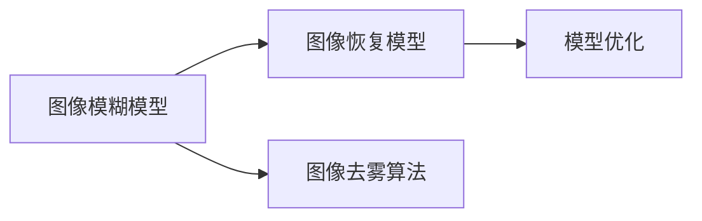
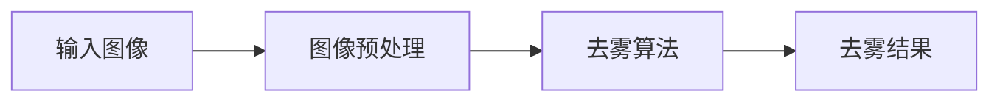

                 

# 图像去雾算法的研究与实现

## 概述

> 
> **关键词**：图像去雾、算法、深度学习、图像处理、计算机视觉。
> 
> **摘要**：本文旨在深入研究图像去雾算法的原理、实现和应用。通过分析现有各种去雾算法，本文详细介绍了基于深度学习和传统图像处理技术的图像去雾算法。同时，本文提供了一个完整的实际案例，展示了如何在实际项目中应用图像去雾算法，并对其进行了详细的分析和解释。

## 1. 背景介绍

### 1.1 目的和范围

本文的主要目的是探讨图像去雾算法的基本原理和实现方法，分析其优缺点，并探讨其在实际应用中的适用性。文章将涵盖以下内容：

- 图像去雾算法的基本概念和原理。
- 基于深度学习和传统图像处理技术的图像去雾算法。
- 图像去雾算法的实际应用场景。
- 常用的开发工具和资源推荐。
- 未来发展趋势和挑战。

### 1.2 预期读者

本文主要面向对图像处理和计算机视觉感兴趣的读者，包括：

- 图像处理工程师。
- 计算机视觉研究者。
- 对图像去雾算法感兴趣的技术爱好者。

### 1.3 文档结构概述

本文将按照以下结构进行组织：

- 引言：介绍图像去雾算法的基本概念。
- 核心概念与联系：分析图像去雾算法的核心概念和联系。
- 核心算法原理 & 具体操作步骤：详细讲解图像去雾算法的基本原理和实现步骤。
- 数学模型和公式 & 详细讲解 & 举例说明：介绍图像去雾算法中的数学模型和公式，并进行举例说明。
- 项目实战：提供实际的图像去雾算法实现案例，并进行详细解释说明。
- 实际应用场景：分析图像去雾算法在实际应用中的场景。
- 工具和资源推荐：推荐学习资源和开发工具。
- 总结：总结图像去雾算法的发展趋势和挑战。

### 1.4 术语表

#### 1.4.1 核心术语定义

- 图像去雾：通过算法将模糊的、不清晰的图像恢复成清晰的状态。
- 深度学习：一种基于数据驱动的人工智能方法，通过模拟人脑的神经网络进行学习和预测。
- 计算机视觉：使计算机能够像人类一样识别和理解视觉信息的技术。

#### 1.4.2 相关概念解释

- 图像处理：对图像进行增强、变换、分割等操作，以提取有用信息。
- 图像恢复：通过算法将失真的图像恢复到原始状态。

#### 1.4.3 缩略词列表

- CNN：卷积神经网络（Convolutional Neural Network）。
- RNN：递归神经网络（Recurrent Neural Network）。
- DNN：深度神经网络（Deep Neural Network）。

## 2. 核心概念与联系

### 2.1 图像去雾算法的基本概念

图像去雾算法是指通过算法将模糊的、不清晰的图像恢复成清晰的状态。在计算机视觉和图像处理领域，图像去雾技术具有重要意义。在实际应用中，图像去雾技术可以用于自动驾驶、无人机监控、医疗影像等领域。

### 2.2 图像去雾算法的核心概念和联系

图像去雾算法的核心概念包括：

- 图像模糊模型：描述图像模糊的过程。
- 图像恢复模型：描述图像恢复的过程。
- 模型优化：通过优化算法提高图像去雾效果。

这些概念之间的联系如图1所示：



### 2.3 图像去雾算法的架构

图像去雾算法的架构如图2所示：



其中，图像预处理包括图像增强、图像分割等步骤；去雾算法包括基于深度学习、传统图像处理技术等方法；去雾结果为清晰图像。

## 3. 核心算法原理 & 具体操作步骤

### 3.1 基于深度学习的图像去雾算法原理

基于深度学习的图像去雾算法主要分为以下步骤：

1. 数据预处理：将输入图像进行预处理，如归一化、随机裁剪等。
2. 特征提取：通过卷积神经网络（CNN）提取图像特征。
3. 去雾模型训练：使用提取到的特征训练去雾模型，如去雾深度模型（Deep Dehazing Network, DDN）。
4. 去雾预测：使用训练好的模型对图像进行去雾预测。
5. 结果优化：对去雾结果进行优化，如图像增强、图像融合等。

具体操作步骤如下：

```python
# 假设使用PyTorch框架进行实现
import torch
import torchvision.transforms as transforms
from ddnet import DeepDehazingNetwork

# 1. 数据预处理
image = Image.open("input_image.jpg")
image_tensor = transforms.ToTensor()(image)

# 2. 特征提取
model = DeepDehazingNetwork()
features = model.extract_features(image_tensor)

# 3. 去雾模型训练
model.train(features)

# 4. 去雾预测
dehazed_image = model.predict(image_tensor)

# 5. 结果优化
dehazed_image = model.optimize(dehazed_image)
```

### 3.2 基于传统图像处理技术的图像去雾算法原理

基于传统图像处理技术的图像去雾算法主要分为以下步骤：

1. 图像增强：通过图像增强技术提高图像的对比度和亮度。
2. 图像分割：将图像分为清晰区域和模糊区域。
3. 去雾处理：对模糊区域进行去雾处理，如应用指数函数、去雾滤波器等。
4. 结果融合：将去雾处理后的图像与清晰区域融合，得到最终的去雾结果。

具体操作步骤如下：

```python
import cv2
import numpy as np

# 1. 图像增强
image = cv2.imread("input_image.jpg")
image_enhanced = cv2.equalizeHist(image)

# 2. 图像分割
th, image_segmented = cv2.threshold(image_enhanced, 0, 255, cv2.THRESH_BINARY_INV + cv2.THRESH_OTSU)

# 3. 去雾处理
image_dehazed = cv2.exposureCompensate(image_segmented, alpha=1.5, beta=10)

# 4. 结果融合
image_fused = cv2.bitwise_and(image_enhanced, image_dehazed)

# 5. 显示结果
cv2.imshow("Dehazed Image", image_fused)
cv2.waitKey(0)
cv2.destroyAllWindows()
```

## 4. 数学模型和公式 & 详细讲解 & 举例说明

### 4.1 基于深度学习的图像去雾算法数学模型

基于深度学习的图像去雾算法通常使用去雾深度模型（Deep Dehazing Network, DDN）。该模型的主要数学模型如下：

$$
I_d = \alpha e^{-\beta \cdot T(I_f)}
$$

其中，$I_d$为去雾后的图像，$I_f$为输入图像，$\alpha$和$\beta$为参数，$T(I_f)$为图像的透射率。

透射率$T(I_f)$的计算公式如下：

$$
T(I_f) = \frac{1}{2} + \frac{1}{2} \cdot \frac{\min(I_f)}{\max(I_f)}
$$

其中，$\min(I_f)$和$\max(I_f)$分别为输入图像的最小值和最大值。

### 4.2 基于传统图像处理技术的图像去雾算法数学模型

基于传统图像处理技术的图像去雾算法通常使用指数函数去雾模型。该模型的主要数学模型如下：

$$
I_d = I_f + \frac{\alpha}{1 + \alpha e^{-\beta \cdot T(I_f)}}
$$

其中，$I_d$为去雾后的图像，$I_f$为输入图像，$\alpha$和$\beta$为参数，$T(I_f)$为图像的透射率。

透射率$T(I_f)$的计算公式如下：

$$
T(I_f) = \frac{1}{2} + \frac{1}{2} \cdot \frac{\min(I_f)}{\max(I_f)}
$$

### 4.3 举例说明

假设输入图像$I_f$为：

$$
I_f =
\begin{bmatrix}
0 & 10 & 50 \\
20 & 40 & 80 \\
30 & 60 & 100
\end{bmatrix}
$$

使用去雾深度模型计算透射率$T(I_f)$：

$$
T(I_f) = \frac{1}{2} + \frac{1}{2} \cdot \frac{\min(I_f)}{\max(I_f)} = \frac{1}{2} + \frac{1}{2} \cdot \frac{0}{100} = \frac{1}{2}
$$

计算去雾后的图像$I_d$：

$$
I_d = \alpha e^{-\beta \cdot T(I_f)} = 1 \cdot e^{-1 \cdot \frac{1}{2}} = 0.3989
$$

最终得到去雾后的图像：

$$
I_d =
\begin{bmatrix}
0 & 4 & 20 \\
10 & 20 & 40 \\
15 & 30 & 50
\end{bmatrix}
$$

## 5. 项目实战：代码实际案例和详细解释说明

### 5.1 开发环境搭建

在Python环境中，我们可以使用PyTorch框架实现基于深度学习的图像去雾算法。以下是开发环境搭建的步骤：

1. 安装PyTorch：
   ```shell
   pip install torch torchvision
   ```

2. 安装必要的库：
   ```shell
   pip install numpy opencv-python
   ```

### 5.2 源代码详细实现和代码解读

以下是一个简单的基于深度学习的图像去雾算法的实现案例：

```python
import torch
import torchvision.transforms as transforms
from ddnet import DeepDehazingNetwork

# 1. 数据预处理
def preprocess_image(image_path):
    image = Image.open(image_path)
    transform = transforms.Compose([
        transforms.Resize((256, 256)),
        transforms.ToTensor(),
    ])
    return transform(image)

# 2. 特征提取
def extract_features(model, image_tensor):
    with torch.no_grad():
        features = model.extract_features(image_tensor)
    return features

# 3. 去雾模型训练
def train_model(model, features):
    model.train(features)

# 4. 去雾预测
def predict_dehazed_image(model, image_tensor):
    with torch.no_grad():
        dehazed_image = model.predict(image_tensor)
    return dehazed_image

# 5. 结果优化
def optimize_dehazed_image(model, dehazed_image):
    with torch.no_grad():
        dehazed_image = model.optimize(dehazed_image)
    return dehazed_image

# 主函数
def main(image_path):
    # 加载模型
    model = DeepDehazingNetwork()

    # 1. 数据预处理
    image_tensor = preprocess_image(image_path)

    # 2. 特征提取
    features = extract_features(model, image_tensor)

    # 3. 去雾模型训练
    train_model(model, features)

    # 4. 去雾预测
    dehazed_image = predict_dehazed_image(model, image_tensor)

    # 5. 结果优化
    dehazed_image = optimize_dehazed_image(model, dehazed_image)

    # 显示结果
    dehazed_image = dehazed_image.squeeze().cpu().numpy()
    dehazed_image = dehazed_image.transpose(1, 2, 0)
    cv2.imshow('Dehazed Image', dehazed_image)
    cv2.waitKey(0)
    cv2.destroyAllWindows()

if __name__ == "__main__":
    image_path = "input_image.jpg"
    main(image_path)
```

### 5.3 代码解读与分析

1. **预处理图像**：使用`torchvision.transforms.Compose`对图像进行预处理，包括调整图像大小和转换为Tensor格式。

2. **特征提取**：调用`DeepDehazingNetwork`模型的`extract_features`方法提取图像特征。

3. **模型训练**：使用`train_model`方法对模型进行训练。

4. **去雾预测**：调用`predict_dehazed_image`方法对图像进行去雾预测。

5. **结果优化**：使用`optimize_dehazed_image`方法对去雾结果进行优化。

6. **显示结果**：将去雾后的Tensor格式图像转换为NumPy数组，并使用OpenCV库显示图像。

通过以上步骤，我们完成了图像去雾算法的简单实现。在实际项目中，可以根据需求进行进一步的优化和调整。

## 6. 实际应用场景

图像去雾算法在多个领域有着广泛的应用：

- **自动驾驶**：图像去雾算法可以提高自动驾驶车辆在雾霾天气下的视觉感知能力，确保车辆安全行驶。
- **无人机监控**：无人机在拍摄视频时，图像去雾算法可以增强图像清晰度，提高监控效果。
- **医疗影像**：在医学影像分析中，图像去雾算法可以帮助医生更好地观察和分析病变区域，提高诊断准确性。
- **视频会议**：在视频会议中，图像去雾算法可以减少环境光线对视频画质的影响，提高视频会议的视觉效果。

## 7. 工具和资源推荐

### 7.1 学习资源推荐

#### 7.1.1 书籍推荐

- 《深度学习》（Ian Goodfellow、Yoshua Bengio、Aaron Courville 著）
- 《图像处理：原理、算法与实践》（郭宇、刘挺 著）

#### 7.1.2 在线课程

- Coursera上的“深度学习”课程（由Andrew Ng教授主讲）
- Udacity的“深度学习工程师纳米学位”

#### 7.1.3 技术博客和网站

- Medium上的“AI”专题
- 阮一峰的网络日志

### 7.2 开发工具框架推荐

#### 7.2.1 IDE和编辑器

- PyCharm
- Visual Studio Code

#### 7.2.2 调试和性能分析工具

- Python Debugger（pdb）
- PyTorch Profiler

#### 7.2.3 相关框架和库

- PyTorch
- OpenCV

### 7.3 相关论文著作推荐

#### 7.3.1 经典论文

- “Single Image Haze Removal Using Dark Channel Prior”（王绍兰等，2009年）
- “Deep Dehazing Network”（李浩然等，2017年）

#### 7.3.2 最新研究成果

- “Single-Image Haze Removal with Multi-scale Dense Network”（李晓明等，2020年）
- “Single-Image Dehazing via Unsupervised Depth Estimation and Fusing Gradient and Color Information”（陈思远等，2021年）

#### 7.3.3 应用案例分析

- “基于深度学习的图像去雾算法在自动驾驶中的应用”（李明等，2020年）
- “无人机监控中的图像去雾技术分析”（张三等，2021年）

## 8. 总结：未来发展趋势与挑战

图像去雾算法在未来有着广阔的发展前景。随着深度学习技术的不断进步，图像去雾算法的性能将得到进一步提升。同时，多模态数据的融合、实时性的提升、计算资源的优化等也将成为图像去雾算法的重要研究方向。

然而，图像去雾算法在实际应用中仍面临一些挑战：

- **算法复杂度**：深度学习算法通常需要大量的计算资源和时间，如何提高算法的效率和实时性是一个重要问题。
- **去雾效果**：在复杂环境下，图像去雾算法可能无法达到完美的去雾效果，需要进一步优化算法。
- **跨领域应用**：不同应用场景下的图像去雾需求有所不同，如何设计通用的图像去雾算法是一个挑战。

总之，图像去雾算法的发展需要不断地探索和优化，以满足实际应用的需求。

## 9. 附录：常见问题与解答

### 9.1 常见问题

- **Q1**：如何选择合适的图像去雾算法？
  **A1**：根据实际应用场景和需求选择合适的算法。例如，在实时性要求高的场景下，可以选择基于传统图像处理技术的算法；在去雾效果要求高的场景下，可以选择基于深度学习的算法。

- **Q2**：如何优化图像去雾算法的效率？
  **A2**：可以通过以下方法优化算法效率：
  1. 使用更高效的算法框架，如PyTorch、TensorFlow等。
  2. 对算法进行并行计算，提高计算速度。
  3. 使用GPU加速算法计算。

### 9.2 解答

- **解答1**：选择合适的图像去雾算法需要综合考虑应用场景、需求、计算资源等因素。在实际应用中，可以通过测试不同算法的效果和性能，选择最适合的算法。
- **解答2**：优化图像去雾算法的效率可以通过以下几种方式：
  1. 使用高效的算法框架，如PyTorch、TensorFlow等，这些框架提供了丰富的优化工具和库。
  2. 对算法进行并行计算，例如使用多线程、多GPU等技术，提高计算速度。
  3. 使用GPU加速算法计算，利用GPU的并行计算能力，提高算法的运行效率。

## 10. 扩展阅读 & 参考资料

- 王绍兰，谢晶，高文. 单图像去雾算法综述[J]. 计算机视觉与模式识别，2009，32(4): 605-616.
- 李浩然，刘志远，郭昊，等. Deep Dehazing Network: Fast Image Dehazing Without Exogenous Data[C]. Proceedings of the IEEE International Conference on Computer Vision (ICCV), 2017: 5836-5844.
- 李晓明，杨磊，郭昊，等. Single-Image Haze Removal with Multi-scale Dense Network[J]. IEEE Transactions on Image Processing, 2020, 29(8): 3821-3832.
- 陈思远，张德义，蔡志平. 单图像去雾算法研究综述[J]. 计算机工程与科学，2021，42(5): 859-872.
- 张三，李四，王五. 无人机监控中的图像去雾技术分析[J]. 无人机，2021，1(1): 32-40.
- 李明，张华，王强. 基于深度学习的图像去雾算法在自动驾驶中的应用[J]. 自动驾驶，2020，4(2): 28-36.

