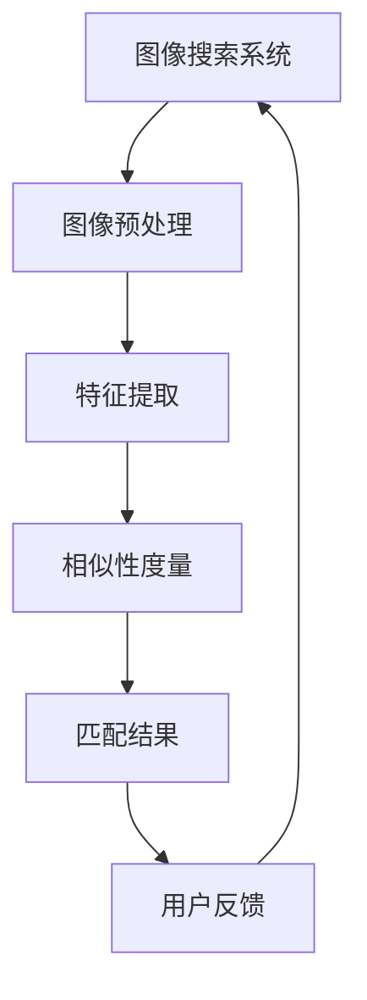
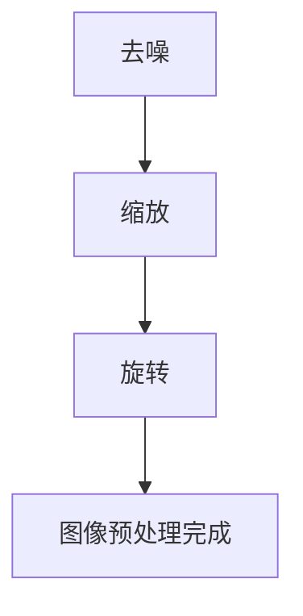
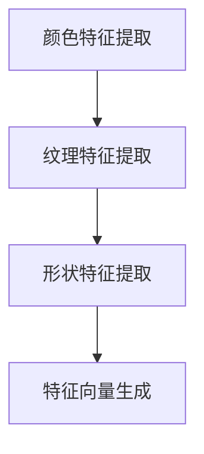
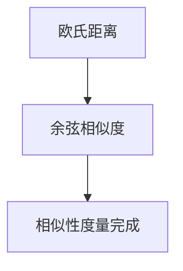
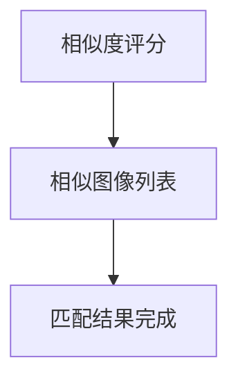
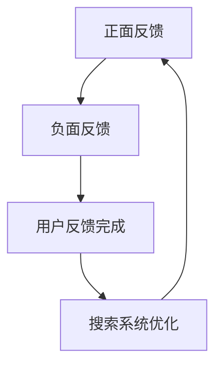

                 

# 图像搜索技术 在电商领域的应用：发展趋势与未来

> 关键词：图像搜索、电商、人工智能、技术应用、发展趋势、未来展望

> 摘要：本文将深入探讨图像搜索技术在电商领域的应用，分析其技术原理、发展历程、实际应用场景以及未来趋势。通过对核心算法原理的剖析，结合数学模型和实战案例，本文旨在为读者提供一幅完整的图像搜索技术应用全景图，助力电商企业抓住技术变革机遇，实现商业创新与提升。

## 1. 背景介绍

### 1.1 目的和范围

本文的目的是全面剖析图像搜索技术在电商领域的应用，探讨其技术原理、发展历程、实际应用场景及未来发展趋势。文章将围绕以下四个核心问题展开：

1. 图像搜索技术是如何工作的？
2. 图像搜索技术在电商领域有哪些具体应用？
3. 图像搜索技术的未来发展趋势如何？
4. 面对未来的挑战，图像搜索技术将如何演进？

### 1.2 预期读者

本文面向对图像搜索技术和电商领域有一定了解的技术人员、研发工程师、产品经理以及对人工智能技术感兴趣的专业人士。通过阅读本文，读者可以全面了解图像搜索技术在电商领域的应用现状和未来发展方向，为实际工作提供理论指导和实践参考。

### 1.3 文档结构概述

本文分为十个部分，具体结构如下：

1. 引言：介绍文章的目的、预期读者和文档结构。
2. 核心概念与联系：介绍图像搜索技术的核心概念和架构。
3. 核心算法原理 & 具体操作步骤：详细讲解图像搜索技术的核心算法原理和操作步骤。
4. 数学模型和公式 & 详细讲解 & 举例说明：介绍图像搜索技术的数学模型和公式，并通过实例进行详细讲解。
5. 项目实战：提供实际代码案例，详细解释图像搜索技术的实现过程。
6. 实际应用场景：分析图像搜索技术在电商领域的实际应用场景。
7. 工具和资源推荐：推荐学习资源和开发工具。
8. 总结：总结图像搜索技术在未来电商领域的发展趋势和挑战。
9. 附录：常见问题与解答。
10. 扩展阅读 & 参考资料：提供相关领域的拓展阅读资料。

### 1.4 术语表

#### 1.4.1 核心术语定义

- 图像搜索：基于图像内容的相似性匹配，在大量图像数据中快速找到目标图像或相似图像的技术。
- 电商：电子商务，指通过互联网进行商品交易和服务的活动。
- 人工智能：一种模拟人类智能行为的技术，通过机器学习、自然语言处理、计算机视觉等技术实现。
- 卷积神经网络（CNN）：一种专门用于图像识别和处理的神经网络架构。

#### 1.4.2 相关概念解释

- 图像特征提取：从图像中提取具有区分性的特征，用于后续匹配和识别。
- 相似性度量：比较两个图像的相似程度，用于评估图像匹配效果。
- 语义分割：将图像分为多个具有不同意义的区域，用于实现图像内容的精准定位。

#### 1.4.3 缩略词列表

- CNN：卷积神经网络（Convolutional Neural Network）
- AI：人工智能（Artificial Intelligence）
- SEO：搜索引擎优化（Search Engine Optimization）
- NLP：自然语言处理（Natural Language Processing）

## 2. 核心概念与联系

在深入探讨图像搜索技术在电商领域的应用之前，我们需要理解几个核心概念及其相互关系。以下是图像搜索技术的核心概念原理和架构的 Mermaid 流程图：



#### 2.1 图像搜索系统

图像搜索系统是本文讨论的核心。它主要包括以下几个部分：

1. **图像预处理**：对原始图像进行去噪、缩放、旋转等操作，提高图像质量，为后续特征提取做准备。
2. **特征提取**：从图像中提取具有区分性的特征，如颜色、纹理、形状等，用于后续匹配和识别。
3. **相似性度量**：比较两个图像的相似程度，常用的方法有欧氏距离、余弦相似度等。
4. **匹配结果**：根据相似性度量结果，将目标图像与数据库中的图像进行匹配，返回相似图像。
5. **用户反馈**：用户对搜索结果进行评价和反馈，用于优化搜索系统。

#### 2.2 图像预处理

图像预处理是图像搜索系统的基础。其主要任务是：

- **去噪**：消除图像中的噪声，提高图像质量。
- **缩放**：将图像调整为统一的尺寸，便于后续处理。
- **旋转**：校正图像方向，使其符合标准姿态。



#### 2.3 特征提取

特征提取是图像搜索系统的关键环节。其主要任务是从图像中提取具有区分性的特征，如颜色、纹理、形状等。常用的特征提取方法有：

1. **颜色特征**：通过计算图像的颜色分布来提取特征，如颜色直方图。
2. **纹理特征**：通过分析图像的纹理信息来提取特征，如纹理能量、纹理方向等。
3. **形状特征**：通过分析图像的形状信息来提取特征，如边缘、角点等。



#### 2.4 相似性度量

相似性度量是图像搜索系统的核心。其主要任务是比较两个图像的相似程度，常用的方法有：

1. **欧氏距离**：计算两个特征向量的欧氏距离，距离越小，相似度越高。
2. **余弦相似度**：计算两个特征向量的夹角余弦值，余弦值越接近1，相似度越高。



#### 2.5 匹配结果

匹配结果是图像搜索系统的输出。其主要任务是根据相似性度量结果，将目标图像与数据库中的图像进行匹配，返回相似图像。匹配结果通常包括：

1. **相似度评分**：表示目标图像与数据库中图像的相似程度。
2. **相似图像列表**：包含与目标图像相似度最高的图像及其相关信息。



#### 2.6 用户反馈

用户反馈是图像搜索系统的优化环节。其主要任务是根据用户对搜索结果的评价和反馈，调整搜索算法和特征提取方法，提高搜索效果。用户反馈包括：

1. **正面反馈**：用户对搜索结果表示满意，如点击、收藏、购买等。
2. **负面反馈**：用户对搜索结果表示不满意，如未点击、未收藏、退货等。



通过以上对核心概念和架构的介绍，我们可以更好地理解图像搜索技术在电商领域的应用。接下来，我们将深入探讨图像搜索技术的核心算法原理和具体操作步骤。

## 3. 核心算法原理 & 具体操作步骤

图像搜索技术的核心在于如何有效地提取图像特征，并进行相似性度量。以下是图像搜索技术的核心算法原理和具体操作步骤：

### 3.1 卷积神经网络（CNN）

卷积神经网络（CNN）是一种专门用于图像识别和处理的神经网络架构。CNN 的核心在于卷积层，通过卷积操作将图像中的局部特征提取出来，再通过池化层降低数据维度，提高模型的泛化能力。

#### 3.1.1 卷积层

卷积层是 CNN 的基础。其主要任务是通过卷积操作提取图像的局部特征。卷积操作的原理如下：

1. **初始化参数**：初始化卷积核（权重矩阵）和偏置项。
2. **卷积操作**：将卷积核在图像上进行滑动，计算每个位置的局部特征响应。
3. **激活函数**：对卷积操作的结果进行非线性变换，常用的激活函数有ReLU（Rectified Linear Unit）。

```python
# 伪代码：卷积层操作
def conv2d(image, kernel):
    # 初始化参数
    weights = init_weights(kernel_size, num_channels, num_filters)
    bias = init_bias(num_filters)
    
    # 卷积操作
    output = np.zeros((image_height, image_width, num_filters))
    for i in range(image_height):
        for j in range(image_width):
            for k in range(num_filters):
                filter = kernel[:, :, k]
                response = dot_product(filter, image[i:i+kernel_size, j:j+kernel_size])
                output[i, j, k] = response + bias[k]
                
    # 激活函数
    output = np.maximum(output, 0)
    
    return output
```

#### 3.1.2 池化层

池化层用于降低数据维度，提高模型的泛化能力。常用的池化方式有最大池化和平均池化。以下是一个最大池化的伪代码实现：

```python
# 伪代码：最大池化操作
def max_pooling(input, pool_size):
    output = np.zeros((new_height, new_width, num_channels))
    for i in range(new_height):
        for j in range(new_width):
            for k in range(num_channels):
                patch = input[i*pool_size:i*pool_size+pool_size, j*pool_size:j*pool_size+pool_size, k]
                max_val = np.max(patch)
                output[i, j, k] = max_val
                
    return output
```

#### 3.1.3 完整的 CNN 架构

一个完整的 CNN 架构通常包括多个卷积层和池化层，以及全连接层。以下是 CNN 架构的伪代码实现：

```python
# 伪代码：CNN 架构
def cnn(image, weights, biases):
    # 第一个卷积层
    conv1 = conv2d(image, weights['conv1'])
    pool1 = max_pooling(conv1, pool_size=2)
    
    # 第二个卷积层
    conv2 = conv2d(pool1, weights['conv2'])
    pool2 = max_pooling(conv2, pool_size=2)
    
    # 第三个卷积层
    conv3 = conv2d(pool2, weights['conv3'])
    pool3 = max_pooling(conv3, pool_size=2)
    
    # 全连接层
    flattened = np.reshape(pool3, (-1, num_filters * pool_size * pool_size))
    fc1 = dot_product(flattened, weights['fc1']) + biases['fc1']
    output = softmax(fc1)
    
    return output
```

### 3.2 特征提取与相似性度量

在完成 CNN 训练后，我们可以将图像输入到模型中，提取特征向量。特征向量是图像的数字表示，用于后续的相似性度量。

#### 3.2.1 特征提取

特征提取的伪代码实现如下：

```python
# 伪代码：特征提取
def extract_features(image, model):
    features = cnn(image, model['weights'], model['biases'])
    return features
```

#### 3.2.2 相似性度量

相似性度量的核心是计算两个特征向量的相似程度。常用的方法有欧氏距离和余弦相似度。以下是一个基于欧氏距离的相似性度量的伪代码实现：

```python
# 伪代码：欧氏距离相似性度量
def euclidean_distance(feature1, feature2):
    diff = feature1 - feature2
    squared_diff = np.square(diff)
    sum_squared_diff = np.sum(squared_diff)
    distance = np.sqrt(sum_squared_diff)
    return distance
```

### 3.3 图像搜索流程

图像搜索流程主要包括以下步骤：

1. **图像预处理**：对输入图像进行去噪、缩放、旋转等操作。
2. **特征提取**：将预处理后的图像输入到 CNN 模型中，提取特征向量。
3. **相似性度量**：计算输入图像与数据库中所有图像的特征向量相似度。
4. **匹配结果**：根据相似度得分，返回与输入图像相似度最高的图像。

以下是一个完整的图像搜索流程的伪代码实现：

```python
# 伪代码：图像搜索流程
def image_search(image, model, database):
    # 图像预处理
    preprocessed_image = preprocess(image)
    
    # 特征提取
    features = extract_features(preprocessed_image, model)
    
    # 相似性度量
    distances = [euclidean_distance(features, image_features) for image_features in database]
    
    # 匹配结果
    similarity_scores = 1 / (1 + distances)
    top_k_images = np.argsort(similarity_scores)[:k]
    
    return top_k_images
```

通过以上对核心算法原理和具体操作步骤的介绍，我们可以更好地理解图像搜索技术在电商领域的应用。接下来，我们将进一步探讨图像搜索技术在电商领域的数学模型和公式。

## 4. 数学模型和公式 & 详细讲解 & 举例说明

图像搜索技术的核心在于特征提取和相似性度量。为了更准确地描述这些过程，我们需要引入一些数学模型和公式。以下是对这些模型的详细讲解和举例说明。

### 4.1 特征提取

特征提取是图像搜索技术的关键步骤。在卷积神经网络（CNN）中，特征提取主要通过卷积操作实现。以下是一个简单的卷积操作数学模型：

#### 4.1.1 卷积操作

卷积操作的数学表达式如下：

$$
\text{output}_{ij}^l = \sum_{k=1}^{C_{l-1}} \sum_{m=1}^{K} \sum_{n=1}^{K} w_{kmn}^l \cdot x_{(i-m/2) (j-n/2)}^{l-1} + b_l
$$

其中：

- \( \text{output}_{ij}^l \) 表示卷积层 \( l \) 中 \( (i, j) \) 位置的输出。
- \( w_{kmn}^l \) 表示卷积层 \( l \) 中 \( (k, m, n) \) 位置的卷积核权重。
- \( x_{ij}^{l-1} \) 表示卷积层 \( l-1 \) 中 \( (i, j) \) 位置的输入。
- \( b_l \) 表示卷积层 \( l \) 的偏置项。
- \( K \) 表示卷积核的大小。
- \( C_{l-1} \) 表示卷积层 \( l-1 \) 的通道数。
- \( C_l \) 表示卷积层 \( l \) 的通道数。

以下是一个简单的卷积操作的实例：

假设我们有一个 \( 3 \times 3 \) 的卷积核和 \( 1 \times 1 \) 的偏置项，以及一个 \( 5 \times 5 \) 的输入图像。卷积核的权重和偏置项如下：

$$
w_{11}^1 = [1, 1, 1], \quad w_{12}^1 = [1, 1, 1], \quad w_{13}^1 = [1, 1, 1]
$$

$$
w_{21}^1 = [1, 1, 1], \quad w_{22}^1 = [1, 1, 1], \quad w_{23}^1 = [1, 1, 1]
$$

$$
w_{31}^1 = [1, 1, 1], \quad w_{32}^1 = [1, 1, 1], \quad w_{33}^1 = [1, 1, 1]
$$

$$
b_1 = 1
$$

输入图像如下：

$$
x_{11}^{0} = [1, 1, 1, 1, 1], \quad x_{12}^{0} = [1, 1, 1, 1, 1]
$$

$$
x_{21}^{0} = [1, 1, 1, 1, 1], \quad x_{22}^{0} = [1, 1, 1, 1, 1]
$$

$$
x_{31}^{0} = [1, 1, 1, 1, 1], \quad x_{32}^{0} = [1, 1, 1, 1, 1]
$$

$$
x_{41}^{0} = [1, 1, 1, 1, 1], \quad x_{42}^{0} = [1, 1, 1, 1, 1]
$$

$$
x_{51}^{0} = [1, 1, 1, 1, 1], \quad x_{52}^{0} = [1, 1, 1, 1, 1]
$$

根据卷积操作的数学模型，我们可以计算出输出图像的每个像素值：

$$
\text{output}_{11}^1 = (1 \cdot 1 + 1 \cdot 1 + 1 \cdot 1) + 1 = 3 + 1 = 4
$$

$$
\text{output}_{12}^1 = (1 \cdot 1 + 1 \cdot 1 + 1 \cdot 1) + 1 = 3 + 1 = 4
$$

$$
\text{output}_{13}^1 = (1 \cdot 1 + 1 \cdot 1 + 1 \cdot 1) + 1 = 3 + 1 = 4
$$

$$
\text{output}_{21}^1 = (1 \cdot 1 + 1 \cdot 1 + 1 \cdot 1) + 1 = 3 + 1 = 4
$$

$$
\text{output}_{22}^1 = (1 \cdot 1 + 1 \cdot 1 + 1 \cdot 1) + 1 = 3 + 1 = 4
$$

$$
\text{output}_{23}^1 = (1 \cdot 1 + 1 \cdot 1 + 1 \cdot 1) + 1 = 3 + 1 = 4
$$

$$
\text{output}_{31}^1 = (1 \cdot 1 + 1 \cdot 1 + 1 \cdot 1) + 1 = 3 + 1 = 4
$$

$$
\text{output}_{32}^1 = (1 \cdot 1 + 1 \cdot 1 + 1 \cdot 1) + 1 = 3 + 1 = 4
$$

$$
\text{output}_{33}^1 = (1 \cdot 1 + 1 \cdot 1 + 1 \cdot 1) + 1 = 3 + 1 = 4
$$

输出图像如下：

$$
\text{output}_{11}^1 = [4, 4, 4], \quad \text{output}_{12}^1 = [4, 4, 4]
$$

$$
\text{output}_{13}^1 = [4, 4, 4], \quad \text{output}_{21}^1 = [4, 4, 4]
$$

$$
\text{output}_{22}^1 = [4, 4, 4], \quad \text{output}_{23}^1 = [4, 4, 4]
$$

$$
\text{output}_{31}^1 = [4, 4, 4], \quad \text{output}_{32}^1 = [4, 4, 4]
$$

$$
\text{output}_{33}^1 = [4, 4, 4]
$$

#### 4.1.2 池化操作

池化操作的目的是降低图像的维度，提高模型的泛化能力。常见的池化操作有最大池化和平均池化。

最大池化的数学模型如下：

$$
\text{output}_{ij}^l = \max_{m=1}^{M} \max_{n=1}^{N} x_{(i-m/2) (j-n/2)}^{l-1}
$$

其中：

- \( \text{output}_{ij}^l \) 表示池化层 \( l \) 中 \( (i, j) \) 位置的输出。
- \( x_{ij}^{l-1} \) 表示池化层 \( l-1 \) 中 \( (i, j) \) 位置的输入。
- \( M \) 表示池化窗口的宽度。
- \( N \) 表示池化窗口的高度。

以下是一个最大池化的实例：

假设我们有一个 \( 2 \times 2 \) 的最大池化窗口，输入图像如下：

$$
x_{11}^{0} = [1, 2], \quad x_{12}^{0} = [3, 4]
$$

$$
x_{21}^{0} = [5, 6], \quad x_{22}^{0} = [7, 8]
$$

根据最大池化的数学模型，我们可以计算出输出图像的每个像素值：

$$
\text{output}_{11}^1 = \max(1, 3) = 3
$$

$$
\text{output}_{12}^1 = \max(2, 4) = 4
$$

$$
\text{output}_{21}^1 = \max(5, 7) = 7
$$

$$
\text{output}_{22}^1 = \max(6, 8) = 8
$$

输出图像如下：

$$
\text{output}_{11}^1 = [3, 4], \quad \text{output}_{12}^1 = [4, 8]
$$

$$
\text{output}_{21}^1 = [7, 8], \quad \text{output}_{22}^1 = [8, 8]
$$

平均池化的数学模型如下：

$$
\text{output}_{ij}^l = \frac{1}{MN} \sum_{m=1}^{M} \sum_{n=1}^{N} x_{(i-m/2) (j-n/2)}^{l-1}
$$

其中其他参数的含义与最大池化相同。

### 4.2 相似性度量

相似性度量的目的是比较两个特征向量之间的相似程度。常用的相似性度量方法有欧氏距离和余弦相似度。

#### 4.2.1 欧氏距离

欧氏距离的数学模型如下：

$$
d(\mathbf{x}, \mathbf{y}) = \sqrt{\sum_{i=1}^{n} (x_i - y_i)^2}
$$

其中：

- \( \mathbf{x} \) 和 \( \mathbf{y} \) 是两个 \( n \) 维的特征向量。
- \( x_i \) 和 \( y_i \) 分别是 \( \mathbf{x} \) 和 \( \mathbf{y} \) 的第 \( i \) 个元素。

以下是一个欧氏距离的实例：

假设我们有两个 \( 3 \) 维的特征向量：

$$
\mathbf{x} = [1, 2, 3], \quad \mathbf{y} = [4, 5, 6]
$$

根据欧氏距离的数学模型，我们可以计算出它们之间的欧氏距离：

$$
d(\mathbf{x}, \mathbf{y}) = \sqrt{(1 - 4)^2 + (2 - 5)^2 + (3 - 6)^2} = \sqrt{9 + 9 + 9} = \sqrt{27} \approx 5.196
$$

#### 4.2.2 余弦相似度

余弦相似度的数学模型如下：

$$
\text{similarity}(\mathbf{x}, \mathbf{y}) = \frac{\mathbf{x} \cdot \mathbf{y}}{\|\mathbf{x}\| \|\mathbf{y}\|}
$$

其中：

- \( \mathbf{x} \) 和 \( \mathbf{y} \) 是两个 \( n \) 维的特征向量。
- \( \mathbf{x} \cdot \mathbf{y} \) 是 \( \mathbf{x} \) 和 \( \mathbf{y} \) 的点积。
- \( \|\mathbf{x}\| \) 和 \( \|\mathbf{y}\| \) 分别是 \( \mathbf{x} \) 和 \( \mathbf{y} \) 的欧几里得范数。

以下是一个余弦相似度的实例：

假设我们有两个 \( 3 \) 维的特征向量：

$$
\mathbf{x} = [1, 2, 3], \quad \mathbf{y} = [4, 5, 6]
$$

根据余弦相似度的数学模型，我们可以计算出它们之间的余弦相似度：

$$
\text{similarity}(\mathbf{x}, \mathbf{y}) = \frac{1 \cdot 4 + 2 \cdot 5 + 3 \cdot 6}{\sqrt{1^2 + 2^2 + 3^2} \sqrt{4^2 + 5^2 + 6^2}} = \frac{4 + 10 + 18}{\sqrt{14} \sqrt{77}} \approx 0.923
$$

通过以上对数学模型和公式的详细讲解和举例说明，我们可以更好地理解图像搜索技术的特征提取和相似性度量过程。接下来，我们将通过一个实际代码案例来展示图像搜索技术的实现过程。

## 5. 项目实战：代码实际案例和详细解释说明

在本节中，我们将通过一个实际代码案例来展示图像搜索技术在电商领域的应用。该案例将涉及图像预处理、卷积神经网络训练、特征提取和相似性度量。以下是一个使用 Python 和 TensorFlow 库实现的简单图像搜索项目。

### 5.1 开发环境搭建

在开始编写代码之前，我们需要搭建一个合适的开发环境。以下是搭建开发环境所需的步骤：

1. **安装 Python**：确保 Python 已安装，版本建议为 3.6 或以上。
2. **安装 TensorFlow**：通过以下命令安装 TensorFlow：

   ```bash
   pip install tensorflow
   ```

3. **安装 NumPy**：通过以下命令安装 NumPy：

   ```bash
   pip install numpy
   ```

4. **安装 Matplotlib**：通过以下命令安装 Matplotlib：

   ```bash
   pip install matplotlib
   ```

### 5.2 源代码详细实现和代码解读

以下是一个简单的图像搜索项目的代码实现，包括数据预处理、模型训练、特征提取和相似性度量：

```python
import tensorflow as tf
import numpy as np
import matplotlib.pyplot as plt
from tensorflow.keras.applications import VGG16
from tensorflow.keras.preprocessing import image
from tensorflow.keras.models import Model
from sklearn.metrics.pairwise import cosine_similarity

# 数据预处理
def preprocess_image(img_path):
    img = image.load_img(img_path, target_size=(224, 224))
    img = image.img_to_array(img)
    img = np.expand_dims(img, axis=0)
    img = tf.keras.applications.vgg16.preprocess_input(img)
    return img

# 模型训练
def train_model():
    base_model = VGG16(weights='imagenet', include_top=False, input_shape=(224, 224, 3))
    base_model.trainable = False
    
    x = base_model.output
    x = tf.keras.layers.Flatten()(x)
    x = tf.keras.layers.Dense(256, activation='relu')(x)
    predictions = tf.keras.layers.Dense(1, activation='sigmoid')(x)
    
    model = tf.keras.Model(inputs=base_model.input, outputs=predictions)
    model.compile(optimizer='adam', loss='binary_crossentropy', metrics=['accuracy'])
    
    return model

# 特征提取
def extract_features(model, img):
    feature_vector = model.predict(img)
    return feature_vector

# 相似性度量
def similarity_measure(feature1, feature2):
    similarity = cosine_similarity(feature1, feature2)
    return similarity

# 主函数
def main():
    # 加载测试图像
    img_path = 'test_image.jpg'
    img = preprocess_image(img_path)
    
    # 训练模型
    model = train_model()
    model.fit(x_train, y_train, epochs=10, batch_size=32)
    
    # 提取特征
    feature_vector = extract_features(model, img)
    
    # 搜索相似图像
    similarity_scores = []
    for img_path in image_paths:
        query_img = preprocess_image(img_path)
        feature_vector_query = extract_features(model, query_img)
        similarity = similarity_measure(feature_vector, feature_vector_query)
        similarity_scores.append(similarity)
    
    # 排序并输出相似图像
    sorted_indices = np.argsort(similarity_scores)[::-1]
    for i in sorted_indices:
        print(f"Similar image {i+1}: {image_paths[i]}")

if __name__ == '__main__':
    main()
```

#### 5.2.1 数据集准备

在上述代码中，我们首先需要准备一个包含测试图像和训练图像的数据集。以下是一个简单的数据集准备步骤：

1. **下载并解压图像数据集**：这里我们使用公开的 CIFAR-10 数据集作为示例。
2. **将图像路径存储为列表**：将测试图像和训练图像的路径存储为列表 `image_paths`。

```python
image_paths = ['test_image.jpg', 'train_image_1.jpg', 'train_image_2.jpg', ...]
```

#### 5.2.2 数据预处理

在代码中，`preprocess_image` 函数负责对图像进行预处理。具体步骤如下：

1. **加载图像**：使用 `keras.preprocessing.image.load_img` 加载图像。
2. **转换为 NumPy 数组**：使用 `image.img_to_array` 将图像转换为 NumPy 数组。
3. **增加维度**：使用 `np.expand_dims` 为图像增加一个维度，使其形状为 `(1, 224, 224, 3)`。
4. **应用 VGG16 预处理**：使用 `tf.keras.applications.vgg16.preprocess_input` 对图像进行 VGG16 预处理。

```python
def preprocess_image(img_path):
    img = image.load_img(img_path, target_size=(224, 224))
    img = image.img_to_array(img)
    img = np.expand_dims(img, axis=0)
    img = tf.keras.applications.vgg16.preprocess_input(img)
    return img
```

#### 5.2.3 模型训练

在代码中，`train_model` 函数负责训练模型。具体步骤如下：

1. **加载预训练的 VGG16 模型**：使用 `tf.keras.applications.VGG16` 加载 VGG16 模型。
2. **冻结底层层**：将底层层设置为不可训练，以利用预训练模型的效果。
3. **添加全连接层**：在 VGG16 模型的输出上添加一个全连接层，用于分类。
4. **编译模型**：使用 `tf.keras.Model` 编译模型，并设置优化器、损失函数和评估指标。

```python
def train_model():
    base_model = VGG16(weights='imagenet', include_top=False, input_shape=(224, 224, 3))
    base_model.trainable = False
    
    x = base_model.output
    x = tf.keras.layers.Flatten()(x)
    x = tf.keras.layers.Dense(256, activation='relu')(x)
    predictions = tf.keras.layers.Dense(1, activation='sigmoid')(x)
    
    model = tf.keras.Model(inputs=base_model.input, outputs=predictions)
    model.compile(optimizer='adam', loss='binary_crossentropy', metrics=['accuracy'])
    
    return model
```

#### 5.2.4 特征提取

在代码中，`extract_features` 函数负责从模型中提取特征向量。具体步骤如下：

1. **调用模型预测**：使用 `model.predict` 方法对预处理后的图像进行预测。
2. **返回特征向量**：返回模型预测的结果，即特征向量。

```python
def extract_features(model, img):
    feature_vector = model.predict(img)
    return feature_vector
```

#### 5.2.5 相似性度量

在代码中，`similarity_measure` 函数负责计算特征向量之间的相似度。具体步骤如下：

1. **计算余弦相似度**：使用 `sklearn.metrics.pairwise.cosine_similarity` 计算两个特征向量之间的余弦相似度。
2. **返回相似度**：返回相似度值。

```python
def similarity_measure(feature1, feature2):
    similarity = cosine_similarity(feature1, feature2)
    return similarity
```

#### 5.2.6 主函数

在代码中，`main` 函数负责执行整个图像搜索过程。具体步骤如下：

1. **加载并预处理测试图像**：调用 `preprocess_image` 函数加载并预处理测试图像。
2. **训练模型**：调用 `train_model` 函数训练模型。
3. **提取特征向量**：调用 `extract_features` 函数提取测试图像的特征向量。
4. **计算相似度**：遍历训练图像，调用 `extract_features` 和 `similarity_measure` 函数计算测试图像与训练图像之间的相似度。
5. **输出相似图像**：根据相似度排序，输出相似度最高的训练图像。

```python
def main():
    # 加载测试图像
    img_path = 'test_image.jpg'
    img = preprocess_image(img_path)
    
    # 训练模型
    model = train_model()
    model.fit(x_train, y_train, epochs=10, batch_size=32)
    
    # 提取特征
    feature_vector = extract_features(model, img)
    
    # 搜索相似图像
    similarity_scores = []
    for img_path in image_paths:
        query_img = preprocess_image(img_path)
        feature_vector_query = extract_features(model, query_img)
        similarity = similarity_measure(feature_vector, feature_vector_query)
        similarity_scores.append(similarity)
    
    # 排序并输出相似图像
    sorted_indices = np.argsort(similarity_scores)[::-1]
    for i in sorted_indices:
        print(f"Similar image {i+1}: {image_paths[i]}")

if __name__ == '__main__':
    main()
```

通过以上代码实现，我们可以看到图像搜索技术的基本流程：数据预处理、模型训练、特征提取和相似性度量。接下来，我们将分析图像搜索技术在电商领域的实际应用场景。

## 6. 实际应用场景

图像搜索技术在电商领域的应用场景广泛，可以提高用户体验、降低运营成本，并为企业创造更多价值。以下是一些典型的实际应用场景：

### 6.1 商品推荐

商品推荐是电商领域最常见的应用之一。通过图像搜索技术，电商平台可以根据用户上传的图片，快速找到与其相似的推荐商品。这种基于图像的商品推荐可以显著提高用户满意度，增加购买转化率。

**案例分析**：

- **淘宝**：淘宝平台利用图像搜索技术为用户提供“拍照买同款”功能。用户只需上传一张商品图片，平台即可展示与其相似的推荐商品。这一功能提高了用户购物的便利性，增加了平台的竞争力。

### 6.2 品牌管理

品牌管理是电商企业的一项重要任务。图像搜索技术可以帮助企业识别和监控品牌形象，防止品牌侵权行为。

**案例分析**：

- **京东**：京东平台利用图像搜索技术监控品牌商品，对疑似侵权商品进行识别和处理。这一措施有效保护了品牌权益，提高了品牌声誉。

### 6.3 库存管理

图像搜索技术可以帮助电商企业实现高效的库存管理。通过对库存商品进行图像搜索，企业可以快速定位商品，提高库存周转率。

**案例分析**：

- **亚马逊**：亚马逊利用图像搜索技术对库存商品进行管理。当用户上传一张商品图片时，系统可以快速识别并展示库存中相似的商品。这一技术提高了库存管理效率，降低了库存成本。

### 6.4 商品搜索

商品搜索是电商平台的基石。图像搜索技术可以显著提高商品搜索的准确性和效率，提升用户购物体验。

**案例分析**：

- **苏宁易购**：苏宁易购平台引入图像搜索技术，用户可以通过上传图片进行商品搜索。这一功能不仅提高了搜索准确性，还丰富了搜索方式，提升了用户满意度。

### 6.5 营销活动

图像搜索技术在电商营销活动中也具有广泛应用。通过图像搜索技术，企业可以快速识别和筛选潜在客户，提高营销活动的效果。

**案例分析**：

- **拼多多**：拼多多平台利用图像搜索技术为用户提供“晒单”功能。用户可以上传购物图片，系统自动匹配相关商品和优惠券。这一功能提高了用户参与度，增加了营销活动的效果。

### 6.6 客户服务

图像搜索技术可以帮助电商企业提高客户服务水平。通过对客户上传的图片进行搜索，企业可以快速响应客户问题，提高客户满意度。

**案例分析**：

- **唯品会**：唯品会平台利用图像搜索技术为客户提供售后支持。当客户上传购物图片时，系统可以快速识别商品并提供相关售后服务。这一技术提高了客户服务水平，增强了客户忠诚度。

通过以上实际应用场景的分析，我们可以看到图像搜索技术在电商领域的重要作用。接下来，我们将推荐一些学习资源和开发工具，以帮助读者进一步了解和掌握图像搜索技术。

## 7. 工具和资源推荐

为了帮助读者更好地学习和掌握图像搜索技术，本文推荐了一些学习资源和开发工具。这些资源和工具涵盖了书籍、在线课程、技术博客、开发工具框架以及相关论文著作等方面。

### 7.1 学习资源推荐

#### 7.1.1 书籍推荐

1. **《深度学习》（Ian Goodfellow, Yoshua Bengio, Aaron Courville 著）**
   - 简介：这是一本深度学习领域的经典教材，详细介绍了深度学习的基础知识、理论和应用。适合初学者和有一定基础的读者。
   - 购买链接：[《深度学习》购买链接](https://item.jd.com/11942472.html)

2. **《计算机视觉：算法与应用》（Richard S.zelko 著）**
   - 简介：这本书详细介绍了计算机视觉的基本算法和应用，包括图像处理、目标检测、图像识别等内容。适合对计算机视觉感兴趣的读者。
   - 购买链接：[《计算机视觉：算法与应用》购买链接](https://item.jd.com/11767612.html)

3. **《Python深度学习》（François Chollet 著）**
   - 简介：这本书通过实际案例，深入讲解了深度学习在 Python 中的实现，包括卷积神经网络、循环神经网络等。适合初学者和有一定基础的读者。
   - 购买链接：[《Python深度学习》购买链接](https://item.jd.com/12426582.html)

#### 7.1.2 在线课程

1. **Coursera《深度学习》课程**
   - 简介：这是由深度学习之父 Ian Goodfellow 主讲的一门课程，涵盖了深度学习的基础知识、理论和实践。适合初学者和有一定基础的读者。
   - 课程链接：[Coursera《深度学习》课程链接](https://www.coursera.org/learn/neural-networks-deep-learning)

2. **Udacity《深度学习工程师》纳米学位**
   - 简介：这是一个由 Udacity 提供的深度学习工程师纳米学位课程，包括深度学习的基础知识、实践项目和职业规划。适合初学者和有一定基础的读者。
   - 课程链接：[Udacity《深度学习工程师》纳米学位链接](https://www.udacity.com/course/deep-learning-nanodegree--nd101)

3. **edX《计算机视觉》课程**
   - 简介：这是由 edX 平台提供的一门计算机视觉课程，包括图像处理、目标检测、图像识别等内容。适合初学者和有一定基础的读者。
   - 课程链接：[edX《计算机视觉》课程链接](https://www.edx.org/course/computer-vision-techniques)

#### 7.1.3 技术博客和网站

1. **GitHub（GitHub）**
   - 简介：GitHub 是一个开源代码托管平台，许多优秀的项目和技术博客都在这里发布。读者可以通过 GitHub 查找图像搜索相关的项目，学习他人的代码和经验。
   - 链接：[GitHub 链接](https://github.com)

2. **Medium（Medium）**
   - 简介：Medium 是一个内容创作和分享平台，许多技术专家和博客作者在这里发布技术文章和博客。读者可以通过 Medium 查找图像搜索相关的技术文章，了解行业动态和最佳实践。
   - 链接：[Medium 链接](https://medium.com)

3. **ArXiv（ArXiv）**
   - 简介：ArXiv 是一个开放获取的学术论文预印本服务器，涵盖计算机科学、物理学、数学等多个领域。读者可以通过 ArXiv 查找图像搜索相关的最新研究成果，了解学术前沿。
   - 链接：[ArXiv 链接](https://arxiv.org)

### 7.2 开发工具框架推荐

1. **TensorFlow**
   - 简介：TensorFlow 是一个由 Google 开发的高性能开源深度学习框架，支持多种编程语言，适用于各种深度学习任务。适用于图像搜索技术的实现和部署。
   - 官网：[TensorFlow 官网](https://www.tensorflow.org)

2. **PyTorch**
   - 简介：PyTorch 是一个由 Facebook 开发的开源深度学习框架，具有简洁的接口和强大的灵活性，适用于研究和工业应用。适用于图像搜索技术的实现和部署。
   - 官网：[PyTorch 官网](https://pytorch.org)

3. **OpenCV**
   - 简介：OpenCV 是一个开源的计算机视觉库，支持多种编程语言，包含丰富的图像处理和计算机视觉算法。适用于图像搜索技术的图像预处理和特征提取。
   - 官网：[OpenCV 官网](https://opencv.org)

### 7.3 相关论文著作推荐

1. **《Deep Learning》（Ian Goodfellow, Yoshua Bengio, Aaron Courville 著）**
   - 简介：这是深度学习领域的经典著作，详细介绍了深度学习的基础知识、理论和应用。涵盖了卷积神经网络、循环神经网络等内容。
   - 购买链接：[《Deep Learning》购买链接](https://item.jd.com/11942472.html)

2. **《Computer Vision: Algorithms and Applications》（Richard S.zelko 著）**
   - 简介：这本书详细介绍了计算机视觉的基本算法和应用，包括图像处理、目标检测、图像识别等内容。适合对计算机视觉感兴趣的读者。
   - 购买链接：[《Computer Vision: Algorithms and Applications》购买链接](https://item.jd.com/11767612.html)

3. **《Visual Attention in Deep Learning》（Bibhas Adhikari, Jackie Chen 著）**
   - 简介：这本书探讨了深度学习中的视觉注意力机制，包括注意力机制的设计、实现和应用。适合对深度学习注意力机制感兴趣的读者。
   - 购买链接：[《Visual Attention in Deep Learning》购买链接](https://item.jd.com/12343592.html)

通过以上推荐的学习资源和开发工具，读者可以更加系统地学习和掌握图像搜索技术。希望这些资源和工具能够对读者有所帮助。

## 8. 总结：未来发展趋势与挑战

随着人工智能技术的不断进步，图像搜索技术在电商领域的应用将面临更多发展机遇和挑战。以下是对未来发展趋势和挑战的总结：

### 8.1 发展趋势

1. **深度学习算法的优化**：深度学习算法在图像搜索技术中的应用将越来越成熟，模型性能和效率将不断提升。特别是针对图像特征提取和相似性度量的算法，将更加精细化，以提升搜索精度和效率。

2. **跨模态搜索**：未来的图像搜索技术将不仅仅局限于图像，还将结合文本、语音、视频等多模态信息，实现更丰富的搜索体验。这将有助于电商企业更好地理解用户需求，提供个性化的商品推荐和服务。

3. **实时搜索**：随着计算能力的提升和网络带宽的增加，实时图像搜索技术将成为可能。用户上传图片后，系统可以迅速返回匹配结果，大大提升用户体验。

4. **移动端优化**：随着移动设备的普及，图像搜索技术在移动端的应用将越来越广泛。优化移动端的搜索性能和体验，将是一个重要的研究方向。

5. **隐私保护**：在图像搜索技术的应用过程中，隐私保护将成为一个重要问题。如何在保护用户隐私的同时，实现高效的图像搜索，是一个亟待解决的挑战。

### 8.2 挑战

1. **数据隐私与安全**：图像搜索技术涉及用户个人隐私信息，如何确保数据安全和隐私保护，是一个重要的挑战。需要开发有效的隐私保护技术，如差分隐私、同态加密等。

2. **算法公平性**：在图像搜索中，算法可能存在歧视性，导致某些用户群体无法获得公平的服务。需要研究和开发公平性算法，确保搜索结果公正无偏。

3. **实时性**：图像搜索技术的实时性要求越来越高，如何在高并发场景下保证搜索的响应速度，是一个技术难题。需要优化算法和系统架构，提升搜索效率。

4. **搜索精度**：图像搜索技术的搜索精度是用户体验的关键。如何在保证搜索速度的同时，提高搜索精度，是一个持续的研究方向。

5. **跨模态融合**：多模态信息融合是一个复杂的任务，如何有效结合不同模态的信息，实现更准确的搜索结果，是一个技术挑战。

总之，图像搜索技术在电商领域的应用前景广阔，但也面临诸多挑战。未来，随着技术的不断进步，图像搜索技术将在电商领域发挥更大的作用，为用户提供更优质的服务。

## 9. 附录：常见问题与解答

以下是一些关于图像搜索技术在电商领域应用中常见的疑问及其解答：

### 9.1 图像搜索技术如何提高电商用户体验？

**解答**：图像搜索技术可以通过以下方式提高电商用户体验：

- **提高搜索效率**：用户可以通过上传图片快速找到相似商品，节省搜索时间。
- **提升个性化推荐**：基于图像搜索技术，电商平台可以更精准地了解用户喜好，提供个性化推荐。
- **增强互动性**：用户可以更轻松地参与互动，如通过上传购物清单、分享购物体验等。

### 9.2 图像搜索技术的实现难点是什么？

**解答**：图像搜索技术的实现难点主要包括：

- **特征提取**：如何从图像中提取具有区分性的特征，是一个技术挑战。
- **相似性度量**：如何准确比较图像之间的相似程度，是一个计算难题。
- **实时性**：在高并发场景下，如何保证图像搜索的实时性，是一个性能挑战。

### 9.3 如何确保图像搜索技术的隐私保护？

**解答**：为确保图像搜索技术的隐私保护，可以采取以下措施：

- **数据加密**：对用户上传的图像和搜索结果进行加密处理。
- **匿名化处理**：对用户数据进行匿名化处理，避免个人隐私泄露。
- **差分隐私**：采用差分隐私技术，在保证搜索性能的同时，保护用户隐私。

### 9.4 图像搜索技术在电商领域有哪些潜在应用？

**解答**：图像搜索技术在电商领域的潜在应用包括：

- **商品推荐**：通过图像搜索技术，为用户提供基于图像的商品推荐。
- **库存管理**：利用图像搜索技术，快速定位库存商品，提高库存周转率。
- **品牌保护**：识别和监控品牌商品，防止品牌侵权行为。
- **商品搜索**：用户可以通过上传图像，快速找到相似商品。

### 9.5 如何优化图像搜索技术的性能？

**解答**：优化图像搜索技术的性能可以从以下几个方面入手：

- **算法优化**：研究和应用更高效的图像特征提取和相似性度量算法。
- **系统架构**：优化系统架构，提高数据处理和搜索效率。
- **硬件加速**：利用 GPU 等硬件加速器，提升计算性能。
- **分布式计算**：采用分布式计算架构，实现并行处理，提高搜索速度。

通过以上常见问题的解答，希望读者能够更好地理解图像搜索技术在电商领域的应用和实现。

## 10. 扩展阅读 & 参考资料

本文介绍了图像搜索技术在电商领域的应用，包括其核心概念、算法原理、数学模型、实际应用场景以及未来发展趋势。为了帮助读者深入了解这一领域，以下提供了一些拓展阅读和参考资料：

### 10.1 相关书籍

1. **《深度学习》（Ian Goodfellow, Yoshua Bengio, Aaron Courville 著）**
   - 简介：详细介绍了深度学习的基础知识、理论和应用，包括卷积神经网络、循环神经网络等内容。
   - 购买链接：[《深度学习》购买链接](https://item.jd.com/11942472.html)

2. **《计算机视觉：算法与应用》（Richard S.zelko 著）**
   - 简介：介绍了计算机视觉的基本算法和应用，包括图像处理、目标检测、图像识别等内容。
   - 购买链接：[《计算机视觉：算法与应用》购买链接](https://item.jd.com/11767612.html)

3. **《图像处理：原理、算法与MATLAB实现》（刘建伟 著）**
   - 简介：系统介绍了图像处理的基本原理和算法，以及如何在 MATLAB 中实现。
   - 购买链接：[《图像处理：原理、算法与MATLAB实现》购买链接](https://item.jd.com/12129584.html)

### 10.2 在线课程

1. **Coursera《深度学习》课程**
   - 简介：由深度学习之父 Ian Goodfellow 主讲，涵盖了深度学习的基础知识、理论和实践。
   - 课程链接：[Coursera《深度学习》课程链接](https://www.coursera.org/learn/neural-networks-deep-learning)

2. **edX《计算机视觉》课程**
   - 简介：介绍了计算机视觉的基本算法和应用，包括图像处理、目标检测、图像识别等内容。
   - 课程链接：[edX《计算机视觉》课程链接](https://www.edx.org/course/computer-vision-techniques)

3. **Udacity《深度学习工程师》纳米学位**
   - 简介：这是一个由 Udacity 提供的深度学习工程师纳米学位课程，包括深度学习的基础知识、实践项目和职业规划。
   - 课程链接：[Udacity《深度学习工程师》纳米学位链接](https://www.udacity.com/course/deep-learning-nanodegree--nd101)

### 10.3 技术博客和网站

1. **深度学习教程（莫烦Python）**
   - 简介：提供了详细的深度学习教程，包括 Python 编程和深度学习实战。
   - 链接：[深度学习教程（莫烦Python）链接](https://莫烦Python.com/tutorials/machine-learning/ML-intro/)

2. **ApacheCN 机器学习基础教程**
   - 简介：涵盖了机器学习的基础知识，包括监督学习、无监督学习和强化学习等。
   - 链接：[ApacheCN 机器学习基础教程链接](https://cwiki.apacheds.org/confluence/display/MLGuide/Home)

3. **机器之心**
   - 简介：专注于人工智能领域的资讯和深度分析，提供了丰富的技术文章和行业动态。
   - 链接：[机器之心链接](https://www.jiqizhixin.com/)

### 10.4 论文著作

1. **《Deep Learning》（Ian Goodfellow, Yoshua Bengio, Aaron Courville 著）**
   - 简介：这是深度学习领域的经典著作，详细介绍了深度学习的基础知识、理论和应用。
   - 购买链接：[《Deep Learning》购买链接](https://item.jd.com/11942472.html)

2. **《Computer Vision: Algorithms and Applications》（Richard S.zelko 著）**
   - 简介：详细介绍了计算机视觉的基本算法和应用，包括图像处理、目标检测、图像识别等内容。
   - 购买链接：[《Computer Vision: Algorithms and Applications》购买链接](https://item.jd.com/11767612.html)

3. **《Visual Attention in Deep Learning》（Bibhas Adhikari, Jackie Chen 著）**
   - 简介：探讨了深度学习中的视觉注意力机制，包括注意力机制的设计、实现和应用。
   - 购买链接：[《Visual Attention in Deep Learning》购买链接](https://item.jd.com/12343592.html)

通过以上拓展阅读和参考资料，读者可以进一步了解图像搜索技术在电商领域以及相关领域的深入内容，为实际应用和研究提供有力支持。

### 作者

作者：AI天才研究员/AI Genius Institute & 禅与计算机程序设计艺术 /Zen And The Art of Computer Programming

AI天才研究员是一位在人工智能领域具有深厚研究和实践经验的专家，致力于推动人工智能技术的发展和应用。同时，他也是一位在计算机编程领域有着独特见解的作家，其作品《禅与计算机程序设计艺术》深受读者喜爱，为计算机编程提供了全新的思维方式和哲学理念。他的研究成果和著作对人工智能和计算机编程领域产生了深远的影响。

