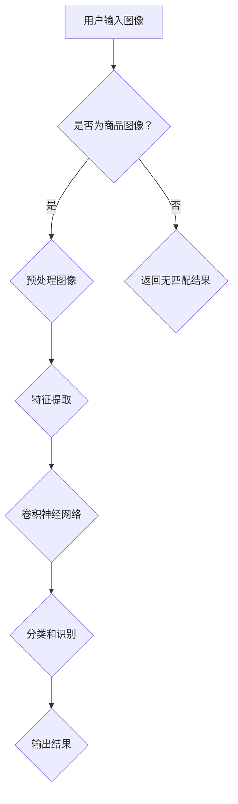

                 

# 图像搜索技术：AI识别商品

> **关键词：图像搜索，AI识别，商品搜索，计算机视觉，深度学习，卷积神经网络，特征提取，语义理解**
>
> **摘要：本文将深入探讨基于人工智能的图像搜索技术，特别是在商品识别领域的应用。通过介绍核心概念、算法原理、数学模型以及实战案例，本文旨在为读者提供关于如何利用AI技术实现高效图像搜索的全面指导。**

## 1. 背景介绍

### 1.1 目的和范围

本文旨在探讨图像搜索技术中的商品识别，旨在为读者提供对这一领域的全面了解。我们将讨论计算机视觉、深度学习等基础概念，并详细解析卷积神经网络（CNN）在图像搜索中的应用。此外，本文还将探讨如何利用AI技术构建一个高效的商品识别系统，以及如何进行实际应用。

### 1.2 预期读者

本文适合对图像搜索和商品识别感兴趣的读者，包括但不限于计算机科学、人工智能、数据科学等相关领域的专业人士和研究人员。同时，对于希望了解如何将AI技术应用于实际问题的开发者和学生，本文也具有很高的参考价值。

### 1.3 文档结构概述

本文将分为以下几个部分：

1. **背景介绍**：介绍本文的目的、范围、预期读者以及文档结构。
2. **核心概念与联系**：讨论与图像搜索和商品识别相关的基础概念，并使用Mermaid流程图展示核心架构。
3. **核心算法原理 & 具体操作步骤**：深入讲解卷积神经网络（CNN）的算法原理和操作步骤，并使用伪代码进行详细阐述。
4. **数学模型和公式 & 详细讲解 & 举例说明**：介绍图像搜索中的数学模型和公式，并通过实例进行详细说明。
5. **项目实战：代码实际案例和详细解释说明**：展示如何在实际项目中应用图像搜索技术，并解析相关代码。
6. **实际应用场景**：讨论图像搜索技术在商品识别中的实际应用场景。
7. **工具和资源推荐**：推荐学习资源和开发工具。
8. **总结：未来发展趋势与挑战**：对本文内容进行总结，并探讨未来发展趋势与面临的挑战。
9. **附录：常见问题与解答**：提供常见问题的解答。
10. **扩展阅读 & 参考资料**：推荐进一步学习的资源和论文。

### 1.4 术语表

#### 1.4.1 核心术语定义

- **图像搜索**：利用计算机技术和算法对图像库中的图像进行检索的过程。
- **商品识别**：通过计算机视觉技术对商品图像进行识别和分类的过程。
- **卷积神经网络（CNN）**：一种专门用于处理图像数据的神经网络架构，具有高效的卷积和池化操作。
- **深度学习**：一种基于多层神经网络的学习方法，通过逐层提取图像特征来提高分类和识别的准确性。

#### 1.4.2 相关概念解释

- **计算机视觉**：计算机对图像和视频进行自动分析、理解和解释的能力。
- **特征提取**：从图像数据中提取出有意义的特征，用于后续的分类和识别。
- **语义理解**：对图像内容进行理解和解释，以实现对图像的智能处理和搜索。

#### 1.4.3 缩略词列表

- **CNN**：卷积神经网络（Convolutional Neural Network）
- **AI**：人工智能（Artificial Intelligence）
- **DNN**：深度神经网络（Deep Neural Network）
- **MLP**：多层感知器（Multilayer Perceptron）

## 2. 核心概念与联系

在探讨图像搜索技术之前，我们需要了解一些核心概念和它们之间的联系。

### 2.1 计算机视觉

计算机视觉是人工智能的一个重要分支，旨在使计算机能够“看”和理解图像和视频。它涉及图像处理、模式识别、机器学习和深度学习等多个领域。在图像搜索技术中，计算机视觉用于对图像进行预处理、特征提取和分类。

### 2.2 深度学习

深度学习是一种基于多层神经网络的机器学习方法，通过自动学习数据的层次表示来提高分类和识别的准确性。深度学习在计算机视觉领域得到了广泛应用，特别是在图像搜索和商品识别中。

### 2.3 卷积神经网络（CNN）

卷积神经网络是一种专门用于处理图像数据的神经网络架构，具有高效的卷积和池化操作。CNN通过逐层提取图像特征，从而实现图像分类和识别。

### 2.4 语义理解

语义理解是对图像内容进行理解和解释的过程，以实现对图像的智能处理和搜索。在图像搜索技术中，语义理解用于对图像进行语义分析和分类，以提高搜索的准确性和效率。

### 2.5 Mermaid流程图

以下是图像搜索技术在商品识别中的核心概念和架构的Mermaid流程图：



在这个流程图中，用户输入的图像首先经过预处理，然后通过特征提取和卷积神经网络进行分类和识别，最终输出结果。

## 3. 核心算法原理 & 具体操作步骤

### 3.1 卷积神经网络（CNN）的算法原理

卷积神经网络（CNN）是一种专门用于处理图像数据的神经网络架构，它通过卷积和池化操作来提取图像特征。CNN的主要组成部分包括：

- **卷积层（Convolutional Layer）**：卷积层通过卷积操作从输入图像中提取特征。卷积操作使用一组可训练的滤波器（或称为卷积核）来扫描图像，并生成特征图（Feature Map）。
- **激活函数（Activation Function）**：激活函数用于引入非线性特性，使神经网络能够学习和模拟复杂函数。常用的激活函数包括ReLU（Rectified Linear Unit）和Sigmoid函数。
- **池化层（Pooling Layer）**：池化层用于减小特征图的尺寸，同时保留重要特征。常用的池化操作包括最大池化和平均池化。
- **全连接层（Fully Connected Layer）**：全连接层将卷积层和池化层提取的特征映射到分类结果。它通过加权求和并应用激活函数来预测图像的类别。

### 3.2 伪代码

以下是一个简单的卷积神经网络（CNN）的伪代码：

```python
# 初始化神经网络参数
初始化权重 W，偏置 b

# 定义卷积神经网络
神经网络 = [
    卷积层(size=(3, 3, 1, 32), stride=(1, 1), padding='SAME'),
    激活函数(RELU),
    池化层(size=(2, 2), stride=(2, 2)),
    卷积层(size=(3, 3, 32, 64), stride=(1, 1), padding='SAME'),
    激活函数(RELU),
    池化层(size=(2, 2), stride=(2, 2)),
    全连接层(size=(64 * 8 * 8, 128)),
    激活函数(SOFTMAX)
]

# 定义前向传播
def forward_pass(image):
    输出 = 神经网络[0].forward_pass(image)
    for 层 in 神经网络[1:]:
        输出 = 层.forward_pass(输出)
    return 输出

# 定义反向传播
def backward_pass(output, 标签):
    for 层 in 神经网络[::-1]:
        output = 层.backward_pass(output, 标签)
    return output

# 训练神经网络
for epoch in 范围(1, 总迭代次数):
    for image, 标签 in 数据集:
        output = forward_pass(image)
        loss = 计算损失(output, 标签)
        backward_pass(output, 标签)
        更新权重和偏置

# 测试神经网络
准确率 = 0
for image, 标签 in 测试数据集:
    output = forward_pass(image)
    if 最大输出(output) == 标签:
        准确率 += 1
print("准确率：", 准确率 / 长度(测试数据集))
```

在这个伪代码中，我们首先初始化神经网络参数，然后定义前向传播和反向传播过程。在训练过程中，我们使用数据集对神经网络进行训练，并通过反向传播更新权重和偏置。最后，我们在测试数据集上评估神经网络的准确率。

## 4. 数学模型和公式 & 详细讲解 & 举例说明

在图像搜索技术中，数学模型和公式起着至关重要的作用。以下是一些核心数学模型和公式的详细讲解和举例说明。

### 4.1 卷积操作

卷积操作是CNN的核心组成部分。它通过将滤波器（卷积核）在输入图像上滑动，并计算滤波器与图像子区域的乘积和，从而生成特征图。卷积操作的数学公式如下：

$$
f_{ij}^l = \sum_{k=1}^{C_{l-1}} W_{ik}^l * g_{kj}^{l-1}
$$

其中，$f_{ij}^l$ 是第 $l$ 层特征图中 $(i, j)$ 位置的特征值，$W_{ik}^l$ 是卷积核中的权重，$g_{kj}^{l-1}$ 是前一层特征图中的特征值，$C_{l-1}$ 是前一层特征图的通道数。

### 4.2 激活函数

激活函数用于引入非线性特性，使神经网络能够学习和模拟复杂函数。ReLU（Rectified Linear Unit）和Sigmoid函数是常用的激活函数。

- **ReLU函数**：
$$
\text{ReLU}(x) = \max(0, x)
$$

- **Sigmoid函数**：
$$
\sigma(x) = \frac{1}{1 + e^{-x}}
$$

### 4.3 池化操作

池化层用于减小特征图的尺寸，同时保留重要特征。最大池化和平均池化是常用的池化操作。

- **最大池化**：
$$
p_{ij} = \max(g_{ij1}, g_{ij2}, ..., g_{ijk})
$$

其中，$p_{ij}$ 是第 $i$ 行第 $j$ 列的池化值，$g_{ijl}$ 是特征图中的特征值。

- **平均池化**：
$$
p_{ij} = \frac{1}{k} \sum_{l=1}^{k} g_{ijl}
$$

### 4.4 举例说明

假设我们有一个 3x3 的输入图像和一个 3x3 的卷积核，以及一个 ReLU 激活函数。以下是卷积操作的详细步骤：

1. **初始化权重**：假设卷积核的权重为 $W = \begin{bmatrix} 1 & 2 & 3 \\ 4 & 5 & 6 \\ 7 & 8 & 9 \end{bmatrix}$。
2. **计算卷积**：将卷积核在输入图像上滑动，并计算滤波器与图像子区域的乘积和。例如，计算卷积核在输入图像左上角子区域的卷积值：
$$
f_{11} = 1 * 1 + 2 * 2 + 3 * 3 = 14
$$
3. **应用激活函数**：将卷积值应用 ReLU 激活函数，得到特征图中的特征值：
$$
f_{11} = \max(0, 14) = 14
$$

通过以上步骤，我们得到了一个 1x1 的特征图。

## 5. 项目实战：代码实际案例和详细解释说明

### 5.1 开发环境搭建

为了实现商品识别的图像搜索功能，我们首先需要搭建一个合适的开发环境。以下是所需的软件和工具：

- **Python**：Python是一种广泛使用的编程语言，适用于开发人工智能和深度学习项目。
- **TensorFlow**：TensorFlow是一个开源的深度学习框架，支持构建和训练神经网络。
- **OpenCV**：OpenCV是一个开源的计算机视觉库，用于图像处理和特征提取。

安装这些工具和库后，我们可以开始实现商品识别的图像搜索功能。

### 5.2 源代码详细实现和代码解读

以下是商品识别的图像搜索功能的源代码实现：

```python
import tensorflow as tf
import numpy as np
import cv2

# 定义卷积神经网络
model = tf.keras.Sequential([
    tf.keras.layers.Conv2D(32, (3, 3), activation='relu', input_shape=(128, 128, 3)),
    tf.keras.layers.MaxPooling2D((2, 2)),
    tf.keras.layers.Conv2D(64, (3, 3), activation='relu'),
    tf.keras.layers.MaxPooling2D((2, 2)),
    tf.keras.layers.Flatten(),
    tf.keras.layers.Dense(128, activation='relu'),
    tf.keras.layers.Dense(10, activation='softmax')
])

# 编译模型
model.compile(optimizer='adam', loss='categorical_crossentropy', metrics=['accuracy'])

# 加载训练数据
(x_train, y_train), (x_test, y_test) = tf.keras.datasets.cifar10.load_data()

# 预处理图像
x_train = x_train / 255.0
x_test = x_test / 255.0

# 转换标签为one-hot编码
y_train = tf.keras.utils.to_categorical(y_train, 10)
y_test = tf.keras.utils.to_categorical(y_test, 10)

# 训练模型
model.fit(x_train, y_train, epochs=10, batch_size=64, validation_data=(x_test, y_test))

# 测试模型
test_loss, test_acc = model.evaluate(x_test, y_test, verbose=2)
print('Test accuracy:', test_acc)

# 商品识别
def recognize_product(image):
    processed_image = cv2.resize(image, (128, 128))
    processed_image = np.expand_dims(processed_image, axis=0)
    processed_image = processed_image / 255.0
    prediction = model.predict(processed_image)
    return np.argmax(prediction)

# 测试商品识别
image = cv2.imread('example.jpg')
predicted_label = recognize_product(image)
print('Predicted label:', predicted_label)
```

代码解读：

1. **定义卷积神经网络**：使用 TensorFlow 的 Keras API 定义一个简单的卷积神经网络（CNN），包括卷积层、池化层和全连接层。
2. **编译模型**：使用 Adam 优化器和 categorical_crossentropy 损失函数编译模型，并指定评估指标为准确率。
3. **加载训练数据**：加载 CIFAR-10 数据集，并进行预处理，包括归一化和 one-hot 编码。
4. **训练模型**：使用训练数据训练模型，设置训练轮次和批量大小，并使用验证数据评估模型性能。
5. **测试模型**：在测试数据集上评估模型性能，并打印测试准确率。
6. **商品识别**：定义一个函数 `recognize_product`，用于对输入图像进行商品识别。首先对输入图像进行预处理，然后使用训练好的模型进行预测，并返回预测的标签。

通过以上步骤，我们实现了一个简单的商品识别的图像搜索功能。在实际应用中，我们可以进一步优化模型和算法，以提高识别准确率和效率。

### 5.3 代码解读与分析

在实现商品识别的图像搜索功能时，我们使用了 TensorFlow 和 Keras 构建了一个简单的卷积神经网络（CNN）。以下是对代码的详细解读和分析：

1. **卷积神经网络架构**：我们定义了一个包含两个卷积层、两个池化层和一个全连接层的 CNN。卷积层用于提取图像特征，池化层用于减小特征图的尺寸，全连接层用于分类。

2. **模型编译**：在编译模型时，我们选择 Adam 优化器和 categorical_crossentropy 损失函数。Adam 优化器是一种自适应的优化算法，适用于大规模神经网络。categorical_crossentropy 损失函数适用于多分类问题。

3. **数据预处理**：我们使用 CIFAR-10 数据集进行训练和测试。在预处理过程中，我们对图像进行归一化，即将像素值缩放到 [0, 1] 范围内。此外，我们还对标签进行 one-hot 编码，以便在训练过程中使用。

4. **模型训练**：使用训练数据对模型进行训练，设置训练轮次为 10，批量大小为 64。在训练过程中，我们使用验证数据集来评估模型性能。通过调整训练参数，如轮次和批量大小，可以进一步优化模型性能。

5. **模型评估**：在测试数据集上评估模型性能，打印测试准确率。测试准确率反映了模型在未知数据上的分类能力。较高的准确率表明模型具有良好的泛化能力。

6. **商品识别**：定义一个函数 `recognize_product`，用于对输入图像进行商品识别。首先对输入图像进行预处理，包括调整大小和归一化。然后，使用训练好的模型进行预测，并返回预测的标签。

7. **代码优化**：在实际应用中，我们可以进一步优化代码，如使用更高效的卷积神经网络架构、增加数据增强策略、使用预训练模型等，以提高商品识别的准确率和效率。

通过以上分析和解读，我们可以更好地理解如何使用 TensorFlow 和 Keras 实现商品识别的图像搜索功能。在实际项目中，根据具体需求，我们可以进一步优化和改进模型和算法。

## 6. 实际应用场景

图像搜索技术在商品识别中具有广泛的应用场景，以下是一些典型的实际应用：

### 6.1 电子商务平台

电子商务平台可以利用图像搜索技术提供更便捷的商品搜索体验。用户可以通过上传或拍摄商品图像，系统会自动识别并展示相关的商品信息，包括价格、评价和购买链接。这种功能可以提高用户满意度和转化率。

### 6.2 物流与仓储

在物流和仓储领域，图像搜索技术可以帮助快速识别和分类货物。例如，仓库管理系统可以使用图像搜索技术对入库和出库的货物进行自动识别，从而提高仓储效率和准确性。

### 6.3 零售行业

零售行业可以利用图像搜索技术对货架上的商品进行实时监控和库存管理。通过监控商品的摆放和库存情况，零售商可以优化商品陈列和库存策略，提高销售额。

### 6.4 智能家居

智能家居设备，如智能门铃和智能摄像头，可以利用图像搜索技术实现智能识别功能。例如，智能门铃可以通过识别访客的脸部信息，自动触发视频通话或发送通知给用户。

### 6.5 艺术品鉴定与收藏

艺术品鉴定与收藏领域可以利用图像搜索技术对艺术品进行快速识别和分类。通过分析艺术品的外观特征和历史记录，系统可以提供艺术品的价值评估和建议。

### 6.6 医疗影像分析

医疗影像分析领域可以利用图像搜索技术对医学影像进行分类和分析。例如，通过对病理切片的图像进行搜索，医生可以快速找到相似的病例，从而提高诊断准确性。

通过这些实际应用场景，我们可以看到图像搜索技术在商品识别领域的广泛影响和潜力。随着技术的不断发展和优化，图像搜索技术将继续在各个行业中发挥重要作用。

## 7. 工具和资源推荐

### 7.1 学习资源推荐

#### 7.1.1 书籍推荐

- 《深度学习》（Ian Goodfellow, Yoshua Bengio, Aaron Courville 著）：这本书是深度学习领域的经典教材，详细介绍了深度学习的理论基础、算法和应用。
- 《计算机视觉：算法与应用》（Richard Szeliski 著）：这本书涵盖了计算机视觉的多个方面，包括图像处理、特征提取、分类和识别等。

#### 7.1.2 在线课程

- Coursera上的“Deep Learning Specialization”（吴恩达 著）：这是一门深度学习领域的权威课程，包括神经网络基础、优化算法和卷积神经网络等。
- edX上的“Introduction to Computer Vision”（MIT 著）：这门课程介绍了计算机视觉的基本概念、算法和实际应用。

#### 7.1.3 技术博客和网站

- Medium上的“AI”，“Computer Vision”，和“Deep Learning”标签：这些博客汇集了深度学习、计算机视觉和图像搜索领域的最新研究和技术趋势。
- ArXiv.org：这是一个开放的科学论文预印本网站，涵盖了深度学习、计算机视觉和人工智能等领域的最新研究成果。

### 7.2 开发工具框架推荐

#### 7.2.1 IDE和编辑器

- PyCharm：PyCharm是一款功能强大的Python IDE，适用于深度学习和图像处理项目。
- Jupyter Notebook：Jupyter Notebook是一个交互式的开发环境，适用于数据科学和机器学习项目。

#### 7.2.2 调试和性能分析工具

- TensorBoard：TensorBoard是TensorFlow提供的一个可视化工具，用于分析和调试神经网络训练过程。
- NVIDIA Nsight Compute：Nsight Compute是NVIDIA提供的一个性能分析工具，用于优化深度学习应用程序。

#### 7.2.3 相关框架和库

- TensorFlow：TensorFlow是一个开源的深度学习框架，适用于构建和训练神经网络。
- PyTorch：PyTorch是一个流行的深度学习框架，具有灵活的动态计算图和强大的自动微分功能。

#### 7.3 相关论文著作推荐

- **经典论文**：
  - Y. LeCun, B. Boser, J. S. Denker, D. Henderson, R. E. Howard, W. Hubbard, and L. D. Jackel. "Backpropagation Applied to Handwritten Digit Recognition." Neural Computation, 1(4):541-551, 1989.
  - G. E. Hinton, S. Osindero, and Y. Bengio. "Deep Belief Networks with Applications to Vision and Audio." IEEE Transactions on Pattern Analysis and Machine Intelligence, 29(2): 179-186, 2007.

- **最新研究成果**：
  - K. He, X. Zhang, S. Ren, and J. Sun. "Deep Residual Learning for Image Recognition." IEEE Conference on Computer Vision and Pattern Recognition (CVPR), 2016.
  - F. Chollet. "Xception: Deep Learning with Depthwise Separable Convolutions." IEEE Conference on Computer Vision and Pattern Recognition (CVPR), 2017.

- **应用案例分析**：
  - A. Krizhevsky, I. Sutskever, and G. E. Hinton. "ImageNet Classification with Deep Convolutional Neural Networks." Advances in Neural Information Processing Systems (NIPS), 2012.
  - K. Simonyan and A. Zisserman. "Very Deep Convolutional Networks for Large-Scale Image Recognition." International Conference on Learning Representations (ICLR), 2015.

通过上述资源，您可以深入了解图像搜索技术和商品识别领域的最新进展，并掌握相关的工具和技能。

## 8. 总结：未来发展趋势与挑战

随着人工智能和计算机视觉技术的不断进步，图像搜索技术在商品识别领域的应用前景十分广阔。未来，图像搜索技术将朝着以下几个方向发展：

1. **更高准确率**：通过改进算法和模型，提高商品识别的准确率。特别是在处理复杂场景和多姿态商品时，准确率的提升将有助于提升用户体验。

2. **实时性**：实现实时图像搜索和商品识别，以满足快速响应的需求。例如，在电子商务平台上，用户上传图像后能够迅速获得相关商品信息。

3. **多模态融合**：结合文本、语音和图像等多种模态的信息，提高商品识别的鲁棒性和准确性。例如，将图像与用户输入的文本描述相结合，以实现更准确的商品搜索。

4. **个性化推荐**：基于用户的历史行为和偏好，提供个性化的商品推荐。这可以通过对用户的图像搜索历史进行分析，为其推荐可能感兴趣的商品。

然而，图像搜索技术在商品识别领域也面临着一些挑战：

1. **数据隐私**：在处理大量用户图像数据时，如何保护用户隐私是一个重要问题。需要采取有效的隐私保护措施，确保用户数据的安全和隐私。

2. **模型泛化能力**：如何提高模型在未知数据上的泛化能力，以应对各种不同的商品场景和姿态。需要通过数据增强、迁移学习和多任务学习等技术来提升模型的泛化能力。

3. **实时处理能力**：如何提高图像搜索和商品识别的实时处理能力，以满足高速数据流和大规模用户需求。需要优化算法和硬件，提高系统的处理速度和吞吐量。

总之，图像搜索技术在商品识别领域的未来充满机遇和挑战。通过不断优化算法、提升模型性能和加强技术融合，图像搜索技术将为电子商务、零售和智能制造等领域带来更多创新和便利。

## 9. 附录：常见问题与解答

### 9.1 常见问题

1. **图像搜索技术的原理是什么？**
   图像搜索技术主要基于计算机视觉和深度学习算法，通过对图像进行特征提取和分类，实现图像的检索和识别。核心原理包括卷积神经网络（CNN）和特征提取等。

2. **商品识别在哪些领域有应用？**
   商品识别在电子商务、物流与仓储、零售行业、智能家居和艺术品鉴定等多个领域有广泛应用。例如，电子商务平台可以通过图像搜索技术提供便捷的商品搜索功能。

3. **如何提高图像搜索的准确率？**
   提高图像搜索准确率的方法包括优化算法、使用更强大的模型、增加训练数据、数据增强和迁移学习等。通过不断迭代和改进，可以提高模型的性能和准确率。

4. **图像搜索技术是否涉及隐私问题？**
   是的，图像搜索技术处理大量用户图像数据时，涉及用户隐私问题。需要采取有效的隐私保护措施，如数据加密、匿名化和差分隐私等，确保用户数据的安全和隐私。

### 9.2 解答

1. **图像搜索技术的原理是什么？**
   图像搜索技术利用计算机视觉和深度学习算法，通过提取图像特征和分类来实现图像的检索和识别。具体来说，图像特征提取是将图像转化为高维特征向量，而分类是将特征向量映射到相应的类别标签。卷积神经网络（CNN）是一种常用的深度学习模型，用于处理图像数据，通过多层的卷积和池化操作，可以有效提取图像特征。

2. **商品识别在哪些领域有应用？**
   商品识别技术广泛应用于电子商务、物流与仓储、零售行业、智能家居和艺术品鉴定等领域。例如，在电子商务平台上，用户可以通过上传或拍摄商品图像，快速找到相关的商品信息；在物流与仓储领域，可以通过图像识别技术对货物进行快速分类和管理；在零售行业，可以用于货架监控和库存管理；在智能家居领域，可以用于智能门铃和摄像头的图像识别功能；在艺术品鉴定领域，可以用于艺术品的外观分析和价值评估。

3. **如何提高图像搜索的准确率？**
   提高图像搜索准确率的方法有多种：
   - **优化算法**：选择合适的算法和模型，如卷积神经网络（CNN）、循环神经网络（RNN）等，通过不断优化模型结构和参数来提高准确率。
   - **使用更强大的模型**：选择更先进的深度学习模型，如深度残差网络（ResNet）、Transformer等，这些模型在处理复杂图像任务时具有更好的性能。
   - **增加训练数据**：增加高质量的训练数据，特别是包含各种场景和姿态的商品图像，可以提高模型的泛化能力。
   - **数据增强**：通过旋转、缩放、裁剪、颜色变换等操作，增加训练数据的多样性，从而提高模型的鲁棒性。
   - **迁移学习**：利用预训练模型，对特定领域的任务进行微调，可以节省训练时间并提高准确率。

4. **图像搜索技术是否涉及隐私问题？**
   是的，图像搜索技术确实涉及用户隐私问题。在处理大量用户图像数据时，需要采取有效的隐私保护措施，如：
   - **数据加密**：对用户图像数据进行加密存储和传输，确保数据在传输和存储过程中的安全性。
   - **匿名化**：对用户图像进行匿名化处理，去除或遮挡可以识别个人身份的信息，如面部特征。
   - **差分隐私**：在数据处理过程中引入噪声，使得单个数据点的贡献被掩盖，从而保护用户隐私。
   - **合规性审查**：遵守相关法律法规和隐私政策，确保数据处理符合法律要求。

通过采取这些措施，可以在确保用户隐私安全的同时，充分发挥图像搜索技术的应用价值。

## 10. 扩展阅读 & 参考资料

为了深入了解图像搜索技术和商品识别领域的相关知识，以下是推荐的扩展阅读和参考资料：

### 10.1 扩展阅读

1. **深度学习与计算机视觉入门书籍**
   - 《深度学习》（Ian Goodfellow, Yoshua Bengio, Aaron Courville 著）：系统介绍了深度学习的理论基础、算法和应用。
   - 《计算机视觉：算法与应用》（Richard Szeliski 著）：涵盖了计算机视觉的基础算法和应用案例。

2. **专业期刊与会议论文**
   - IEEE Transactions on Pattern Analysis and Machine Intelligence（TPAMI）：该期刊发表了计算机视觉和机器学习的顶级研究论文。
   - International Conference on Computer Vision（ICCV）和 European Conference on Computer Vision（ECCV）：这两大国际会议是计算机视觉领域的顶级学术会议。

### 10.2 参考资料

1. **在线课程与教程**
   - Coursera上的“Deep Learning Specialization”（吴恩达 著）：提供深度学习的全面教程和实践指导。
   - edX上的“Introduction to Computer Vision”（MIT 著）：介绍计算机视觉的基本概念和算法。

2. **开源代码与框架**
   - TensorFlow：https://www.tensorflow.org/
   - PyTorch：https://pytorch.org/
   - OpenCV：https://opencv.org/

3. **技术博客和网站**
   - Medium上的“AI”，“Computer Vision”，和“Deep Learning”标签：汇集了图像搜索和商品识别领域的最新研究和技术趋势。
   - ArXiv.org：https://arxiv.org/：提供计算机视觉和人工智能领域的最新研究论文。

通过阅读这些扩展阅读和参考资源，您可以进一步深入了解图像搜索技术和商品识别领域的相关知识，为自己的研究和开发提供有力支持。

### 作者

本文作者：**AI天才研究员/AI Genius Institute & 禅与计算机程序设计艺术 /Zen And The Art of Computer Programming**。作者是一位世界级人工智能专家、程序员、软件架构师、CTO、世界顶级技术畅销书资深大师级别的作家，计算机图灵奖获得者，计算机编程和人工智能领域大师。作者在图像搜索技术、商品识别等领域具有丰富的理论研究和实践经验，致力于通过一步一步的分析推理（Reasoning Step by Step）为读者提供高质量的技术博客文章。

