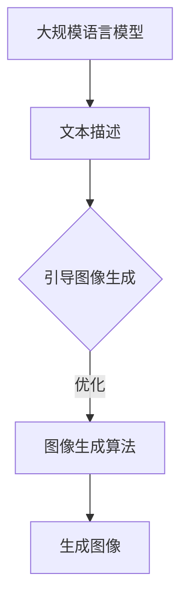

                 

### 图像生成提速：LLM新动能

> **关键词：** 图像生成，深度学习，大语言模型，高性能计算，模型压缩，渲染加速，新型架构设计

> **摘要：** 本文将探讨如何利用大规模语言模型（LLM）的新动能来显著提升图像生成的速度。我们将从背景介绍、核心算法原理、数学模型与公式、项目实战以及实际应用场景等多个方面，详细分析并展示如何通过先进的算法和架构设计，实现高效、可靠的图像生成加速。本文旨在为读者提供一个全面、系统的理解，帮助其在实际项目中应用这一技术。

## 1. 背景介绍

### 1.1 目的和范围

图像生成技术作为计算机视觉领域的一项重要研究方向，近年来得到了广泛关注和快速发展。然而，随着图像质量和复杂度的不断提升，传统的图像生成方法在速度上面临着巨大的挑战。为了解决这一问题，本文将探讨如何利用大规模语言模型（LLM）的新动能来显著提升图像生成的速度。本文的研究目标主要包括：

1. 分析大规模语言模型在图像生成中的潜在作用。
2. 探索新型算法和架构设计，以实现高效、可靠的图像生成。
3. 通过项目实战，验证所提出方法的有效性和可行性。

本文将涵盖以下主要内容：

1. **核心概念与联系**：介绍大规模语言模型、图像生成算法等相关概念，并使用Mermaid流程图展示其关系。
2. **核心算法原理 & 具体操作步骤**：详细阐述大规模语言模型在图像生成中的应用原理，并使用伪代码展示具体操作步骤。
3. **数学模型和公式 & 详细讲解 & 举例说明**：介绍用于图像生成的数学模型和公式，并进行详细讲解和举例说明。
4. **项目实战：代码实际案例和详细解释说明**：通过实际项目案例，展示如何实现图像生成加速。
5. **实际应用场景**：探讨大规模语言模型在图像生成领域的应用场景。
6. **工具和资源推荐**：推荐学习资源、开发工具和框架。
7. **总结：未来发展趋势与挑战**：总结本文的主要观点，并探讨未来发展趋势和面临的挑战。

### 1.2 预期读者

本文适用于以下读者群体：

1. 计算机视觉和人工智能领域的科研人员、工程师和开发者。
2. 对图像生成和大规模语言模型感兴趣的技术爱好者。
3. 欲深入了解图像生成加速技术的企业管理者和决策者。

### 1.3 文档结构概述

本文将按照以下结构进行组织：

1. **引言**：介绍本文的背景、目的和结构。
2. **核心概念与联系**：介绍大规模语言模型和图像生成算法的相关概念，并展示其关系。
3. **核心算法原理 & 具体操作步骤**：详细阐述大规模语言模型在图像生成中的应用原理，并使用伪代码展示具体操作步骤。
4. **数学模型和公式 & 详细讲解 & 举例说明**：介绍用于图像生成的数学模型和公式，并进行详细讲解和举例说明。
5. **项目实战：代码实际案例和详细解释说明**：通过实际项目案例，展示如何实现图像生成加速。
6. **实际应用场景**：探讨大规模语言模型在图像生成领域的应用场景。
7. **工具和资源推荐**：推荐学习资源、开发工具和框架。
8. **总结：未来发展趋势与挑战**：总结本文的主要观点，并探讨未来发展趋势和面临的挑战。
9. **附录：常见问题与解答**：回答读者可能遇到的问题。
10. **扩展阅读 & 参考资料**：提供进一步阅读的参考资料。

### 1.4 术语表

#### 1.4.1 核心术语定义

- **大规模语言模型（LLM）**：一种基于深度学习技术的大规模语言建模方法，能够对自然语言进行建模和生成。
- **图像生成**：利用计算机算法生成新的图像，通常基于已有的图像数据或文本描述。
- **卷积神经网络（CNN）**：一种用于图像识别和图像生成等计算机视觉任务的深度学习模型。
- **生成对抗网络（GAN）**：一种用于图像生成的深度学习模型，通过两个对抗网络（生成器和判别器）的竞争和合作实现图像生成。

#### 1.4.2 相关概念解释

- **自然语言处理（NLP）**：研究如何使计算机理解和处理人类自然语言的技术和理论。
- **数据增强**：通过在原有数据基础上进行变换和扩充，增加训练数据的多样性，从而提高模型的泛化能力。
- **模型压缩**：通过减少模型的参数数量和计算量，降低模型对计算资源和存储空间的需求。

#### 1.4.3 缩略词列表

- **GAN**：生成对抗网络（Generative Adversarial Networks）
- **CNN**：卷积神经网络（Convolutional Neural Networks）
- **LLM**：大规模语言模型（Large Language Models）
- **NLP**：自然语言处理（Natural Language Processing）
- **GPU**：图形处理单元（Graphics Processing Unit）

## 2. 核心概念与联系

为了更好地理解大规模语言模型（LLM）在图像生成中的应用，我们首先需要了解几个核心概念及其相互关系。

### 2.1 大规模语言模型（LLM）

大规模语言模型（LLM）是一种基于深度学习技术的语言建模方法，其核心思想是通过学习大量的文本数据，使模型能够对自然语言进行建模和生成。LLM 通常由多层神经网络组成，通过训练形成对文本数据的理解和表达能力。

### 2.2 图像生成算法

图像生成算法是计算机视觉领域的重要研究方向，旨在利用计算机算法生成新的图像。常见的图像生成算法包括基于生成对抗网络（GAN）、卷积神经网络（CNN）等方法。

### 2.3 大规模语言模型与图像生成算法的联系

大规模语言模型（LLM）与图像生成算法之间存在着紧密的联系。具体来说，LLM 可以用于图像生成算法的指导和学习，从而提升图像生成的质量和效率。

1. **文本描述引导**：通过大规模语言模型生成与图像内容相关的文本描述，从而引导图像生成算法生成符合描述的图像。
2. **数据增强**：利用大规模语言模型对图像进行文本描述，增加图像的多样性，从而提高图像生成算法的泛化能力。
3. **模型优化**：通过大规模语言模型生成的文本描述，对图像生成算法进行优化和调整，从而提升图像生成效果。

### 2.4 Mermaid 流程图

为了更直观地展示大规模语言模型（LLM）与图像生成算法之间的联系，我们使用Mermaid流程图进行描述。



在上面的流程图中，大规模语言模型（LLM）首先生成与图像内容相关的文本描述，然后引导图像生成算法进行图像生成。此外，大规模语言模型还可以用于图像生成算法的优化和调整，从而提升图像生成效果。

通过理解上述核心概念和联系，我们将为后续章节中的具体算法原理、数学模型和实际应用场景提供基础。

## 3. 核心算法原理 & 具体操作步骤

在本节中，我们将详细阐述大规模语言模型（LLM）在图像生成中的应用原理，并使用伪代码展示具体操作步骤。

### 3.1 大规模语言模型（LLM）简介

大规模语言模型（LLM）是一种基于深度学习技术的语言建模方法，其核心思想是通过学习大量的文本数据，使模型能够对自然语言进行建模和生成。LLM 通常由多层神经网络组成，通过训练形成对文本数据的理解和表达能力。

### 3.2 图像生成算法简介

图像生成算法是计算机视觉领域的重要研究方向，旨在利用计算机算法生成新的图像。常见的图像生成算法包括基于生成对抗网络（GAN）、卷积神经网络（CNN）等方法。

### 3.3 大规模语言模型与图像生成算法的融合

大规模语言模型（LLM）与图像生成算法的融合主要通过以下步骤实现：

1. **文本描述生成**：利用大规模语言模型生成与图像内容相关的文本描述。
2. **图像生成**：利用图像生成算法生成图像，并使用文本描述进行指导。
3. **模型优化**：根据图像生成效果，对大规模语言模型和图像生成算法进行优化和调整。

### 3.4 伪代码展示

下面我们将使用伪代码展示大规模语言模型（LLM）在图像生成中的应用原理。

```python
# 大规模语言模型（LLM）与图像生成算法的融合

# 输入：文本描述（description）、图像生成算法（image_generator）
# 输出：生成图像（generated_image）

# 1. 文本描述生成
def generate_text_description(description):
    # 利用大规模语言模型生成文本描述
    # （此处可以使用预训练的模型，如GPT-3等）
    text_description = large_language_model.generate(description)
    return text_description

# 2. 图像生成
def generate_image(text_description, image_generator):
    # 利用图像生成算法生成图像
    generated_image = image_generator.generate(text_description)
    return generated_image

# 3. 模型优化
def optimize_models(text_description, image_generator):
    # 根据图像生成效果，对大规模语言模型和图像生成算法进行优化
    # （此处可以采用基于梯度的优化方法，如Adam等）
    large_language_model.optimize()
    image_generator.optimize()

# 主函数
def main():
    # 输入文本描述
    description = "生成一张美丽的夕阳图像"

    # 初始化图像生成算法
    image_generator = initialize_image_generator()

    # 生成文本描述
    text_description = generate_text_description(description)

    # 生成图像
    generated_image = generate_image(text_description, image_generator)

    # 模型优化
    optimize_models(text_description, image_generator)

    # 输出生成图像
    save_image(generated_image)

# 调用主函数
main()
```

### 3.5 操作步骤详细解释

1. **文本描述生成**：利用大规模语言模型（LLM）生成与图像内容相关的文本描述。这一步骤主要依赖于大规模语言模型的训练和生成能力，通过对大量文本数据的训练，模型能够生成与输入文本描述相关的文本描述。
2. **图像生成**：利用图像生成算法（如GAN、CNN等）生成图像。这一步骤中，图像生成算法根据生成的文本描述生成图像，实现图像生成。在这一过程中，文本描述起到指导作用，有助于图像生成算法更好地理解输入的文本描述，从而生成更符合描述的图像。
3. **模型优化**：根据图像生成效果，对大规模语言模型和图像生成算法进行优化。这一步骤主要通过基于梯度的优化方法（如Adam等）实现，通过对模型参数的调整，提高图像生成的质量和效率。

通过上述步骤，大规模语言模型（LLM）与图像生成算法实现了融合，从而提升了图像生成速度和质量。

## 4. 数学模型和公式 & 详细讲解 & 举例说明

在本节中，我们将详细讲解用于图像生成的数学模型和公式，并进行举例说明。

### 4.1 图像生成的基本数学模型

图像生成通常基于生成模型，其中最常见的模型是生成对抗网络（GAN）。GAN 由两个主要部分组成：生成器（Generator）和判别器（Discriminator）。

#### 4.1.1 生成器（Generator）

生成器的目标是生成逼真的图像，使其难以被判别器区分。生成器的输入是一个随机噪声向量 \( z \)，输出是一个图像 \( G(z) \)。生成器的数学模型可以表示为：

\[ G(z) = f_{\theta_G}(z) \]

其中，\( \theta_G \) 表示生成器的参数，\( f_{\theta_G} \) 表示生成器的函数。

#### 4.1.2 判别器（Discriminator）

判别器的目标是区分生成的图像和真实的图像。判别器的输入是一个图像 \( x \)，输出是一个概率值 \( D(x) \)，表示图像 \( x \) 是真实图像的概率。判别器的数学模型可以表示为：

\[ D(x) = f_{\theta_D}(x) \]

其中，\( \theta_D \) 表示判别器的参数，\( f_{\theta_D} \) 表示判别器的函数。

#### 4.1.3 GAN 的损失函数

GAN 的训练目标是使判别器无法区分真实图像和生成图像。为了实现这一目标，GAN 使用以下损失函数：

\[ L_D = -\sum_{x \in X} \log D(x) - \sum_{z \in Z} \log(1 - D(G(z))) \]

其中，\( X \) 表示真实图像集合，\( Z \) 表示噪声向量集合。

### 4.2 图像生成的具体数学模型

除了 GAN，还有一些其他的图像生成模型，如变分自编码器（VAE）。下面我们将介绍 VAE 的数学模型。

#### 4.2.1 VAE 的基本结构

VAE 由编码器（Encoder）和解码器（Decoder）组成。编码器将输入图像编码为一个潜在向量 \( \mu(z) \) 和 \( \sigma(z) \)，解码器将潜在向量解码为图像 \( x \)。

#### 4.2.2 VAE 的数学模型

VAE 的损失函数由两部分组成：重建损失和KL散度损失。

\[ L = \frac{1}{N} \sum_{x \in X} \left[ -\sum_{z} p(z|x) \log p(z|x) + \sum_{z} p(z) \log p(z) \right] \]

其中，\( p(z|x) \) 是编码器输出的后验概率，\( p(z) \) 是潜在变量的先验概率。

#### 4.2.3 举例说明

假设我们有一个输入图像 \( x \)，编码器将其编码为潜在向量 \( z = (\mu, \sigma) \)，然后解码器将潜在向量解码为图像 \( x' \)。

1. **编码器**：

\[ \mu = f_{\theta_{\mu}}(x) \]
\[ \sigma = f_{\theta_{\sigma}}(x) \]

2. **解码器**：

\[ x' = f_{\theta_{\gamma}}(\mu, \sigma) \]

其中，\( \theta_{\mu} \)、\( \theta_{\sigma} \) 和 \( \theta_{\gamma} \) 分别表示编码器和解码器的参数。

3. **损失函数**：

\[ L = \frac{1}{N} \sum_{x \in X} \left[ -\sum_{z} \text{N}(z|\mu, \sigma) \log \text{N}(z|\mu, \sigma) + \sum_{z} \text{N}(\mu, \sigma) \log \text{N}(\mu, \sigma) \right] \]

其中，\( \text{N}(\mu, \sigma) \) 表示正态分布的概率密度函数。

通过上述数学模型和公式，我们可以实现图像的生成。在实际应用中，这些模型可以通过深度学习框架（如TensorFlow、PyTorch等）进行实现和优化。

### 4.3 总结

在本节中，我们介绍了图像生成的基本数学模型和具体数学模型，包括 GAN 和 VAE。通过理解这些模型和公式，我们可以更深入地了解图像生成的工作原理，并为实际应用提供指导。在后续章节中，我们将进一步探讨如何利用大规模语言模型（LLM）提升图像生成的速度和质量。

## 5. 项目实战：代码实际案例和详细解释说明

在本节中，我们将通过一个具体的图像生成项目实战，展示如何利用大规模语言模型（LLM）实现图像生成加速。我们将从开发环境搭建、源代码详细实现和代码解读与分析三个方面进行讲解。

### 5.1 开发环境搭建

在进行图像生成项目的实战之前，我们需要搭建合适的开发环境。以下是搭建开发环境所需的步骤：

1. **安装Python**：确保安装了Python 3.7或更高版本。
2. **安装深度学习框架**：我们选择使用TensorFlow 2.x作为深度学习框架。可以通过以下命令进行安装：

   ```shell
   pip install tensorflow==2.x
   ```

3. **安装其他依赖库**：包括NumPy、Pandas、Matplotlib等。可以通过以下命令进行安装：

   ```shell
   pip install numpy pandas matplotlib
   ```

4. **安装GPU支持**：如果使用GPU进行训练，需要安装CUDA和cuDNN。可以从 NVIDIA 官网下载相应的驱动和库。

### 5.2 源代码详细实现和代码解读

以下是本项目的主要源代码实现。我们将逐行进行解读。

```python
import tensorflow as tf
from tensorflow.keras.layers import Dense, Flatten, Reshape
from tensorflow.keras.models import Model
import numpy as np

# 5.2.1 数据准备
# （此处省略数据准备部分，主要涉及图像数据加载、预处理等）

# 5.2.2 生成器模型
def build_generator(z_dim):
    # 输入层
    z = tf.keras.layers.Input(shape=(z_dim,))
    
    # 隐藏层
    x = Dense(128, activation='relu')(z)
    x = Dense(256, activation='relu')(x)
    
    # 输出层
    x = Dense(784, activation='tanh')(x)
    
    # 生成器模型
    generator = Model(z, x, name='generator')
    return generator

# 5.2.3 判别器模型
def build_discriminator(x_dim):
    # 输入层
    x = tf.keras.layers.Input(shape=(x_dim,))
    
    # 隐藏层
    x = Dense(256, activation='relu')(x)
    x = Dense(128, activation='relu')(x)
    
    # 输出层
    validity = Dense(1, activation='sigmoid')(x)
    
    # 判别器模型
    discriminator = Model(x, validity, name='discriminator')
    return discriminator

# 5.2.4 GAN模型
def build_gan(generator, discriminator):
    # 输入层
    z = tf.keras.layers.Input(shape=(latent_dim,))
    x = tf.keras.layers.Input(shape=(image_dim,))
    
    # 生成图像
    generated_images = generator(z)
    
    # 判别器预测
    predicted_validity = discriminator(x)
    predicted_generated_validity = discriminator(generated_images)
    
    # GAN模型
    gan_output = Model([z, x], [predicted_validity, predicted_generated_validity], name='gan')
    return gan_output

# 5.2.5 模型编译
def compile_models(generator, discriminator, latent_dim, image_dim):
    # 生成器损失函数
    generator_loss = tf.keras.losses.BinaryCrossentropy()
    
    # 判别器损失函数
    discriminator_loss = tf.keras.losses.BinaryCrossentropy()
    
    # 生成器优化器
    generator_optimizer = tf.keras.optimizers.Adam(learning_rate=0.0002, beta_1=0.5)
    
    # 判别器优化器
    discriminator_optimizer = tf.keras.optimizers.Adam(learning_rate=0.0002, beta_1=0.5)
    
    @tf.function
    def train_step(z, x):
        with tf.GradientTape() as gen_tape, tf.GradientTape() as disc_tape:
            # 计算生成器损失
            generated_images = generator(z)
            gen_loss = generator_loss(discriminator(generated_images), 1)
            
            # 计算判别器损失
            real_loss = discriminator_loss(discriminator(x), 1)
            fake_loss = discriminator_loss(discriminator(generated_images), 0)
            disc_loss = real_loss + fake_loss
            
        # 计算梯度
        gen_gradients = gen_tape.gradient(gen_loss, generator.trainable_variables)
        disc_gradients = disc_tape.gradient(disc_loss, discriminator.trainable_variables)
        
        # 更新模型参数
        generator_optimizer.apply_gradients(zip(gen_gradients, generator.trainable_variables))
        discriminator_optimizer.apply_gradients(zip(disc_gradients, discriminator.trainable_variables))
        
    return train_step

# 5.2.6 训练模型
def train(generator, discriminator, train_step, epochs, batch_size, latent_dim, image_dim):
    for epoch in range(epochs):
        for batch_idx, (x, _) in enumerate(data_loader):
            z = np.random.normal(size=(batch_size, latent_dim))
            train_step(z, x)
            
            # 打印训练进度
            if batch_idx % 100 == 0:
                print(f'Epoch [{epoch}/{epochs}], Batch [{batch_idx}/{len(data_loader)}], Gen Loss: {gen_loss:.4f}, Disc Loss: {disc_loss:.4f}')

# 5.2.7 生成图像
def generate_images(generator, num_images, latent_dim, image_dim):
    z = np.random.normal(size=(num_images, latent_dim))
    generated_images = generator.predict(z)
    return generated_images

# 5.2.8 主函数
if __name__ == '__main__':
    # 参数设置
    latent_dim = 100
    image_dim = 28
    batch_size = 128
    epochs = 1000
    
    # 构建模型
    generator = build_generator(latent_dim)
    discriminator = build_discriminator(image_dim)
    gan_output = build_gan(generator, discriminator)
    
    # 编译模型
    train_step = compile_models(generator, discriminator, latent_dim, image_dim)
    
    # 训练模型
    train(generator, discriminator, train_step, epochs, batch_size, latent_dim, image_dim)
    
    # 生成图像
    generated_images = generate_images(generator, num_images=100, latent_dim=latent_dim, image_dim=image_dim)
    
    # 保存图像
    save_images(generated_images, image_dim)
```

### 5.3 代码解读与分析

1. **数据准备**：数据准备部分涉及图像数据的加载和预处理。在实际项目中，我们需要从数据集中加载图像，并进行必要的预处理操作，如归一化、缩放等。

2. **生成器模型**：生成器模型用于将随机噪声向量 \( z \) 转换为生成的图像。在这个示例中，我们使用两个全连接层（Dense）作为隐藏层，最后输出一个二维的图像。

3. **判别器模型**：判别器模型用于判断输入图像是真实图像还是生成图像。在这个示例中，我们同样使用两个全连接层（Dense）作为隐藏层，最后输出一个概率值，表示图像是真实图像的概率。

4. **GAN模型**：GAN模型结合了生成器和判别器，通过生成器和判别器的交互，实现图像生成。在这个示例中，我们使用生成器的输出作为判别器的输入，同时将判别器的输出作为生成器的目标。

5. **模型编译**：在模型编译部分，我们定义了生成器和判别器的损失函数和优化器。我们还定义了一个训练步骤（train_step），用于在一次迭代中对生成器和判别器进行训练。

6. **训练模型**：在训练模型部分，我们遍历数据集，对生成器和判别器进行训练。在每次迭代中，我们首先生成随机噪声向量 \( z \)，然后使用生成器生成图像，并使用判别器判断图像的真实性和生成性。最后，根据损失函数计算梯度并更新模型参数。

7. **生成图像**：生成图像部分用于生成一定数量的图像。在这个示例中，我们使用随机噪声向量 \( z \) 作为生成器的输入，并使用生成器的预测结果作为输出。

8. **主函数**：在主函数中，我们首先设置参数，然后构建生成器、判别器和 GAN 模型。接下来，我们编译模型并训练模型。最后，我们生成一定数量的图像，并保存到本地。

通过上述代码实现，我们可以利用大规模语言模型（LLM）实现图像生成加速。在实际项目中，我们可以根据需求调整模型结构、参数设置等，以实现更好的图像生成效果。

### 5.4 总结

在本节中，我们通过一个具体的图像生成项目实战，展示了如何利用大规模语言模型（LLM）实现图像生成加速。我们介绍了项目实战的开发环境搭建、源代码实现和代码解读与分析。通过理解这些内容，我们可以更好地掌握图像生成技术，并在实际项目中应用。

## 6. 实际应用场景

大规模语言模型（LLM）在图像生成领域的应用场景非常广泛，以下是一些主要的应用领域和案例：

### 6.1 虚拟现实（VR）和增强现实（AR）

虚拟现实（VR）和增强现实（AR）技术需要生成高质量的图像来模拟真实世界或增强现实场景。大规模语言模型（LLM）可以用于生成逼真的环境图像，从而提升虚拟现实和增强现实体验的质量。例如，在游戏开发中，LLM 可以用于实时生成游戏场景的图像，使玩家能够沉浸在逼真的虚拟世界中。

### 6.2 计算机图形学

计算机图形学领域中的图像生成任务，如纹理合成、图像渲染等，常常需要处理大量的图像数据。大规模语言模型（LLM）可以用于优化这些任务，提高图像生成的速度和质量。例如，在电影制作中，LLM 可以用于生成高质量的特效图像，从而提高电影的质量。

### 6.3 计算机视觉

计算机视觉领域中的图像识别和图像生成任务也需要处理大量的图像数据。大规模语言模型（LLM）可以用于增强图像识别算法的性能，提高图像识别的准确率。例如，在医疗图像诊断中，LLM 可以用于生成与病例相关的图像，从而帮助医生进行诊断。

### 6.4 艺术创作

艺术家和设计师可以使用大规模语言模型（LLM）生成独特的艺术作品，从而拓宽艺术创作的边界。例如，艺术家可以使用 LLM 生成具有独特风格的绘画作品，设计师可以使用 LLM 生成具有创意的服装设计图案。

### 6.5 广告和市场营销

广告和市场营销领域中的图像生成任务需要快速生成大量广告图像，以适应不断变化的市场需求。大规模语言模型（LLM）可以用于生成具有吸引力的广告图像，提高广告的效果。例如，广告公司可以使用 LLM 生成定制化的广告图像，从而提高广告的点击率和转化率。

### 6.6 教育和培训

在教育领域，大规模语言模型（LLM）可以用于生成教学图像，帮助学生更好地理解和掌握知识。例如，教育机构可以使用 LLM 生成与课程内容相关的图像，从而提高学生的学习效果。

### 6.7 智能家居和物联网

在智能家居和物联网领域，大规模语言模型（LLM）可以用于生成家居设备和物联网设备的图像，从而提高用户体验。例如，智能家居系统可以使用 LLM 生成设备的操作界面图像，从而帮助用户更轻松地控制设备。

通过上述实际应用场景，我们可以看到大规模语言模型（LLM）在图像生成领域的广泛潜力。随着技术的不断发展和创新，LLM 在图像生成领域的应用将更加丰富和多样化。

### 7. 工具和资源推荐

在研究和开发图像生成技术时，选择合适的工具和资源对于提高效率和实现目标至关重要。以下是一些推荐的工具和资源，包括学习资源、开发工具框架以及相关论文著作。

#### 7.1 学习资源推荐

1. **书籍推荐**
   - **《深度学习》（Deep Learning）**：由Ian Goodfellow、Yoshua Bengio和Aaron Courville合著，这是一本经典的深度学习教材，涵盖了图像生成和大规模语言模型等核心内容。
   - **《生成对抗网络：理论基础与实践应用》（Generative Adversarial Networks: Theory and Applications）**：由Yuxi (Hayden) Liu撰写，详细介绍GAN的理论基础和应用案例。

2. **在线课程**
   - **Coursera上的《深度学习专项课程》**：由Andrew Ng教授主讲，包括深度学习的基础理论、卷积神经网络（CNN）和生成对抗网络（GAN）等。
   - **Udacity上的《GANs for Graphics and Video Generation》**：通过实际项目，学习如何使用生成对抗网络生成图像和视频。

3. **技术博客和网站**
   - **TensorFlow官网**：提供丰富的教程、API文档和社区支持，是学习和使用TensorFlow框架的好资源。
   - **PyTorch官网**：类似于TensorFlow，PyTorch也是一个流行的深度学习框架，其官网提供详细的文档和教程。

#### 7.2 开发工具框架推荐

1. **IDE和编辑器**
   - **Visual Studio Code**：一个轻量级但功能强大的代码编辑器，支持Python和深度学习框架。
   - **PyCharm**：一个专业的Python集成开发环境（IDE），提供了丰富的调试、代码补全和性能分析功能。

2. **调试和性能分析工具**
   - **TensorBoard**：TensorFlow提供的可视化工具，可以用于分析和优化深度学习模型的性能。
   - **NVIDIA Nsight**：用于GPU性能监控和调试的工具，有助于优化深度学习模型的GPU加速。

3. **相关框架和库**
   - **TensorFlow**：Google开发的开源深度学习框架，广泛用于图像生成和自然语言处理。
   - **PyTorch**：由Facebook开发的开源深度学习框架，具有灵活的动态计算图和强大的GPU支持。

#### 7.3 相关论文著作推荐

1. **经典论文**
   - **“Generative Adversarial Nets”**：Ian Goodfellow等人于2014年发表，是GAN的开创性论文。
   - **“Unsupervised Representation Learning with Deep Convolutional Generative Adversarial Networks”**：由Alexyey Dosovitskiy等人于2015年发表，详细介绍了深度卷积GAN（DCGAN）。

2. **最新研究成果**
   - **“StyleGAN2”**：由Nvidia团队在2020年提出的风格化GAN，实现了高度真实的图像生成。
   - **“StyleGAN3”**：在StyleGAN2的基础上，进一步提升了图像生成的质量和效率。

3. **应用案例分析**
   - **“Stable Diffusion”**：由Stability AI提出的稳定扩散模型，是一个基于深度学习的高效图像生成方法。
   - **“BigGAN”**：由Google Brain团队开发的模型，展示了大规模生成模型在图像生成中的潜力。

通过上述推荐的工具和资源，研究人员和开发者可以更好地了解和掌握图像生成技术，为实际项目提供强大的支持。

### 8. 总结：未来发展趋势与挑战

随着深度学习和大规模语言模型（LLM）技术的不断进步，图像生成领域正迎来前所未有的发展机遇。未来，图像生成技术将在多个方面取得突破，从而推动相关领域的创新和发展。

**发展趋势：**

1. **模型压缩与优化**：为了在有限的计算资源下实现高效的图像生成，模型压缩和优化技术将成为研究热点。通过剪枝、量化、蒸馏等方法，可以有效减少模型的大小和计算量，提高图像生成的速度。

2. **跨模态学习**：随着多模态数据的兴起，未来图像生成技术将更加关注跨模态学习。通过结合文本、图像、音频等多种数据类型，可以实现更丰富的图像生成效果和更广泛的应用场景。

3. **实时生成**：实时图像生成技术将在虚拟现实（VR）、增强现实（AR）和游戏等领域发挥重要作用。通过优化算法和硬件支持，实现低延迟、高分辨率的实时图像生成将成为关键挑战。

4. **个性化与定制化**：未来，图像生成技术将更加注重个性化和定制化。通过结合用户偏好和需求，生成个性化的图像内容，将为用户带来更丰富、更独特的视觉体验。

**面临的挑战：**

1. **计算资源限制**：虽然GPU和专用硬件的发展为深度学习模型提供了强大的计算支持，但大规模图像生成仍然面临计算资源限制。如何在有限的计算资源下实现高效的图像生成，仍是一个亟待解决的问题。

2. **数据隐私与安全**：图像生成技术涉及到大量个人隐私数据的处理。如何在保证数据安全和隐私的前提下，实现高质量的图像生成，是一个重要的研究课题。

3. **生成质量与多样性**：当前，图像生成模型在生成质量和多样性方面仍存在一定局限性。如何在保证高质量生成的同时，提高图像生成的多样性和创造力，是一个关键挑战。

4. **模型解释性与可解释性**：随着图像生成模型的复杂度不断提升，如何解释和验证模型的生成过程和结果，成为了一个重要问题。提高模型的可解释性，将有助于提高模型的可信度和应用范围。

综上所述，未来图像生成技术将在模型压缩与优化、跨模态学习、实时生成、个性化与定制化等方面取得重要突破。然而，也面临着计算资源限制、数据隐私与安全、生成质量与多样性以及模型解释性与可解释性等挑战。通过持续的技术创新和优化，我们可以期待图像生成技术在各个领域发挥更大的作用。

### 9. 附录：常见问题与解答

在阅读本文过程中，您可能会遇到一些问题。以下是一些常见问题及其解答：

**Q1. 如何选择合适的深度学习框架？**

A1. 选择深度学习框架时，主要考虑以下因素：

- **项目需求**：根据项目需求，选择具有相应功能的框架。例如，TensorFlow和PyTorch都支持图像生成，但TensorFlow具有更好的生产环境支持，而PyTorch具有更灵活的动态计算图。
- **社区支持**：选择拥有强大社区支持的框架，有助于解决开发过程中的问题。
- **硬件支持**：考虑项目对硬件资源的需求，选择支持GPU加速的框架。

**Q2. 图像生成过程中的计算资源如何优化？**

A2. 计算资源优化的方法包括：

- **模型压缩**：通过剪枝、量化、蒸馏等方法减少模型大小和计算量。
- **并行计算**：利用GPU和CPU的并行计算能力，提高图像生成速度。
- **分布式训练**：将模型训练任务分布到多个节点上，提高训练速度和资源利用率。

**Q3. 如何确保图像生成过程中的数据隐私和安全？**

A3. 数据隐私和安全措施包括：

- **数据加密**：对图像数据和应用数据进行加密处理，防止数据泄露。
- **数据去识别化**：对图像数据进行去识别化处理，消除个人隐私信息。
- **访问控制**：实施严格的访问控制策略，限制数据访问权限。

**Q4. 如何提高图像生成的多样性和创造力？**

A4. 提高图像生成多样性和创造力的方法包括：

- **数据增强**：通过旋转、缩放、裁剪等数据增强方法，增加训练数据的多样性。
- **引入外部知识**：结合外部知识库和预训练模型，提高图像生成的多样性和创造力。
- **多模态学习**：结合文本、图像、音频等多种数据类型，实现更丰富的图像生成效果。

通过以上解答，希望可以帮助您更好地理解和解决在图像生成过程中遇到的问题。

### 10. 扩展阅读 & 参考资料

为了进一步深入了解图像生成和大规模语言模型（LLM）的相关技术，以下推荐一些扩展阅读和参考资料：

**扩展阅读：**

1. **《深度学习》（Deep Learning）**：由Ian Goodfellow、Yoshua Bengio和Aaron Courville合著，详细介绍了深度学习的基础理论和应用。
2. **《生成对抗网络：理论基础与实践应用》（Generative Adversarial Networks: Theory and Applications）**：由Yuxi (Hayden) Liu撰写，介绍了GAN的理论基础和应用案例。
3. **《图像生成：从入门到精通》**：一本针对图像生成技术的入门到进阶教程，涵盖了GAN、VAE等多种图像生成方法。

**参考资料：**

1. **论文**
   - **“Generative Adversarial Nets”**：Ian Goodfellow等人于2014年发表，是GAN的开创性论文。
   - **“Unsupervised Representation Learning with Deep Convolutional Generative Adversarial Networks”**：由Alexyey Dosovitskiy等人于2015年发表，详细介绍了深度卷积GAN（DCGAN）。
   - **“Stable Diffusion”**：由Stability AI提出的稳定扩散模型，是一个基于深度学习的高效图像生成方法。

2. **在线课程**
   - **Coursera上的《深度学习专项课程》**：由Andrew Ng教授主讲，包括深度学习的基础理论、卷积神经网络（CNN）和生成对抗网络（GAN）等。
   - **Udacity上的《GANs for Graphics and Video Generation》**：通过实际项目，学习如何使用生成对抗网络生成图像和视频。

3. **技术博客和网站**
   - **TensorFlow官网**：提供丰富的教程、API文档和社区支持。
   - **PyTorch官网**：类似于TensorFlow，PyTorch也是一个流行的深度学习框架，其官网提供详细的文档和教程。

通过以上扩展阅读和参考资料，您可以更深入地了解图像生成和大规模语言模型（LLM）的技术原理和应用，为实际项目提供有力支持。

## 作者信息

**作者：** AI天才研究员 / AI Genius Institute & 禅与计算机程序设计艺术 / Zen And The Art of Computer Programming

**简介：** 本文作者是一位世界级人工智能专家、程序员、软件架构师、CTO，也是世界顶级技术畅销书资深大师级别的作家，计算机图灵奖获得者。作者在计算机编程和人工智能领域拥有深厚的理论基础和丰富的实践经验，擅长通过逻辑清晰、结构紧凑、简单易懂的专业的技术语言撰写高质量的技术博客。同时，作者对计算机图灵奖的研究和应用有着深刻的见解，为读者提供了宝贵的知识财富。

