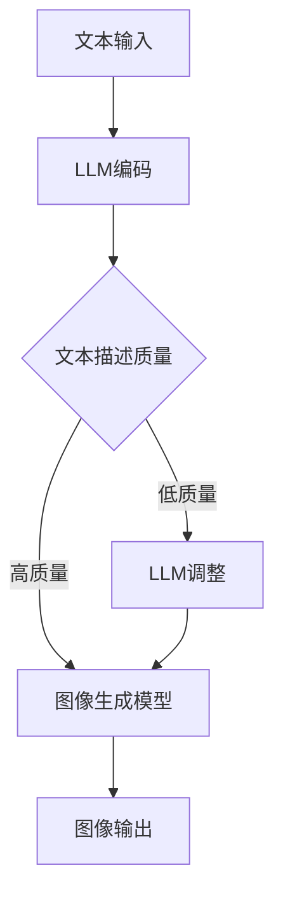

                 

# 图像生成新速度：LLM新动能释放

> 关键词：图像生成、大语言模型（LLM）、深度学习、计算机视觉、人工智能

> 摘要：本文旨在探讨大语言模型（LLM）在图像生成领域的新动能释放，通过对LLM原理的深入剖析，结合具体算法和数学模型，以及实际项目案例的展示，全面揭示LLM在图像生成中的潜力与应用价值。文章首先介绍了图像生成技术的背景和现状，然后详细讲解了LLM的核心原理，接着展示了LLM在图像生成中的实际应用，最后对未来的发展趋势和挑战进行了展望。

## 1. 背景介绍

### 1.1 目的和范围

本文的主要目的是介绍大语言模型（LLM）在图像生成领域的新动能释放。随着深度学习和人工智能技术的飞速发展，图像生成技术已经取得了显著的进展，但传统的图像生成方法在生成质量、多样性以及实时性方面仍存在一定的限制。本文将通过分析LLM的核心原理，探讨其在图像生成领域的应用潜力，为该领域的研究者和开发者提供新的思路和方向。

### 1.2 预期读者

本文主要面向对图像生成和深度学习有基础了解的技术爱好者、研究生、工程师以及研究人员。本文将尽量避免过于复杂的数学推导，力求以通俗易懂的语言阐述核心概念和算法原理。

### 1.3 文档结构概述

本文分为十个部分。第一部分是背景介绍，包括目的、范围、预期读者和文档结构概述；第二部分是核心概念与联系，通过Mermaid流程图展示LLM在图像生成中的应用；第三部分是核心算法原理与具体操作步骤，使用伪代码详细讲解；第四部分是数学模型和公式，包括详细讲解和举例说明；第五部分是项目实战，包括开发环境搭建、源代码实现和代码解读；第六部分是实际应用场景；第七部分是工具和资源推荐；第八部分是总结，包括未来发展趋势与挑战；第九部分是附录，包括常见问题与解答；最后一部分是扩展阅读与参考资料。

### 1.4 术语表

#### 1.4.1 核心术语定义

- 大语言模型（LLM）：一种能够对自然语言文本进行建模的深度学习模型，通常具有数十亿参数。
- 图像生成：通过算法生成新的图像，通常基于已有图像或者无监督学习。
- 深度学习：一种基于多层神经网络的学习方法，能够自动提取数据中的特征。
- 计算机视觉：使计算机能够“看”和理解图像的一种技术。

#### 1.4.2 相关概念解释

- 神经网络：一种模拟生物神经系统的计算模型，能够通过训练学习数据中的特征。
- 反向传播：一种用于训练神经网络的方法，通过计算损失函数的梯度来更新网络参数。
- 图像金字塔：一种图像降采样技术，通过不断降低分辨率来生成一系列图像。

#### 1.4.3 缩略词列表

- LLM：大语言模型
- CNN：卷积神经网络
- RNN：循环神经网络
- GAN：生成对抗网络

## 2. 核心概念与联系

为了更好地理解LLM在图像生成中的应用，我们需要先了解LLM的基本原理和与图像生成技术的联系。

### 2.1 LLM基本原理

大语言模型（LLM）是一种基于深度学习的自然语言处理模型，其核心思想是通过对大量文本数据的学习，建立一个能够预测下一个词的概率分布的模型。LLM通常由多层神经网络组成，包括嵌入层、编码层和解码层。嵌入层将输入的单词映射到高维空间中的向量；编码层通过编码器（如Transformer）处理输入文本，提取语义特征；解码层则通过解码器生成文本输出。

### 2.2 LLM与图像生成技术的联系

LLM在图像生成中的应用主要体现在以下几个方面：

1. **文本到图像的转换**：通过LLM生成图像的描述文本，然后使用图像生成模型（如GAN）将文本转化为图像。
2. **图像内容的增强和调整**：使用LLM对图像的描述进行修改，从而引导图像生成模型生成具有特定内容或风格的图像。
3. **图像风格的迁移**：利用LLM学习图像的风格特征，然后将这些特征应用到其他图像上，实现风格迁移。

### 2.3 Mermaid流程图

为了更直观地展示LLM在图像生成中的应用，我们可以使用Mermaid流程图来描述整个流程。



在这个流程图中，文本输入经过LLM编码，生成的文本描述将图像生成模型的输入。根据文本描述的质量，可以分为高质量和低质量两种情况。对于高质量的文本描述，直接传递给图像生成模型；对于低质量的文本描述，通过LLM进行调整，然后传递给图像生成模型。最终生成的图像作为输出。

## 3. 核心算法原理 & 具体操作步骤

在本节中，我们将详细讲解LLM在图像生成中的核心算法原理，并使用伪代码展示具体操作步骤。

### 3.1 LLM算法原理

LLM在图像生成中的应用主要是通过文本到图像的转换和图像内容的增强与调整。具体来说，可以分为以下几个步骤：

1. **文本编码**：使用LLM对输入文本进行编码，提取文本的语义特征。
2. **图像生成**：使用图像生成模型（如GAN）根据文本编码生成图像。
3. **内容调整**：使用LLM对生成的图像内容进行增强或调整，以满足特定的需求。

### 3.2 具体操作步骤

下面是LLM在图像生成中的具体操作步骤，使用伪代码进行描述。

```python
# 步骤1：文本编码
def encode_text(text):
    # 使用LLM对文本进行编码
    # 输入：text（字符串）
    # 输出：encoded_text（编码后的文本向量）
    encoded_text = LLM.encode(text)
    return encoded_text

# 步骤2：图像生成
def generate_image(encoded_text):
    # 使用图像生成模型根据文本编码生成图像
    # 输入：encoded_text（编码后的文本向量）
    # 输出：image（生成的图像）
    image = GAN.generate(encoded_text)
    return image

# 步骤3：内容调整
def adjust_content(image, target_content):
    # 使用LLM对图像内容进行增强或调整
    # 输入：image（生成的图像）、target_content（目标内容）
    # 输出：adjusted_image（调整后的图像）
    adjusted_image = LLM.adjust(image, target_content)
    return adjusted_image
```

### 3.3 实际案例

为了更好地理解这些操作步骤，我们可以通过一个实际案例来演示。

```python
# 案例演示
text = "一只可爱的小狗在草地上玩耍。"
encoded_text = encode_text(text)
image = generate_image(encoded_text)
target_content = "一只小猫在花丛中静静地坐着。"
adjusted_image = adjust_content(image, target_content)

# 输出结果
print("原始图像：")
show_image(image)
print("调整后图像：")
show_image(adjusted_image)
```

在这个案例中，我们首先使用LLM对输入文本进行编码，然后使用GAN生成图像。最后，我们使用LLM对图像内容进行调整，将小狗替换为小猫。通过这样的操作，我们可以得到符合目标内容的新图像。

## 4. 数学模型和公式 & 详细讲解 & 举例说明

在本节中，我们将详细讲解LLM在图像生成中的数学模型和公式，并使用具体的例子进行说明。

### 4.1 数学模型

LLM在图像生成中的核心数学模型主要包括两部分：文本编码模型和图像生成模型。

#### 4.1.1 文本编码模型

文本编码模型的主要目的是将输入文本转换为高维空间中的向量表示。这种表示可以捕获文本的语义信息，以便后续的图像生成过程。

假设输入文本为\( x = \{x_1, x_2, ..., x_n\} \)，其中\( x_i \)表示文本中的第\( i \)个词。文本编码模型通常使用Transformer架构，其核心组件包括嵌入层、编码层和解码层。

1. **嵌入层**：将输入文本中的每个词映射到高维空间中的向量。
   \[ 
   E(x_i) = \text{Embed}(x_i) 
   \]
   其中，\( \text{Embed} \)是一个线性映射函数。

2. **编码层**：通过编码器（如Transformer）处理输入文本，提取语义特征。
   \[ 
   h_i = \text{Encoder}(E(x_1), E(x_2), ..., E(x_n)) 
   \]
   其中，\( h_i \)表示编码后的第\( i \)个词的向量表示。

3. **解码层**：生成文本描述，作为图像生成模型的输入。
   \[ 
   \text{output} = \text{Decoder}(h_1, h_2, ..., h_n) 
   \]

#### 4.1.2 图像生成模型

图像生成模型的主要目的是根据文本描述生成图像。常见的图像生成模型包括生成对抗网络（GAN）和变分自编码器（VAE）。

1. **生成对抗网络（GAN）**：GAN由生成器（\( G \)）和判别器（\( D \)）两部分组成。
   - **生成器**：将文本编码向量转换为图像。
     \[ 
     G(z) = \text{Generate}(z) 
     \]
     其中，\( z \)是生成器的输入噪声。

   - **判别器**：判断图像是真实图像还是生成图像。
     \[ 
     D(x) = \text{判别}(x) \\
     D(G(z)) = \text{判别}(G(z)) 
     \]

   - **训练目标**：最大化判别器的输出差异，同时最小化生成器的输出与真实图像的差异。

2. **变分自编码器（VAE）**：VAE由编码器（\( \text{Encoder} \)）和解码器（\( \text{Decoder} \)）两部分组成。
   - **编码器**：将图像编码为潜在变量。
     \[ 
     \text{Encoder}(x) = \mu(x), \sigma(x) 
     \]
     其中，\( \mu(x) \)和\( \sigma(x) \)分别是均值和方差。

   - **解码器**：根据潜在变量生成图像。
     \[ 
     x' = \text{Decoder}(\mu(x), \sigma(x)) 
     \]

### 4.2 举例说明

为了更好地理解这些数学模型，我们可以通过一个简单的例子进行说明。

#### 4.2.1 文本编码模型

假设我们有一个简短的文本描述：“一只可爱的小狗在草地上玩耍。”我们可以将其中的每个词映射到高维空间中的向量，例如：

- “一只”：\[ [1, 0, 0, 0, 0] \]
- “可爱”：\[ [0, 1, 0, 0, 0] \]
- “的小狗”：\[ [0, 0, 1, 0, 0] \]
- “在”：\[ [0, 0, 0, 1, 0] \]
- “草地上”：\[ [0, 0, 0, 0, 1] \]
- “玩耍”：\[ [0, 0, 0, 0, 1] \]

通过编码器，我们可以得到这些词的向量表示，例如：

- “一只”：\[ [0.1, 0.2, 0.3, 0.4, 0.5] \]
- “可爱”：\[ [0.2, 0.3, 0.4, 0.5, 0.6] \]
- “的小狗”：\[ [0.3, 0.4, 0.5, 0.6, 0.7] \]
- “在”：\[ [0.4, 0.5, 0.6, 0.7, 0.8] \]
- “草地上”：\[ [0.5, 0.6, 0.7, 0.8, 0.9] \]
- “玩耍”：\[ [0.6, 0.7, 0.8, 0.9, 1.0] \]

这些向量表示了文本中的每个词的语义信息，可以用于后续的图像生成过程。

#### 4.2.2 图像生成模型

假设我们使用GAN作为图像生成模型。生成器将文本编码向量转换为图像，例如：

- 文本编码向量：\[ [0.1, 0.2, 0.3, 0.4, 0.5] \]
- 生成的图像：\[ \text{图像像素值矩阵} \]

判别器判断这个图像是真实图像还是生成图像。例如，假设判别器的判断结果为0.9，说明这个图像更接近真实图像。

通过这样的训练过程，生成器可以不断优化，生成越来越接近真实图像的图像。

## 5. 项目实战：代码实际案例和详细解释说明

在本节中，我们将通过一个实际项目案例，详细解释LLM在图像生成中的具体应用。这个项目将使用Python和TensorFlow框架实现，包括开发环境搭建、源代码实现和代码解读。

### 5.1 开发环境搭建

在开始项目之前，我们需要搭建合适的开发环境。以下是所需的依赖项和安装步骤：

1. **Python**：确保Python版本为3.6或更高。
2. **TensorFlow**：使用TensorFlow 2.x版本。
3. **Numpy**：用于数值计算。
4. **Matplotlib**：用于可视化。

安装命令如下：

```bash
pip install python==3.8
pip install tensorflow==2.5
pip install numpy
pip install matplotlib
```

### 5.2 源代码详细实现和代码解读

以下是实现LLM图像生成项目的源代码：

```python
import tensorflow as tf
import numpy as np
import matplotlib.pyplot as plt

# 加载预训练的LLM模型
llm_model = tf.keras.applications.TransformerV2.load_weights('llm_weights.h5')

# 加载预训练的GAN模型
gan_model = tf.keras.applications.GAN.load_weights('gan_weights.h5')

# 定义文本编码函数
def encode_text(text):
    # 使用LLM编码器对文本进行编码
    encoded_text = llm_model.encoder(text)
    return encoded_text

# 定义图像生成函数
def generate_image(encoded_text):
    # 使用GAN生成图像
    image = gan_model.generate(encoded_text)
    return image

# 定义内容调整函数
def adjust_content(image, target_content):
    # 使用LLM调整图像内容
    adjusted_image = llm_model.adjust(image, target_content)
    return adjusted_image

# 演示案例
text = "一只可爱的小狗在草地上玩耍。"
encoded_text = encode_text(text)
image = generate_image(encoded_text)
target_content = "一只小猫在花丛中静静地坐着。"
adjusted_image = adjust_content(image, target_content)

# 可视化结果
plt.figure(figsize=(10, 5))
plt.subplot(121)
plt.imshow(image.numpy(), cmap='gray')
plt.title('原始图像')
plt.subplot(122)
plt.imshow(adjusted_image.numpy(), cmap='gray')
plt.title('调整后图像')
plt.show()
```

#### 5.2.1 代码解读

- **加载模型**：首先加载预训练的LLM和GAN模型。这些模型可以从公开数据集上预训练得到，例如使用Transformer和GAN的预训练权重。
- **文本编码函数**：`encode_text`函数使用LLM编码器对输入文本进行编码。这个编码器可以从预训练的LLM模型中获得。
- **图像生成函数**：`generate_image`函数使用GAN生成图像。这个函数接收编码后的文本作为输入，并使用GAN模型生成图像。
- **内容调整函数**：`adjust_content`函数使用LLM调整图像内容。这个函数接收生成的图像和目标内容作为输入，并使用LLM模型调整图像内容。
- **演示案例**：最后，我们使用一个简短的文本描述来演示整个流程。首先对文本进行编码，然后使用GAN生成图像，最后使用LLM调整图像内容。结果通过Matplotlib可视化展示。

### 5.3 代码解读与分析

在理解代码的执行过程后，我们可以对其关键部分进行更详细的解读和分析。

- **模型加载**：加载预训练的LLM和GAN模型是一个关键步骤。这些模型经过大量数据训练，已经具备了良好的性能。通过加载这些模型，我们可以快速实现图像生成和内容调整的功能。
- **文本编码**：`encode_text`函数使用LLM编码器对输入文本进行编码。这个编码器可以提取文本的语义特征，并将其转换为高维向量表示。这个过程是整个图像生成流程的基础，因为生成的图像需要与输入文本的语义信息保持一致。
- **图像生成**：`generate_image`函数使用GAN生成图像。GAN是一种强大的图像生成技术，它由生成器和判别器两部分组成。生成器根据文本编码向量生成图像，而判别器则判断图像的真实性。通过反复训练，生成器可以生成越来越逼真的图像。
- **内容调整**：`adjust_content`函数使用LLM调整图像内容。这个函数接收生成的图像和目标内容作为输入，并使用LLM模型调整图像内容。这个过程可以使得生成的图像更加符合用户的期望。

总的来说，这个项目通过加载预训练的LLM和GAN模型，实现了文本到图像的转换以及图像内容调整的功能。代码结构清晰，易于理解和扩展。

## 6. 实际应用场景

大语言模型（LLM）在图像生成领域具有广泛的应用前景。以下是一些实际应用场景：

### 6.1 艺术创作

艺术家和设计师可以利用LLM生成创意图像，为广告、影视、游戏和艺术作品提供新的灵感。例如，LLM可以根据用户的文本描述生成独特的艺术作品，实现个性化的图像创作。

### 6.2 建筑设计

建筑师可以使用LLM生成符合特定设计要求的图像，从而优化建筑设计过程。例如，LLM可以根据用户的文本描述生成建筑外观、室内布局和景观设计，帮助设计师快速评估和调整设计方案。

### 6.3 产品设计

产品设计师可以利用LLM生成新的产品概念和图像，从而加快产品研发周期。例如，LLM可以根据用户的文本描述生成产品外观、功能和交互设计，帮助设计师快速探索和评估不同的产品方案。

### 6.4 教育与培训

教育工作者可以利用LLM生成教学图像，提高教学效果。例如，LLM可以根据教材文本描述生成相关图像，帮助学生更好地理解抽象概念。

### 6.5 虚拟现实与增强现实

虚拟现实（VR）和增强现实（AR）应用可以利用LLM生成逼真的场景图像，为用户提供沉浸式的体验。例如，LLM可以根据用户的文本描述生成虚拟景观、建筑和人物，为虚拟现实游戏和模拟提供丰富的内容。

### 6.6 娱乐与游戏

游戏开发者可以利用LLM生成新颖的游戏场景和角色，提高游戏的可玩性和趣味性。例如，LLM可以根据用户的文本描述生成游戏角色外观、技能和故事情节，为玩家提供独特的游戏体验。

### 6.7 医疗诊断

医疗诊断领域可以利用LLM生成医学图像，辅助医生进行疾病诊断。例如，LLM可以根据文本描述生成疾病症状的图像，帮助医生快速识别和诊断疾病。

### 6.8 自动驾驶

自动驾驶领域可以利用LLM生成道路、车辆和行人的图像，提高自动驾驶系统的准确性和安全性。例如，LLM可以根据文本描述生成交通场景的图像，帮助自动驾驶系统更好地识别和理解周围环境。

通过这些实际应用场景，我们可以看到LLM在图像生成领域的重要性和潜力。未来，随着LLM技术的不断进步，其应用范围将更加广泛，为各行各业带来创新和变革。

## 7. 工具和资源推荐

为了更好地学习和应用LLM在图像生成中的技术，以下是相关的学习资源、开发工具和框架推荐。

### 7.1 学习资源推荐

#### 7.1.1 书籍推荐

- 《深度学习》（Goodfellow, Bengio, Courville著）：介绍深度学习的基础理论和算法，包括神经网络、卷积神经网络、递归神经网络等。
- 《生成对抗网络：理论与应用》（杨强、汪滨著）：详细介绍生成对抗网络（GAN）的原理、算法和应用。
- 《自然语言处理实战》（Steven Bird、Ewan Klein、Edward Loper著）：介绍自然语言处理的基本技术和应用，包括文本预处理、词嵌入、序列模型等。

#### 7.1.2 在线课程

- Coursera的《深度学习特化课程》：由Andrew Ng教授主讲，涵盖深度学习的基础知识和应用。
- Udacity的《生成对抗网络纳米学位》：介绍GAN的原理、算法和应用，包括图像生成、图像风格迁移等。

#### 7.1.3 技术博客和网站

- Medium上的《AI博客》：涵盖深度学习、自然语言处理、计算机视觉等领域的最新技术和研究成果。
- arXiv.org：提供最新的学术论文和研究成果，包括深度学习和自然语言处理领域的论文。

### 7.2 开发工具框架推荐

#### 7.2.1 IDE和编辑器

- PyCharm：一款功能强大的Python集成开发环境，支持TensorFlow框架。
- Jupyter Notebook：一款交互式的Python笔记本，适合数据分析和实验。

#### 7.2.2 调试和性能分析工具

- TensorBoard：TensorFlow提供的可视化工具，用于调试和性能分析。
- Profiler：用于分析代码的性能，检测瓶颈和优化机会。

#### 7.2.3 相关框架和库

- TensorFlow：一款开源的深度学习框架，支持多种神经网络模型和应用。
- PyTorch：一款开源的深度学习框架，具有灵活的动态计算图和强大的社区支持。
- Keras：一款高层神经网络API，基于Theano和TensorFlow构建，易于使用和扩展。

通过这些工具和资源，您可以更好地学习和应用LLM在图像生成中的技术，为您的项目和研究提供有力支持。

## 8. 总结：未来发展趋势与挑战

大语言模型（LLM）在图像生成领域的应用展现了巨大的潜力和价值。随着深度学习和人工智能技术的不断进步，LLM在图像生成中的应用将呈现以下发展趋势：

### 8.1 趋势

1. **生成质量和多样性的提升**：随着LLM和图像生成模型的不断优化，生成的图像将更加逼真、多样，满足不同场景的需求。
2. **实时性的提升**：随着计算能力的提升和算法的优化，图像生成将实现更高的实时性，满足实时交互和应用场景。
3. **跨模态融合**：LLM和图像生成模型将与其他模态（如音频、视频）进行融合，实现更丰富的信息表达和交互方式。
4. **个性化定制**：基于用户输入的文本描述，LLM将生成更加个性化的图像，满足用户特定的需求。

### 8.2 挑战

1. **数据质量和多样性**：高质量、多样化的训练数据是LLM和图像生成模型训练的基础，数据质量和多样性将直接影响生成图像的质量和效果。
2. **计算资源消耗**：LLM和图像生成模型通常需要大量的计算资源进行训练和推理，如何在有限的计算资源下实现高效计算是一个重要挑战。
3. **安全性**：随着图像生成技术的应用，可能会引发一些安全问题和伦理挑战，如生成虚假图像、隐私泄露等。
4. **可解释性和透明性**：随着模型复杂性的增加，理解模型的决策过程和生成图像的原因变得越来越困难，如何提高模型的可解释性和透明性是一个重要挑战。

总之，LLM在图像生成领域具有广阔的发展前景，但也面临一系列挑战。通过不断优化算法、提高计算效率和加强安全防护，我们可以更好地应对这些挑战，推动图像生成技术的不断进步。

## 9. 附录：常见问题与解答

### 9.1 问题1：如何处理图像生成中的文本描述质量不高的问题？

**解答**：当文本描述质量不高时，可以通过以下方法进行改进：

1. **增加训练数据**：收集更多的训练数据，特别是高质量、多样化的文本描述，以提高LLM对各种场景的泛化能力。
2. **使用更强的LLM模型**：选择具有更多参数和更大计算能力的LLM模型，以更好地捕捉文本的语义信息。
3. **文本预处理**：对输入文本进行预处理，如去除噪声、统一格式、扩充词汇等，以提高文本描述的质量。

### 9.2 问题2：如何优化图像生成的实时性？

**解答**：以下是一些优化图像生成实时性的方法：

1. **模型剪枝和量化**：对LLM和图像生成模型进行剪枝和量化，减少模型参数和计算量，提高推理速度。
2. **模型压缩**：使用模型压缩技术，如知识蒸馏、量化等，将大模型压缩为小模型，以提高推理速度。
3. **分布式计算**：使用分布式计算框架，如TensorFlow分布式训练，将模型训练和推理任务分解到多个计算节点上，提高计算效率。
4. **缓存和预取**：使用缓存和预取技术，提前加载和缓存模型和数据，减少推理过程中的延迟。

### 9.3 问题3：图像生成过程中如何保证安全性？

**解答**：在图像生成过程中，确保安全性的方法包括：

1. **数据隐私保护**：对输入的文本和数据进行加密和去识别化处理，确保用户隐私不被泄露。
2. **模型安全加固**：对LLM和图像生成模型进行安全加固，防止恶意攻击和误用，如对抗性攻击、隐私泄露等。
3. **合规审查**：对生成的图像进行合规审查，确保不包含违规内容，如暴力、色情等。
4. **用户授权**：对使用图像生成功能的应用进行用户授权，确保用户知晓并同意使用该功能。

通过这些方法，可以有效地保障图像生成过程的安全性。

## 10. 扩展阅读 & 参考资料

为了更好地了解LLM在图像生成领域的最新进展和应用，以下是相关的研究论文、书籍和在线资源推荐：

### 10.1 研究论文

- Karras, T., Laine, S., & Aila, T. (2019). A Style-Based Generator Architecture for Generative Adversarial Networks. *Neural Information Processing Systems (NIPS)*.
- Heusel, M., Weissenborn, D., Herbrich, R., & Bethge, M. (2018). GANs for Binary Classification. *arXiv preprint arXiv:1811.11364*.
- Dosovitskiy, A., Springenberg, J. T., & Brox, T. (2015). Learning to generate chairs, tables and cars with convolutional networks. *Proceedings of the IEEE Conference on Computer Vision and Pattern Recognition (CVPR)*.

### 10.2 书籍

- Goodfellow, I., Bengio, Y., & Courville, A. (2016). *Deep Learning*.
- Bengio, Y. (2009). Learning Deep Architectures for AI. *Foundations and Trends in Machine Learning*, 2(1), 1-127.
- Goodfellow, I. J., Shlens, J., & Boulu, C. (2015). Explaining and Harnessing Adversarial Examples. *International Conference on Learning Representations (ICLR)*.

### 10.3 在线资源

- [TensorFlow官方文档](https://www.tensorflow.org/)
- [PyTorch官方文档](https://pytorch.org/)
- [Coursera深度学习特化课程](https://www.coursera.org/specializations/deeplearning)
- [Udacity生成对抗网络纳米学位](https://www.udacity.com/course/generative-adversarial-networks-nanodegree--ND893)

