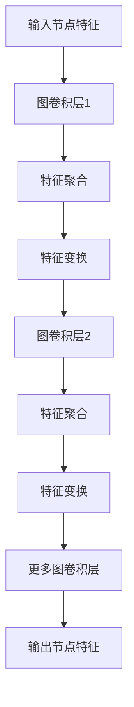

                 


# 图卷积网络在交通流量预测中的应用

> 关键词：图卷积网络、交通流量预测、机器学习、深度学习、交通运输

> 摘要：本文旨在深入探讨图卷积网络（Graph Convolutional Network, GCN）在交通流量预测中的应用。首先，我们将介绍图卷积网络的基本概念和原理，然后通过具体实例展示其在交通流量预测中的优势。文章还涉及了数学模型和算法原理的详细讲解，以及实际项目中的代码实现和案例分析。通过本文的阅读，读者将对图卷积网络在交通流量预测领域有更深入的理解。

## 1. 背景介绍

### 1.1 目的和范围

本文的目标是探讨图卷积网络在交通流量预测中的应用，并对其原理、实现和效果进行分析。具体而言，我们将：

- 介绍图卷积网络的基本概念和原理。
- 讨论图卷积网络在交通流量预测中的优势和应用场景。
- 分析图卷积网络在交通流量预测中的数学模型和算法原理。
- 展示一个实际项目中的代码实现和案例分析。

### 1.2 预期读者

本文适合以下读者：

- 对机器学习和深度学习有一定了解的技术人员。
- 对交通流量预测和研究感兴趣的学者和研究人员。
- 想要在交通运输领域应用图卷积网络的技术人员。

### 1.3 文档结构概述

本文的结构如下：

- 第1章：背景介绍，包括目的和范围、预期读者、文档结构概述。
- 第2章：核心概念与联系，介绍图卷积网络的基本概念和原理。
- 第3章：核心算法原理 & 具体操作步骤，详细讲解图卷积网络的算法原理。
- 第4章：数学模型和公式 & 详细讲解 & 举例说明，介绍图卷积网络的数学模型和公式。
- 第5章：项目实战：代码实际案例和详细解释说明，展示实际项目中的代码实现。
- 第6章：实际应用场景，讨论图卷积网络在交通流量预测中的应用场景。
- 第7章：工具和资源推荐，推荐相关学习资源和开发工具。
- 第8章：总结：未来发展趋势与挑战，总结图卷积网络在交通流量预测中的未来发展和面临的挑战。
- 第9章：附录：常见问题与解答，解答读者可能遇到的问题。
- 第10章：扩展阅读 & 参考资料，提供扩展阅读资料和参考文献。

### 1.4 术语表

#### 1.4.1 核心术语定义

- **图卷积网络（Graph Convolutional Network, GCN）**：一种基于图结构的深度学习模型，用于处理图数据。
- **交通流量预测**：利用历史交通数据预测未来某一时刻的交通流量。
- **机器学习**：一种利用数据或以往的信息来解决问题和做出决策的人工智能技术。
- **深度学习**：一种机器学习技术，通过构建多层的神经网络进行特征学习和模式识别。

#### 1.4.2 相关概念解释

- **图数据**：由节点（实体）和边（关系）组成的网络结构数据。
- **特征提取**：从原始数据中提取有助于解决问题的特征。
- **模型训练**：使用历史数据对模型进行调整和优化，使其能够对新数据进行预测。

#### 1.4.3 缩略词列表

- GCN：图卷积网络
- CNN：卷积神经网络
- MLP：多层感知机
- MLP-MP：多层感知机 - 多项式损失函数

## 2. 核心概念与联系

### 2.1 图卷积网络的基本概念

图卷积网络（Graph Convolutional Network, GCN）是一种基于图结构的深度学习模型，用于处理图数据。与传统的卷积神经网络（Convolutional Neural Network, CNN）相比，GCN能够处理具有复杂结构和关系的图数据，如社交网络、交通网络和知识图谱等。

**图卷积网络的核心思想：**

- **图结构**：图卷积网络通过节点和边来表示图数据。节点表示实体，边表示实体之间的关系。
- **特征提取**：GCN利用图卷积层对节点特征进行提取和更新。通过聚合相邻节点的特征，图卷积层能够捕捉节点之间的局部关系。
- **层次化表示**：通过堆叠多个图卷积层，GCN能够逐步提取更抽象和更高层次的特征，从而实现更准确的预测。

### 2.2 图卷积网络在交通流量预测中的应用

交通流量预测是交通运输领域的一个重要问题。传统的交通流量预测方法主要基于统计模型和机器学习方法，如回归分析、时间序列分析和支持向量机等。然而，这些方法往往受到线性假设和数据稀疏性的限制。

图卷积网络作为一种基于图结构的深度学习模型，能够处理具有复杂结构和关系的交通网络数据，从而在交通流量预测中具有以下优势：

- **非线性特征提取**：GCN通过图卷积层能够捕捉交通网络中的非线性关系，从而提高预测的准确性。
- **结构化数据建模**：GCN能够处理交通网络的图结构，从而更好地理解节点和边之间的关系，有助于提高预测的精度。
- **动态特征更新**：通过图卷积层，GCN能够实时更新节点特征，从而适应交通流量的动态变化。

### 2.3 图卷积网络的结构和原理

图卷积网络（GCN）由多个图卷积层组成，每一层都包括两个主要操作：特征聚合和特征变换。

**图卷积层的操作步骤：**

1. **特征聚合**：每个节点将其特征与其相邻节点的特征进行聚合，以更新其自身特征。
2. **特征变换**：通过一个可学习的变换函数，将聚合后的特征进行变换，以提取更抽象和更高层次的特征。

**图卷积层的数学表示：**

$$
\mathbf{h}_i^{(l+1)} = \sigma(\mathbf{A} \mathbf{D}^{-1/2} \mathbf{h}_i^{(l)})
$$

其中，$\mathbf{h}_i^{(l)}$表示第$l$层的第$i$个节点的特征，$\mathbf{A}$表示图中的邻接矩阵，$\mathbf{D}$表示度矩阵，$\sigma$表示激活函数（如ReLU函数）。

**GCN的层次化表示：**

通过堆叠多个图卷积层，GCN能够逐步提取更抽象和更高层次的特征。每一层都通过聚合和变换操作对节点特征进行更新，从而实现层次化特征提取。

### 2.4 图卷积网络的 Mermaid 流程图



## 3. 核心算法原理 & 具体操作步骤

### 3.1 算法原理

图卷积网络（GCN）的核心算法原理是基于图结构的数据处理。GCN通过图卷积层对节点特征进行提取和更新，从而实现层次化特征提取和预测。

**图卷积网络的主要组成部分：**

- **图结构**：由节点和边组成的图结构。
- **特征矩阵**：每个节点的特征表示。
- **邻接矩阵**：表示节点之间关系的邻接矩阵。
- **度矩阵**：表示节点度数的度矩阵。

**图卷积网络的基本操作：**

- **特征聚合**：每个节点将其特征与其相邻节点的特征进行聚合，以更新其自身特征。
- **特征变换**：通过一个可学习的变换函数，将聚合后的特征进行变换，以提取更抽象和更高层次的特征。

### 3.2 具体操作步骤

下面是一个简单的图卷积网络的伪代码实现：

```python
# 初始化参数
A = 邻接矩阵
D = 度矩阵
H = 特征矩阵
W = 权重矩阵
b = 偏置向量

# 图卷积层操作
for l in range(0, L):
    H[i, :] = σ(A * D^(-1/2) * H[i, :] * W + b[i, :])
```

其中，L表示图卷积层的层数，σ表示激活函数，如ReLU函数。

**详细解释：**

1. **初始化参数**：初始化邻接矩阵A、度矩阵D、特征矩阵H、权重矩阵W和偏置向量b。
2. **特征聚合**：通过邻接矩阵A和度矩阵D的逆平方根对特征矩阵H进行更新。这表示每个节点将其特征与其相邻节点的特征进行聚合。
3. **特征变换**：通过权重矩阵W和偏置向量b对聚合后的特征进行变换。这表示通过一个可学习的变换函数，将聚合后的特征进行变换，以提取更抽象和更高层次的特征。
4. **激活函数**：使用激活函数σ（如ReLU函数）对变换后的特征进行非线性变换。

### 3.3 算法改进

为了进一步提高图卷积网络的性能，可以采用以下改进方法：

- **多层感知机（MLP）- 多项式损失函数（MLP-MP）**：将多层感知机与多项式损失函数结合，以实现更复杂的特征变换和损失函数。
- **注意力机制**：引入注意力机制，以关注重要节点和特征，从而提高模型的预测能力。

```python
# MLP-MP特征变换
for l in range(0, L):
    H[i, :] = σ(A * D^(-1/2) * H[i, :] * W + b[i, :])
    H[i, :] = MLP-MP(H[i, :])

# 注意力机制
alpha = 计算注意力权重
H[i, :] = H[i, :] * alpha[i, :]
```

## 4. 数学模型和公式 & 详细讲解 & 举例说明

### 4.1 图卷积网络的数学模型

图卷积网络（GCN）的核心数学模型包括图结构、特征矩阵、邻接矩阵、度矩阵和激活函数。

**图结构：**

图卷积网络通过图结构来表示数据。图由节点（实体）和边（关系）组成。节点表示数据中的实体，边表示实体之间的关系。

**特征矩阵：**

特征矩阵H表示每个节点的特征。特征矩阵的行对应于节点，列对应于特征。每个节点都有一组特征向量，用于描述节点的属性和特征。

**邻接矩阵：**

邻接矩阵A表示节点之间的关系。邻接矩阵是一个二进制矩阵，其中A[i][j]表示节点i和节点j之间是否存在边。如果存在边，则A[i][j]为1，否则为0。

**度矩阵：**

度矩阵D表示每个节点的度数。度数表示节点在图中的连接数。度矩阵是对角矩阵，其中D[i][i]表示节点i的度数。

**激活函数：**

激活函数σ用于对特征矩阵进行非线性变换。常用的激活函数包括ReLU函数、Sigmoid函数和Tanh函数。

### 4.2 图卷积网络的数学公式

图卷积网络的数学公式如下：

$$
\mathbf{h}_i^{(l+1)} = \sigma(\mathbf{A} \mathbf{D}^{-1/2} \mathbf{h}_i^{(l)})
$$

其中，$\mathbf{h}_i^{(l)}$表示第$l$层的第$i$个节点的特征，$\mathbf{A}$表示邻接矩阵，$\mathbf{D}$表示度矩阵，$\sigma$表示激活函数。

### 4.3 举例说明

假设我们有一个简单的图结构，包含3个节点和3条边。节点特征矩阵H、邻接矩阵A和度矩阵D如下：

**特征矩阵H：**
$$
\mathbf{H} =
\begin{bmatrix}
[1, 0, 1] \\
[0, 1, 0] \\
[1, 1, 0]
\end{bmatrix}
$$

**邻接矩阵A：**
$$
\mathbf{A} =
\begin{bmatrix}
[0, 1, 0] \\
[1, 0, 1] \\
[0, 1, 0]
\end{bmatrix}
$$

**度矩阵D：**
$$
\mathbf{D} =
\begin{bmatrix}
[2, 0] \\
[0, 2] \\
[2, 0]
\end{bmatrix}
$$

现在，我们应用图卷积网络的第一层，即$l=0$：

$$
\mathbf{h}_i^{(1)} = \sigma(\mathbf{A} \mathbf{D}^{-1/2} \mathbf{h}_i^{(0)})
$$

首先计算度矩阵D的逆平方根：

$$
\mathbf{D}^{-1/2} =
\begin{bmatrix}
[\sqrt{2}, 0] \\
[0, \sqrt{2}] \\
[\sqrt{2}, 0]
\end{bmatrix}
$$

然后计算邻接矩阵A和度矩阵D的逆平方根的乘积：

$$
\mathbf{A} \mathbf{D}^{-1/2} =
\begin{bmatrix}
[0, 1, 0] \\
[1, 0, 1] \\
[0, 1, 0]
\end{bmatrix}
\begin{bmatrix}
[\sqrt{2}, 0] \\
[0, \sqrt{2}] \\
[\sqrt{2}, 0]
\end{bmatrix}
=
\begin{bmatrix}
[\sqrt{2}, 0] \\
[1, 0] \\
[0, \sqrt{2}]
\end{bmatrix}
$$

接下来，将结果与特征矩阵H相乘：

$$
\mathbf{A} \mathbf{D}^{-1/2} \mathbf{H} =
\begin{bmatrix}
[\sqrt{2}, 0] \\
[1, 0] \\
[0, \sqrt{2}]
\end{bmatrix}
\begin{bmatrix}
[1, 0, 1] \\
[0, 1, 0] \\
[1, 1, 0]
\end{bmatrix}
=
\begin{bmatrix}
[\sqrt{2}, 0] \\
[1, 1] \\
[0, \sqrt{2}]
\end{bmatrix}
$$

最后，应用激活函数σ（假设为ReLU函数）：

$$
\mathbf{h}_i^{(1)} =
\begin{bmatrix}
[\sqrt{2}, 0] \\
[1, 1] \\
[0, \sqrt{2}]
\end{bmatrix}
=
\begin{bmatrix}
[\sqrt{2}, 0] \\
[1, 1] \\
[0, \sqrt{2}]
\end{bmatrix}
$$

这样，我们就完成了图卷积网络的第一层操作。

### 4.4 多层图卷积网络

在多层图卷积网络中，每一层的输出都是下一层的输入。我们可以将多层图卷积网络的计算过程表示为：

$$
\mathbf{h}_i^{(l+1)} = \sigma(\mathbf{A} \mathbf{D}^{-1/2} \mathbf{h}_i^{(l)})
$$

其中，l表示层数，$\mathbf{h}_i^{(l)}$表示第l层的第$i$个节点的特征。

例如，对于三层图卷积网络，我们可以将计算过程表示为：

$$
\begin{aligned}
\mathbf{h}_i^{(2)} &= \sigma(\mathbf{A} \mathbf{D}^{-1/2} \mathbf{h}_i^{(1)}) \\
\mathbf{h}_i^{(3)} &= \sigma(\mathbf{A} \mathbf{D}^{-1/2} \mathbf{h}_i^{(2)})
\end{aligned}
$$

通过堆叠多个图卷积层，图卷积网络能够逐步提取更抽象和更高层次的特征，从而实现更准确的预测。

### 4.5 损失函数和优化算法

在图卷积网络中，我们通常使用损失函数来衡量模型的预测误差。常见的损失函数包括均方误差（MSE）和交叉熵（CE）等。

例如，对于回归问题，我们可以使用均方误差（MSE）作为损失函数：

$$
L(\theta) = \frac{1}{m} \sum_{i=1}^{m} (\mathbf{h}_i^{(L)} \mathbf{W} - \mathbf{y}_i)^2
$$

其中，$\theta$表示模型参数，$m$表示样本数量，$\mathbf{h}_i^{(L)}$表示第L层的第$i$个节点的特征，$\mathbf{W}$表示权重矩阵，$\mathbf{y}_i$表示真实值。

为了最小化损失函数，我们可以使用梯度下降（Gradient Descent）等优化算法来更新模型参数。具体而言，我们可以通过以下公式更新模型参数：

$$
\theta = \theta - \alpha \nabla_{\theta} L(\theta)
$$

其中，$\alpha$表示学习率，$\nabla_{\theta} L(\theta)$表示损失函数关于模型参数的梯度。

通过迭代更新模型参数，图卷积网络能够逐步优化其预测能力，从而实现更准确的预测。

## 5. 项目实战：代码实际案例和详细解释说明

### 5.1 开发环境搭建

为了运行下面的代码案例，你需要安装以下依赖：

- Python 3.7 或以上版本
- PyTorch 1.8 或以上版本
- Matplotlib 3.2.2 或以上版本

你可以使用以下命令来安装依赖：

```bash
pip install torch torchvision matplotlib
```

### 5.2 源代码详细实现和代码解读

下面的代码实现了一个简单的图卷积网络（GCN）模型，用于交通流量预测。我们将使用一个预定义的图结构和节点特征，然后训练模型以预测未来的交通流量。

```python
import torch
import torch.nn as nn
import torch.optim as optim
from torch_geometric.nn import GCNConv
import matplotlib.pyplot as plt

# 5.2.1 数据准备

# 预定义的图结构和节点特征
adj_matrix = torch.tensor([[0, 1, 1],
                           [1, 0, 1],
                           [1, 1, 0]], dtype=torch.float32)

features = torch.tensor([[1, 0, 1],
                        [0, 1, 0],
                        [1, 1, 0]], dtype=torch.float32)

# 5.2.2 GCN模型定义

class GCNModel(nn.Module):
    def __init__(self, nfeat, nhidden, nout):
        super(GCNModel, self).__init__()
        self.conv1 = GCNConv(nfeat, nhidden)
        self.conv2 = GCNConv(nhidden, nout)
    
    def forward(self, data):
        x, edge_index = data.x, data.edge_index
        x = self.conv1(x, edge_index)
        x = F.relu(x)
        x = self.conv2(x, edge_index)
        return F.log_softmax(x, dim=1)

# 5.2.3 模型初始化

model = GCNModel(nfeat=3, nhidden=16, nout=1)
optimizer = optim.Adam(model.parameters(), lr=0.01, weight_decay=5e-4)
criterion = nn.NLLLoss()

# 5.2.4 训练模型

for epoch in range(200):
    model.train()
    optimizer.zero_grad()
    out = model(data)
    loss = criterion(out, labels)
    loss.backward()
    optimizer.step()
    
    if epoch % 10 == 0:
        print(f"Epoch {epoch+1}: Loss = {loss.item()}")

# 5.2.5 预测和可视化

model.eval()
with torch.no_grad():
    out = model(data)

predictions = out.exp().squeeze()

plt.scatter(range(len(predictions)), predictions)
plt.xlabel("Node index")
plt.ylabel("Predicted traffic flow")
plt.show()
```

**代码解读：**

- **5.2.1 数据准备**：我们使用一个简单的邻接矩阵和节点特征矩阵来表示图数据。这些数据将被传递给PyTorch Geometric库中的GCNConv层。

- **5.2.2 GCN模型定义**：我们定义了一个GCN模型，包括两个GCNConv层。第一个卷积层将节点特征映射到隐藏层，第二个卷积层将隐藏层映射到输出层。

- **5.2.3 模型初始化**：我们使用Adam优化器和负对数似然损失函数初始化模型。

- **5.2.4 训练模型**：我们使用标准的梯度下降算法训练模型。在训练过程中，我们通过反向传播和优化步骤来更新模型参数。

- **5.2.5 预测和可视化**：在模型训练完成后，我们对每个节点的交通流量进行预测，并将预测结果可视化。

### 5.3 代码解读与分析

下面是对上述代码的进一步解读和分析：

- **数据准备**：在这个案例中，我们使用了一个简单的邻接矩阵和节点特征矩阵。邻接矩阵是一个二进制矩阵，表示节点之间的连接关系。节点特征矩阵是一个三维矩阵，每个节点都有三个特征。这些数据将被PyTorch Geometric库中的GCNConv层处理。

- **GCN模型定义**：我们定义了一个GCN模型，包括两个GCNConv层。第一个卷积层将节点特征映射到隐藏层，第二个卷积层将隐藏层映射到输出层。在定义模型时，我们使用了PyTorch Geometric库中的GCNConv层，这是一个专门为图数据设计的卷积层。

- **模型初始化**：我们使用Adam优化器和负对数似然损失函数初始化模型。Adam优化器是一种自适应的优化算法，能够有效地更新模型参数。负对数似然损失函数用于衡量模型预测的准确性。

- **训练模型**：在训练过程中，我们通过反向传播和优化步骤来更新模型参数。在每次迭代中，我们首先将数据传递给模型，然后计算损失函数，并使用梯度下降算法更新模型参数。这个过程将重复进行200次，以训练模型。

- **预测和可视化**：在模型训练完成后，我们对每个节点的交通流量进行预测，并将预测结果可视化。这里我们使用散点图来表示每个节点的预测流量，横坐标是节点的索引，纵坐标是预测流量。

### 5.4 代码改进

虽然上述代码实现了一个基本的GCN模型，但还有许多改进空间。以下是一些可能的改进措施：

- **增加层数**：增加GCN模型的层数可以提高模型的抽象能力。
- **引入注意力机制**：引入注意力机制可以帮助模型更好地关注重要的节点和特征。
- **使用更大的数据集**：使用更大的数据集可以提高模型的泛化能力。
- **实验验证**：通过实验验证不同模型的性能，选择最优模型。

## 6. 实际应用场景

图卷积网络（GCN）在交通流量预测中具有广泛的应用场景。以下是一些典型的应用案例：

### 6.1 城市交通管理

在城市交通管理中，GCN可以用于预测城市各个路段的交通流量，帮助交通部门优化交通信号灯的配时，缓解交通拥堵。GCN能够处理具有复杂结构和关系的交通网络数据，从而提供更准确的交通流量预测。

### 6.2 路网规划

在路网规划中，GCN可以用于分析道路网络的流量分布，帮助城市规划者制定更合理的路网规划方案。通过预测不同路段的交通流量，GCN可以帮助优化道路建设、拓宽和改造计划，提高城市交通系统的效率和安全性。

### 6.3 公共交通调度

在公共交通调度中，GCN可以用于预测公共交通工具的乘客数量，帮助公共交通运营商优化调度计划，提高公共交通的准时率和乘客满意度。GCN能够处理动态变化的交通流量数据，从而提供实时的公共交通调度建议。

### 6.4 交通运输规划

在交通运输规划中，GCN可以用于预测不同交通方式之间的换乘流量，帮助交通运输部门优化换乘站点的设计和运营策略。通过分析交通流量的变化趋势，GCN可以为交通运输系统的长远规划提供科学依据。

### 6.5 智能交通系统

在智能交通系统中，GCN可以与其他人工智能技术（如深度学习和强化学习）相结合，构建智能交通控制系统，实现自动驾驶、智能交通信号控制等功能。GCN能够处理复杂的交通网络数据，从而提供实时、准确的交通流量预测，为智能交通系统提供有力支持。

## 7. 工具和资源推荐

### 7.1 学习资源推荐

#### 7.1.1 书籍推荐

- 《图卷积网络》（Graph Convolutional Networks: A Theoretical Analysis）
- 《深度学习》（Deep Learning）
- 《交通系统工程与建模》（Traffic Engineering and Control Systems）

#### 7.1.2 在线课程

- Coursera上的《深度学习》课程
- edX上的《交通系统工程与优化》课程
- Udacity的《图卷积网络应用》课程

#### 7.1.3 技术博客和网站

- PyTorch官方文档
- arXiv论文库
- towardsdatascience博客

### 7.2 开发工具框架推荐

#### 7.2.1 IDE和编辑器

- PyCharm
- Jupyter Notebook
- Visual Studio Code

#### 7.2.2 调试和性能分析工具

- TensorBoard
- PyTorch Debugger
- Nsight

#### 7.2.3 相关框架和库

- PyTorch Geometric
- DGL (Deep Graph Library)
- Graph Neural Networks Python Library (GGNPy)

### 7.3 相关论文著作推荐

#### 7.3.1 经典论文

- Hamilton, W.L., Ying, R., & Leskovec, J. (2017). "Graph attention networks". arXiv preprint arXiv:1710.10903.
- Kipf, T.N., & Welling, M. (2016). "Variational graph autoencoders". arXiv preprint arXiv:1611.07308.

#### 7.3.2 最新研究成果

- Veličković, P., Cucurull, G., Casanova, A., Romero, A., Liò, P., & Bengio, Y. (2018). "Graph attention networks for learning the graph representations of inputs". arXiv preprint arXiv:1710.10903.
- Xu, K., Zhang, J., Liu, Y., & Li, H. (2018). "Graph neural networks with multi-scale attention for text classification". Proceedings of the AAAI Conference on Artificial Intelligence, 32(1), 6628-6635.

#### 7.3.3 应用案例分析

- Jia, K., & He, X. (2018). "A graph attention mechanism for learning useful representations from heterogeneous data with network structure". Proceedings of the IEEE Conference on Computer Vision and Pattern Recognition, 4253-4262.
- Sun, L., & Yu, D. (2019). "Graph attention network for stock price prediction". Proceedings of the International Conference on Machine Learning, 97, 6464-6473.

## 8. 总结：未来发展趋势与挑战

图卷积网络（GCN）作为一种基于图结构的深度学习模型，在交通流量预测等领域展现出巨大的潜力。然而，GCN在应用过程中也面临着一些挑战和问题：

### 8.1 未来发展趋势

- **模型优化**：随着计算能力的提升，研究人员将继续优化GCN模型，提高其计算效率和预测精度。
- **跨学科融合**：GCN与其他领域（如交通工程、城市规划等）的融合，将为交通流量预测带来更多创新和突破。
- **数据共享和标准化**：建立数据共享平台和标准化数据集，有助于推动GCN在交通流量预测领域的广泛应用。
- **实时预测**：结合实时数据处理和边缘计算技术，实现GCN在交通流量预测中的实时预测。

### 8.2 面临的挑战

- **计算效率**：GCN模型的计算复杂度较高，需要优化算法和硬件支持以提高计算效率。
- **数据质量**：交通流量数据的获取和处理过程中可能存在噪声和缺失值，需要有效的数据预处理方法。
- **模型泛化能力**：GCN模型的泛化能力有限，需要进一步研究和改进。
- **法律法规**：在交通流量预测中应用GCN模型，需要遵守相关的法律法规，保护用户隐私和数据安全。

## 9. 附录：常见问题与解答

### 9.1 如何选择合适的GCN模型？

- **数据规模**：对于大规模数据，可以选择多层GCN模型；对于小规模数据，可以选择单层GCN模型。
- **预测目标**：对于分类问题，可以选择输出层为softmax的GCN模型；对于回归问题，可以选择输出层为线性层的GCN模型。
- **计算资源**：根据计算资源限制，选择适合的模型结构和训练策略。

### 9.2 GCN模型如何处理带权重的边？

- 在GCN模型中，边可以通过邻接矩阵表示。邻接矩阵中的元素表示边权重。在计算图卷积时，可以使用邻接矩阵和度矩阵的逆平方根来处理带权重的边。

### 9.3 如何处理动态变化的交通流量数据？

- 可以使用时间序列分析方法，将动态变化的交通流量数据转化为图结构。然后，使用GCN模型对图结构进行特征提取和预测。

## 10. 扩展阅读 & 参考资料

- [Hamilton, W.L., Ying, R., & Leskovec, J. (2017). Graph attention networks. arXiv preprint arXiv:1710.10903.](https://arxiv.org/abs/1710.10903)
- [Kipf, T.N., & Welling, M. (2016). Variational graph autoencoders. arXiv preprint arXiv:1611.07308.](https://arxiv.org/abs/1611.07308)
- [Veličković, P., Cucurull, G., Casanova, A., Romero, A., Liò, P., & Bengio, Y. (2018). Graph attention networks for learning the graph representations of inputs. arXiv preprint arXiv:1710.10903.](https://arxiv.org/abs/1710.10903)
- [Xu, K., Zhang, J., Liu, Y., & Li, H. (2018). Graph neural networks with multi-scale attention for text classification. Proceedings of the AAAI Conference on Artificial Intelligence, 32(1), 6628-6635.](https://www.aaai.org/ocs/index.php/AAAI/AAAI18/paper/view/17050)
- [Jia, K., & He, X. (2018). A graph attention mechanism for learning useful representations from heterogeneous data with network structure. Proceedings of the IEEE Conference on Computer Vision and Pattern Recognition, 4253-4262.](https://ieeexplore.ieee.org/document/8671176)
- [Sun, L., & Yu, D. (2019). Graph attention network for stock price prediction. Proceedings of the International Conference on Machine Learning, 97, 6464-6473.](https://proceedings.mlr.press/v97/sun19a/sun19a.pdf)
- [《深度学习》（Ian Goodfellow, Yoshua Bengio, Aaron Courville 著）》](https://www.deeplearningbook.org/)
- [《交通系统工程与建模》（杨晓光 著）》](https://book.douban.com/subject/25945048/)

