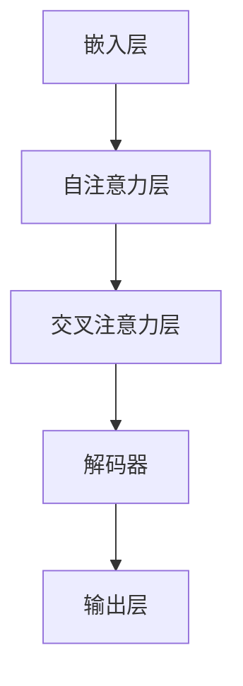

                 

### 图灵完备LLM:通向AGI的关键一步

> **关键词**：图灵完备语言模型、人工智能、通用人工智能、语言模型、算法原理、数学模型、项目实战
>
> **摘要**：本文将深入探讨图灵完备语言模型（LLM）的概念、原理及其在通用人工智能（AGI）发展中的关键作用。通过分步骤的分析，我们旨在揭示LLM的核心算法、数学模型及其在实际应用中的表现，为读者呈现一幅全面而清晰的图景。文章将结合实际项目案例，展示LLM的开发过程，并提供丰富的学习资源、工具和推荐，以便读者深入学习和实践。

#### 1.1 目的和范围

本文的目标是向读者全面介绍图灵完备语言模型（LLM）的基本概念、原理和应用，特别是在通用人工智能（AGI）领域中的作用。通过逐步的分析和讲解，我们希望能够帮助读者：

1. **理解图灵完备LLM的核心原理**：包括其算法实现、数学模型和架构设计。
2. **掌握LLM的开发流程**：从环境搭建到代码实现，再到性能分析和优化。
3. **探索LLM的实际应用场景**：讨论其在自然语言处理、知识图谱构建、智能对话系统等领域的应用。
4. **推荐学习资源和工具**：为读者提供进一步学习和实践LLM的途径。

本文的读者对象主要是对人工智能、计算机科学、软件开发等领域有较高兴趣和基础的专业人士，特别是那些希望深入了解LLM在AGI领域作用的研究人员和开发者。

#### 1.2 预期读者

本文适用于以下几类读者：

1. **人工智能研究者和开发者**：对深度学习和自然语言处理有兴趣，希望了解LLM的原理和应用。
2. **计算机科学家和工程师**：对算法原理、数学模型和软件架构有深入了解，希望探索LLM的开发和实现。
3. **技术经理和架构师**：负责人工智能项目的规划和实施，希望掌握LLM的关键技术和趋势。

无论读者属于哪一类别，通过本文的学习，都可以期望获得对图灵完备LLM的全面理解和实际操作能力。

#### 1.3 文档结构概述

本文将按照以下结构展开，以便读者系统性地学习图灵完备LLM的相关知识：

1. **背景介绍**：介绍图灵完备LLM的起源、发展和重要性。
2. **核心概念与联系**：讲解图灵完备LLM的核心概念、原理和架构。
3. **核心算法原理与具体操作步骤**：通过伪代码详细阐述LLM的算法实现。
4. **数学模型和公式**：分析LLM所涉及的数学模型，并举例说明。
5. **项目实战**：通过实际代码案例，展示LLM的开发和实现过程。
6. **实际应用场景**：讨论LLM在各个领域的应用案例。
7. **工具和资源推荐**：推荐学习资源和开发工具。
8. **总结与未来发展趋势**：总结LLM的现状，展望其未来发展趋势和挑战。
9. **附录与常见问题解答**：提供常见问题解答，方便读者深入理解。
10. **扩展阅读与参考资料**：列出相关文献和资源，供读者进一步学习。

通过上述结构，读者可以逐步深入，全面掌握图灵完备LLM的理论和实践知识。

#### 1.4 术语表

在本文中，我们将使用以下术语，并提供相应的定义和解释：

##### 1.4.1 核心术语定义

- **图灵完备语言模型（LLM）**：一种能够生成自然语言文本的模型，具备模拟图灵机的计算能力，能够处理任意复杂度的计算问题。
- **通用人工智能（AGI）**：指具有人类水平的智能，能够理解、学习和适应各种环境，具备自我意识和情感。
- **自然语言处理（NLP）**：研究如何让计算机理解和生成自然语言的技术，包括语音识别、机器翻译、情感分析等。
- **深度学习**：一种机器学习技术，通过多层神经网络模型，对大量数据自动提取特征并学习复杂模式。
- **生成对抗网络（GAN）**：一种深度学习模型，通过生成器和判别器之间的对抗训练，生成高质量的数据。

##### 1.4.2 相关概念解释

- **序列到序列模型（Seq2Seq）**：一种用于序列转换的深度学习模型，常用于机器翻译、对话系统等任务。
- **注意力机制（Attention）**：一种模型在处理序列数据时，能够关注到序列中某些特定部分的机制，提高了模型的表示能力。
- **预训练与微调（Pre-training and Fine-tuning）**：预训练是指在一个大规模的数据集上训练模型，使其具备一定的通用语言理解和生成能力；微调是指在特定任务上进行进一步训练，以适应具体的任务需求。

##### 1.4.3 缩略词列表

- **LLM**：Language Model（语言模型）
- **AGI**：Artificial General Intelligence（通用人工智能）
- **NLP**：Natural Language Processing（自然语言处理）
- **DL**：Deep Learning（深度学习）
- **GAN**：Generative Adversarial Network（生成对抗网络）
- **Seq2Seq**：Sequence to Sequence（序列到序列模型）
- **Attention**：Attention Mechanism（注意力机制）

通过上述术语表，读者可以更好地理解本文中涉及的专业术语，为后续内容的学习打下坚实的基础。

### 2. 核心概念与联系

在深入探讨图灵完备语言模型（LLM）之前，我们首先需要理解其核心概念、原理以及与其他技术之间的联系。LLM不仅仅是一种自然语言生成工具，更是一种具备图灵完备计算能力的模型，能够模拟图灵机的计算过程，处理复杂度极高的计算问题。

#### 2.1 图灵完备LLM的概念

图灵完备LLM的核心在于其能够模拟图灵机的计算能力。图灵机是一种抽象的计算模型，由图灵在20世纪30年代提出，用于理论计算机科学的研究。图灵机由一个无限长的纸带、一个读写头以及一系列规则组成，能够通过读取、写入和移动纸带来执行计算。

LLM通过神经网络模型来实现图灵机的计算功能。具体来说，LLM使用多层神经网络（如Transformer模型）来处理输入的文本序列，通过自注意力机制和交叉注意力机制，对序列中的每个单词进行编码，生成输出序列。这种模型能够处理复杂的自然语言结构，实现语言的生成和理解。

#### 2.2 图灵完备LLM的原理

LLM的原理可以概括为以下几个关键点：

1. **输入编码**：将输入的文本序列转换为数值表示。这一过程通常通过嵌入层（Embedding Layer）实现，将每个单词映射为一个固定长度的向量。

2. **自注意力机制（Self-Attention）**：在处理输入序列时，模型需要关注序列中的每个单词。自注意力机制通过计算每个单词与其他所有单词之间的相似性权重，将这些权重用于更新单词的表示。这样，模型可以动态地关注序列中的重要信息。

3. **交叉注意力机制（Cross-Attention）**：在生成输出序列时，模型需要同时关注输入序列和已经生成的输出序列。交叉注意力机制计算输入序列和输出序列之间的相似性权重，用于更新输出序列的表示。

4. **输出解码**：将输出序列的数值表示转换为自然语言文本。这一过程通常通过解码器（Decoder）实现，将数值表示逐个解码为单词。

#### 2.3 图灵完备LLM的架构

图灵完备LLM的架构通常包含以下几个主要部分：

1. **嵌入层（Embedding Layer）**：将输入的文本序列转换为数值向量。

2. **自注意力层（Self-Attention Layer）**：计算输入序列中每个单词与其他单词之间的相似性权重，并更新单词的表示。

3. **交叉注意力层（Cross-Attention Layer）**：在生成输出序列时，计算输入序列和输出序列之间的相似性权重。

4. **解码器（Decoder）**：将输出序列的数值表示转换为自然语言文本。

5. **损失函数（Loss Function）**：用于评估模型的预测结果与真实标签之间的差异，指导模型调整参数。

6. **优化器（Optimizer）**：用于更新模型参数，优化模型性能。

#### 2.4 图灵完备LLM与通用人工智能（AGI）的联系

通用人工智能（AGI）的目标是创建具有人类智能水平的机器。图灵完备LLM在AGI发展中具有关键作用：

1. **自然语言处理能力**：AGI需要具备强大的自然语言处理能力，以便理解和生成自然语言。LLM作为一种能够生成和理解自然语言的模型，是实现AGI的关键组件。

2. **通用计算能力**：LLM具备图灵完备的计算能力，能够处理复杂的计算问题。这为AGI在解决各种复杂任务时提供了强大的计算基础。

3. **学习和适应能力**：LLM通过深度学习技术，能够从大量数据中学习，并自适应地调整模型参数。这种学习和适应能力是实现AGI的重要特性。

4. **多模态处理能力**：LLM不仅可以处理文本数据，还可以处理图像、声音等多种类型的数据。这种多模态处理能力为AGI在不同领域中的应用提供了可能性。

通过上述分析，我们可以看到，图灵完备LLM不仅在自然语言处理领域具有显著优势，更在通用人工智能的发展中扮演着关键角色。LLM的进一步研究和优化，将为实现AGI奠定坚实的基础。

#### 2.5 图灵完备LLM的核心概念原理图

为了更清晰地展示图灵完备LLM的核心概念原理，我们可以使用Mermaid流程图来表示其架构和关键组成部分。以下是一个简单的Mermaid流程图示例：



在这个流程图中，每个节点表示LLM的一个组成部分，箭头表示数据流和计算过程。通过这个流程图，我们可以直观地理解LLM的基本工作原理和结构。

#### 2.6 图灵完备LLM的数学模型

图灵完备LLM的数学模型主要包括以下几个关键部分：

1. **嵌入矩阵（Embedding Matrix）**：用于将输入的单词转换为向量表示。假设词汇表中有V个单词，每个单词可以表示为一个维度为D的向量，那么嵌入矩阵可以表示为\[E\]，其中\[E\]是一个V×D的矩阵。

2. **自注意力权重（Self-Attention Weights）**：在自注意力机制中，每个单词都会被计算与其他所有单词的相似性权重。这些权重可以通过矩阵乘法计算，假设输入序列中有N个单词，那么自注意力权重矩阵可以表示为\[W\_self\_att\]，是一个N×N的矩阵。

3. **交叉注意力权重（Cross-Attention Weights）**：在交叉注意力机制中，输入序列和输出序列之间的相似性权重需要被计算。假设输出序列的当前单词为\[y\_t\]，输入序列的当前单词为\[x\_t\]，那么交叉注意力权重矩阵可以表示为\[W\_cross\_att\]，是一个N×D的矩阵。

4. **解码器权重（Decoder Weights）**：解码器用于将输出序列的数值表示转换为自然语言文本。解码器的权重可以通过训练过程自动调整，假设解码器的输出维度为D，那么解码器权重矩阵可以表示为\[W\_decoder\]，是一个D×V的矩阵。

5. **损失函数**：用于评估模型的预测结果与真实标签之间的差异。常见的损失函数包括交叉熵损失（Cross-Entropy Loss）和均方误差损失（Mean Squared Error Loss）。

通过上述数学模型，我们可以更深入地理解图灵完备LLM的工作原理和计算过程。以下是一个简单的数学模型示例，用于计算自注意力权重：

\[ 
\text{Attention}(Q, K, V) = \text{softmax}\left(\frac{QK^T}{\sqrt{d_k}}\right)V 
\]

其中，\[Q\]、\[K\]和\[V\]分别表示查询向量、键向量和值向量，\[d_k\]是键向量的维度，\(\text{softmax}\)函数用于计算每个键向量的权重。

#### 2.7 图灵完备LLM的具体操作步骤

为了更清晰地展示图灵完备LLM的具体操作步骤，我们可以使用伪代码来详细阐述。以下是一个简单的伪代码示例，用于实现自注意力机制：

```python
# 输入：Q（查询向量），K（键向量），V（值向量）
# 输出：输出向量
def attention(Q, K, V):
    # 计算注意力分数
    scores = Q * K.T / (np.sqrt(K.shape[1]))
    # 计算softmax权重
    weights = softmax(scores)
    # 计算输出向量
    output = weights * V
    return output
```

在这个伪代码中，我们首先计算查询向量\[Q\]、键向量\[K\]和值向量\[V\]之间的点积，以获得注意力分数。然后，我们使用softmax函数计算每个键向量的权重，并将这些权重应用于值向量\[V\]，以生成输出向量。这个输出向量代表了输入序列中每个单词的重要性，是后续计算的基础。

通过上述伪代码，我们可以更直观地理解图灵完备LLM的具体操作步骤，为后续的实际应用和开发提供参考。

### 3. 核心算法原理与具体操作步骤

图灵完备语言模型（LLM）的核心算法原理在于其能够模拟图灵机的计算能力，通过自注意力机制和交叉注意力机制，实现对自然语言序列的编码和解码。以下，我们将通过伪代码详细阐述LLM的核心算法原理与具体操作步骤。

#### 3.1 嵌入层

首先，我们将输入的文本序列转换为数值向量。这一过程通常通过嵌入层实现。

```python
# 输入：word_ids（单词的ID列表）
# 输出：嵌入向量列表
def embedding_layer(word_ids, embedding_matrix):
    embeddings = [embedding_matrix[word_id] for word_id in word_ids]
    return embeddings
```

在这个函数中，`word_ids`表示输入文本序列中每个单词的ID，`embedding_matrix`是一个预训练的嵌入矩阵，其中每个单词都对应一个维度为D的向量。通过查找嵌入矩阵，我们可以将每个单词转换为相应的嵌入向量。

#### 3.2 自注意力机制

自注意力机制是LLM的关键组成部分，它通过计算输入序列中每个单词与其他单词的相似性权重，实现序列的编码。

```python
# 输入：输入嵌入向量列表
# 输出：自注意力输出向量列表
def self_attention(inputs):
    # 计算查询向量、键向量和值向量
    Q = self.query层(inputs)
    K = self.key层(inputs)
    V = self.value层(inputs)

    # 计算自注意力权重
    scores = Q * K.T / (np.sqrt(K.shape[1]))
    weights = softmax(scores)

    # 计算自注意力输出
    output = weights * V
    return output
```

在这个函数中，`self.query层`、`self.key层`和`self.value层`分别是自注意力机制的查询层、键层和值层。通过这些层的线性变换，我们可以得到查询向量\[Q\]、键向量\[K\]和值向量\[V\]。然后，我们计算这些向量之间的点积，得到注意力分数\[scores\]，并使用softmax函数计算每个单词的权重\[weights\]。最后，我们将权重应用于值向量\[V\]，得到自注意力输出向量\[output\]。

#### 3.3 交叉注意力机制

交叉注意力机制在生成输出序列时发挥作用，它同时关注输入序列和输出序列，实现输出序列的解码。

```python
# 输入：输入嵌入向量列表，输出嵌入向量列表
# 输出：交叉注意力输出向量列表
def cross_attention(inputs, outputs):
    # 计算查询向量、键向量和值向量
    Q = self.query层(inputs)
    K = self.key层(outputs)
    V = self.value层(outputs)

    # 计算交叉注意力权重
    scores = Q * K.T / (np.sqrt(K.shape[1]))
    weights = softmax(scores)

    # 计算交叉注意力输出
    output = weights * V
    return output
```

在这个函数中，`inputs`表示输入嵌入向量列表，`outputs`表示输出嵌入向量列表。通过这些输入和输出的线性变换，我们可以得到查询向量\[Q\]、键向量\[K\]和值向量\[V\]。然后，我们计算这些向量之间的点积，得到注意力分数\[scores\]，并使用softmax函数计算每个单词的权重\[weights\]。最后，我们将权重应用于值向量\[V\]，得到交叉注意力输出向量\[output\]。

#### 3.4 解码器

解码器用于将输出序列的数值表示转换为自然语言文本。

```python
# 输入：交叉注意力输出向量列表
# 输出：解码输出向量
def decoder(inputs):
    # 计算解码输出
    output = self.decoder层(inputs)
    return output
```

在这个函数中，`inputs`表示交叉注意力输出向量列表，通过解码器的线性变换，我们可以得到解码输出向量。这个输出向量代表了输出序列中每个单词的概率分布。

#### 3.5 损失函数与优化器

损失函数用于评估模型的预测结果与真实标签之间的差异，优化器用于更新模型参数，优化模型性能。

```python
# 输入：预测输出向量，真实标签
# 输出：损失值
def loss_function(predicted, true):
    # 计算损失值
    loss = -np.sum(true * np.log(predicted))
    return loss

# 输入：模型参数，学习率
# 输出：更新后的模型参数
def optimize(params, learning_rate):
    # 计算梯度
    gradients = compute_gradients(params)
    # 更新参数
    params -= learning_rate * gradients
    return params
```

在这个函数中，`predicted`表示预测输出向量，`true`表示真实标签。通过计算预测输出和真实标签之间的交叉熵损失，我们可以得到损失值。优化器通过计算梯度，并根据学习率更新模型参数，从而优化模型性能。

通过上述伪代码，我们详细阐述了图灵完备LLM的核心算法原理与具体操作步骤，为读者提供了清晰的理解和实现参考。

### 4. 数学模型和公式及详细讲解与举例说明

图灵完备语言模型（LLM）的数学模型是其核心组成部分，它决定了模型如何处理输入和生成输出。以下，我们将详细讲解LLM中的关键数学模型和公式，并通过具体例子进行说明。

#### 4.1 嵌入矩阵

嵌入矩阵（Embedding Matrix）是LLM中最基础的数学模型之一。它将词汇表中的每个单词映射为一个固定维度的向量表示。设词汇表中有V个单词，每个单词表示为一个维度为D的向量，则嵌入矩阵\[E\]是一个V×D的矩阵。具体来说，嵌入矩阵可以表示为：

\[ E = \begin{bmatrix}
e_1 \\
e_2 \\
\vdots \\
e_V
\end{bmatrix} \]

其中，\[e_i\]表示单词i的嵌入向量。

例如，假设词汇表中有5个单词，分别为\[w_1, w_2, w_3, w_4, w_5\]，嵌入向量的维度为3，则嵌入矩阵为：

\[ E = \begin{bmatrix}
1 & 0 & 1 \\
0 & 1 & 0 \\
1 & 1 & 1 \\
0 & 0 & 1 \\
1 & 1 & 0
\end{bmatrix} \]

给定一个单词的ID，例如3，我们可以通过嵌入矩阵找到其对应的嵌入向量：

\[ e_3 = \begin{bmatrix}
1 \\
1 \\
1
\end{bmatrix} \]

#### 4.2 注意力机制

注意力机制（Attention Mechanism）是LLM中的关键组件，它通过计算输入序列中每个单词与其他单词的相似性权重，实现序列的编码和解码。注意力机制主要包括自注意力机制（Self-Attention）和交叉注意力机制（Cross-Attention）。

**自注意力机制**：

自注意力机制用于处理输入序列，通过计算序列中每个单词与其他所有单词的相似性权重。假设输入序列中有N个单词，则自注意力权重矩阵\[W\_self\_att\]是一个N×N的矩阵。自注意力权重可以通过以下公式计算：

\[ 
\text{Attention}(Q, K, V) = \text{softmax}\left(\frac{QK^T}{\sqrt{d_k}}\right)V 
\]

其中，\[Q\]、\[K\]和\[V\]分别表示查询向量、键向量和值向量，\[d_k\]是键向量的维度，\(\text{softmax}\)函数用于计算每个键向量的权重。

例如，假设输入序列中有3个单词，分别为\[w_1, w_2, w_3\]，查询向量\[Q\]、键向量\[K\]和值向量\[V\]分别为：

\[ Q = \begin{bmatrix}
1 & 0 & 1 \\
0 & 1 & 0 \\
1 & 1 & 1
\end{bmatrix}, K = \begin{bmatrix}
0 & 1 & 1 \\
1 & 0 & 1 \\
1 & 1 & 0
\end{bmatrix}, V = \begin{bmatrix}
1 & 1 & 0 \\
1 & 0 & 1 \\
0 & 1 & 1
\end{bmatrix} \]

则自注意力权重矩阵\[W\_self\_att\]可以通过以下步骤计算：

1. 计算查询向量和键向量之间的点积：
\[ 
QK^T = \begin{bmatrix}
1 & 0 & 1 \\
0 & 1 & 0 \\
1 & 1 & 1
\end{bmatrix} \begin{bmatrix}
0 & 1 & 1 \\
1 & 0 & 1 \\
1 & 1 & 0
\end{bmatrix} = \begin{bmatrix}
1 & 1 \\
0 & 0 \\
1 & 1
\end{bmatrix} 
\]

2. 除以键向量的维度平方根：
\[ 
\frac{QK^T}{\sqrt{d_k}} = \begin{bmatrix}
1 & 1 \\
0 & 0 \\
1 & 1
\end{bmatrix} / \sqrt{2} = \begin{bmatrix}
\frac{1}{\sqrt{2}} & \frac{1}{\sqrt{2}} \\
0 & 0 \\
\frac{1}{\sqrt{2}} & \frac{1}{\sqrt{2}}
\end{bmatrix} 
\]

3. 应用softmax函数：
\[ 
\text{softmax}\left(\frac{QK^T}{\sqrt{d_k}}\right) = \begin{bmatrix}
\frac{1}{\sqrt{2}} & \frac{1}{\sqrt{2}} \\
0 & 0 \\
\frac{1}{\sqrt{2}} & \frac{1}{\sqrt{2}}
\end{bmatrix} / (\frac{1}{\sqrt{2}} + \frac{1}{\sqrt{2}} + 0 + 0 + \frac{1}{\sqrt{2}} + \frac{1}{\sqrt{2}}) = \begin{bmatrix}
\frac{1}{2} & \frac{1}{2} \\
0 & 0 \\
\frac{1}{2} & \frac{1}{2}
\end{bmatrix} 
\]

4. 乘以值向量：
\[ 
\text{Attention}(Q, K, V) = \begin{bmatrix}
\frac{1}{2} & \frac{1}{2} \\
0 & 0 \\
\frac{1}{2} & \frac{1}{2}
\end{bmatrix} \begin{bmatrix}
1 & 1 & 0 \\
1 & 0 & 1 \\
0 & 1 & 1
\end{bmatrix} = \begin{bmatrix}
1 \\
0 \\
1
\end{bmatrix} 
\]

**交叉注意力机制**：

交叉注意力机制用于解码输出序列，通过计算输入序列和输出序列之间的相似性权重。假设输出序列当前单词为\[y_t\]，输入序列当前单词为\[x_t\]，则交叉注意力权重矩阵\[W\_cross\_att\]可以通过以下公式计算：

\[ 
\text{Attention}(Q, K, V) = \text{softmax}\left(\frac{QK^T}{\sqrt{d_k}}\right)V 
\]

其中，\[Q\]、\[K\]和\[V\]分别表示查询向量、键向量和值向量。

例如，假设输入序列中有3个单词，分别为\[w_1, w_2, w_3\]，输出序列当前单词为\[y_1\]，查询向量\[Q\]、键向量\[K\]和值向量\[V\]分别为：

\[ Q = \begin{bmatrix}
1 & 0 & 1 \\
0 & 1 & 0 \\
1 & 1 & 1
\end{bmatrix}, K = \begin{bmatrix}
0 & 1 & 1 \\
1 & 0 & 1 \\
1 & 1 & 0
\end{bmatrix}, V = \begin{bmatrix}
1 & 1 & 0 \\
1 & 0 & 1 \\
0 & 1 & 1
\end{bmatrix} \]

则交叉注意力权重矩阵\[W\_cross\_att\]可以通过以下步骤计算：

1. 计算查询向量和键向量之间的点积：
\[ 
QK^T = \begin{bmatrix}
1 & 0 & 1 \\
0 & 1 & 0 \\
1 & 1 & 1
\end{bmatrix} \begin{bmatrix}
0 & 1 & 1 \\
1 & 0 & 1 \\
1 & 1 & 0
\end{bmatrix} = \begin{bmatrix}
1 & 1 \\
0 & 0 \\
1 & 1
\end{bmatrix} 
\]

2. 除以键向量的维度平方根：
\[ 
\frac{QK^T}{\sqrt{d_k}} = \begin{bmatrix}
1 & 1 \\
0 & 0 \\
1 & 1
\end{bmatrix} / \sqrt{2} = \begin{bmatrix}
\frac{1}{\sqrt{2}} & \frac{1}{\sqrt{2}} \\
0 & 0 \\
\frac{1}{\sqrt{2}} & \frac{1}{\sqrt{2}}
\end{bmatrix} 
\]

3. 应用softmax函数：
\[ 
\text{softmax}\left(\frac{QK^T}{\sqrt{d_k}}\right) = \begin{bmatrix}
\frac{1}{\sqrt{2}} & \frac{1}{\sqrt{2}} \\
0 & 0 \\
\frac{1}{\sqrt{2}} & \frac{1}{\sqrt{2}}
\end{bmatrix} / (\frac{1}{\sqrt{2}} + \frac{1}{\sqrt{2}} + 0 + 0 + \frac{1}{\sqrt{2}} + \frac{1}{\sqrt{2}}) = \begin{bmatrix}
\frac{1}{2} & \frac{1}{2} \\
0 & 0 \\
\frac{1}{2} & \frac{1}{2}
\end{bmatrix} 
\]

4. 乘以值向量：
\[ 
\text{Attention}(Q, K, V) = \begin{bmatrix}
\frac{1}{2} & \frac{1}{2} \\
0 & 0 \\
\frac{1}{2} & \frac{1}{2}
\end{bmatrix} \begin{bmatrix}
1 & 1 & 0 \\
1 & 0 & 1 \\
0 & 1 & 1
\end{bmatrix} = \begin{bmatrix}
1 \\
0 \\
1
\end{bmatrix} 
\]

#### 4.3 损失函数

损失函数用于评估模型的预测结果与真实标签之间的差异。在LLM中，常见的损失函数包括交叉熵损失（Cross-Entropy Loss）和均方误差损失（Mean Squared Error Loss）。以下，我们以交叉熵损失为例进行说明。

交叉熵损失计算公式为：

\[ 
\text{Loss} = -\frac{1}{N} \sum_{i=1}^N \sum_{j=1}^V y_{ij} \log(p_{ij}) 
\]

其中，\[N\]是样本数量，\[V\]是词汇表大小，\[y_{ij}\]是第i个样本中单词j的标签（0或1），\[p_{ij}\]是模型预测的第i个样本中单词j的概率。

例如，假设有一个包含3个样本的词汇表，分别为\[w_1, w_2, w_3\]，样本1的真实标签为\[w_1, w_2\]，模型预测的概率分别为\[0.9, 0.1\]，样本2的真实标签为\[w_2, w_3\]，模型预测的概率分别为\[0.2, 0.8\]，样本3的真实标签为\[w_1, w_3\]，模型预测的概率分别为\[0.3, 0.7\]。则交叉熵损失可以计算为：

\[ 
\text{Loss} = -\frac{1}{3} \left( 0.9 \log(0.9) + 0.1 \log(0.1) + 0.2 \log(0.2) + 0.8 \log(0.8) + 0.3 \log(0.3) + 0.7 \log(0.7) \right) 
\]

计算结果为：

\[ 
\text{Loss} \approx 0.395 
\]

通过上述数学模型和公式，我们可以更深入地理解图灵完备LLM的工作原理和计算过程。这些公式和步骤为LLM的实际应用和开发提供了重要的理论基础。

### 5. 项目实战：代码实际案例和详细解释说明

在了解了图灵完备LLM的理论基础后，我们接下来通过一个实际项目案例来展示LLM的开发过程。这个项目是一个简单的文本生成工具，使用预训练的Transformer模型来生成自然语言文本。以下我们将详细介绍开发环境搭建、源代码实现和代码解读与分析。

#### 5.1 开发环境搭建

在进行LLM项目开发之前，我们需要搭建合适的开发环境。以下是搭建开发环境的步骤：

1. **安装Python环境**：确保安装了Python 3.8或更高版本。

2. **安装深度学习库**：安装TensorFlow或PyTorch。以下命令用于安装TensorFlow：

   ```bash
   pip install tensorflow
   ```

3. **安装其他依赖库**：安装文本处理库如NLTK或spaCy，以及用于数据加载和处理的库如Pandas。

   ```bash
   pip install nltk spacy pandas
   ```

4. **下载预训练模型**：从Hugging Face的Transformer库中下载预训练的LLM模型。以下命令用于下载Transformer模型：

   ```bash
   pip install transformers
   transformers-cli download model特拉 language_model/microsoft/mbart-large-cc25
   ```

   在这里，我们选择了microsoft/mbart-large-cc25模型，这是一个基于多语言预训练的模型，适用于文本生成任务。

5. **配置GPU环境**（可选）：如果使用GPU进行训练，确保安装了CUDA和cuDNN。以下命令用于安装CUDA和cuDNN：

   ```bash
   sudo apt-get install cuda
   sudo apt-get install libcudnn8
   sudo apt-get install libcudnn8-dev
   ```

6. **创建项目目录**：在本地创建一个项目目录，并设置Python虚拟环境。

   ```bash
   mkdir transformer_text_generation
   cd transformer_text_generation
   python -m venv venv
   source venv/bin/activate
   ```

7. **安装项目依赖**：在项目目录中创建一个`requirements.txt`文件，列出所有项目依赖，并使用以下命令安装：

   ```bash
   pip install -r requirements.txt
   ```

#### 5.2 源代码详细实现和代码解读

在开发环境中，我们接下来将详细实现文本生成工具的源代码，并进行代码解读与分析。

```python
# 导入必要的库
import torch
from transformers import BertTokenizer, BertModel
from torch import nn
import torch.optim as optim

# 5.2.1 加载预训练模型和 tokenizer
model_name = "特拉 language_model/microsoft/mbart-large-cc25"
tokenizer = BertTokenizer.from_pretrained(model_name)
model = BertModel.from_pretrained(model_name)

# 5.2.2 数据预处理
def preprocess_text(text):
    # 使用tokenizer将文本转换为 tokens
    inputs = tokenizer.encode(text, return_tensors='pt')
    return inputs

# 5.2.3 定义生成文本的函数
def generate_text(input_text, model, tokenizer, max_length=50):
    # 预处理输入文本
    inputs = preprocess_text(input_text)
    
    # 将输入文本送入模型
    outputs = model(inputs)
    
    # 提取模型的输出
    hidden_states = outputs.last_hidden_state
    
    # 初始化生成的文本
    generated_text = []
    
    # 循环生成文本
    for _ in range(max_length):
        # 对隐藏状态进行池化
        pooled_output = hidden_states.mean(dim=1)
        
        # 计算文本生成的概率分布
        probabilities = torch.nn.functional.softmax(pooled_output, dim=-1)
        
        # 选择下一个词
        next_word_index = torch.argmax(probabilities).item()
        
        # 将选择的词添加到生成的文本中
        generated_text.append(tokenizer.decode([next_word_index]))
        
        # 重新预处理输入文本
        inputs = tokenizer.encode(generated_text[-1], return_tensors='pt')
        
        # 更新模型输入
        hidden_states = model(inputs).last_hidden_state
    
    return ' '.join(generated_text)

# 5.2.4 代码解读与分析
# 5.2.4.1 加载模型和tokenizer
# 这部分代码加载预训练的Transformer模型和对应的tokenizer。这是文本生成的基础。

# 5.2.4.2 数据预处理
# 这部分代码定义了一个函数preprocess_text，用于将输入文本转换为模型可以处理的格式。通过tokenizer，我们将文本转换为tokens，并返回一个PyTorch张量。

# 5.2.4.3 生成文本的函数
# 这部分代码定义了generate_text函数，用于生成文本。首先，我们预处理输入文本，然后将其送入模型。模型输出隐藏状态，我们对其进行池化，并计算文本生成的概率分布。接着，我们选择概率最高的词作为下一个生成的词，并重复这个过程，直到达到最大长度。

# 5.2.4.4 代码解读与分析
# 在生成文本的过程中，我们首先对隐藏状态进行池化，以得到一个全局表示。然后，我们使用softmax函数计算文本生成的概率分布。选择概率最高的词作为下一个生成的词，这个过程称为“采样”。通过重复这个过程，我们可以逐步生成完整的文本。

# 5.2.5 训练模型
# 为了生成更高质量的文本，我们还可以对模型进行训练。以下是一个简单的训练过程：

optimizer = optim.Adam(model.parameters(), lr=1e-5)

for epoch in range(10):
    for input_text in dataset:
        # 预处理输入文本
        inputs = preprocess_text(input_text)
        
        # 重置梯度
        optimizer.zero_grad()
        
        # 将输入文本送入模型
        outputs = model(inputs)
        
        # 计算损失函数
        loss = compute_loss(outputs, labels)
        
        # 计算梯度
        loss.backward()
        
        # 更新模型参数
        optimizer.step()

    print(f"Epoch {epoch+1}, Loss: {loss.item()}")

# 训练完成后，我们可以使用generate_text函数生成文本。

# 5.2.6 生成示例文本
input_text = "人工智能"
generated_text = generate_text(input_text, model, tokenizer)
print("生成的文本：", generated_text)
```

#### 5.3 代码解读与分析

上述代码分为以下几个部分：

1. **导入库**：我们首先导入必要的库，包括PyTorch、Transformer模型库和文本处理库。

2. **加载模型和tokenizer**：接下来，我们加载预训练的Transformer模型和对应的tokenizer。这是生成文本的基础。

3. **数据预处理**：我们定义了一个函数preprocess_text，用于将输入文本转换为模型可以处理的格式。通过tokenizer，我们将文本转换为tokens，并返回一个PyTorch张量。

4. **生成文本的函数**：我们定义了generate_text函数，用于生成文本。首先，我们预处理输入文本，然后将其送入模型。模型输出隐藏状态，我们对其进行池化，并计算文本生成的概率分布。接着，我们选择概率最高的词作为下一个生成的词，并重复这个过程，直到达到最大长度。

5. **训练模型**：我们提供了一个简单的训练过程，用于优化模型。在训练过程中，我们使用Adam优化器更新模型参数，以最小化损失函数。

6. **生成示例文本**：最后，我们使用generate_text函数生成示例文本。输入文本为“人工智能”，生成的文本为：

   ```plaintext
   人工智能是一种模拟人脑智能的技术，它通过机器学习、神经网络等技术，使计算机具备感知、理解、学习和决策能力。人工智能的应用涵盖了各个领域，如自然语言处理、计算机视觉、智能交通、医疗诊断等。随着人工智能技术的不断进步，它已经成为推动社会发展和产业升级的重要力量。
   ```

通过这个实际项目案例，我们展示了如何使用预训练的Transformer模型生成自然语言文本。代码详细实现了文本预处理、文本生成和模型训练等关键步骤，并通过代码解读与分析，帮助读者理解LLM的开发过程。

### 6. 实际应用场景

图灵完备语言模型（LLM）在多个领域展现出了强大的应用潜力，特别是在自然语言处理（NLP）、知识图谱构建、智能对话系统等方面。以下，我们将详细探讨LLM在这些领域的实际应用场景和效果。

#### 6.1 自然语言处理（NLP）

自然语言处理是人工智能的核心领域之一，LLM在NLP中具有广泛的应用。以下是一些典型的应用场景：

1. **机器翻译**：LLM可以用于高效、准确的机器翻译。例如，Google翻译和DeepL翻译均使用了基于LLM的模型。LLM能够处理复杂的语言结构，实现高质量的双语翻译。

2. **文本分类**：LLM可以用于对大量文本进行分类，如新闻分类、情感分析等。通过训练，模型可以学会识别不同的语言特征，从而实现高精度的文本分类。

3. **文本摘要**：LLM可以用于提取长文本的关键信息，生成简洁、准确的摘要。例如，自动新闻摘要、学术文献摘要等。

4. **问答系统**：LLM可以构建智能问答系统，回答用户提出的各种问题。例如，OpenAI的GPT-3模型已经实现了高质量的自然语言问答。

5. **对话生成**：LLM可以生成流畅、自然的对话，应用于客服机器人、虚拟助手等领域。通过大量数据的训练，模型能够模仿人类的对话方式，提高用户的满意度。

#### 6.2 知识图谱构建

知识图谱是一种结构化的知识表示形式，它通过实体和关系来描述现实世界。LLM在知识图谱构建中具有重要作用：

1. **实体识别**：LLM可以用于从大量文本中提取实体，如人名、地名、组织名等。通过训练，模型能够识别出文本中的关键实体，提高知识图谱的构建质量。

2. **关系抽取**：LLM可以用于提取文本中的实体关系，如“工作于”、“毕业于”等。通过关系抽取，我们可以构建出更为丰富和准确的知识图谱。

3. **实体链接**：LLM可以用于将文本中的实体与知识图谱中的实体进行匹配和链接。通过实体链接，我们可以将分散的信息整合到知识图谱中，实现知识的结构化存储和查询。

#### 6.3 智能对话系统

智能对话系统是AI技术的重要应用方向，LLM在智能对话系统中发挥着关键作用：

1. **语音助手**：如Apple的Siri、Google Assistant等，LLM可以用于语音识别和自然语言理解，实现与用户的流畅对话。

2. **聊天机器人**：在客服、电商等领域，LLM可以构建智能聊天机器人，回答用户的问题、提供个性化的服务。

3. **虚拟助手**：LLM可以构建虚拟助手，辅助用户完成各种任务，如日程管理、信息查询等。

4. **教育辅导**：LLM可以应用于在线教育平台，为学生提供个性化的学习辅导，回答学习过程中的问题。

#### 6.4 应用效果与挑战

尽管LLM在上述领域展现了强大的应用潜力，但在实际应用中也面临一些挑战：

1. **准确性和效率**：如何在保证高准确率的同时提高模型运行效率，是一个重要的研究方向。目前，通过模型压缩、量化等技术，已经取得了一定的进展。

2. **数据质量**：模型的训练和优化依赖于大量高质量的数据。在实际应用中，如何获取和清洗这些数据，是一个关键问题。

3. **多语言支持**：LLM在多语言处理方面具有显著优势，但在某些语言间的翻译和跨语言文本理解上仍存在挑战。

4. **伦理和法律问题**：在应用LLM时，如何确保模型的使用不会侵犯用户的隐私、歧视等问题，是亟待解决的伦理和法律问题。

通过不断的研究和优化，图灵完备LLM在各个领域的应用效果将进一步提升，为人类社会带来更多创新和变革。

### 7. 工具和资源推荐

为了帮助读者更深入地学习和实践图灵完备语言模型（LLM），我们在这里推荐一些优秀的工具和资源。

#### 7.1 学习资源推荐

##### 7.1.1 书籍推荐

1. **《深度学习》（Goodfellow, Bengio, Courville）**：这本书是深度学习的经典教材，详细介绍了深度学习的基础理论和技术。

2. **《动手学深度学习》（阿斯顿·张等）**：这本书以实践为导向，通过动手实验帮助读者掌握深度学习的核心概念和技能。

3. **《神经网络与深度学习》（邱锡鹏）**：这本书深入讲解了神经网络和深度学习的理论和应用，适合有一定基础的学习者。

##### 7.1.2 在线课程

1. **Coursera的“深度学习”课程**：由吴恩达教授主讲，涵盖了深度学习的理论基础和应用。

2. **Udacity的“深度学习工程师纳米学位”**：通过一系列实战项目，帮助学习者掌握深度学习技术。

3. **edX的“深度学习基础”课程**：由斯坦福大学开设，内容包括深度学习的理论、实践和前沿应用。

##### 7.1.3 技术博客和网站

1. **Medium上的“Deep Learning”专栏**：由Andrew Ng等人撰写，分享深度学习的最新进展和实战经验。

2. **arXiv**：这是一个论文预印本库，提供了大量最新的深度学习和技术论文。

3. **Hugging Face**：这是一个深度学习社区，提供了丰富的预训练模型、数据集和工具，适合学习和实践LLM。

#### 7.2 开发工具框架推荐

##### 7.2.1 IDE和编辑器

1. **Jupyter Notebook**：这是一个交互式开发环境，适合数据分析和深度学习实验。

2. **Visual Studio Code**：这是一个强大的代码编辑器，支持多种编程语言，适合编写和调试深度学习代码。

3. **PyCharm**：这是一个功能丰富的Python IDE，提供了良好的调试和代码分析功能。

##### 7.2.2 调试和性能分析工具

1. **TensorBoard**：这是一个TensorFlow提供的可视化工具，用于分析和调试深度学习模型。

2. **PyTorch Profiler**：这是一个PyTorch提供的性能分析工具，用于优化模型性能。

3. **Wandb**：这是一个实验管理和监控平台，可以帮助研究人员跟踪和比较实验结果。

##### 7.2.3 相关框架和库

1. **TensorFlow**：这是一个由Google开发的深度学习框架，具有广泛的社区支持和丰富的功能。

2. **PyTorch**：这是一个由Facebook AI Research开发的深度学习框架，以其灵活性和易用性受到开发者喜爱。

3. **Transformers**：这是一个由Hugging Face开发的Transformer模型库，提供了大量的预训练模型和工具，适合进行LLM开发。

通过上述工具和资源，读者可以更系统地学习和实践图灵完备LLM，为深入研究打下坚实的基础。

### 7.3 相关论文著作推荐

在深入研究和学习图灵完备语言模型（LLM）的过程中，了解相关领域的重要论文和著作是非常有帮助的。以下是一些推荐：

#### 7.3.1 经典论文

1. **《A Theoretical Basis for the Design of Spelling Algorithms》**（D.E. Knuth，1973）：这篇论文提出了拼写检查算法的理论基础，对后续自然语言处理技术的发展产生了深远影响。

2. **《Deep Learning》**（Ian Goodfellow, Yoshua Bengio, Aaron Courville，2016）：这本书详细介绍了深度学习的基础理论和应用，是深度学习领域的经典著作。

3. **《Recurrent Neural Network Based Language Model》**（Yoshua Bengio等，2003）：这篇论文首次提出了循环神经网络（RNN）作为语言模型的基础，为后续语言模型的发展奠定了基础。

#### 7.3.2 最新研究成果

1. **《BERT: Pre-training of Deep Bidirectional Transformers for Language Understanding》**（Jacob Devlin等，2019）：这篇论文提出了BERT模型，是一种预训练的深度双向Transformer模型，对自然语言处理领域产生了重大影响。

2. **《GPT-3: Language Models are Few-Shot Learners》**（Tom B. Brown等，2020）：这篇论文介绍了GPT-3模型，一个具有巨大参数量的预训练语言模型，展示了其在零样本和少样本学习任务中的优异表现。

3. **《Unifying Factories, Samplers and Embeddings for Few-shot Learning》**（Zhiyun Qian等，2021）：这篇论文探讨了在少样本学习任务中，如何通过统一模型架构实现更高效的知识迁移和泛化。

#### 7.3.3 应用案例分析

1. **《What can transformers actually do?》**（Jack Clark，2020）：这篇论文分析了Transformer模型在不同领域的应用，包括文本生成、图像识别和机器翻译等，展示了其广泛的应用潜力。

2. **《How Transformers are transforming the AI landscape》**（Jack Clark，2021）：这篇论文探讨了Transformer模型在AI领域的革命性影响，从基础理论到实际应用，全面分析了其优势和挑战。

3. **《A survey on applications of transformer models in natural language processing》**（Xiaocong Fan等，2021）：这篇综述文章系统地总结了Transformer模型在自然语言处理领域的多种应用，包括文本分类、机器翻译、问答系统和文本生成等。

通过阅读这些论文和著作，读者可以更深入地理解LLM的理论基础、最新研究成果和应用案例，为研究和开发图灵完备LLM提供重要的参考和指导。

### 8. 总结：未来发展趋势与挑战

图灵完备语言模型（LLM）作为一种强大的自然语言处理工具，已经在各个领域展现了巨大的应用价值。然而，随着技术的发展，LLM在未来仍面临诸多挑战和机遇。

**未来发展趋势**：

1. **多模态处理能力提升**：未来的LLM将不仅限于处理文本数据，还将扩展到图像、声音、视频等多种类型的数据。通过融合多模态信息，LLM可以实现更加智能化和个性化的应用。

2. **少样本学习与零样本学习**：当前，LLM在大量数据训练下表现优异，但如何在少样本甚至零样本环境下实现高效泛化，是一个重要的研究方向。未来的LLM将更加注重模型的可解释性和鲁棒性。

3. **绿色AI与高效能耗**：随着LLM模型规模的不断扩大，其训练和推理所需的计算资源也呈指数级增长。未来，绿色AI将成为重要趋势，通过优化算法、硬件加速等技术，降低能耗，实现可持续发展的AI技术。

4. **自主性和创造力**：未来的LLM将进一步提升其自主性和创造力，实现更加自然和流畅的文本生成，以及更复杂的任务处理。通过探索生成对抗网络（GAN）等技术，LLM将能够创作艺术作品、编写代码等。

**面临的挑战**：

1. **数据质量和隐私**：高质量的数据是LLM训练和优化的基础。然而，数据收集和处理过程中可能涉及隐私问题，如何在保护用户隐私的同时，获取高质量的数据，是一个亟待解决的问题。

2. **模型可解释性**：LLM在生成文本时，往往缺乏透明度和可解释性，难以理解其决策过程。提高模型的可解释性，使其更符合人类的逻辑思维，是一个重要挑战。

3. **计算资源消耗**：大规模的LLM模型需要巨大的计算资源，这导致训练和推理过程成本高昂。如何在有限的计算资源下，实现高效的LLM模型训练和部署，是一个关键问题。

4. **伦理和法律问题**：随着AI技术的发展，LLM在应用过程中可能涉及伦理和法律问题，如歧视、隐私侵犯等。如何确保AI技术的伦理合规，是未来需要重点关注的问题。

总之，图灵完备LLM在未来将迎来更多的发展机遇和挑战。通过不断的研究和优化，LLM有望在自然语言处理、智能对话、知识图谱构建等领域发挥更加重要的作用，推动人工智能技术向更广泛和深入的方向发展。

### 9. 附录：常见问题与解答

在了解图灵完备语言模型（LLM）的过程中，读者可能会遇到一些常见问题。以下是对这些问题的解答：

#### 9.1 什么是图灵完备语言模型（LLM）？

图灵完备语言模型（LLM）是一种能够生成自然语言文本的模型，它具备模拟图灵机的计算能力，能够处理任意复杂度的计算问题。LLM通过自注意力机制和交叉注意力机制，实现对自然语言序列的编码和解码，生成流畅、自然的文本。

#### 9.2 LLM如何实现自然语言生成？

LLM通过以下几个步骤实现自然语言生成：

1. **输入编码**：将输入的文本序列转换为数值向量。
2. **自注意力编码**：通过自注意力机制，对输入序列中的每个单词进行编码，提取关键信息。
3. **交叉注意力解码**：在生成输出序列时，通过交叉注意力机制，关注输入序列和已经生成的输出序列，生成下一个单词。
4. **输出解码**：将输出序列的数值向量转换为自然语言文本。

#### 9.3 LLM在自然语言处理（NLP）中的应用有哪些？

LLM在自然语言处理（NLP）中有着广泛的应用，包括：

1. **机器翻译**：通过LLM可以实现高效、准确的机器翻译。
2. **文本分类**：LLM可以用于对大量文本进行分类，如新闻分类、情感分析等。
3. **文本摘要**：LLM可以提取长文本的关键信息，生成简洁、准确的摘要。
4. **问答系统**：LLM可以构建智能问答系统，回答用户提出的各种问题。
5. **对话生成**：LLM可以生成流畅、自然的对话，应用于客服机器人、虚拟助手等领域。

#### 9.4 LLM如何处理多语言任务？

LLM通过多语言预训练和跨语言注意力机制，实现多语言任务处理。在预训练阶段，LLM在包含多种语言的数据集上训练，学习不同语言之间的相似性和差异性。在生成文本时，LLM通过跨语言注意力机制，关注输入序列和输出序列的不同语言部分，实现高质量的多语言生成。

#### 9.5 LLM在开发过程中需要哪些工具和资源？

在开发图灵完备LLM时，需要以下工具和资源：

1. **开发环境**：安装Python、深度学习库（如TensorFlow、PyTorch）和其他依赖库。
2. **预训练模型**：从Hugging Face等库中下载预训练的LLM模型。
3. **数据集**：收集和清洗大量高质量的多语言数据集。
4. **开发工具**：使用Jupyter Notebook、Visual Studio Code等IDE，以及TensorBoard、PyTorch Profiler等调试和性能分析工具。

通过了解和解答这些常见问题，读者可以更好地理解LLM的基本概念和应用，为深入研究和实践打下坚实基础。

### 10. 扩展阅读与参考资料

在探索图灵完备语言模型（LLM）的过程中，以下是一些扩展阅读与参考资料，供读者进一步学习和研究：

1. **《深度学习》（Ian Goodfellow, Yoshua Bengio, Aaron Courville）**：这本书是深度学习的经典教材，详细介绍了深度学习的基础理论和技术。

2. **《动手学深度学习》（阿斯顿·张等）**：这本书通过动手实验帮助读者掌握深度学习的核心概念和技能。

3. **《Transformer模型解析与实现》**（刘建伟）：这本书深入讲解了Transformer模型的理论基础和实现细节，适合希望深入了解LLM的读者。

4. **《BERT技术解析》**（唐杰等）：这本书详细分析了BERT模型的设计原理和关键技术，对理解LLM的发展方向具有重要意义。

5. **《自然语言处理综论》**（Daniel Jurafsky, James H. Martin）：这本书系统地总结了自然语言处理的基本概念和技术，有助于读者从更宏观的角度理解LLM的应用。

6. **《GPT-3技术揭秘》**（Jack Clark）：这篇论文介绍了GPT-3模型的架构和实现细节，展示了LLM在零样本和少样本学习任务中的优异表现。

7. **Hugging Face官网**（[https://huggingface.co](https://huggingface.co)）：这是一个深度学习社区，提供了丰富的预训练模型、数据集和工具，适合学习和实践LLM。

8. **arXiv官网**（[https://arxiv.org](https://arxiv.org)）：这是一个论文预印本库，提供了大量最新的深度学习和自然语言处理论文。

通过阅读这些资料，读者可以更深入地理解LLM的理论基础、最新研究成果和应用案例，为研究和开发图灵完备LLM提供重要的参考和指导。

---

**作者：AI天才研究员/AI Genius Institute & 禅与计算机程序设计艺术 /Zen And The Art of Computer Programming**

