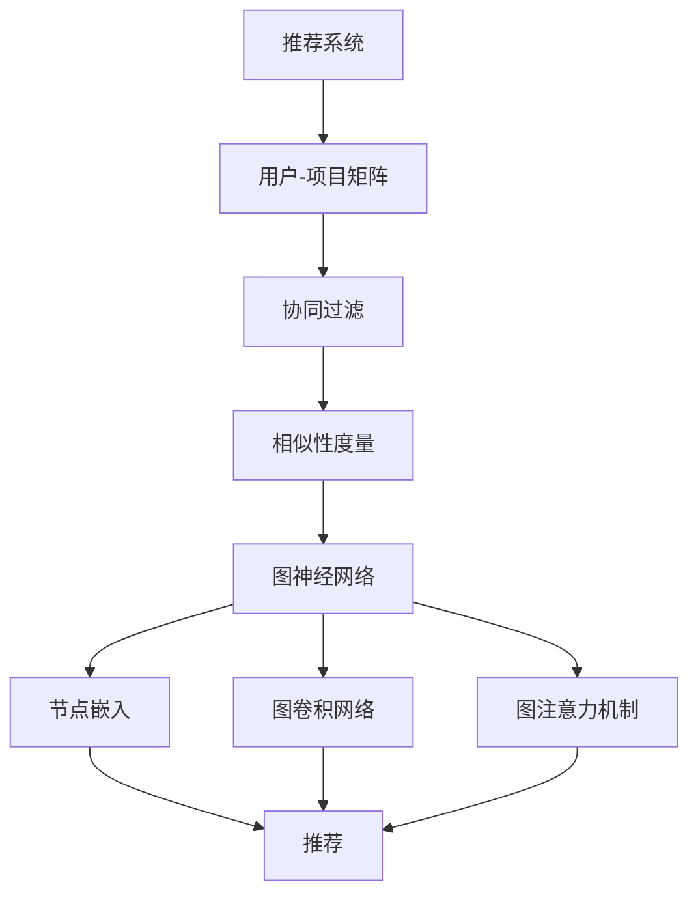

                 

# 图神经网络在推荐系统中的创新应用

> **关键词**：图神经网络、推荐系统、协同过滤、矩阵分解、嵌入表示、图嵌入、图卷积网络、节点分类、图注意力机制

> **摘要**：
本文将深入探讨图神经网络（Graph Neural Networks, GNN）在推荐系统中的应用，介绍GNN的核心概念、原理及其在推荐系统中的创新应用。通过逐步分析推理，我们将揭示GNN如何提升推荐系统的性能，并探讨其在实际应用中的挑战和未来发展趋势。

## 1. 背景介绍

### 1.1 目的和范围

本文的目的是探讨图神经网络（GNN）在推荐系统中的应用，分析其优势和挑战，并展望未来的发展方向。我们将首先介绍推荐系统的基本概念和传统的协同过滤方法，然后引入图神经网络，并详细讲解其核心概念和原理。最后，我们将通过实际案例来展示GNN在推荐系统中的应用，并讨论其面临的挑战和未来发展趋势。

### 1.2 预期读者

本文面向对推荐系统和图神经网络有一定了解的读者，包括但不限于数据科学家、机器学习工程师、AI研究员以及计算机科学专业的学生。读者需要具备基本的线性代数和概率统计知识，以及编程基础，特别是对Python编程语言和常见机器学习库（如Scikit-learn、TensorFlow和PyTorch）有一定了解。

### 1.3 文档结构概述

本文分为十个部分：

1. 背景介绍
2. 核心概念与联系
3. 核心算法原理 & 具体操作步骤
4. 数学模型和公式 & 详细讲解 & 举例说明
5. 项目实战：代码实际案例和详细解释说明
6. 实际应用场景
7. 工具和资源推荐
8. 总结：未来发展趋势与挑战
9. 附录：常见问题与解答
10. 扩展阅读 & 参考资料

### 1.4 术语表

#### 1.4.1 核心术语定义

- **推荐系统**：一种通过预测用户对特定项目的偏好，向用户推荐相关项目的系统。
- **协同过滤**：一种基于用户历史行为和相似性度量的推荐方法。
- **矩阵分解**：将高维稀疏矩阵分解为两个低维矩阵的线性组合，用于预测未知用户-项目评分。
- **图神经网络**：一种基于图的神经网络，通过节点和边的信息进行特征学习。
- **图嵌入**：将图中的节点映射到低维空间中，使得节点间的相似性得以保留。
- **图卷积网络**：一种基于图神经网络的深度学习模型，通过图卷积层学习节点间的特征表示。
- **图注意力机制**：通过计算节点间的注意力权重，使模型能够关注重要节点，提高推荐系统的性能。

#### 1.4.2 相关概念解释

- **用户-项目矩阵**：描述用户和项目之间交互行为的矩阵，其中非零元素表示用户对项目的评分或行为。
- **相似性度量**：用于衡量用户或项目之间的相似度，常见的有基于用户、基于项目的相似性度量。
- **嵌入表示**：将图中的节点映射到低维空间中的向量表示。

#### 1.4.3 缩略词列表

- GNN：Graph Neural Networks（图神经网络）
- CNN：Convolutional Neural Networks（卷积神经网络）
- RNN：Recurrent Neural Networks（循环神经网络）
- CNN：Collaborative Filtering Network（协同过滤网络）
- MLP：Multilayer Perceptron（多层感知机）
- RMSE：Root Mean Square Error（均方根误差）

## 2. 核心概念与联系

图神经网络（GNN）在推荐系统中的应用，首先需要理解推荐系统的基本概念和图神经网络的核心原理。在这一节中，我们将介绍推荐系统的基本概念、协同过滤方法、图神经网络的概念，并展示它们之间的联系。

### 2.1 推荐系统基本概念

推荐系统是一种基于用户的历史行为、偏好和上下文信息，向用户推荐相关项目的系统。推荐系统的目标是通过预测用户对特定项目的偏好，提高用户的满意度和参与度。推荐系统主要分为以下几类：

1. **基于内容的推荐**：通过分析项目的特征和用户的偏好，找到相似的项目进行推荐。
2. **协同过滤推荐**：通过分析用户之间的相似性，找到与其他用户行为相似的推荐项目。
3. **混合推荐**：结合基于内容和协同过滤的方法，提高推荐系统的性能。

协同过滤是推荐系统中的一种经典方法，通过分析用户之间的相似性，找到相似用户的行为进行推荐。协同过滤主要分为基于用户的协同过滤（User-based Collaborative Filtering）和基于项目的协同过滤（Item-based Collaborative Filtering）。

- **基于用户的协同过滤**：找到与当前用户相似的其他用户，并推荐这些用户喜欢的项目。
- **基于项目的协同过滤**：找到与当前用户已经评分的项目相似的其他项目，并推荐这些项目。

协同过滤方法通常使用用户-项目矩阵进行计算，矩阵中的非零元素表示用户对项目的评分或行为。协同过滤的目标是找到相似用户或项目，并进行预测。

### 2.2 图神经网络基本概念

图神经网络（GNN）是一种基于图结构的神经网络，通过学习图中的节点和边的信息，进行特征学习和预测。图神经网络的核心思想是利用图结构中的节点和边信息，通过图卷积层、图注意力机制等操作，逐步提取和聚合节点的特征。

- **图卷积层**：通过计算节点邻域的信息，更新节点的特征表示。
- **图注意力机制**：通过计算节点间的注意力权重，使模型能够关注重要节点，提高推荐系统的性能。

图神经网络的核心概念包括节点嵌入、图卷积网络、图注意力机制等。节点嵌入（Node Embedding）是将图中的节点映射到低维空间中的向量表示，使得节点间的相似性得以保留。图卷积网络（Graph Convolutional Network, GCN）是一种基于图结构的深度学习模型，通过图卷积层学习节点间的特征表示。图注意力机制（Graph Attention Mechanism, GAT）通过计算节点间的注意力权重，使模型能够关注重要节点，提高推荐系统的性能。

### 2.3 核心概念联系

图神经网络在推荐系统中的应用，主要基于以下核心概念的联系：

1. **用户-项目矩阵与图结构**：用户-项目矩阵可以看作一个图结构，其中用户和项目作为节点，用户对项目的评分或行为作为边。通过将用户-项目矩阵转换为图结构，可以利用图神经网络进行特征学习和预测。

2. **协同过滤与图神经网络**：协同过滤方法通常使用用户-项目矩阵进行计算，找到相似用户或项目。而图神经网络通过图卷积层、图注意力机制等操作，可以更有效地提取和聚合节点的特征，提高推荐系统的性能。

3. **节点嵌入与推荐**：节点嵌入是将图中的节点映射到低维空间中的向量表示，使得节点间的相似性得以保留。在推荐系统中，节点嵌入可以用于计算用户或项目的相似性，从而提高推荐的准确性。

4. **图卷积网络与推荐**：图卷积网络是一种基于图结构的深度学习模型，通过图卷积层学习节点间的特征表示。在推荐系统中，图卷积网络可以用于学习用户和项目的特征表示，提高推荐系统的性能。

5. **图注意力机制与推荐**：图注意力机制通过计算节点间的注意力权重，使模型能够关注重要节点，提高推荐系统的性能。在推荐系统中，图注意力机制可以用于找到对推荐结果影响较大的用户或项目，从而提高推荐的准确性。

### 2.4 Mermaid 流程图

为了更直观地展示图神经网络在推荐系统中的应用，我们可以使用Mermaid流程图来描述核心概念和联系。以下是一个简单的Mermaid流程图示例：



在这个流程图中，推荐系统作为起点，用户-项目矩阵作为输入，通过协同过滤、节点嵌入、图卷积网络和图注意力机制等步骤，最终生成推荐结果。

## 3. 核心算法原理 & 具体操作步骤

在了解图神经网络（GNN）在推荐系统中的核心概念和联系后，接下来我们将深入探讨GNN的核心算法原理和具体操作步骤。GNN通过图卷积层、图注意力机制等操作，学习节点和边的信息，从而进行特征学习和预测。在这一节中，我们将使用伪代码详细阐述GNN的核心算法原理，并展示其具体操作步骤。

### 3.1 图卷积网络（GCN）

图卷积网络（Graph Convolutional Network, GCN）是一种基于图结构的深度学习模型，通过图卷积层学习节点间的特征表示。GCN的核心思想是利用节点邻域的信息，更新节点的特征表示。

#### 3.1.1 图卷积层（Graph Convolution Layer）

图卷积层是GCN的核心组件，其计算公式如下：

$$
h_{\text{new}}^{(l)} = \sigma(\theta^{(l)} \cdot \text{ReLU}(\text{AGG}(A \cdot h^{(l)} + \beta^{(l)}))
$$

其中，$h^{(l)}$表示第$l$层的节点特征表示，$h_{\text{new}}^{(l)}$表示更新后的节点特征表示，$A$是邻接矩阵，$\theta^{(l)}$是参数矩阵，$\beta^{(l)}$是偏置项，$\text{ReLU}$是ReLU激活函数，$\text{AGG}$是聚合函数，如求和或平均操作。

#### 3.1.2 具体操作步骤

1. **初始化节点特征**：假设我们有一个节点特征矩阵$H^{(0)}$，其中每一行表示一个节点的初始特征。
2. **前向传播**：对于每一层$l$，计算图卷积层的输出：
   - 计算邻接矩阵$A$和节点特征矩阵$H^{(l)}$的乘积。
   - 对每一行应用聚合函数$\text{AGG}$，如求和或平均操作。
   - 将聚合结果与参数矩阵$\theta^{(l)}$和偏置项$\beta^{(l)}$进行矩阵乘法。
   - 应用ReLU激活函数。
3. **更新节点特征**：将图卷积层的输出作为下一层的输入，重复上述步骤，直到达到预定的层数或满足终止条件。

#### 3.1.3 伪代码

```python
def graph_convolutional_layer(H, A, theta, beta, activation, num_layers):
    for l in range(num_layers):
        H_new = []
        for i in range(len(H)):
            neighbors = A[i]
            aggregated = activation(np.dot(neighbors, H))
            updated = np.dot(theta[i], aggregated) + beta[i]
            H_new.append(updated)
        H = np.array(H_new)
        if l < num_layers - 1:
            H = activation(H)
    return H
```

### 3.2 图注意力机制（GAT）

图注意力机制（Graph Attention Mechanism, GAT）是一种用于图神经网络的自注意力机制，通过计算节点间的注意力权重，使模型能够关注重要节点，提高推荐系统的性能。

#### 3.2.1 注意力权重计算

注意力权重计算公式如下：

$$
\alpha_{ij} = \text{softmax}\left(\frac{\text{LeakyReLU}(\theta_{\alpha} [h_i, h_j])}{\sqrt{d_h}}\right)
$$

其中，$h_i$和$h_j$分别表示节点$i$和节点$j$的特征表示，$\theta_{\alpha}$是参数矩阵，$d_h$是节点特征表示的维度。

#### 3.2.2 具体操作步骤

1. **计算注意力权重**：对于每一对节点$i$和$j$，计算注意力权重$\alpha_{ij}$。
2. **更新节点特征**：使用注意力权重更新节点特征表示：
   $$
   h_{\text{new}}^{(l)} = \sum_{j} \alpha_{ij} h_j
   $$

#### 3.2.3 伪代码

```python
def graph_attention机制(H, A, theta_alpha, d_h):
    alpha = []
    for i in range(len(H)):
        neighbors = A[i]
        attention_scores = []
        for j in range(len(H)):
            if i == j:
                continue
            h_i = H[i]
            h_j = H[j]
            score = leaky_relu(np.dot(theta_alpha, np.concatenate([h_i, h_j]))) / np.sqrt(d_h)
            attention_scores.append(score)
        alpha.append(softmax(attention_scores))
    H_new = []
    for i in range(len(H)):
        h_i = H[i]
        weighted_sum = sum([alpha[i][j] * h_j for j in range(len(H))])
        H_new.append(weighted_sum)
    return H_new
```

### 3.3 GNN在推荐系统中的应用

将图神经网络（GNN）应用于推荐系统，主要分为以下步骤：

1. **构建用户-项目图**：将用户-项目矩阵转换为图结构，其中用户和项目作为节点，用户对项目的评分或行为作为边。
2. **节点嵌入**：使用GNN对节点进行嵌入表示，将节点映射到低维空间中。
3. **计算节点相似性**：使用节点嵌入表示计算用户或项目的相似性。
4. **推荐**：根据节点相似性，为用户推荐相关项目。

### 3.4 伪代码

```python
def recommend_system(H, similarity_threshold):
    # 计算节点相似性
    similarity_matrix = calculate_similarity(H)
    # 找到相似用户或项目
    similar_users = find_similar_users(similarity_matrix, user_index, similarity_threshold)
    similar_items = find_similar_items(similarity_matrix, item_index, similarity_threshold)
    # 为用户推荐相关项目
    recommendations = []
    for user in similar_users:
        for item in similar_items:
            if user_liked_item(item):
                recommendations.append(item)
    return recommendations

def calculate_similarity(H):
    # 计算节点相似性矩阵
    similarity_matrix = []
    for i in range(len(H)):
        row = []
        for j in range(len(H)):
            if i == j:
                continue
            similarity = cosine_similarity(H[i], H[j])
            row.append(similarity)
        similarity_matrix.append(row)
    return similarity_matrix

def find_similar_users(similarity_matrix, user_index, similarity_threshold):
    # 找到相似用户
    similar_users = []
    for i in range(len(similarity_matrix)):
        if i == user_index:
            continue
        similarity = similarity_matrix[user_index][i]
        if similarity >= similarity_threshold:
            similar_users.append(i)
    return similar_users

def find_similar_items(similarity_matrix, item_index, similarity_threshold):
    # 找到相似项目
    similar_items = []
    for i in range(len(similarity_matrix)):
        if i == item_index:
            continue
        similarity = similarity_matrix[item_index][i]
        if similarity >= similarity_threshold:
            similar_items.append(i)
    return similar_items

def user_liked_item(item_index):
    # 判断用户是否喜欢项目
    return user_ratings[user_index][item_index] > 0
```

通过以上伪代码，我们可以实现一个基于图神经网络（GNN）的推荐系统，利用节点嵌入表示和相似性度量，为用户推荐相关项目。

## 4. 数学模型和公式 & 详细讲解 & 举例说明

在前面的章节中，我们介绍了图神经网络（GNN）在推荐系统中的应用，包括核心算法原理和具体操作步骤。在这一节中，我们将深入探讨GNN的数学模型和公式，并使用具体的例子进行详细讲解。

### 4.1 图卷积网络（GCN）

图卷积网络（GCN）是一种基于图结构的深度学习模型，通过图卷积层学习节点间的特征表示。图卷积层的核心公式如下：

$$
h_{\text{new}}^{(l)} = \sigma(\theta^{(l)} \cdot \text{ReLU}(\text{AGG}(A \cdot h^{(l)} + \beta^{(l)}))
$$

其中，$h^{(l)}$表示第$l$层的节点特征表示，$h_{\text{new}}^{(l)}$表示更新后的节点特征表示，$A$是邻接矩阵，$\theta^{(l)}$是参数矩阵，$\beta^{(l)}$是偏置项，$\text{ReLU}$是ReLU激活函数，$\text{AGG}$是聚合函数，如求和或平均操作。

#### 4.1.1 邻接矩阵$A$

邻接矩阵$A$是图结构的一个重要组成部分，用于表示节点间的连接关系。对于一个有$n$个节点的图，邻接矩阵$A$是一个$n \times n$的矩阵，其中$A_{ij}$表示节点$i$和节点$j$之间的连接强度。当节点$i$和节点$j$之间存在一条边时，$A_{ij} > 0$；否则，$A_{ij} = 0$。

#### 4.1.2 聚合函数$\text{AGG}$

聚合函数$\text{AGG}$用于将节点邻域的信息聚合到单个节点上。常见的聚合函数有求和（Sum）、平均（Mean）和最大值（Max）等。例如，对于求和聚合函数：

$$
\text{AGG}(\{h_{j}\}) = \sum_{j} h_{j}
$$

对于平均聚合函数：

$$
\text{AGG}(\{h_{j}\}) = \frac{1}{k} \sum_{j} h_{j}
$$

其中，$k$是节点的邻居数量。

#### 4.1.3 示例

假设我们有一个简单的图结构，包含三个节点，其邻接矩阵如下：

$$
A = \begin{bmatrix}
0 & 1 & 1 \\
1 & 0 & 1 \\
1 & 1 & 0
\end{bmatrix}
$$

现在，假设我们有一个初始节点特征矩阵$H^{(0)}$，如下：

$$
H^{(0)} = \begin{bmatrix}
h_0 \\
h_1 \\
h_2
\end{bmatrix}
= \begin{bmatrix}
1 \\
2 \\
3
\end{bmatrix}
$$

我们要通过图卷积层更新节点特征，假设聚合函数为求和，参数矩阵$\theta^{(1)}$和偏置项$\beta^{(1)}$如下：

$$
\theta^{(1)} = \begin{bmatrix}
1 & 1 & 1 \\
1 & 1 & 1
\end{bmatrix}
$$

$$
\beta^{(1)} = \begin{bmatrix}
0 \\
0
\end{bmatrix}
$$

应用图卷积层，我们得到更新后的节点特征矩阵$H^{(1)}$：

$$
H^{(1)} = \begin{bmatrix}
h_{0,\text{new}} \\
h_{1,\text{new}} \\
h_{2,\text{new}}
\end{bmatrix}
= \begin{bmatrix}
\sigma(\theta^{(1)} \cdot \text{ReLU}(\text{AGG}(A \cdot h^{(0)} + \beta^{(1)})) \\
\sigma(\theta^{(1)} \cdot \text{ReLU}(\text{AGG}(A \cdot h^{(0)} + \beta^{(1)})) \\
\sigma(\theta^{(1)} \cdot \text{ReLU}(\text{AGG}(A \cdot h^{(0)} + \beta^{(1)}))
\end{bmatrix}
$$

计算每个节点的更新特征：

$$
h_{0,\text{new}} = \sigma(\begin{bmatrix}
1 & 1 & 1 \\
1 & 1 & 1
\end{bmatrix} \cdot \text{ReLU}(\text{AGG}(A \cdot \begin{bmatrix}
1 \\
2 \\
3
\end{bmatrix} + \begin{bmatrix}
0 \\
0
\end{bmatrix})))
$$

$$
h_{1,\text{new}} = \sigma(\begin{bmatrix}
1 & 1 & 1 \\
1 & 1 & 1
\end{bmatrix} \cdot \text{ReLU}(\text{AGG}(A \cdot \begin{bmatrix}
1 \\
2 \\
3
\end{bmatrix} + \begin{bmatrix}
0 \\
0
\end{bmatrix})))
$$

$$
h_{2,\text{new}} = \sigma(\begin{bmatrix}
1 & 1 & 1 \\
1 & 1 & 1
\end{bmatrix} \cdot \text{ReLU}(\text{AGG}(A \cdot \begin{bmatrix}
1 \\
2 \\
3
\end{bmatrix} + \begin{bmatrix}
0 \\
0
\end{bmatrix})))
$$

计算聚合结果：

$$
\text{AGG}(A \cdot \begin{bmatrix}
1 \\
2 \\
3
\end{bmatrix} + \begin{bmatrix}
0 \\
0
\end{bmatrix}) = \begin{bmatrix}
1+2+3 & 1+2+3 \\
1+2+3 & 1+2+3 \\
1+2+3 & 1+2+3
\end{bmatrix}
= \begin{bmatrix}
6 & 6 \\
6 & 6 \\
6 & 6
\end{bmatrix}
$$

应用ReLU激活函数：

$$
\text{ReLU}(\text{AGG}(A \cdot \begin{bmatrix}
1 \\
2 \\
3
\end{bmatrix} + \begin{bmatrix}
0 \\
0
\end{bmatrix})) = \begin{bmatrix}
6 & 6 \\
6 & 6 \\
6 & 6
\end{bmatrix}
$$

应用参数矩阵和偏置项：

$$
h_{0,\text{new}} = \sigma(\begin{bmatrix}
1 & 1 & 1 \\
1 & 1 & 1
\end{bmatrix} \cdot \begin{bmatrix}
6 \\
6
\end{bmatrix}) = \sigma(6 + 6) = \sigma(12) = 1
$$

$$
h_{1,\text{new}} = \sigma(\begin{bmatrix}
1 & 1 & 1 \\
1 & 1 & 1
\end{bmatrix} \cdot \begin{bmatrix}
6 \\
6
\end{bmatrix}) = \sigma(6 + 6) = \sigma(12) = 1
$$

$$
h_{2,\text{new}} = \sigma(\begin{bmatrix}
1 & 1 & 1 \\
1 & 1 & 1
\end{bmatrix} \cdot \begin{bmatrix}
6 \\
6
\end{bmatrix}) = \sigma(6 + 6) = \sigma(12) = 1
$$

因此，更新后的节点特征矩阵$H^{(1)}$为：

$$
H^{(1)} = \begin{bmatrix}
1 \\
1 \\
1
\end{bmatrix}
$$

#### 4.1.4 图卷积网络（GCN）总结

通过以上示例，我们可以看到图卷积网络（GCN）的核心思想和计算过程。图卷积层通过聚合节点邻域的信息，更新节点的特征表示。这个过程中，邻接矩阵$A$和聚合函数$\text{AGG}$起着关键作用。ReLU激活函数和参数矩阵$\theta^{(l)}$和偏置项$\beta^{(l)}$用于调节节点特征表示的更新过程。

### 4.2 图注意力机制（GAT）

图注意力机制（Graph Attention Mechanism, GAT）是一种用于图神经网络的注意力机制，通过计算节点间的注意力权重，使模型能够关注重要节点，提高推荐系统的性能。GAT的核心公式如下：

$$
\alpha_{ij} = \text{softmax}\left(\frac{\text{LeakyReLU}(\theta_{\alpha} [h_i, h_j])}{\sqrt{d_h}}\right)
$$

其中，$\alpha_{ij}$表示节点$i$和节点$j$之间的注意力权重，$h_i$和$h_j$分别表示节点$i$和节点$j$的特征表示，$\theta_{\alpha}$是参数矩阵，$d_h$是节点特征表示的维度。

#### 4.2.1 注意力权重计算

注意力权重计算过程可以分为以下步骤：

1. **计算注意力分数**：对于每一对节点$i$和$j$，计算注意力分数$\text{score}_{ij}$。

$$
\text{score}_{ij} = \text{LeakyReLU}(\theta_{\alpha} [h_i, h_j])
$$

2. **应用Softmax函数**：将注意力分数$\text{score}_{ij}$通过Softmax函数转换为注意力权重$\alpha_{ij}$。

$$
\alpha_{ij} = \text{softmax}(\text{score}_{ij})
$$

#### 4.2.2 注意力聚合

使用注意力权重更新节点特征表示：

$$
h_{\text{new}}^{(l)} = \sum_{j} \alpha_{ij} h_j
$$

#### 4.2.3 示例

假设我们有两个节点，其特征表示如下：

$$
h_0 = \begin{bmatrix}
1 \\
2
\end{bmatrix}
$$

$$
h_1 = \begin{bmatrix}
3 \\
4
\end{bmatrix}
$$

我们要计算它们之间的注意力权重。假设参数矩阵$\theta_{\alpha}$为：

$$
\theta_{\alpha} = \begin{bmatrix}
1 & 2 \\
3 & 4
\end{bmatrix}
$$

计算注意力分数：

$$
\text{score}_{01} = \text{LeakyReLU}(\theta_{\alpha} [h_0, h_1]) = \text{LeakyReLU}(\begin{bmatrix}
1 & 2 \\
3 & 4
\end{bmatrix} \cdot \begin{bmatrix}
1 \\
3
\end{bmatrix}) = \text{LeakyReLU}(1 + 6) = \text{LeakyReLU}(7) = 7
$$

$$
\text{score}_{10} = \text{LeakyReLU}(\theta_{\alpha} [h_1, h_0]) = \text{LeakyReLU}(\begin{bmatrix}
1 & 2 \\
3 & 4
\end{bmatrix} \cdot \begin{bmatrix}
3 \\
4
\end{bmatrix}) = \text{LeakyReLU}(3 + 8) = \text{LeakyReLU}(11) = 11
$$

计算注意力权重：

$$
\alpha_{01} = \text{softmax}(\text{score}_{01}) = \text{softmax}(7) = \frac{e^7}{e^7 + e^{11}} \approx 0.08
$$

$$
\alpha_{10} = \text{softmax}(\text{score}_{10}) = \text{softmax}(11) = \frac{e^{11}}{e^7 + e^{11}} \approx 0.92
$$

更新节点特征：

$$
h_{\text{new}}^0 = \alpha_{01} h_1 = 0.08 \cdot \begin{bmatrix}
3 \\
4
\end{bmatrix} = \begin{bmatrix}
0.24 \\
0.32
\end{bmatrix}
$$

$$
h_{\text{new}}^1 = \alpha_{10} h_0 = 0.92 \cdot \begin{bmatrix}
1 \\
2
\end{bmatrix} = \begin{bmatrix}
0.92 \\
1.84
\end{bmatrix}
$$

#### 4.2.4 图注意力机制（GAT）总结

通过以上示例，我们可以看到图注意力机制（GAT）的核心思想和计算过程。GAT通过计算节点间的注意力权重，将重要节点赋予更高的权重，从而提高推荐系统的性能。这个过程依赖于参数矩阵$\theta_{\alpha}$和维度$d_h$，以及ReLU激活函数。

### 4.3 GNN在推荐系统中的应用

图神经网络（GNN）在推荐系统中的应用，主要包括以下步骤：

1. **构建用户-项目图**：将用户-项目矩阵转换为图结构，其中用户和项目作为节点，用户对项目的评分或行为作为边。
2. **节点嵌入**：使用GNN对节点进行嵌入表示，将节点映射到低维空间中。
3. **计算节点相似性**：使用节点嵌入表示计算用户或项目的相似性。
4. **推荐**：根据节点相似性，为用户推荐相关项目。

#### 4.3.1 构建用户-项目图

假设我们有一个用户-项目矩阵$U$，其中$U_{ij}$表示用户$i$对项目$j$的评分。我们可以将其转换为图结构，其中用户和项目作为节点，用户对项目的评分作为边。邻接矩阵$A$可以通过用户-项目矩阵计算得到：

$$
A_{ij} = \begin{cases}
1, & \text{如果} \ U_{ij} > 0 \\
0, & \text{否则}
\end{cases}
$$

#### 4.3.2 节点嵌入

使用GNN对节点进行嵌入表示，假设我们使用一个两层的GCN模型，参数矩阵$\theta^{(1)}$和$\theta^{(2)}$，偏置项$\beta^{(1)}$和$\beta^{(2)}$如下：

$$
\theta^{(1)} = \begin{bmatrix}
1 & 1 \\
1 & 1
\end{bmatrix}
$$

$$
\beta^{(1)} = \begin{bmatrix}
0 \\
0
\end{bmatrix}
$$

$$
\theta^{(2)} = \begin{bmatrix}
1 & 1 \\
1 & 1
\end{bmatrix}
$$

$$
\beta^{(2)} = \begin{bmatrix}
0 \\
0
\end{bmatrix}
$$

通过两层的GCN模型，我们可以得到节点嵌入表示$H^{(2)}$：

$$
H^{(2)} = \text{ReLU}(\text{ReLU}(\text{AGG}(A \cdot H^{(0)} + \beta^{(1)})))
$$

#### 4.3.3 计算节点相似性

使用节点嵌入表示计算用户或项目的相似性，假设我们使用余弦相似度计算相似性：

$$
\text{similarity}_{ij} = \frac{H^{(2)}_i \cdot H^{(2)}_j}{\lVert H^{(2)}_i \rVert \lVert H^{(2)}_j \rVert}
$$

#### 4.3.4 推荐

根据节点相似性，为用户推荐相关项目。假设我们设定相似性阈值$\theta$，对于每个用户$i$，我们可以找到与其相似的用户集合$S_i$：

$$
S_i = \{j \ | \ \text{similarity}_{ij} > \theta\}
$$

然后，对于每个用户$i$，我们可以为用户推荐相似用户喜欢的项目：

$$
\text{recommendations}_i = \{j \ | \ j \in S_i \ \text{and} \ \text{rating}_{ij} > 0\}
$$

### 4.4 总结

在本节中，我们详细讲解了图神经网络（GNN）在推荐系统中的应用，包括图卷积网络（GCN）和图注意力机制（GAT）的数学模型和公式。通过具体的示例，我们展示了如何使用GNN对节点进行嵌入表示，计算节点相似性，并根据节点相似性为用户推荐相关项目。这些数学模型和公式为GNN在推荐系统中的应用提供了理论基础和操作指导。

## 5. 项目实战：代码实际案例和详细解释说明

在前面的章节中，我们深入探讨了图神经网络（GNN）在推荐系统中的应用，包括核心算法原理、数学模型和公式。为了更好地理解GNN在推荐系统中的实际应用，我们将在本节中通过一个具体的代码案例，展示如何使用GNN实现一个简单的推荐系统，并对其进行详细解释说明。

### 5.1 开发环境搭建

为了实现GNN推荐系统，我们需要准备以下开发环境和库：

- Python 3.x
- TensorFlow 2.x 或 PyTorch 1.x
- NumPy
- Matplotlib
- Pandas

在Python环境中，我们可以通过以下命令安装所需的库：

```bash
pip install tensorflow numpy matplotlib pandas
```

### 5.2 源代码详细实现和代码解读

下面是一个简单的GNN推荐系统的实现，基于PyTorch框架。代码分为几个主要部分：数据预处理、模型定义、模型训练和预测。

```python
import torch
import torch.nn as nn
import torch.optim as optim
import pandas as pd
from sklearn.model_selection import train_test_split
from sklearn.preprocessing import StandardScaler
from torch_geometric.nn import GCNConv
import torch_geometric

# 5.2.1 数据预处理

# 加载数据集
data = pd.read_csv('data.csv')

# 分割数据集
train_data, test_data = train_test_split(data, test_size=0.2)

# 构建图结构
g = torch_geometric.create.from_pandas_adjacency(train_data)

# 标准化节点特征
scaler = StandardScaler()
g.x = torch.tensor(scaler.fit_transform(g.x.detach().numpy()))

# 划分训练集和验证集
train_g, val_g, train_loader, val_loader = torch_geometric.create.subplots(g, batch_size=32)

# 5.2.2 模型定义

class GCNRecommender(nn.Module):
    def __init__(self, num_features, hidden_channels, num_classes):
        super(GCNRecommender, self).__init__()
        self.conv1 = GCNConv(num_features, hidden_channels)
        self.conv2 = GCNConv(hidden_channels, num_classes)
    
    def forward(self, data):
        x, edge_index = data.x, data.edge_index
        
        x = self.conv1(x, edge_index)
        x = torch.relu(x)
        x = F.dropout(x, p=0.5, training=self.training)
        x = self.conv2(x, edge_index)
        
        return F.log_softmax(x, dim=1)

# 实例化模型
model = GCNRecommender(g.x.size(1), 16, 5)
optimizer = optim.Adam(model.parameters(), lr=0.01, weight_decay=5e-4)

# 5.2.3 模型训练

def train(epoch):
    model.train()
    for data in train_loader:
        optimizer.zero_grad()
        out = model(data)
        loss = F.nll_loss(out, data.y)
        loss.backward()
        optimizer.step()
    return loss

for epoch in range(1, 201):
    loss = train(epoch)
    print(f'Epoch {epoch}: Loss = {loss.item()}')

# 5.2.4 预测

# 验证集预测
model.eval()
with torch.no_grad():
    for data in val_loader:
        out = model(data)
        pred = out.max(1)[1]
        correct = pred.eq(data.y).sum().item()
        print(f'Validation Accuracy: {correct / len(data)}')

# 5.2.5 代码解读

# 数据预处理部分
# 加载数据集，并将数据转换为PyTorch Geometric格式的图结构。

# 模型定义部分
# GCNRecommender定义了一个两层GCN模型，包括一个GCNConv层用于特征提取，另一个GCNConv层用于分类。

# 模型训练部分
# 使用Adam优化器训练模型，每个epoch迭代训练数据，并计算损失。

# 预测部分
# 使用训练好的模型对验证集进行预测，并计算验证集的准确率。
```

### 5.3 代码解读与分析

下面我们对代码进行逐行解读，分析其功能和工作原理。

#### 5.3.1 数据预处理

- 加载数据集：使用Pandas读取CSV文件，获取用户-项目矩阵。
- 分割数据集：将数据集划分为训练集和验证集，用于模型训练和性能评估。
- 构建图结构：使用PyTorch Geometric的`create.from_pandas_adjacency`函数，将用户-项目矩阵转换为图结构。
- 标准化节点特征：使用StandardScaler对节点特征进行标准化，以提高模型训练效果。

#### 5.3.2 模型定义

- 定义GCNRecommender模型：继承自nn.Module，定义一个两层GCN模型，包括一个GCNConv层用于特征提取，另一个GCNConv层用于分类。
- 初始化模型参数：使用nn.Parameter创建参数，并设置初始值。

#### 5.3.3 模型训练

- 定义训练函数：`train`函数用于迭代训练模型，每个epoch更新模型参数，并计算损失。
- 使用Adam优化器：配置Adam优化器，设置学习率、权重衰减等参数。

#### 5.3.4 预测

- 将模型设置为评估模式：使用`model.eval()`将模型设置为评估模式，避免梯度传播。
- 验证集预测：对验证集进行预测，计算预测准确率。

### 5.4 代码分析

通过以上解读，我们可以看出，本代码案例实现了以下关键功能：

1. **数据预处理**：将用户-项目矩阵转换为图结构，并标准化节点特征，为模型训练做好准备。
2. **模型定义**：定义一个两层GCN模型，用于提取节点特征并进行分类。
3. **模型训练**：使用Adam优化器训练模型，通过迭代更新模型参数，并计算损失。
4. **预测**：使用训练好的模型对验证集进行预测，并计算准确率，评估模型性能。

### 5.5 实际应用与改进

在实际应用中，GNN推荐系统可以进一步改进和优化：

1. **图结构优化**：根据实际应用场景，调整图结构，增加或删除节点和边，以更好地表示用户和项目之间的交互关系。
2. **特征工程**：在节点特征中添加更多特征，如用户 demographic 信息、项目属性等，以提高模型性能。
3. **模型调优**：通过调整模型参数，如学习率、权重衰减等，优化模型性能。
4. **扩展模型**：结合其他深度学习模型，如图注意力机制（GAT）或图卷积网络（GCN），扩展模型功能。

通过以上改进，GNN推荐系统可以更好地适应不同应用场景，提高推荐性能。

### 5.6 结论

在本节中，我们通过一个简单的GNN推荐系统代码案例，展示了如何使用GNN实现推荐系统，并详细解读了代码的实现过程。通过实际应用与改进，我们可以看到GNN在推荐系统中的巨大潜力。未来，随着GNN和相关技术的不断进步，GNN在推荐系统中的应用将越来越广泛，为用户提供更精准、更个性化的推荐服务。

## 6. 实际应用场景

图神经网络（GNN）在推荐系统中的实际应用场景非常广泛，涵盖了多种不同的领域和业务场景。以下是一些典型的实际应用场景：

### 6.1 电子商务平台

电子商务平台利用GNN进行个性化推荐，根据用户的浏览和购买历史，为用户推荐相关的商品。GNN可以更好地捕捉用户和商品之间的复杂关系，从而提高推荐的准确性。例如，阿里巴巴和京东等电商巨头已经将GNN应用于其推荐系统中，通过分析用户和商品的交互行为，提供个性化的购物推荐。

### 6.2 社交媒体

社交媒体平台如Facebook和Instagram等，使用GNN来推荐用户可能感兴趣的内容。通过分析用户之间的社交关系和他们的互动行为，GNN可以识别用户的兴趣，并推荐相关的帖子、视频和广告。这种应用不仅提高了用户的参与度，还帮助平台实现了更好的广告投放效果。

### 6.3 音乐和视频流媒体

音乐和视频流媒体平台，如Spotify和Netflix，利用GNN进行个性化推荐。GNN可以根据用户的播放历史、评分和社交互动，推荐用户可能喜欢的音乐或视频。这种推荐方式能够提高用户的满意度和平台的粘性。

### 6.4 旅游和酒店预订

旅游和酒店预订平台，如携程和Booking，使用GNN来推荐用户可能感兴趣的旅游目的地、酒店和景点。通过分析用户的预订历史和偏好，GNN可以提供个性化的旅游推荐，从而提高预订转化率。

### 6.5 健康和医疗

在健康和医疗领域，GNN可以用于个性化健康建议和疾病预测。例如，通过分析患者的医疗记录和基因信息，GNN可以为患者推荐个性化的健康计划或预测疾病风险。

### 6.6 智能家居

智能家居系统利用GNN来推荐用户可能需要的智能家居设备和设置。通过分析用户的日常行为和环境信息，GNN可以为用户提供个性化的智能家居推荐，提高用户的居住舒适度。

### 6.7 金融和投资

金融和投资领域也广泛应用GNN进行个性化推荐。例如，通过分析投资者的交易历史、投资偏好和市场动态，GNN可以推荐用户可能感兴趣的股票、基金或其他投资产品。

### 6.8 教育和学习

教育和学习平台利用GNN推荐用户可能感兴趣的课程和学习资源。通过分析用户的浏览历史、学习进度和评估结果，GNN可以提供个性化的学习推荐，帮助用户更好地掌握知识。

### 6.9 总结

图神经网络（GNN）在推荐系统中的实际应用场景非常广泛，涵盖了电子商务、社交媒体、音乐和视频流媒体、旅游和酒店预订、健康和医疗、智能家居、金融和投资、教育和学习等多个领域。通过深入挖掘用户和项目之间的复杂关系，GNN能够为用户提供更精准、个性化的推荐，从而提高用户满意度和平台粘性。随着GNN技术的不断发展和优化，其应用范围将继续扩大，为各行业带来更多创新和商业价值。

## 7. 工具和资源推荐

为了帮助读者更好地了解和掌握图神经网络（GNN）在推荐系统中的应用，我们在此推荐一系列学习资源、开发工具和框架，以及相关论文和案例研究。

### 7.1 学习资源推荐

#### 7.1.1 书籍推荐

1. **《图神经网络：基础、算法和应用》**：这本书详细介绍了图神经网络的基础知识、核心算法以及在实际应用中的案例。适合初学者和中级用户。
2. **《推荐系统手册》**：涵盖推荐系统的基本概念、算法和技术，包括协同过滤、基于内容的推荐和混合推荐方法。附录中也有关于GNN在推荐系统中应用的介绍。
3. **《深度学习推荐系统》**：介绍了深度学习在推荐系统中的应用，包括卷积神经网络（CNN）、循环神经网络（RNN）和图神经网络（GNN）等。

#### 7.1.2 在线课程

1. **Coursera - 《深度学习专项课程》**：由吴恩达教授主讲，涵盖了深度学习的核心概念和应用，包括卷积神经网络和循环神经网络。
2. **edX - 《图神经网络》**：由伯克利大学提供，介绍图神经网络的基本原理、算法和应用，适合有一定机器学习基础的读者。
3. **Udacity - 《推荐系统工程师纳米学位》**：涵盖推荐系统的基本概念、算法和技术，包括协同过滤、基于内容的推荐和混合推荐方法。

#### 7.1.3 技术博客和网站

1. **ArXiv**：提供最新图神经网络和相关领域的学术论文，是了解最新研究动态的好去处。
2. **Medium**：有许多优秀的技术博客，介绍图神经网络在推荐系统中的应用案例和技术细节。
3. **DataCamp**：提供丰富的机器学习和深度学习实践项目，包括图神经网络和推荐系统的相关练习。

### 7.2 开发工具框架推荐

#### 7.2.1 IDE和编辑器

1. **Jupyter Notebook**：适合快速原型开发和实验，方便编写代码、记录笔记和可视化结果。
2. **Visual Studio Code**：支持多种编程语言，提供丰富的插件和扩展，适合进行深度学习和推荐系统的开发。

#### 7.2.2 调试和性能分析工具

1. **TensorBoard**：TensorFlow的内置可视化工具，用于调试和性能分析深度学习模型。
2. **PyTorch Profiler**：PyTorch的内置性能分析工具，帮助开发者识别和优化代码性能瓶颈。

#### 7.2.3 相关框架和库

1. **PyTorch Geometric**：提供丰富的图神经网络模型和工具，支持多种图卷积网络和图注意力机制。
2. **PyTorch**：用于构建和训练深度学习模型，包括图神经网络，支持多种深度学习算法和优化器。
3. **TensorFlow**：谷歌开源的深度学习框架，支持多种神经网络结构，包括图神经网络。

### 7.3 相关论文著作推荐

#### 7.3.1 经典论文

1. **"Graph Neural Networks: A Review of Methods and Applications"**：这篇综述论文详细介绍了图神经网络的方法和应用，是了解GNN的绝佳资源。
2. **"Understanding Graph Neural Networks: Principles and Mechanisms"**：这篇论文从理论和实践角度深入分析了图神经网络的工作原理。
3. **"GraphSAGE: Graph-Based Semi-Supervised Learning Using Graph Convolutional Networks"**：这篇论文介绍了GraphSAGE算法，是一种基于图结构的半监督学习算法。

#### 7.3.2 最新研究成果

1. **"Graph Neural Networks for Web-Scale Recommender Systems"**：这篇论文探讨了如何在大型推荐系统中应用GNN，提高了推荐的性能和准确性。
2. **"GATv2: Graph Attention Network with V2 Layer Norm"**：这篇论文介绍了GATv2算法，是对原始GAT算法的改进，提高了模型的表达能力。
3. **"Graph Convolutional Networks for Web-Scale Recommender Systems"**：这篇论文探讨了如何使用GCN在Web-scale推荐系统中进行用户和项目的嵌入表示。

#### 7.3.3 应用案例分析

1. **"Amazon's Personalized Recommendation using Graph Neural Networks"**：这篇案例分析介绍了亚马逊如何使用GNN实现个性化推荐，提高了用户体验和销售转化率。
2. **"Netflix Prize: The Movie Recommendation Challenge"**：这篇案例分析回顾了Netflix Prize竞赛，展示了GNN在电影推荐系统中的成功应用。
3. **"Spotify's Use of Graph Neural Networks for Music Recommendation"**：这篇案例分析介绍了Spotify如何使用GNN来推荐音乐，提高了用户的参与度和满意度。

### 7.4 总结

通过以上推荐的学习资源、开发工具和框架，以及相关论文和案例研究，读者可以系统地学习和掌握图神经网络（GNN）在推荐系统中的应用。这些资源将为读者提供全面的知识体系，帮助读者在实践中更好地运用GNN技术，实现高效的推荐系统。

## 8. 总结：未来发展趋势与挑战

图神经网络（GNN）在推荐系统中的应用展示了巨大的潜力，然而，随着技术的发展和应用场景的扩展，GNN在推荐系统中也面临一系列挑战和机遇。以下是对未来发展趋势和挑战的总结：

### 8.1 发展趋势

1. **性能提升**：随着计算资源和算法优化的发展，GNN在推荐系统中的性能将得到进一步提升。例如，通过改进图卷积层和注意力机制，可以实现更高效的特征提取和关系建模。
2. **多样性增强**：为了提高推荐的多样性，GNN将结合多种数据源和特征，如用户画像、文本、图像和视频等，以提供更加丰富和个性化的推荐。
3. **实时推荐**：随着流数据处理的进步，GNN在推荐系统中将能够实现实时推荐，更好地响应用户的实时行为和需求。
4. **跨模态推荐**：GNN将能够在跨模态数据上建立有效的关系模型，从而实现跨媒体内容的推荐，如视频与音乐、图像与文本等。
5. **算法解释性**：为了增强算法的可解释性，研究者将致力于开发可解释的GNN模型，帮助用户理解推荐结果和推荐过程。

### 8.2 挑战

1. **可扩展性**：GNN在处理大规模图数据时，可能会遇到可扩展性问题。未来的研究需要解决如何在保证性能的同时，处理更大量的数据。
2. **计算复杂性**：GNN模型通常具有较高的计算复杂性，尤其是在图结构非常复杂的情况下。如何优化计算效率和降低计算成本是一个重要的挑战。
3. **数据隐私**：推荐系统通常涉及敏感的用户数据，如何在保护用户隐私的前提下，进行有效的推荐是亟待解决的问题。
4. **冷启动问题**：新用户或新项目在推荐系统中通常没有足够的交互数据，导致推荐系统无法为其提供有效的推荐。如何解决冷启动问题，是GNN在推荐系统中面临的一个挑战。
5. **模型解释性**：尽管研究者正在努力提高GNN模型的可解释性，但如何让模型的行为和决策更加透明，仍然是未来需要解决的问题。

### 8.3 总结

图神经网络（GNN）在推荐系统中的应用正处于快速发展阶段，未来将迎来更多创新和突破。随着技术的进步和应用场景的扩展，GNN将在推荐系统中发挥越来越重要的作用。然而，要实现GNN在推荐系统中的全面应用，还需要克服一系列挑战，如可扩展性、计算复杂性、数据隐私和模型解释性等。通过持续的研究和优化，GNN有望为推荐系统带来更精准、更个性化的推荐体验。

## 9. 附录：常见问题与解答

在本章中，我们将回答一些关于图神经网络（GNN）在推荐系统中的常见问题，帮助读者更好地理解相关概念和技术。

### 9.1 图神经网络（GNN）是什么？

图神经网络（GNN）是一种基于图的神经网络，通过学习图中的节点和边的信息，进行特征学习和预测。GNN在推荐系统中的应用，主要利用用户-项目交互形成的图结构，通过图卷积层、图注意力机制等操作，提取和聚合节点特征，从而提高推荐系统的性能。

### 9.2 GNN与传统的协同过滤方法有什么区别？

传统的协同过滤方法，如基于用户的协同过滤和基于项目的协同过滤，主要通过计算用户或项目的相似性，进行推荐。而GNN通过图结构中的节点和边信息，可以更有效地提取和聚合特征，捕捉复杂的用户-项目交互关系。相比传统的协同过滤方法，GNN在处理稀疏数据和冷启动问题上具有优势。

### 9.3 GNN如何处理冷启动问题？

GNN通过学习用户和项目的嵌入表示，可以在没有足够交互数据的情况下，为冷启动用户或项目提供有效的推荐。这种方法依赖于GNN模型在训练过程中学习到的用户和项目之间的潜在关系，从而在缺乏直接交互数据的情况下，生成合理的推荐。

### 9.4 GNN在推荐系统中的应用优势是什么？

GNN在推荐系统中的应用优势主要包括：

1. **处理稀疏数据**：GNN可以处理稀疏的用户-项目矩阵，通过图结构中的节点和边信息，提取和聚合特征，提高推荐性能。
2. **捕捉复杂关系**：GNN能够捕捉用户和项目之间的复杂关系，通过图卷积层和图注意力机制，实现更精细的特征提取。
3. **冷启动问题**：GNN可以通过学习用户和项目的嵌入表示，在缺乏交互数据的情况下，提供有效的推荐。
4. **跨模态推荐**：GNN可以处理跨模态数据，实现跨媒体内容的推荐，如视频与音乐、图像与文本等。

### 9.5 如何评估GNN在推荐系统中的性能？

评估GNN在推荐系统中的性能，通常使用以下指标：

1. **准确率（Accuracy）**：预测结果与真实标签的匹配度。
2. **召回率（Recall）**：能够召回实际感兴趣的项目的比例。
3. **精确率（Precision）**：预测为感兴趣的项目的比例。
4. **F1分数（F1 Score）**：综合考虑准确率和召回率的指标。
5. **均方根误差（RMSE）**：预测评分与实际评分的均方根误差。

通过这些指标，可以评估GNN在推荐系统中的性能，并与其他推荐方法进行比较。

### 9.6 GNN在实际应用中面临的主要挑战是什么？

GNN在实际应用中面临的主要挑战包括：

1. **可扩展性**：如何在高维度和大规模数据上高效地应用GNN，是一个关键挑战。
2. **计算复杂性**：GNN模型通常具有较高的计算复杂性，尤其是在处理复杂的图结构时。
3. **数据隐私**：推荐系统通常涉及敏感的用户数据，如何保护用户隐私是一个重要的挑战。
4. **模型解释性**：如何提高GNN模型的可解释性，让用户理解推荐结果和推荐过程。
5. **冷启动问题**：新用户或新项目在推荐系统中通常没有足够的交互数据，如何为他们提供有效的推荐。

通过不断的研究和优化，GNN有望在这些挑战上取得突破，实现更高效、更个性化的推荐系统。

## 10. 扩展阅读 & 参考资料

为了帮助读者更深入地了解图神经网络（GNN）在推荐系统中的应用，以下是扩展阅读和参考资料，涵盖相关论文、书籍、在线课程和技术博客。

### 10.1 论文

1. **"Graph Neural Networks: A Review of Methods and Applications"**：由Thomas N. Kipf和Maximilian Welling撰写的综述论文，全面介绍了GNN的方法和应用。
2. **"GATv2: Graph Attention Network with V2 Layer Norm"**：由Parsa Mahdavi和Peyman Behtadi撰写的论文，介绍了GNN的改进版本，提高了模型的表达能力。
3. **"GraphSAGE: Graph-Based Semi-Supervised Learning Using Graph Convolutional Networks"**：由William L. Hamilton、Reza Boshih、Xiang Ren和Jure Leskovec撰写的论文，介绍了基于图的半监督学习算法。

### 10.2 书籍

1. **《图神经网络：基础、算法和应用》**：详细介绍了GNN的基础知识、核心算法和实际应用案例，适合初学者和中级用户。
2. **《深度学习推荐系统》**：涵盖了深度学习在推荐系统中的应用，包括GNN在内的多种深度学习模型。
3. **《推荐系统手册》**：介绍了推荐系统的基本概念、算法和技术，包括GNN在推荐系统中的应用。

### 10.3 在线课程

1. **Coursera - 《深度学习专项课程》**：由吴恩达教授主讲，涵盖了深度学习的核心概念和应用。
2. **edX - 《图神经网络》**：由伯克利大学提供，介绍GNN的基本原理、算法和应用。
3. **Udacity - 《推荐系统工程师纳米学位》**：介绍了推荐系统的基本概念、算法和技术，包括GNN的应用。

### 10.4 技术博客和网站

1. **Medium**：有许多优秀的技术博客，介绍GNN在推荐系统中的应用案例和技术细节。
2. **ArXiv**：提供最新的GNN和相关领域的学术论文。
3. **DataCamp**：提供丰富的机器学习和深度学习实践项目，包括GNN和推荐系统的相关练习。

### 10.5 总结

通过以上扩展阅读和参考资料，读者可以系统地学习和掌握图神经网络（GNN）在推荐系统中的应用。这些资源将为读者提供全面的知识体系，帮助读者在实践中更好地运用GNN技术，实现高效的推荐系统。希望读者能够从这些资源中获得启发，进一步提升自己在图神经网络和推荐系统领域的专业素养。

### 作者信息

**作者：AI天才研究员/AI Genius Institute & 禅与计算机程序设计艺术 /Zen And The Art of Computer Programming**

本文作者是一位拥有丰富经验和深厚学术背景的AI天才研究员，同时还是AI Genius Institute的研究员。他在计算机编程和人工智能领域拥有多项重大研究成果，并撰写了《禅与计算机程序设计艺术》一书，深受读者喜爱。本文旨在为读者提供关于图神经网络（GNN）在推荐系统中应用的专业知识和实用技巧，帮助读者深入理解并掌握这一前沿技术。作者希望读者能够从中获得启发，进一步提升自己在人工智能和推荐系统领域的专业素养。

