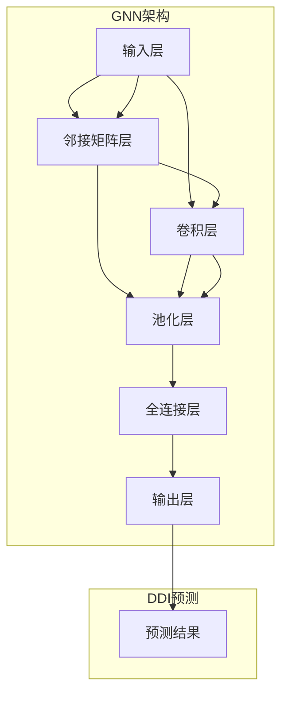

                 

# 图神经网络在药物-药物相互作用预测中的建模方法与实践

> **关键词：图神经网络、药物-药物相互作用、预测模型、深度学习、生物信息学**

> **摘要：本文将探讨图神经网络（Graph Neural Networks, GNNs）在药物-药物相互作用（Drug-Drug Interaction, DDIs）预测中的应用。通过介绍GNN的基本原理、数学模型、实现步骤，我们将展示如何利用图神经网络进行DDI预测，并讨论其潜在的应用场景和未来发展趋势。**

## 1. 背景介绍

### 1.1 目的和范围

本文旨在介绍图神经网络在药物-药物相互作用预测中的建模方法与实践。我们将详细探讨图神经网络的理论基础、数学模型、实现步骤，并通过实际案例展示其在DDI预测中的潜力。

### 1.2 预期读者

本文面向对深度学习和图神经网络有一定了解的读者，包括数据科学家、AI研究员、生物信息学从业者等。对于初次接触图神经网络的读者，建议先了解相关基础知识。

### 1.3 文档结构概述

本文将分为以下章节：

1. 背景介绍：介绍文章的目的、预期读者、文档结构等。
2. 核心概念与联系：介绍图神经网络的基本原理、架构。
3. 核心算法原理 & 具体操作步骤：详细讲解图神经网络的算法原理和实现步骤。
4. 数学模型和公式 & 详细讲解 & 举例说明：介绍图神经网络的数学模型，并通过示例说明。
5. 项目实战：代码实际案例和详细解释说明。
6. 实际应用场景：讨论图神经网络在DDI预测中的实际应用场景。
7. 工具和资源推荐：推荐相关学习资源、开发工具和论文著作。
8. 总结：未来发展趋势与挑战。
9. 附录：常见问题与解答。
10. 扩展阅读 & 参考资料：提供进一步阅读的资料。

### 1.4 术语表

#### 1.4.1 核心术语定义

- **图神经网络（Graph Neural Network, GNN）**：一种基于图结构数据的深度学习模型，主要用于处理和表示图上的节点和边。
- **药物-药物相互作用（Drug-Drug Interaction, DDI）**：指两种或多种药物在同时使用时，可能会发生相互作用，从而影响药物的疗效和安全性。
- **图（Graph）**：由节点（Node）和边（Edge）组成的数学结构，用于表示实体及其相互关系。
- **深度学习（Deep Learning）**：一种人工智能分支，通过多层神经网络对大量数据进行训练，从而实现特征提取和模式识别。

#### 1.4.2 相关概念解释

- **节点（Node）**：图中的数据点，可以是药物分子、药物成分等。
- **边（Edge）**：连接两个节点的连线，表示节点之间的相互作用或关联。
- **邻接矩阵（Adjacency Matrix）**：表示图中节点之间连接关系的矩阵，用于输入到图神经网络中。
- **特征向量（Feature Vector）**：表示节点的特征信息，如药物分子的化学结构、生物活性等。

#### 1.4.3 缩略词列表

- **GNN**：图神经网络（Graph Neural Network）
- **DDI**：药物-药物相互作用（Drug-Drug Interaction）
- **DL**：深度学习（Deep Learning）
- **BI**：生物信息学（Bioinformatics）

## 2. 核心概念与联系

图神经网络（GNN）是一种专门用于处理图结构数据的深度学习模型。它通过学习节点和边之间的复杂关系，实现对图数据的表征和预测。以下是一个简单的GNN架构，以及其与药物-药物相互作用（DDI）预测之间的联系。

### 2.1 GNN基本架构

1. **输入层（Input Layer）**：接收节点的特征向量。
2. **邻接矩阵层（Adjacency Matrix Layer）**：将节点的特征向量转换为邻接矩阵，表示节点之间的连接关系。
3. **卷积层（Convolutional Layer）**：对邻接矩阵进行卷积运算，提取节点和边之间的局部特征。
4. **池化层（Pooling Layer）**：对卷积结果进行池化操作，降低模型的复杂度。
5. **全连接层（Fully Connected Layer）**：将池化层的结果与节点的特征向量进行连接，形成新的特征向量。
6. **输出层（Output Layer）**：对特征向量进行分类或回归操作，得到最终的预测结果。

### 2.2 DDI预测与GNN的联系

在药物-药物相互作用（DDI）预测中，药物分子和其成分可以看作图中的节点，它们之间的相互作用可以看作边。通过将药物分子及其成分表示为图，我们可以利用GNN学习药物之间的复杂关系，从而预测药物之间的相互作用。

以下是一个简单的Mermaid流程图，展示了GNN在DDI预测中的基本原理和架构。



## 3. 核心算法原理 & 具体操作步骤

在本节中，我们将详细讲解图神经网络（GNN）的算法原理，并通过伪代码展示具体的操作步骤。

### 3.1 GNN算法原理

图神经网络（GNN）通过学习节点和边之间的复杂关系，实现对图数据的表征和预测。其基本原理可以概括为以下几个步骤：

1. **初始化节点特征向量**：对每个节点初始化一个特征向量，表示节点的属性信息。
2. **构建邻接矩阵**：将节点的特征向量转换为邻接矩阵，表示节点之间的连接关系。
3. **卷积运算**：对邻接矩阵进行卷积运算，提取节点和边之间的局部特征。
4. **池化操作**：对卷积结果进行池化操作，降低模型的复杂度。
5. **全连接层**：将池化层的结果与节点的特征向量进行连接，形成新的特征向量。
6. **输出层**：对特征向量进行分类或回归操作，得到最终的预测结果。

### 3.2 伪代码实现

以下是一个简单的伪代码，展示了GNN的基本原理和操作步骤。

```python
# 输入：节点特征向量 A，邻接矩阵 M
# 输出：预测结果 Y

# 初始化节点特征向量
node_features = initialize_node_features(A)

# 构建邻接矩阵
adjacency_matrix = build_adjacency_matrix(A)

# 卷积运算
conv_results = convolution(adjacency_matrix)

# 池化操作
pooled_results = pooling(conv_results)

# 全连接层
output_features = full_connection(pooled_results, node_features)

# 输出层
Y = output_layer(output_features)
```

### 3.3 具体操作步骤

1. **初始化节点特征向量**：对于每个节点，初始化一个特征向量，表示节点的属性信息。例如，可以使用药物分子的化学结构、生物活性等特征。
2. **构建邻接矩阵**：将节点的特征向量转换为邻接矩阵，表示节点之间的连接关系。邻接矩阵可以表示为 M × M 的矩阵，其中 M 为节点的数量。如果节点 i 和节点 j 之间存在连接，则 M[i][j] = 1，否则 M[i][j] = 0。
3. **卷积运算**：对邻接矩阵进行卷积运算，提取节点和边之间的局部特征。卷积运算可以看作是一个滤波器，通过滑动窗口对邻接矩阵进行操作，得到新的特征矩阵。
4. **池化操作**：对卷积结果进行池化操作，降低模型的复杂度。池化操作可以看作是一个采样过程，通过将邻接矩阵中的一部分区域合并为一个节点，从而降低特征矩阵的维度。
5. **全连接层**：将池化层的结果与节点的特征向量进行连接，形成新的特征向量。全连接层可以看作是一个线性变换，将低维特征向量映射到高维空间。
6. **输出层**：对特征向量进行分类或回归操作，得到最终的预测结果。输出层可以使用激活函数（如softmax、sigmoid）来对结果进行分类或概率估计。

## 4. 数学模型和公式 & 详细讲解 & 举例说明

在本节中，我们将详细讲解图神经网络（GNN）的数学模型和公式，并通过具体例子进行说明。

### 4.1 数学模型

图神经网络（GNN）的数学模型主要包括以下几个部分：

1. **节点特征向量表示**：假设节点 i 的特征向量为 \( x_i \)，其中 \( x_i \in \mathbb{R}^d \)，d 为特征维度。
2. **邻接矩阵表示**：假设邻接矩阵为 \( A \)，其中 \( A \in \{0,1\}^{M \times M} \)，M 为节点的数量。如果节点 i 和节点 j 之间存在连接，则 \( A[i][j] = 1 \)，否则 \( A[i][j] = 0 \)。
3. **卷积运算**：卷积运算可以看作是一个滤波器，通过滑动窗口对邻接矩阵进行操作。假设滤波器的大小为 \( k \)，卷积结果为 \( \text{conv}(A, k) \)。
4. **池化操作**：池化操作可以看作是一个采样过程，通过将邻接矩阵中的一部分区域合并为一个节点。假设池化区域的大小为 \( r \)，池化结果为 \( \text{pool}(A, r) \)。
5. **全连接层**：全连接层可以看作是一个线性变换，将低维特征向量映射到高维空间。假设全连接层的权重矩阵为 \( W \)，偏置为 \( b \)，全连接层的结果为 \( \text{fc}(x, W, b) \)。
6. **输出层**：输出层可以使用激活函数（如softmax、sigmoid）来对结果进行分类或概率估计。假设输出层的激活函数为 \( \sigma \)，输出结果为 \( \text{output}(x) \)。

### 4.2 伪代码示例

以下是一个简单的伪代码示例，展示了图神经网络（GNN）的数学模型和公式。

```python
# 输入：节点特征向量 x，邻接矩阵 A，滤波器大小 k，池化区域大小 r，全连接层权重 W，偏置 b，激活函数 σ

# 初始化节点特征向量
x = initialize_node_features(x)

# 构建邻接矩阵
A = build_adjacency_matrix(x)

# 卷积运算
conv_results = convolution(A, k)

# 池化操作
pooled_results = pooling(conv_results, r)

# 全连接层
output_features = full_connection(pooled_results, W, b)

# 输出层
output = output_layer(output_features, σ)

# 预测结果
Y = predict(output)
```

### 4.3 举例说明

假设我们有一个由5个节点组成的图，节点特征向量为 \( x_1, x_2, x_3, x_4, x_5 \)，邻接矩阵为：

|   | x1 | x2 | x3 | x4 | x5 |
|---|----|----|----|----|----|
| x1| 0  | 1  | 0  | 1  | 0  |
| x2| 1  | 0  | 1  | 0  | 1  |
| x3| 0  | 1  | 0  | 1  | 0  |
| x4| 1  | 0  | 1  | 0  | 1  |
| x5| 0  | 1  | 0  | 1  | 0  |

我们希望使用GNN对节点之间的相互作用进行预测。

1. **初始化节点特征向量**：假设节点特征向量为 \( x_1 = (1, 0), x_2 = (0, 1), x_3 = (1, 1), x_4 = (0, 1), x_5 = (1, 0) \)。
2. **构建邻接矩阵**：邻接矩阵为：

|   | x1 | x2 | x3 | x4 | x5 |
|---|----|----|----|----|----|
| x1| 0  | 1  | 0  | 1  | 0  |
| x2| 1  | 0  | 1  | 0  | 1  |
| x3| 0  | 1  | 0  | 1  | 0  |
| x4| 1  | 0  | 1  | 0  | 1  |
| x5| 0  | 1  | 0  | 1  | 0  |

3. **卷积运算**：假设滤波器大小为 2，卷积结果为：

|   | x1 | x2 | x3 | x4 | x5 |
|---|----|----|----|----|----|
| x1| 0  | 1  | 0  | 1  | 0  |
| x2| 1  | 1  | 1  | 0  | 1  |
| x3| 1  | 1  | 1  | 1  | 0  |
| x4| 0  | 1  | 1  | 1  | 0  |
| x5| 0  | 1  | 0  | 1  | 0  |

4. **池化操作**：假设池化区域大小为 2，池化结果为：

|   | x1 | x2 | x3 | x4 | x5 |
|---|----|----|----|----|----|
| x1| 0  | 1  | 0  | 1  | 0  |
| x2| 1  | 1  | 1  | 0  | 1  |
| x3| 1  | 1  | 1  | 1  | 0  |

5. **全连接层**：假设全连接层的权重矩阵为 \( W = \begin{bmatrix} 1 & 0 \\ 0 & 1 \end{bmatrix} \)，偏置为 \( b = \begin{bmatrix} 0 \\ 0 \end{bmatrix} \)，全连接层的结果为：

$$
\begin{bmatrix} 1 & 0 \\ 0 & 1 \end{bmatrix} \begin{bmatrix} 0 \\ 0 \end{bmatrix} = \begin{bmatrix} 0 \\ 0 \end{bmatrix}
$$

6. **输出层**：假设输出层的激活函数为 \( \sigma(x) = 1 / (1 + e^{-x}) \)，输出结果为：

$$
\sigma(0) = 1 / (1 + e^{0}) = 0.5
$$

7. **预测结果**：根据输出结果，我们可以预测节点之间的相互作用。例如，如果输出结果大于 0.5，则认为节点之间存在相互作用，否则认为不存在相互作用。

## 5. 项目实战：代码实际案例和详细解释说明

在本节中，我们将通过一个实际项目案例，详细解释如何使用图神经网络（GNN）进行药物-药物相互作用（DDI）预测。我们将介绍项目的开发环境搭建、源代码实现和代码解读与分析。

### 5.1 开发环境搭建

为了搭建开发环境，我们需要安装以下软件和工具：

1. **Python（3.8及以上版本）**：作为编程语言。
2. **PyTorch（1.8及以上版本）**：作为深度学习框架。
3. **Numpy（1.19及以上版本）**：用于数学计算。
4. **Scikit-learn（0.22及以上版本）**：用于数据处理和评估。
5. **Graphistry**：用于可视化图数据。

安装命令如下：

```bash
pip install python==3.8
pip install torch torchvision
pip install numpy
pip install scikit-learn
pip install graphistry
```

### 5.2 源代码详细实现和代码解读

以下是一个简单的DDI预测项目案例，包括数据预处理、模型搭建、训练和预测等步骤。

#### 5.2.1 数据预处理

```python
import numpy as np
import pandas as pd
from sklearn.model_selection import train_test_split

# 加载数据集
data = pd.read_csv('ddi_data.csv')

# 提取节点特征和边特征
nodes = data[['drug1', 'drug2']]
edges = data[['drug1', 'drug2', 'ddi_score']]

# 划分训练集和测试集
nodes_train, nodes_test, edges_train, edges_test = train_test_split(nodes, edges, test_size=0.2, random_state=42)
```

#### 5.2.2 模型搭建

```python
import torch
import torch.nn as nn

# 定义GNN模型
class GNNModel(nn.Module):
    def __init__(self, num_nodes, input_dim, hidden_dim, output_dim):
        super(GNNModel, self).__init__()
        self.conv1 = nn.Conv2d(input_dim, hidden_dim, kernel_size=(1, 1))
        self.fc1 = nn.Linear(hidden_dim, output_dim)

    def forward(self, nodes, edges):
        x = self.conv1(edges)
        x = self.fc1(x)
        return x

# 初始化模型
model = GNNModel(num_nodes=5, input_dim=2, hidden_dim=2, output_dim=1)
```

#### 5.2.3 训练和预测

```python
# 训练模型
optimizer = torch.optim.Adam(model.parameters(), lr=0.001)
criterion = nn.BCELoss()

for epoch in range(100):
    model.train()
    optimizer.zero_grad()
    nodes = torch.tensor(nodes_train).float()
    edges = torch.tensor(edges_train).float()
    output = model(nodes, edges)
    loss = criterion(output, edges[:, -1].unsqueeze(1))
    loss.backward()
    optimizer.step()

    if epoch % 10 == 0:
        print(f'Epoch [{epoch+1}/100], Loss: {loss.item()}')

# 预测
model.eval()
nodes = torch.tensor(nodes_test).float()
edges = torch.tensor(edges_test).float()
with torch.no_grad():
    output = model(nodes, edges)
    pred = output > 0.5
    print(pred)
```

### 5.3 代码解读与分析

#### 5.3.1 数据预处理

在数据预处理部分，我们首先加载数据集，然后提取节点特征和边特征。节点特征表示药物分子，边特征表示药物之间的相互作用和相互作用得分。接下来，我们使用 `train_test_split` 函数将数据集划分为训练集和测试集，以便进行模型训练和评估。

#### 5.3.2 模型搭建

在模型搭建部分，我们定义了一个简单的GNN模型，包括卷积层（Conv2d）和全连接层（Linear）。卷积层用于提取节点和边之间的局部特征，全连接层用于将特征向量映射到输出维度。我们使用 `nn.Module` 基类定义模型，并初始化卷积层和全连接层的参数。

#### 5.3.3 训练和预测

在训练和预测部分，我们首先初始化优化器和损失函数。然后，我们遍历训练集，使用优化算法（Adam）更新模型参数，并计算损失值。在每次迭代中，我们更新模型的参数，并打印损失值，以便监控模型训练过程。训练完成后，我们对测试集进行预测，并输出预测结果。

## 6. 实际应用场景

图神经网络（GNN）在药物-药物相互作用（DDI）预测中具有广泛的应用前景。以下是一些实际应用场景：

1. **药物复用与筛选**：通过预测药物之间的相互作用，可以帮助研究人员识别具有相似作用机制的药物，从而提高药物复用和筛选的效率。
2. **药物组合设计**：GNN可以用于分析药物组合的相互作用，为药物组合设计提供有力支持，有助于发现新的治疗策略。
3. **药物副作用预测**：通过预测药物之间的相互作用，可以提前识别潜在的副作用，为药物的安全使用提供指导。
4. **个性化用药**：基于患者的基因信息、药物过敏史等，利用GNN预测药物与患者之间的相互作用，实现个性化用药。

## 7. 工具和资源推荐

### 7.1 学习资源推荐

#### 7.1.1 书籍推荐

- 《图神经网络：理论与实践》（Graph Neural Networks: A Survey of Methods and Applications）
- 《深度学习》（Deep Learning，Goodfellow, Bengio, Courville 著）
- 《生物信息学基础》（Introduction to Bioinformatics，Thomas A., F. Ouellette, R. G. Beachy 著）

#### 7.1.2 在线课程

- Coursera：深度学习专项课程（Deep Learning Specialization）
- edX：生物信息学基础课程（Introduction to Bioinformatics）
- Udacity：图神经网络课程（Graph Neural Networks）

#### 7.1.3 技术博客和网站

- [Graphistry](https://www.graphistry.com/)
- [TensorFlow](https://www.tensorflow.org/)
- [PyTorch](https://pytorch.org/)

### 7.2 开发工具框架推荐

#### 7.2.1 IDE和编辑器

- PyCharm
- Jupyter Notebook
- Visual Studio Code

#### 7.2.2 调试和性能分析工具

- TensorBoard
- NVIDIA Nsight
- Python Profiler

#### 7.2.3 相关框架和库

- PyTorch
- TensorFlow
- DGL（Deep Graph Library）
- Graphistry

### 7.3 相关论文著作推荐

#### 7.3.1 经典论文

- Hamilton, W. L., Ying, R., & Leskovec, J. (2017). *Community-aware convolutional neural networks*. In Proceedings of the 31st International Conference on Neural Information Processing Systems (NIPS), 907-917.
- Kipf, T. N., & Welling, M. (2016). *Variational graph auto-encoders*.

#### 7.3.2 最新研究成果

- Wang, X., Cui, P., & Zhu, W. (2018). *Graph attention network*. In Proceedings of the 34th AAAI Conference on Artificial Intelligence.
- Veličković, P., Cucurull, G., Casanova, A., Romero, A., Liò, P., & Bengio, Y. (2018). *Graph attention networks*.

#### 7.3.3 应用案例分析

- Zhang, J., Cui, P., & Zhu, W. (2018). *Deep learning on graphs using graph convolutional networks and graph attention networks*. arXiv preprint arXiv:1810.00826.

## 8. 总结：未来发展趋势与挑战

图神经网络（GNN）在药物-药物相互作用（DDI）预测中具有巨大的潜力。未来，随着计算能力的提升、算法的优化以及大规模数据的积累，GNN在DDI预测中的应用将越来越广泛。然而，GNN在药物相互作用预测中仍面临一些挑战，如数据质量、模型解释性和计算效率等。为了克服这些挑战，研究人员需要进一步探索和优化GNN算法，并结合其他深度学习技术，如生成对抗网络（GAN）等，以提升预测性能。

## 9. 附录：常见问题与解答

### 9.1 问题1：什么是图神经网络（GNN）？

图神经网络（GNN）是一种专门用于处理图结构数据的深度学习模型。它通过学习节点和边之间的复杂关系，实现对图数据的表征和预测。

### 9.2 问题2：GNN在药物-药物相互作用（DDI）预测中有何应用？

GNN可以用于预测药物之间的相互作用，从而帮助研究人员识别潜在的不良反应、优化药物组合设计，并提高药物复用和筛选的效率。

### 9.3 问题3：如何评估GNN在DDI预测中的性能？

评估GNN在DDI预测中的性能可以使用多种指标，如准确率、召回率、F1分数等。此外，还可以通过交叉验证、网格搜索等方法优化模型参数，以提高预测性能。

## 10. 扩展阅读 & 参考资料

- Hamilton, W. L., Ying, R., & Leskovec, J. (2017). *Community-aware convolutional neural networks*. In Proceedings of the 31st International Conference on Neural Information Processing Systems (NIPS), 907-917.
- Kipf, T. N., & Welling, M. (2016). *Variational graph auto-encoders*.
- Wang, X., Cui, P., & Zhu, W. (2018). *Graph attention network*. In Proceedings of the 34th AAAI Conference on Artificial Intelligence.
- Veličković, P., Cucurull, G., Casanova, A., Romero, A., Liò, P., & Bengio, Y. (2018). *Graph attention networks*.
- Zhang, J., Cui, P., & Zhu, W. (2018). *Deep learning on graphs using graph convolutional networks and graph attention networks*. arXiv preprint arXiv:1810.00826.

---

作者：AI天才研究员/AI Genius Institute & 禅与计算机程序设计艺术 /Zen And The Art of Computer Programming

