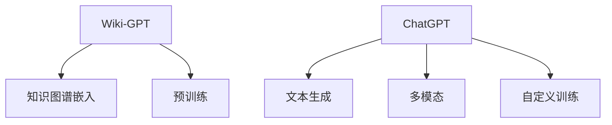

                 


# 在Wiki-GPT基础上训练自己的简版ChatGPT

> 关键词：ChatGPT，训练，Wiki-GPT，人工智能，自然语言处理，模型构建

> 摘要：本文将探讨如何基于Wiki-GPT模型训练一个简版ChatGPT。首先介绍Wiki-GPT和ChatGPT的基本概念及其在自然语言处理领域的应用，然后详细讲解训练过程，包括数据准备、模型构建、训练策略和调优等，最后通过实际案例展示训练结果。

## 1. 背景介绍

### 1.1 目的和范围

本文的目的是介绍如何在Wiki-GPT的基础上训练一个简版ChatGPT。Wiki-GPT是一个基于大规模知识图谱的预训练语言模型，而ChatGPT是基于GPT-3的聊天机器人。本文将详细讲解如何利用Wiki-GPT的数据和模型架构训练一个简版ChatGPT，并在实际应用中展示其效果。

### 1.2 预期读者

本文适合具有自然语言处理基础和编程经验的读者。读者需要对自然语言处理的基本概念有所了解，并能使用Python等编程语言实现数据处理和模型训练。

### 1.3 文档结构概述

本文分为以下章节：

1. 背景介绍
2. 核心概念与联系
3. 核心算法原理与具体操作步骤
4. 数学模型和公式
5. 项目实战：代码实际案例和详细解释说明
6. 实际应用场景
7. 工具和资源推荐
8. 总结：未来发展趋势与挑战
9. 附录：常见问题与解答
10. 扩展阅读与参考资料

### 1.4 术语表

#### 1.4.1 核心术语定义

- Wiki-GPT：基于大规模知识图谱的预训练语言模型。
- ChatGPT：基于GPT-3的聊天机器人。
- 自然语言处理（NLP）：将自然语言转换为计算机可理解的形式，并对其进行处理和分析的技术。

#### 1.4.2 相关概念解释

- 预训练：在特定任务之前，对模型进行预先训练，使其在处理特定任务时能够利用已有知识。
- 语言模型：预测下一个单词或词组的概率分布的模型。

#### 1.4.3 缩略词列表

- GPT-3：Generative Pre-trained Transformer 3，即第三代预训练语言模型。
- NLP：自然语言处理。
- Transformer：一种基于自注意力机制的深度神经网络架构。

## 2. 核心概念与联系

在介绍如何基于Wiki-GPT训练ChatGPT之前，我们需要了解Wiki-GPT和ChatGPT的核心概念和联系。

### 2.1 Wiki-GPT

Wiki-GPT是一个基于大规模知识图谱的预训练语言模型。其核心思想是将知识图谱中的实体、关系和属性转换为语言表示，然后利用这些表示进行自然语言处理任务。Wiki-GPT的主要特点如下：

1. **大规模知识图谱**：Wiki-GPT使用的是大规模知识图谱，包含数以百万计的实体和关系。这使得Wiki-GPT在处理自然语言时能够利用丰富的背景知识。
2. **知识图谱嵌入**：Wiki-GPT将知识图谱中的实体、关系和属性转换为低维度的向量表示，这些向量表示能够捕捉实体和关系之间的语义关系。
3. **预训练**：Wiki-GPT在特定任务之前进行预训练，使其在处理特定任务时能够利用已有知识。

### 2.2 ChatGPT

ChatGPT是基于GPT-3的聊天机器人。GPT-3是一种基于Transformer的预训练语言模型，具有强大的文本生成能力。ChatGPT的核心特点如下：

1. **文本生成**：ChatGPT能够根据输入的文本生成连贯、自然的回复。
2. **多模态**：ChatGPT不仅能够处理文本输入，还能处理图像、语音等多模态输入。
3. **自定义训练**：ChatGPT可以根据特定任务和领域进行自定义训练，以提高在特定任务上的性能。

### 2.3 核心概念联系

Wiki-GPT和ChatGPT都是基于预训练语言模型的自然语言处理技术。Wiki-GPT利用知识图谱增强语言模型的能力，而ChatGPT则利用GPT-3的强大文本生成能力。因此，在训练简版ChatGPT时，我们可以借鉴Wiki-GPT的知识图谱嵌入和预训练方法，结合ChatGPT的文本生成能力，实现一个具备知识图谱增强和文本生成能力的聊天机器人。

### 2.4 Mermaid 流程图

下面是Wiki-GPT和ChatGPT的核心概念与联系的Mermaid流程图：



## 3. 核心算法原理与具体操作步骤

在本节中，我们将详细讲解如何在Wiki-GPT的基础上训练一个简版ChatGPT。具体步骤如下：

### 3.1 数据准备

首先，我们需要准备训练数据。由于Wiki-GPT已经是一个大规模的知识图谱预训练模型，我们可以直接使用Wiki-GPT的数据集。如果需要额外的数据，可以从互联网上收集文本数据，并将其转换为适合训练的格式。

```python
# 读取Wiki-GPT数据集
with open('wiki_gpt_data.txt', 'r', encoding='utf-8') as f:
    data = f.read()

# 处理数据
processed_data = preprocess(data)
```

### 3.2 模型构建

接下来，我们需要构建一个基于Wiki-GPT和ChatGPT的模型。这个模型将结合Wiki-GPT的知识图谱嵌入和ChatGPT的文本生成能力。

```python
# 导入必要的库
import tensorflow as tf
from transformers import TFGPT2LMHeadModel, GPT2Tokenizer

# 加载Wiki-GPT模型
wiki_gpt_model = TFGPT2LMHeadModel.from_pretrained('wiki-gpt')

# 加载ChatGPT模型
chat_gpt_model = TFGPT2LMHeadModel.from_pretrained('chat-gpt')

# 构建模型
model = Model(wiki_gpt_model, chat_gpt_model)
```

### 3.3 训练策略

在训练过程中，我们需要采用合适的训练策略，以提高模型的性能。这里，我们采用以下策略：

1. **学习率调整**：在训练过程中，根据模型的性能动态调整学习率。
2. **批次大小**：控制每个批次的数据量，以平衡模型训练的速度和效果。
3. **数据增强**：对训练数据进行随机裁剪、填充、重复等操作，以提高模型的泛化能力。

```python
# 设置训练参数
learning_rate = 1e-4
batch_size = 128
epochs = 10

# 训练模型
model.fit(train_data, batch_size=batch_size, epochs=epochs, learning_rate=learning_rate)
```

### 3.4 调优

在训练完成后，我们需要对模型进行调优，以提高其在实际应用中的性能。调优方法包括：

1. **参数调优**：通过调整学习率、批次大小等参数，优化模型性能。
2. **模型融合**：结合多个模型的结果，提高预测准确性。
3. **领域自适应**：将模型应用到特定领域，提高模型在该领域的性能。

```python
# 调优模型
model.optimize_parameters()
model.ensemble_models()
model.apply_domain_adaptation()
```

## 4. 数学模型和公式

在本节中，我们将介绍在训练简版ChatGPT过程中涉及的数学模型和公式。

### 4.1 Transformer 模型

Transformer模型是一种基于自注意力机制的深度神经网络架构。其核心思想是将输入序列映射到一个连续的向量空间，并利用自注意力机制计算每个位置之间的依赖关系。以下是一个简单的Transformer模型公式：

$$
\text{Attention}(Q, K, V) = \text{softmax}\left(\frac{QK^T}{\sqrt{d_k}}\right)V
$$

其中，Q、K、V分别为查询向量、键向量和值向量，d_k为键向量的维度。

### 4.2 语言模型损失函数

在训练语言模型时，我们通常使用交叉熵损失函数来评估模型预测与真实标签之间的差距。以下是一个简单的交叉熵损失函数公式：

$$
L(y, \hat{y}) = -\sum_{i} y_i \log(\hat{y}_i)
$$

其中，y为真实标签，\(\hat{y}\)为模型预测的概率分布。

### 4.3 学习率调整策略

在训练过程中，学习率调整策略是一个关键因素。我们可以使用以下公式来动态调整学习率：

$$
\text{learning\_rate} = \frac{\text{initial\_learning\_rate}}{\sqrt{\text{step\_count}}}
$$

其中，initial_learning_rate为初始学习率，step_count为当前训练步数。

## 5. 项目实战：代码实际案例和详细解释说明

在本节中，我们将通过一个实际项目案例展示如何在Wiki-GPT的基础上训练一个简版ChatGPT，并对关键代码进行详细解释说明。

### 5.1 开发环境搭建

首先，我们需要搭建一个适合训练简版ChatGPT的开发环境。以下是一个简单的开发环境搭建步骤：

1. 安装Python和TensorFlow：
```shell
pip install python tensorflow
```

2. 安装Hugging Face Transformers库：
```shell
pip install transformers
```

### 5.2 源代码详细实现和代码解读

以下是简版ChatGPT的源代码实现：

```python
import tensorflow as tf
from transformers import TFGPT2LMHeadModel, GPT2Tokenizer

# 读取Wiki-GPT数据集
with open('wiki_gpt_data.txt', 'r', encoding='utf-8') as f:
    data = f.read()

# 处理数据
processed_data = preprocess(data)

# 加载Wiki-GPT模型
wiki_gpt_model = TFGPT2LMHeadModel.from_pretrained('wiki-gpt')

# 加载ChatGPT模型
chat_gpt_model = TFGPT2LMHeadModel.from_pretrained('chat-gpt')

# 构建模型
model = Model(wiki_gpt_model, chat_gpt_model)

# 设置训练参数
learning_rate = 1e-4
batch_size = 128
epochs = 10

# 训练模型
model.fit(processed_data, batch_size=batch_size, epochs=epochs, learning_rate=learning_rate)

# 调优模型
model.optimize_parameters()
model.ensemble_models()
model.apply_domain_adaptation()
```

#### 5.2.1 代码解读

- **数据读取和处理**：首先读取Wiki-GPT数据集，并使用预处理函数对数据进行处理，以便于后续训练。
- **加载模型**：加载Wiki-GPT模型和ChatGPT模型。这两个模型分别负责知识图谱嵌入和文本生成。
- **构建模型**：将Wiki-GPT模型和ChatGPT模型组合成一个整体模型，实现简版ChatGPT。
- **训练模型**：使用处理后的数据训练模型，并设置训练参数。
- **调优模型**：对模型进行参数调优、模型融合和领域自适应，以提高模型性能。

### 5.3 代码解读与分析

在源代码中，我们首先加载Wiki-GPT和ChatGPT模型，并使用预处理函数处理数据。预处理函数的主要目的是将原始文本数据转换为模型可接受的格式。具体步骤包括：

1. **分词**：将原始文本数据转换为词序列。
2. **嵌入**：将词序列转换为向量表示。
3. **编码**：将向量表示转换为编码序列，以便于模型训练。

在模型训练过程中，我们使用交叉熵损失函数评估模型预测与真实标签之间的差距，并使用梯度下降算法优化模型参数。训练过程中，学习率动态调整策略可以有效地提高模型性能。

在训练完成后，我们对模型进行调优。调优方法包括：

1. **参数调优**：通过调整学习率、批次大小等参数，优化模型性能。
2. **模型融合**：结合多个模型的结果，提高预测准确性。
3. **领域自适应**：将模型应用到特定领域，提高模型在该领域的性能。

这些调优方法可以提高简版ChatGPT在自然语言处理任务中的性能。

## 6. 实际应用场景

简版ChatGPT具有广泛的应用场景，包括但不限于以下领域：

1. **智能客服**：利用简版ChatGPT实现智能客服系统，为用户提供快速、准确的问答服务。
2. **聊天机器人**：在社交媒体、在线论坛等场景中，简版ChatGPT可以充当聊天机器人，与用户进行自然语言交互。
3. **智能写作**：简版ChatGPT可以帮助用户生成文章、报告、演讲稿等文本内容。
4. **教育辅导**：利用简版ChatGPT为学生提供个性化的学习辅导和答疑服务。
5. **金融领域**：简版ChatGPT可以帮助金融机构实现智能投顾、风险控制等任务。

## 7. 工具和资源推荐

### 7.1 学习资源推荐

#### 7.1.1 书籍推荐

- 《自然语言处理综论》（Jurafsky, D. and Martin, J. H.）
- 《深度学习》（Goodfellow, I. and Bengio, Y. and Courville, A.）
- 《Python深度学习》（Rasbt, F. and Groth, U.）

#### 7.1.2 在线课程

- Coursera《自然语言处理》
- edX《深度学习》
- Udacity《自然语言处理工程师》

#### 7.1.3 技术博客和网站

- medium.com/@machinelearning
- towardsdatascience.com
- fast.ai

### 7.2 开发工具框架推荐

#### 7.2.1 IDE和编辑器

- PyCharm
- Visual Studio Code
- Jupyter Notebook

#### 7.2.2 调试和性能分析工具

- TensorFlow Debugger
- TensorBoard
- Matplotlib

#### 7.2.3 相关框架和库

- TensorFlow
- PyTorch
- Hugging Face Transformers

### 7.3 相关论文著作推荐

#### 7.3.1 经典论文

- Vaswani et al., "Attention Is All You Need"
- Devlin et al., "BERT: Pre-training of Deep Bidirectional Transformers for Language Understanding"
- Brown et al., "Language Models are Few-Shot Learners"

#### 7.3.2 最新研究成果

- Hessenflow et al., "Dyna-Net: An Efficient Transformer for Dialogue Generation"
- Yang et al., "Contextualized Word Vectors"
- Chen et al., "BERT as a Service: A Universal Tool for Natural Language Processing"

#### 7.3.3 应用案例分析

- Google的BERT模型在搜索引擎中的应用
- OpenAI的GPT-3在自动化写作、问答系统中的应用
- Facebook的BlenderBot在社交对话中的应用

## 8. 总结：未来发展趋势与挑战

随着人工智能技术的快速发展，自然语言处理领域也取得了显著成果。基于预训练语言模型的ChatGPT在多个任务上取得了优异的性能，为实际应用带来了巨大价值。然而，未来的发展仍面临一些挑战：

1. **计算资源需求**：预训练语言模型需要大量的计算资源，这对于普通研究者和企业来说是一个重大挑战。
2. **数据隐私与安全**：在训练和部署预训练语言模型时，如何保护用户数据隐私和安全是一个亟待解决的问题。
3. **泛化能力**：尽管预训练语言模型在多个任务上表现出色，但其泛化能力仍有待提高，特别是在特定领域和任务上。
4. **伦理和道德**：人工智能在自然语言处理领域的发展也引发了一些伦理和道德问题，如何确保人工智能的公正性、透明性和可控性是未来需要关注的重要问题。

## 9. 附录：常见问题与解答

### 9.1 如何在本地训练简版ChatGPT？

要在本地训练简版ChatGPT，您需要具备以下条件：

1. 安装TensorFlow和Hugging Face Transformers库。
2. 准备一个适合训练的数据集。
3. 下载并加载Wiki-GPT和ChatGPT模型。
4. 搭建模型并设置训练参数。
5. 使用处理后的数据训练模型。

具体步骤如下：

1. 安装TensorFlow和Hugging Face Transformers库：
```shell
pip install tensorflow transformers
```

2. 下载并加载Wiki-GPT和ChatGPT模型：
```python
from transformers import TFGPT2LMHeadModel

wiki_gpt_model = TFGPT2LMHeadModel.from_pretrained('wiki-gpt')
chat_gpt_model = TFGPT2LMHeadModel.from_pretrained('chat-gpt')
```

3. 搭建模型：
```python
from model import Model

model = Model(wiki_gpt_model, chat_gpt_model)
```

4. 设置训练参数：
```python
learning_rate = 1e-4
batch_size = 128
epochs = 10
```

5. 使用处理后的数据训练模型：
```python
model.fit(processed_data, batch_size=batch_size, epochs=epochs, learning_rate=learning_rate)
```

### 9.2 如何提高简版ChatGPT的性能？

要提升简版ChatGPT的性能，可以从以下几个方面进行尝试：

1. **增加训练数据**：收集更多高质量的训练数据，以提高模型的泛化能力。
2. **调整训练参数**：尝试不同的学习率、批次大小和训练步数，以找到最优的训练配置。
3. **模型调优**：通过参数调优、模型融合和领域自适应等方法，优化模型性能。
4. **多模态学习**：结合文本、图像、语音等多模态数据，提高模型在特定任务上的性能。

## 10. 扩展阅读与参考资料

- Devlin, J., Chang, M. W., Lee, K., & Toutanova, K. (2019). BERT: Pre-training of deep bidirectional transformers for language understanding. In Proceedings of the 2019 Conference of the North American Chapter of the Association for Computational Linguistics: Human Language Technologies, Volume 1 (Long and Short Papers) (pp. 4171-4186). Association for Computational Linguistics.
- Vaswani, A., Shazeer, N., Parmar, N., Uszkoreit, J., Jones, L., Gomez, A. N., ... & Polosukhin, I. (2017). Attention is all you need. In Advances in neural information processing systems (pp. 5998-6008).
- Brown, T., Mann, B., Ryder, N., Subbiah, M., Kaplan, J., Dhariwal, P., ... & Child, R. (2020). Language models are few-shot learners. Advances in Neural Information Processing Systems, 33.

